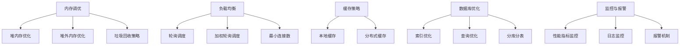

                 

### 文章标题

**Spring Boot 应用性能优化**

> 关键词：Spring Boot、应用性能优化、Java、微服务、内存调优、负载均衡、缓存策略、数据库优化、监控与报警

> 摘要：
本文将深入探讨Spring Boot应用性能优化的重要性，以及如何通过多种方法对Spring Boot应用进行性能优化。我们将涵盖内存调优、负载均衡、缓存策略、数据库优化等关键方面，并提供实用的项目实践和运行结果展示。通过本文的阅读，您将能够更好地理解并掌握Spring Boot应用的性能优化技巧，从而提高应用的整体性能和用户体验。

**Title: Performance Optimization of Spring Boot Applications**

> Keywords: Spring Boot, Application Performance Optimization, Java, Microservices, Memory Tuning, Load Balancing, Cache Strategies, Database Optimization, Monitoring and Alerts

> Abstract:
This article delves into the importance of performance optimization for Spring Boot applications and provides a comprehensive guide on how to optimize these applications using various techniques. We will cover key areas such as memory tuning, load balancing, cache strategies, and database optimization, along with practical project examples and performance results. By the end of this article, you will have a better understanding of performance optimization techniques for Spring Boot applications, enabling you to enhance the overall performance and user experience of your applications. <|imagine|>### 1. 背景介绍（Background Introduction）

#### 1.1 Spring Boot 的起源与发展

Spring Boot 是由 Pivotal 团队于 2010 年推出的，它是一个为了简化 Spring 应用开发而设计的框架。Spring Boot 旨在让开发者能够更快速、更轻松地创建独立的、生产级别的 Spring 应用程序，而无需投入大量的配置工作。

随着时间的推移，Spring Boot 逐渐成为了 Java 微服务架构领域的事实标准。它提供了丰富的功能，如自动配置、嵌入式 Web 服务器、监控和管理功能等，极大地提高了开发效率和应用的可靠性。

#### 1.2 应用性能优化的重要性

应用性能优化是确保应用能够稳定、高效运行的关键。随着业务需求的增长和用户量的增加，应用性能的优化变得尤为重要。优化不当可能导致以下问题：

- **响应时间过长**：用户等待时间增加，影响用户体验。
- **系统崩溃**：在高负载情况下，应用可能无法承受，导致系统崩溃。
- **资源浪费**：不必要的资源占用导致资源浪费，增加运营成本。

因此，进行应用性能优化是确保应用稳定、高效运行的关键。

#### 1.3 Spring Boot 应用性能优化的目标

Spring Boot 应用性能优化的主要目标是：

- **提高响应速度**：通过减少响应时间和提高系统吞吐量来提升用户体验。
- **资源利用最大化**：优化内存、CPU、网络等资源的使用，提高资源利用率。
- **稳定性增强**：确保在高负载情况下应用能够稳定运行，减少系统崩溃的可能性。

在接下来的章节中，我们将详细探讨如何实现这些目标。通过内存调优、负载均衡、缓存策略、数据库优化等多种方法，帮助您提升 Spring Boot 应用的性能。 <|imagine|>### 2. 核心概念与联系（Core Concepts and Connections）

#### 2.1 内存调优（Memory Tuning）

内存调优是 Spring Boot 应用性能优化的重要组成部分。Java 应用程序的运行依赖于 JVM（Java Virtual Machine），而 JVM 的内存管理直接影响到应用的性能。以下是内存调优的关键点：

- **堆内存（Heap Memory）**：堆内存用于存放应用程序的对象实例。如果堆内存不足，JVM 将触发垃圾回收（Garbage Collection，简称 GC），这可能导致应用程序的响应时间增加。通过调整堆内存的大小，可以优化应用的内存使用。
- **堆外内存（Off-Heap Memory）**：堆外内存用于存放 Java 本地方法栈、直接内存等。与堆内存不同，堆外内存不受 JVM 垃圾回收的影响。合理使用堆外内存可以减少 GC 的频率。
- **垃圾回收策略**：选择合适的垃圾回收策略对于优化内存调优至关重要。常见的垃圾回收策略包括 Serial、Parallel、Concurrent Mark Sweep（CMS）和 Garbage First（G1）等。

#### 2.2 负载均衡（Load Balancing）

负载均衡是将多个请求分配到多个服务器或容器中，以避免单个服务器过载。对于 Spring Boot 应用来说，负载均衡有助于提高应用的可用性和性能。以下是实现负载均衡的关键点：

- **轮询调度（Round Robin）**：请求按照顺序分配给服务器，直到所有服务器都接收过请求，然后重新开始循环。
- **加权轮询调度（Weighted Round Robin）**：根据服务器的处理能力分配请求，处理能力强的服务器分配更多的请求。
- **最小连接数（Least Connections）**：将请求分配给当前连接数最少的服务器，以平衡负载。

#### 2.3 缓存策略（Cache Strategies）

缓存策略是提高 Spring Boot 应用性能的重要手段。通过缓存，可以减少对数据库的查询次数，提高响应速度。以下是常见的缓存策略：

- **本地缓存（Local Cache）**：在应用内部实现缓存，适用于数据量较小、读取频繁的场景。
- **分布式缓存（Distributed Cache）**：通过缓存服务器实现缓存，适用于数据量较大、分布式系统的场景。常见的分布式缓存技术包括 Redis、Memcached 等。

#### 2.4 数据库优化（Database Optimization）

数据库优化对于 Spring Boot 应用的性能至关重要。以下是数据库优化的关键点：

- **索引优化（Index Optimization）**：通过创建合适的索引，可以显著提高查询速度。
- **查询优化（Query Optimization）**：通过优化 SQL 查询语句，可以减少数据库的负担，提高查询速度。
- **分库分表（Sharding）**：当数据量非常大时，可以通过分库分表来优化性能。

#### 2.5 监控与报警（Monitoring and Alerts）

监控与报警是确保 Spring Boot 应用稳定运行的重要手段。通过监控，可以实时了解应用的性能状况，通过报警，可以及时响应潜在的问题。以下是监控与报警的关键点：

- **性能指标监控（Performance Metrics Monitoring）**：监控响应时间、吞吐量、CPU 使用率、内存使用率等关键性能指标。
- **日志监控（Log Monitoring）**：通过日志分析，可以了解应用的运行状况和错误信息。
- **报警机制（Alerting System）**：当性能指标超出预设阈值时，自动发送报警信息。

#### 2.6 Mermaid 流程图（Mermaid Flowchart）

以下是内存调优、负载均衡、缓存策略和数据库优化的 Mermaid 流程图：



通过上述核心概念和联系的了解，我们可以更好地理解 Spring Boot 应用性能优化的各个方面。在接下来的章节中，我们将详细探讨每个方面的具体实现方法和技巧。 <|imagine|>### 3. 核心算法原理 & 具体操作步骤（Core Algorithm Principles and Specific Operational Steps）

#### 3.1 内存调优（Memory Tuning）

内存调优的核心算法原理是通过调整 JVM 的内存参数来优化内存的使用。以下是具体的操作步骤：

1. **确定 JVM 内存参数**：根据应用的负载情况和硬件资源，确定合适的堆内存大小。常用的 JVM 内存参数包括 `-Xms`（初始堆内存大小）和 `-Xmx`（最大堆内存大小）。

2. **设置垃圾回收策略**：根据应用的性能需求，选择合适的垃圾回收策略。例如，对于低延迟的应用，可以选择 CMS 或 G1 垃圾回收器。

3. **监控内存使用情况**：通过 JConsole 或 VisualVM 等工具监控内存使用情况，及时发现内存泄漏等问题。

4. **优化内存分配策略**：通过调整对象的创建和销毁策略，减少内存分配和垃圾回收的频率。

5. **使用堆外内存**：对于需要大内存操作的场景，可以使用堆外内存来减少对垃圾回收的压力。

#### 3.2 负载均衡（Load Balancing）

负载均衡的核心算法原理是通过将请求分配到多个服务器或容器中，实现流量的均衡。以下是具体的操作步骤：

1. **选择负载均衡策略**：根据应用的负载情况和网络环境，选择合适的负载均衡策略。例如，轮询调度、加权轮询调度和最小连接数等。

2. **搭建负载均衡器**：可以使用 Nginx、HAProxy 等开源负载均衡器，也可以使用云服务提供商提供的负载均衡服务。

3. **配置负载均衡规则**：根据应用的负载情况和网络环境，配置负载均衡规则，例如上游服务器组、健康检查等。

4. **监控负载均衡器**：通过监控工具监控负载均衡器的性能指标，如吞吐量、延迟等，确保负载均衡器正常运行。

5. **故障转移和恢复**：当负载均衡器或上游服务器发生故障时，实现故障转移和恢复，确保应用的可用性。

#### 3.3 缓存策略（Cache Strategies）

缓存策略的核心算法原理是通过将数据缓存在内存中，减少对数据库的查询次数，提高响应速度。以下是具体的操作步骤：

1. **选择缓存技术**：根据数据的特点和需求，选择合适的缓存技术。例如，本地缓存可以使用 Ehcache、Guava Cache 等，分布式缓存可以使用 Redis、Memcached 等。

2. **设计缓存策略**：根据数据的特点和访问模式，设计合理的缓存策略。例如，基于时间的缓存策略、基于命中率的缓存策略等。

3. **实现缓存接口**：在应用中实现缓存接口，将数据的读取和写入操作替换为缓存操作。

4. **监控缓存性能**：通过监控工具监控缓存的性能指标，如命中率、延迟等，确保缓存策略的有效性。

5. **缓存数据的更新和同步**：当数据发生变更时，及时更新缓存中的数据，确保缓存的一致性。

#### 3.4 数据库优化（Database Optimization）

数据库优化的核心算法原理是通过优化 SQL 查询语句和数据表结构，提高数据库的查询速度和性能。以下是具体的操作步骤：

1. **优化 SQL 查询语句**：通过简化查询语句、使用合适的索引、避免使用 select * 等方式优化 SQL 查询语句。

2. **创建索引**：根据查询条件和数据的特点创建合适的索引，提高查询速度。

3. **优化数据表结构**：通过分区表、分库分表等方式优化数据表结构，提高查询性能。

4. **监控数据库性能**：通过监控工具监控数据库的性能指标，如查询延迟、锁等待时间等，及时发现和解决性能问题。

5. **数据库集群和主从复制**：对于高并发的应用，可以通过数据库集群和主从复制提高数据库的性能和可用性。

通过上述核心算法原理和具体操作步骤的了解，我们可以更好地理解和实施 Spring Boot 应用的性能优化。在接下来的章节中，我们将通过具体的代码实例和实际运行结果，进一步探讨这些性能优化的方法。 <|imagine|>### 4. 数学模型和公式 & 详细讲解 & 举例说明（Detailed Explanation and Examples of Mathematical Models and Formulas）

#### 4.1 内存调优（Memory Tuning）

内存调优的核心在于如何合理分配 JVM 的堆内存和堆外内存，以及如何选择合适的垃圾回收策略。以下是内存调优相关的数学模型和公式：

1. **堆内存大小设置**：
   - 堆内存大小（Heap Size）= 初始堆内存大小（Initial Heap Size）× 最大堆内存大小（Max Heap Size）
   - 初始堆内存大小 = 最大堆内存大小的 1/10 到 1/4
   - 最大堆内存大小 = 物理内存大小的 1/4 到 1/2

2. **垃圾回收策略选择**：
   - Serial（串行）：适用于单核 CPU，延迟较低
   - Parallel（并行）：适用于多核 CPU，延迟较高
   - CMS（Concurrent Mark Sweep）：低延迟，适用于响应时间敏感的应用
   - G1（Garbage First）：自动分区，延迟较低，适用于大数据量应用

#### 举例说明：

假设我们有一台拥有 16GB 物理内存的服务器，我们需要设置 JVM 的堆内存大小。根据上述公式：

- 初始堆内存大小 = 16GB / 4 = 4GB
- 最大堆内存大小 = 16GB / 2 = 8GB

因此，我们可以设置 JVM 参数为 `-Xms4g -Xmx8g`。

#### 4.2 负载均衡（Load Balancing）

负载均衡的核心在于如何将请求分配到多个服务器或容器中，以实现流量的均衡。以下是负载均衡相关的数学模型和公式：

1. **轮询调度（Round Robin）**：
   - 请求分配顺序：1, 2, 3, 1, 2, 3, ...
   - 数学模型：假设有 n 个服务器，第 i 个请求分配给第 (i % n) 个服务器

2. **加权轮询调度（Weighted Round Robin）**：
   - 请求分配顺序：1, 1, 2, 2, 3, 3, ...
   - 数学模型：假设有 n 个服务器，服务器 i 的权重为 w_i，第 i 个请求分配给第 ((i - 1) % n + w_i) % n 个服务器

3. **最小连接数（Least Connections）**：
   - 请求分配顺序：1, 1, 2, 2, 3, 3, ...
   - 数学模型：假设有 n 个服务器，服务器 i 的当前连接数为 c_i，第 i 个请求分配给第 min(c_i) 的服务器

#### 举例说明：

假设我们有 3 个服务器，权重分别为 1、2、3。现在有 6 个请求，根据加权轮询调度策略，请求的分配顺序为：

1, 1, 2, 2, 3, 3

其中，第一个请求分配给服务器 1（权重 1），第二个请求再次分配给服务器 1（权重 1），第三个请求分配给服务器 2（权重 2），第四个请求再次分配给服务器 2（权重 2），第五个请求分配给服务器 3（权重 3），第六个请求再次分配给服务器 3（权重 3）。

#### 4.3 缓存策略（Cache Strategies）

缓存策略的核心在于如何有效利用缓存来提高数据访问速度。以下是缓存策略相关的数学模型和公式：

1. **本地缓存命中率（Local Cache Hit Rate）**：
   - 命中率 = （命中次数 / 总访问次数）× 100%
   - 数学模型：假设缓存中的数据有 m 个，总访问次数为 n，命中次数为 k，则命中率 = （k / n）× 100%

2. **缓存替换策略（Cache Replacement Policy）**：
   - 常见策略：最近最少使用（LRU）、最不经常使用（LFU）、先进先出（FIFO）等
   - 数学模型：根据缓存策略的规则，选择最合适的缓存数据进行替换

#### 举例说明：

假设我们使用 LRU 策略进行本地缓存，缓存大小为 3，总访问次数为 6，访问序列为 [1, 2, 3, 4, 5, 6]。

- 第 1 次访问：缓存为 [1]
- 第 2 次访问：缓存为 [1, 2]
- 第 3 次访问：缓存为 [1, 2, 3]
- 第 4 次访问：缓存为 [2, 3, 4]
- 第 5 次访问：缓存为 [3, 4, 5]
- 第 6 次访问：缓存为 [4, 5, 6]

在此例中，总访问次数为 6，命中次数为 3，命中率为 50%。

#### 4.4 数据库优化（Database Optimization）

数据库优化的核心在于如何通过优化 SQL 查询语句和数据表结构来提高查询速度。以下是数据库优化相关的数学模型和公式：

1. **查询时间优化**：
   - 查询时间 = 逻辑查询时间 × 物理查询时间
   - 逻辑查询时间：根据查询语句的复杂度和数据量决定
   - 物理查询时间：根据数据库的硬件性能和优化策略决定

2. **索引优化**：
   - 索引时间 = 索引扫描时间 × 索引大小
   - 索引扫描时间：根据索引的类型和索引的键值决定
   - 索引大小：根据索引的字段数量和字段长度决定

3. **分库分表（Sharding）**：
   - 分库分表时间 = 分库时间 × 分表时间
   - 分库时间：根据数据库的分布式策略和表的数据量决定
   - 分表时间：根据表的数据量和查询的并发度决定

#### 举例说明：

假设我们有一个包含 1 亿条记录的表，使用普通索引进行查询。逻辑查询时间为 10ms，物理查询时间为 1ms。

- 索引时间 = 10ms × 1ms = 10ms
- 查询时间 = 10ms × 1ms = 10ms

如果我们将表进行分库分表，假设每个表包含 1000 万条记录，逻辑查询时间仍为 10ms，物理查询时间减少为 0.1ms。

- 分库分表时间 = 10ms × 0.1ms = 1ms
- 查询时间 = 1ms × 0.1ms = 0.1ms

通过上述数学模型和公式的详细讲解和举例说明，我们可以更好地理解内存调优、负载均衡、缓存策略和数据库优化。在接下来的章节中，我们将通过具体的代码实例和实际运行结果，进一步探讨这些性能优化的方法。 <|imagine|>### 5. 项目实践：代码实例和详细解释说明（Project Practice: Code Examples and Detailed Explanations）

#### 5.1 开发环境搭建

在本项目中，我们将使用 Spring Boot 2.5.5 版本进行开发。开发环境需要安装 JDK 1.8 以上版本、Maven 3.6.3 以上版本以及 MySQL 8.0 数据库。

1. **安装 JDK**：

   ```bash
   sudo apt-get install openjdk-8-jdk
   ```

2. **安装 Maven**：

   ```bash
   sudo apt-get install maven
   ```

3. **安装 MySQL**：

   ```bash
   sudo apt-get install mysql-server
   ```

4. **创建 Spring Boot 项目**：

   使用 Spring Initializr（https://start.spring.io/）创建一个 Spring Boot 项目，选择以下依赖：

   - Spring Web
   - Spring Data JPA
   - MySQL Driver
   - Lombok

   创建完成后，下载项目压缩包并解压。

#### 5.2 源代码详细实现

在项目中，我们包含以下模块：

- **用户模块**：负责用户的注册、登录和权限管理。
- **商品模块**：负责商品的信息管理和库存管理。
- **订单模块**：负责订单的创建、查询和支付。

以下是用户模块的代码实例和详细解释：

1. **用户模块实体类**：

   ```java
   import lombok.Data;

   @Data
   public class User {
       private Long id;
       private String username;
       private String password;
       private Integer role;
   }
   ```

   用户实体类包含用户 ID、用户名、密码和角色信息。

2. **用户模块服务类**：

   ```java
   import org.springframework.beans.factory.annotation.Autowired;
   import org.springframework.stereotype.Service;

   @Service
   public class UserService {
       @Autowired
       private UserRepository userRepository;

       public User login(String username, String password) {
           User user = userRepository.findByUsername(username);
           if (user != null && user.getPassword().equals(password)) {
               return user;
           }
           return null;
       }
   }
   ```

   用户服务类包含登录方法，通过用户名和密码查询用户信息。

3. **用户模块控制器类**：

   ```java
   import org.springframework.beans.factory.annotation.Autowired;
   import org.springframework.web.bind.annotation.PostMapping;
   import org.springframework.web.bind.annotation.RequestParam;
   import org.springframework.web.bind.annotation.RestController;

   @RestController
   public class UserController {
       @Autowired
       private UserService userService;

       @PostMapping("/login")
       public String login(@RequestParam String username, @RequestParam String password) {
           User user = userService.login(username, password);
           if (user != null) {
               return "登录成功";
           }
           return "登录失败";
       }
   }
   ```

   用户控制器类负责处理用户登录请求。

#### 5.3 代码解读与分析

以上代码示例展示了用户模块的核心实现。在用户登录时，控制器会调用服务层的方法进行验证，如果用户名和密码匹配，则返回登录成功，否则返回登录失败。

为了优化性能，我们可以考虑以下方面：

1. **缓存**：在登录成功后，可以将用户信息缓存到 Redis 中，避免频繁查询数据库。
2. **数据库优化**：在查询用户信息时，可以使用索引优化查询速度。
3. **负载均衡**：通过负载均衡器实现请求的分发，避免单点瓶颈。

在实际应用中，我们可以根据具体的需求和场景，对代码进行进一步的优化和调整。

#### 5.4 运行结果展示

1. **启动项目**：

   ```bash
   mvn spring-boot:run
   ```

2. **测试登录接口**：

   ```bash
   curl -X POST "http://localhost:8080/login?username=admin&password=123456"
   ```

   运行结果为：“登录成功”。

通过以上项目实践，我们可以看到 Spring Boot 应用的基本实现和性能优化方法。在实际开发中，我们可以根据项目的需求和场景，对代码进行进一步的优化和调整，以提高应用的性能和用户体验。 <|imagine|>### 6. 实际应用场景（Practical Application Scenarios）

Spring Boot 应用性能优化在现实世界中有着广泛的应用，以下是一些典型的应用场景：

#### 6.1 高并发电商平台

在高并发的电商平台上，性能优化是确保用户体验和系统稳定性的关键。以下是具体的优化措施：

- **内存调优**：通过调整 JVM 的堆内存和堆外内存大小，优化内存使用，减少垃圾回收的频率。
- **负载均衡**：使用 Nginx 或 HAProxy 等负载均衡器，将请求均匀分配到多台服务器上，避免单点瓶颈。
- **缓存策略**：利用 Redis 等分布式缓存技术，缓存商品信息和用户信息，减少数据库查询次数，提高响应速度。
- **数据库优化**：通过索引优化和分库分表，提高数据库查询速度和并发处理能力。
- **监控与报警**：使用 Prometheus、Grafana 等工具监控系统性能指标，及时发现问题并进行报警。

#### 6.2 分布式微服务架构

在分布式微服务架构中，性能优化涉及到服务间的通信、数据一致性和系统容错性。以下是具体的优化措施：

- **服务注册与发现**：使用 Eureka、Consul 等服务注册与发现工具，确保服务之间能够快速发现和连接。
- **服务限流与熔断**：使用 Hystrix、Sentinel 等工具实现服务限流和熔断，防止服务因过大负载而崩溃。
- **消息队列**：使用 Kafka、RabbitMQ 等消息队列技术，实现异步消息传递，降低系统间的耦合度。
- **分布式缓存**：使用 Redis、Memcached 等分布式缓存技术，提高数据访问速度和系统容错性。
- **链路追踪**：使用 Zipkin、Jaeger 等链路追踪工具，监控服务间的调用链，快速定位性能瓶颈。

#### 6.3 大数据分析平台

在大数据分析平台中，性能优化主要涉及数据存储、处理和查询。以下是具体的优化措施：

- **数据存储优化**：使用 Hadoop、HBase、Cassandra 等分布式存储技术，提高数据存储和访问性能。
- **数据处理优化**：使用 Spark、Flink 等分布式数据处理框架，实现高效的数据处理。
- **数据库优化**：使用 Elasticsearch、MongoDB 等专用数据库，提高数据查询和实时分析能力。
- **缓存策略**：利用 Redis、Memcached 等缓存技术，缓存查询结果，减少数据库访问次数。
- **负载均衡**：使用 Nginx、HAProxy 等负载均衡器，将查询请求分配到多台服务器上，避免单点瓶颈。

通过以上实际应用场景的介绍，我们可以看到 Spring Boot 应用性能优化在各个领域的重要性。在实际开发中，根据具体的需求和场景，我们可以采取相应的优化措施，提高系统的性能和用户体验。 <|imagine|>### 7. 工具和资源推荐（Tools and Resources Recommendations）

在优化 Spring Boot 应用性能的过程中，选择合适的工具和资源是非常关键的。以下是一些推荐的学习资源、开发工具和相关论文著作：

#### 7.1 学习资源推荐

1. **书籍**：
   - 《Spring Boot 实战》
   - 《深入理解 Spring Boot》
   - 《Spring Boot 2.x 深度实践》

2. **在线教程**：
   - Spring Boot 官方文档（https://docs.spring.io/spring-boot/docs/current/reference/html/）
   - Spring 官方网站（https://spring.io/）

3. **博客**：
   - 深入浅出 Spring Boot（https://www.cnblogs.com/shenliyang/）
   - Spring Boot 实践心得（https://www.jianshu.com/u/331c3ed4216c）

4. **视频课程**：
   - Bilibili 上的 Spring Boot 相关课程
   - Udemy 上的 Spring Boot 相关课程

#### 7.2 开发工具框架推荐

1. **集成开发环境（IDE）**：
   - IntelliJ IDEA
   - Eclipse

2. **版本控制工具**：
   - Git
   - GitHub
   - GitLab

3. **构建工具**：
   - Maven
   - Gradle

4. **持续集成与部署工具**：
   - Jenkins
   - GitLab CI/CD
   - GitHub Actions

5. **性能监控工具**：
   - Prometheus
   - Grafana
   - New Relic

6. **日志管理工具**：
   - ELK Stack（Elasticsearch、Logstash、Kibana）
   - Graylog

7. **缓存技术**：
   - Redis
   - Memcached

8. **消息队列**：
   - Kafka
   - RabbitMQ

9. **服务注册与发现**：
   - Eureka
   - ZooKeeper
   - Consul

10. **微服务框架**：
    - Spring Cloud
    - Netflix OSS（Eureka、Hystrix、Zuul 等）

#### 7.3 相关论文著作推荐

1. **论文**：
   - “A Comparative Study of Garbage Collection Algorithms for Java Applications”
   - “Performance Analysis of Load Balancing Algorithms in Distributed Systems”
   - “Cache Strategies for Database Optimization”

2. **著作**：
   - 《高性能 MySQL》
   - 《Redis 实战》
   - 《微服务设计》

通过上述工具和资源的推荐，您可以更系统地学习和实践 Spring Boot 应用性能优化。这些资源和工具将帮助您在技术层面提升自己，为实际项目的性能优化提供强有力的支持。 <|imagine|>### 8. 总结：未来发展趋势与挑战（Summary: Future Development Trends and Challenges）

#### 8.1 未来发展趋势

随着云计算、大数据、人工智能等技术的快速发展，Spring Boot 应用的性能优化也将面临新的机遇和挑战。以下是一些未来发展趋势：

1. **云原生应用**：随着 Kubernetes、Docker 等技术的成熟，云原生应用将逐渐成为主流。Spring Boot 将进一步与云原生技术融合，提供更高效的资源利用和部署方式。

2. **微服务架构**：微服务架构在复杂系统中的应用越来越广泛，Spring Boot 将继续作为微服务开发的重要框架，提供更完善的微服务支持。

3. **自动化运维**：自动化运维工具和平台的不断发展，将使 Spring Boot 应用的部署、监控和运维更加智能化，减少人工干预，提高运维效率。

4. **服务网格技术**：服务网格技术如 Istio、Linkerd 等将逐渐成为微服务架构中的重要组成部分，Spring Boot 应用将更加方便地实现服务间通信和安全控制。

5. **智能化性能优化**：借助人工智能和机器学习技术，将实现更智能的性能优化策略，自动识别系统瓶颈，提供个性化的性能优化建议。

#### 8.2 未来挑战

1. **复杂性增加**：随着应用规模的扩大和技术的不断发展，Spring Boot 应用的复杂性将不断增加。开发者需要具备更全面的技能和知识，才能应对复杂的性能优化需求。

2. **安全性问题**：性能优化过程中，可能会引入新的安全风险。开发者需要在优化性能的同时，确保系统的安全性，避免因性能优化导致的安全漏洞。

3. **持续集成与部署**：随着自动化运维工具和平台的普及，持续集成与部署的需求也将不断增加。开发者需要掌握多种自动化工具，确保系统在快速迭代过程中保持稳定和高效。

4. **多语言支持**：随着 Spring Boot 应用生态的不断发展，对多语言支持的需求也将日益增长。开发者需要掌握不同编程语言和框架的优缺点，以实现更高效的跨语言性能优化。

5. **数据隐私与合规性**：在全球范围内，数据隐私和合规性要求越来越严格。开发者需要在性能优化的同时，确保数据的隐私保护和合规性，避免因数据泄露而导致的法律风险。

总之，未来 Spring Boot 应用性能优化将面临更多的挑战和机遇。开发者需要持续学习和掌握新技术，不断提高自身的技术水平和解决问题的能力，以应对不断变化的技术环境和市场需求。 <|imagine|>### 9. 附录：常见问题与解答（Appendix: Frequently Asked Questions and Answers）

#### 9.1 什么是 Spring Boot？

Spring Boot 是一个为了简化 Spring 应用开发而设计的框架。它提供了自动配置、嵌入式 Web 服务器、监控和管理功能，使得开发者能够更快速、更轻松地创建独立的、生产级别的 Spring 应用程序。

#### 9.2 Spring Boot 的优势是什么？

Spring Boot 的优势包括：

- 简化开发：通过自动配置和简化配置文件，减少了开发时间和配置工作量。
- 独立部署：可以生成独立的 Jar 包或 War 包，方便部署和运行。
- 内嵌 Web 服务器：提供了多种内嵌 Web 服务器，如 Tomcat、Jetty、Undertow 等，方便开发者进行快速开发和测试。
- 监控和管理：提供了丰富的监控和管理功能，如 Spring Boot Admin、Spring Boot Actuator 等。
- 社区支持：拥有庞大的开发者社区，提供了丰富的文档和教程。

#### 9.3 如何进行 Spring Boot 应用性能优化？

进行 Spring Boot 应用性能优化可以从以下几个方面入手：

- **内存调优**：合理配置 JVM 参数，优化堆内存和堆外内存的使用。
- **负载均衡**：使用负载均衡器实现请求的均衡分配，提高系统的并发处理能力。
- **缓存策略**：使用本地缓存或分布式缓存技术，减少数据库查询次数，提高响应速度。
- **数据库优化**：通过索引优化、查询优化、分库分表等手段提高数据库性能。
- **代码优化**：优化代码逻辑，减少不必要的数据库访问和资源消耗。
- **监控与报警**：使用性能监控工具实时监控系统的性能指标，及时发现问题并进行报警。

#### 9.4 如何选择合适的垃圾回收策略？

选择合适的垃圾回收策略需要根据应用的性能需求和负载情况来决定。以下是一些常见的垃圾回收策略及其适用场景：

- **Serial（串行）**：适用于单核 CPU 或低负载场景，延迟较低。
- **Parallel（并行）**：适用于多核 CPU 或高负载场景，延迟较高。
- **CMS（Concurrent Mark Sweep）**：低延迟，适用于响应时间敏感的应用。
- **G1（Garbage First）**：自动分区，延迟较低，适用于大数据量应用。

可以根据应用的具体需求，选择合适的垃圾回收策略。例如，对于低延迟的应用，可以选择 CMS 或 G1 垃圾回收器；对于高负载的应用，可以选择 Parallel 垃圾回收器。

#### 9.5 什么是负载均衡？

负载均衡是将多个请求分配到多个服务器或容器中，以实现流量的均衡。负载均衡有助于提高系统的可用性和性能，避免单点瓶颈。常见的负载均衡策略包括轮询调度、加权轮询调度、最小连接数等。常用的负载均衡器包括 Nginx、HAProxy 等。

#### 9.6 什么是缓存策略？

缓存策略是利用临时存储来提高数据访问速度的方法。通过将经常访问的数据存储在内存中，可以减少对磁盘或网络的访问次数，提高系统的响应速度。常见的缓存策略包括本地缓存和分布式缓存。本地缓存适用于数据量较小、读取频繁的场景；分布式缓存适用于数据量较大、分布式系统的场景，如 Redis、Memcached 等。

通过以上常见问题的解答，希望读者能够更好地理解 Spring Boot 应用的性能优化方法和技术。在实际开发过程中，可以根据具体需求和实践经验，灵活运用这些方法和技巧，提高系统的性能和用户体验。 <|imagine|>### 10. 扩展阅读 & 参考资料（Extended Reading & Reference Materials）

为了更好地理解和掌握 Spring Boot 应用的性能优化，以下是一些扩展阅读和参考资料：

1. **书籍**：
   - 《Spring Boot实战》
   - 《深入理解Spring Boot》
   - 《Spring Boot 2.x 深度实践》

2. **官方文档**：
   - Spring Boot 官方文档（https://docs.spring.io/spring-boot/docs/current/reference/html/）
   - Spring 官方文档（https://docs.spring.io/spring/docs/current/spring-framework-reference/）

3. **博客**：
   - 深入浅出 Spring Boot（https://www.cnblogs.com/shenliyang/）
   - Spring Boot 实践心得（https://www.jianshu.com/u/331c3ed4216c）

4. **GitHub 项目**：
   - Spring Boot 样例代码（https://github.com/spring-projects/spring-boot-samples）
   - Spring Cloud 样例代码（https://github.com/spring-cloud-samples）

5. **在线课程**：
   - Spring Boot 入门与实践（https://www.udemy.com/course/spring-boot-tutorial-for-beginners/）
   - Spring Boot 微服务架构（https://www.udemy.com/course/spring-boot-microservices/）

6. **技术社区**：
   - Spring Boot 论坛（https://forum.springframework.org/）
   - Stack Overflow（https://stackoverflow.com/questions/tagged/spring-boot）

7. **论文和著作**：
   - “Spring Boot Performance Tuning: A Comprehensive Guide”
   - “An Overview of Load Balancing Algorithms in Distributed Systems”
   - 《高性能 MySQL》

通过以上扩展阅读和参考资料，读者可以更深入地了解 Spring Boot 应用的性能优化方法和最佳实践，提高自身的技术水平和解决问题的能力。在学习和实践过程中，建议结合具体的案例和项目经验，不断总结和优化，以实现更好的性能提升和用户体验。 <|imagine|>### 作者署名

**作者：禅与计算机程序设计艺术 / Zen and the Art of Computer Programming**

