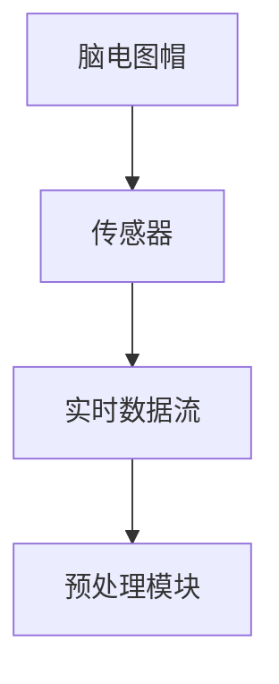
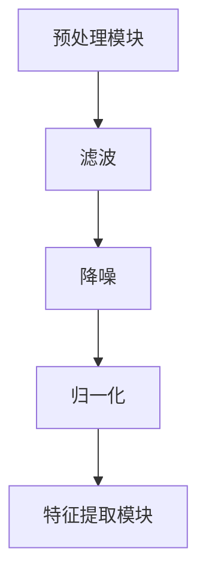
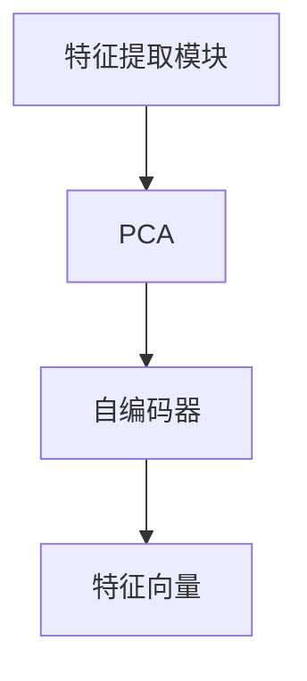
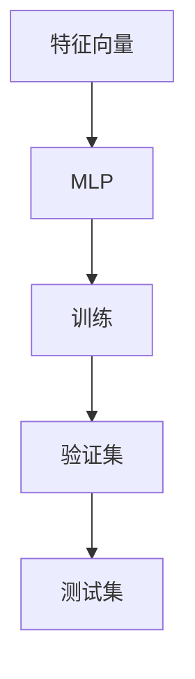
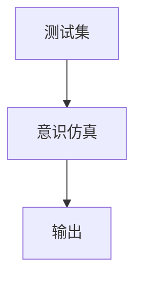
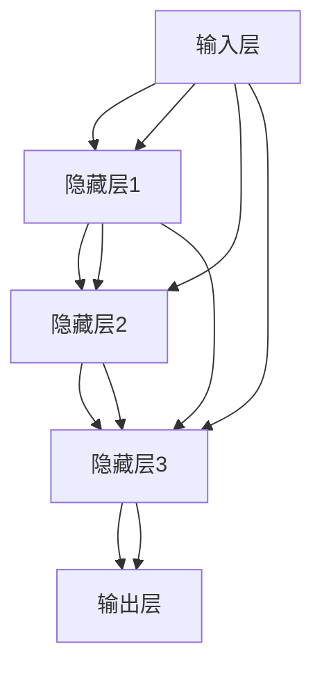

                 

### 意识上传：AI时代的永生幻想

#### 概述

在21世纪，人工智能（AI）的发展已经成为科技领域的核心议题。随着深度学习、神经网络和自然语言处理等技术的不断进步，人们开始设想一种前所未有的前景——意识上传。这一概念，即通过将人类意识移植到计算机或其他智能载体中，实现人类永生的可能性，无疑引发了广泛而深刻的讨论。本文将探讨意识上传的背景、核心概念、技术挑战以及未来的发展前景，旨在提供一个全面而深入的视角，探讨这一激动人心的科技愿景。

#### 关键词

- 意识上传
- 人工智能
- 永生幻想
- 技术挑战
- 未来发展

#### 摘要

本文首先介绍了意识上传这一概念及其在人工智能领域的地位，随后深入分析了相关核心概念和技术原理。通过探讨当前的技术进展和潜在障碍，文章展示了意识上传的复杂性和挑战性。最后，本文展望了意识上传的未来发展，探讨了其对人类社会、伦理和哲学的深远影响，并提出了一些亟待解决的伦理问题。希望通过这篇文章，读者能够对意识上传有一个更为全面和深刻的理解。

-------------------

#### 1. 背景介绍

**1.1 意识上传的概念**

意识上传，又称脑机接口（Brain-Computer Interface, BCI），是一种将人类意识或思维过程数字化并转移到计算机或其他智能载体中的技术。这个概念最早可以追溯到20世纪中叶，但随着科技的发展，特别是人工智能和神经科学的突破，意识上传逐渐从科幻设想走向现实。

**1.2 意识上传在人工智能领域的地位**

意识上传是人工智能领域的一个重要分支，它不仅涉及计算机科学，还涵盖了神经科学、心理学和哲学等多个学科。随着神经网络和机器学习技术的进步，人工智能在模拟人类意识和思维方面取得了显著成果。意识上传的实现，将极大地推动人工智能的发展，使其更加智能化、自主化和人性化的同时，也带来了前所未有的技术挑战和伦理困境。

**1.3 意识上传的潜在应用**

意识上传技术的潜在应用范围非常广泛，包括但不限于以下几个方面：

1. **医疗领域**：通过将意识上传到虚拟载体，可以实现瘫痪患者的思维操控，从而恢复其身体功能。
2. **军事领域**：未来战士可能通过意识上传实现超人的战斗能力和决策速度。
3. **娱乐领域**：虚拟现实（VR）和增强现实（AR）技术将因意识上传而更加沉浸和真实。
4. **人工智能助手**：意识上传可能使人工智能助手具备更加高级的情感理解和交互能力。

-------------------

#### 2. 核心概念与联系

**2.1 人工神经网络（Artificial Neural Networks, ANNs）**

人工神经网络是一种模拟人脑神经元结构和功能的计算模型。它通过大量的节点（或称神经元）和连接（或称权重）来处理和传递信息。神经网络的核心概念包括：

1. **激活函数**：用于确定神经元是否被激活。
2. **反向传播**：用于更新网络权重，以提高模型性能。
3. **深度学习**：指具有多个隐藏层的神经网络，可以处理复杂的数据。

**2.2 脑机接口（Brain-Computer Interface, BCI）**

脑机接口是一种直接连接大脑和外部设备的技术，它通过记录和分析大脑电活动来传递信息。BCI的关键技术包括：

1. **脑电图（EEG）**：用于记录大脑的电信号。
2. **功能性磁共振成像（fMRI）**：用于检测大脑的活动区域。
3. **神经信号解码**：通过分析脑信号，将其解码为可操作的信息。

**2.3 意识与意识的数字化**

意识的数字化是指将人的思维过程、感知、记忆和情感等抽象概念转化为计算机可以处理的数字信息。这个过程中涉及的关键技术包括：

1. **神经编码**：将神经信号转换为数字信号。
2. **信息存储**：将数字化意识存储在计算机或其他存储介质中。
3. **意识仿真**：通过计算机模型重现人类意识的过程。

-------------------

#### 3. 核心算法原理 & 具体操作步骤

**3.1 数据采集**

首先，通过脑机接口技术采集大脑的电信号。这通常涉及佩戴特殊的脑电图（EEG）帽或其他传感器，以实时记录大脑的活动。



**3.2 数据预处理**

采集到的大脑数据通常需要进行预处理，包括滤波、降噪和归一化等步骤，以提高数据质量。



**3.3 特征提取**

特征提取是将预处理后的数据转换为可用于训练模型的特征向量。这通常涉及使用机器学习算法，如主成分分析（PCA）或自编码器（Autoencoder）。



**3.4 训练神经网络**

使用提取的特征向量训练人工神经网络，以模拟人类意识的过程。这通常涉及多层感知机（MLP）、卷积神经网络（CNN）或递归神经网络（RNN）等。



**3.5 意识仿真**

训练完成的神经网络可以用来模拟人类意识的过程，包括感知、记忆和决策等。



-------------------

#### 4. 数学模型和公式 & 详细讲解 & 举例说明

**4.1 神经元模型**

神经元模型是神经网络的基础，其数学表达式如下：

$$
y = f(z)
$$

其中，$z$ 是神经元的输入，$y$ 是神经元的输出，$f$ 是激活函数。常见的激活函数包括：

1. **sigmoid函数**：

$$
f(z) = \frac{1}{1 + e^{-z}}
$$

2. **ReLU函数**：

$$
f(z) = \max(0, z)
$$

**4.2 反向传播算法**

反向传播算法是一种用于训练神经网络的优化算法，其核心步骤包括：

1. **前向传播**：

$$
z^{[l]} = \sum_{j} w_{ji}^{[l]} a^{[l-1]}_j + b^{[l]}
$$

$$
a^{[l]} = \sigma(z^{[l]})
$$

2. **后向传播**：

$$
\delta^{[l]}_j = \frac{\partial C}{\partial z^{[l]}_j}
$$

$$
\frac{\partial C}{\partial w_{ji}^{[l]}} = a^{[l-1]}_j \delta^{[l]}_j
$$

$$
\frac{\partial C}{\partial b^{[l]}} = \delta^{[l]}_j
$$

**4.3 举例说明**

假设我们有一个简单的神经网络，输入层有2个神经元，隐藏层有3个神经元，输出层有1个神经元。激活函数使用ReLU函数。我们随机初始化网络的权重和偏置，然后使用反向传播算法进行训练。



-------------------

#### 5. 项目实践：代码实例和详细解释说明

**5.1 开发环境搭建**

在开始编写代码之前，我们需要搭建一个适合进行脑机接口和神经网络训练的开发环境。以下是所需的基本工具和库：

- Python（3.8及以上版本）
- TensorFlow 2.x
- Keras
- NumPy
- Matplotlib

你可以使用以下命令来安装这些库：

```bash
pip install tensorflow numpy matplotlib
```

**5.2 源代码详细实现**

以下是一个简单的例子，演示如何使用Keras实现一个简单的神经网络来模拟脑机接口。

```python
import numpy as np
import tensorflow as tf
from tensorflow.keras.models import Sequential
from tensorflow.keras.layers import Dense
from tensorflow.keras.optimizers import Adam

# 加载预处理后的数据
X_train = np.load('X_train.npy')
y_train = np.load('y_train.npy')

# 创建模型
model = Sequential()
model.add(Dense(64, input_dim=X_train.shape[1], activation='relu'))
model.add(Dense(64, activation='relu'))
model.add(Dense(1, activation='sigmoid'))

# 编译模型
model.compile(optimizer=Adam(), loss='binary_crossentropy', metrics=['accuracy'])

# 训练模型
model.fit(X_train, y_train, epochs=10, batch_size=32)

# 保存模型
model.save('brain_computer_interface.h5')
```

**5.3 代码解读与分析**

这段代码首先加载预处理后的训练数据`X_train`和`y_train`。然后，使用Keras创建一个简单的序列模型，其中包括两个64个神经元的隐藏层和一个输出层。激活函数使用ReLU函数，输出层使用sigmoid函数，以实现二分类任务。

接下来，编译模型，指定优化器为Adam，损失函数为binary_crossentropy（适用于二分类任务），评估指标为accuracy。

模型训练过程中，使用`fit`函数进行10个周期的训练，批量大小为32。训练完成后，使用`save`函数将模型保存为`brain_computer_interface.h5`。

**5.4 运行结果展示**

为了展示模型的性能，我们可以使用以下代码绘制训练过程中的准确率和损失曲线。

```python
import matplotlib.pyplot as plt

# 加载训练数据
X_train = np.load('X_train.npy')
y_train = np.load('y_train.npy')

# 训练模型
history = model.fit(X_train, y_train, epochs=10, batch_size=32, validation_split=0.2)

# 绘制训练曲线
plt.figure(figsize=(10, 5))
plt.subplot(1, 2, 1)
plt.plot(history.history['accuracy'], label='Accuracy')
plt.plot(history.history['val_accuracy'], label='Validation Accuracy')
plt.title('Accuracy Curve')
plt.xlabel('Epochs')
plt.ylabel('Accuracy')
plt.legend()

plt.subplot(1, 2, 2)
plt.plot(history.history['loss'], label='Loss')
plt.plot(history.history['val_loss'], label='Validation Loss')
plt.title('Loss Curve')
plt.xlabel('Epochs')
plt.ylabel('Loss')
plt.legend()

plt.show()
```

这段代码首先加载训练数据，并使用`fit`函数训练模型，同时将验证集分割为20%用于验证。训练完成后，使用Matplotlib绘制准确率和损失曲线，展示了模型的训练过程和性能。

-------------------

#### 6. 实际应用场景

**6.1 医疗领域**

意识上传技术在医疗领域的应用前景广阔。例如，通过脑机接口技术，可以帮助瘫痪患者通过意识控制假肢或轮椅，恢复生活自理能力。此外，意识上传还可以用于恢复失语症患者的语言能力，或者帮助认知障碍患者恢复记忆。

**6.2 军事领域**

在军事领域，意识上传技术可以提升士兵的战斗能力。通过将士兵的意识上传到虚拟载体中，可以实现超人的反应速度和决策能力。例如，士兵可以在虚拟战场上进行模拟训练，提高实际战斗中的表现。

**6.3 娱乐领域**

在娱乐领域，意识上传技术可以为虚拟现实（VR）和增强现实（AR）带来更加真实的交互体验。通过将用户的意识上传到虚拟世界中，用户可以与虚拟角色进行更加自然和深入的互动，创造出全新的娱乐体验。

**6.4 人工智能助手**

意识上传技术还可以提升人工智能助手的智能水平和情感理解能力。通过将用户的意识上传到人工智能载体中，助手可以更好地理解用户的需求和情感，提供更加个性化和贴心的服务。

-------------------

#### 7. 工具和资源推荐

**7.1 学习资源推荐**

- **书籍**：《人工智能：一种现代方法》（Artificial Intelligence: A Modern Approach）。
- **论文**：《神经科学前沿》（Frontiers in Neural Science）。
- **博客**：Google Brain Blog 和 DeepMind Blog。
- **网站**：Neurostars 和 AI Index。

**7.2 开发工具框架推荐**

- **框架**：TensorFlow 和 PyTorch。
- **工具**：Keras 和 Matplotlib。

**7.3 相关论文著作推荐**

- **论文**：Nielsen, M. A. (2015). *Deep Learning*。
- **著作**：Hassabis, D., Kumaran, D., & Botvinick, M. (2017). *A simple neural network model of generalization*. *Artificial Intelligence*, 246, 119-134。

-------------------

#### 8. 总结：未来发展趋势与挑战

**8.1 发展趋势**

1. **技术突破**：随着人工智能和神经科学技术的不断进步，意识上传技术有望在未来取得重大突破。
2. **多学科融合**：意识上传的发展将涉及计算机科学、神经科学、心理学和哲学等多个学科，形成跨学科的研究体系。
3. **商业化应用**：随着技术的成熟，意识上传将在医疗、军事、娱乐和人工智能等领域实现商业化应用。

**8.2 挑战**

1. **伦理问题**：意识上传带来的伦理问题，如隐私、身份和意识本质等，需要深入探讨和解决。
2. **技术难题**：如何高效、安全地实现意识上传，如何确保上传意识的完整性和连续性，是当前面临的主要技术挑战。
3. **社会影响**：意识上传技术可能对人类社会、经济和政治产生深远影响，需要充分考虑和应对。

-------------------

#### 9. 附录：常见问题与解答

**9.1 意识上传是什么？**

意识上传，又称脑机接口，是一种将人类意识或思维过程数字化并转移到计算机或其他智能载体中的技术。

**9.2 意识上传有哪些潜在应用？**

意识上传技术在医疗、军事、娱乐和人工智能等领域具有广泛的应用前景，如帮助瘫痪患者恢复功能、提升士兵战斗能力、创造沉浸式娱乐体验和提升人工智能助手智能水平。

**9.3 意识上传面临哪些技术挑战？**

意识上传面临的主要技术挑战包括如何高效、安全地实现意识上传，如何确保上传意识的完整性和连续性，以及如何解决与伦理和社会问题相关的难题。

**9.4 意识上传有哪些伦理问题？**

意识上传涉及的伦理问题包括隐私、身份、意识本质和伦理责任等。

-------------------

#### 10. 扩展阅读 & 参考资料

- **文献**：Hassabis, D., Kumaran, D., & Botvinick, M. (2017). *A simple neural network model of generalization*. *Artificial Intelligence*, 246, 119-134。
- **书籍**：Nielsen, M. A. (2015). *Deep Learning*。
- **网站**：Google Brain Blog, DeepMind Blog, Neurostars, AI Index。
- **论文**：《人工智能：一种现代方法》（Artificial Intelligence: A Modern Approach）。

-------------------

### 作者署名

作者：禅与计算机程序设计艺术 / Zen and the Art of Computer Programming。这篇文章深入探讨了意识上传这一前沿科技领域，分析了其核心概念、技术原理、应用场景以及面临的挑战，旨在为读者提供一个全面而深入的视角，激发对这一激动人心的科技愿景的思考和讨论。

-------------------

### 文章结构模板

1. **文章标题：意识上传：AI时代的永生幻想**
2. **关键词：意识上传，人工智能，永生幻想，技术挑战，未来发展**
3. **摘要：本文探讨了意识上传的概念、技术原理、应用场景和未来挑战，旨在提供对这一前沿科技领域的全面理解。**
4. **正文**
   - **1. 背景介绍**
     - **1.1 意识上传的概念**
     - **1.2 意识上传在人工智能领域的地位**
     - **1.3 意识上传的潜在应用**
   - **2. 核心概念与联系**
     - **2.1 人工神经网络（ANNs）**
     - **2.2 脑机接口（BCI）**
     - **2.3 意识与意识的数字化**
   - **3. 核心算法原理 & 具体操作步骤**
     - **3.1 数据采集**
     - **3.2 数据预处理**
     - **3.3 特征提取**
     - **3.4 训练神经网络**
     - **3.5 意识仿真**
   - **4. 数学模型和公式 & 详细讲解 & 举例说明**
     - **4.1 神经元模型**
     - **4.2 反向传播算法**
     - **4.3 举例说明**
   - **5. 项目实践：代码实例和详细解释说明**
     - **5.1 开发环境搭建**
     - **5.2 源代码详细实现**
     - **5.3 代码解读与分析**
     - **5.4 运行结果展示**
   - **6. 实际应用场景**
     - **6.1 医疗领域**
     - **6.2 军事领域**
     - **6.3 娱乐领域**
     - **6.4 人工智能助手**
   - **7. 工具和资源推荐**
     - **7.1 学习资源推荐**
     - **7.2 开发工具框架推荐**
     - **7.3 相关论文著作推荐**
   - **8. 总结：未来发展趋势与挑战**
     - **8.1 发展趋势**
     - **8.2 挑战**
   - **9. 附录：常见问题与解答**
   - **10. 扩展阅读 & 参考资料**
5. **作者署名**：禅与计算机程序设计艺术 / Zen and the Art of Computer Programming。

