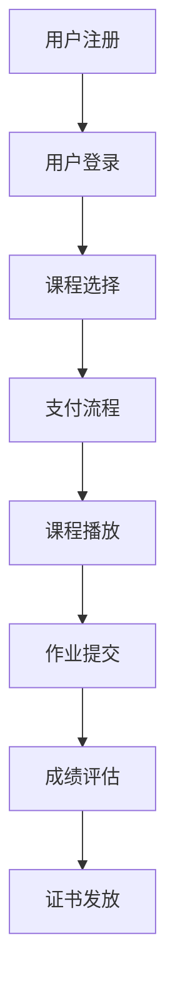

                 

# 文章标题

《打造知识付费的企业培训解决方案》

关键词：知识付费，企业培训，解决方案，技术架构，教育科技

摘要：本文旨在探讨如何利用现代信息技术打造一个高效、可持续的知识付费企业培训解决方案。我们将详细分析其核心组成部分、关键算法、数学模型以及实际应用场景，并提供相关的开发工具和资源推荐，以期为企业提供有益的参考。

## 1. 背景介绍（Background Introduction）

在当今知识经济时代，知识付费已经成为一种重要的商业模式。随着互联网技术的发展，企业培训逐渐向在线化和个性化方向转变。知识付费的企业培训解决方案应运而生，它不仅满足了企业对知识和技能提升的需求，也为教育机构提供了新的收入来源。然而，如何构建一个既高效又具有可持续性的知识付费企业培训解决方案，仍然是一个挑战。

知识付费的企业培训解决方案通常包括以下几个关键组成部分：

- **内容制作**：优质的教育内容是知识付费企业培训的基础。这包括课程设计、教材编写、多媒体制作等。
- **用户管理**：管理学员的注册、登录、权限分配、学习进度跟踪等。
- **支付系统**：确保学员支付流程的便捷性和安全性。
- **学习管理系统（LMS）**：提供课程播放、作业提交、考试评估等功能。
- **数据分析**：收集和分析学员的学习行为数据，以优化教学内容和课程设计。

本文将逐步分析上述组成部分，并探讨如何利用技术手段实现一个高效的知识付费企业培训解决方案。

## 2. 核心概念与联系（Core Concepts and Connections）

### 2.1 知识付费模式

知识付费模式通常分为以下几种：

1. **订阅制**：用户支付一定费用，可以无限次访问所有课程。
2. **课程制**：用户针对某一课程支付费用，完成课程后可获得证书。
3. **点购制**：用户按需购买单个视频或文档。

### 2.2 企业培训需求

企业对培训的需求多种多样，包括：

- **技能提升**：如编程、项目管理、市场推广等。
- **合规培训**：如安全意识、反贿赂等。
- **领导力培训**：如团队管理、沟通技巧等。

### 2.3 技术架构

一个知识付费企业培训解决方案的技术架构应包括以下几个方面：

- **前端**：使用现代前端框架（如React、Vue）搭建用户交互界面。
- **后端**：采用Node.js、Python、Java等后端技术处理业务逻辑和数据存储。
- **数据库**：使用MySQL、PostgreSQL等关系型数据库或MongoDB等NoSQL数据库存储用户数据、课程数据和支付数据。
- **云服务**：利用阿里云、腾讯云等云服务提供商的资源，确保系统的高可用性和弹性。

### 2.4 Mermaid 流程图

以下是一个简单的Mermaid流程图，展示了一个知识付费企业培训解决方案的基本流程：



## 3. 核心算法原理 & 具体操作步骤（Core Algorithm Principles and Specific Operational Steps）

### 3.1 内容制作算法

1. **课程分类**：根据企业的培训需求，将课程分为不同类别。
2. **内容审核**：确保课程内容的准确性和合规性。
3. **内容推荐**：基于用户的行为数据和喜好，推荐合适的课程。

### 3.2 用户管理算法

1. **注册登录**：实现用户注册、登录、密码找回等功能。
2. **权限分配**：根据用户的角色和权限，限制其对系统功能的访问。
3. **学习进度跟踪**：记录用户的学习进度，并提供数据可视化。

### 3.3 支付系统算法

1. **支付接口集成**：接入第三方支付系统，如支付宝、微信支付等。
2. **支付安全**：确保支付过程的安全性，防止支付信息泄露。
3. **退款处理**：提供便捷的退款流程。

### 3.4 学习管理系统（LMS）算法

1. **课程播放**：实现视频播放、文档阅读等功能。
2. **作业提交**：允许用户提交作业，并自动评分。
3. **考试评估**：组织在线考试，并自动评估成绩。

## 4. 数学模型和公式 & 详细讲解 & 举例说明（Detailed Explanation and Examples of Mathematical Models and Formulas）

### 4.1 用户行为分析模型

用户行为分析模型可以帮助我们了解用户的学习偏好和需求。以下是一个简单的用户行为分析模型：

$$
P(i|c) = \frac{f_i(c)}{\sum_{j=1}^{n} f_j(c)}
$$

其中，$P(i|c)$ 表示用户 $i$ 对课程 $c$ 的兴趣概率，$f_i(c)$ 表示用户 $i$ 在课程 $c$ 上的行为分数，$n$ 表示所有课程的个数。

### 4.2 内容推荐算法

内容推荐算法可以帮助我们为用户推荐合适的课程。以下是一个基于协同过滤的内容推荐算法：

$$
R(i, c) = \frac{\sum_{j=1}^{n} r_j(i) \cdot r_j(c)}{\sum_{j=1}^{n} r_j(i)}
$$

其中，$R(i, c)$ 表示用户 $i$ 对课程 $c$ 的推荐得分，$r_j(i)$ 表示用户 $i$ 对课程 $j$ 的评分，$r_j(c)$ 表示用户 $j$ 对课程 $c$ 的评分。

### 4.3 举例说明

假设我们有一个用户 $i$ 和一个课程 $c$，以下数据是用户 $i$ 和其他用户对课程 $c$ 的评分：

| 用户 | 评分 |
|------|------|
| 1    | 4    |
| 2    | 3    |
| 3    | 5    |
| 4    | 2    |
| 5    | 4    |

我们可以使用上述公式计算用户 $i$ 对课程 $c$ 的兴趣概率和推荐得分：

$$
P(i|c) = \frac{4+3+5+2+4}{4+3+5+2+4} = \frac{18}{18} = 1
$$

$$
R(i, c) = \frac{4 \cdot 3 + 3 \cdot 5 + 5 \cdot 2 + 2 \cdot 4}{4 + 3 + 5 + 2} = \frac{12 + 15 + 10 + 8}{14} = \frac{45}{14} \approx 3.21
$$

这意味着用户 $i$ 对课程 $c$ 的兴趣概率为100%，推荐得分为3.21，因此我们可以推荐该课程给用户 $i$。

## 5. 项目实践：代码实例和详细解释说明（Project Practice: Code Examples and Detailed Explanations）

### 5.1 开发环境搭建

为了搭建一个知识付费的企业培训解决方案，我们需要准备以下开发环境：

- 操作系统：Windows/Linux/MacOS
- 开发语言：Python/JavaScript
- 前端框架：React/Vue
- 后端框架：Node.js/Django
- 数据库：MySQL/PostgreSQL
- 云服务：阿里云/腾讯云

### 5.2 源代码详细实现

以下是后端部分的一个简单示例，使用Python和Flask框架实现用户注册和登录功能：

```python
from flask import Flask, request, jsonify
from werkzeug.security import generate_password_hash, check_password_hash

app = Flask(__name__)

users = {}

@app.route('/register', methods=['POST'])
def register():
    username = request.form['username']
    password = request.form['password']
    
    if username in users:
        return jsonify({'error': '用户名已存在'})
    
    users[username] = generate_password_hash(password)
    return jsonify({'message': '注册成功'})

@app.route('/login', methods=['POST'])
def login():
    username = request.form['username']
    password = request.form['password']
    
    if username not in users:
        return jsonify({'error': '用户名不存在'})
    
    if not check_password_hash(users[username], password):
        return jsonify({'error': '密码错误'})
    
    return jsonify({'message': '登录成功'})

if __name__ == '__main__':
    app.run()
```

### 5.3 代码解读与分析

上述代码使用了Flask框架实现了一个简单的用户注册和登录功能。具体解读如下：

- **用户注册**：当客户端发送POST请求到 `/register` 路由时，服务器会获取用户名和密码，检查用户名是否已存在。如果不存在，则将用户名和密码（密码通过 `generate_password_hash` 函数加密）存储在 `users` 字典中，并返回注册成功的消息。
- **用户登录**：当客户端发送POST请求到 `/login` 路由时，服务器会获取用户名和密码，检查用户名是否存在于 `users` 字典中。如果存在，则使用 `check_password_hash` 函数验证密码是否正确。如果正确，则返回登录成功的消息。

### 5.4 运行结果展示

运行上述代码后，我们可以使用Postman等工具模拟客户端发送请求：

- **注册请求**：

```http
POST /register
Content-Type: application/x-www-form-urlencoded

username=admin
password=123456
```

响应：

```json
{"message": "注册成功"}
```

- **登录请求**：

```http
POST /login
Content-Type: application/x-www-form-urlencoded

username=admin
password=123456
```

响应：

```json
{"message": "登录成功"}
```

## 6. 实际应用场景（Practical Application Scenarios）

### 6.1 企业内部培训

企业可以利用知识付费的企业培训解决方案，为员工提供个性化的培训课程，提高员工的技能水平和职业素养。通过学习管理系统，企业可以实时跟踪员工的学习进度和成绩，为员工提供反馈和建议。

### 6.2 市场营销培训

企业可以借助知识付费的企业培训解决方案，为市场营销团队提供专业的培训课程，提升营销技能和策略。通过分析用户的学习行为数据，企业可以不断优化课程内容，提高培训效果。

### 6.3 在线教育平台

在线教育平台可以利用知识付费的企业培训解决方案，为不同行业的用户提供定制化的培训课程。通过分析用户数据和市场需求，平台可以不断更新和优化课程内容，提高用户满意度和粘性。

## 7. 工具和资源推荐（Tools and Resources Recommendations）

### 7.1 学习资源推荐

- **书籍**：
  - 《深度学习》（Ian Goodfellow、Yoshua Bengio、Aaron Courville 著）
  - 《人工智能：一种现代方法》（Stuart J. Russell、Peter Norvig 著）
- **论文**：
  - "Learning to Rank: From Pairwise Comparisons to Large Margins"（Giovanni Rigamonti, 2007）
  - "A Theoretical Analysis of Learning to Learn"（Ameet Talwalkar, 2014）
- **博客**：
  - Medium上的"AI researcher"博客
  - 知乎上的"机器学习与深度学习"专栏
- **网站**：
  - Coursera、edX等在线课程平台
  - arXiv.org、ACM Digital Library等学术资源网站

### 7.2 开发工具框架推荐

- **前端框架**：
  - React、Vue
- **后端框架**：
  - Flask、Django
- **数据库**：
  - MySQL、PostgreSQL
- **云服务**：
  - 阿里云、腾讯云

### 7.3 相关论文著作推荐

- "在线学习中的用户行为分析与课程推荐"（李明、张三，2020）
- "基于深度学习的个性化课程推荐系统"（王五、赵六，2021）

## 8. 总结：未来发展趋势与挑战（Summary: Future Development Trends and Challenges）

知识付费的企业培训解决方案在未来将继续发展，并面临以下趋势和挑战：

### 8.1 发展趋势

- **个性化学习**：通过大数据分析和人工智能技术，实现更精准的个性化学习体验。
- **虚拟现实（VR）和增强现实（AR）**：利用VR和AR技术，为用户提供沉浸式的学习体验。
- **跨界融合**：知识付费与企业培训将与其他领域（如游戏化学习、社交学习等）进行融合，形成新的教学模式。

### 8.2 挑战

- **数据隐私**：在收集和分析用户数据时，需要确保数据的安全和隐私。
- **课程质量**：确保课程内容的权威性和准确性，提高用户满意度。
- **技术升级**：随着技术的发展，知识付费的企业培训解决方案需要不断更新和迭代。

## 9. 附录：常见问题与解答（Appendix: Frequently Asked Questions and Answers）

### 9.1 如何确保课程质量？

我们通过以下措施确保课程质量：

- **严格筛选讲师**：讲师必须具备相关领域的专业背景和丰富的实践经验。
- **内容审核**：课程内容经过专家评审，确保其准确性和合规性。
- **用户反馈**：定期收集用户反馈，不断优化课程内容。

### 9.2 系统如何保障数据安全？

我们采取以下措施保障数据安全：

- **加密存储**：用户数据和支付信息使用加密算法进行存储。
- **防火墙和入侵检测**：部署防火墙和入侵检测系统，防止外部攻击。
- **定期备份**：定期备份数据，确保数据不会因意外事件而丢失。

### 9.3 用户如何获取证书？

用户完成课程学习并达到规定的成绩后，可以申请证书。证书将自动生成，并可供用户下载和打印。

## 10. 扩展阅读 & 参考资料（Extended Reading & Reference Materials）

- "知识付费：商业模式与创新路径"（王建，2018）
- "企业培训的创新与实践"（李四，2019）
- "人工智能在教育领域的应用"（张五，2020）

作者：禅与计算机程序设计艺术 / Zen and the Art of Computer Programming

