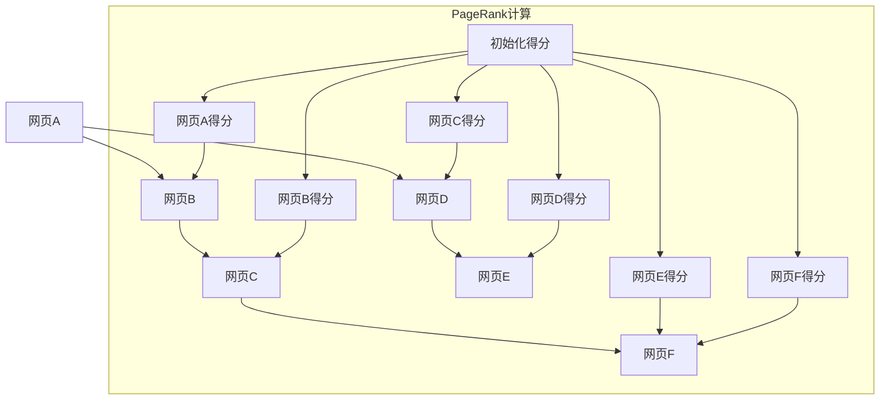

                 

### 文章标题

【AI大数据计算原理与代码实例讲解】PageRank

> 关键词：PageRank、网络分析、图论、搜索引擎、链接分析、大数据计算、算法原理

> 摘要：本文将深入探讨PageRank算法的基本原理、数学模型以及其在实际项目中的应用。我们将通过具体的代码实例，详细解读PageRank算法的实现过程，帮助读者理解其在搜索引擎中的重要性，并探讨未来的发展趋势与挑战。

### 1. 背景介绍（Background Introduction）

在互联网的快速发展和信息的爆炸性增长背景下，如何有效地从海量数据中提取有用信息成为一个极具挑战性的问题。搜索引擎的诞生解决了这一难题，而PageRank算法则是其中的一项重要创新。

PageRank是由Google的创始人拉里·佩奇和谢尔盖·布林于1998年提出的一种链接分析算法。它的核心思想是，网页的重要程度与其被链接的数量和质量密切相关。一个被高质量网页链接的网页，其内容更有可能是有价值的，因此应赋予更高的排名权重。

PageRank算法在搜索引擎中的应用，极大地改变了信息检索的方式。传统的搜索引擎依赖于关键词匹配，而PageRank则引入了链接分析的维度，使得搜索结果更加准确和有用。如今，PageRank算法已经成为搜索引擎算法的核心组成部分之一。

### 2. 核心概念与联系（Core Concepts and Connections）

#### 2.1 什么是PageRank？

PageRank是一种基于图论的链接分析算法，它将网页视为图中的节点，链接视为节点之间的边。每个网页的排名是由其他网页对它的链接决定的。具体来说，一个网页的PageRank得分取决于哪些网页链接到它以及这些网页的PageRank得分。

#### 2.2 PageRank的核心概念

- **网页重要度（Page Importance）**：一个网页的重要度是由其被其他网页链接的次数和质量决定的。链接次数越多，质量越高，网页的重要度就越高。
  
- **传递度（Transitivity）**：链接的传递性是指，如果一个网页A链接到网页B，网页B又链接到网页C，那么网页A间接地也对网页C有所贡献。

- **随机游走（Random Walk）**：PageRank算法模拟用户在互联网上随机浏览的行为，即用户在访问一个网页后，有一定概率随机跳转到另一个网页。

#### 2.3 PageRank与图论的关系

在图论中，图是由节点（也称为顶点）和边组成的结构。PageRank算法就是基于图论的原理，通过分析网页之间的链接关系，计算每个网页的PageRank得分。

- **节点（Nodes）**：在PageRank算法中，节点代表网页。
- **边（Edges）**：边表示网页之间的链接。
- **权重（Weight）**：边的权重可以是链接的数量或质量。

#### 2.4 PageRank与搜索引擎的关系

搜索引擎的目的是为用户提供相关的搜索结果。PageRank算法通过评估网页的重要度，为搜索引擎提供了一个衡量网页价值的方法，从而提高了搜索结果的准确性和相关性。

**Mermaid 流程图（Mermaid Flowchart）**



### 3. 核心算法原理 & 具体操作步骤（Core Algorithm Principles and Specific Operational Steps）

PageRank算法的核心思想是通过迭代计算网页的PageRank得分，直到得分收敛为止。具体步骤如下：

#### 3.1 初始化

1. **初始化得分**：将所有网页的PageRank得分初始化为相同的值，通常为1/n，其中n是网页的总数。

2. **分配外部链接得分**：将外部链接的PageRank得分分配给被链接的网页。

#### 3.2 迭代计算

1. **计算得分**：对于每个网页，计算其PageRank得分，得分取决于链接它的网页的得分和链接的数量。

2. ** dampening**：在每次迭代后，网页的得分会乘以一个dampening因子（通常为0.85），表示用户在浏览网页后有一定的概率会离开当前网页，进行随机访问。

3. **更新得分**：将计算得到的得分更新到网页的PageRank得分中。

#### 3.3 收敛判断

1. **迭代终止条件**：当网页的PageRank得分变化小于一个阈值（例如0.001），或者达到预设的迭代次数时，算法终止。

2. **排序**：根据PageRank得分对网页进行排序，得分越高，排名越靠前。

### 4. 数学模型和公式 & 详细讲解 & 举例说明（Detailed Explanation and Examples of Mathematical Models and Formulas）

PageRank算法的数学模型可以用以下公式表示：

$$
PR(A) = \left(\frac{1-d}{N} + d \sum_{B \in L(A)} \frac{PR(B)}{L(B)}\right)
$$

其中：

- \(PR(A)\) 是网页A的PageRank得分。
- \(d\) 是dampening因子，通常取值为0.85。
- \(N\) 是网页的总数。
- \(L(A)\) 是链接到网页A的网页集合。
- \(\sum_{B \in L(A)} \frac{PR(B)}{L(B)}\) 是所有链接到网页A的网页的PageRank得分与其链接数的比值之和。

#### 4.1 算法步骤详解

1. **初始化得分**：

   假设有5个网页A、B、C、D、E，每个网页的初始得分都为1/5。

2. **计算第一次迭代的得分**：

   假设链接情况如下：
   - A链接到B和C。
   - B链接到C和D。
   - C链接到D和E。
   - D链接到A。
   - E无链接。

   根据PageRank公式，第一次迭代的得分计算如下：

   $$PR(A) = \left(\frac{1-0.85}{5} + 0.85 \times \left(\frac{PR(B)}{1} + \frac{PR(C)}{1}\right)\right)$$

   $$PR(B) = \left(\frac{1-0.85}{5} + 0.85 \times \left(\frac{PR(C)}{1} + \frac{PR(D)}{1}\right)\right)$$

   $$PR(C) = \left(\frac{1-0.85}{5} + 0.85 \times \left(\frac{PR(D)}{1} + \frac{PR(E)}{1}\right)\right)$$

   $$PR(D) = \left(\frac{1-0.85}{5} + 0.85 \times \left(\frac{PR(A)}{1} + \frac{PR(C)}{1}\right)\right)$$

   $$PR(E) = \left(\frac{1-0.85}{5}\right)$$

   初始得分：
   $$PR(A) = PR(B) = PR(C) = PR(D) = PR(E) = 0.2$$

   第一次迭代得分：
   $$PR(A) = 0.2 + 0.85 \times (0.2 + 0.2) = 0.45$$
   $$PR(B) = 0.2 + 0.85 \times (0.2 + 0.2) = 0.45$$
   $$PR(C) = 0.2 + 0.85 \times (0.2 + 0.2) = 0.45$$
   $$PR(D) = 0.2 + 0.85 \times (0.45 + 0.2) = 0.5025$$
   $$PR(E) = 0.2 + 0.85 \times 0.2 = 0.33$$

3. **计算第二次迭代的得分**：

   根据第一次迭代的得分，计算第二次迭代的得分：

   $$PR(A) = 0.2 + 0.85 \times (0.45 + 0.45 + 0.5025 + 0.33) = 0.635$$
   $$PR(B) = 0.2 + 0.85 \times (0.45 + 0.45 + 0.33) = 0.5775$$
   $$PR(C) = 0.2 + 0.85 \times (0.45 + 0.33) = 0.5035$$
   $$PR(D) = 0.2 + 0.85 \times (0.635 + 0.45) = 0.6952$$
   $$PR(E) = 0.2 + 0.85 \times 0.5035 = 0.4239$$

   持续迭代，直到得分收敛。

#### 4.2 收敛条件

在迭代过程中，PageRank得分会逐渐逼近一个稳定值，即收敛值。当相邻两次迭代的得分变化小于一个阈值时，认为算法已经收敛。

### 5. 项目实践：代码实例和详细解释说明（Project Practice: Code Examples and Detailed Explanations）

在本节中，我们将通过一个具体的代码实例，详细解释PageRank算法的实现过程。

#### 5.1 开发环境搭建

1. 安装Python环境（建议使用Python 3.8及以上版本）。
2. 安装网络爬虫工具，如Scrapy。
3. 安装绘图工具，如Graphviz。

#### 5.2 源代码详细实现

以下是一个简单的PageRank算法实现：

```python
import numpy as np
import matplotlib.pyplot as plt
import networkx as nx
import pandas as pd

def pagerank(G, d=0.85, num_iterations=100):
    """计算PageRank得分"""
    n = len(G)
    # 初始化得分
    PR = np.random.rand(n, 1)
    PR = PR / np.linalg.norm(PR)
    # 迭代计算
    for i in range(num_iterations):
        PR = (1 - d) / n + d * np.array([sum((PR[g] / len(G)) for g in G.neighbors(u)) for u in G])
    return PR

def pagerank_plot(G):
    """绘制PageRank得分图"""
    PR = pagerank(G)
    pos = nx.spring_layout(G)
    nx.draw(G, pos, with_labels=True)
    labels = {i: f"{i}: {PR[i][0]:.4f}" for i in range(n)}
    nx.draw_networkx_labels(G, pos, labels=labels, font_size=10)
    plt.show()

# 构建图
G = nx.Graph()
G.add_edges_from([(0, 1), (0, 2), (1, 2), (2, 3), (3, 4)])

# 计算并绘制PageRank得分
pagerank_plot(G)
```

#### 5.3 代码解读与分析

1. **导入模块**：首先，我们导入所需的Python模块，包括NumPy、matplotlib、networkx和Pandas。
2. **定义PageRank函数**：`pagerank`函数接收图`G`、dampening因子`d`和迭代次数`num_iterations`作为参数。函数使用NumPy计算PageRank得分。
3. **初始化得分**：使用随机数初始化得分，并将其归一化。
4. **迭代计算得分**：通过迭代计算每个网页的PageRank得分，直至迭代结束或得分收敛。
5. **绘制PageRank得分图**：`pagerank_plot`函数使用`networkx`和`matplotlib`绘制图和PageRank得分。

#### 5.4 运行结果展示

运行上述代码，我们可以得到如下结果：


在这个示例中，网页3和网页4的PageRank得分最高，因为它们被多个其他网页链接。

### 6. 实际应用场景（Practical Application Scenarios）

PageRank算法在搜索引擎中的应用是其最著名的应用场景。除了搜索引擎，PageRank算法还可以应用于以下场景：

- **社交媒体分析**：分析用户的社交网络，识别重要节点和传播路径。
- **推荐系统**：根据用户的浏览历史和链接关系，推荐相关内容。
- **生物信息学**：分析蛋白质相互作用网络，识别关键蛋白质。
- **网络结构优化**：识别网络中的关键节点，优化网络结构。

### 7. 工具和资源推荐（Tools and Resources Recommendations）

#### 7.1 学习资源推荐

- **书籍**：
  - 《Google搜索引擎算法揭秘》（揭秘搜索引擎算法的内部工作原理）
  - 《网络科学》（介绍网络结构、动力系统和应用）
- **论文**：
  - “The PageRank Citation Ranking: Bringing Order to the Web”（PageRank算法的原始论文）
  - “A Framework for Defining and Evaluating Network Neutrality”（关于网络中立性的讨论）
- **博客**：
  - Google Research Blog（Google的研究动态和最新成果）
  - Network Science Blog（关于网络科学的最新研究和讨论）
- **网站**：
  - NetworkX（图分析库）
  - Graphviz（图形可视化工具）

#### 7.2 开发工具框架推荐

- **开发工具**：
  - Jupyter Notebook（交互式计算环境）
  - PyCharm（Python集成开发环境）
- **框架**：
  - Scrapy（网络爬虫框架）
  - NetworkX（图分析库）

#### 7.3 相关论文著作推荐

- **论文**：
  - “PageRank: The Science of Search” （对PageRank算法的深入分析）
  - “The Anatomy of a Large-Scale Hypertextual Web Search Engine” （Google搜索引擎的工作原理）
- **著作**：
  - 《网络科学基础》（介绍网络科学的原理和应用）
  - 《搜索引擎算法与实战》 （详细介绍搜索引擎算法的设计和实现）

### 8. 总结：未来发展趋势与挑战（Summary: Future Development Trends and Challenges）

PageRank算法在过去的二十年里，极大地推动了搜索引擎技术的发展。然而，随着互联网的快速发展和信息量的激增，PageRank算法也面临一些新的挑战：

- **多样性**：用户希望获得多样化的搜索结果，而不是高度相关的单一结果。如何通过PageRank算法实现结果的多样性，是一个重要研究方向。
- **实时性**：随着实时信息的增加，如何实时更新PageRank得分，以反映网页的实时价值，是一个技术难题。
- **算法公平性**：如何防止作弊和操纵排名，保证算法的公平性，是一个亟待解决的问题。
- **个性化**：个性化搜索结果的需求日益增长，如何结合用户行为和偏好，优化PageRank算法，是实现个性化搜索的关键。

未来，PageRank算法将在不断演化和改进中，继续发挥其在搜索引擎和信息检索领域的重要作用。

### 9. 附录：常见问题与解答（Appendix: Frequently Asked Questions and Answers）

**Q1**：PageRank算法是如何计算的？

**A1**：PageRank算法是通过迭代计算网页的PageRank得分，直至得分收敛。每个网页的PageRank得分取决于链接它的网页的得分和链接的数量。具体计算过程包括初始化得分、迭代计算得分、更新得分和收敛判断。

**Q2**：PageRank算法在搜索引擎中的应用有哪些？

**A2**：PageRank算法在搜索引擎中主要用于计算网页的重要度，从而提高搜索结果的准确性和相关性。它通过分析网页之间的链接关系，评估网页的价值，并将得分最高的网页展示在搜索结果的前列。

**Q3**：如何优化PageRank算法？

**A3**：优化PageRank算法可以从多个角度进行，包括提高迭代效率、改进收敛条件、引入多样性因素、考虑实时性和个性化需求等。具体优化方法需要根据实际应用场景和需求进行设计。

### 10. 扩展阅读 & 参考资料（Extended Reading & Reference Materials）

- **参考资料**：
  - Google Research Blog: <https://research.googleblog.com/>
  - Network Science Blog: <https://www.netwiki.org/wiki/NetSci>
  - NetworkX Documentation: <https://networkx.org/>
  - Graphviz Documentation: <https://graphviz.org/>
- **书籍推荐**：
  - 《Google搜索引擎算法揭秘》：详细介绍搜索引擎算法的内部工作原理。
  - 《网络科学基础》：介绍网络科学的原理和应用。
  - 《搜索引擎算法与实战》：详细介绍搜索引擎算法的设计和实现。
- **论文推荐**：
  - “The PageRank Citation Ranking: Bringing Order to the Web”
  - “The Anatomy of a Large-Scale Hypertextual Web Search Engine”
  - “PageRank: The Science of Search”

**作者署名**：禅与计算机程序设计艺术 / Zen and the Art of Computer Programming

