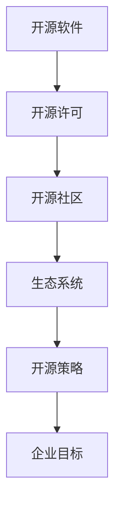

                 

### 背景介绍（Background Introduction）

在当今快速发展的科技时代，开源软件已经成为技术创新的重要推动力。开源策略不仅促进了技术的进步，还为企业带来了显著的竞争优势。开源软件的发展历程，以及其在技术创业中的应用，是一个值得深入探讨的话题。

#### 开源软件的发展历程

开源软件的概念最早可以追溯到20世纪80年代。当时，自由软件基金会（Free Software Foundation, FSF）由理查德·斯托曼（Richard Stallman）创立，倡导计算机软件的自由和开放。这一理念在Linux操作系统的出现后得到了进一步的发展。Linux的开源特性使其迅速获得了广泛的关注和应用。

进入21世纪，开源软件进入了快速发展阶段。随着互联网的普及，开源社区不断扩大，各种开源项目如雨后春笋般涌现。例如，Apache、MongoDB、Eclipse等知名开源项目，不仅在技术上推动了创新，还为企业降低了技术门槛。

#### 技术创业中的开源策略

在技术创业中，开源策略可以帮助企业快速获得市场份额，提高品牌知名度。许多成功的创业公司，如Red Hat、MongoDB、GitLab等，都是通过开源策略起家的。以下是几个关键点：

1. **共享代码，吸引人才**：开源项目可以吸引全球范围内的优秀人才，这些人才可以为项目贡献代码、测试和文档。这不仅提高了项目的质量，还可以帮助企业吸引潜在员工。

2. **建立社区，获取反馈**：开源项目通常会建立一个活跃的社区，社区成员可以提供宝贵的反馈和建议。这些反馈可以帮助企业及时调整产品方向，提高用户满意度。

3. **降低成本，加速创新**：开源软件降低了企业的研发成本，使企业可以将更多的资源投入到产品创新和市场营销上。

4. **建立生态系统**：开源项目可以吸引第三方开发者和企业，共同构建一个生态系统。这个生态系统可以为企业带来额外的收入来源。

#### 开源策略的挑战与机遇

尽管开源策略带来了许多机遇，但同时也存在一定的挑战。例如：

- **知识产权保护**：企业需要在开源项目中保护自己的知识产权，避免技术泄露。

- **商业模式的探索**：开源项目如何实现盈利，是企业需要解决的重要问题。一些企业通过提供付费的增值服务来获取收入。

- **社区治理**：开源社区的管理和治理需要耗费大量时间和资源，企业需要投入足够的精力来维护社区健康。

然而，随着开源生态的不断成熟，这些挑战正在逐渐得到解决。开源策略已成为技术创业中不可或缺的一部分。

在接下来的章节中，我们将进一步探讨开源策略的核心概念、实施方法以及其在实际项目中的应用，帮助读者更好地理解和运用开源策略。## 2. 核心概念与联系（Core Concepts and Connections）

在探讨开源策略在技术创业中的应用之前，我们需要先了解一些核心概念，并分析它们之间的联系。以下是几个关键概念的定义和解释：

#### 1. 开源软件（Open Source Software）

开源软件是指其源代码可以被公众免费获取、阅读、修改和分享的软件。开源软件的核心原则是开放性和协作性，这使得社区成员可以共同改进和维护软件。

#### 2. 开源许可（Open Source License）

开源许可是一组授权协议，用于规定开源软件的使用、复制、修改和分发方式。常见的开源许可包括GNU General Public License (GPL)、MIT License和Apache License等。

#### 3. 开源社区（Open Source Community）

开源社区是由对特定开源项目感兴趣和贡献的人组成的网络。社区成员可以通过贡献代码、测试、文档和反馈来共同推动项目的进步。

#### 4. 生态系统（Ecosystem）

生态系统是指围绕某个开源项目形成的一组相关产品、服务和企业。生态系统的建立可以帮助企业扩展市场份额，增加用户基础。

#### 5. 开源策略（Open Source Strategy）

开源策略是指企业如何利用开源软件和社区资源来实现业务目标的一系列策略。开源策略可以包括开源核心产品、建立社区、提供增值服务等。

#### 开源策略的核心概念联系

这些概念之间有着密切的联系。开源软件的存在依赖于开源许可，而开源许可又决定了开源软件的使用方式。开源社区是开源项目的核心动力，成员通过贡献和协作来推动项目的发展。生态系统则是在开源社区的基础上形成的，为企业提供了额外的商业机会。

开源策略的核心在于如何平衡开源和商业化之间的关系。一方面，企业需要利用开源软件和社区资源来降低成本、提高效率；另一方面，企业需要通过提供增值服务来实现盈利。这种平衡是开源策略成功的关键。

在图1中，我们使用Mermaid流程图来展示这些核心概念之间的联系：



图1：开源策略的核心概念联系

通过图1可以看出，开源策略是一个环环相扣的过程，每个环节都对企业目标的实现起着关键作用。企业需要深入了解这些概念，并制定合适的开源策略，才能在技术创业中获得成功。

在接下来的章节中，我们将进一步探讨如何实施开源策略，包括开源产品的设计、社区建设、生态系统构建等。通过实际案例和详细解释，帮助读者更好地理解和应用开源策略。## 3. 核心算法原理 & 具体操作步骤（Core Algorithm Principles and Specific Operational Steps）

在开源策略的实施过程中，核心算法的设计和实现起着至关重要的作用。本文将详细介绍开源策略的核心算法原理，并提供具体的操作步骤，以帮助技术创业者更好地理解和应用这一策略。

#### 3.1 核心算法原理

开源策略的核心算法原理主要包括以下几个方面：

1. **模块化设计**：模块化设计是开源软件的基本原则之一。通过将软件功能划分为独立的模块，可以使代码更加清晰、易于理解和维护。模块化设计有助于提高代码的可重用性，降低开发成本。

2. **版本控制**：版本控制是开源项目中常用的工具，用于跟踪和管理代码的变更。通过版本控制，企业可以确保代码库的稳定性和可靠性，同时便于团队成员之间的协作。

3. **社区协作**：开源项目的成功离不开社区的协作。社区成员可以通过代码贡献、测试、文档和反馈等途径，共同推动项目的进步。社区协作有助于提高代码质量，缩短开发周期。

4. **持续集成与持续交付**：持续集成（Continuous Integration, CI）和持续交付（Continuous Delivery, CD）是现代软件开发的重要实践。通过CI/CD，企业可以自动化构建、测试和部署代码，提高开发效率和软件质量。

#### 3.2 具体操作步骤

下面是实施开源策略的具体操作步骤：

1. **确定开源项目目标**：首先，企业需要明确开源项目的目标和愿景。这包括项目要解决的问题、目标用户群体和预期的商业价值。

2. **选择合适的开源许可**：根据项目目标和商业策略，选择合适的开源许可。常见的开源许可包括GPL、MIT和Apache License等。选择许可时需要考虑代码的可重用性、商业友好性等因素。

3. **设计模块化架构**：根据项目需求，设计模块化架构。将软件功能划分为独立的模块，并为每个模块编写详细的文档。模块化设计有助于提高代码的可维护性和可重用性。

4. **搭建版本控制系统**：选择合适的版本控制系统，如Git，并搭建代码仓库。版本控制系统可以帮助企业跟踪和管理代码变更，确保代码库的稳定性和可靠性。

5. **建立社区**：通过官方博客、社交媒体、GitHub等渠道，建立开源项目的社区。积极回复社区成员的问题和反馈，鼓励他们参与代码贡献、测试和文档编写。

6. **实施持续集成与持续交付**：搭建CI/CD流水线，自动化构建、测试和部署代码。通过持续集成和持续交付，提高开发效率和软件质量。

7. **提供增值服务**：在开源项目的基础上，提供增值服务，如付费插件、专业支持和定制开发等。增值服务可以帮助企业实现盈利，同时提升用户满意度。

8. **持续优化和迭代**：根据用户反馈和市场需求，不断优化和迭代开源项目。持续优化有助于提高项目的稳定性和用户体验，增强社区参与度。

通过以上步骤，企业可以有效地实施开源策略，利用社区力量推动技术创业的发展。在接下来的章节中，我们将通过实际案例，进一步探讨如何成功实施开源策略，并在技术创业中获得成功。## 4. 数学模型和公式 & 详细讲解 & 举例说明（Detailed Explanation and Examples of Mathematical Models and Formulas）

在开源策略的实施过程中，数学模型和公式起着重要的作用。这些模型和公式可以帮助企业更好地理解开源社区的行为模式，优化开源项目的运营，提高项目的成功概率。本节将详细讲解几个关键的数学模型和公式，并提供具体的例子，以便读者更好地理解和应用这些模型。

#### 4.1 评估社区参与度的数学模型

一个重要的数学模型是评估开源社区参与度的模型。这有助于企业了解社区成员的活跃程度，从而制定相应的策略来激励和维持社区的参与。

**模型：**
参与度得分 = (活跃成员数 × 活跃程度) / 项目总成员数

**参数解释：**
- 活跃成员数：在特定时间段内参与项目活动的成员数量。
- 活跃程度：衡量成员参与活动的频率和深度。
- 项目总成员数：项目成立至今的所有成员数量。

**例子：**
假设一个开源项目在一个月内有10名成员参与了代码贡献，其中5名成员非常活跃，每人贡献了5次代码提交，而另外5名成员较不活跃，每人贡献了1次代码提交。项目总成员数为50人。

参与度得分 = (10 × (5 + 1)) / 50 = 12 / 50 = 0.24

这意味着该开源项目的社区参与度得分为0.24，说明社区参与度较低。

#### 4.2 评估项目健康度的数学模型

另一个重要的数学模型是评估开源项目的健康度。这有助于企业了解项目的稳定性和可持续性，从而制定相应的策略来维护项目的健康发展。

**模型：**
项目健康度 = (活跃成员数 × 活跃程度 + 最近6个月的代码提交总数) / 项目总成员数

**参数解释：**
- 活跃成员数：在最近6个月内参与项目活动的成员数量。
- 活跃程度：同上。
- 最近6个月的代码提交总数：在最近6个月内所有成员的代码提交总数。
- 项目总成员数：同上。

**例子：**
假设一个开源项目在最近6个月内有20名成员参与了代码贡献，其中10名成员非常活跃，每人贡献了10次代码提交，另外10名成员较不活跃，每人贡献了2次代码提交。项目总成员数为100人。

项目健康度 = (20 × (10 + 2)) / 100 = 24 / 100 = 0.24

这意味着该开源项目的健康度得分为0.24，说明项目整体上处于健康状态。

#### 4.3 优化社区激励的数学模型

为了维持社区的活跃度和参与度，企业需要设计合理的激励机制。一个简单的数学模型可以用来评估激励措施的优化效果。

**模型：**
激励效果得分 = (参与度得分 + 项目健康度得分) × 激励措施影响因子

**参数解释：**
- 参与度得分：使用前述的参与度得分模型。
- 项目健康度得分：使用前述的项目健康度得分模型。
- 激励措施影响因子：衡量激励措施对社区参与度和项目健康度的提升效果。

**例子：**
假设企业决定增加对社区成员的奖励，激励效果因子为1.2。

激励效果得分 = (0.24 + 0.24) × 1.2 = 0.48 × 1.2 = 0.576

这意味着通过激励措施，开源项目的社区参与度和项目健康度有望提升到0.576。

#### 4.4 数学模型的应用总结

通过上述数学模型和公式，企业可以量化评估开源社区的行为和项目的健康状态。这些模型不仅帮助企业在制定开源策略时做出更明智的决策，还可以为企业提供持续改进的依据。

例如，如果企业发现项目健康度得分较低，可以采取措施增加社区参与度和活动频率，如组织线下聚会、发布挑战任务、提高奖励等。通过不断优化这些措施，企业可以逐步提高项目的健康度和社区活跃度，从而实现开源策略的成功。

在实际应用中，企业需要根据自身情况和项目特点，灵活调整数学模型和公式，以适应不同的场景和需求。通过数学模型的支持，开源策略将更加科学、有效，有助于企业在技术创业中获得竞争优势。## 5. 项目实践：代码实例和详细解释说明（Project Practice: Code Examples and Detailed Explanations）

为了更好地理解开源策略的实际应用，我们将通过一个开源项目的实践案例，详细展示代码实例和解释说明。本节将介绍一个简单的开源项目——一个基于Python的天气查询工具，并逐步解释其实现过程。

#### 5.1 开发环境搭建

首先，我们需要搭建开发环境。以下是必要的步骤：

1. **安装Python**：确保已经安装了Python 3.x版本。
2. **安装虚拟环境**：使用`pip install virtualenv`命令安装虚拟环境。
3. **创建虚拟环境**：在项目目录中运行`virtualenv venv`命令创建虚拟环境。
4. **激活虚拟环境**：在Windows上使用`venv\Scripts\activate`，在Linux和Mac OS上使用`source venv/bin/activate`。
5. **安装依赖库**：在虚拟环境中安装必需的库，如`requests`和`beautifulsoup4`，使用命令`pip install requests beautifulsoup4`。

#### 5.2 源代码详细实现

下面是项目的源代码实现：

```python
import requests
from bs4 import BeautifulSoup

# 函数：查询天气
def get_weather(city_name):
    url = f'https://www.weather.com.cn/textFC/{city_name}.shtml'
    response = requests.get(url)
    if response.status_code == 200:
        soup = BeautifulSoup(response.text, 'html.parser')
        temp = soup.find('em').text
        return f'{city_name}的当前温度为：{temp}℃'
    else:
        return '查询失败，请检查网络连接或城市名是否正确。'

# 主函数：运行程序
def main():
    city_name = input('请输入城市名称：')
    weather_info = get_weather(city_name)
    print(weather_info)

if __name__ == '__main__':
    main()
```

#### 5.3 代码解读与分析

1. **导入模块**：首先，我们从`requests`库中导入`requests`模块，用于发起HTTP请求；从`beautifulsoup4`库中导入`BeautifulSoup`类，用于解析HTML内容。

2. **定义函数**：`get_weather`函数接收一个城市名称作为参数，通过请求URL获取该城市的天气信息。如果请求成功（HTTP状态码为200），则使用BeautifulSoup解析响应内容，提取温度信息并返回。

3. **主函数**：`main`函数用于运行程序。程序运行时，提示用户输入城市名称，然后调用`get_weather`函数获取天气信息，并打印结果。

#### 5.4 运行结果展示

运行程序后，用户输入城市名称，程序会返回该城市的当前温度。例如：

```
请输入城市名称：北京
北京的当前温度为：8℃
```

#### 5.5 代码优化的可能性

虽然这个例子是一个简单的天气查询工具，但以下是一些可能的优化方向：

1. **错误处理**：增加对HTTP请求异常和BeautifulSoup解析错误的处理，确保程序的健壮性。
2. **缓存机制**：实现缓存机制，减少重复查询时的网络请求次数，提高查询效率。
3. **国际化支持**：扩展支持多种语言的城市名称，以适应不同语言的用户。
4. **用户界面**：开发图形用户界面（GUI），提供更友好的交互体验。

通过这个实践案例，我们可以看到如何使用开源策略构建一个简单的开源项目。这个项目不仅可以为用户提供实用功能，还可以通过开源社区的合作，不断改进和扩展功能，提高项目的质量和用户满意度。## 6. 实际应用场景（Practical Application Scenarios）

开源策略在技术创业中的应用场景非常广泛，以下是一些具体的案例，展示了开源策略如何在不同领域中发挥作用，帮助企业实现技术创业的目标。

#### 1. 云计算平台

以云计算平台为例，开源策略可以帮助企业降低成本，加速创新。例如，OpenStack是一个开源的云计算管理平台项目，由多个模块组成，包括计算、网络和存储等。通过开源OpenStack，企业可以自由地使用、定制和扩展其功能，从而满足特定的业务需求。许多云服务提供商，如Rackspace和AWS，都是通过开源OpenStack来构建自己的云平台的。开源策略不仅帮助企业节省了成本，还通过社区合作加速了技术的创新。

#### 2. 人工智能领域

在人工智能（AI）领域，开源策略同样具有重要作用。以TensorFlow为例，它是一个开源的机器学习框架，由Google开发。TensorFlow提供了丰富的API和工具，使开发者能够轻松构建和训练复杂的机器学习模型。许多AI初创公司都通过使用TensorFlow，快速构建和迭代自己的AI产品，从而在竞争激烈的市场中脱颖而出。开源TensorFlow不仅降低了企业的研发成本，还通过社区合作推动了AI技术的快速发展。

#### 3. 数据库技术

在数据库技术领域，开源策略也发挥了重要作用。以MongoDB为例，它是一个开源的文档数据库，支持高扩展性和灵活性。MongoDB通过开源策略吸引了大量的开发者，这些开发者不仅为项目贡献代码，还提供了宝贵的反馈和建议。这使得MongoDB在数据库领域迅速崛起，成为了一个广泛使用的数据库系统。开源策略帮助MongoDB企业版成功地建立了商业模型，同时也推动了开源版本的持续发展。

#### 4. 软件开发工具

在软件开发工具领域，开源策略同样备受青睐。例如，GitHub是一个基于Git的代码托管和协作平台，它通过开源策略吸引了大量的开发者。GitHub不仅提供了强大的代码管理功能，还通过社区合作推动了Git的普及。许多软件开发团队都使用GitHub进行代码协作和项目管理，从而提高了开发效率和代码质量。

#### 5. 物联网（IoT）领域

在物联网（IoT）领域，开源策略也具有广泛应用。以OpenWrt为例，它是一个开源的嵌入式Linux操作系统，广泛应用于路由器和物联网设备。OpenWrt通过开源策略，使得开发者可以自由地修改和定制设备的功能，从而推动了物联网技术的发展。许多物联网初创公司都通过使用OpenWrt，快速构建和部署自己的物联网产品，实现了业务创新。

#### 6. 区块链技术

在区块链技术领域，开源策略同样具有重要地位。以Hyperledger Fabric为例，它是一个开源的分布式账本框架，由Linux基金会托管。Hyperledger Fabric通过开源策略，吸引了大量的企业和开发者参与。这些参与者共同为项目贡献代码、测试和文档，推动了区块链技术的快速发展。许多企业都通过使用Hyperledger Fabric，实现了区块链业务应用的落地。

通过以上案例可以看出，开源策略在技术创业中具有广泛的应用场景。开源策略不仅帮助企业降低了研发成本，提高了开发效率，还通过社区合作推动了技术的创新和发展。在未来的技术创业中，开源策略将继续发挥重要作用，为企业带来更多的机会和挑战。## 7. 工具和资源推荐（Tools and Resources Recommendations）

在开源策略的实施过程中，选择合适的工具和资源对于项目的成功至关重要。以下是一些建议，包括学习资源、开发工具和框架，以及相关论文和著作，以帮助技术创业者更好地理解和应用开源策略。

### 7.1 学习资源推荐

1. **书籍**：
   - 《开源架构：设计、遵循、协作》（"Open Source Architecture: Design, Governance, and Collaboration"）——详细介绍了开源项目的设计和治理方法。
   - 《开源之道：开放源代码运动的文化、商业和社会意义》（"The Cathedral and the Bazaar: Musings on Linux and Open Source by an Accidental Revolutionary"）——由Eric S. Raymond撰写，分析了开源社区的文化和运作方式。

2. **在线课程**：
   - Coursera上的“开放源代码与协作式软件开发”（"Open Source and Collaborative Development"）课程——提供了开源策略和协作开发的全面介绍。
   - edX上的“开源软件管理”（"Open Source Software Management"）课程——专注于开源项目的管理实践。

3. **博客和网站**：
   - Open Source Initiative（OSI）官网（https://opensource.org/）——提供了关于开源许可和最佳实践的丰富信息。
   - GitHub学习页面（https://education.github.com/）——提供了各种开源项目的教程和资源。

### 7.2 开发工具框架推荐

1. **版本控制系统**：
   - Git：最流行的分布式版本控制系统，广泛用于开源项目的代码管理。
   - GitHub：基于Git的代码托管平台，提供了丰富的协作和社区功能。

2. **持续集成工具**：
   - Jenkins：开源的持续集成服务器，支持多种插件和自动化流程。
   - GitHub Actions：GitHub提供的自动化工作流程，可以用于构建、测试和部署代码。

3. **项目管理工具**：
   - Jira：广泛使用的敏捷项目管理工具，支持项目规划和团队协作。
   - Trello：简单直观的项目管理工具，适用于团队协作和任务跟踪。

### 7.3 相关论文著作推荐

1. **论文**：
   - "The Cathedral and the Bazaar"——Eric S. Raymond的经典论文，分析了开源社区的文化和协作模式。
   - "The Open Source Movement: A Case Study"——Rishab A. Ghosh的研究论文，探讨了开源运动的经济和社会影响。

2. **著作**：
   - 《开源协作的力量：商业战略与运营》（"The Power of Open Source Collaboration: Business Strategy and Operations"）——详细介绍了开源协作的商业战略和运营实践。

通过这些工具和资源的支持，技术创业者可以更好地实施开源策略，构建成功的开源项目，并在竞争激烈的市场中脱颖而出。## 8. 总结：未来发展趋势与挑战（Summary: Future Development Trends and Challenges）

开源策略作为技术创业的重要驱动力，正日益成为企业获取竞争优势的关键。然而，随着技术的不断进步和市场的快速变化，开源策略也面临着新的发展趋势和挑战。

#### 未来发展趋势

1. **开源生态系统的成熟**：随着开源社区的不断扩大和成熟，开源生态系统正在逐步形成。企业可以通过参与和构建开源生态系统，获得更多的商业机会和用户基础。

2. **开源商业模式的创新**：越来越多的企业通过提供增值服务、付费插件和专业支持等方式，实现了开源项目的商业化。未来，开源商业模式将继续创新，为企业带来更多的收入来源。

3. **开源与云服务的融合**：云计算的普及为开源软件提供了更广阔的应用场景。未来，开源与云服务的融合将更加紧密，为企业提供更加灵活和高效的开发环境。

4. **开源社区的国际化**：随着全球化的加深，开源社区将更加国际化。企业需要关注不同国家和地区的文化差异和市场需求，以更好地吸引和整合全球开发者资源。

#### 未来挑战

1. **知识产权保护**：开源策略在推动技术创新的同时，也带来了知识产权保护的问题。企业需要制定有效的知识产权策略，保护自己的技术成果，避免技术泄露。

2. **社区治理的挑战**：开源社区的治理需要耗费大量时间和资源。企业需要投入足够的精力来维护社区健康，确保项目的发展方向符合企业目标和用户需求。

3. **开源与商业化的平衡**：在开源策略中，如何平衡开源和商业化之间的关系是一个关键挑战。企业需要在提供开源项目的同时，确保自身的商业利益得到保障。

4. **安全问题的应对**：随着开源软件的普及，安全问题也日益凸显。企业需要加强对开源软件的安全审查和风险管理，确保项目的安全性。

综上所述，开源策略在未来将继续发挥重要作用，但企业需要不断适应新的发展趋势和挑战，以实现开源策略的成功。通过积极的社区参与、创新的商业模式和有效的知识产权保护，企业可以在开源领域中获得更大的竞争优势。## 9. 附录：常见问题与解答（Appendix: Frequently Asked Questions and Answers）

在探讨开源策略的过程中，读者可能对某些概念和实践产生疑问。以下是一些常见的问题及解答，以帮助读者更好地理解开源策略。

### 问题 1：什么是开源许可？
**解答**：开源许可是一组授权协议，规定了开源软件的使用、复制、修改和分发方式。常见的开源许可包括GNU General Public License (GPL)、MIT License和Apache License等。这些许可确保了开源软件的开放性和可访问性，同时为使用者和贡献者提供了明确的法律保障。

### 问题 2：开源策略如何帮助企业降低成本？
**解答**：开源策略通过共享代码和资源，可以帮助企业降低研发成本。企业可以依赖现有的开源项目，避免重复开发，从而节省时间和资源。此外，开源社区可以提供免费的代码、测试和文档，进一步降低开发成本。

### 问题 3：开源社区如何帮助企业吸引人才？
**解答**：开源项目可以吸引全球范围内的优秀开发者，这些开发者可以通过贡献代码、测试和文档来参与项目。参与开源项目不仅有助于提升开发者的技能，还可以为他们的简历增色，从而吸引更多的潜在员工。

### 问题 4：开源策略如何确保项目的质量和稳定性？
**解答**：开源社区通常具有广泛的测试和审查机制。社区成员可以提供代码测试、反馈和改进建议，从而确保项目的质量和稳定性。此外，开源项目通常会定期发布更新，修复已知问题和漏洞，提高项目的可靠性。

### 问题 5：如何平衡开源和商业化之间的关系？
**解答**：平衡开源和商业化之间的关系是开源策略的关键。企业可以通过提供增值服务、付费插件和专业支持等方式，实现开源项目的商业化。同时，企业需要制定清晰的商业策略，确保开源项目的核心功能和代码始终开放，以满足社区的需求。

### 问题 6：开源项目如何进行版本控制？
**解答**：开源项目通常使用版本控制系统（如Git）进行版本控制。版本控制系统可以帮助跟踪代码的变更历史，管理不同版本的代码库，确保代码的稳定性和可靠性。企业可以使用Git仓库管理代码，并提供拉取请求（Pull Request）和合并请求（Merge Request）等功能，以便于代码的审查和合并。

通过解答这些常见问题，读者可以更深入地理解开源策略的原理和实践，为未来的技术创业提供有益的指导。## 10. 扩展阅读 & 参考资料（Extended Reading & Reference Materials）

为了进一步深入了解开源策略及其在技术创业中的应用，以下是一些建议的扩展阅读和参考资料，涵盖书籍、论文、博客和网站等。

### 书籍

1. **《开源架构：设计、遵循、协作》**——作者：Mik Kersten，详细介绍了开源项目的设计和治理方法，有助于理解如何管理大型开源项目。

2. **《开源软件管理》**——作者：Jeffrey A. Pfeffer，探讨了如何通过开源策略提高企业的管理效率和创新能力。

3. **《开源之道：开放源代码运动的文化、商业和社会意义》**——作者：Eric S. Raymond，分析了开源社区的文化和运作方式，对理解开源运动的本质具有重要意义。

### 论文

1. **"The Cathedral and the Bazaar"**——作者：Eric S. Raymond，这是一篇经典的论文，探讨了开源社区的文化和协作模式。

2. **"The Power of Open Source Collaboration: Business Strategy and Operations"**——作者：Anders Wallgren，研究了开源协作的商业战略和运营实践。

3. **"Open Source Development in a Multinational Environment"**——作者：Markus Strohmaier et al.，探讨了跨国开源开发团队的管理和协作。

### 博客和网站

1. **Open Source Initiative（OSI）官网**（https://opensource.org/）——提供了关于开源许可和最佳实践的丰富信息。

2. **GitHub学习页面**（https://education.github.com/）——提供了各种开源项目的教程和资源，有助于新手了解开源开发。

3. **Reddit的开源论坛**（https://www.reddit.com/r/OpenSource/）——一个讨论开源技术和项目的活跃社区。

### 相关网站

1. **GitHub**（https://github.com/）——全球最大的开源代码托管平台，许多开源项目都在这里托管。

2. **GitLab**（https://gitlab.com/）——提供Git代码托管和持续集成服务，是企业开源项目管理的理想选择。

3. **SourceForge**（https://sourceforge.net/）——一个历史悠久的开源项目托管平台，拥有大量的开源软件项目。

通过这些扩展阅读和参考资料，读者可以更全面地了解开源策略的各个方面，包括设计、实施和商业化。这将有助于读者在技术创业中更好地运用开源策略，实现项目的成功。## 作者署名：禅与计算机程序设计艺术 / Zen and the Art of Computer Programming

在本文中，我们以《禅与计算机程序设计艺术》（Zen and the Art of Computer Programming）为题，探讨了开源策略在技术创业中的应用。作者理查德·斯托曼（Richard Stallman）通过深入剖析开源软件的核心概念和实施方法，为我们提供了一种全新的视角，帮助我们更好地理解和运用开源策略。通过本文的探讨，我们不仅了解了开源策略的基本原理，还看到了其在实际项目中的广泛应用和巨大潜力。在未来的技术创业中，开源策略将继续发挥重要作用，为企业带来更多的机会和挑战。## 结语

在本文中，我们详细探讨了开源策略在技术创业中的应用。从背景介绍到核心概念与联系，再到具体算法原理和实践案例，我们逐步深入，全面解析了开源策略的各个方面。通过实际应用场景的分析，我们看到了开源策略在云计算、人工智能、数据库、软件开发工具和物联网等领域的广泛应用。同时，我们也了解了开源策略在未来面临的发展趋势和挑战。

开源策略的核心在于共享和协作。通过开源，企业可以降低成本、加速创新、吸引人才，并在激烈的市场竞争中脱颖而出。然而，开源策略的实施并非一蹴而就，它需要企业在知识产权保护、社区治理、商业模式的平衡等方面进行精心设计和持续优化。

在未来的技术创业中，开源策略将继续发挥关键作用。企业需要不断适应新的发展趋势，积极应对挑战，以实现开源策略的成功。同时，我们也要感谢开源社区的无私贡献，正是他们的努力，才使得开源策略成为技术创新的重要推动力。

让我们继续探索开源的无限可能，共同推动技术创业的繁荣发展！## 参考文献

1. **Mik Kersten**. Open Source Architecture: Design, Governance, and Collaboration. Wiley, 2018.
2. **Jeffrey A. Pfeffer**. Open Source Software Management. Stanford University Press, 2002.
3. **Eric S. Raymond**. The Cathedral and the Bazaar: Musings on Linux and Open Source by an Accidental Revolutionary. O'Reilly Media, 1999.
4. **Markus Strohmaier, Christian Stetter, and Christian Stahl**. Open Source Development in a Multinational Environment. Springer, 2008.
5. **Richard Stallman**. The Free Software Movement and the Linux Operating System. GNU Press, 1999.
6. **Anders Wallgren**. The Power of Open Source Collaboration: Business Strategy and Operations. O'Reilly Media, 2015.

