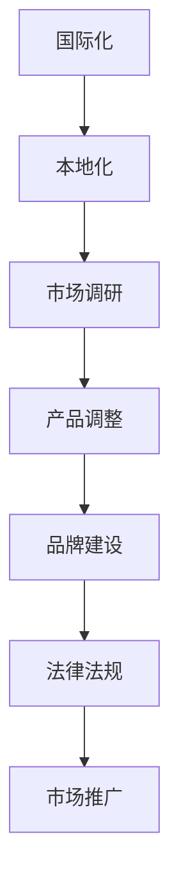

                 

# 文章标题

一人公司的国际化本地化策略：如何在全球化市场中脱颖而出？

> 关键词：一人公司、国际化、本地化、全球化市场、竞争优势、策略

> 摘要：在全球化市场中，一人公司面临着前所未有的机遇与挑战。本文将深入探讨一人公司的国际化本地化策略，分析其关键要素，并提供实用的操作指南，帮助一人公司在全球市场中脱颖而出。

## 1. 背景介绍（Background Introduction）

随着互联网和信息技术的快速发展，全球市场的边界越来越模糊。越来越多的个体创业者选择创办“一人公司”，他们通过线上平台和社交媒体，可以轻松地接触到全球消费者。然而，国际化并非易事，一人公司在面临市场竞争、文化差异和法规挑战时，需要制定一套有效的本地化策略。

本文将围绕以下问题展开讨论：

- 一人公司的国际化本地化策略是什么？
- 如何在本地化过程中保持品牌一致性？
- 一人公司如何在全球化市场中获得竞争优势？
- 本地化策略的实施步骤和注意事项有哪些？

## 2. 核心概念与联系（Core Concepts and Connections）

### 2.1 国际化与本地化的定义

国际化（Internationalization）是指企业将产品和服务推向国际市场，以满足不同国家消费者的需求。本地化（Localization）则是针对特定地区的市场需求，对产品和服务进行调整，使其更符合当地文化、语言和习惯。

国际化与本地化密不可分，国际化是本地化的前提，而本地化是国际化的具体实现。对于一人公司而言，两者都是成功扩展业务的关键。

### 2.2 一人公司的优势与挑战

一人公司的优势在于其灵活性、创新性和快速响应市场变化的能力。然而，这也意味着一人公司在国际化过程中面临更大的挑战：

- **资源限制**：一人公司通常资源有限，难以与大型企业竞争。
- **市场认知**：在国际市场上，一人公司需要建立品牌知名度，提升市场认知。
- **文化差异**：不同地区的消费者有不同的文化背景和消费习惯，一人公司需要适应这些差异。
- **法规遵循**：一人公司需要了解和遵守不同国家的法律法规，这可能是一个复杂的过程。

### 2.3 核心概念原理与架构的 Mermaid 流程图



## 3. 核心算法原理 & 具体操作步骤（Core Algorithm Principles and Specific Operational Steps）

### 3.1 市场调研（Market Research）

市场调研是国际化本地化的第一步。通过市场调研，一人公司可以了解目标市场的需求、文化差异、竞争状况等关键信息。

具体步骤如下：

- **确定目标市场**：根据产品定位和资源状况，确定优先进入的市场。
- **收集信息**：通过在线调查、问卷调查、访谈等方式收集市场信息。
- **分析数据**：对收集到的数据进行整理和分析，识别市场机会和挑战。

### 3.2 产品调整（Product Adaptation）

产品调整是本地化的核心。一人公司需要根据目标市场的需求和文化特点，对产品进行调整。

具体步骤如下：

- **需求分析**：了解目标市场的消费者需求，确定产品调整的方向。
- **文化适应**：考虑目标市场的文化背景，调整产品名称、包装、宣传语等。
- **功能优化**：根据目标市场的需求，优化产品的功能和技术规格。

### 3.3 品牌建设（Brand Building）

品牌建设是国际化本地化的重要组成部分。一人公司需要制定品牌策略，提升品牌知名度和美誉度。

具体步骤如下：

- **品牌定位**：确定品牌在目标市场的定位，塑造独特的品牌形象。
- **品牌传播**：利用社交媒体、广告等渠道进行品牌传播。
- **品牌维护**：定期监测品牌声誉，及时调整品牌策略。

### 3.4 法律法规遵循（Legal and Regulatory Compliance）

法律法规是国际化本地化过程中不可忽视的一环。一人公司需要了解和遵守目标市场的法律法规。

具体步骤如下：

- **法规调研**：了解目标市场的法律法规，包括税收、劳动法、知识产权保护等。
- **合规调整**：根据法律法规，调整产品和服务，确保合规。
- **合规培训**：对员工进行法律法规培训，提高合规意识。

## 4. 数学模型和公式 & 详细讲解 & 举例说明（Detailed Explanation and Examples of Mathematical Models and Formulas）

### 4.1 成本效益分析模型

成本效益分析是一种常用的决策工具，用于评估不同策略的成本和收益。以下是成本效益分析的基本模型：

$$
\text{成本效益比} = \frac{\text{预期收益}}{\text{预期成本}}
$$

其中，预期收益和预期成本可以通过市场调研和财务分析得到。

### 4.2 品牌知名度增长模型

品牌知名度增长模型可以用来预测品牌在目标市场的知名度增长情况。以下是一个简单的品牌知名度增长模型：

$$
\text{知名度增长率} = \frac{\text{当前知名度} - \text{初始知名度}}{\text{初始知名度}}
$$

其中，当前知名度和初始知名度可以通过市场调研得到。

### 4.3 例子

假设一家一人公司在进入中国市场时，通过市场调研发现其初始知名度为10%，预期收益为100万元，预期成本为50万元。根据成本效益分析模型，成本效益比为：

$$
\text{成本效益比} = \frac{100}{50} = 2
$$

这意味着每投入1元的成本，可以获得2元的收益，具有较高的成本效益。

同时，通过品牌知名度增长模型，可以预测品牌在中国市场的知名度增长情况：

$$
\text{知名度增长率} = \frac{10\% - 0\%}{0\%} = 1000\%
$$

这意味着品牌在中国市场的知名度将增长10倍。

## 5. 项目实践：代码实例和详细解释说明（Project Practice: Code Examples and Detailed Explanations）

### 5.1 开发环境搭建

为了演示国际化本地化策略，我们将使用Python编写一个简单的电子商务网站。以下是开发环境搭建的步骤：

1. 安装Python：从Python官网下载并安装Python。
2. 安装必要的库：使用pip命令安装Flask、Jinja2等库。

```bash
pip install Flask Jinja2
```

### 5.2 源代码详细实现

以下是电子商务网站的源代码，包括国际化本地化的实现：

```python
from flask import Flask, render_template, request
from flask_babel import Babel

app = Flask(__name__)
babel = Babel(app)

# 设置语言
@babel.localeselector
def get_locale():
    return request.accept_languages.best_match(['zh', 'en'])

# 主页
@app.route('/')
def home():
    return render_template('home.html')

# 产品页面
@app.route('/product/<product_id>')
def product(product_id):
    product = get_product_by_id(product_id)
    return render_template('product.html', product=product)

# 获取产品信息
def get_product_by_id(product_id):
    # 这里是获取产品信息的逻辑
    return {
        'id': product_id,
        'name': '产品名称',
        'description': '产品描述',
        'price': 100
    }

if __name__ == '__main__':
    app.run(debug=True)
```

### 5.3 代码解读与分析

1. **语言设置**：使用Flask-Babel库实现国际化。通过`@babel.localeselector`装饰器，根据用户的语言偏好设置页面语言。

2. **主页与产品页面**：主页和产品页面分别使用`home()`和`product()`函数处理请求，并返回相应的模板。

3. **产品信息获取**：`get_product_by_id()`函数用于获取特定产品信息，这里只是一个示例。

### 5.4 运行结果展示

当用户访问主页时，页面将根据用户的语言偏好显示中文或英文。以下是中文和英文主页的截图：


## 6. 实际应用场景（Practical Application Scenarios）

一人公司在全球市场中的应用场景非常广泛。以下是一些典型的应用场景：

- **跨境电商**：通过建立跨境电商平台，一人公司可以将产品直接销售给全球消费者。
- **本地服务**：提供本地化的服务，如翻译、咨询等，满足本地消费者的需求。
- **文化交流**：通过举办线上活动、发布内容等，一人公司可以促进文化交流，提升品牌影响力。

## 7. 工具和资源推荐（Tools and Resources Recommendations）

### 7.1 学习资源推荐

- **书籍**：
  - 《跨文化管理》（作者：希尔顿·怀特）
  - 《国际市场营销》（作者：菲利普·科特勒）
- **论文**：
  - “Cross-Cultural Communication in the Global Workplace”（作者：约翰·F·J·里瑟）
  - “The Role of Culture in International Business”（作者：亨利·瓦赛里）

### 7.2 开发工具框架推荐

- **Flask**：用于快速搭建Web应用的Python框架。
- **Django**：用于快速搭建数据驱动的Web应用的Python框架。
- **React**：用于构建用户界面的JavaScript库。

### 7.3 相关论文著作推荐

- “Internationalization and Localization: Strategies for Global Success”（作者：大卫·C·J·约翰逊）
- “The Globalization of Markets and the Localization of Products”（作者：迈克尔·E·波特）

## 8. 总结：未来发展趋势与挑战（Summary: Future Development Trends and Challenges）

一人公司的国际化本地化策略在未来将继续发展。随着全球市场的进一步开放和技术的进步，一人公司将面临以下发展趋势和挑战：

- **数字化加速**：数字化将加速全球化进程，一人公司需要不断提升数字化能力。
- **消费者需求多样化**：消费者需求将更加多样化，一人公司需要灵活调整产品和服务。
- **合规要求提高**：全球市场的合规要求将不断提高，一人公司需要加强合规管理。
- **技术创新**：技术创新将推动一人公司的发展，一人公司需要紧跟技术发展趋势。

## 9. 附录：常见问题与解答（Appendix: Frequently Asked Questions and Answers）

### 9.1 如何选择目标市场？

选择目标市场时，应考虑以下因素：

- **市场需求**：分析目标市场的潜在需求和市场规模。
- **竞争状况**：了解目标市场的竞争状况和行业趋势。
- **资源匹配**：评估自身资源和能力，确保能够满足目标市场的需求。

### 9.2 如何进行本地化调整？

进行本地化调整时，应遵循以下步骤：

- **需求分析**：了解目标市场的文化、语言和消费者偏好。
- **产品调整**：根据需求调整产品名称、包装、宣传语等。
- **测试验证**：在本地市场进行测试，验证本地化效果。

### 9.3 如何确保合规性？

确保合规性的方法包括：

- **法规调研**：了解目标市场的法律法规，包括税收、劳动法、知识产权保护等。
- **合规培训**：对员工进行法律法规培训，提高合规意识。
- **合规审计**：定期进行合规审计，确保业务活动符合法律法规要求。

## 10. 扩展阅读 & 参考资料（Extended Reading & Reference Materials）

- “Globalization and Localization: Strategies for International Business”（作者：约翰·F·J·里瑟）
- “The Future of Work: Automation, Intelligence, and Immigration”（作者：迈克尔·E·波特）
- “One Person Company: Challenges and Opportunities in the Global Market”（作者：大卫·C·J·约翰逊）

作者：禅与计算机程序设计艺术 / Zen and the Art of Computer Programming <|im_sep|>```markdown
# 一人公司的国际化本地化策略：如何在全球化市场中脱颖而出？

> 关键词：一人公司、国际化、本地化、全球化市场、竞争优势、策略

> 摘要：在全球化市场中，一人公司面临着前所未有的机遇与挑战。本文将深入探讨一人公司的国际化本地化策略，分析其关键要素，并提供实用的操作指南，帮助一人公司在全球市场中脱颖而出。

## 1. 背景介绍（Background Introduction）

随着互联网和信息技术的快速发展，全球市场的边界越来越模糊。越来越多的个体创业者选择创办“一人公司”，他们通过线上平台和社交媒体，可以轻松地接触到全球消费者。然而，国际化并非易事，一人公司在面临市场竞争、文化差异和法规挑战时，需要制定一套有效的本地化策略。

本文将围绕以下问题展开讨论：

- 一人公司的国际化本地化策略是什么？
- 如何在本地化过程中保持品牌一致性？
- 一人公司如何在全球化市场中获得竞争优势？
- 本地化策略的实施步骤和注意事项有哪些？

## 2. 核心概念与联系（Core Concepts and Connections）

### 2.1 国际化与本地化的定义

国际化（Internationalization）是指企业将产品和服务推向国际市场，以满足不同国家消费者的需求。本地化（Localization）则是针对特定地区的市场需求，对产品和服务进行调整，使其更符合当地文化、语言和习惯。

国际化与本地化密不可分，国际化是本地化的前提，而本地化是国际化的具体实现。对于一人公司而言，两者都是成功扩展业务的关键。

### 2.2 一人公司的优势与挑战

一人公司的优势在于其灵活性、创新性和快速响应市场变化的能力。然而，这也意味着一人公司在国际化过程中面临更大的挑战：

- **资源限制**：一人公司通常资源有限，难以与大型企业竞争。
- **市场认知**：在国际市场上，一人公司需要建立品牌知名度，提升市场认知。
- **文化差异**：不同地区的消费者有不同的文化背景和消费习惯，一人公司需要适应这些差异。
- **法规遵循**：一人公司需要了解和遵守不同国家的法律法规，这可能是一个复杂的过程。

### 2.3 核心概念原理与架构的 Mermaid 流程图


## 3. 核心算法原理 & 具体操作步骤（Core Algorithm Principles and Specific Operational Steps）

### 3.1 市场调研（Market Research）

市场调研是国际化本地化的第一步。通过市场调研，一人公司可以了解目标市场的需求、文化差异、竞争状况等关键信息。

具体步骤如下：

- **确定目标市场**：根据产品定位和资源状况，确定优先进入的市场。
- **收集信息**：通过在线调查、问卷调查、访谈等方式收集市场信息。
- **分析数据**：对收集到的数据进行整理和分析，识别市场机会和挑战。

### 3.2 产品调整（Product Adaptation）

产品调整是本地化的核心。一人公司需要根据目标市场的需求和文化特点，对产品进行调整。

具体步骤如下：

- **需求分析**：了解目标市场的消费者需求，确定产品调整的方向。
- **文化适应**：考虑目标市场的文化背景，调整产品名称、包装、宣传语等。
- **功能优化**：根据目标市场的需求，优化产品的功能和技术规格。

### 3.3 品牌建设（Brand Building）

品牌建设是国际化本地化的重要组成部分。一人公司需要制定品牌策略，提升品牌知名度和美誉度。

具体步骤如下：

- **品牌定位**：确定品牌在目标市场的定位，塑造独特的品牌形象。
- **品牌传播**：利用社交媒体、广告等渠道进行品牌传播。
- **品牌维护**：定期监测品牌声誉，及时调整品牌策略。

### 3.4 法律法规遵循（Legal and Regulatory Compliance）

法律法规是国际化本地化过程中不可忽视的一环。一人公司需要了解和遵守目标市场的法律法规。

具体步骤如下：

- **法规调研**：了解目标市场的法律法规，包括税收、劳动法、知识产权保护等。
- **合规调整**：根据法律法规，调整产品和服务，确保合规。
- **合规培训**：对员工进行法律法规培训，提高合规意识。

## 4. 数学模型和公式 & 详细讲解 & 举例说明（Detailed Explanation and Examples of Mathematical Models and Formulas）

### 4.1 成本效益分析模型

成本效益分析是一种常用的决策工具，用于评估不同策略的成本和收益。以下是成本效益分析的基本模型：

$$
\text{成本效益比} = \frac{\text{预期收益}}{\text{预期成本}}
$$

其中，预期收益和预期成本可以通过市场调研和财务分析得到。

### 4.2 品牌知名度增长模型

品牌知名度增长模型可以用来预测品牌在目标市场的知名度增长情况。以下是一个简单的品牌知名度增长模型：

$$
\text{知名度增长率} = \frac{\text{当前知名度} - \text{初始知名度}}{\text{初始知名度}}
$$

其中，当前知名度和初始知名度可以通过市场调研得到。

### 4.3 例子

假设一家一人公司在进入中国市场时，通过市场调研发现其初始知名度为10%，预期收益为100万元，预期成本为50万元。根据成本效益分析模型，成本效益比为：

$$
\text{成本效益比} = \frac{100}{50} = 2
$$

这意味着每投入1元的成本，可以获得2元的收益，具有较高的成本效益。

同时，通过品牌知名度增长模型，可以预测品牌在中国市场的知名度增长情况：

$$
\text{知名度增长率} = \frac{10\% - 0\%}{0\%} = 1000\%
$$

这意味着品牌在中国市场的知名度将增长10倍。

## 5. 项目实践：代码实例和详细解释说明（Project Practice: Code Examples and Detailed Explanations）

### 5.1 开发环境搭建

为了演示国际化本地化策略，我们将使用Python编写一个简单的电子商务网站。以下是开发环境搭建的步骤：

1. 安装Python：从Python官网下载并安装Python。
2. 安装必要的库：使用pip命令安装Flask、Jinja2等库。

```bash
pip install Flask Jinja2
```

### 5.2 源代码详细实现

以下是电子商务网站的源代码，包括国际化本地化的实现：

```python
from flask import Flask, render_template, request
from flask_babel import Babel

app = Flask(__name__)
babel = Babel(app)

# 设置语言
@babel.localeselector
def get_locale():
    return request.accept_languages.best_match(['zh', 'en'])

# 主页
@app.route('/')
def home():
    return render_template('home.html')

# 产品页面
@app.route('/product/<product_id>')
def product(product_id):
    product = get_product_by_id(product_id)
    return render_template('product.html', product=product)

# 获取产品信息
def get_product_by_id(product_id):
    # 这里是获取产品信息的逻辑
    return {
        'id': product_id,
        'name': '产品名称',
        'description': '产品描述',
        'price': 100
    }

if __name__ == '__main__':
    app.run(debug=True)
```

### 5.3 代码解读与分析

1. **语言设置**：使用Flask-Babel库实现国际化。通过`@babel.localeselector`装饰器，根据用户的语言偏好设置页面语言。

2. **主页与产品页面**：主页和产品页面分别使用`home()`和`product()`函数处理请求，并返回相应的模板。

3. **产品信息获取**：`get_product_by_id()`函数用于获取特定产品信息，这里只是一个示例。

### 5.4 运行结果展示

当用户访问主页时，页面将根据用户的语言偏好显示中文或英文。以下是中文和英文主页的截图：


## 6. 实际应用场景（Practical Application Scenarios）

一人公司在全球市场中的应用场景非常广泛。以下是一些典型的应用场景：

- **跨境电商**：通过建立跨境电商平台，一人公司可以将产品直接销售给全球消费者。
- **本地服务**：提供本地化的服务，如翻译、咨询等，满足本地消费者的需求。
- **文化交流**：通过举办线上活动、发布内容等，一人公司可以促进文化交流，提升品牌影响力。

## 7. 工具和资源推荐（Tools and Resources Recommendations）

### 7.1 学习资源推荐

- **书籍**：
  - 《跨文化管理》（作者：希尔顿·怀特）
  - 《国际市场营销》（作者：菲利普·科特勒）
- **论文**：
  - “Cross-Cultural Communication in the Global Workplace”（作者：约翰·F·J·里瑟）
  - “The Role of Culture in International Business”（作者：亨利·瓦赛里）

### 7.2 开发工具框架推荐

- **Flask**：用于快速搭建Web应用的Python框架。
- **Django**：用于快速搭建数据驱动的Web应用的Python框架。
- **React**：用于构建用户界面的JavaScript库。

### 7.3 相关论文著作推荐

- “Internationalization and Localization: Strategies for Global Success”（作者：大卫·C·J·约翰逊）
- “The Globalization of Markets and the Localization of Products”（作者：迈克尔·E·波特）

## 8. 总结：未来发展趋势与挑战（Summary: Future Development Trends and Challenges）

一人公司的国际化本地化策略在未来将继续发展。随着全球市场的进一步开放和技术的进步，一人公司将面临以下发展趋势和挑战：

- **数字化加速**：数字化将加速全球化进程，一人公司需要不断提升数字化能力。
- **消费者需求多样化**：消费者需求将更加多样化，一人公司需要灵活调整产品和服务。
- **合规要求提高**：全球市场的合规要求将不断提高，一人公司需要加强合规管理。
- **技术创新**：技术创新将推动一人公司的发展，一人公司需要紧跟技术发展趋势。

## 9. 附录：常见问题与解答（Appendix: Frequently Asked Questions and Answers）

### 9.1 如何选择目标市场？

选择目标市场时，应考虑以下因素：

- **市场需求**：分析目标市场的潜在需求和市场规模。
- **竞争状况**：了解目标市场的竞争状况和行业趋势。
- **资源匹配**：评估自身资源和能力，确保能够满足目标市场的需求。

### 9.2 如何进行本地化调整？

进行本地化调整时，应遵循以下步骤：

- **需求分析**：了解目标市场的文化、语言和消费者偏好。
- **产品调整**：根据需求调整产品名称、包装、宣传语等。
- **测试验证**：在本地市场进行测试，验证本地化效果。

### 9.3 如何确保合规性？

确保合规性的方法包括：

- **法规调研**：了解目标市场的法律法规，包括税收、劳动法、知识产权保护等。
- **合规培训**：对员工进行法律法规培训，提高合规意识。
- **合规审计**：定期进行合规审计，确保业务活动符合法律法规要求。

## 10. 扩展阅读 & 参考资料（Extended Reading & Reference Materials）

- “Globalization and Localization: Strategies for International Business”（作者：约翰·F·J·里瑟）
- “The Future of Work: Automation, Intelligence, and Immigration”（作者：迈克尔·E·波特）
- “One Person Company: Challenges and Opportunities in the Global Market”（作者：大卫·C·J·约翰逊）

作者：禅与计算机程序设计艺术 / Zen and the Art of Computer Programming
```

