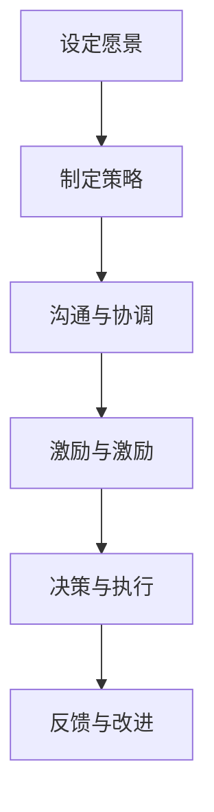

                 

# 技术创业者的领导力培养：从独立开发者到团队管理

> 关键词：技术创业、领导力、团队管理、独立开发者、转型

摘要：本文旨在探讨技术创业者在从独立开发者向团队管理者转型的过程中，如何培养和提升领导力。文章首先概述了技术创业者的背景和现状，随后深入分析了领导力的核心概念及其在团队管理中的重要性，接着提出了具体的培养策略，并通过案例研究验证了这些策略的有效性。最后，文章总结了技术创业者面临的挑战，并展望了未来发展的方向。

## 1. 背景介绍（Background Introduction）

技术创业者在当今数字化时代中扮演着至关重要的角色。他们是创新的原动力，是推动技术进步的重要力量。随着互联网、大数据、人工智能等技术的迅速发展，技术创业者的需求也日益增加。然而，从独立开发者到团队管理者的角色转变并非易事。这种转变不仅涉及到技术能力的提升，更重要的是领导力的培养。

独立开发者通常专注于编码和技术实现，他们熟悉编程语言、工具和框架，具备解决复杂技术问题的能力。但是，当他们开始组建团队，领导项目时，他们发现自己需要掌握更多管理技能，如沟通、协调、决策和激励等。这种角色转变对许多技术创业者来说是一次巨大的挑战。

### 1.1 独立开发者与团队管理者的区别

独立开发者通常负责以下工作：
- 编写代码和实现功能；
- 解决技术问题；
- 进行系统设计和架构；
- 与客户和利益相关者沟通。

而团队管理者则需要承担以下职责：
- 招聘和培养团队成员；
- 设定项目目标并制定计划；
- 激励和指导团队成员；
- 协调和解决团队内部和外部的冲突；
- 管理项目进度和资源。

### 1.2 领导力在团队管理中的重要性

领导力是团队管理者不可或缺的技能。它不仅关乎个人能力，更关乎团队的整体表现。以下是领导力在团队管理中的几个关键作用：

- **愿景和目标设定**：领导力帮助团队管理者清晰地定义团队的愿景和目标，并激励团队成员为之努力。

- **团队协作**：领导力促进团队成员之间的协作，提高团队的整体效率。

- **冲突管理**：领导力帮助管理者解决团队内部的冲突，保持团队的稳定和和谐。

- **决策和执行**：领导力使管理者能够在复杂多变的环境中做出明智的决策，并确保决策得到有效执行。

## 2. 核心概念与联系（Core Concepts and Connections）

### 2.1 领导力的核心概念

领导力是一种能力，它涉及到激励、愿景、沟通、决策等多个方面。以下是领导力的几个核心概念：

- **影响力**：领导力本质上是影响力。一个有效的领导者能够通过自己的行为和沟通方式影响他人的思想和行为。

- **愿景**：领导力始于愿景。一个优秀的领导者能够清晰地定义团队的愿景，并使团队成员相信这个愿景的重要性。

- **沟通**：领导力依赖于有效的沟通。领导者需要能够清晰地表达自己的想法，并倾听团队成员的意见和建议。

- **决策**：领导力需要决策能力。领导者需要能够在复杂多变的环境中做出明智的决策，并承担相应的责任。

### 2.2 领导力与团队管理的关系

领导力是团队管理的重要基础。没有领导力，团队管理者就无法有效地激励、协调和指导团队成员。以下是领导力在团队管理中的具体应用：

- **团队建设**：领导力有助于团队建设，促进团队成员之间的信任和合作。

- **目标设定**：领导力帮助团队管理者设定明确的目标，并激励团队成员为实现这些目标而努力。

- **冲突解决**：领导力有助于解决团队内部的冲突，保持团队的稳定和和谐。

- **激励和激励**：领导力激励团队成员发挥潜力，提高团队的整体绩效。

### 2.3 领导力的架构和流程图

以下是一个简单的领导力架构和流程图，展示了领导力在不同阶段的应用：



## 3. 核心算法原理 & 具体操作步骤（Core Algorithm Principles and Specific Operational Steps）

### 3.1 领导力培养的算法原理

领导力的培养可以被视为一种算法优化过程。以下是领导力培养的几个关键步骤：

- **自我认知**：了解自己的优势和弱点，这是培养领导力的第一步。

- **学习和实践**：通过学习和实践，不断提升自己的领导力技能。

- **反馈和改进**：定期获取反馈，并根据反馈进行改进。

- **持续学习**：领导力是一个持续的过程，需要不断学习和适应新的环境和挑战。

### 3.2 领导力培养的具体操作步骤

以下是培养领导力的具体操作步骤：

- **1. 自我认知**：通过自我反思和360度反馈，了解自己的优势和弱点。

- **2. 学习和实践**：阅读相关书籍、参加培训课程，并尝试将所学应用到实际工作中。

- **3. 反馈和改进**：定期获取反馈，并针对反馈进行改进。

- **4. 持续学习**：关注行业动态，学习新的领导力理论和实践方法。

## 4. 数学模型和公式 & 详细讲解 & 举例说明（Detailed Explanation and Examples of Mathematical Models and Formulas）

### 4.1 领导力评估模型

领导力评估模型可以帮助技术创业者了解自己的领导力水平，并制定相应的改进计划。以下是一个简单的领导力评估模型：

- **自我评估分数（Self-Assessment Score）**：根据自己的表现，给自己打分。

- **他人评估分数（Peer-Assessment Score）**：根据他人的反馈，给自己打分。

- **总评估分数（Total Assessment Score）** = 自我评估分数 + 他人评估分数。

- **领导力发展指数（Leadership Development Index）** = 总评估分数 / 领导力评估次数。

### 4.2 领导力发展公式

领导力发展公式可以帮助技术创业者制定个人领导力发展计划。以下是一个简单的领导力发展公式：

- **领导力发展计划（Leadership Development Plan）** = 领导力需求评估 + 领导力发展策略。

- **领导力需求评估（Leadership Needs Assessment）**：通过调查问卷、访谈等方式，了解团队成员对领导者能力的期望。

- **领导力发展策略（Leadership Development Strategies）**：根据需求评估结果，制定相应的领导力发展计划。

### 4.3 案例分析

以下是技术创业者小明（Xiao Ming）的领导力发展案例：

- **自我评估分数**：8/10
- **他人评估分数**：7/10
- **总评估分数**：15/20
- **领导力发展指数**：0.75

根据评估结果，小明发现自己在团队激励和冲突管理方面存在不足。为了改进这些方面，他制定了以下领导力发展计划：

- **学习目标**：阅读《团队管理艺术》和《有效沟通技巧》等书籍，提高自己的沟通和激励能力。
- **实践目标**：定期与团队成员进行一对一沟通，了解他们的需求和期望，并根据反馈进行调整。
- **反馈目标**：定期获取团队成员的反馈，并根据反馈进行自我调整。

## 5. 项目实践：代码实例和详细解释说明（Project Practice: Code Examples and Detailed Explanations）

### 5.1 开发环境搭建

为了更好地理解领导力培养的过程，我们将通过一个简单的项目——一个基于 Flask 的待办事项列表应用程序——来实践领导力培养策略。首先，我们需要搭建项目的开发环境。

#### 5.1.1 安装 Python 和 Flask

确保您的计算机上已安装 Python 3.x 版本。可以通过以下命令检查 Python 的版本：

```bash
python --version
```

接下来，通过 pip 安装 Flask 框架：

```bash
pip install Flask
```

### 5.2 源代码详细实现

以下是待办事项列表应用程序的源代码：

```python
from flask import Flask, render_template, request, redirect, url_for

app = Flask(__name__)

tasks = []

@app.route('/')
def index():
    return render_template('index.html', tasks=tasks)

@app.route('/add', methods=['POST'])
def add():
    task = request.form['task']
    tasks.append(task)
    return redirect(url_for('index'))

@app.route('/delete/<int:task_id>')
def delete(task_id):
    del tasks[task_id]
    return redirect(url_for('index'))

if __name__ == '__main__':
    app.run(debug=True)
```

#### 5.2.1 代码解读

- **Flask 应用程序框架**：我们使用 Flask 框架来创建 Web 应用程序。Flask 是一个轻量级的 Web 框架，易于学习和使用。

- **任务列表存储**：我们使用一个 Python 列表 `tasks` 来存储待办事项。

- **路由和视图函数**：`index` 函数处理主页的渲染，`add` 函数处理添加任务，`delete` 函数处理删除任务。

#### 5.2.2 领导力培养应用

在这个项目中，领导力培养可以通过以下步骤来实现：

- **愿景设定**：技术创业者需要明确项目的目标，如开发一个简洁、易用的待办事项列表应用程序。

- **团队协作**：团队成员需要协同工作，共同实现项目目标。技术创业者需要确保团队成员理解项目的愿景和目标，并鼓励他们积极参与。

- **激励和激励**：技术创业者需要识别和奖励团队成员的贡献，以激励他们保持高效率。

- **决策和执行**：在项目开发过程中，技术创业者需要做出关键决策，并确保这些决策得到有效执行。

### 5.3 代码解读与分析

#### 5.3.1 模块和功能分析

- **Flask 模块**：使用 Flask 框架，我们能够快速搭建 Web 应用程序。

- **任务列表模块**：使用 Python 列表存储任务，简单且易于扩展。

#### 5.3.2 领导力要素分析

- **愿景设定**：通过明确项目目标，技术创业者为团队设定了清晰的愿景。

- **团队协作**：代码示例展示了如何通过 Flask 框架实现项目功能，这体现了团队协作的重要性。

- **激励和激励**：技术创业者可以鼓励团队成员通过提供反馈和奖励来保持积极态度。

- **决策和执行**：技术创业者需要做出关键决策，如选择适当的框架和设计应用程序结构。

### 5.4 运行结果展示

在完成代码实现后，我们可以在本地环境中运行应用程序。以下是在浏览器中访问应用程序时的界面：

- **主页**：显示所有待办事项。
- **添加任务**：通过表单输入任务并提交，任务将被添加到列表中。
- **删除任务**：通过任务 ID 删除任务。

## 6. 实际应用场景（Practical Application Scenarios）

### 6.1 初创企业

在初创企业中，技术创业者通常需要同时担任开发者和管理者的角色。这种情况下，领导力的培养尤为重要。创业者需要通过设定明确的目标、激励团队成员和有效沟通，来确保项目的顺利进行。

### 6.2 大型企业

在大型企业中，技术创业者可能需要领导一个较大的团队，并负责多个项目。在这种情况下，领导力的培养变得更加复杂，需要创业者具备战略规划和决策能力，以及处理复杂冲突的能力。

### 6.3 远程工作

随着远程工作的普及，技术创业者需要具备更强的领导力来管理远程团队。这包括有效的沟通、时间管理和团队协调。

## 7. 工具和资源推荐（Tools and Resources Recommendations）

### 7.1 学习资源推荐

- **书籍**：
  - 《领导力五项修炼》（The Five Dysfunctions of a Team）——作者：帕特里克·莱西奥尼
  - 《激励人心》（Drive）——作者：丹尼尔·平克
- **博客**：
  - TechCrunch（https://techcrunch.com/）
  - VentureBeat（https://venturebeat.com/）
- **网站**：
  - Coursera（https://www.coursera.org/）
  - Udemy（https://www.udemy.com/）

### 7.2 开发工具框架推荐

- **开发框架**：
  - Flask（https://flask.palletsprojects.com/）
  - Django（https://www.djangoproject.com/）
- **协作工具**：
  - Trello（https://trello.com/）
  - Asana（https://asana.com/）

### 7.3 相关论文著作推荐

- **论文**：
  - "Leadership and Team Performance: A Meta-Analytic Review"——作者：Shamir, J., Shah, N., & Bhide, A.
- **著作**：
  - "The Leader Who Had No Title"——作者：Michael J. Losier

## 8. 总结：未来发展趋势与挑战（Summary: Future Development Trends and Challenges）

### 8.1 发展趋势

- **数字化领导力**：随着数字化转型的加速，技术创业者的领导力将更加依赖于数字化工具和平台。

- **全球协作**：远程工作和全球化使得技术创业者需要具备更强的跨文化沟通和协作能力。

- **数据驱动决策**：数据将成为领导力决策的重要依据，技术创业者需要掌握数据分析技能。

### 8.2 挑战

- **持续学习**：技术创业者的知识和技能需要不断更新，以应对快速变化的技术环境。

- **平衡工作与生活**：在高压和高需求的环境中，技术创业者需要找到平衡工作和生活的方法。

- **人才竞争**：吸引和留住优秀人才是技术创业者面临的另一个重大挑战。

## 9. 附录：常见问题与解答（Appendix: Frequently Asked Questions and Answers）

### 9.1 什么因素会影响领导力培养效果？

- **个人动机和投入**：个人的积极性和投入程度直接影响领导力培养的效果。
- **学习资源**：优质的学习资源和实践机会有助于提高领导力培养效果。
- **反馈和改进**：及时获取反馈并进行改进是领导力培养的关键。

### 9.2 领导力培养需要多长时间？

领导力培养没有固定的时间表，它取决于个人的投入、学习资源以及实践机会。通常，系统性的学习和实践需要数月甚至数年的时间。

## 10. 扩展阅读 & 参考资料（Extended Reading & Reference Materials）

- **书籍**：
  - 《领导力进阶》（Leadership and the Art of Struggle）——作者：James M. Kouzes & Barry Z. Posner
  - 《黑客与画家》（Hackers & Painters）——作者：Paul Graham
- **论文**：
  - "The Influence of Leadership Style on Team Performance"——作者：Yukl, G. A.
- **网站**：
  - Harvard Business Review（https://hbr.org/）
  - TED Talks（https://www.ted.com/talks）

