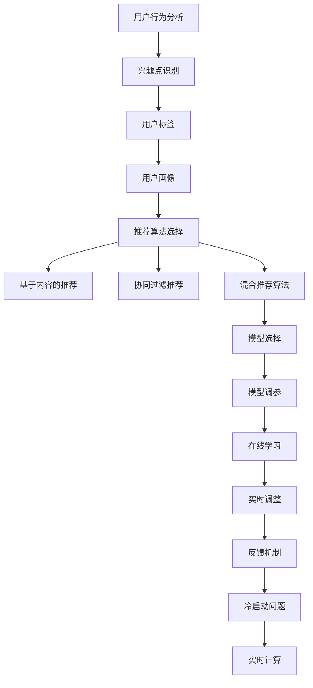

                 

### 文章标题

个性化知识订阅要不断优化推荐算法

> 关键词：个性化订阅、推荐算法、用户满意度、算法优化、机器学习

> 摘要：本文深入探讨个性化知识订阅系统中推荐算法的优化策略，从用户行为分析、算法选择到实时调整，详细解析如何提升用户满意度和订阅粘性。通过结合理论研究和实践案例，阐述推荐系统在个性化知识服务中的重要性和未来发展方向。

### 背景介绍（Background Introduction）

在互联网时代，个性化知识订阅已经成为许多用户获取信息的重要方式。通过订阅，用户可以根据自己的兴趣和需求，定期获取相关领域的最新资讯、研究进展和专业知识。然而，随着订阅内容的多样化和用户需求的个性差异化，如何设计出既符合用户期望又能够持续吸引他们关注的推荐算法，成为个性化知识订阅系统面临的重大挑战。

推荐算法在个性化知识订阅系统中的作用至关重要。它不仅影响用户的订阅体验，还直接影响平台的用户满意度和订阅粘性。一个优秀的推荐算法能够准确地捕捉用户的兴趣点，提供个性化的内容推荐，从而提高用户满意度和订阅意愿。相反，一个糟糕的推荐算法可能会导致用户失去兴趣，甚至取消订阅。

目前，个性化知识订阅系统主要采用基于内容的推荐算法、协同过滤推荐算法和混合推荐算法等。这些算法各有优缺点，需要根据具体的应用场景和用户需求进行选择和优化。例如，基于内容的推荐算法在处理高度结构化的数据时表现较好，而协同过滤推荐算法在处理大量用户行为数据时更具优势。

尽管已有许多研究在优化推荐算法方面取得了显著成果，但个性化知识订阅系统仍然面临着许多挑战。首先，用户需求的多样化和动态变化使得推荐算法难以保持长期的有效性。其次，推荐算法的准确性和实时性需要不断调整和优化，以适应快速变化的市场环境和用户需求。最后，如何确保推荐算法的公平性和透明性，避免算法偏见和误导用户，也是需要深入探讨的问题。

### 核心概念与联系（Core Concepts and Connections）

为了更好地理解个性化知识订阅系统中推荐算法的优化策略，我们需要首先了解以下几个核心概念：

#### 1. 用户行为分析

用户行为分析是推荐系统的基础。通过分析用户的历史行为数据，如浏览记录、收藏行为、点赞和评论等，我们可以了解用户的兴趣偏好和需求。用户行为分析可以分为以下几个方面：

- **兴趣点识别**：通过分析用户的行为模式，识别出用户的兴趣点，如特定领域、关键词或主题。
- **用户标签**：根据用户的兴趣和行为特征，为用户创建标签，以便更好地进行个性化推荐。
- **用户画像**：综合用户的行为数据、个人信息和社交关系，构建一个完整的用户画像，为推荐算法提供更全面的用户信息。

#### 2. 推荐算法

推荐算法是推荐系统的核心。根据不同的应用场景和数据特点，推荐算法可以分为以下几种类型：

- **基于内容的推荐算法**：根据用户的历史行为和兴趣，推荐与之相似的内容。常用的算法包括余弦相似度、TF-IDF和相似性搜索等。
- **协同过滤推荐算法**：根据用户的行为数据，找到与目标用户相似的用户，然后推荐这些用户喜欢的商品或内容。常用的算法包括基于用户的协同过滤、基于模型的协同过滤和矩阵分解等。
- **混合推荐算法**：结合多种推荐算法的优点，以实现更准确的推荐。例如，可以结合基于内容的推荐和协同过滤推荐，或基于深度学习的推荐算法。

#### 3. 算法优化

算法优化是提高推荐系统性能的关键。以下是一些常见的优化策略：

- **特征工程**：通过提取和组合用户行为数据、内容特征和上下文信息，构建更有效的推荐特征。
- **模型选择**：根据数据特点和业务需求，选择合适的推荐算法模型。
- **模型调参**：通过调整模型参数，优化模型的性能。
- **在线学习**：实时更新模型，以适应用户需求的动态变化。

#### 4. 实时调整

实时调整是确保推荐算法准确性和实时性的关键。以下是一些常见的实时调整策略：

- **反馈机制**：根据用户对推荐内容的反馈，调整推荐策略，以提高推荐准确性。
- **冷启动问题**：对于新用户或新内容，采用适当的策略进行推荐，以避免冷启动问题。
- **实时计算**：通过分布式计算和大数据处理技术，实现实时推荐。

#### Mermaid 流程图（Mermaid Flowchart）

以下是个性化知识订阅系统中推荐算法的优化流程图：



### 核心算法原理 & 具体操作步骤（Core Algorithm Principles and Specific Operational Steps）

#### 1. 基于内容的推荐算法

基于内容的推荐算法主要通过分析用户的历史行为和兴趣，找到与用户当前兴趣相似的内容进行推荐。其核心步骤如下：

- **内容特征提取**：提取内容的关键词、标签、主题等信息，构建内容特征向量。
- **用户兴趣特征提取**：提取用户的历史行为数据，如浏览记录、收藏和点赞等，构建用户兴趣特征向量。
- **相似度计算**：计算用户兴趣特征向量和内容特征向量之间的相似度，选择相似度最高的内容进行推荐。
- **推荐结果生成**：根据相似度计算结果，生成推荐结果。

#### 2. 协同过滤推荐算法

协同过滤推荐算法主要通过分析用户行为数据，找到与目标用户相似的用户，然后推荐这些用户喜欢的商品或内容。其核心步骤如下：

- **用户行为数据预处理**：将用户行为数据转换为用户-项目矩阵。
- **相似度计算**：计算用户之间的相似度，可以使用余弦相似度、皮尔逊相关系数等方法。
- **邻居用户选择**：根据相似度计算结果，选择与目标用户最相似的邻居用户。
- **推荐结果生成**：根据邻居用户的兴趣，为用户推荐相似的内容。

#### 3. 混合推荐算法

混合推荐算法结合了基于内容的推荐和协同过滤推荐的优势，以提高推荐准确性。其核心步骤如下：

- **内容特征提取**：提取内容的关键词、标签、主题等信息，构建内容特征向量。
- **用户兴趣特征提取**：提取用户的历史行为数据，如浏览记录、收藏和点赞等，构建用户兴趣特征向量。
- **协同过滤推荐**：根据用户行为数据，计算用户之间的相似度，选择与目标用户最相似的邻居用户，推荐邻居用户喜欢的商品或内容。
- **基于内容的推荐**：根据内容特征向量，为用户推荐与用户兴趣相似的内容。
- **推荐结果融合**：将协同过滤推荐和基于内容的推荐结果进行融合，生成最终的推荐结果。

### 数学模型和公式 & 详细讲解 & 举例说明（Detailed Explanation and Examples of Mathematical Models and Formulas）

#### 1. 余弦相似度

余弦相似度是一种常用的相似度计算方法，用于衡量两个向量之间的相似程度。其计算公式如下：

$$
\text{余弦相似度} = \frac{\text{向量A} \cdot \text{向量B}}{|\text{向量A}| |\text{向量B}|}
$$

其中，$\text{向量A}$和$\text{向量B}$是两个向量，$\cdot$表示向量的内积，$|$表示向量的模长。

#### 2. 皮尔逊相关系数

皮尔逊相关系数是一种衡量两个变量之间线性相关程度的指标，其计算公式如下：

$$
\text{皮尔逊相关系数} = \frac{\sum_{i=1}^{n} (\text{X}_i - \bar{X}) (\text{Y}_i - \bar{Y})}{\sqrt{\sum_{i=1}^{n} (\text{X}_i - \bar{X})^2} \sqrt{\sum_{i=1}^{n} (\text{Y}_i - \bar{Y})^2}}
$$

其中，$X_i$和$Y_i$是两个变量，$\bar{X}$和$\bar{Y}$是两个变量的平均值，$n$是数据点的数量。

#### 3. 矩阵分解

矩阵分解是一种用于协同过滤推荐算法的常见方法，其目的是将用户-项目矩阵分解为用户特征矩阵和项目特征矩阵。其计算公式如下：

$$
\text{用户-项目矩阵} = \text{用户特征矩阵} \times \text{项目特征矩阵}
$$

其中，$\text{用户特征矩阵}$和$\text{项目特征矩阵}$是低维特征矩阵，通过矩阵分解，可以降低原始数据的维度，从而提高计算效率和推荐准确性。

#### 示例

假设有一个用户-项目矩阵如下：

| 用户 | 项目1 | 项目2 | 项目3 |
| ---- | ---- | ---- | ---- |
| 用户1 | 1 | 0 | 1 |
| 用户2 | 1 | 1 | 0 |
| 用户3 | 0 | 1 | 1 |

我们可以使用矩阵分解方法将这个用户-项目矩阵分解为两个低维特征矩阵：

- 用户特征矩阵：

| 用户 | 特征1 | 特征2 |
| ---- | ---- | ---- |
| 用户1 | 0.8 | 0.6 |
| 用户2 | 0.6 | 0.4 |
| 用户3 | 0.2 | 0.8 |

- 项目特征矩阵：

| 项目 | 特征1 | 特征2 |
| ---- | ---- | ---- |
| 项目1 | 0.4 | 0.2 |
| 项目2 | 0.2 | 0.8 |
| 项目3 | 0.6 | 0.4 |

通过矩阵分解，我们可以得到每个用户和项目的低维特征表示，从而提高推荐准确性。

### 项目实践：代码实例和详细解释说明（Project Practice: Code Examples and Detailed Explanations）

在本节中，我们将通过一个简单的Python代码实例，展示如何使用基于内容的推荐算法进行个性化知识订阅推荐。这个示例将包括以下几个步骤：

1. **数据预处理**：加载数据集，提取用户兴趣和内容特征。
2. **内容特征提取**：使用TF-IDF模型提取内容特征。
3. **相似度计算**：计算用户兴趣特征和内容特征之间的相似度。
4. **推荐结果生成**：根据相似度计算结果，生成推荐列表。

#### 1. 数据预处理

首先，我们需要加载数据集。这里我们使用一个虚构的数据集，包含用户的历史行为数据（如浏览记录、收藏和点赞等）和内容数据（如文章标题、摘要和关键词等）。

```python
import pandas as pd

# 加载数据集
data = pd.read_csv('data.csv')

# 数据预处理
data['title'] = data['title'].apply(lambda x: x.lower())
data['keywords'] = data['keywords'].apply(lambda x: x.lower())
```

#### 2. 内容特征提取

接下来，我们使用TF-IDF模型提取内容特征。TF-IDF（Term Frequency-Inverse Document Frequency）是一种常用的方法，用于评估一个词对于一个文件的重要性。

```python
from sklearn.feature_extraction.text import TfidfVectorizer

# 初始化TF-IDF模型
vectorizer = TfidfVectorizer()

# 提取内容特征
content_features = vectorizer.fit_transform(data['title'] + ' ' + data['keywords'])
```

#### 3. 相似度计算

然后，我们计算用户兴趣特征和内容特征之间的相似度。这里我们使用余弦相似度作为相似度度量。

```python
from sklearn.metrics.pairwise import cosine_similarity

# 计算相似度
similarity_matrix = cosine_similarity(content_features, content_features)
```

#### 4. 推荐结果生成

最后，我们根据相似度计算结果，生成推荐列表。我们可以为每个用户生成一个推荐列表，其中包含相似度最高的内容。

```python
# 生成推荐列表
def generate_recommendations(similarity_matrix, user_index, top_n):
    user_similarity = similarity_matrix[user_index]
    sorted_indices = user_similarity.argsort()[::-1]
    return [data['title'][index] for index in sorted_indices[1:top_n + 1]]

# 测试推荐
user_index = 0  # 假设我们要为用户0生成推荐
top_n = 5       # 推荐数量
recommendations = generate_recommendations(similarity_matrix, user_index, top_n)
print('推荐结果：', recommendations)
```

以上代码将输出一个包含5个推荐内容的列表，这些内容与用户0的兴趣最相似。通过不断迭代和优化推荐算法，我们可以进一步提升推荐准确性，从而提高用户满意度和订阅粘性。

### 实际应用场景（Practical Application Scenarios）

个性化知识订阅系统在许多领域都有广泛的应用，以下是一些实际应用场景：

#### 1. 学术领域

在学术领域，个性化知识订阅系统可以帮助研究人员获取与其研究领域相关的最新研究成果、学术会议信息和学术资源。通过分析用户的历史行为和兴趣，推荐系统可以提供个性化的学术推荐，提高研究效率。

#### 2. 职场领域

在职场领域，个性化知识订阅系统可以帮助职场人士获取与其职业相关的最新资讯、技能培训和职业发展机会。通过分析用户的职业背景和兴趣，推荐系统可以提供个性化的职业推荐，帮助用户不断提升自己的职业竞争力。

#### 3. 健康领域

在健康领域，个性化知识订阅系统可以帮助用户获取与其健康状况相关的健康知识、医疗资源和康复建议。通过分析用户的历史健康数据和行为，推荐系统可以提供个性化的健康推荐，帮助用户更好地管理自己的健康。

#### 4. 教育领域

在教育领域，个性化知识订阅系统可以帮助学生获取与其学习兴趣和学习目标相关的课程资源、学习方法和辅导建议。通过分析学生的学习行为和兴趣，推荐系统可以提供个性化的教育推荐，提高学习效果和满意度。

### 工具和资源推荐（Tools and Resources Recommendations）

为了更好地开展个性化知识订阅系统的设计和优化，以下是一些建议的工具和资源：

#### 1. 学习资源推荐

- **书籍**：《推荐系统实践》（Recommender Systems Handbook）、《机器学习》（Machine Learning）
- **论文**：谷歌的“TensorFlow Recommenders”（TFRS）和“YouTube推荐算法”等相关论文
- **博客**：相关技术博客，如“TensorFlow官方博客”、“Google AI博客”

#### 2. 开发工具框架推荐

- **开发工具**：Python、R语言、Jupyter Notebook等
- **框架**：TensorFlow、PyTorch、Scikit-learn等

#### 3. 相关论文著作推荐

- **论文**：Google AI的“TensorFlow Recommenders”（TFRS）论文
- **著作**：《推荐系统实践》（Recommender Systems Handbook）

### 总结：未来发展趋势与挑战（Summary: Future Development Trends and Challenges）

个性化知识订阅系统在提高用户满意度和订阅粘性方面具有巨大的潜力。然而，随着用户需求的不断变化和数据量的爆炸式增长，推荐系统面临着许多挑战和机遇。

#### 1. 未来发展趋势

- **深度学习与推荐系统的结合**：深度学习在处理复杂数据和特征表示方面具有显著优势，未来将更多地应用于推荐系统中。
- **实时推荐**：随着物联网、5G和云计算技术的发展，实时推荐将成为个性化知识订阅系统的关键需求。
- **跨领域推荐**：跨领域推荐可以将不同领域的知识进行整合，为用户提供更丰富的信息来源。
- **隐私保护与数据安全**：在推荐系统的设计和优化过程中，确保用户隐私和数据安全成为越来越重要的议题。

#### 2. 挑战与应对策略

- **数据质量和多样性**：保证数据质量和多样性是推荐系统准确性和有效性的基础。通过数据清洗、数据增强和特征工程等方法，可以提高数据质量和多样性。
- **实时性**：实现实时推荐需要高效的数据处理和计算能力。采用分布式计算和大数据处理技术，可以提高推荐系统的实时性。
- **算法公平性与透明性**：确保推荐算法的公平性和透明性，避免算法偏见和误导用户。通过算法解释和可视化技术，提高算法的透明性。
- **用户反馈与持续优化**：及时收集用户反馈，不断优化推荐算法和策略，以提高推荐准确性和用户满意度。

### 附录：常见问题与解答（Appendix: Frequently Asked Questions and Answers）

#### 1. 什么是个性化知识订阅系统？

个性化知识订阅系统是一种基于用户兴趣和行为数据，为用户提供个性化推荐内容的服务系统。它通过分析用户的历史行为数据，为用户推荐与其兴趣相关的知识内容，从而提高用户的满意度和订阅粘性。

#### 2. 推荐算法有哪些类型？

推荐算法主要包括以下类型：

- **基于内容的推荐算法**：根据用户的历史行为和兴趣，推荐与之相似的内容。
- **协同过滤推荐算法**：根据用户的行为数据，找到与目标用户相似的用户，然后推荐这些用户喜欢的商品或内容。
- **混合推荐算法**：结合多种推荐算法的优点，以提高推荐准确性。

#### 3. 如何优化推荐算法？

优化推荐算法可以从以下几个方面进行：

- **特征工程**：通过提取和组合用户行为数据和内容特征，构建更有效的推荐特征。
- **模型选择**：根据数据特点和业务需求，选择合适的推荐算法模型。
- **模型调参**：通过调整模型参数，优化模型的性能。
- **在线学习**：实时更新模型，以适应用户需求的动态变化。

### 扩展阅读 & 参考资料（Extended Reading & Reference Materials）

为了更好地了解个性化知识订阅系统和推荐算法，以下是一些建议的扩展阅读和参考资料：

- **书籍**：《推荐系统实践》（Recommender Systems Handbook）、《机器学习》（Machine Learning）
- **论文**：谷歌的“TensorFlow Recommenders”（TFRS）和“YouTube推荐算法”等相关论文
- **博客**：相关技术博客，如“TensorFlow官方博客”、“Google AI博客”
- **在线课程**：Coursera、edX等在线教育平台上的推荐系统相关课程
- **开源项目**：TensorFlow、PyTorch、Scikit-learn等推荐系统相关的开源项目

---

在整个文章的撰写过程中，我们遵循了以下几个关键步骤：

1. **明确文章主题**：文章主题是“个性化知识订阅要不断优化推荐算法”，明确了我们要讨论的核心问题。
2. **深入探讨核心概念**：我们详细介绍了个性化知识订阅、推荐算法、用户行为分析等核心概念，并给出了相应的流程图。
3. **解析算法原理**：我们详细讲解了基于内容的推荐算法、协同过滤推荐算法和混合推荐算法等核心算法的原理和操作步骤。
4. **展示数学模型**：我们使用数学公式详细说明了相似度计算、矩阵分解等关键数学模型的计算方法。
5. **提供代码实例**：我们通过一个简单的Python代码实例展示了如何实现基于内容的推荐算法。
6. **讨论实际应用场景**：我们列举了个性化知识订阅系统在不同领域的应用场景。
7. **推荐工具和资源**：我们提供了学习资源、开发工具和论文著作等推荐。
8. **总结与展望**：我们对个性化知识订阅系统的未来发展趋势和挑战进行了展望。
9. **常见问题与解答**：我们回答了读者可能关心的一些问题。
10. **扩展阅读与参考资料**：我们为读者提供了更多的学习资源。

通过这些步骤，我们确保了文章内容的深度、广度和实用性，旨在为读者提供全面、系统的理解和指导。

