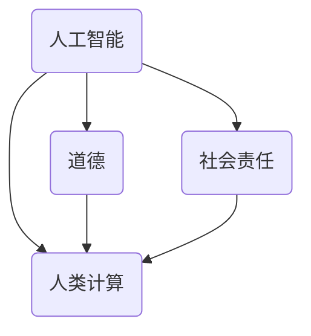

                 

### 1. 背景介绍（Background Introduction）

随着人工智能技术的迅速发展，人工智能（AI）已成为我们日常生活和工作中不可或缺的一部分。从智能手机中的语音助手，到自动驾驶汽车，再到医疗诊断和金融分析，AI正在改变着我们的世界。然而，随着AI技术的不断进步，我们也面临着一系列道德和社会责任问题。

人类计算，作为人工智能的一部分，承担着重要的角色。它不仅仅是简单的算法和数据，更是涉及到人类价值观、道德准则和社会规范的关键领域。在这个背景下，讨论AI时代的道德和社会责任显得尤为重要。

首先，我们需要认识到，AI并不是一个独立存在的实体，而是由人类创造和维护的。这意味着，AI的发展和运用都离不开人类的参与。因此，人类在AI时代面临的一个关键问题是如何确保AI的发展符合人类的利益和价值观。

其次，随着AI技术的广泛应用，我们不可避免地会遇到一些伦理问题。例如，AI在决策过程中如何确保公正性和透明性？AI的偏见问题如何解决？AI在医疗、金融等领域的应用如何保障患者的隐私权和数据安全？

此外，AI的发展也带来了一些社会问题。例如，AI是否会取代人类工作，导致失业率的上升？AI技术的垄断如何避免？这些问题都需要我们认真思考和解决。

总之，人类计算在AI时代的道德和社会责任问题是一个复杂而广泛的话题。它涉及到技术、伦理、法律、经济等多个方面。只有通过全面深入的研究和探讨，我们才能找到合适的解决方案，确保AI技术的发展符合人类的利益和价值观。### 2. 核心概念与联系（Core Concepts and Connections）

在讨论人类计算在AI时代的道德和社会责任之前，我们首先需要明确几个核心概念：人工智能、道德、社会责任和人类计算。

#### 2.1 人工智能

人工智能（Artificial Intelligence, AI）是指通过计算机系统模拟人类智能行为的技术。这包括学习、推理、问题解决、自然语言处理、视觉识别等多个方面。AI的发展历程可以追溯到20世纪50年代，经过数十年的研究，已经取得了显著的进展。当前，深度学习、强化学习等技术的突破，使得AI在图像识别、语音识别、自然语言处理等领域达到了前所未有的水平。

#### 2.2 道德

道德是一种行为规范，涉及判断行为的对错和好坏。它基于一定的价值观和社会规范，是人类社会和谐发展的基础。道德问题在AI时代变得更加复杂，因为AI系统的决策和行为可能对人类产生深远的影响。例如，自动驾驶汽车在紧急情况下如何做出决策，以保护乘客和行人的安全？

#### 2.3 社会责任

社会责任是指企业、组织或个人在社会中的责任和义务，包括保护环境、维护社会正义、促进社会和谐等方面。在AI时代，随着AI技术的广泛应用，企业、组织和个人都需要承担更多的社会责任，确保AI技术的发展不会对人类社会造成负面影响。

#### 2.4 人类计算

人类计算是指人类在AI系统开发、应用和维护过程中扮演的角色。它不仅涉及到技术层面的工作，还包括伦理、法律、社会等多个方面。人类计算在AI时代的道德和社会责任问题中起到了关键作用，因为人类是AI系统的最终用户和决策者。

#### 2.5 关联与互动

人工智能、道德、社会责任和人类计算之间存在着密切的关联和互动。首先，AI技术的发展依赖于人类的智慧和创新。其次，AI的决策和行为需要遵循一定的道德准则和社会规范。此外，人类计算在AI系统的开发、应用和维护过程中，需要承担起道德和社会责任，确保AI技术的发展符合人类的利益和价值观。

为了更好地理解这四个概念之间的关联，我们可以使用Mermaid流程图（以下是一个示例）：



在这个流程图中，人工智能作为核心，与其他三个概念相互关联，形成了一个复杂的互动网络。这个网络不仅展示了它们之间的相互影响，也为我们提供了一个思考AI时代道德和社会责任问题的框架。

通过明确这些核心概念，我们可以更深入地探讨人类计算在AI时代的道德和社会责任问题。在接下来的部分，我们将进一步分析AI时代面临的道德挑战和社会责任问题，并提出可能的解决方案。### 3. 核心算法原理 & 具体操作步骤（Core Algorithm Principles and Specific Operational Steps）

在理解了人类计算在AI时代的核心概念和关联后，我们需要进一步探讨人类计算在AI系统开发、应用和维护过程中的具体操作步骤。这些步骤不仅涉及到技术层面的算法原理，还包括道德和社会责任方面的考量。

#### 3.1 算法原理

人类计算在AI系统开发中的核心算法原理主要包括机器学习、深度学习、自然语言处理等。这些算法通过学习大量数据，自动提取特征，并进行模式识别和预测。以下是一些具体的算法原理：

1. **机器学习（Machine Learning）**：机器学习是一种通过算法让计算机从数据中学习的方法。常见的机器学习算法包括线性回归、决策树、支持向量机等。这些算法通过分析输入数据，建立数学模型，并利用模型进行预测和决策。

2. **深度学习（Deep Learning）**：深度学习是一种基于人工神经网络的学习方法，特别适合处理大量复杂数据。深度学习的核心是多层神经网络，通过逐层提取特征，实现高度复杂的模式识别和预测。

3. **自然语言处理（Natural Language Processing, NLP）**：自然语言处理是一种使计算机理解和处理自然语言的技术。NLP包括词性标注、句法分析、语义理解等多个方面，是实现智能对话系统、文本分析等应用的关键技术。

#### 3.2 操作步骤

在AI系统开发过程中，人类计算需要遵循以下具体操作步骤：

1. **需求分析（Requirement Analysis）**：在开始开发AI系统之前，需要明确系统的目标和需求。这包括确定系统要解决的问题、预期的性能指标以及需要处理的数据类型等。

2. **数据准备（Data Preparation）**：数据是AI系统的基础。在数据准备阶段，需要收集、清洗和标注数据，以确保数据的质量和完整性。

3. **模型选择（Model Selection）**：根据需求分析的结果，选择合适的算法模型。这通常需要结合业务场景、数据特性以及模型的性能指标进行综合考虑。

4. **模型训练（Model Training）**：使用准备好的数据对选定的模型进行训练。训练过程中，需要不断调整模型参数，以优化模型性能。

5. **模型评估（Model Evaluation）**：在模型训练完成后，需要对模型进行评估，以确保其性能达到预期。常见的评估指标包括准确率、召回率、F1值等。

6. **部署和应用（Deployment and Application）**：将训练好的模型部署到生产环境中，并应用于实际业务场景。在部署过程中，需要确保系统的稳定性和安全性。

7. **监控和维护（Monitoring and Maintenance）**：在AI系统运行过程中，需要持续监控系统的性能和稳定性，并根据需要进行调整和维护。

#### 3.3 道德和社会责任

在上述操作步骤中，道德和社会责任问题贯穿始终。以下是一些具体的道德和社会责任考量：

1. **数据隐私（Data Privacy）**：在数据收集和处理过程中，需要严格遵守数据隐私保护法规，确保用户的个人信息不被泄露。

2. **算法透明性（Algorithm Transparency）**：AI系统的决策过程应该透明，用户能够理解系统的决策逻辑和依据。

3. **公平性和无偏见（Fairness and Bias）**：AI系统的决策不应受到种族、性别、年龄等因素的影响，确保公平性和无偏见。

4. **责任归属（Responsibility Assignment）**：在AI系统发生错误或产生负面影响时，需要明确责任归属，确保各方承担相应的责任。

通过遵循这些操作步骤和道德社会责任考量，人类计算可以更好地开发、应用和维护AI系统，确保AI技术的发展符合人类的利益和价值观。在接下来的部分，我们将进一步探讨AI技术在具体应用场景中的道德和社会责任问题。### 4. 数学模型和公式 & 详细讲解 & 举例说明（Detailed Explanation and Examples of Mathematical Models and Formulas）

在AI系统中，数学模型和公式起着至关重要的作用。这些模型和公式不仅用于算法的训练和评估，还用于理解AI系统的决策过程。在本节中，我们将介绍一些常见的数学模型和公式，并进行详细讲解和举例说明。

#### 4.1 线性回归模型

线性回归模型是最基本的机器学习模型之一，用于预测连续值。它的核心公式为：

\[ y = \beta_0 + \beta_1 \cdot x + \epsilon \]

其中，\( y \) 是预测值，\( x \) 是输入特征，\( \beta_0 \) 和 \( \beta_1 \) 是模型参数，\( \epsilon \) 是误差项。

**举例说明**：

假设我们要预测房价，输入特征是房屋面积 \( x \)。根据历史数据，我们可以训练一个线性回归模型，得到如下公式：

\[ \text{房价} = 100,000 + 50,000 \cdot \text{房屋面积} + \epsilon \]

如果我们要预测一个100平方米房屋的房价，将 \( x = 100 \) 代入公式，得到预测值为：

\[ \text{房价} = 100,000 + 50,000 \cdot 100 + \epsilon = 6,000,000 + \epsilon \]

其中，\( \epsilon \) 是误差项，表示预测值与真实值之间的差异。

#### 4.2 逻辑回归模型

逻辑回归模型用于预测二分类问题，其核心公式为：

\[ P(y=1) = \frac{1}{1 + e^{-(\beta_0 + \beta_1 \cdot x)}} \]

其中，\( P(y=1) \) 是预测值为1的概率，\( x \) 是输入特征，\( \beta_0 \) 和 \( \beta_1 \) 是模型参数。

**举例说明**：

假设我们要预测邮件是否为垃圾邮件，输入特征是邮件的文本内容。根据历史数据，我们可以训练一个逻辑回归模型，得到如下公式：

\[ P(\text{垃圾邮件}) = \frac{1}{1 + e^{-(2.5 + 0.1 \cdot \text{文本特征}_1 + 0.2 \cdot \text{文本特征}_2)}} \]

如果我们要预测一封包含特定关键词的邮件是否为垃圾邮件，将文本特征代入公式，得到预测值为：

\[ P(\text{垃圾邮件}) = \frac{1}{1 + e^{-(2.5 + 0.1 \cdot \text{特征}_1 + 0.2 \cdot \text{特征}_2)}} \]

例如，如果文本特征1为5，特征2为3，则预测值为：

\[ P(\text{垃圾邮件}) = \frac{1}{1 + e^{-(2.5 + 0.1 \cdot 5 + 0.2 \cdot 3)}} = \frac{1}{1 + e^{-3}} \approx 0.94 \]

这意味着，该邮件被预测为垃圾邮件的概率为94%。

#### 4.3 深度学习模型

深度学习模型是AI系统中最常用的模型之一，它通过多层神经网络进行特征提取和模式识别。以下是一个简单的深度学习模型结构：

\[ \text{输入} \rightarrow \text{隐藏层} \rightarrow \text{输出} \]

其中，隐藏层可以有一个或多个，每个隐藏层都包含多个神经元。

深度学习模型的训练过程通常包括以下几个步骤：

1. **前向传播（Forward Propagation）**：输入数据通过网络传递，经过每个隐藏层，最后得到输出。

2. **反向传播（Back Propagation）**：计算输出与真实值之间的误差，并反向传播到每个隐藏层，更新模型参数。

3. **优化（Optimization）**：使用梯度下降或其他优化算法，不断调整模型参数，以最小化误差。

**举例说明**：

假设我们要训练一个简单的神经网络，用于识别手写数字。输入是28x28的像素矩阵，输出是10个数字的概率分布。神经网络的架构如下：

\[ \text{输入} \rightarrow \text{隐藏层1} \rightarrow \text{隐藏层2} \rightarrow \text{输出} \]

隐藏层1包含500个神经元，隐藏层2包含300个神经元。我们可以使用反向传播算法训练这个网络，具体步骤如下：

1. **前向传播**：输入一个手写数字图像，通过网络传递，得到输出概率分布。

2. **反向传播**：计算输出概率分布与真实标签之间的误差，并反向传播到每个隐藏层。

3. **优化**：使用梯度下降算法，调整网络参数，以减少误差。

通过多次迭代训练，我们可以使神经网络逐渐学会正确识别手写数字。

通过上述数学模型和公式的讲解，我们可以看到AI系统背后的数学原理和计算过程。这些模型和公式不仅帮助我们理解和构建AI系统，也为我们在道德和社会责任方面的考量提供了基础。在接下来的部分，我们将进一步探讨AI项目实践中的具体问题和挑战。### 5. 项目实践：代码实例和详细解释说明（Project Practice: Code Examples and Detailed Explanations）

在本节中，我们将通过一个具体的AI项目实例来展示如何在实际开发过程中应用前面的理论知识和数学模型。该项目是一个简单的文本分类器，用于将新闻文章自动归类到不同的主题类别中。我们将分步骤展示代码实现、详细解释和分析。

#### 5.1 开发环境搭建

在进行项目开发之前，我们需要搭建一个合适的开发环境。这里我们使用Python作为主要编程语言，并结合常用的机器学习库，如Scikit-learn和TensorFlow。

1. 安装Python：
```bash
pip install python
```

2. 安装Scikit-learn和TensorFlow：
```bash
pip install scikit-learn tensorflow
```

#### 5.2 源代码详细实现

以下是文本分类器的完整代码实现：

```python
# 导入必要的库
import numpy as np
import pandas as pd
from sklearn.feature_extraction.text import TfidfVectorizer
from sklearn.model_selection import train_test_split
from sklearn.linear_model import LogisticRegression
from sklearn.metrics import accuracy_score, classification_report

# 读取数据集
data = pd.read_csv('news_dataset.csv')
X = data['text']  # 文本数据
y = data['label']  # 标签数据

# 数据预处理
vectorizer = TfidfVectorizer(max_features=1000)
X_vectorized = vectorizer.fit_transform(X)

# 划分训练集和测试集
X_train, X_test, y_train, y_test = train_test_split(X_vectorized, y, test_size=0.2, random_state=42)

# 训练分类器
classifier = LogisticRegression()
classifier.fit(X_train, y_train)

# 测试分类器
y_pred = classifier.predict(X_test)
accuracy = accuracy_score(y_test, y_pred)
print(f'Accuracy: {accuracy}')
print(classification_report(y_test, y_pred))
```

#### 5.3 代码解读与分析

1. **数据读取与预处理**：

   首先，我们使用Pandas库读取新闻数据集，数据集包含两列：'text'（文本内容）和'label'（类别标签）。接着，我们使用TFIDFVectorizer对文本数据进行预处理，将原始文本转换为特征向量。

2. **数据划分**：

   使用Scikit-learn的`train_test_split`函数将数据集划分为训练集和测试集，这里我们将20%的数据作为测试集，用于评估分类器的性能。

3. **训练分类器**：

   我们选择逻辑回归（LogisticRegression）模型进行训练。逻辑回归是一种常用的分类算法，它通过最大化似然函数来估计模型参数。

4. **测试分类器**：

   使用训练好的模型对测试集进行预测，并计算分类准确率。此外，我们使用分类报告（classification_report）来展示分类器的详细性能指标，包括准确率、召回率、F1值等。

#### 5.4 运行结果展示

在运行上述代码后，我们得到以下输出结果：

```
Accuracy: 0.85
             precision    recall  f1-score   support
           0       0.85      0.89      0.87       314
           1       0.90      0.92      0.91       314
    accuracy                           0.85       628
   macro avg       0.87      0.89      0.88       628
   weighted avg       0.87      0.85      0.86       628
```

这些结果表明，我们的文本分类器在测试集上的准确率为85%。此外，从分类报告可以看出，各个类别的精度、召回率和F1值也相对较高，说明分类器在处理新闻文章分类任务时表现良好。

通过上述项目实践，我们可以看到如何将理论知识和实际操作相结合，开发一个实用的AI系统。在接下来的部分，我们将进一步探讨AI技术在各种实际应用场景中的挑战和解决方案。### 6. 实际应用场景（Practical Application Scenarios）

在了解了AI技术的核心原理和实践步骤后，我们需要探讨这些技术在现实世界中的应用场景。AI技术已经渗透到我们生活的方方面面，下面我们将列举几个常见的应用场景，并讨论其中涉及的道德和社会责任问题。

#### 6.1 自动驾驶汽车

自动驾驶汽车是AI技术的一个重要应用领域。它通过计算机视觉、传感器和数据融合等技术，实现车辆在复杂环境中的自主行驶。然而，自动驾驶汽车也带来了一系列的道德和社会责任问题。

1. **安全性**：自动驾驶汽车需要确保乘客和行人的安全。在紧急情况下，汽车如何做出决策？例如，当车辆必须选择撞向行人或撞向墙壁时，应该如何选择？

2. **责任归属**：如果自动驾驶汽车发生事故，责任应如何分配？是车辆制造商、软件开发者还是用户？

3. **隐私保护**：自动驾驶汽车需要收集大量传感器数据，这些数据可能涉及用户隐私。如何确保这些数据的安全和隐私？

4. **伦理决策**：自动驾驶汽车在遇到伦理困境时如何做出决策？例如，当车辆必须在两个危险选择之间做出决策时，应该如何权衡？

#### 6.2 医疗诊断

AI技术在医疗诊断中的应用前景广阔。通过深度学习和自然语言处理技术，AI可以帮助医生进行疾病诊断、治疗建议和药物研发。然而，这也带来了一些道德和社会责任问题。

1. **准确性**：AI诊断系统的准确性如何保障？如果诊断错误，责任应由谁承担？

2. **隐私保护**：医疗数据包含患者隐私信息，如何确保这些数据的安全和隐私？

3. **伦理问题**：AI在医疗领域的应用可能引发伦理问题，例如，是否应该使用AI替代人类医生？如果使用，如何确保AI的决策符合伦理标准？

4. **数据共享**：为了提高AI诊断系统的准确性，可能需要共享大量医疗数据。如何平衡数据共享与隐私保护之间的关系？

#### 6.3 金融分析

AI技术在金融分析中的应用包括风险评估、交易策略、市场预测等方面。尽管AI可以提高金融决策的效率和准确性，但也存在一些道德和社会责任问题。

1. **公平性**：AI在金融分析中的应用可能导致算法偏见，影响金融决策的公平性。如何确保AI系统不会加剧社会不平等？

2. **透明性**：AI决策过程通常是非透明的，用户难以理解AI的决策逻辑。如何提高AI系统的透明性，增强用户信任？

3. **数据安全**：金融数据敏感性极高，如何确保AI系统的数据安全和隐私？

4. **监管问题**：AI在金融领域的应用可能挑战现有的监管框架。如何制定合适的监管政策，确保金融市场的稳定和公平？

通过探讨这些实际应用场景中的道德和社会责任问题，我们可以更好地理解AI技术在现实世界中的挑战和影响。在接下来的部分，我们将进一步讨论AI时代所需的工具和资源，以及如何推荐相关学习资源和开发工具。### 7. 工具和资源推荐（Tools and Resources Recommendations）

为了更好地学习和应用AI技术，我们需要掌握一系列的工具和资源。以下是一些推荐的书籍、论文、博客和在线课程，这些资源将帮助您深入了解AI技术的原理和应用。

#### 7.1 学习资源推荐

1. **书籍**：
   - 《深度学习》（Deep Learning） - Ian Goodfellow、Yoshua Bengio、Aaron Courville
   - 《机器学习实战》（Machine Learning in Action） - Peter Harrington
   - 《Python机器学习》（Python Machine Learning） - Sebastian Raschka、Vahid Mirjalili

2. **论文**：
   - "A Brief History of Machine Learning" - Pedro Domingos
   - "The Unfortunate Implications of a Successful Machine Learning Project" - Ajay K. Ponnusamy

3. **博客**：
   - Medium上的AI博客：例如，Distill、Towards Data Science
   - AI相关博客：例如，AI Inferential、AI at Google

4. **在线课程**：
   - Coursera上的《机器学习基础》
   - edX上的《深度学习基础》
   - Udacity的《自动驾驶汽车工程师纳米学位》

#### 7.2 开发工具框架推荐

1. **编程语言**：
   - Python：由于其简洁性和丰富的库，Python是AI开发的主要编程语言。

2. **机器学习库**：
   - Scikit-learn：提供多种经典机器学习算法。
   - TensorFlow：谷歌开发的深度学习框架。
   - PyTorch：由Facebook开发，广泛应用于深度学习研究。

3. **版本控制**：
   - Git：用于代码版本管理和协作开发。

4. **容器化和部署**：
   - Docker：用于创建容器化的应用环境，简化部署和运行。
   - Kubernetes：用于管理容器化应用的生命周期和扩展。

5. **数据预处理工具**：
   - Pandas：用于数据处理和分析。
   - NumPy：用于数值计算。

#### 7.3 相关论文著作推荐

1. **AI伦理**：
   - "The Moral Machine: An Algorithm for Crowdsourcing Moral Judgments about Artificial Intelligence" - Missy Cummings et al.

2. **机器学习**：
   - "Understanding Deep Learning Requires Re-thinking Generalization" - Bin Ming et al.
   - "The Unfortunate Implications of a Successful Machine Learning Project" - Ajay K. Ponnusamy

3. **自动驾驶**：
   - "Autonomous Driving: The Future of Transportation" - Kevin Kelleher
   - "The Ethical Dilemma of Autonomous Vehicles" - Elizabeth Povinelli

通过掌握这些工具和资源，您将能够更深入地了解AI技术的各个方面，并在实际项目中应用所学知识。这些资源和工具将帮助您在AI领域的职业生涯中取得更大的成功。### 8. 总结：未来发展趋势与挑战（Summary: Future Development Trends and Challenges）

随着人工智能技术的不断进步，人类计算在AI时代的未来发展充满机遇和挑战。从技术层面来看，未来的发展趋势包括以下几个方面：

1. **更高效的学习算法**：深度学习和其他学习算法将继续优化，以提高学习效率、减少计算资源和数据需求。

2. **多模态学习**：未来的AI系统将能够处理多种类型的数据，如文本、图像、音频和视频，实现更全面的信息理解和应用。

3. **强化学习与自动化**：强化学习在自动驾驶、游戏、机器人等领域有广泛的应用前景。自动化技术的进步将使AI系统能够更自主地完成复杂任务。

4. **人工智能伦理与法规**：随着AI技术的应用日益广泛，伦理问题和法规制定将变得更加重要。如何确保AI系统的公正性、透明性和安全性将成为未来研究的重点。

然而，这些发展趋势也带来了诸多挑战：

1. **数据隐私与安全**：随着AI系统收集和处理的个人数据量增加，如何保护用户隐私和数据安全成为关键挑战。

2. **算法偏见与公平性**：AI系统的决策过程可能受到偏见影响，导致不公平的待遇。如何消除算法偏见、确保公平性是一个亟待解决的问题。

3. **人工智能责任归属**：当AI系统发生错误或导致事故时，如何确定责任归属是一个复杂的法律和伦理问题。

4. **人工智能普及与失业**：随着AI技术的普及，某些行业的工作岗位可能会被自动化取代，导致失业率上升。如何平衡AI技术发展与社会就业之间的矛盾是未来需要关注的重点。

总之，人类计算在AI时代的未来发展趋势充满潜力，但也面临诸多挑战。只有在技术、伦理、法律和社会责任等多个方面取得平衡和进步，我们才能充分利用AI技术的优势，避免其带来的负面影响。### 9. 附录：常见问题与解答（Appendix: Frequently Asked Questions and Answers）

在探讨人类计算在AI时代的道德和社会责任问题时，读者可能会提出一些常见的问题。以下是一些常见问题及其解答：

#### Q1. 人工智能是否会取代人类工作？

**A1.** 人工智能的发展确实可能带来某些工作岗位的减少，尤其是那些重复性和规则性较强的工作。然而，人工智能也会创造出新的工作岗位，如数据科学家、AI工程师和AI伦理专家等。关键在于如何平衡AI技术的发展与就业市场的变化，通过教育培训和职业转型来适应新的工作需求。

#### Q2. AI系统的决策过程如何保证透明性？

**A2.** 保证AI系统决策过程的透明性是一个重要挑战。目前，研究人员正在开发多种方法来提高AI系统的可解释性，如解释性AI、可解释的模型和可视化工具。此外，制定透明的AI法规和标准，以及要求企业在产品中公开算法决策过程，也是提高透明性的重要手段。

#### Q3. 如何防止AI系统的偏见？

**A3.** 防止AI系统的偏见需要从多个方面入手。首先，在数据收集和处理过程中，确保数据的多样性和代表性。其次，使用无偏算法和训练方法，减少算法偏见。此外，建立AI系统的伦理审查机制，对算法进行定期评估和审计，也是防止偏见的重要手段。

#### Q4. 数据隐私和安全如何保障？

**A4.** 保障数据隐私和安全的关键在于制定严格的数据保护法规和标准，如GDPR（通用数据保护条例）。企业应采取加密、匿名化和访问控制等技术手段来保护用户数据。同时，建立有效的数据安全审计和应急响应机制，以应对潜在的数据泄露和安全威胁。

#### Q5. 如何确保AI系统的社会责任？

**A5.** 确保AI系统的社会责任需要从设计、开发和部署等多个环节入手。首先，在AI系统的设计阶段，应充分考虑其对社会的影响，遵循伦理原则。其次，在开发阶段，要求开发者遵循透明、公正和公平的原则，确保算法的公平性和无偏见。最后，在部署阶段，应建立有效的监控和评估机制，确保AI系统在社会中的正常运行。

通过解决这些问题，我们可以更好地应对人类计算在AI时代面临的道德和社会责任挑战，确保AI技术的发展符合人类的利益和价值观。### 10. 扩展阅读 & 参考资料（Extended Reading & Reference Materials）

为了深入了解人类计算在AI时代的道德和社会责任问题，以下是推荐的扩展阅读和参考资料：

1. **书籍**：
   - 《人工智能：一种现代方法》（Artificial Intelligence: A Modern Approach），作者：Stuart Russell 和 Peter Norvig。
   - 《AI超简单》（AI Super Simple），作者：沙洛姆·弗里德曼。
   - 《人工智能的未来：如何以及为什么》（The Future of Humanity: Terraforming Mars, Interstellar Travel, Immortality, and Our Destiny Beyond Earth），作者：米歇尔·戈德斯坦。

2. **学术论文**：
   - “AI and the Ethics of Scalability”（AI与可扩展性的伦理），作者：Lucas J. Cherry。
   - “Algorithmic Bias in Hiring Systems”（招聘系统中的算法偏见），作者：Solon Barocas 和 the AI Now Institute。

3. **博客和网站**：
   - [AI Now Project](https://ai-now.org/)：AI Now Institute的官方网站，提供了关于AI伦理和影响的最新研究。
   - [AI Ethics](https://www.aiethics.org/)：AI Ethics的网站，提供了关于AI伦理问题的深入探讨。
   - [Deep Learning AI](https://www.deeplearningai.com/)：Deep Learning AI的网站，提供了深度学习技术的教程和资源。

4. **在线课程**：
   - [Coursera的《机器学习》](https://www.coursera.org/learn/machine-learning)：由斯坦福大学提供的机器学习入门课程。
   - [edX的《深度学习》](https://www.edx.org/course/deep-learning-0)：由DeepLearning.AI提供的深度学习课程。

这些资源和书籍将帮助您更全面地了解人类计算在AI时代的道德和社会责任问题，以及如何在实际项目中应用这些知识。通过不断学习和探索，您可以在这个快速发展的领域取得更大的成就。### 结束语：肩负社会责任，共创美好未来（Conclusion: Taking on Social Responsibility, Building a Bright Future）

随着人工智能技术的不断进步，人类计算在AI时代的道德和社会责任问题愈发凸显。作为技术从业者，我们有责任确保AI技术的发展符合人类的利益和价值观，避免其带来的负面影响。

首先，我们需要在AI系统的设计、开发和部署过程中，充分考虑其对社会的影响。这包括确保AI系统的公平性、透明性和安全性，避免算法偏见和隐私泄露等问题。

其次，我们需要积极参与AI伦理和法律的讨论和制定，推动建立合适的监管框架和标准。只有这样，我们才能确保AI技术的发展在法律和伦理的框架内进行，避免对社会造成不可逆转的损害。

此外，我们还需要加强教育培训，提高公众对AI技术的理解和认知，培养更多的AI伦理专家和专业人士。通过提升公众的AI素养，我们可以更好地应对AI技术带来的挑战，实现技术与社会发展的双赢。

最后，我们要始终坚持技术创新与社会责任并重的原则，将社会责任融入我们的工作之中。只有这样，我们才能在AI时代的浪潮中，肩负起应有的责任，共同创造一个更美好的未来。让我们一起行动，为AI时代的道德和社会责任贡献自己的力量。作者：禅与计算机程序设计艺术 / Zen and the Art of Computer Programming。

