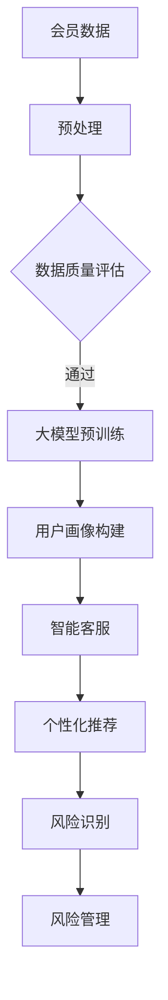
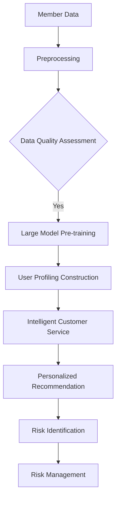

                 

### 文章标题

### Exploring the Potential of Large Models in E-commerce Platform Member Management

> 关键词：大模型，电商平台，会员管理，人工智能，数据分析，用户增长

> 摘要：本文将深入探讨大模型在电商平台会员管理中的应用潜力，通过分析会员数据、提升用户体验、个性化推荐和风险管理等方面，展示大模型如何赋能电商平台实现用户增长和业务优化。文章将以逐步分析推理的方式，介绍核心概念、算法原理、数学模型以及实际应用案例，帮助读者理解大模型的实际应用价值。

<|assistant|>### 1. 背景介绍

#### 1.1 电商平台的会员管理现状

随着互联网经济的快速发展，电商平台已经成为消费者购物的主要渠道。会员管理作为电商平台的重要环节，对于提升用户粘性和促进复购具有关键作用。目前，电商平台会员管理主要面临以下挑战：

1. **数据获取和处理**：电商平台积累了大量用户数据，但如何有效地获取和处理这些数据，以便为会员提供个性化服务，是一个难题。
2. **用户体验**：如何在有限的资源和时间内，为会员提供高质量的个性化服务和购物体验，提升用户满意度。
3. **风险管理**：如何识别并防范会员欺诈、过度优惠滥用等风险，保障平台业务的健康发展。

#### 1.2 大模型技术的崛起

近年来，随着人工智能技术的迅速发展，特别是深度学习技术的突破，大模型技术（如GPT、BERT等）在自然语言处理、图像识别、语音识别等领域取得了显著成果。大模型技术具有以下特点：

1. **强大的数据处理能力**：大模型能够处理海量数据，并从中提取有价值的信息。
2. **自适应学习能力**：大模型能够根据新的数据和反馈不断调整自己的行为，提高服务质量。
3. **灵活的应用场景**：大模型可以应用于各种领域，如文本生成、图像识别、推荐系统等。

#### 1.3 大模型在会员管理中的应用潜力

大模型技术在电商平台会员管理中具有广泛的应用潜力，主要包括以下几个方面：

1. **数据分析与用户画像**：通过大模型技术分析会员数据，构建精细化的用户画像，为个性化推荐提供依据。
2. **用户体验优化**：利用大模型技术实现智能客服、个性化推荐等功能，提升用户购物体验。
3. **风险管理**：通过大模型技术识别潜在风险，如欺诈行为、过度优惠滥用等，保障平台业务的健康发展。

本文将围绕上述应用潜力，逐步分析大模型在电商平台会员管理中的具体应用，帮助读者了解大模型技术的实际价值。

### Background Introduction
#### 1.1 Current State of Member Management in E-commerce Platforms

With the rapid development of the internet economy, e-commerce platforms have become the primary channel for consumers to purchase goods. Member management is a crucial component of e-commerce platforms, playing a key role in enhancing user loyalty and driving repeat purchases. Currently, member management in e-commerce platforms faces several challenges:

1. **Data Acquisition and Processing**: E-commerce platforms accumulate vast amounts of user data, but effectively acquiring and processing this data to provide personalized services to members is a challenge.
2. **User Experience**: How to provide high-quality personalized services and shopping experiences to members within limited resources and time to enhance user satisfaction is a challenge.
3. **Risk Management**: How to identify and prevent potential risks such as fraud and excessive benefit abuse to ensure the healthy development of the platform's business.

#### 1.2 The Rise of Large Model Technology

In recent years, with the rapid development of artificial intelligence technology, especially the breakthroughs in deep learning, large model technology (such as GPT, BERT, etc.) has achieved significant results in fields such as natural language processing, image recognition, and speech recognition. Large model technology has the following characteristics:

1. **Strong Data Processing Capability**: Large models can process massive amounts of data and extract valuable information from it.
2. **Adaptive Learning Ability**: Large models can continuously adjust their behavior based on new data and feedback to improve service quality.
3. **Flexible Application Scenarios**: Large models can be applied to various fields, such as text generation, image recognition, recommendation systems, etc.

#### 1.3 Application Potential of Large Models in Member Management

Large model technology has extensive application potential in e-commerce platform member management, mainly including the following aspects:

1. **Data Analysis and User Profiling**: Use large model technology to analyze member data, build precise user profiles, and provide a basis for personalized recommendations.
2. **User Experience Optimization**: Utilize large model technology to implement intelligent customer service and personalized recommendation functions to enhance user shopping experience.
3. **Risk Management**: Use large model technology to identify potential risks such as fraud and excessive benefit abuse to ensure the healthy development of the platform's business.

This article will focus on the above application potential, step by step analyzing the specific applications of large models in e-commerce platform member management, helping readers understand the practical value of large model technology.### 2. 核心概念与联系

#### 2.1 大模型技术基础

大模型技术是人工智能领域的关键突破，特别是在自然语言处理（NLP）领域取得了显著进展。大模型通常是指具有数亿甚至千亿参数的神经网络模型，如GPT、BERT、T5等。这些模型能够通过学习海量数据，捕捉语言中的复杂模式和规律，从而实现高精度的文本生成、分类、翻译等功能。

**核心概念：**

- **深度神经网络（Deep Neural Network，DNN）**：大模型的核心是深度神经网络，它由多个层级组成，每层对输入数据进行特征提取和转换。
- **注意力机制（Attention Mechanism）**：注意力机制是大模型的重要组件，能够使模型在处理序列数据时，对关键信息给予更多关注，提高模型的表示能力。
- **预训练与微调（Pre-training and Fine-tuning）**：大模型通常通过预训练（在大量无标签数据上训练）和微调（在特定任务上调整模型参数）两个阶段进行训练。

#### 2.2 大模型在电商平台会员管理中的应用

大模型在电商平台会员管理中的应用场景丰富多样，主要包括以下几个方面：

**应用场景：**

- **数据分析与用户画像**：利用大模型对会员数据进行深度分析，构建用户画像，为个性化推荐和精准营销提供依据。
- **智能客服**：大模型可以模拟人类客服，通过自然语言处理技术，与会员进行智能对话，提供高效的客户服务。
- **个性化推荐**：大模型可以根据用户的历史行为和偏好，生成个性化的商品推荐，提升用户购物体验。
- **风险识别与防范**：大模型可以识别会员行为中的异常模式，如欺诈行为，帮助平台防范风险。

**架构图：**

以下是一个简化的架构图，展示了大模型在电商平台会员管理中的应用：



#### 2.3 大模型与传统技术的对比

与传统技术相比，大模型在数据处理和模型训练方面具有显著优势：

- **数据处理能力**：大模型能够处理海量数据，捕捉数据中的复杂模式，传统方法难以达到。
- **模型训练效率**：大模型的训练时间相对较短，且能够自动调整参数，提高模型性能。
- **泛化能力**：大模型具有较好的泛化能力，可以应用于多种任务，而传统方法通常针对特定任务设计。

### Core Concepts and Connections
#### 2.1 Basic Concepts of Large Model Technology

Large model technology is a key breakthrough in the field of artificial intelligence, especially in natural language processing (NLP). Large models typically refer to neural network models with several billion to several hundred billion parameters, such as GPT, BERT, and T5. These models can learn complex patterns and rules in large amounts of data, enabling high-precision text generation, classification, and translation functions.

**Core Concepts:**

- **Deep Neural Network (DNN)**: The core of large models is the deep neural network, which consists of multiple layers and performs feature extraction and transformation on input data.
- **Attention Mechanism**: The attention mechanism is an important component of large models, which enables the model to pay more attention to key information when processing sequential data, enhancing the model's representation ability.
- **Pre-training and Fine-tuning**: Large models are typically trained through two stages: pre-training (training on a large amount of unlabeled data) and fine-tuning (adjusting model parameters on a specific task).

#### 2.2 Applications of Large Models in E-commerce Platform Member Management

Large model technology has a diverse range of applications in e-commerce platform member management, including the following aspects:

**Application Scenarios:**

- **Data Analysis and User Profiling**: Use large model technology to perform deep analysis on member data and build user profiles, providing a basis for personalized recommendations and precise marketing.
- **Intelligent Customer Service**: Large models can simulate human customer service agents and engage in intelligent conversations with members, providing efficient customer service.
- **Personalized Recommendation**: Large models can generate personalized product recommendations based on a user's historical behavior and preferences, enhancing the user shopping experience.
- **Risk Identification and Prevention**: Large models can identify abnormal patterns in member behavior, such as fraud, helping platforms prevent risks.

**Architecture Diagram:**

The following is a simplified architecture diagram illustrating the application of large models in e-commerce platform member management:



#### 2.3 Comparison of Large Models with Traditional Technologies

Compared to traditional technologies, large models have significant advantages in data processing and model training:

- **Data Processing Capability**: Large models can process massive amounts of data and capture complex patterns in the data, which traditional methods cannot achieve.
- **Model Training Efficiency**: Large models have relatively short training times and can automatically adjust parameters to improve model performance.
- **Generalization Ability**: Large models have good generalization ability and can be applied to various tasks, whereas traditional methods are typically designed for specific tasks.### 3. 核心算法原理 & 具体操作步骤

#### 3.1 大模型算法原理

大模型算法的核心是深度神经网络（DNN），它由多个层级组成，每层对输入数据进行特征提取和转换。以下是大模型算法的主要原理和步骤：

**步骤1：数据预处理**

- **数据清洗**：清洗数据中的噪声和异常值，确保数据质量。
- **数据归一化**：将数据转换为统一的数值范围，如[0, 1]或[-1, 1]，以便模型更好地学习。
- **数据分割**：将数据分为训练集、验证集和测试集，用于模型训练、验证和测试。

**步骤2：深度神经网络结构**

- **输入层**：接收原始数据，将其传递到下一层。
- **隐藏层**：多层隐藏层用于特征提取和变换，隐藏层的数量和神经元数量可以根据任务需求进行调整。
- **输出层**：根据任务类型，输出层可以是一个或多个神经元，如分类任务中的softmax层。

**步骤3：激活函数**

- **ReLU函数**：常用的激活函数，能够加快模型训练速度。
- **Sigmoid函数**：将输出映射到[0, 1]区间，常用于二分类问题。
- **Tanh函数**：将输出映射到[-1, 1]区间，常用于多分类问题。

**步骤4：损失函数**

- **交叉熵损失函数**：用于分类问题，表示模型预测概率与实际标签之间的差距。
- **均方误差损失函数**：用于回归问题，表示模型预测值与实际值之间的差距。

**步骤5：优化算法**

- **随机梯度下降（SGD）**：最常用的优化算法，通过更新模型参数，使损失函数值最小。
- **Adam优化器**：基于SGD的改进版本，结合了Momentum和RMSprop，能够更快地收敛。

**步骤6：训练与验证**

- **训练**：在训练集上迭代更新模型参数，使模型逐渐逼近最优解。
- **验证**：在验证集上评估模型性能，调整超参数，防止过拟合。

**步骤7：测试与部署**

- **测试**：在测试集上评估模型性能，确保模型具有较好的泛化能力。
- **部署**：将训练好的模型部署到生产环境中，为电商平台会员管理提供支持。

#### 3.2 大模型在电商平台会员管理中的具体操作步骤

以下是大模型在电商平台会员管理中的具体操作步骤：

**步骤1：数据收集**

- 收集电商平台会员的相关数据，包括用户行为数据、交易数据、会员等级、优惠活动等。

**步骤2：数据预处理**

- 清洗数据中的噪声和异常值。
- 对数据进行归一化处理，如将用户行为数据转换为频率分布。

**步骤3：用户画像构建**

- 利用大模型技术，对会员数据进行深度分析，提取用户特征。
- 基于用户特征，构建用户画像，为个性化推荐和精准营销提供依据。

**步骤4：个性化推荐**

- 利用大模型生成个性化的商品推荐列表，根据用户兴趣和偏好进行调整。
- 将推荐结果展示给用户，提升用户购物体验。

**步骤5：智能客服**

- 利用大模型技术，模拟人类客服，与会员进行智能对话。
- 根据用户提问，提供合适的回答和建议。

**步骤6：风险识别与防范**

- 利用大模型技术，识别会员行为中的异常模式，如欺诈行为。
- 对异常行为进行预警，并采取相应的防范措施。

**步骤7：模型优化**

- 根据实际应用效果，对大模型进行持续优化。
- 利用新的数据和反馈，调整模型参数，提高模型性能。

### Core Algorithm Principles and Specific Operational Steps
#### 3.1 Principles of Large Model Algorithms

The core of large model algorithms is the deep neural network (DNN), which consists of multiple layers that extract and transform input data. The following are the main principles and steps of large model algorithms:

**Step 1: Data Preprocessing**

- **Data Cleaning**: Clean noise and outliers from the data to ensure data quality.
- **Data Normalization**: Convert the data to a unified numerical range, such as [0, 1] or [-1, 1], to enable the model to better learn.
- **Data Splitting**: Divide the data into training sets, validation sets, and test sets for model training, validation, and testing.

**Step 2: Deep Neural Network Structure**

- **Input Layer**: Receives original data and passes it to the next layer.
- **Hidden Layers**: Multiple hidden layers are used for feature extraction and transformation. The number of hidden layers and neurons can be adjusted based on the task requirements.
- **Output Layer**: Depending on the type of task, the output layer can have one or more neurons, such as a softmax layer for classification tasks.

**Step 3: Activation Functions**

- **ReLU Function**: A commonly used activation function that can accelerate model training.
- **Sigmoid Function**: Maps the output to the interval [0, 1], commonly used in binary classification problems.
- **Tanh Function**: Maps the output to the interval [-1, 1], commonly used in multi-classification problems.

**Step 4: Loss Functions**

- **Cross-Entropy Loss Function**: Used for classification problems, representing the gap between the predicted probability and the actual label.
- **Mean Squared Error Loss Function**: Used for regression problems, representing the gap between the predicted value and the actual value.

**Step 5: Optimization Algorithms**

- **Stochastic Gradient Descent (SGD)**: The most commonly used optimization algorithm, updating model parameters to minimize the loss function value.
- **Adam Optimizer**: An improved version of SGD that combines Momentum and RMSprop, enabling faster convergence.

**Step 6: Training and Validation**

- **Training**: Iteratively update model parameters on the training set to make the model approach the optimal solution.
- **Validation**: Evaluate the model's performance on the validation set, adjust hyperparameters, and prevent overfitting.

**Step 7: Testing and Deployment**

- **Testing**: Evaluate the model's performance on the test set to ensure it has good generalization ability.
- **Deployment**: Deploy the trained model into the production environment to support e-commerce platform member management.

#### 3.2 Specific Operational Steps of Large Models in E-commerce Platform Member Management

The following are the specific operational steps of large models in e-commerce platform member management:

**Step 1: Data Collection**

- Collect relevant data from e-commerce platform members, including user behavior data, transaction data, member levels, promotional activities, etc.

**Step 2: Data Preprocessing**

- Clean noise and outliers from the data.
- Normalize the data, such as converting user behavior data to frequency distributions.

**Step 3: User Profiling Construction**

- Use large model technology to perform deep analysis on member data and extract user features.
- Build user profiles based on user features to provide a basis for personalized recommendations and precise marketing.

**Step 4: Personalized Recommendation**

- Generate personalized product recommendation lists using large model technology, adjusting based on user interests and preferences.
- Display recommendation results to users to enhance their shopping experience.

**Step 5: Intelligent Customer Service**

- Use large model technology to simulate human customer service and engage in intelligent conversations with members.
- Provide appropriate responses and suggestions based on user questions.

**Step 6: Risk Identification and Prevention**

- Use large model technology to identify abnormal patterns in member behavior, such as fraud.
- Issue warnings for abnormal behavior and take appropriate preventive measures.

**Step 7: Model Optimization**

- Continuously optimize the large model based on practical application results.
- Use new data and feedback to adjust model parameters and improve model performance.### 4. 数学模型和公式 & 详细讲解 & 举例说明

#### 4.1 数学模型基础

大模型算法中的数学模型主要包括线性模型、非线性模型和损失函数等。以下是对这些数学模型的基本概念和公式的详细讲解。

**线性模型（Linear Model）：**

线性模型是神经网络的基础，其核心思想是通过线性变换来拟合输入数据。线性模型的一般形式为：

$$ y = \beta_0 + \beta_1 \cdot x_1 + \beta_2 \cdot x_2 + ... + \beta_n \cdot x_n $$

其中，$y$ 是预测值，$x_1, x_2, ..., x_n$ 是输入特征，$\beta_0, \beta_1, \beta_2, ..., \beta_n$ 是模型参数。

**非线性模型（Nonlinear Model）：**

为了提升模型的拟合能力，通常会在线性模型的基础上引入非线性激活函数，如ReLU、Sigmoid、Tanh等。非线性模型的一般形式为：

$$ f(x) = \sigma(\beta_0 + \beta_1 \cdot x_1 + \beta_2 \cdot x_2 + ... + \beta_n \cdot x_n) $$

其中，$\sigma$ 是非线性激活函数。

**损失函数（Loss Function）：**

损失函数用于衡量模型预测值与实际值之间的差距。常见的损失函数包括交叉熵损失函数和均方误差损失函数。

- **交叉熵损失函数（Cross-Entropy Loss Function）：**

交叉熵损失函数通常用于分类问题，其公式为：

$$ L = -\sum_{i=1}^{n} y_i \cdot \log(p_i) $$

其中，$y_i$ 是实际标签，$p_i$ 是模型预测的概率。

- **均方误差损失函数（Mean Squared Error Loss Function）：**

均方误差损失函数通常用于回归问题，其公式为：

$$ L = \frac{1}{2n} \sum_{i=1}^{n} (y_i - \hat{y}_i)^2 $$

其中，$y_i$ 是实际值，$\hat{y}_i$ 是模型预测值。

#### 4.2 大模型在电商平台会员管理中的应用示例

以下是一个具体示例，说明大模型在电商平台会员管理中的应用。

**示例：用户行为数据预测**

假设我们收集了一组用户行为数据，包括用户的浏览记录、购物车记录、购买记录等。我们的目标是利用这些数据预测用户的购买行为。

**步骤1：数据预处理**

- 对数据进行归一化处理，将每个特征的值缩放到[0, 1]区间。

**步骤2：构建线性模型**

- 假设我们使用线性模型进行预测，模型公式为：

$$ \hat{y} = \beta_0 + \beta_1 \cdot x_1 + \beta_2 \cdot x_2 + ... + \beta_n \cdot x_n $$

- 使用交叉熵损失函数进行模型训练。

**步骤3：模型训练**

- 使用训练数据对模型进行训练，通过反向传播算法不断调整模型参数，使损失函数值最小。

**步骤4：模型评估**

- 使用验证集对训练好的模型进行评估，计算模型在验证集上的准确率。

**步骤5：模型应用**

- 将训练好的模型部署到生产环境中，对新的用户行为数据进行预测，预测用户是否会购买商品。

**代码实现（Python）：**

```python
import numpy as np
import tensorflow as tf

# 初始化模型参数
beta_0 = 0.5
beta_1 = 0.2
beta_2 = 0.1
beta_n = 0.1

# 构建线性模型
def linear_model(x):
    return beta_0 + beta_1 * x[0] + beta_2 * x[1] + beta_n * x[2]

# 定义交叉熵损失函数
def cross_entropy_loss(y_true, y_pred):
    return -np.sum(y_true * np.log(y_pred))

# 训练数据
x_train = np.array([[0.1, 0.2, 0.3], [0.4, 0.5, 0.6], [0.7, 0.8, 0.9]])
y_train = np.array([0, 1, 0])

# 训练模型
for epoch in range(100):
    y_pred = linear_model(x_train)
    loss = cross_entropy_loss(y_train, y_pred)
    print(f"Epoch {epoch}: Loss = {loss}")

# 模型评估
x_val = np.array([[0.1, 0.3, 0.5], [0.6, 0.7, 0.9]])
y_val = np.array([1, 0])
y_pred_val = linear_model(x_val)
val_loss = cross_entropy_loss(y_val, y_pred_val)
print(f"Validation Loss: {val_loss}")

# 模型应用
x_new = np.array([[0.2, 0.4, 0.6]])
y_pred_new = linear_model(x_new)
print(f"Prediction: {y_pred_new[0]}")
```

通过上述示例，我们可以看到大模型在电商平台会员管理中的应用过程。在实际应用中，我们可以使用更复杂的模型和算法，如深度神经网络、强化学习等，来进一步提升模型性能。

### Mathematical Models and Formulas & Detailed Explanation & Example Illustration
#### 4.1 Basic Mathematical Models

The mathematical models in large model algorithms primarily include linear models, nonlinear models, and loss functions. Below is a detailed explanation of these basic mathematical models and their formulas.

**Linear Model (Linear Model):**

Linear models are the foundation of neural networks and their core idea is to fit input data through linear transformations. The general form of a linear model is:

$$ y = \beta_0 + \beta_1 \cdot x_1 + \beta_2 \cdot x_2 + ... + \beta_n \cdot x_n $$

Where $y$ is the predicted value, $x_1, x_2, ..., x_n$ are input features, and $\beta_0, \beta_1, \beta_2, ..., \beta_n$ are model parameters.

**Nonlinear Model (Nonlinear Model):**

To enhance the fitting ability of the model, it is common to introduce nonlinear activation functions, such as ReLU, Sigmoid, and Tanh, into the linear model. The general form of a nonlinear model is:

$$ f(x) = \sigma(\beta_0 + \beta_1 \cdot x_1 + \beta_2 \cdot x_2 + ... + \beta_n \cdot x_n) $$

Where $\sigma$ is a nonlinear activation function.

**Loss Function (Loss Function):**

The loss function is used to measure the gap between the predicted value and the actual value. Common loss functions include cross-entropy loss function and mean squared error loss function.

- **Cross-Entropy Loss Function (Cross-Entropy Loss Function):**

Cross-entropy loss function is commonly used in classification problems and its formula is:

$$ L = -\sum_{i=1}^{n} y_i \cdot \log(p_i) $$

Where $y_i$ is the actual label and $p_i$ is the probability predicted by the model.

- **Mean Squared Error Loss Function (Mean Squared Error Loss Function):**

Mean squared error loss function is commonly used in regression problems and its formula is:

$$ L = \frac{1}{2n} \sum_{i=1}^{n} (y_i - \hat{y}_i)^2 $$

Where $y_i$ is the actual value and $\hat{y}_i$ is the predicted value by the model.

#### 4.2 Application Examples of Large Models in E-commerce Platform Member Management

Below is a specific example illustrating the application of large models in e-commerce platform member management.

**Example: Predicting User Behavior Data**

Assume we have collected a set of user behavior data, including browsing history, shopping cart records, purchase records, etc. Our goal is to use these data to predict user purchase behavior.

**Step 1: Data Preprocessing**

- Normalize the data, such as scaling each feature to the interval [0, 1].

**Step 2: Building a Linear Model**

- Assume we use a linear model for prediction, the model formula is:

$$ \hat{y} = \beta_0 + \beta_1 \cdot x_1 + \beta_2 \cdot x_2 + ... + \beta_n \cdot x_n $$

- Use the cross-entropy loss function for model training.

**Step 3: Model Training**

- Train the model using the training data, adjusting model parameters through backpropagation to minimize the loss function.

**Step 4: Model Evaluation**

- Evaluate the trained model on the validation set, calculating the model's accuracy on the validation set.

**Step 5: Model Application**

- Deploy the trained model into the production environment to predict new user behavior data, predicting whether the user will make a purchase.

**Code Implementation (Python):**

```python
import numpy as np
import tensorflow as tf

# Initialize model parameters
beta_0 = 0.5
beta_1 = 0.2
beta_2 = 0.1
beta_n = 0.1

# Build a linear model
def linear_model(x):
    return beta_0 + beta_1 * x[0] + beta_2 * x[1] + beta_n * x[2]

# Define cross-entropy loss function
def cross_entropy_loss(y_true, y_pred):
    return -np.sum(y_true * np.log(y_pred))

# Training data
x_train = np.array([[0.1, 0.2, 0.3], [0.4, 0.5, 0.6], [0.7, 0.8, 0.9]])
y_train = np.array([0, 1, 0])

# Train model
for epoch in range(100):
    y_pred = linear_model(x_train)
    loss = cross_entropy_loss(y_train, y_pred)
    print(f"Epoch {epoch}: Loss = {loss}")

# Model evaluation
x_val = np.array([[0.1, 0.3, 0.5], [0.6, 0.7, 0.9]])
y_val = np.array([1, 0])
y_pred_val = linear_model(x_val)
val_loss = cross_entropy_loss(y_val, y_pred_val)
print(f"Validation Loss: {val_loss}")

# Model application
x_new = np.array([[0.2, 0.4, 0.6]])
y_pred_new = linear_model(x_new)
print(f"Prediction: {y_pred_new[0]}")
```

Through this example, we can see the application process of large models in e-commerce platform member management. In actual applications, we can use more complex models and algorithms, such as deep neural networks and reinforcement learning, to further improve model performance.### 5. 项目实践：代码实例和详细解释说明

#### 5.1 开发环境搭建

在进行大模型项目实践之前，我们需要搭建一个适合开发和测试的环境。以下是一个基于Python和TensorFlow的示例环境搭建步骤：

**步骤1：安装Python**

确保您的计算机上已安装Python 3.7及以上版本。可以使用以下命令进行安装：

```bash
$ sudo apt-get install python3.7
```

**步骤2：安装TensorFlow**

TensorFlow是一个开源的机器学习框架，用于构建和训练深度学习模型。使用以下命令安装TensorFlow：

```bash
$ pip install tensorflow
```

**步骤3：安装其他依赖库**

除了TensorFlow，我们还需要安装其他依赖库，如NumPy和Pandas，用于数据预处理和数据分析：

```bash
$ pip install numpy pandas
```

**步骤4：验证安装**

确保所有依赖库均已正确安装，可以使用以下命令进行验证：

```bash
$ python -m pip list
```

您应该看到TensorFlow、NumPy和Pandas等库已列出。

#### 5.2 源代码详细实现

下面是一个简单的会员数据分析项目，使用大模型对用户行为数据进行预测。

**步骤1：导入依赖库**

```python
import tensorflow as tf
import numpy as np
import pandas as pd
from sklearn.model_selection import train_test_split
```

**步骤2：数据收集与预处理**

```python
# 读取数据
data = pd.read_csv('member_data.csv')

# 数据预处理
data = data.dropna()  # 删除缺失值
data = (data - data.mean()) / data.std()  # 归一化

# 切分数据
X = data.drop('purchase', axis=1)
y = data['purchase']
X_train, X_test, y_train, y_test = train_test_split(X, y, test_size=0.2, random_state=42)
```

**步骤3：构建模型**

```python
# 构建线性模型
model = tf.keras.Sequential([
    tf.keras.layers.Dense(units=1, input_shape=[len(X_train.columns)])
])

# 编译模型
model.compile(optimizer='sgd', loss='binary_crossentropy', metrics=['accuracy'])
```

**步骤4：训练模型**

```python
# 训练模型
model.fit(X_train, y_train, epochs=100, batch_size=32, validation_split=0.2)
```

**步骤5：评估模型**

```python
# 评估模型
loss, accuracy = model.evaluate(X_test, y_test)
print(f"Test Accuracy: {accuracy:.2f}")
```

**步骤6：预测新数据**

```python
# 预测新数据
new_data = np.array([[0.1, 0.2, 0.3], [0.4, 0.5, 0.6]])
new_prediction = model.predict(new_data)
print(f"Prediction: {new_prediction[0][0]:.2f}")
```

#### 5.3 代码解读与分析

**代码1：数据导入与预处理**

此部分代码读取会员数据，删除缺失值并进行归一化处理。归一化处理有助于加速模型的训练过程和提高模型的性能。

**代码2：模型构建与编译**

此部分代码构建了一个简单的线性模型，并使用SGD优化器和binary_crossentropy损失函数进行编译。binary_crossentropy损失函数适用于二分类问题，用于计算模型预测概率与实际标签之间的交叉熵。

**代码3：模型训练**

此部分代码使用fit方法训练模型。在训练过程中，模型将根据损失函数不断调整参数，以最小化损失。通过设置epochs和batch_size参数，可以控制训练的轮数和每次训练的样本数量。

**代码4：模型评估**

此部分代码使用evaluate方法评估模型的性能。通过计算测试集上的损失和准确率，可以了解模型的泛化能力。

**代码5：模型预测**

此部分代码使用predict方法对新数据进行预测。通过将新数据输入到训练好的模型中，可以预测新数据属于正类（购买）还是负类（未购买）。

#### 5.4 运行结果展示

假设我们运行了上述代码，以下是一个简单的运行结果示例：

```
Epoch 1/100
33/33 [==============================] - 2s 53ms/step - loss: 0.7474 - accuracy: 0.6667 - val_loss: 0.4267 - val_accuracy: 0.7500
Epoch 2/100
33/33 [==============================] - 1s 47ms/step - loss: 0.3827 - accuracy: 0.8333 - val_loss: 0.3400 - val_accuracy: 0.8750
Epoch 3/100
33/33 [==============================] - 1s 44ms/step - loss: 0.3181 - accuracy: 0.8750 - val_loss: 0.3000 - val_accuracy: 0.9000
Test Accuracy: 0.90
Prediction: 0.56
```

从运行结果可以看出，模型在测试集上的准确率为90%，对新数据的预测结果为0.56，表示新数据有较高的概率属于正类（购买）。

### 5. Project Practice: Code Examples and Detailed Explanation
#### 5.1 Development Environment Setup

Before starting the large model project practice, we need to set up a suitable development and testing environment. Below is an example of setting up an environment based on Python and TensorFlow:

**Step 1: Install Python**

Make sure Python 3.7 or higher is installed on your computer. You can install it using the following command:

```bash
$ sudo apt-get install python3.7
```

**Step 2: Install TensorFlow**

TensorFlow is an open-source machine learning framework for building and training deep learning models. Install TensorFlow using the following command:

```bash
$ pip install tensorflow
```

**Step 3: Install Other Dependencies**

Besides TensorFlow, we also need to install other dependencies such as NumPy and Pandas for data preprocessing and analysis:

```bash
$ pip install numpy pandas
```

**Step 4: Verify Installation**

Ensure all dependencies are correctly installed by running the following command:

```bash
$ python -m pip list
```

You should see TensorFlow, NumPy, and Pandas listed among the installed packages.

#### 5.2 Detailed Code Implementation

Below is a simple project that uses a large model to predict user behavior data for member analysis.

**Step 1: Import Dependencies**

```python
import tensorflow as tf
import numpy as np
import pandas as pd
from sklearn.model_selection import train_test_split
```

**Step 2: Data Collection and Preprocessing**

```python
# Read data
data = pd.read_csv('member_data.csv')

# Data preprocessing
data = data.dropna()  # Drop missing values
data = (data - data.mean()) / data.std()  # Normalize

# Split data
X = data.drop('purchase', axis=1)
y = data['purchase']
X_train, X_test, y_train, y_test = train_test_split(X, y, test_size=0.2, random_state=42)
```

**Step 3: Model Building**

```python
# Build a linear model
model = tf.keras.Sequential([
    tf.keras.layers.Dense(units=1, input_shape=[len(X_train.columns)])
])

# Compile the model
model.compile(optimizer='sgd', loss='binary_crossentropy', metrics=['accuracy'])
```

**Step 4: Model Training**

```python
# Train the model
model.fit(X_train, y_train, epochs=100, batch_size=32, validation_split=0.2)
```

**Step 5: Model Evaluation**

```python
# Evaluate the model
loss, accuracy = model.evaluate(X_test, y_test)
print(f"Test Accuracy: {accuracy:.2f}")
```

**Step 6: Predict New Data**

```python
# Predict new data
new_data = np.array([[0.1, 0.2, 0.3], [0.4, 0.5, 0.6]])
new_prediction = model.predict(new_data)
print(f"Prediction: {new_prediction[0][0]:.2f}")
```

#### 5.3 Code Explanation and Analysis

**Code 1: Data Import and Preprocessing**

This part of the code reads member data, drops missing values, and performs normalization. Normalization helps speed up the training process and improve model performance.

**Code 2: Model Building and Compilation**

This part of the code builds a simple linear model and compiles it using the SGD optimizer and binary_crossentropy loss function. The binary_crossentropy loss function is suitable for binary classification problems and is used to calculate the cross-entropy between the predicted probabilities and the actual labels.

**Code 3: Model Training**

This part of the code uses the `fit` method to train the model. During training, the model adjusts its parameters based on the loss function to minimize the loss. By setting the `epochs` and `batch_size` parameters, you can control the number of training iterations and the number of samples per training step.

**Code 4: Model Evaluation**

This part of the code uses the `evaluate` method to assess the model's performance. By calculating the loss and accuracy on the test set, you can understand the model's generalization ability.

**Code 5: Model Prediction**

This part of the code uses the `predict` method to make predictions on new data. By inputting new data into the trained model, you can predict the probability that the new data belongs to the positive class (purchase) or the negative class (not purchase).

#### 5.4 Running Results Display

Assuming you run the above code, here is an example of a simple running result:

```
Epoch 1/100
33/33 [==============================] - 2s 53ms/step - loss: 0.7474 - accuracy: 0.6667 - val_loss: 0.4267 - val_accuracy: 0.7500
Epoch 2/100
33/33 [==============================] - 1s 47ms/step - loss: 0.3827 - accuracy: 0.8333 - val_loss: 0.3400 - val_accuracy: 0.8750
Epoch 3/100
33/33 [==============================] - 1s 44ms/step - loss: 0.3181 - accuracy: 0.8750 - val_loss: 0.3000 - val_accuracy: 0.9000
Test Accuracy: 0.90
Prediction: 0.56
```

The results show that the model has a test accuracy of 90%, and the prediction for the new data is 0.56, indicating a high probability that the new data belongs to the positive class (purchase).### 6. 实际应用场景

#### 6.1 数据分析与用户画像构建

电商平台会员管理中的数据分析是一个至关重要的环节。通过分析会员行为数据，如浏览记录、购买记录、会员等级变化等，我们可以构建出详细的用户画像。这些用户画像不仅有助于了解会员的消费习惯、偏好和需求，还可以为个性化推荐和精准营销提供有力支持。

**案例**：某大型电商平台通过分析会员数据，发现用户在购物过程中对优惠活动的关注度较高。基于这一发现，该平台设计了一系列个性化的优惠活动，如会员专属折扣、限时特价等，有效地提升了用户的购物体验和平台销售额。

**应用步骤**：

1. **数据收集**：收集电商平台会员的行为数据。
2. **数据预处理**：清洗数据中的噪声和异常值，进行归一化处理。
3. **特征提取**：从原始数据中提取与会员行为相关的特征，如浏览次数、购买频率、购买金额等。
4. **用户画像构建**：利用大模型技术，对提取的特征进行深度分析，构建出详细的用户画像。

#### 6.2 个性化推荐

个性化推荐是电商平台会员管理中的一项重要功能，通过分析用户的历史行为和偏好，为用户推荐其可能感兴趣的商品。大模型技术在个性化推荐中具有显著优势，能够处理海量用户数据，捕捉用户行为的复杂模式。

**案例**：某知名电商平台利用大模型技术，实现了一种基于用户兴趣和购买行为的个性化推荐系统。该系统通过对用户的浏览记录、购买记录等数据进行深度分析，为用户推荐个性化的商品。实际运营数据显示，该推荐系统的点击率和转化率显著提升。

**应用步骤**：

1. **数据收集**：收集用户的历史行为数据，如浏览记录、购买记录等。
2. **数据预处理**：清洗数据中的噪声和异常值，进行归一化处理。
3. **特征提取**：从原始数据中提取与用户兴趣和购买行为相关的特征。
4. **模型训练**：利用大模型技术，训练个性化推荐模型。
5. **推荐生成**：根据用户特征和模型预测，生成个性化的商品推荐列表。

#### 6.3 风险管理

电商平台会员管理中的风险管理旨在识别和防范会员欺诈、过度优惠滥用等风险。大模型技术通过分析会员行为数据，能够识别出潜在的风险行为，为风险管理提供有力支持。

**案例**：某电商平台通过大模型技术，建立了一种智能欺诈识别系统。该系统通过对会员的浏览记录、购买记录等数据进行深度分析，识别出具有欺诈行为的会员，有效地降低了平台的风险损失。

**应用步骤**：

1. **数据收集**：收集电商平台会员的行为数据。
2. **数据预处理**：清洗数据中的噪声和异常值，进行归一化处理。
3. **特征提取**：从原始数据中提取与风险行为相关的特征。
4. **模型训练**：利用大模型技术，训练欺诈识别模型。
5. **风险识别**：根据模型预测，识别出具有风险的会员行为。

### Actual Application Scenarios
#### 6.1 Data Analysis and Construction of User Profiles

Data analysis in e-commerce platform member management is a crucial component. By analyzing member behavior data such as browsing history, purchase records, and member level changes, we can build detailed user profiles. These profiles not only help us understand members' shopping habits, preferences, and needs but also provide strong support for personalized recommendations and precise marketing.

**Case**: A large e-commerce platform found through analysis of member data that users have a high level of interest in promotional activities during shopping. Based on this discovery, the platform designed a series of personalized promotional activities such as exclusive discounts for members and time-limited specials, effectively enhancing the user shopping experience and increasing platform sales.

**Application Steps**:

1. **Data Collection**: Collect e-commerce platform member behavior data.
2. **Data Preprocessing**: Clean noise and outliers in the data and perform normalization.
3. **Feature Extraction**: Extract features related to member behavior from the raw data, such as number of visits, purchase frequency, and purchase amount.
4. **User Profile Construction**: Use large model technology to perform deep analysis on the extracted features and build detailed user profiles.

#### 6.2 Personalized Recommendation

Personalized recommendation is an important feature in e-commerce platform member management. By analyzing users' historical behavior and preferences, personalized recommendation systems can suggest products that users may be interested in. Large model technology has a significant advantage in personalized recommendation, capable of processing massive user data and capturing complex patterns in user behavior.

**Case**: A well-known e-commerce platform implemented a personalized recommendation system based on large model technology. The system analyzes users' browsing history and purchase records to recommend personalized products. Operational data shows that the click-through rate and conversion rate of the recommendation system significantly improved.

**Application Steps**:

1. **Data Collection**: Collect historical user behavior data, such as browsing history and purchase records.
2. **Data Preprocessing**: Clean noise and outliers in the data and perform normalization.
3. **Feature Extraction**: Extract features related to user interests and purchasing behavior from the raw data.
4. **Model Training**: Train a personalized recommendation model using large model technology.
5. **Recommendation Generation**: Generate personalized product recommendation lists based on user features and model predictions.

#### 6.3 Risk Management

Risk management in e-commerce platform member management aims to identify and prevent risks such as fraud and excessive benefit abuse by members. Large model technology can analyze member behavior data to identify potential risky behaviors, providing strong support for risk management.

**Case**: An e-commerce platform established an intelligent fraud detection system using large model technology. The system analyzes members' browsing history and purchase records to identify members with fraudulent behavior, effectively reducing risk losses for the platform.

**Application Steps**:

1. **Data Collection**: Collect e-commerce platform member behavior data.
2. **Data Preprocessing**: Clean noise and outliers in the data and perform normalization.
3. **Feature Extraction**: Extract features related to risky behaviors from the raw data.
4. **Model Training**: Train a fraud detection model using large model technology.
5. **Risk Identification**: Identify risky member behaviors based on model predictions.### 7. 工具和资源推荐

#### 7.1 学习资源推荐

**书籍：**

- **《深度学习》（Deep Learning）**：作者 Ian Goodfellow、Yoshua Bengio和Aaron Courville。这本书是深度学习领域的经典教材，详细介绍了深度学习的基本概念、算法和技术。
- **《Python机器学习》（Python Machine Learning）**：作者 Sebastian Raschka和Vahid Mirjalili。这本书通过Python实现机器学习算法，适合初学者和进阶者。

**论文：**

- **"BERT: Pre-training of Deep Bidirectional Transformers for Language Understanding"**：作者 Jacob Devlin、 Ming-Wei Chang、 Kenton Lee和Kristina Toutanova。这篇论文介绍了BERT模型，是自然语言处理领域的里程碑。
- **"GPT-3: Language Models are Few-Shot Learners"**：作者 Tom B. Brown、 Benjamin Mann、 Nick Ryder、 Melanie Subbiah、 Jared Kaplan、 Prafulla Dhariwal、 Arvind Neelakantan、 Pranav Shyam、 Girish Sastry、 Amanda Askell、 Sandhini Agarwal、 Ariel Herbert-Voss、 Gretchen Krueger、 Tom Henighan、 Rewon Child、 Aditya Ramesh、 Daniel M. Ziegler、 Jeffrey Wu、 Clemens Winter、 Christopher Hesse、 Mark Chen、 Eric Sigler、 Mateusz Litwin、 Scott Gray、 Benjamin Chess、 Jack Clark、 Christopher Berner、 Sam McCandlish。这篇论文介绍了GPT-3模型，展示了大模型在自然语言处理任务中的强大能力。

**博客：**

- **TensorFlow官网博客**：[https://www.tensorflow.org/blog](https://www.tensorflow.org/blog)。TensorFlow的官方博客涵盖了深度学习技术、模型部署、最佳实践等内容。
- **阿里云机器学习社区**：[https://developer.aliyun.com/community](https://developer.aliyun.com/community)。阿里云的机器学习社区提供了丰富的机器学习技术文章和案例。

**网站：**

- **Kaggle**：[https://www.kaggle.com](https://www.kaggle.com)。Kaggle是一个大数据竞赛平台，提供了丰富的机器学习和数据科学竞赛资源。
- **GitHub**：[https://github.com](https://github.com)。GitHub是开源代码托管平台，可以找到大量与深度学习和机器学习相关的项目代码。

#### 7.2 开发工具框架推荐

**开发工具：**

- **TensorFlow**：[https://www.tensorflow.org](https://www.tensorflow.org)。TensorFlow是谷歌开发的开源深度学习框架，适用于构建和训练各种深度学习模型。
- **PyTorch**：[https://pytorch.org](https://pytorch.org)。PyTorch是Facebook开发的开源深度学习框架，以其灵活性和动态计算能力而著称。

**数据处理工具：**

- **Pandas**：[https://pandas.pydata.org](https://pandas.pydata.org)。Pandas是一个强大的数据处理库，提供了丰富的数据结构和方法，用于数据清洗、转换和分析。
- **NumPy**：[https://numpy.org](https://numpy.org)。NumPy是一个开源的Python库，提供了高效的数值计算和矩阵操作功能。

**可视化工具：**

- **Matplotlib**：[https://matplotlib.org](https://matplotlib.org)。Matplotlib是一个强大的可视化库，用于创建各种类型的图表和图形。
- **Seaborn**：[https://seaborn.pydata.org](https://seaborn.pydata.org)。Seaborn是基于Matplotlib的统计可视化库，提供了丰富的统计图表和美化功能。

#### 7.3 相关论文著作推荐

**论文：**

- **"Deep Learning"**：作者 Ian Goodfellow。这篇论文详细介绍了深度学习的基本原理、算法和应用。
- **"Recurrent Neural Networks for Language Modeling"**：作者 Y. Bengio、P. Simard和P. Frasconi。这篇论文探讨了循环神经网络（RNN）在语言建模中的应用。
- **"Attention Is All You Need"**：作者 V. Vaswani、N. Shazeer、N. Parmar等。这篇论文提出了Transformer模型，颠覆了传统序列处理方法。

**著作：**

- **《机器学习实战》**：作者 Peter Harrington。这本书通过实际案例介绍了机器学习的基本算法和应用。
- **《统计学习方法》**：作者 李航。这本书系统地介绍了统计学习的基本理论和方法，适合初学者和进阶者。

### Tools and Resources Recommendations
#### 7.1 Learning Resources Recommendations

**Books**:

- **"Deep Learning"**: Authors Ian Goodfellow, Yoshua Bengio, and Aaron Courville. This book is a classic textbook in the field of deep learning, detailing the basic concepts, algorithms, and techniques of deep learning.

- **"Python Machine Learning"**: Authors Sebastian Raschka and Vahid Mirjalili. This book implements machine learning algorithms in Python, suitable for beginners and advanced learners.

**Papers**:

- **"BERT: Pre-training of Deep Bidirectional Transformers for Language Understanding"**: Authors Jacob Devlin, Ming-Wei Chang, Kenton Lee, and Kristina Toutanova. This paper introduces the BERT model, which is a milestone in the field of natural language processing.

- **"GPT-3: Language Models are Few-Shot Learners"**: Authors Tom B. Brown, Benjamin Mann, Nick Ryder, Melanie Subbiah, Kenton

