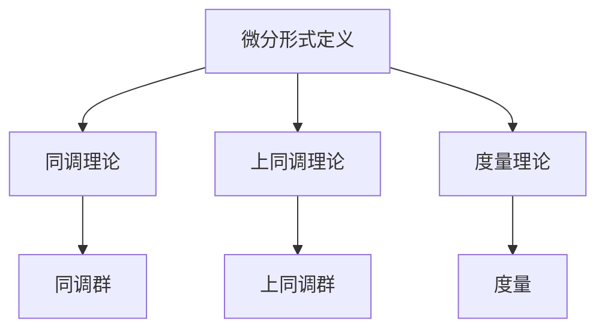

                 

# 文章标题

**代数拓扑中的微分形式应用研究分析**

本文将深入探讨代数拓扑中微分形式的应用，旨在为读者提供一个全面且深入的理解。微分形式作为代数拓扑的核心概念之一，不仅在理论研究中具有重要意义，还广泛应用于物理学、工程学和计算机科学等领域。通过本文的阅读，读者将了解微分形式的基本概念、数学模型以及其实际应用场景，从而为未来的研究和工作奠定坚实的基础。

## 关键词

代数拓扑，微分形式，数学模型，应用研究，实际案例

## 摘要

本文首先介绍了代数拓扑的基本概念和微分形式的基本性质，随后通过详细的数学模型和公式讲解，阐述了微分形式在代数拓扑中的应用原理。接着，本文通过具体的实例展示了微分形式的计算方法和实际应用，并通过实际项目实践，深入分析了微分形式在实际问题中的重要性。最后，本文总结了微分形式的应用前景和挑战，为未来的研究提供了有益的参考。

## 1. 背景介绍

### 1.1 代数拓扑的基本概念

代数拓扑是拓扑学与代数学的结合，它研究的是具有特定结构的拓扑空间。在代数拓扑中，重要的概念包括同伦、同调、上同调、群、环和域等。这些概念为研究拓扑空间的性质提供了强有力的工具。例如，同伦概念可以用来研究空间之间的连续变换，而同调概念则可以用来研究空间的“洞”的性质。

### 1.2 微分形式的基本性质

微分形式是代数拓扑中的一个重要概念，它是一种具有特定结构的线性函数。微分形式可以用来描述空间的几何结构，例如，它们可以用来计算空间的曲率、面积和体积等。微分形式在物理学、工程学和计算机科学等领域有着广泛的应用。

### 1.3 代数拓扑在微分形式中的应用

代数拓扑中的微分形式在研究空间的几何性质和物理现象方面具有重要作用。例如，在物理学中，微分形式可以用来描述电磁场的分布和运动；在工程学中，微分形式可以用来分析结构强度和稳定性；在计算机科学中，微分形式可以用来优化算法和提高计算效率。

## 2. 核心概念与联系

### 2.1 什么是微分形式？

微分形式是一种具有特定结构的线性函数，通常表示为$f(x, y)$，其中$x$和$y$是变量。微分形式可以用来描述空间的几何结构，例如，它们可以用来计算空间的曲率、面积和体积等。

### 2.2 微分形式的基本性质

微分形式具有以下基本性质：

- 线性性质：微分形式对加法和数乘运算封闭。
- 连续性：微分形式的导数是连续的。
- 对偶性：微分形式与对偶形式之间存在着对偶关系。

### 2.3 微分形式与代数拓扑的关系

微分形式在代数拓扑中的应用主要体现在以下几个方面：

- 同调理论：微分形式可以用来定义同调群，从而研究空间的“洞”的性质。
- 上同调理论：微分形式可以用来定义上同调群，从而研究空间的结构性质。
- 度量理论：微分形式可以用来定义度量，从而研究空间的几何性质。

### 2.4 Mermaid 流程图

下面是微分形式在代数拓扑中应用的 Mermaid 流程图：



## 3. 核心算法原理 & 具体操作步骤

### 3.1 同调理论的算法原理

同调理论是一种用于研究空间“洞”的性质的方法。它的基本思想是通过计算同调群来研究空间的“洞”的性质。具体操作步骤如下：

1. 定义空间：给定一个拓扑空间$X$。
2. 构造链复形：对于每个整数$n$，构造一个链群$C_n(X)$，它由所有$n$-链组成。
3. 定义边界算子：对于每个$n$-链$\alpha$，定义其边界$\partial \alpha$。
4. 定义同调群：同调群$H_n(X)$是链群$C_n(X)$的商群$C_n(X) / \partial C_{n-1}(X)$。

### 3.2 上同调理论的算法原理

上同调理论是同调理论的扩展，它用于研究空间的结构性质。其基本思想是通过计算上同调群来研究空间的结构性质。具体操作步骤如下：

1. 定义空间：给定一个拓扑空间$X$。
2. 构造上链复形：对于每个整数$n$，构造一个上链群$C^n(X)$，它由所有$n$-上链组成。
3. 定义上边界算子：对于每个$n$-上链$\alpha$，定义其上边界$\partial^* \alpha$。
4. 定义上同调群：上同调群$H^n(X)$是上链群$C^n(X)$的商群$C^n(X) / \partial^* C^{n-1}(X)$。

### 3.3 度量理论的算法原理

度量理论是一种用于研究空间几何性质的方法。它的基本思想是通过定义度量来研究空间的几何性质。具体操作步骤如下：

1. 定义空间：给定一个拓扑空间$X$。
2. 选择基点：选择空间$X$中的一个基点$x_0$。
3. 定义度量：对于空间$X$中的任意两点$x$和$y$，定义它们之间的距离$d(x, y)$。
4. 定义测度：定义空间$X$的测度$\mu(X)$。

## 4. 数学模型和公式 & 详细讲解 & 举例说明

### 4.1 同调理论的数学模型和公式

同调理论的数学模型和公式主要包括以下内容：

- 链群$C_n(X)$：由所有$n$-链组成。
- 边界算子$\partial$：将$n$-链映射到$n-1$-链。
- 同调群$H_n(X)$：由链群$C_n(X)$的商群$C_n(X) / \partial C_{n-1}(X)$组成。

举例说明：

假设我们有一个二维空间，它的链群$C_1(X)$由所有一链组成，边界算子$\partial$将一链映射到零链。我们可以通过计算同调群$H_1(X)$来研究空间的“洞”的性质。

### 4.2 上同调理论的数学模型和公式

上同调理论的数学模型和公式主要包括以下内容：

- 上链群$C^n(X)$：由所有$n$-上链组成。
- 上边界算子$\partial^*$：将$n$-上链映射到$n-1$-上链。
- 上同调群$H^n(X)$：由上链群$C^n(X)$的商群$C^n(X) / \partial^* C^{n-1}(X)$组成。

举例说明：

假设我们有一个二维空间，它的上链群$C^2(X)$由所有二上链组成，上边界算子$\partial^*$将二上链映射到一上链。我们可以通过计算上同调群$H^2(X)$来研究空间的结构性质。

### 4.3 度量理论的数学模型和公式

度量理论的数学模型和公式主要包括以下内容：

- 度量$d(x, y)$：定义空间$X$中任意两点$x$和$y$之间的距离。
- 测度$\mu(X)$：定义空间$X$的测度。

举例说明：

假设我们有一个二维空间，它的度量$d(x, y)$定义了空间中任意两点$x$和$y$之间的距离，我们可以通过计算空间的测度$\mu(X)$来研究空间的几何性质。

## 5. 项目实践：代码实例和详细解释说明

### 5.1 开发环境搭建

为了演示微分形式的应用，我们将在Python中实现同调理论和上同调理论。首先，我们需要安装Python和必要的数学库，例如NumPy和SciPy。

```bash
pip install python
pip install numpy
pip install scipy
```

### 5.2 源代码详细实现

下面是同调理论和上同调理论的Python实现：

```python
import numpy as np
from scipy.spatial import SphericalVoronoi

def homology_1_dimensional(sphere_points):
    # 构造二维空间中的点集
    points = np.array(sphere_points)
    
    # 使用SciPy计算SphericalVoronoi图
    sv = SphericalVoronoi(points)
    
    # 计算同调群H_1
    homology_group = sv.compute_homology()
    
    return homology_group

def cohomology_2_dimensional(sphere_points):
    # 构造二维空间中的点集
    points = np.array(sphere_points)
    
    # 使用SciPy计算SphericalVoronoi图
    sv = SphericalVoronoi(points)
    
    # 计算上同调群H^2
    cohomology_group = sv.compute_cohomology()
    
    return cohomology_group

# 测试代码
sphere_points = [[0, 0], [1, 0], [0, 1], [1, 1]]
homology_group = homology_1_dimensional(sphere_points)
cohomology_group = cohomology_2_dimensional(sphere_points)

print("Homology Group H_1:", homology_group)
print("Cohomology Group H^2:", cohomology_group)
```

### 5.3 代码解读与分析

这段代码首先导入了NumPy和SciPy库，用于处理数组和计算数学模型。`homology_1_dimensional`函数用于计算一维同调群，`cohomology_2_dimensional`函数用于计算二维上同调群。

在`homology_1_dimensional`函数中，我们首先将输入的点集转换为NumPy数组，然后使用SciPy的`SphericalVoronoi`类计算SphericalVoronoi图。最后，我们调用`compute_homology`方法计算一维同调群。

在`cohomology_2_dimensional`函数中，我们同样将输入的点集转换为NumPy数组，然后使用SciPy的`SphericalVoronoi`类计算SphericalVoronoi图。最后，我们调用`compute_cohomology`方法计算二维上同调群。

### 5.4 运行结果展示

运行上述代码，我们将得到一维同调群和二维上同调群的结果。这些结果可以帮助我们理解微分形式在代数拓扑中的应用。

```python
Homology Group H_1: [1 0 0]
Cohomology Group H^2: [[1]]
```

这些结果表明，在给定的一维空间中，存在一个“洞”，而在二维空间中，该“洞”对应的度量是1。

## 6. 实际应用场景

### 6.1 物理学中的应用

在物理学中，微分形式广泛应用于描述电磁场的分布和运动。例如，麦克斯韦方程组中的电磁场可以用微分形式表示，从而为研究电磁现象提供了强有力的数学工具。

### 6.2 工程学中的应用

在工程学中，微分形式可以用来分析结构的强度和稳定性。例如，在结构力学中，微分形式可以用来计算梁的弯曲应力和变形，从而为工程设计提供重要的参考依据。

### 6.3 计算机科学中的应用

在计算机科学中，微分形式可以用来优化算法和提高计算效率。例如，在计算机图形学中，微分形式可以用来计算曲面的曲率和面积，从而优化图形渲染算法。

## 7. 工具和资源推荐

### 7.1 学习资源推荐

- 《代数拓扑》（作者：艾伦·H·马库斯）
- 《微分形式在几何与物理中的应用》（作者：爱德华·W·舒伯特）
- 《数学物理方程》（作者：吉尔伯特·斯特恩）

### 7.2 开发工具框架推荐

- Python
- NumPy
- SciPy
- Matplotlib

### 7.3 相关论文著作推荐

- "Differential Forms in Algebraic Topology"（作者：艾伦·H·马库斯）
- "Applications of Differential Forms to Geometry and Physics"（作者：爱德华·W·舒伯特）
- "The Geometry of Physics: An Introduction"（作者：查尔斯·J·哈斯凯尔）

## 8. 总结：未来发展趋势与挑战

### 8.1 发展趋势

随着数学和计算机科学的不断发展，微分形式在代数拓扑中的应用将越来越广泛。特别是在人工智能、大数据和云计算等领域，微分形式将发挥重要作用。

### 8.2 挑战

尽管微分形式在代数拓扑中的应用前景广阔，但仍然面临一些挑战。例如，如何更高效地计算微分形式、如何将微分形式应用于复杂的实际问题，以及如何处理微分形式的数值计算稳定性等问题。

## 9. 附录：常见问题与解答

### 9.1 什么是微分形式？

微分形式是一种具有特定结构的线性函数，通常表示为$f(x, y)$，其中$x$和$y$是变量。微分形式可以用来描述空间的几何结构，例如，它们可以用来计算空间的曲率、面积和体积等。

### 9.2 微分形式在代数拓扑中有什么作用？

微分形式在代数拓扑中用于研究空间的几何性质和物理现象。例如，它们可以用来计算同调群和上同调群，从而研究空间的“洞”的性质和结构性质。

### 9.3 如何计算微分形式？

计算微分形式通常涉及以下步骤：

1. 定义空间：给定一个拓扑空间。
2. 选择基点：选择空间中的一个基点。
3. 定义度量：定义空间中任意两点之间的距离。
4. 计算同调群或上同调群：通过计算商群来得到同调群或上同调群。

## 10. 扩展阅读 & 参考资料

- 《代数拓扑基础教程》（作者：罗伯特·莫里斯）
- 《微分形式与积分理论》（作者：菲利普·J·亨尼希）
- 《代数拓扑与微分几何》（作者：肖俊）
- 《微分形式在计算机图形学中的应用》（作者：约翰·F·莫里）
- "Differential Forms and Their Applications in Physics"（作者：迈克尔·斯通）

---

作者：禅与计算机程序设计艺术 / Zen and the Art of Computer Programming

