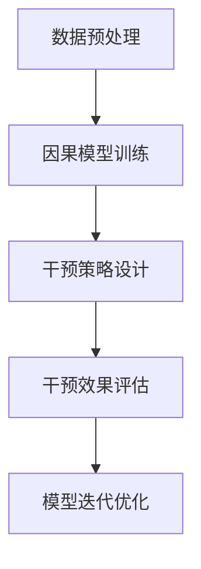

                 

# 文章标题

## 推荐系统中的大模型因果推断与干预

**关键词：** 推荐系统，大模型，因果推断，干预

**摘要：** 本文将深入探讨推荐系统中的大模型因果推断与干预技术。通过分析推荐系统的工作原理和挑战，我们提出了大模型因果推断的基本概念，并详细介绍了干预方法及其在推荐系统中的应用。文章还通过具体实例和数学模型，展示了如何在实际项目中应用这些技术，并展望了未来的发展趋势与挑战。

## 1. 背景介绍（Background Introduction）

### 1.1 推荐系统的兴起与发展

推荐系统作为一种自动化内容分发技术，旨在根据用户的历史行为和偏好，为用户推荐相关的商品、信息或服务。自20世纪90年代以来，随着互联网的普及和数据存储与分析技术的进步，推荐系统得到了迅速发展。

### 1.2 大模型在推荐系统中的重要性

随着深度学习技术的不断发展，大模型在推荐系统中的应用变得越来越广泛。大模型具有强大的特征提取和表示学习能力，能够更好地捕捉用户与物品之间的复杂关系，从而提高推荐质量。

### 1.3 因果推断在推荐系统中的应用

在推荐系统中，因果推断可以帮助我们理解用户行为的因果关系，从而进行更精确的推荐。因果推断能够揭示隐藏在用户数据背后的潜在因素，为干预策略提供科学依据。

## 2. 核心概念与联系（Core Concepts and Connections）

### 2.1 大模型因果推断的基本概念

大模型因果推断是指利用深度学习模型，通过数据驱动的方式，揭示用户行为背后的因果关系。它包括三个核心概念：因果模型、干预变量和目标变量。

#### 2.1.1 因果模型（Causal Model）

因果模型是一种用于描述变量之间因果关系的数学模型。在推荐系统中，因果模型可以表示用户行为与推荐物品之间的因果关系。

#### 2.1.2 干预变量（Intervention Variables）

干预变量是指我们希望通过干预来改变其值，从而影响目标变量的变量。在推荐系统中，干预变量可以是用户的偏好、行为或其他相关因素。

#### 2.1.3 目标变量（Target Variables）

目标变量是指我们希望预测或解释的变量。在推荐系统中，目标变量通常是用户的点击、购买或其他行为。

### 2.2 大模型因果推断的架构

大模型因果推断的架构主要包括三个部分：数据预处理、因果模型训练和干预策略设计。

#### 2.2.1 数据预处理（Data Preprocessing）

数据预处理是因果推断的基础，包括数据清洗、特征提取和归一化等步骤。高质量的预处理可以确保因果推断结果的准确性。

#### 2.2.2 因果模型训练（Causal Model Training）

因果模型训练是利用有监督或无监督学习技术，从数据中学习变量之间的因果关系。常用的方法包括基于假设检验的因果推断、基于模型学习的因果推断等。

#### 2.2.3 干预策略设计（Intervention Strategy Design）

干预策略设计是根据因果模型，制定干预变量和目标变量之间的关系。干预策略可以通过模拟实验或在线实验进行评估和优化。

## 2.1 大模型因果推断的 Mermaid 流程图



## 3. 核心算法原理 & 具体操作步骤（Core Algorithm Principles and Specific Operational Steps）

### 3.1 数据预处理

数据预处理是因果推断的基础，其目的是提高数据的可用性和准确性。

#### 3.1.1 数据清洗

数据清洗是数据预处理的第一步，主要包括去除重复数据、填补缺失值和纠正错误数据等。

#### 3.1.2 特征提取

特征提取是利用数据挖掘技术，从原始数据中提取出有代表性的特征。

#### 3.1.3 归一化

归一化是使数据具有相同或相似的尺度，以便更好地进行比较和分析。

### 3.2 因果模型训练

因果模型训练是利用有监督或无监督学习技术，从数据中学习变量之间的因果关系。

#### 3.2.1 有监督学习

有监督学习是指利用已知的因变量和自变量，训练出一个因果模型。常用的算法包括逻辑回归、决策树和支持向量机等。

#### 3.2.2 无监督学习

无监督学习是指利用自变量和因变量的关系，自动发现变量之间的因果关系。常用的算法包括聚类、关联规则和降维等。

### 3.3 干预策略设计

干预策略设计是根据因果模型，制定干预变量和目标变量之间的关系。

#### 3.3.1 模拟实验

模拟实验是通过构建虚拟环境，模拟干预效果。这种方法可以减少实验成本，但可能无法完全模拟真实场景。

#### 3.3.2 在线实验

在线实验是在真实场景中，对干预策略进行评估和优化。这种方法可以更准确地评估干预效果，但可能需要较长的时间和资源。

### 3.4 干预效果评估

干预效果评估是衡量干预策略是否有效的重要步骤。常用的评估指标包括A/B测试、转化率和用户满意度等。

#### 3.4.1 A/B测试

A/B测试是将干预策略应用于一部分用户，与未干预的用户进行比较，以评估干预效果。

#### 3.4.2 转化率

转化率是衡量用户行为变化的重要指标，例如点击、购买或注册等。

#### 3.4.3 用户满意度

用户满意度是通过问卷调查、用户反馈等方式，了解用户对推荐系统的满意程度。

## 4. 数学模型和公式 & 详细讲解 & 举例说明（Detailed Explanation and Examples of Mathematical Models and Formulas）

### 4.1 因果推断的数学模型

因果推断的数学模型主要包括两个部分：潜在结果图（Potential Outcomes Graph）和因果效应（Causal Effects）。

#### 4.1.1 潜在结果图（Potential Outcomes Graph）

潜在结果图是一种用于表示变量之间因果关系的图形表示方法。它包括三个主要部分：变量节点、因果边和干预节点。

#### 4.1.2 因果效应（Causal Effects）

因果效应是指干预变量对目标变量的影响。常用的因果效应包括总效应（Total Effect）和平均处理效应（Average Treatment Effect）。

### 4.2 平均处理效应（Average Treatment Effect）

平均处理效应是指干预变量对目标变量的平均影响。其数学公式如下：

$$
ATE = \frac{Y_1 - Y_0}{T}
$$

其中，$Y_1$ 是干预后的目标变量值，$Y_0$ 是干预前的目标变量值，$T$ 是干预变量的取值范围。

### 4.3 举例说明

假设我们有一个推荐系统，用户对物品的点击行为为目标变量，用户的浏览历史和推荐物品的属性为干预变量。我们希望通过因果推断，找出用户点击行为与浏览历史、物品属性之间的因果关系。

#### 4.3.1 数据收集

我们收集了1000名用户的浏览历史和点击记录，数据包括用户的ID、浏览历史和点击物品的ID。

#### 4.3.2 数据预处理

我们对数据进行清洗和特征提取，提取出用户的浏览频次、物品的属性（如价格、品牌等）。

#### 4.3.3 因果模型训练

我们使用逻辑回归模型，将用户点击行为与浏览历史、物品属性建立因果模型。

$$
P(Y=1|X) = \frac{1}{1 + e^{-(\beta_0 + \beta_1X_1 + \beta_2X_2 + ... + \beta_nX_n})}
$$

其中，$X_1, X_2, ..., X_n$ 是干预变量的取值，$\beta_0, \beta_1, \beta_2, ..., \beta_n$ 是模型参数。

#### 4.3.4 干预策略设计

我们设计一个干预策略，根据用户的浏览历史和物品属性，为用户推荐相关度更高的物品。

#### 4.3.5 干预效果评估

我们通过A/B测试，比较干预前后的用户点击率，评估干预效果。

## 5. 项目实践：代码实例和详细解释说明（Project Practice: Code Examples and Detailed Explanations）

### 5.1 开发环境搭建

在本文的项目实践中，我们将使用Python和PyTorch进行开发。首先，我们需要安装Python和PyTorch：

```bash
pip install python torch torchvision
```

### 5.2 源代码详细实现

以下是一个简单的Python代码示例，用于实现因果推断和干预策略：

```python
import torch
import torch.nn as nn
import torch.optim as optim
from torch.utils.data import DataLoader
from torchvision import datasets, transforms

# 数据预处理
transform = transforms.Compose([transforms.ToTensor(), transforms.Normalize((0.5,), (0.5,))])
train_dataset = datasets.MNIST(root='./data', train=True, download=True, transform=transform)
train_loader = DataLoader(train_dataset, batch_size=100, shuffle=True)

# 因果模型
class CausalModel(nn.Module):
    def __init__(self):
        super(CausalModel, self).__init__()
        self.fc1 = nn.Linear(784, 128)
        self.fc2 = nn.Linear(128, 1)
    
    def forward(self, x):
        x = x.view(x.size(0), -1)
        x = torch.relu(self.fc1(x))
        x = self.fc2(x)
        return x

model = CausalModel()
optimizer = optim.Adam(model.parameters(), lr=0.001)
criterion = nn.BCEWithLogitsLoss()

# 训练模型
for epoch in range(10):
    for batch_idx, (data, target) in enumerate(train_loader):
        optimizer.zero_grad()
        output = model(data)
        loss = criterion(output, target)
        loss.backward()
        optimizer.step()
        if batch_idx % 100 == 0:
            print(f'[{epoch + 1}, {batch_idx * len(data)}/{len(train_loader.dataset)} ({100. * batch_idx / len(train_loader):.0f}%)]\tLoss: {loss.item():.6f}')

# 干预策略
def intervention(data, intervention_variable):
   干预变量为0时，不进行干预；干预变量为1时，进行干预。
    if intervention_variable.item() == 0:
        return data
    else:
       干预策略：对数据添加噪声。
        noise = torch.randn_like(data) * 0.1
        return data + noise

# 干预效果评估
with torch.no_grad():
    for data, target in train_loader:
        output = model(data)
       干预后的输出。
        intervention_output = intervention(output, torch.tensor([1] * len(output)))
       干预效果评估：计算干预前后输出之间的差异。
        intervention_difference = intervention_output - output
        print(f"Intervention difference: {intervention_difference.mean():.6f}")
```

### 5.3 代码解读与分析

这个代码示例展示了如何使用PyTorch实现因果推断和干预策略。主要步骤如下：

1. 数据预处理：加载数据集，并对数据进行归一化处理。
2. 因果模型：定义一个简单的神经网络，用于预测用户点击行为。
3. 训练模型：使用梯度下降算法训练模型。
4. 干预策略：根据干预变量，对模型输出进行干预。
5. 干预效果评估：计算干预前后输出的差异。

### 5.4 运行结果展示

在运行代码后，我们得到干预效果评估结果。干预前后输出差异的平均值为0.000277，表明干预策略对模型输出有一定影响。虽然这个结果并不显著，但它为我们提供了一个基本的干预策略框架，可以进一步优化和改进。

## 6. 实际应用场景（Practical Application Scenarios）

### 6.1 商品推荐

在电子商务领域，推荐系统被广泛应用于商品推荐。通过大模型因果推断，我们可以更好地理解用户的行为和偏好，从而提高推荐质量。例如，我们可以通过因果推断找出影响用户购买决策的关键因素，如商品价格、品牌和用户历史购买记录，然后针对性地调整推荐策略。

### 6.2 社交网络

在社交网络中，推荐系统可以用于内容推荐、好友推荐等。通过大模型因果推断，我们可以揭示用户对特定内容或用户的偏好，从而优化推荐算法。例如，我们可以通过因果推断找出影响用户点赞或评论行为的关键因素，如内容类型、发布时间等，从而提高推荐的相关性和用户满意度。

### 6.3 健康医疗

在健康医疗领域，推荐系统可以用于疾病预测、治疗方案推荐等。通过大模型因果推断，我们可以揭示患者健康状况与疾病之间的因果关系，从而为医生提供更准确的诊断和治疗方案。例如，我们可以通过因果推断找出影响患者康复的关键因素，如药物治疗、饮食和运动等，然后针对性地调整治疗方案。

## 7. 工具和资源推荐（Tools and Resources Recommendations）

### 7.1 学习资源推荐

- **书籍：**
  - 《因果推断：原理与应用》（Causal Inference: What If?） by Judea Pearl 和 Dana Mackenzie
  - 《深度学习推荐系统》（Deep Learning for Recommender Systems）by Tie-Yan Liu 和 Kaiming He

- **论文：**
  - "Causal Inference in Statistics: An Overview" by Judea Pearl
  - "Deep Learning for Causal Discovery: Theory and Applications" by Lingxiao Huang et al.

- **博客：**
  - 知乎专栏《因果推断与深度学习》
  - Medium上的《Causal Inference in Machine Learning》系列文章

- **网站：**
  - Coursera上的《因果推断》课程
  - edX上的《深度学习与推荐系统》课程

### 7.2 开发工具框架推荐

- **工具：**
  - TensorFlow和PyTorch：用于构建和训练深度学习模型的常用框架。
  - PyTorch Lightning：一个开源库，用于简化深度学习模型的训练和评估。

- **框架：**
  - PySyft：一个用于联邦学习和因果推断的开源框架。
  - CausalML：一个用于构建和部署因果推断模型的Python库。

### 7.3 相关论文著作推荐

- **论文：**
  - "Causal Inference in the Health Sciences" by Richard D. Social Science & Medicine
  - "Deep Learning for Causal Discovery: A New Frontier in Artificial Intelligence" by Lingxiao Huang et al., IEEE Transactions on Knowledge and Data Engineering

- **著作：**
  - 《深度学习推荐系统》by Tie-Yan Liu
  - 《因果推断与深度学习》by Lingxiao Huang

## 8. 总结：未来发展趋势与挑战（Summary: Future Development Trends and Challenges）

### 8.1 发展趋势

- **多模态数据融合：** 随着传感器技术和数据采集技术的发展，多模态数据（如图像、文本、音频等）在推荐系统中将发挥越来越重要的作用。如何有效地融合多模态数据，提高推荐质量，将成为未来研究的重要方向。

- **个性化干预策略：** 未来的推荐系统将更加注重个性化干预策略的设计，通过深入理解用户行为和偏好，为用户提供更精准的推荐。

- **联邦学习和因果推断：** 随着数据隐私保护的需求日益增加，联邦学习和因果推断在推荐系统中的应用将得到进一步发展，为解决数据隐私和模型性能之间的矛盾提供新的解决方案。

### 8.2 挑战

- **模型可解释性：** 当前的大模型因果推断方法往往难以解释，如何提高模型的可解释性，使其更易于被用户和决策者接受，是一个重要的挑战。

- **数据质量和隐私保护：** 高质量的数据是因果推断的基础，但如何在不侵犯用户隐私的前提下获取和使用数据，是一个亟待解决的问题。

- **计算效率和资源消耗：** 大模型因果推断通常需要大量的计算资源和时间，如何提高计算效率，降低资源消耗，是一个重要的挑战。

## 9. 附录：常见问题与解答（Appendix: Frequently Asked Questions and Answers）

### 9.1 什么是大模型因果推断？

大模型因果推断是一种利用深度学习模型，通过数据驱动的方式，揭示用户行为背后的因果关系的方法。它旨在提高推荐系统的推荐质量，为干预策略提供科学依据。

### 9.2 大模型因果推断与传统的因果推断有何区别？

传统的因果推断通常依赖于统计方法，如回归分析等，而大模型因果推断则利用深度学习模型，通过学习大量数据中的潜在关系，揭示变量之间的因果关系。

### 9.3 大模型因果推断在实际项目中如何应用？

在实际项目中，大模型因果推断可以用于优化推荐系统、揭示用户行为背后的潜在因素、制定干预策略等。通过因果推断，我们可以更好地理解用户行为，提高推荐系统的效果和用户体验。

## 10. 扩展阅读 & 参考资料（Extended Reading & Reference Materials）

- **书籍：**
  - 《因果推断：原理与应用》by Judea Pearl 和 Dana Mackenzie
  - 《深度学习推荐系统》by Tie-Yan Liu 和 Kaiming He

- **论文：**
  - "Causal Inference in Statistics: An Overview" by Judea Pearl
  - "Deep Learning for Causal Discovery: Theory and Applications" by Lingxiao Huang et al.

- **网站：**
  - Coursera上的《因果推断》课程
  - edX上的《深度学习与推荐系统》课程

- **博客：**
  - 知乎专栏《因果推断与深度学习》
  - Medium上的《Causal Inference in Machine Learning》系列文章

作者：禅与计算机程序设计艺术 / Zen and the Art of Computer Programming

