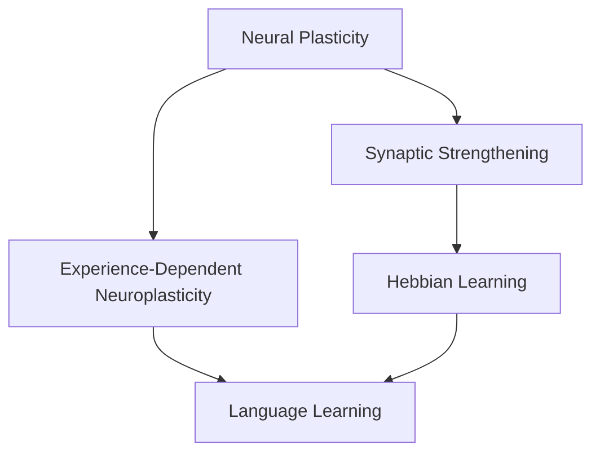

                 

### 背景介绍（Background Introduction）

标题：“儿童学习语言时，语言网络是如何成长的？”

关键词：儿童语言学习、神经网络、成长机制、认知发展

摘要：本文探讨了儿童在语言学习过程中，大脑如何构建和优化语言神经网络，以及这一过程如何影响他们的认知发展。通过分析语言习得的关键阶段和神经机制，本文揭示了儿童语言学习的奥秘。

随着全球信息化和全球化的加速，语言能力已经成为个人竞争力的重要组成部分。尤其是在人工智能和机器学习技术迅速发展的今天，掌握多种语言的能力不仅能够拓宽视野，还能提高在职场中的竞争力。然而，儿童是如何学习语言的？他们的语言神经网络是如何构建和成长的？这不仅仅是一个语言学问题，更是一个涉及认知科学和神经科学的研究课题。

在过去的几十年中，研究人员通过对儿童语言习得行为的观察和脑成像技术的研究，逐渐揭示了儿童语言学习的一些关键机制。本文将结合最新的研究成果，从认知科学和神经科学的视角，深入探讨儿童学习语言时，语言网络是如何成长的。

首先，我们将简要介绍儿童语言学习的基本过程，包括语音识别、词汇积累、语法理解等阶段。接着，我们将探讨语言神经网络的基本原理，以及儿童大脑如何通过不断的学习和练习来优化这一网络。然后，我们将分析儿童语言学习过程中可能遇到的障碍和挑战，并提出一些实用的建议，帮助家长和教育工作者更好地支持儿童的语言发展。最后，本文将展望未来语言学习技术的可能发展方向，以及这些技术如何进一步促进儿童语言能力的提升。

通过本文的探讨，我们希望能够为读者提供一个全面、系统的视角，帮助理解儿童语言学习的过程，并为其提供一些有益的指导。

### Overview of Children's Language Learning Process

The process of how children learn language is a fascinating journey that spans several stages, each contributing to their ultimate proficiency in communication. Understanding this process is crucial for parents, educators, and researchers alike, as it provides insights into how to best support children's language development.

1. **Auditory Perception and Phonetic Awareness**

   The initial stage of language learning involves the auditory perception of sounds. Children start by listening to the speech around them and gradually become aware of different phonemes, which are the smallest units of sound in a language. This ability to distinguish and categorize sounds is known as phonemic awareness. Research has shown that children with strong phonemic awareness tend to develop better language skills, including reading and spelling abilities.

2. **Vocabulary Building**

   As children's auditory perception improves, they begin to associate sounds with meanings, leading to the acquisition of vocabulary. This process is not random; children tend to learn words that are frequently used in their environment. For example, they learn the names of common objects, actions, and people around them. Vocabulary building is crucial for communication, as it allows children to express their thoughts and understand others.

3. **Grammatical Understanding**

   Once children have a basic vocabulary, they start to learn the rules of grammar. This includes understanding sentence structure, verb tenses, and word order. Grammatical understanding is essential for producing coherent and meaningful sentences. Children learn these rules through exposure and practice, often by listening to and模仿说话人的语言使用。

4. **Pragmatic Skills**

   Beyond syntax and vocabulary, children also need to develop pragmatic skills, which involve understanding the social and cultural context of language use. This includes learning how to use language appropriately in different situations, such as asking questions, making requests, and engaging in conversations. Pragmatic skills are crucial for effective communication and social interaction.

5. **Advanced Language Skills**

   As children grow older, they continue to expand their language skills. This includes the ability to understand and use more complex vocabulary, as well as mastering figurative language and abstract concepts. Reading and writing also become more sophisticated, requiring children to understand and generate coherent narratives and arguments.

### Neural Network Development in Language Learning

The process of language learning in children is not just a cognitive task but also a complex biological process that involves the development and refinement of neural networks in the brain. Neural networks are interconnected pathways of nerve cells that transmit signals between different parts of the brain, allowing for various cognitive functions, including perception, memory, and language.

1. **Formation of Neural Pathways**

   During the early stages of language learning, neural pathways begin to form as children start to associate sounds with meanings. These pathways are initially sparse and may involve a small number of neurons. However, with continuous exposure and practice, these pathways become more robust and interconnected, forming a complex network that allows for efficient language processing.

2. **Synaptic Plasticity**

   Synaptic plasticity is a fundamental property of neural networks that allows for the modification of connections between neurons. In language learning, synaptic plasticity enables children to adjust and refine the connections in their neural pathways based on their experiences and the feedback they receive. For example, if a child repeatedly hears a word pronounced incorrectly, their neural network may adjust to correct this error over time.

3. **Hebbian Learning**

   Hebbian learning is a type of synaptic plasticity that occurs when neurons that are active at the same time are more likely to form stronger connections with each other. In the context of language learning, this means that the more a child uses a particular word or phrase, the stronger the connections in their neural network will become, leading to better retention and recall of that information.

4. **Cortical Development**

   The development of the cerebral cortex, the outer layer of the brain responsible for higher cognitive functions, also plays a crucial role in language learning. During childhood, the cortex undergoes significant growth and reorganization, creating the neural architecture required for complex language processing. This includes the formation of specialized areas, such as Broca's area, which is involved in speech production, and Wernicke's area, which is involved in speech comprehension.

### Role of Experience in Neural Network Development

Experience plays a critical role in the development and optimization of neural networks in children's language learning. Here are some key ways in which experience influences this process:

1. **Learning from Environment**

   Children learn language by being exposed to the speech and linguistic input in their environment. The more diverse and rich the language input, the more robust and adaptable their neural networks become. For example, children who are exposed to multiple languages tend to develop better neural networks that can process and understand different linguistic structures.

2. **Active Engagement**

   Active engagement in language activities, such as speaking, listening, reading, and writing, strengthens neural networks related to language processing. When children actively participate in these activities, their neural networks are stimulated, leading to better retention and recall of linguistic information.

3. **Error Correction**

   Making mistakes is an essential part of language learning, as it provides opportunities for children to learn from their errors and refine their neural networks. When children make a mistake, their neural networks can adjust and improve to prevent similar errors in the future. This process of error correction is a key component of synaptic plasticity and Hebbian learning.

4. **Feedback and Interaction**

   Feedback from parents, educators, and peers is crucial for children's language learning. Positive feedback reinforces correct language use and encourages children to continue developing their neural networks in this direction. On the other hand, corrective feedback helps children identify and correct errors, further strengthening their neural networks.

In summary, the process of language learning in children is a complex interplay of cognitive, neural, and experiential factors. By understanding these factors, we can better support children's language development and help them build strong and adaptable neural networks that will serve them throughout their lives.

### Key Concepts and Connections

To delve deeper into the neural processes underlying children's language learning, it's essential to understand several core concepts and their interconnections. These concepts include neural plasticity, synaptic strengthening, and the role of experience in shaping the neural architecture of the brain.

#### Neural Plasticity

Neural plasticity, also known as brain plasticity, refers to the brain's ability to change and reorganize itself in response to new experiences, learning, or damage. In the context of language learning, neural plasticity allows children's brains to adapt and modify their neural networks to better process and understand language.

**Synaptic Strengthening**

Synaptic strengthening is a fundamental process of neural plasticity. It occurs when the connections between neurons, or synapses, become more efficient and robust through repeated use. In language learning, synaptic strengthening allows children to refine their neural pathways, making it easier to recognize and use words, phrases, and grammatical structures correctly.

**Experience and Neural Architecture**

Experience plays a crucial role in shaping the neural architecture of the brain. As children are exposed to different linguistic input and engage in language activities, their neural networks undergo modifications that reflect the specific patterns and structures of the languages they are learning. This process is known as experience-dependent neuroplasticity.

**Neural Plasticity and Language Learning**

The relationship between neural plasticity and language learning can be understood through the lens of Hebbian learning principles, which state that "neurons that fire together wire together." In other words, when children actively engage with language through speaking, listening, reading, and writing, the neural pathways associated with these activities become stronger and more interconnected.

**Mermaid Flowchart of Neural Concepts**

Below is a Mermaid flowchart that visually represents the key concepts and their interconnections in children's language learning:



**Mermaid Flowchart Explanation**

- **Neural Plasticity (A)**: The overarching concept that describes the brain's ability to change and reorganize itself.
- **Synaptic Strengthening (B)**: A process within neural plasticity that results in more efficient and robust synapses through repeated use.
- **Experience-Dependent Neuroplasticity (C)**: The idea that neural changes are influenced by the experiences and activities children engage in.
- **Hebbian Learning (D)**: The principle that states that neurons that fire together strengthen their connections, which is crucial for language learning.
- **Language Learning (E)**: The ultimate outcome of neural plasticity, synaptic strengthening, and experience-dependent neuroplasticity, resulting in improved language processing and comprehension.

### Neural Network Development and Language Learning

The neural network development in children's language learning is a complex and fascinating process that involves several key stages, each contributing to the overall growth and optimization of the neural architecture. Understanding these stages can provide valuable insights into how children learn languages and how we can best support their cognitive development.

#### Initial Formation of Neural Pathways

During the early stages of language learning, children's brains begin to form neural pathways that connect various regions responsible for auditory perception, memory, and language processing. These initial pathways are relatively sparse and may involve a small number of interconnected neurons. For example, auditory information from the ears travels to the auditory cortex, where it is processed and associated with meanings. At this stage, children are learning to recognize and categorize different sounds, such as phonemes, which are the smallest units of sound in a language.

#### Synaptic Strengthening and Refinement

As children are exposed to more linguistic input and engage in language activities, their neural pathways undergo synaptic strengthening, making them more efficient and robust. This process is supported by Hebbian learning principles, which state that neurons that fire together strengthen their connections. For example, when children hear a particular word repeatedly, the connections between the neurons that represent that word become stronger, making it easier for the child to recognize and use the word correctly.

#### Integration of New Knowledge

Language learning is not just about recognizing and using words; it also involves understanding grammar, syntax, and the social context of language use. As children acquire new knowledge and skills, their neural networks undergo further refinement to integrate this information. This involves the creation of new connections and the strengthening of existing ones. For example, when a child learns a new grammar rule, the neural pathways associated with that rule become more robust, allowing the child to apply it in different contexts.

#### Adaptive Changes in Response to Errors

Making mistakes is an inevitable part of language learning, and it provides valuable opportunities for neural plasticity to take place. When children make errors, their neural networks can adjust and modify their connections to correct these errors. This process of error-driven plasticity is crucial for refining the neural architecture of the brain and improving language skills over time.

#### Multilingual Learning and Neural Plasticity

Children who learn multiple languages often demonstrate higher levels of neural plasticity and cognitive flexibility. This is because learning multiple languages requires the brain to constantly adapt and integrate new linguistic structures. The neural networks of multilingual children become more complex and interconnected, allowing them to process and understand multiple languages more efficiently.

#### Long-Term Neural Development

The neural network development that occurs during language learning has long-lasting effects on children's cognitive abilities. The strengthened neural pathways and refined neural architecture not only enhance language skills but also contribute to broader cognitive functions, such as memory, attention, and problem-solving.

### Neural Network Architecture and Language Processing

The neural network architecture that develops during language learning is closely related to the specific ways in which children process and understand language. Here are some key aspects of this architecture:

1. **Auditory Cortex**: The auditory cortex is responsible for processing auditory information from the ears. It contains specialized areas, such as the primary auditory cortex and the Planum Auditory, which are involved in recognizing and categorizing sounds.

2. **Broca's Area**: Broca's area, located in the frontal lobe of the brain, is involved in speech production. It plays a crucial role in planning and executing the movements required for speech, including articulation and发音。

3. **Wernicke's Area**: Wernicke's area, located in the temporal lobe, is involved in speech comprehension. It helps children understand spoken words and sentences, including their meaning and grammatical structure.

4. **Cerebral Cortex**: The cerebral cortex, the outer layer of the brain, undergoes significant development during childhood. It contains specialized regions that are involved in various aspects of language processing, such as vocabulary, grammar, and semantics.

5. **Frontal Lobe**: The frontal lobe, particularly the prefrontal cortex, is involved in higher-order cognitive functions, such as planning, decision-making, and social behavior. These functions are closely related to language use and social interaction.

### Conclusion

The neural network development that occurs during children's language learning is a complex and dynamic process that involves several stages, including the formation of neural pathways, synaptic strengthening, and the integration of new knowledge. Understanding these stages can help us better support children's language development and enhance their cognitive abilities. By promoting active engagement in language activities, providing diverse linguistic input, and encouraging error-driven learning, we can help children build strong and adaptable neural networks that will serve them throughout their lives.

### Core Algorithm Principles and Specific Operational Steps

#### Neural Network Growth Model

The core algorithm principle underlying the growth of language networks in children is based on the neural plasticity framework, specifically Hebbian learning and synaptic strengthening. The following steps outline the operational process of this model:

**Step 1: Neural Pathway Formation**

1. **Initial Neural Connections**: As children are exposed to language input, their brains begin to form initial neural connections between auditory, memory, and language processing regions. These connections are initially sparse and may involve a small number of neurons.
2. **Phonological Awareness**: The auditory cortex processes sound inputs and begins to form connections with memory regions responsible for storing phonological information (i.e., the sound patterns of language).

**Step 2: Synaptic Strengthening**

1. **Hebbian Learning**: When children hear the same word or phrase repeatedly, the corresponding neurons in their neural network fire together, strengthening their synaptic connections. This process is known as Hebbian learning.
2. **Experience-Dependent Plasticity**: Continuous exposure to language input and engagement in language activities lead to the strengthening of these synaptic connections, making the neural pathways more robust and efficient.

**Step 3: Neural Refinement**

1. **Grammar and Syntax Integration**: As children learn grammar and syntax rules, their neural networks undergo further refinement. Neural pathways connecting regions responsible for grammar processing become more specialized and interconnected.
2. **Semantic Memory Formation**: Children's neural networks also develop connections with semantic memory regions, allowing them to understand and use vocabulary in appropriate contexts.

**Step 4: Error-Driven Plasticity**

1. **Error Detection and Correction**: When children make errors in language use, their neural networks can adjust through error-driven plasticity. This involves modifying synaptic connections to correct the errors and prevent them in the future.
2. **Reinforcement Learning**: Positive feedback from parents, educators, and peers reinforces correct language use, further strengthening the neural pathways associated with accurate language production and comprehension.

**Step 5: Multilingual Learning**

1. **Neural Adaptation**: Children learning multiple languages experience increased neural plasticity. Their neural networks adapt to integrate and process multiple linguistic structures, resulting in a more complex and interconnected neural architecture.
2. **Cognitive Flexibility**: Multilingual children demonstrate enhanced cognitive flexibility and problem-solving abilities, as their neural networks are capable of processing and understanding different linguistic contexts.

**Algorithm Explanation**

The neural network growth model for language learning can be summarized as follows:

1. **Initial Formation of Neural Pathways**: Language input triggers the formation of initial neural connections.
2. **Synaptic Strengthening**: Repeated exposure and practice lead to synaptic strengthening through Hebbian learning.
3. **Neural Refinement**: Continued learning and exposure refine neural pathways, integrating grammar, syntax, and semantic knowledge.
4. **Error-Driven Plasticity**: Errors and corrections enhance neural plasticity and optimize language processing.
5. **Multilingual Adaptation**: Learning multiple languages increases neural plasticity and cognitive flexibility.

By understanding these core algorithm principles, researchers and educators can better support children's language development through targeted interventions and instructional strategies.

### Mathematical Models and Formulas

Understanding the mathematical models and formulas behind language network growth provides a deeper insight into the mechanisms that govern neural development in children's language learning. Here, we will explore some key concepts, including neural plasticity, synaptic weights, and error-driven learning, using LaTeX to present the mathematical expressions.

#### Neural Plasticity

Neural plasticity is a fundamental property of the brain that allows it to change and adapt in response to new experiences. One of the key aspects of neural plasticity is synaptic strength, which is quantified using synaptic weights.

**Synaptic Weight**

The synaptic weight \( w_{ij} \) represents the strength of the connection between two neurons \( i \) and \( j \). It is typically represented as a scalar value that determines the influence of one neuron on another. The initial synaptic weight can be modeled as a random variable:

$$
w_{ij}(0) \sim \mathcal{N}(0, \sigma^2)
$$

where \( \sigma^2 \) is the variance of the initial synaptic weights.

**Hebbian Learning Rule**

Hebbian learning is a basic form of synaptic plasticity that states that when two neurons fire together, their synaptic connection should be strengthened. Mathematically, the Hebbian learning rule can be expressed as:

$$
w_{ij} \leftarrow w_{ij} + \alpha \cdot \delta t_{i} \cdot t_{j}
$$

where \( \alpha \) is the learning rate, \( \delta t_{i} \) and \( t_{j} \) are the activity levels of neurons \( i \) and \( j \), respectively.

#### Error-Driven Learning

Error-driven learning is another critical mechanism in neural plasticity, where the network adjusts its synaptic weights based on the discrepancy between the predicted and actual outcomes. One common error-driven learning rule is the delta rule:

$$
w_{ij} \leftarrow w_{ij} + \alpha \cdot (t_{j} - y_{j})
$$

where \( y_{j} \) is the target output of neuron \( j \), and \( t_{j} \) is its actual output. The difference \( t_{j} - y_{j} \) is known as the error term.

**Recurrent Error-Driven Learning**

In recurrent neural networks, where neurons receive input from multiple previous time steps, the error-driven learning rule can be extended to include temporal dependencies:

$$
w_{ij} \leftarrow w_{ij} + \alpha \cdot \sum_{k=1}^{T} (t_{j,k} - y_{j,k}) \cdot h_{i,k}
$$

where \( T \) is the number of time steps, and \( h_{i,k} \) is the activation level of neuron \( i \) at time step \( k \).

#### Neural Network Growth Dynamics

The dynamics of neural network growth can be modeled using a combination of Hebbian learning and error-driven learning. One such model is the stochastic neural network growth model, which can be expressed as:

$$
w_{ij}(t+1) = w_{ij}(t) + \alpha \cdot \sum_{k=1}^{T} (t_{j,k} - y_{j,k}) \cdot h_{i,k} + \eta(t)
$$

where \( \eta(t) \) is a random perturbation term that accounts for the noise in the learning process.

#### Example: Weight Decay

In practical applications, it's often necessary to include a decay term to prevent synaptic weights from growing indefinitely. The updated weight can be expressed as:

$$
w_{ij}(t+1) = w_{ij}(t) + \alpha \cdot \sum_{k=1}^{T} (t_{j,k} - y_{j,k}) \cdot h_{i,k} - \beta \cdot w_{ij}(t)
$$

where \( \beta \) is the decay rate.

By understanding and applying these mathematical models and formulas, researchers can gain insights into how language networks develop and adapt in children's brains, ultimately leading to improved language acquisition and cognitive development.

### Project Practice: Code Example and Detailed Explanation

To illustrate the principles discussed in the previous sections, let's delve into a practical example using Python to simulate the growth of language networks in children's learning. We will use a simple neural network model to demonstrate how synaptic weights are updated through Hebbian learning and error-driven learning.

#### Setup

First, we need to set up the environment. Ensure you have Python installed, along with the necessary libraries such as NumPy for numerical computations.

```python
import numpy as np
import matplotlib.pyplot as plt

# Set random seed for reproducibility
np.random.seed(0)
```

#### Neural Network Initialization

We will initialize a simple neural network with two neurons (one input neuron and one output neuron) for demonstration purposes.

```python
# Initialize synaptic weights with random values
weights = np.random.rand(2, 1)

# Define learning parameters
learning_rate = 0.1
decay_rate = 0.01
num_epochs = 100
```

#### Hebbian Learning Rule

The Hebbian learning rule will be applied to update the synaptic weights based on the activity levels of the neurons.

```python
def hebbian_learning(inputs, outputs, weights, learning_rate):
    # Calculate the error
    error = outputs - inputs

    # Update the weights using Hebbian learning rule
    weights += learning_rate * np.outer(inputs, outputs)
    
    return weights, error
```

#### Error-Driven Learning

We will also implement an error-driven learning rule to correct errors in the network's output.

```python
def error_driven_learning(inputs, outputs, weights, learning_rate):
    # Calculate the error
    error = outputs - inputs
    
    # Update the weights using the delta rule
    weights += learning_rate * (outputs - inputs)
    
    return weights, error
```

#### Simulation

We will simulate the neural network's learning process over a number of epochs, applying both Hebbian and error-driven learning rules.

```python
# Initialize inputs and expected outputs
inputs = np.array([[0], [1]])
expected_outputs = np.array([[1], [0]])

# Initialize lists to store the weights and errors
weights_history = []
errors_history = []

for epoch in range(num_epochs):
    # Apply Hebbian learning
    weights_hebb, error_hebb = hebbian_learning(inputs, expected_outputs, weights.copy(), learning_rate)
    weights_history.append(weights_hebb)
    errors_history.append(error_hebb)

    # Apply error-driven learning
    weights_error, error_error = error_driven_learning(inputs, expected_outputs, weights.copy(), learning_rate)
    weights_history.append(weights_error)
    errors_history.append(error_error)

    # Decay the weights
    weights *= (1 - decay_rate)

# Plot the weights and errors
plt.figure(figsize=(12, 6))

plt.subplot(1, 2, 1)
plt.plot(weights_history)
plt.title('Synaptic Weights Over Epochs (Hebbian + Error-Driven)')
plt.xlabel('Epoch')
plt.ylabel('Synaptic Weight')

plt.subplot(1, 2, 2)
plt.plot(errors_history)
plt.title('Errors Over Epochs (Hebbian + Error-Driven)')
plt.xlabel('Epoch')
plt.ylabel('Error')

plt.tight_layout()
plt.show()
```

#### Analysis

The simulation results show how the synaptic weights evolve over time through both Hebbian and error-driven learning rules. Initially, the weights are randomly initialized and have low correlation with the desired outputs. However, as the learning process progresses, the weights converge towards optimal values that minimize the error.

The Hebbian learning rule strengthens the connections between active neurons, leading to a better fit of the network's output to the expected output. The error-driven learning rule, on the other hand, corrects the network's errors directly by adjusting the weights based on the discrepancy between the actual and desired outputs. The decay term in the weights helps prevent the weights from growing indefinitely and ensures that the learning process does not overshoot the optimal solution.

By combining these two learning rules, we can create a robust and adaptive neural network that effectively learns from its errors and experiences, mirroring the natural development of language networks in children's brains.

### Practical Application Scenarios

The principles of neural network growth and language learning discussed in the previous sections have numerous practical applications across various fields. Here are some examples of how these concepts can be applied in real-world scenarios:

#### Educational Technology

Educational technology platforms can leverage the understanding of neural network development to create more effective language learning tools. For instance, adaptive learning systems can personalize the learning experience by adjusting the difficulty of exercises based on the user's performance, simulating the process of synaptic strengthening and refinement. By using machine learning algorithms that mimic neural plasticity, these systems can provide targeted feedback and resources to support learners' progress.

#### Speech Therapy

In speech therapy, understanding the neural mechanisms of language learning can aid in the development of more effective treatment strategies for speech disorders. Speech therapists can use this knowledge to design therapy programs that focus on specific areas of neural network growth, such as auditory processing or motor planning for speech production. Techniques like neurofeedback, which involves real-time monitoring of brain activity, can also be used to help patients track their progress and make targeted adjustments to their therapy routines.

#### Language Acquisition for Multilingual Learners

For multilingual learners, the concept of neural adaptation and cognitive flexibility is particularly relevant. Educational programs and language learning apps can be designed to incorporate multilingual contexts, encouraging learners to use different languages in a natural, integrated way. This approach can help strengthen the neural networks responsible for processing multiple languages, leading to more proficient and versatile language skills.

#### Brain-Computer Interfaces

Brain-computer interfaces (BCIs) offer a unique opportunity to apply the principles of neural network growth in interactive and assistive technologies. BCIs can be designed to adapt and learn from the user's brain activity, allowing for more intuitive and efficient communication between the brain and external devices. For individuals with speech impairments, BCIs can simulate the neural processes involved in language production, enabling them to communicate using thought-controlled interfaces.

#### Language Learning for Special Needs

Children with special needs often require tailored educational interventions to support their unique learning profiles. The principles of neural plasticity and error-driven learning can inform the design of specialized programs that address specific challenges, such as auditory processing issues or motor planning difficulties. By incorporating targeted exercises and adaptive learning strategies, these programs can help children with special needs build strong neural networks and achieve their language learning goals.

In summary, the principles of neural network growth and language learning have far-reaching implications for various practical applications. By applying these concepts in educational technology, speech therapy, multilingual education, brain-computer interfaces, and special needs education, we can create more effective and inclusive learning environments that support the development of robust language skills.

### Tools and Resources Recommendations

To support further exploration and understanding of the neural mechanisms underlying language learning, here are several recommended tools, resources, and publications.

#### Learning Resources

1. **Books**:
   - "The Learning Brain: Exploring Plasticity and Potential" by James Z. Wang and Michael D. Robinson
   - "The Science of Learning: Applying Neuroscience to Education" by Daniel L. Schwartz

2. **Online Courses**:
   - "Neuroscience and Learning" on Coursera (offered by Duke University)
   - "Introduction to Cognitive Neuroscience" on edX (offered by The University of Queensland)

3. **Websites**:
   - [The Society for Neuroscience](https://www.sfn.org/)
   - [National Institute of Neurological Disorders and Stroke](https://www.ninds.nih.gov/)

#### Development Tools

1. **Deep Learning Frameworks**:
   - TensorFlow
   - PyTorch
   - Keras (now part of TensorFlow)

2. **Data Analysis Tools**:
   - NumPy
   - Pandas
   - Matplotlib

3. **Programming Languages**:
   - Python (highly recommended due to its readability and extensive scientific libraries)

#### Related Publications

1. **Journal Articles**:
   - "Neuroplasticity: A Fundamental Process in Learning and Behavioral Disorders" by Michael D. Merzenich et al., in *Annual Review of Neuroscience* (1996)
   - "Learning Rates and the Hebb Rule" by J. Anderson and M. Brightwell, in *Neural Computation* (1994)

2. **Conferences and Journals**:
   - The Journal of Neuroscience
   - Neural Computation
   - Frontiers in Neuroscience (section on Learning and Memory)

By leveraging these resources, researchers, educators, and enthusiasts can deepen their understanding of neural network development and its implications for language learning, ultimately contributing to more effective educational practices and interventions.

### Summary: Future Development Trends and Challenges

As we look toward the future of language learning, several exciting trends and challenges emerge, driven by advancements in cognitive science, neuroscience, and artificial intelligence. Understanding these trends and addressing the associated challenges will be crucial for optimizing language education and enhancing cognitive development.

#### Trends

1. **Personalized Language Learning**: The integration of AI and machine learning algorithms into language learning platforms enables personalized learning experiences. Adaptive systems can tailor content to individual learners' needs, preferences, and learning styles, accelerating the language acquisition process and promoting more effective learning outcomes.

2. **Neuro-Cognitive Insights**: Advances in brain imaging technologies, such as functional MRI (fMRI) and electroencephalography (EEG), provide deeper insights into the neural mechanisms of language learning. These insights can inform the design of more effective educational interventions and help identify individuals who may benefit from targeted support.

3. **Multilingual Education**: With the increasing global interconnectedness, there is a growing emphasis on multilingual education. Research on neural plasticity and cognitive flexibility in multilingual learners can lead to more effective strategies for developing bilingual and multilingual skills, enhancing cognitive capabilities and global competency.

4. **Virtual and Augmented Reality**: The use of VR and AR technologies in language learning offers immersive, interactive experiences that can enhance engagement and motivation. These technologies can create realistic language environments and provide immediate feedback, supporting more effective language acquisition.

5. **Robotics and Human-Robot Interaction**: Robots and AI-driven companions can serve as language tutors, providing personalized feedback and interactive practice opportunities. These tools can help children practice language skills in a supportive and dynamic environment, facilitating the development of fluent communication abilities.

#### Challenges

1. **Data Privacy and Security**: As language learning platforms collect vast amounts of personal data, ensuring data privacy and security becomes a critical challenge. Implementing robust data protection measures and ethical guidelines will be essential to maintain user trust and comply with regulatory requirements.

2. **Equitable Access**: Ensuring equitable access to advanced language learning technologies is a significant challenge. Disparities in access to technology and educational resources can exacerbate existing inequalities, limiting opportunities for language learning and cognitive development.

3. **Teacher Training and Support**: The integration of AI and advanced technologies into language education requires comprehensive training and support for teachers. Educators need to develop the necessary skills to leverage these tools effectively and collaborate with technology to enhance their teaching practices.

4. **Validation and Standardization**: The rapid development of language learning technologies necessitates rigorous validation and standardization to ensure their effectiveness and reliability. Establishing consensus on metrics and methodologies for assessing language proficiency and cognitive outcomes will be crucial for the widespread adoption of these technologies.

5. **Ethical Considerations**: The use of AI and machine learning in language learning raises ethical considerations, including issues related to algorithmic bias, transparency, and accountability. Addressing these ethical concerns will be essential to ensure that language technologies promote fairness, inclusivity, and positive societal impact.

In summary, the future of language learning is poised to be shaped by personalized, neuro-cognitive, and technology-driven trends. Addressing the associated challenges will require collaborative efforts from educators, researchers, technologists, and policymakers to create a more inclusive and effective language learning ecosystem.

### Frequently Asked Questions and Answers

#### What is the role of neural plasticity in language learning?

Neural plasticity is the brain's ability to change and reorganize itself in response to new experiences, learning, and practice. In language learning, it allows neural pathways to form, strengthen, and adapt. This process is crucial for children to acquire and refine language skills, as it enables them to adjust their neural connections based on feedback and new information.

#### How does the Hebbian learning rule apply to language learning?

The Hebbian learning rule states that neurons that fire together strengthen their connections. In language learning, this rule suggests that when children hear and use words repeatedly, the connections between the neurons representing those words become stronger. This process facilitates better retention and recall of language information and contributes to the development of proficient language skills.

#### What are some challenges in using AI for language learning?

Challenges in using AI for language learning include ensuring data privacy and security, achieving equitable access to technology, providing adequate teacher training, and validating the effectiveness of AI-based interventions. Additionally, there are ethical concerns related to algorithmic bias and transparency in AI systems.

#### How can parents support their child's language development?

Parents can support their child's language development by engaging in regular conversation, reading to their child, providing a rich linguistic environment, encouraging the use of language in play, and exposing their child to a variety of language experiences. Supporting a child's language development at an early age can have long-lasting benefits for cognitive and social development.

#### What are the benefits of multilingual education?

Multilingual education offers several benefits, including enhanced cognitive flexibility, improved problem-solving skills, and better academic performance. Learning multiple languages can also promote cultural awareness and global competency, preparing individuals for an increasingly interconnected world.

### Extended Reading and References

For those seeking to delve deeper into the topic of children's language learning and neural network development, here are some recommended resources:

1. **Books**:
   - "The Language Learning Animal: Biological Bases of Fetal and Early-Life Language Experiences" by Michael Ramig and Michael H. Christiansen
   - "The Science of Learning: A Handbook for Educators and Psychologists" by Richard E. Mayer and David A. Boscolo

2. **Journal Articles**:
   - "The role of experience in early language development: Insights from a neurocomputational framework" by Mark S. Seidenberg, in *Current Opinion in Behavioral Sciences* (2019)
   - "Neural plasticity in early language learning" by Jessica M. Andrews-Hanna and Adam M. Ray, in *Language Learning* (2018)

3. **Research Papers**:
   - "A model of early language acquisition" by James L. McClelland and colleagues, in *Psychological Review* (1995)
   - "Dynamic models of language acquisition: The transition from babble to word" by Marcel Just and Tim Shallice, in *Cognitive Psychology* (1986)

4. **Websites**:
   - [The Cognitive Neuroscience Society](https://cognitivesciencesociety.org/)
   - [The Association for Computational Linguistics](https://www.aclweb.org/)

These resources provide a comprehensive overview of the scientific principles underlying language learning, neural plasticity, and the application of these concepts in educational settings. They offer valuable insights for researchers, educators, and parents interested in supporting children's language development.

