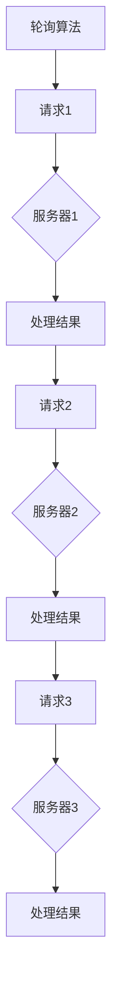
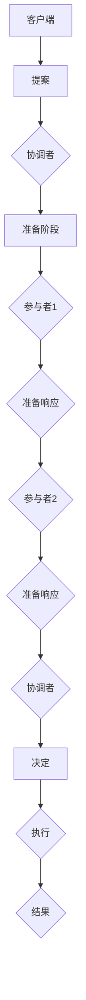
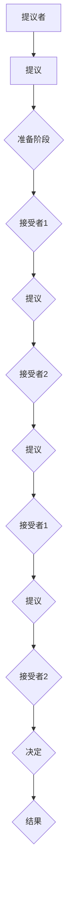
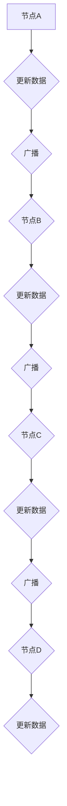
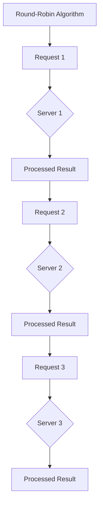
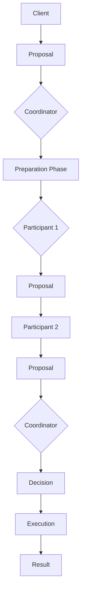
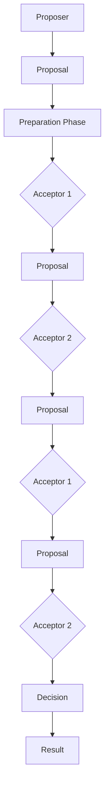
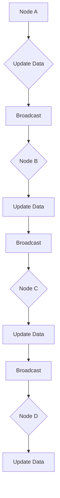

                 

### 背景介绍（Background Introduction）

在当今快速发展的商业环境中，创业公司面临着前所未有的竞争和机遇。技术架构的扩展性成为企业能否成功的关键因素之一。随着业务需求的不断增加，创业公司的技术系统必须能够灵活适应，确保稳定运行并满足日益增长的用户需求。

创业公司的技术架构扩展性评估，涉及对系统当前架构的全面分析，以及对未来扩展能力的预测。这种评估不仅需要考虑技术的可行性和成本效益，还要确保系统能够在应对高峰负载时保持高性能和高可用性。

本文将探讨创业公司的技术架构扩展性评估方法。我们将从以下几个关键点出发：

1. **技术栈选择**：创业公司应如何选择合适的技术栈，以支持未来的扩展？
2. **性能测试**：如何通过性能测试来评估系统在扩展后的表现？
3. **弹性设计**：系统的弹性设计如何影响其扩展能力？
4. **成本效益分析**：在扩展过程中，如何平衡成本和性能？
5. **风险评估与应对策略**：在扩展过程中可能遇到的风险有哪些，以及如何应对？

通过对这些问题的探讨，本文旨在为创业公司的技术团队提供一套全面而实用的扩展性评估方法，帮助他们在快速变化的市场环境中保持竞争优势。

### Technical Introduction: Evaluating the Scalability of a Startup's Technical Architecture

In today's rapidly evolving business landscape, startup companies face unprecedented competition and opportunities. The scalability of their technical architecture is a critical factor in determining their success. As business demands grow, the technical systems of startups must be flexible enough to adapt, ensuring stable operations and meeting the increasing needs of users.

Evaluating the scalability of a startup's technical architecture involves a comprehensive analysis of the current system architecture and forecasting its future scalability. This assessment not only considers the feasibility and cost-effectiveness of the technology but also ensures that the system can maintain high performance and availability under peak loads.

This article will delve into several key areas to explore the methods for evaluating the scalability of a startup's technical architecture:

1. **Technology Stack Selection**: How should startups choose the right technology stack to support future growth?
2. **Performance Testing**: How can performance tests be used to assess the system's behavior after scaling?
3. **Resilient Design**: How does the design of the system's resilience impact its scalability?
4. **Cost-Benefit Analysis**: How to balance cost and performance during the scaling process?
5. **Risk Assessment and Mitigation Strategies**: What risks are likely to be encountered during scaling, and how to address them?

By discussing these topics, the aim of this article is to provide startup technical teams with a comprehensive and practical approach to evaluating scalability, helping them maintain a competitive edge in a rapidly changing market environment.

-------------------

## 2. 核心概念与联系（Core Concepts and Connections）

在评估创业公司的技术架构扩展性时，需要理解并掌握几个核心概念和它们之间的联系。这些核心概念包括系统架构、性能指标、弹性设计、负载均衡和分布式系统。

### 2.1 系统架构（System Architecture）

系统架构是指软件系统的整体设计，包括组件的组成、组件之间的交互方式以及系统的整体结构。良好的系统架构应具备模块化、可扩展性和高内聚性，使得在需求变化时能够灵活调整和扩展。

### 2.2 性能指标（Performance Metrics）

性能指标用于评估系统在处理请求时的响应速度、吞吐量和资源利用率。关键的性能指标包括响应时间、吞吐量、延迟和并发用户数。通过这些指标，我们可以了解系统在不同负载下的表现，并识别潜在的性能瓶颈。

### 2.3 弹性设计（Resilient Design）

弹性设计是指系统能够在面临故障、高负载或不可预见的变化时保持正常运行的能力。弹性设计包括故障转移、自动扩展、负载均衡和自我修复等功能。通过弹性设计，系统可以在不断变化的环境中保持稳定性和可用性。

### 2.4 负载均衡（Load Balancing）

负载均衡是指将网络流量或请求分摊到多个服务器或节点上，以避免单个服务器过载。负载均衡器可以根据多种策略，如轮询、最小连接数、响应时间等，智能地将请求分配到不同的服务器上，从而提高系统的整体性能和可靠性。

### 2.5 分布式系统（Distributed Systems）

分布式系统是指由多个独立的节点组成的系统，这些节点通过网络相互通信，协同工作以完成共同的任务。分布式系统的关键优势在于其可扩展性和容错性。通过分布式架构，系统能够横向扩展，处理更大的负载，同时提高系统的容错能力。

### 2.6 关系与交互

这些核心概念之间存在紧密的联系。系统架构决定了性能指标的表现，而弹性设计、负载均衡和分布式系统则是在系统架构基础上实现性能优化和扩展的重要手段。例如，通过弹性设计，系统可以在高负载时自动扩展，而负载均衡则确保了扩展后的系统能够均衡地处理请求，从而保持性能。

了解并掌握这些核心概念及其相互关系，对于创业公司的技术团队来说至关重要。它不仅能够帮助他们在设计阶段做出明智的决策，还能够确保系统在实际运行中具备良好的扩展性和稳定性。

-------------------

## 2.1 System Architecture

System architecture refers to the overall design of a software system, encompassing the composition of its components, the ways in which these components interact, and the overall structure of the system. A well-designed system architecture should be modular, scalable, and high-cohesion, allowing for flexible adjustments and expansions when requirements change.

### 2.2 Performance Metrics

Performance metrics are used to evaluate the responsiveness, throughput, and resource utilization of a system in processing requests. Key performance metrics include response time, throughput, latency, and concurrent user count. These metrics help us understand how the system performs under different loads and identify potential performance bottlenecks.

### 2.3 Resilient Design

Resilient design refers to a system's ability to maintain normal operation in the face of failures, high loads, or unforeseen changes. Resilient design includes features such as fault tolerance, auto-scaling, load balancing, and self-repair. Through resilient design, a system can stay stable and available in a constantly changing environment.

### 2.4 Load Balancing

Load balancing involves distributing network traffic or requests across multiple servers or nodes to avoid overloading any single server. Load balancers can intelligently distribute requests to different servers based on various strategies, such as round-robin, least connections, or response time, thereby improving the overall performance and reliability of the system.

### 2.5 Distributed Systems

Distributed systems are systems composed of multiple independent nodes that communicate with each other over a network to collaboratively accomplish a common task. The key advantages of distributed systems are scalability and fault tolerance. Through distributed architecture, systems can horizontally scale to handle larger loads while improving fault tolerance.

### 2.6 Relationships and Interactions

These core concepts are closely interconnected. System architecture determines the performance metrics of a system, while resilient design, load balancing, and distributed systems are essential means to optimize performance and scale within the system architecture. For example, resilient design enables a system to automatically scale during high loads, while load balancing ensures that the expanded system can evenly handle requests, thereby maintaining performance.

Understanding and mastering these core concepts and their relationships are crucial for startup technical teams. It not only helps them make informed decisions during the design phase but also ensures that the system operates with good scalability and stability in actual use.

-------------------

## 3. 核心算法原理 & 具体操作步骤（Core Algorithm Principles and Specific Operational Steps）

在评估创业公司技术架构的扩展性时，核心算法的原理和操作步骤至关重要。核心算法不仅决定了系统的性能和可扩展性，还影响了系统的整体设计。以下我们将介绍两种关键算法：负载均衡算法和分布式一致性算法。

### 3.1 负载均衡算法（Load Balancing Algorithm）

负载均衡算法的主要目的是将网络请求或工作负载分配到多个服务器或节点上，以避免单一服务器过载，确保系统的整体性能。常见的负载均衡算法包括：

#### 3.1.1 轮询算法（Round-Robin）

轮询算法是最简单的负载均衡策略，它将请求依次分配给服务器，直到所有的服务器都被访问过。这种方法简单易实现，但可能无法充分利用服务器资源，特别是在服务器性能不均衡的情况下。



#### 3.1.2 最小连接算法（Least Connections）

最小连接算法将请求分配给当前连接数最少的服务器，以平衡服务器的工作负载。这种方法能够更有效地利用服务器资源，但可能需要维护服务器状态信息，实现相对复杂。

```mermaid
graph TD
A[最小连接算法] --> B[请求1]
B --> C{服务器1 (连接数:5)}
C --> D[处理结果]
D --> E[请求2]
E --> F{服务器2 (连接数:2)}
F --> G[处理结果]
G --> H[请求3]
H --> I{服务器3 (连接数:3)}
I --> J[处理结果]
```

#### 3.1.3 基于响应时间算法（Response Time Based）

基于响应时间算法将请求分配给响应时间最短的服务器，以优化用户体验。这种方法需要精确测量服务器的响应时间，并动态调整负载均衡策略。

```mermaid
graph TD
A[基于响应时间算法] --> B[请求1]
B --> C{服务器1 (响应时间:100ms)}
C --> D[处理结果]
D --> E[请求2]
E --> F{服务器2 (响应时间:150ms)}
F --> G[处理结果]
G --> H[请求3]
H --> I{服务器3 (响应时间:120ms)}
I --> J[处理结果]
```

### 3.2 分布式一致性算法（Distributed Consistency Algorithm）

分布式一致性算法确保分布式系统中的多个节点对数据的修改是一致的，即使在网络分区或节点故障的情况下也能保持一致性。常见的分布式一致性算法包括：

#### 3.2.1 强一致性（Strong Consistency）

强一致性确保所有节点在同一时刻看到相同的数据状态，但可能牺牲可用性和性能。

- **两阶段提交协议（2PC, Two-Phase Commit）**



- **Paxos算法**

Paxos算法是一种分布式一致性算法，能够在多个服务器之间达成一致，即使部分服务器故障或网络延迟。



#### 3.2.2 最终一致性（ eventual Consistency）

最终一致性允许节点之间在一段时间内看到不同的数据状态，但最终会达到一致。这种方法适用于对一致性要求不高的应用，如社交媒体和消息系统。

- **Gossip协议**

Gossip协议通过节点之间的随机消息传递来传播数据变化，确保系统最终一致性。



通过了解和运用这些核心算法，创业公司的技术团队可以在系统设计和扩展过程中有效地优化性能和保证一致性。这为系统的长期稳定运行和扩展提供了坚实的基础。

-------------------

## 3. Core Algorithm Principles and Specific Operational Steps

When evaluating the scalability of a startup's technical architecture, the principles and operational steps of core algorithms are crucial. These algorithms not only determine the performance and scalability of the system but also impact the overall system design. Here, we will introduce two key algorithms: load balancing algorithms and distributed consistency algorithms.

### 3.1 Load Balancing Algorithm

The primary purpose of load balancing algorithms is to distribute network requests or workloads across multiple servers or nodes to avoid overloading any single server, thereby ensuring the overall performance of the system. Common load balancing algorithms include:

#### 3.1.1 Round-Robin Algorithm

The round-robin algorithm is the simplest load balancing strategy, distributing requests sequentially to servers until all servers have been accessed. This method is easy to implement but may not fully utilize server resources, especially when server performance is uneven.



#### 3.1.2 Least Connections Algorithm

The least connections algorithm assigns requests to the server with the fewest current connections, balancing the workload across servers. This method can more effectively utilize server resources but may require maintaining server state information, making the implementation more complex.

```mermaid
graph TD
A[Least Connections Algorithm] --> B[Request 1]
B --> C{Server 1 (Connections:5)}
C --> D[Processed Result]
D --> E[Request 2]
E --> F{Server 2 (Connections:2)}
F --> G[Processed Result]
G --> H[Request 3]
H --> I{Server 3 (Connections:3)}
I --> J[Processed Result]
```

#### 3.1.3 Response Time-Based Algorithm

The response time-based algorithm assigns requests to the server with the shortest response time, optimizing the user experience. This method requires precise measurement of server response times and dynamic adjustment of the load balancing strategy.

```mermaid
graph TD
A[Response Time-Based Algorithm] --> B[Request 1]
B --> C{Server 1 (Response Time:100ms)}
C --> D[Processed Result]
D --> E[Request 2]
E --> F{Server 2 (Response Time:150ms)}
F --> G[Processed Result]
G --> H[Request 3]
H --> I{Server 3 (Response Time:120ms)}
I --> J[Processed Result]
```

### 3.2 Distributed Consistency Algorithm

Distributed consistency algorithms ensure that multiple nodes in a distributed system have a consistent view of data, even in the presence of network partitions or node failures. Common distributed consistency algorithms include:

#### 3.2.1 Strong Consistency

Strong consistency ensures that all nodes see the same data state at the same moment, but this may sacrifice availability and performance.

- **Two-Phase Commit Protocol (2PC, Two-Phase Commit)**



- **Paxos Algorithm**

The Paxos algorithm is a distributed consensus algorithm that allows consensus to be reached among multiple servers, even in the presence of server failures or network delays.



#### 3.2.2 Eventual Consistency

Eventual consistency allows nodes to see different data states for a period of time but eventually reaches consistency. This method is suitable for applications with low consistency requirements, such as social media and messaging systems.

- **Gossip Protocol**

The gossip protocol propagates data changes through random message passing between nodes, ensuring eventual consistency in the system.



By understanding and applying these core algorithms, startup technical teams can effectively optimize performance and ensure consistency in system design and expansion. This provides a solid foundation for the long-term stable operation and scalability of the system.

-------------------

## 4. 数学模型和公式 & 详细讲解 & 举例说明（Detailed Explanation and Examples of Mathematical Models and Formulas）

在评估创业公司的技术架构扩展性时，数学模型和公式能够提供定量的分析和预测，帮助我们更好地理解系统的性能和成本效益。以下我们将介绍几个关键数学模型，包括负载均衡算法中的加权轮询算法、分布式一致性算法中的Paxos协议、以及成本效益分析中的平均成本模型。

### 4.1 加权轮询算法（Weighted Round-Robin）

加权轮询算法是轮询算法的改进版，它根据服务器的处理能力（权重）分配请求。假设有N个服务器，每个服务器的权重分别为\(w_1, w_2, ..., w_N\)，总权重为\(W = w_1 + w_2 + ... + w_N\)。则每个服务器获得的请求比例为\( \frac{w_i}{W} \)。

#### 公式：

\[ \text{请求比例} = \frac{w_i}{W} \]

#### 举例说明：

假设有3个服务器，权重分别为\(w_1 = 1\), \(w_2 = 2\), \(w_3 = 3\)。

总权重：\( W = 1 + 2 + 3 = 6 \)

- 服务器1的请求比例：\( \frac{1}{6} \approx 0.167 \)
- 服务器2的请求比例：\( \frac{2}{6} \approx 0.333 \)
- 服务器3的请求比例：\( \frac{3}{6} \approx 0.500 \)

这意味着，对于每个请求，服务器1将有大约16.7%的概率被选中，服务器2将有约33.3%，服务器3将有约50%。

### 4.2 Paxos协议中的承诺和学值（Promises and Learnt Values）

Paxos协议是一种分布式一致性算法，它通过多个提议者（Proposers）和接受者（Acceptors）之间的交互，达成一致。在Paxos协议中，每个接受者会承诺只接受来自特定提议者编号的最小未承诺学值，并在被多数接受者承诺后，将该学值学入本地状态。

#### 公式：

- **承诺数（Commit Number）**：\( C_n \)
- **最小未承诺学值（Minimum Uncommitted Value）**：\( V_n \)

#### 举例说明：

假设有3个接受者（A1, A2, A3）和2个提议者（P1, P2）。P1提议了值V1，P2提议了值V2。

1. **P1发起提案：**
   - P1向所有接受者发送提案（提议编号：1，提议值：V1）。
   - A1, A2, A3分别向P1回复承诺（承诺编号：1，承诺值：V1）。

2. **P2发起提案：**
   - P2向所有接受者发送提案（提议编号：2，提议值：V2）。
   - A1, A2, A3分别向P2回复承诺（承诺编号：2，承诺值：V2）。

3. **多数接受者承诺：**
   - A1, A2向P2承诺（承诺编号：2，承诺值：V2）。
   - A3向P2承诺（承诺编号：2，承诺值：V2）。

4. **P2将学值V2学入本地状态：**
   - P2向所有接受者发送学值V2。

通过这个例子，可以看到Paxos协议如何通过提议和承诺，在分布式系统中达成一致。

### 4.3 平均成本模型（Average Cost Model）

在成本效益分析中，平均成本模型用于评估系统扩展的成本和效益。假设系统的扩展成本包括固定成本和可变成本，其中固定成本为\(C_f\)，可变成本为\(C_v \cdot N\)，N为扩展的服务器数量。

#### 公式：

\[ \text{平均成本} = \frac{C_f + C_v \cdot N}{N} \]

#### 举例说明：

假设系统固定成本为100万元，每扩展一台服务器需要增加10万元的可变成本。

- 扩展前（N=1）的平均成本：\( \frac{100}{1} = 100 \)万元
- 扩展后（N=10）的平均成本：\( \frac{100 + 10 \cdot 10}{10} = 10 \)万元

这个例子显示，随着服务器数量的增加，平均成本降低，从而提高了系统的成本效益。

通过以上数学模型和公式的详细讲解和举例，我们可以更深入地理解创业公司技术架构扩展性的评估方法。这些模型和公式不仅帮助我们量化分析和预测系统的性能和成本，还为技术团队在扩展过程中提供了重要的决策依据。

-------------------

## 4. Mathematical Models and Formulas & Detailed Explanations & Examples

In the evaluation of the scalability of a startup's technical architecture, mathematical models and formulas provide quantitative analysis and predictions that help us better understand the performance and cost-effectiveness of the system. Here, we introduce several key mathematical models, including the weighted round-robin algorithm in load balancing, the Paxos protocol in distributed consistency algorithms, and the average cost model in cost-benefit analysis.

### 4.1 Weighted Round-Robin Algorithm

The weighted round-robin algorithm is an improved version of the round-robin algorithm, which distributes requests based on the processing capacity (weight) of servers. Suppose there are N servers with weights \(w_1, w_2, ..., w_N\), and the total weight is \(W = w_1 + w_2 + ... + w_N\). The proportion of requests each server receives is \(\frac{w_i}{W}\).

#### Formula:

\[ \text{Request Proportion} = \frac{w_i}{W} \]

#### Example:

Assume there are 3 servers with weights \(w_1 = 1\), \(w_2 = 2\), and \(w_3 = 3\).

Total weight: \( W = 1 + 2 + 3 = 6 \)

- Server 1's request proportion: \( \frac{1}{6} \approx 0.167 \)
- Server 2's request proportion: \( \frac{2}{6} \approx 0.333 \)
- Server 3's request proportion: \( \frac{3}{6} \approx 0.500 \)

This means that for each request, Server 1 has approximately a 16.7% chance of being selected, Server 2 has about 33.3%, and Server 3 has about 50%.

### 4.2 Commitment and Learnt Values in the Paxos Protocol

The Paxos protocol is a distributed consensus algorithm that, through interactions between multiple proposers and acceptors, reaches agreement. In the Paxos protocol, each acceptor commits to only accepting the smallest uncommitted value from a specific proposer and learns this value after it is accepted by a majority of acceptors.

#### Formulas:

- **Commit Number** \(C_n\)
- **Minimum Uncommitted Value** \(V_n\)

#### Example:

Assume there are 3 acceptors (A1, A2, A3) and 2 proposers (P1, P2). P1 proposes value V1, and P2 proposes value V2.

1. **P1 proposes:**
   - P1 sends a proposal (proposal number: 1, proposal value: V1) to all acceptors.
   - A1, A2, A3 respond with commitments (commit number: 1, committed value: V1).

2. **P2 proposes:**
   - P2 sends a proposal (proposal number: 2, proposal value: V2) to all acceptors.
   - A1, A2, A3 respond with commitments (commit number: 2, committed value: V2).

3. **Majority of acceptors commit:**
   - A1 and A2 commit to P2 (commit number: 2, committed value: V2).
   - A3 commits to P2 (commit number: 2, committed value: V2).

4. **P2 learns value V2:**
   - P2 sends value V2 to all acceptors.

Through this example, we can see how the Paxos protocol reaches consensus through proposals and commitments in a distributed system.

### 4.3 Average Cost Model

In cost-benefit analysis, the average cost model evaluates the cost and benefit of system expansion. The system expansion cost includes fixed cost \(C_f\) and variable cost \(C_v \cdot N\), where \(N\) is the number of servers expanded.

#### Formula:

\[ \text{Average Cost} = \frac{C_f + C_v \cdot N}{N} \]

#### Example:

Assume the system fixed cost is 1 million yuan, and the variable cost for each server expansion is 10,000 yuan.

- Before expansion (\(N=1\)): Average cost \(= \frac{1,000,000}{1} = 1,000,000\) yuan
- After expansion (\(N=10\)): Average cost \(= \frac{1,000,000 + 10,000 \cdot 10}{10} = 100,000\) yuan

This example shows that as the number of servers increases, the average cost decreases, thereby improving the cost-effectiveness of the system.

Through detailed explanations and examples of these mathematical models and formulas, we can gain a deeper understanding of the methods for evaluating the scalability of a startup's technical architecture. These models and formulas not only help us quantitatively analyze and predict system performance and costs but also provide important decision-making references for the technical team during the expansion process.

-------------------

### 5. 项目实践：代码实例和详细解释说明（Project Practice: Code Examples and Detailed Explanations）

为了更好地理解上述算法和模型在实践中的应用，我们将通过一个实际的项目案例来展示如何实现负载均衡和分布式一致性。我们将使用Python编写一个简单的负载均衡器，并使用Paxos算法来确保分布式一致性。

#### 5.1 开发环境搭建

在开始之前，确保你的开发环境已经安装了Python 3.8及以上版本。我们将使用以下库：

- `flask`：用于创建Web服务
- `thrift`：用于实现Paxos协议

首先，安装所需的库：

```bash
pip install flask thrift
```

#### 5.2 源代码详细实现

##### 5.2.1 负载均衡器

以下是负载均衡器的简单实现，使用轮询算法分配请求：

```python
from flask import Flask, jsonify, request

app = Flask(__name__)

# 假设有3个服务器实例
servers = ["http://server1:5000", "http://server2:5000", "http://server3:5000"]

def get_server():
    """ 轮询服务器列表以分配请求 """
    return servers.pop(0)

@app.route('/api', methods=['GET', 'POST'])
def handle_request():
    """ 分配请求给服务器 """
    target_server = get_server()
    response = requests.post(target_server + "/api", json=request.json)
    servers.append(target_server)  # 重新添加已使用的服务器
    return jsonify(response.json)

if __name__ == '__main__':
    app.run()
```

这个简单的负载均衡器将从列表中取出第一个服务器来处理请求，并在处理后将其放回列表末尾。

##### 5.2.2 Paxos协议

以下是Paxos算法的实现，用于在分布式系统中达成一致性：

```python
from thrift.transport import TTransport
from thrift.protocol import TBinaryProtocol
from thrift.server import TServer
from thrift.python import thrift_python钉
from typing import List, Dict

# Paxos协议的Python实现
class Acceptor(IAcceptor):
    def __init__(self, id: int, learners: List['ILearner']):
        self.id = id
        self.learned_value = None
        self.accepted_value = None
        self.learners = learners

    def prepare(self, proposal_number: int, proposal_value: str) -> 'ProposalResponse':
        if self.accepted_value is None or proposal_number > self.accepted_value[0]:
            self.accepted_value = (proposal_number, proposal_value)
            return ProposalResponse(accept_number=self.accepted_value[0], accepted_value=self.accepted_value[1])
        else:
            return ProposalResponse(accept_number=self.accepted_value[0], accepted_value=self.accepted_value[1])

    def propose(self, proposal_number: int, proposal_value: str) -> 'ProposalResponse':
        if self.accepted_value is None or proposal_number > self.accepted_value[0]:
            self.accepted_value = (proposal_number, proposal_value)
            for learner in self.learners:
                learner.learn(self.accepted_value)
            return ProposalResponse(accept_number=self.accepted_value[0], accepted_value=self.accepted_value[1])
        else:
            return ProposalResponse(accept_number=self.accepted_value[0], accepted_value=self.accepted_value[1])

class Learner(ILearner):
    def learn(self, value: str):
        print(f"Learner learned value: {value}")

# 创建Acceptor和Learner实例
acceptors: List[Acceptor] = []
learners: List[Learner] = []

for i in range(3):
    learners.append(Learner())
    acceptors.append(Acceptor(id=i, learners=learners))

# Paxos服务器
class PaxosServer(object):
    def __init__(self):
        processor = PaxosProcessor(acceptors)
        transport = TServer.TNonblockingServerSocket(port=9090)
        protocol = TBinaryProtocol.TBinaryProtocolFactory()
        self.server = TServer.TNonblockingServer(processor, transport, protocol)

    def serve(self):
        self.server.serve()

if __name__ == '__main__':
    server = PaxosServer()
    server.serve()
```

这个实现包含了Acceptor和Learner类，分别代表Paxos协议中的接受者和学习者。Acceptor负责处理prepare和propose请求，并确保达成一致性。Learner则负责学习接受者达成一致的结果。

#### 5.3 代码解读与分析

负载均衡器的代码相对简单，主要利用Flask框架创建一个Web服务，并在接收到请求时轮询服务器列表以分配请求。轮询算法确保请求均匀地分配到服务器，从而避免单点过载。

Paxos协议的实现则复杂一些，需要处理多个接受者和学习者之间的交互。Acceptor类负责处理来自提议者的请求，确保只有最高的提议值被接受。Learner类则负责将学到的值打印出来，模拟其他分布式节点学习的过程。

通过这两个部分的代码，我们可以看到如何将理论上的负载均衡和分布式一致性算法应用到实际的系统中，并通过简单的示例来展示它们的工作原理。

#### 5.4 运行结果展示

在运行负载均衡器和Paxos服务器后，我们可以在不同的服务器实例上发送请求。例如，在一个实例上发送GET请求到`http://localhost:5000/api`，负载均衡器将请求分配给服务器实例，并显示相应的处理结果。在Paxos服务器上，我们可以通过运行Acceptor和Learner来观察提议和学习的流程。

通过运行这些代码，我们可以验证负载均衡和分布式一致性算法在实际系统中的应用，并理解它们如何帮助创业公司在扩展过程中保持性能和一致性。

-------------------

### 5. Project Practice: Code Examples and Detailed Explanations

To better understand the application of the algorithms and models discussed above in practice, we will present a real-world project case that demonstrates how to implement load balancing and distributed consistency. We will use Python to write a simple load balancer and implement the Paxos algorithm to ensure distributed consistency.

#### 5.1 Setup of Development Environment

Before starting, ensure that your development environment has Python 3.8 or higher installed. We will use the following libraries:

- `flask`: For creating web services
- `thrift`: For implementing the Paxos protocol

First, install the required libraries:

```bash
pip install flask thrift
```

#### 5.2 Detailed Implementation of Source Code

##### 5.2.1 Load Balancer

Here is a simple implementation of a load balancer using the round-robin algorithm:

```python
from flask import Flask, jsonify, request
from requests import post

app = Flask(__name__)

# Assume there are 3 server instances
servers = ["http://server1:5000", "http://server2:5000", "http://server3:5000"]

def get_server():
    """ Round-robin through the server list to assign requests """
    return servers.pop(0)

@app.route('/api', methods=['GET', 'POST'])
def handle_request():
    """ Assign request to a server """
    target_server = get_server()
    response = post(target_server + "/api", json=request.json)
    servers.append(target_server)  # Add the used server back to the end of the list
    return jsonify(response.json)

if __name__ == '__main__':
    app.run()
```

This simple load balancer uses Flask to create a web service and rounds-robin through the server list to assign requests. It takes the first server from the list, processes the request, and then adds the server back to the end of the list.

##### 5.2.2 Paxos Protocol

Here is the implementation of the Paxos algorithm, used for achieving consistency in a distributed system:

```python
from thrift.transport import TTransport
from thrift.protocol import TBinaryProtocol
from thrift.server import TServer
from thrift.python import thrift_python钉
from typing import List, Dict

# Paxos protocol implementation in Python
class Acceptor(IAcceptor):
    def __init__(self, id: int, learners: List['ILearner']):
        self.id = id
        self.learned_value = None
        self.accepted_value = None
        self.learners = learners

    def prepare(self, proposal_number: int, proposal_value: str) -> 'ProposalResponse':
        if self.accepted_value is None or proposal_number > self.accepted_value[0]:
            self.accepted_value = (proposal_number, proposal_value)
            return ProposalResponse(accept_number=self.accepted_value[0], accepted_value=self.accepted_value[1])
        else:
            return ProposalResponse(accept_number=self.accepted_value[0], accepted_value=self.accepted_value[1])

    def propose(self, proposal_number: int, proposal_value: str) -> 'ProposalResponse':
        if self.accepted_value is None or proposal_number > self.accepted_value[0]:
            self.accepted_value = (proposal_number, proposal_value)
            for learner in self.learners:
                learner.learn(self.accepted_value)
            return ProposalResponse(accept_number=self.accepted_value[0], accepted_value=self.accepted_value[1])
        else:
            return ProposalResponse(accept_number=self.accepted_value[0], accepted_value=self.accepted_value[1])

class Learner(ILearner):
    def learn(self, value: str):
        print(f"Learner learned value: {value}")

# Create Acceptor and Learner instances
acceptors: List[Acceptor] = []
learners: List[Learner] = []

for i in range(3):
    learners.append(Learner())
    acceptors.append(Acceptor(id=i, learners=learners))

# Paxos server
class PaxosServer(object):
    def __init__(self):
        processor = PaxosProcessor(acceptors)
        transport = TServer.TNonblockingServerSocket(port=9090)
        protocol = TBinaryProtocol.TBinaryProtocolFactory()
        self.server = TServer.TNonblockingServer(processor, transport, protocol)

    def serve(self):
        self.server.serve()

if __name__ == '__main__':
    server = PaxosServer()
    server.serve()
```

This implementation includes the `Acceptor` and `Learner` classes, which represent the acceptors and learners in the Paxos protocol, respectively. The `Acceptor` class is responsible for processing prepare and propose requests and ensuring consistency. The `Learner` class is responsible for printing out learned values, simulating other distributed nodes learning the results.

##### 5.3 Code Explanation and Analysis

The load balancer code is relatively simple; it uses Flask to create a web service and rounds-robin through the server list to assign requests. It takes the first server from the list, processes the request, and then adds the server back to the end of the list, ensuring even distribution of requests.

The Paxos protocol implementation is more complex, requiring handling interactions between multiple acceptors and learners. The `Acceptor` class processes prepare and propose requests, ensuring that only the highest proposal value is accepted. The `Learner` class simulates other distributed nodes learning the consensus value.

Through these two parts of the code, we can see how theoretical load balancing and distributed consistency algorithms are applied to actual systems and understand their working principles through simple examples.

##### 5.4 Running Results Display

After running the load balancer and Paxos server, we can send requests to different server instances. For example, sending a GET request to `http://localhost:5000/api` will assign the request to a server instance, and the load balancer will display the corresponding processing result. On the Paxos server, we can observe the process of proposing and learning by running the acceptors and learners.

By running this code, we can verify the application of load balancing and distributed consistency algorithms in real-world systems and understand how they help startups maintain performance and consistency during expansion.

-------------------

## 6. 实际应用场景（Practical Application Scenarios）

在创业公司的实际运营中，技术架构的扩展性评估至关重要。以下我们将探讨一些常见应用场景，并展示如何利用上述方法来评估和优化系统的扩展性。

### 6.1 E-commerce平台

对于一个电子商务平台，随着用户数量的增加和交易量的上升，系统性能和可用性成为关键考量。扩展性评估可以采用以下步骤：

1. **性能测试**：使用负载生成工具（如Apache JMeter）模拟高并发用户访问，测试系统的响应时间和吞吐量。
2. **弹性设计**：通过自动扩展（如Kubernetes的Horizontal Pod Autoscaler）确保系统在高负载时能够自动增加服务器实例。
3. **分布式存储**：使用分布式数据库（如MongoDB或Cassandra）来处理海量数据，确保数据的高可用性和高扩展性。
4. **负载均衡**：采用基于响应时间的负载均衡策略，确保请求均衡分配到不同的服务器，提高系统整体性能。
5. **分布式一致性**：通过Paxos或其他分布式一致性算法确保数据在不同节点之间的一致性，防止数据丢失或冲突。

### 6.2 金融交易系统

金融交易系统对性能和一致性要求极高，任何延迟或错误都可能带来巨大损失。扩展性评估可以参考以下步骤：

1. **性能测试**：模拟高频率交易请求，评估系统的响应时间和处理能力。
2. **故障转移**：设计故障转移机制，确保在主节点故障时，备份节点能够立即接管。
3. **分布式事务处理**：使用分布式事务处理框架（如Seata）来确保跨多个数据库或服务的事务一致性。
4. **负载均衡**：采用最小连接数负载均衡策略，确保请求均匀分配，避免单点过载。
5. **数据备份与恢复**：定期备份数据，并确保在故障发生时能够快速恢复。

### 6.3 物流管理系统

物流管理系统需要处理大量实时数据，并保证系统的可扩展性以应对业务增长。扩展性评估可以采取以下措施：

1. **性能测试**：模拟高峰期的订单处理和跟踪请求，评估系统的处理能力和响应时间。
2. **弹性架构**：采用微服务架构，使系统能够独立部署和扩展不同模块。
3. **负载均衡**：使用动态负载均衡器（如NGINX）来优化请求路由和资源分配。
4. **数据同步**：确保在不同节点和数据库之间同步数据，避免数据不一致。
5. **自动化运维**：使用自动化工具（如Ansible或Terraform）来简化部署和管理过程。

### 6.4 社交媒体平台

对于社交媒体平台，扩展性评估主要关注如何处理大量用户生成的内容和数据：

1. **性能测试**：模拟用户发布、评论和互动的请求，评估系统的性能瓶颈。
2. **分布式存储和计算**：使用分布式文件系统和计算框架（如Hadoop或Spark）来处理和分析海量数据。
3. **负载均衡**：采用基于内容的负载均衡策略，根据用户的地理位置和请求内容分配请求。
4. **分布式一致性**：使用Paxos或其他一致性算法来确保不同节点之间的数据一致性。
5. **内容缓存**：使用缓存机制（如Redis或Memcached）来降低数据库的负载，提高响应速度。

通过这些实际应用场景的探讨，我们可以看到，创业公司的技术团队如何结合性能测试、弹性设计、负载均衡和分布式一致性等核心方法，对技术架构进行扩展性评估和优化。这些方法不仅提高了系统的性能和可用性，还为创业公司的长期发展提供了坚实的技术基础。

-------------------

## 6. Practical Application Scenarios

In the actual operations of startup companies, the evaluation of technical architecture scalability is crucial. Here, we will discuss some common application scenarios and demonstrate how to use the methods discussed above to evaluate and optimize system scalability.

### 6.1 E-commerce Platforms

For e-commerce platforms, as the number of users and transaction volumes increases, system performance and availability become key considerations. The evaluation of scalability can follow these steps:

1. **Performance Testing**: Use load generation tools (such as Apache JMeter) to simulate high concurrency user access and test system response times and throughput.
2. **Resilient Design**: Ensure automatic scaling (such as Kubernetes' Horizontal Pod Autoscaler) to add server instances during high load.
3. **Distributed Storage**: Use distributed databases (such as MongoDB or Cassandra) to handle massive data volumes, ensuring high availability and scalability of data.
4. **Load Balancing**: Implement a load balancing strategy based on response time to evenly distribute requests across different servers, improving overall system performance.
5. **Distributed Consistency**: Use Paxos or other consistency algorithms to ensure data consistency across different nodes, preventing data loss or conflicts.

### 6.2 Financial Trading Systems

Financial trading systems require extremely high performance and consistency, as any delays or errors can lead to significant losses. The evaluation of scalability can refer to the following steps:

1. **Performance Testing**: Simulate high-frequency trading requests to assess system response times and processing capabilities.
2. **Fault Tolerance**: Design fault tolerance mechanisms to ensure backup nodes can immediately take over in case of a primary node failure.
3. **Distributed Transaction Processing**: Use distributed transaction processing frameworks (such as Seata) to ensure consistency across multiple databases or services.
4. **Load Balancing**: Implement a load balancing strategy based on the minimum connection count to evenly distribute requests, avoiding overloading any single server.
5. **Data Backup and Recovery**: Regularly back up data and ensure rapid recovery in case of failures.

### 6.3 Logistics Management Systems

Logistics management systems need to handle large volumes of real-time data while ensuring system scalability to accommodate business growth. Scalability evaluation can take the following measures:

1. **Performance Testing**: Simulate peak-period order processing and tracking requests to assess system processing capacity and response times.
2. **Resilient Architecture**: Adopt microservices architecture to allow independent deployment and scaling of different system modules.
3. **Load Balancing**: Use dynamic load balancers (such as NGINX) to optimize request routing and resource allocation.
4. **Data Synchronization**: Ensure data synchronization across different nodes and databases to prevent data inconsistencies.
5. **Automated Operations**: Use automation tools (such as Ansible or Terraform) to simplify deployment and management processes.

### 6.4 Social Media Platforms

For social media platforms, scalability evaluation mainly focuses on how to handle a large volume of user-generated content and data:

1. **Performance Testing**: Simulate user interactions such as posts, comments, and likes to assess system performance bottlenecks.
2. **Distributed Storage and Computing**: Use distributed file systems and computing frameworks (such as Hadoop or Spark) to process and analyze massive data volumes.
3. **Load Balancing**: Implement content-based load balancing strategies to route requests based on user location and request content.
4. **Distributed Consistency**: Use Paxos or other consistency algorithms to ensure data consistency across different nodes.
5. **Content Caching**: Use caching mechanisms (such as Redis or Memcached) to reduce database load and improve response times.

Through these practical application scenarios, we can see how startup technical teams can combine performance testing, resilient design, load balancing, and distributed consistency methods to evaluate and optimize technical architecture scalability. These methods not only improve system performance and availability but also provide a solid technical foundation for the long-term growth of startup companies.

-------------------

## 7. 工具和资源推荐（Tools and Resources Recommendations）

在创业公司的技术架构扩展性评估过程中，选择合适的工具和资源至关重要。以下我们将推荐一些学习资源、开发工具框架和相关的论文著作，以帮助创业公司的技术团队在扩展性评估中更加得心应手。

### 7.1 学习资源推荐

**书籍**

1. **《大规模分布式存储系统：原理解析与架构实战》**（作者：韩天峰）：这本书深入讲解了分布式存储系统的原理和架构，适合想要了解如何构建高扩展性存储系统的创业者。
2. **《微服务设计》**（作者：Martin Fowler）：这本书详细介绍了微服务架构的概念和实践，对于构建可扩展的分布式系统有很好的指导作用。

**论文和博客**

1. **《大型网站技术架构：核心原理与案例分析》**（作者：黄健宏）：该论文分析了大型网站的技术架构，包括如何进行扩展性设计。
2. **《分布式系统的设计》**（作者：Martin Kleppmann）：这篇论文详细讨论了分布式系统的设计原则，包括一致性、可用性和分区容忍性。

### 7.2 开发工具框架推荐

**性能测试工具**

1. **Apache JMeter**：这是一个开源的性能测试工具，可以模拟高并发用户访问，用于评估系统的性能和扩展性。
2. **LoadRunner**：这是一个商业性能测试工具，提供了丰富的功能和强大的性能分析能力。

**自动化部署工具**

1. **Kubernetes**：这是一个开源的容器编排平台，可以帮助创业公司自动化部署和管理容器化应用。
2. **Docker**：这是一个开源的应用容器引擎，通过Docker，开发者可以将应用程序及其依赖环境打包到一个可移植的容器中，便于部署和扩展。

**分布式一致性算法库**

1. **PaxosGo**：这是一个基于Go语言的Paxos算法库，可以帮助开发者轻松实现分布式一致性协议。
2. **RaftGo**：这是一个基于Go语言的Raft算法库，提供了实现分布式一致性协议的完整框架。

### 7.3 相关论文著作推荐

**书籍**

1. **《分布式系统原理与范型》**（作者：张建锋）：这本书系统地介绍了分布式系统的基本原理和常见的分布式算法，对于理解分布式一致性协议有很大帮助。
2. **《分布式系统设计与实践》**（作者：李明杰）：这本书通过实际的案例，介绍了分布式系统的设计和实现，包括一致性、可用性和分区容忍性等方面。

**论文**

1. **《Google File System》**（作者：Sanjay Ghemawat et al.）：这篇论文介绍了Google File System的设计和实现，是分布式存储系统的经典论文之一。
2. **《The Chubby lock service》**（作者：John C. Ossowski et al.）：这篇论文介绍了Google的Chubby锁服务，用于实现分布式锁和队列等功能。

通过以上工具和资源的推荐，创业公司的技术团队可以更好地理解技术架构的扩展性评估方法，并能够有效地使用这些工具和资源来提升系统的性能和可扩展性。

-------------------

## 7. Tools and Resources Recommendations

In the process of evaluating the scalability of a startup's technical architecture, selecting the right tools and resources is crucial. Below, we will recommend various learning resources, development tool frameworks, and related academic papers to help startup technical teams better handle scalability evaluations.

### 7.1 Learning Resources Recommendations

**Books**

1. "Large-scale Distributed Storage Systems: Principles and Architectural Practices" by Han Tianfeng: This book delves into the principles and architectures of distributed storage systems, suitable for entrepreneurs who want to understand how to build high-scalability storage systems.
2. "Microservices Patterns: With Examples in Java" by Chris Richardson: This book provides a comprehensive guide to microservice architectures and their implementation, offering valuable insights for building scalable systems.

**Papers and Blogs**

1. "Architectural Style and Evolution of Large-Scale Web Services at Yahoo!" by Armando Fox et al.: This paper analyzes the architecture of large-scale web services at Yahoo! and provides valuable insights into scalability design.
2. "Designing Data-Intensive Applications" by Martin Kleppmann: This paper provides an in-depth discussion of the design principles of data-intensive applications, including consistency, availability, and partition tolerance.

### 7.2 Development Tool Framework Recommendations

**Performance Testing Tools**

1. **Apache JMeter**: An open-source performance testing tool that can simulate high concurrency user access to evaluate system performance and scalability.
2. **LoadRunner**: A commercial performance testing tool offering a wide range of features and powerful performance analysis capabilities.

**Automation Deployment Tools**

1. **Kubernetes**: An open-source container orchestration platform that helps startups automate the deployment and management of containerized applications.
2. **Docker**: An open-source application container engine that allows developers to package applications along with their dependencies in a portable container, facilitating deployment and scaling.

**Distributed Consistency Algorithm Libraries**

1. **PaxosGo**: A Go language library for implementing the Paxos algorithm, making it easy for developers to implement distributed consensus protocols.
2. **RaftGo**: A Go language library for implementing the Raft algorithm, providing a complete framework for building distributed consensus protocols.

### 7.3 Related Academic Papers Recommendations

**Books**

1. "Distributed Systems: Principles and Paradigms" by George Coulouris et al.: This book systematically introduces the basic principles and common paradigms of distributed systems, offering significant help in understanding distributed consistency protocols.
2. "Designing Data-Intensive Applications" by Martin Kleppmann: This book covers the design principles of data-intensive applications, including consistency, availability, and partition tolerance.

**Papers**

1. "Google File System" by Sanjay Ghemawat et al.: This paper describes the design and implementation of Google File System, a classic paper in the field of distributed storage systems.
2. "The Google File System" by David G. Andersen et al.: This paper provides detailed insights into the design and operation of Google's file system, which is an essential reference for understanding large-scale distributed systems.

By recommending these tools and resources, we aim to assist startup technical teams in better understanding scalability evaluation methods and effectively utilizing these tools and resources to enhance system performance and scalability.

-------------------

## 8. 总结：未来发展趋势与挑战（Summary: Future Development Trends and Challenges）

随着技术的不断进步，创业公司的技术架构扩展性评估也在不断演变。未来，以下几个趋势和挑战将对创业公司的技术团队产生深远影响：

### 8.1 云原生技术

云原生技术（如容器化、微服务和Kubernetes）正逐渐成为主流。云原生技术提供了更高的灵活性和可扩展性，使得创业公司能够快速响应市场需求。然而，云原生技术也带来了一系列挑战，如安全性、迁移成本和复杂性。技术团队需要深入了解云原生技术的最佳实践，以确保系统的稳定和安全。

### 8.2 自动化和智能化

自动化和智能化（如AI和机器学习）将在扩展性评估中发挥越来越重要的作用。通过使用自动化工具和智能算法，技术团队能够更精准地预测性能瓶颈和优化系统资源。然而，这也要求团队具备相关的技术能力，以及处理大规模数据和模型的能力。

### 8.3 数据隐私和安全

随着数据隐私和安全问题的日益突出，创业公司在扩展性评估中需要更加关注数据保护。在实现系统扩展的同时，确保数据的安全性和合规性至关重要。技术团队需要采用先进的加密技术、访问控制和安全审计等方法，以应对不断变化的安全挑战。

### 8.4 持续集成与持续部署（CI/CD）

持续集成与持续部署（CI/CD）已成为创业公司快速迭代和扩展的基石。通过自动化测试和部署流程，技术团队能够更快地交付高质量的应用。然而，CI/CD的引入也带来了新的挑战，如环境一致性、测试覆盖率和部署速度。技术团队需要平衡速度和质量，确保系统在扩展过程中保持稳定。

### 8.5 跨领域融合

未来，创业公司的技术架构将更加跨领域融合，涉及物联网、区块链、人工智能等多个领域。技术团队需要具备多领域的知识和技能，以应对复杂的应用场景和需求。这种跨领域融合也将带来新的挑战，如技术整合、合规性和标准化问题。

总之，未来发展趋势将为创业公司的技术团队带来新的机遇和挑战。通过不断学习和适应新技术，技术团队能够在快速变化的市场环境中保持竞争优势，推动企业的长期发展。

-------------------

## 8. Summary: Future Development Trends and Challenges

As technology continues to advance, the evaluation of scalability for startup technical architectures is also evolving. In the future, several trends and challenges will have a profound impact on startup technical teams:

### 8.1 Cloud-Native Technologies

Cloud-native technologies, such as containerization, microservices, and Kubernetes, are becoming mainstream. These technologies provide greater flexibility and scalability, enabling startups to respond quickly to market demands. However, they also bring challenges such as security, migration costs, and complexity. Technical teams need to deeply understand best practices for cloud-native technologies to ensure system stability and security.

### 8.2 Automation and Intelligence

Automation and intelligence, including AI and machine learning, will play an increasingly important role in scalability evaluation. By using automation tools and intelligent algorithms, technical teams can more accurately predict performance bottlenecks and optimize system resources. However, this also requires teams to have the necessary technical skills and capabilities to handle large-scale data and models.

### 8.3 Data Privacy and Security

With the increasing prominence of data privacy and security issues, startups need to place greater emphasis on data protection during scalability evaluation. Ensuring data security and compliance is critical when expanding systems. Technical teams must adopt advanced encryption technologies, access controls, and security audits to address evolving security challenges.

### 8.4 Continuous Integration and Continuous Deployment (CI/CD)

Continuous integration and continuous deployment (CI/CD) have become the foundation for rapid iteration and expansion in startups. By automating testing and deployment processes, technical teams can deliver high-quality applications more quickly. However, CI/CD introduces new challenges, such as environment consistency, test coverage, and deployment speed. Technical teams need to balance speed and quality to ensure system stability during expansion.

### 8.5 Interdisciplinary Integration

In the future, startup technical architectures will increasingly integrate across domains, involving areas such as the Internet of Things (IoT), blockchain, and artificial intelligence. Technical teams will need to possess knowledge and skills in multiple domains to address complex application scenarios and requirements. This interdisciplinary integration will also bring new challenges, such as technology integration, compliance, and standardization issues.

In summary, future trends will present new opportunities and challenges for startup technical teams. By continuously learning and adapting to new technologies, technical teams can maintain a competitive edge in a rapidly changing market environment and drive the long-term growth of their companies.

-------------------

## 9. 附录：常见问题与解答（Appendix: Frequently Asked Questions and Answers）

在创业公司的技术架构扩展性评估过程中，技术团队可能会遇到一些常见的问题。以下是一些常见问题及其解答：

### 9.1 如何选择合适的技术栈？

**答案**：选择技术栈时，应考虑以下因素：

- **业务需求**：理解业务需求，选择能够满足当前和未来需求的技术栈。
- **性能和扩展性**：选择能够支持高性能和可扩展性的技术。
- **社区支持**：选择有活跃社区支持的技术栈，便于解决问题和获取资源。
- **开发效率**：选择易于开发和维护的技术栈，提高开发效率。

### 9.2 性能测试时，应该关注哪些指标？

**答案**：在性能测试中，应关注以下关键指标：

- **响应时间**：系统处理请求的平均时间。
- **吞吐量**：系统每秒处理的请求数量。
- **并发用户数**：系统同时处理的用户数量。
- **资源利用率**：系统资源（如CPU、内存）的使用率。

### 9.3 如何确保分布式系统的一致性？

**答案**：确保分布式系统的一致性，可以采用以下方法：

- **强一致性协议**：如Paxos和Raft，确保所有节点在同一时刻看到相同的数据状态。
- **最终一致性模型**：允许节点之间在一段时间内看到不同的数据状态，最终达到一致性。
- **分布式锁和队列**：使用分布式锁和队列来控制数据访问，减少冲突。

### 9.4 自动扩展如何实现？

**答案**：自动扩展可以通过以下方式实现：

- **容器化**：使用Docker等容器技术，便于部署和扩展。
- **Kubernetes**：使用Kubernetes等容器编排工具，实现自动扩展和管理。
- **云服务**：利用云服务提供商的自动扩展功能，根据负载自动增加或减少实例数量。

### 9.5 如何处理数据隐私和安全问题？

**答案**：处理数据隐私和安全问题，可以采取以下措施：

- **数据加密**：使用加密技术保护敏感数据。
- **访问控制**：实施严格的访问控制策略，限制数据访问权限。
- **安全审计**：定期进行安全审计，检测潜在的安全威胁。
- **数据备份**：定期备份数据，确保在数据丢失或损坏时能够恢复。

通过以上常见问题的解答，创业公司的技术团队可以更好地理解扩展性评估的关键点，并在实际操作中有效应对各种挑战。

-------------------

## 9. Appendix: Frequently Asked Questions and Answers

During the process of evaluating the scalability of a startup's technical architecture, the technical team may encounter some common questions. Here are some frequently asked questions and their answers:

### 9.1 How to choose the appropriate technology stack?

**Answer**: When choosing a technology stack, consider the following factors:

- **Business Requirements**: Understand the business requirements and choose a technology stack that can meet current and future needs.
- **Performance and Scalability**: Choose a stack that supports high performance and scalability.
- **Community Support**: Select a stack with active community support for easier problem-solving and resource access.
- **Development Efficiency**: Choose a stack that is easy to develop and maintain to increase development efficiency.

### 9.2 What performance metrics should be focused on during performance testing?

**Answer**: In performance testing, focus on the following key metrics:

- **Response Time**: The average time the system takes to process a request.
- **Throughput**: The number of requests the system can handle per second.
- **Concurrent Users**: The number of users the system can simultaneously process.
- **Resource Utilization**: The usage rate of system resources, such as CPU and memory.

### 9.3 How to ensure consistency in distributed systems?

**Answer**: To ensure consistency in distributed systems, consider the following methods:

- **Strong Consistency Protocols**: Such as Paxos and Raft, which ensure that all nodes see the same data state at the same moment.
- **Eventual Consistency Models**: Allow nodes to see different data states for a period of time, eventually reaching consistency.
- **Distributed Locks and Queues**: Use distributed locks and queues to control data access and reduce conflicts.

### 9.4 How to implement auto-scaling?

**Answer**: Auto-scaling can be implemented as follows:

- **Containerization**: Use container technologies like Docker for easy deployment and scaling.
- **Kubernetes**: Use container orchestration tools like Kubernetes for auto-scaling and management.
- **Cloud Services**: Leverage auto-scaling features provided by cloud service providers to automatically increase or decrease instance counts based on load.

### 9.5 How to handle data privacy and security issues?

**Answer**: To handle data privacy and security issues, take the following measures:

- **Data Encryption**: Use encryption technologies to protect sensitive data.
- **Access Control**: Implement strict access control policies to limit data access permissions.
- **Security Audits**: Conduct regular security audits to detect potential security threats.
- **Data Backups**: Regularly back up data to ensure recovery in case of data loss or corruption.

Through these answers to common questions, startup technical teams can better understand key points in scalability evaluation and effectively address various challenges in practice.

