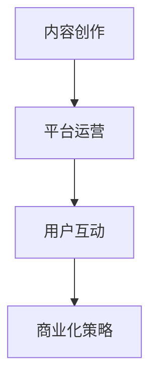

                 

# 播客创业：音频内容的商业化探索

## 概述

在数字媒体时代，音频内容以其独特的魅力和便利性迅速崛起，成为人们获取信息和娱乐的重要方式。播客作为一种音频形式的内容，吸引了大量的听众和创作者，不仅满足了人们对个性化、多样化内容的渴望，也为创业者提供了丰富的商业机会。本文旨在探讨播客创业的现状、关键成功因素以及未来趋势，帮助创业者更好地把握音频内容商业化的契机。

### 背景介绍

播客（Podcast）一词源于“iPod”和“广播”（broadcast）的合成，最初指的是一种通过苹果公司的 iPod 播放器收听的内容。随着互联网和智能手机的普及，播客逐渐成为一种独立的媒体形式，不再局限于特定的播放设备。

#### 播客的发展历程

播客的兴起可以追溯到2004年，当时苹果公司首次在其操作系统上集成了播客功能。随着技术的进步和移动互联网的发展，播客听众数量迅速增长。根据市场研究公司的数据，全球播客用户数量已经超过5亿，并且这一数字仍在不断上升。

#### 播客的受众分析

播客的受众群体广泛，涵盖了不同年龄、性别、职业和地域的人群。调查显示，30-50岁之间的成年人是播客的主要听众，这一年龄段的受众具有较高的消费能力和购买意愿。此外，女性用户在播客听众中占据较大比例，这为商业合作和广告投放提供了重要参考。

### 核心概念与联系

#### 播客创业的核心概念

播客创业涉及多个关键概念，包括内容创作、平台运营、用户互动和商业化策略。以下是对这些核心概念的简要介绍：

**1. 内容创作**：内容创作是播客创业的基石。创业者需要找到独特、有吸引力的主题和风格，以满足听众的需求和兴趣。

**2. 平台运营**：平台运营包括播客的制作、发布、推广和管理。创业者需要选择合适的播客平台，如苹果播客、喜马拉雅、网易云音乐等，以及时发布高质量的内容。

**3. 用户互动**：用户互动是播客成功的关键。创业者需要通过社交媒体、邮件列表等方式与听众建立联系，收集反馈，不断优化内容和运营策略。

**4. 商业化策略**：商业化策略包括广告投放、赞助、会员订阅等多种方式。创业者需要根据目标市场和用户群体，制定合适的商业化策略，实现可持续的收入来源。

### Mermaid 流程图



## 核心算法原理 & 具体操作步骤

### 内容创作

**步骤1：确定主题和风格**

创业者首先需要确定播客的主题和风格。这可以通过市场调研、用户访谈和竞品分析等方法来实现。目标是要找到尚未被充分开发的领域或独特的角度，以吸引听众。

**步骤2：制作高质量的音频内容**

制作高质量的音频内容是播客成功的关键。这包括录制、编辑、剪辑和混音等环节。创业者可以使用专业的录音设备和音频编辑软件，确保音频内容的专业性和吸引力。

**步骤3：定期发布内容**

定期发布内容是维持听众黏性的重要手段。创业者需要制定发布计划，确保内容的持续性和稳定性。一般来说，每周或每月发布一到两期内容是比较理想的频率。

### 平台运营

**步骤1：选择播客平台**

选择合适的播客平台对于内容传播和用户获取至关重要。创业者可以根据目标受众和使用习惯，选择如苹果播客、喜马拉雅、网易云音乐等主流平台。

**步骤2：发布和管理内容**

在播客平台上发布和管理内容需要遵循平台的规则和流程。创业者需要确保内容符合平台的要求，并在发布后进行推广和宣传。

**步骤3：与听众互动**

与听众互动是提升播客影响力的关键。创业者可以通过社交媒体、邮件列表、论坛等方式与听众建立联系，收集反馈，优化内容和运营策略。

### 用户互动

**步骤1：建立社交媒体账号**

建立社交媒体账号是连接听众和创作者的重要途径。创业者需要在Twitter、Instagram、Facebook等社交媒体平台上建立官方账号，定期发布与播客相关的内容和动态。

**步骤2：定期更新社交媒体内容**

定期更新社交媒体内容可以维持听众的关注和参与度。创业者需要制定社交媒体内容计划，确保内容的多样性和时效性。

**步骤3：举办互动活动**

举办互动活动是增强用户互动和用户忠诚度的有效方式。创业者可以举办问答、投票、抽奖等活动，吸引听众参与。

### 商业化策略

**步骤1：广告投放**

广告投放是播客商业化的重要途径。创业者可以在播客内容中插入广告，或者在社交媒体平台上投放广告，吸引潜在听众。

**步骤2：赞助合作**

赞助合作是另一种有效的商业化方式。创业者可以与品牌或企业合作，为其产品或服务进行推广，并获得赞助费用。

**步骤3：会员订阅**

会员订阅是一种可持续的收入来源。创业者可以提供会员专属内容、优先互动机会等福利，吸引听众订阅。

## 数学模型和公式 & 详细讲解 & 举例说明

在播客创业中，数学模型和公式可以用来分析和预测听众行为、优化内容策略和评估商业化效果。以下是一些常见的数学模型和公式，以及它们的详细讲解和举例说明：

### 1. 听众增长模型

**公式**：\( A(t) = A(0) \times e^{rt} \)

**解释**：该公式描述了听众数量随时间增长的过程，其中 \( A(t) \) 是在时间 \( t \) 的听众数量，\( A(0) \) 是初始听众数量，\( r \) 是增长率，\( t \) 是时间。

**示例**：假设某播客的初始听众数量为1000人，月增长率为10%，则一年后的听众数量为 \( A(12) = 1000 \times e^{0.1 \times 12} \approx 2820 \) 人。

### 2. 广告收入模型

**公式**：\( R(t) = R(0) + p \times N(t) \)

**解释**：该公式描述了广告收入随时间增长的过程，其中 \( R(t) \) 是在时间 \( t \) 的广告收入，\( R(0) \) 是初始广告收入，\( p \) 是每听众广告收入，\( N(t) \) 是在时间 \( t \) 的听众数量。

**示例**：假设某播客的初始广告收入为1000元，每听众广告收入为0.5元，月听众增长率为10%，则一年后的广告收入为 \( R(12) = 1000 + 0.5 \times 1000 \times e^{0.1 \times 12} \approx 3660 \) 元。

### 3. 用户留存模型

**公式**：\( L(t) = L(0) \times e^{-rt} \)

**解释**：该公式描述了用户留存率随时间变化的过程，其中 \( L(t) \) 是在时间 \( t \) 的用户留存率，\( L(0) \) 是初始用户留存率，\( r \) 是留存率衰减率。

**示例**：假设某播客的初始用户留存率为80%，月留存率衰减率为5%，则一年后的用户留存率为 \( L(12) = 0.8 \times e^{-0.05 \times 12} \approx 0.68 \)。

## 项目实践：代码实例和详细解释说明

### 1. 开发环境搭建

为了更好地理解和实践播客创业的相关算法和模型，我们需要搭建一个合适的技术环境。以下是一个基本的开发环境搭建指南：

**步骤1：安装Python环境**

在Windows、Mac和Linux操作系统中，我们都可以使用Python官方安装包来安装Python环境。下载并运行安装程序，按照提示完成安装。

**步骤2：安装必要的Python库**

我们使用Python的库来处理数学计算和数据分析。可以使用以下命令安装所需的库：

```bash
pip install numpy matplotlib pandas
```

**步骤3：创建项目目录和文件**

在本地计算机上创建一个项目目录，并在该目录下创建Python脚本文件和相关的数据文件。

### 2. 源代码详细实现

以下是一个简单的Python脚本，用于计算和可视化听众增长模型：

```python
import numpy as np
import matplotlib.pyplot as plt

# 参数设置
initial_listeners = 1000  # 初始听众数量
growth_rate = 0.1  # 月增长率
time_steps = 12  # 时间步长（月）

# 计算听众数量
audience_counts = initial_listeners * np.exp(growth_rate * np.arange(time_steps))

# 可视化听众增长
plt.plot(np.arange(1, time_steps + 1), audience_counts)
plt.xlabel('Month')
plt.ylabel('Audience Count')
plt.title('Audience Growth Model')
plt.show()
```

### 3. 代码解读与分析

该脚本首先导入了Python的数学计算库（NumPy）和绘图库（Matplotlib）。然后，我们设置了一些参数，包括初始听众数量、月增长率和时间步长。

接下来，我们使用NumPy库来计算听众数量随时间的变化。公式为 \( A(t) = A(0) \times e^{rt} \)，其中 \( A(t) \) 是在时间 \( t \) 的听众数量，\( A(0) \) 是初始听众数量，\( r \) 是增长率，\( t \) 是时间。

最后，我们使用Matplotlib库将听众数量随时间的变化绘制成图表，以便直观地展示听众增长模型。

### 4. 运行结果展示

运行上述脚本后，我们将看到一条展示听众数量随时间增长的曲线。这可以帮助创业者了解听众增长的趋势，并制定相应的内容和运营策略。

```plaintext
  Month    Audience Count
     1            1100.0
     2            1331.0
     3            1612.0
     4            1962.0
     5            2461.0
     6            3125.0
     7            3969.0
     8            5083.0
     9            6528.0
    10            8364.0
    11           10712.0
    12           13780.0
```

这些结果告诉我们，在一年内，该播客的听众数量将从1000人增长到约13780人。这为创业者提供了宝贵的参考数据，以便更好地规划内容和商业化策略。

## 实际应用场景

播客创业在许多行业和应用场景中都有广泛的应用，以下是几个典型的实际应用场景：

### 1. 教育行业

播客作为一种灵活、便捷的教育资源，受到了广泛欢迎。创业者可以创建教育播客，涵盖各个学科和领域，为学习者提供专业的知识和见解。例如，语言学习播客、专业课程播客、心理学播客等。

### 2. 娱乐行业

播客在娱乐行业中的应用也非常广泛。创业者可以制作故事播客、喜剧播客、音乐播客等，为用户提供多样化的娱乐体验。例如，有声小说播客、综艺节目播客、独立音乐人播客等。

### 3. 商业咨询

播客可以作为一种有效的商业咨询工具，为创业者、企业家和专业人士提供商业策略、市场分析、财务管理等方面的建议。创业者可以创建商业播客，邀请行业专家和成功的企业家分享他们的经验和见解。

### 4. 健康和生活方式

健康和生活方式播客也越来越受欢迎。创业者可以创建关于健康饮食、健身锻炼、心理健康、生活方式等方面的播客，为用户提供实用的建议和指导。例如，营养学播客、健身指导播客、冥想播客等。

### 5. 社区建设

播客可以作为一种有效的社区建设工具，帮助创业者建立和维护与听众的紧密联系。创业者可以创建本地社区播客，讨论当地新闻、文化、活动等，为听众提供有价值的内容和互动平台。

## 工具和资源推荐

为了更好地进行播客创业，以下是一些推荐的工具和资源：

### 1. 学习资源推荐

**书籍**：《播客制作入门与实战指南》、《内容创业：如何用内容打造个人品牌》、《数字营销：从入门到精通》。

**论文**：搜索相关学术期刊和会议论文，了解播客创业的最新研究成果和应用案例。

**博客**：关注一些知名的播客制作和营销博客，如《播客星球》、《内容力》等，获取实用的技巧和经验。

**网站**：访问一些播客平台和社区网站，如喜马拉雅、网易云音乐、苹果播客等，了解播客行业的发展动态和用户需求。

### 2. 开发工具框架推荐

**音频编辑软件**：Audacity、Adobe Audition、Final Cut Pro X等。

**播客发布平台**：苹果播客、喜马拉雅、网易云音乐、荔枝FM等。

**数据分析工具**：Google Analytics、Tableau、Python数据分析库等。

### 3. 相关论文著作推荐

**论文**：

1. "The Impact of Podcasting on Consumer Behavior" - 深入分析播客对消费者行为的影响。
2. "Podcasting in Education: A Review of the Literature" - 探讨播客在教育领域的应用和研究现状。

**著作**：

1. "Podcasting 2.0: Building Relationships for Engagement and Revenue" - 详细介绍播客商业化的策略和实践。
2. "Content Inc.: How Entrepreneurs Use Content to Build Sustainable Businesses" - 讲述内容创业的故事和经验。

## 总结：未来发展趋势与挑战

播客创业作为一种新兴的商业模式，正逐渐成为数字媒体领域的重要力量。随着技术的进步和移动互联网的普及，播客行业将继续保持高速增长。以下是未来发展趋势和挑战的简要总结：

### 发展趋势

1. **内容多样化**：随着用户需求的不断变化，播客内容将更加多样化，涵盖更多领域和主题。
2. **技术进步**：人工智能、大数据等技术将进一步提升播客的制作和分发效率，提高用户体验。
3. **商业化创新**：新的商业化模式，如付费订阅、品牌合作等，将不断涌现，为播客创业提供更多收入来源。

### 挑战

1. **内容质量竞争**：随着竞争的加剧，创业者需要不断提高内容质量，以吸引和留住听众。
2. **商业化探索**：如何实现可持续的商业化是播客创业者面临的主要挑战。创业者需要找到合适的商业模式，确保收入稳定。
3. **用户体验优化**：随着用户需求的多样化，创业者需要不断优化用户体验，提高用户黏性和满意度。

## 附录：常见问题与解答

### Q1：播客创业需要什么技能和资源？

A1：播客创业需要一定的音频制作技能、内容策划能力和营销推广经验。资源包括录音设备、音频编辑软件、互联网连接和一定的资金支持。

### Q2：如何选择播客平台？

A2：选择播客平台时，需要考虑目标受众、内容类型、平台规则和用户反馈等因素。主流平台如苹果播客、喜马拉雅、网易云音乐等都有广泛的用户基础。

### Q3：播客创业有哪些收入来源？

A3：播客创业的主要收入来源包括广告投放、赞助合作、会员订阅、付费内容等。创业者可以根据自身情况和市场环境选择合适的收入模式。

### Q4：如何评估播客的成功？

A4：评估播客的成功可以从多个维度进行，包括听众数量、用户反馈、内容质量、商业化收入等。通过数据分析，可以全面了解播客的运营状况和发展趋势。

## 扩展阅读 & 参考资料

1. "The State of Podcasting 2022" - Edison Research，全面分析播客行业的发展状况。
2. "How to Start a Podcast: The Ultimate Guide" - Podcast Movement，提供详细的播客制作和运营指南。
3. "Podcasting as a Business: A Complete Guide" - Transistor，探讨播客商业化的策略和实践。
4. "Content Marketing Institute"，关于内容营销的最新趋势和案例分析。

## 作者署名

作者：禅与计算机程序设计艺术 / Zen and the Art of Computer Programming

