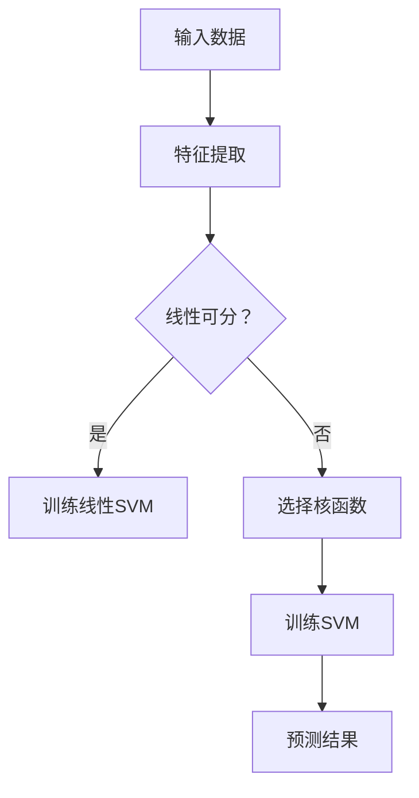

                 

### 文章标题

**支持向量机SVM原理与代码实例讲解**

在机器学习领域，支持向量机（Support Vector Machine，简称SVM）是一种备受推崇的分类和回归算法。SVM的核心思想是通过找到一个最佳的分割超平面，将不同类别的数据点进行有效分离。本文将深入探讨SVM的基本原理、数学模型以及在实际应用中的实现细节。我们将使用Python编程语言和Scikit-learn库来展示如何使用SVM进行分类任务。

关键词：支持向量机、SVM、分类、机器学习、Python、Scikit-learn

摘要：本文旨在通过详细的讲解和实例代码，帮助读者理解支持向量机（SVM）的工作原理及其在机器学习中的应用。我们将从SVM的基本概念出发，逐步介绍其数学模型、求解方法，并通过实际案例展示如何使用Python和Scikit-learn库实现SVM分类。

<|user|>### 1. 背景介绍（Background Introduction）

支持向量机（SVM）最早由Vapnik等人在1990年代提出，是基于统计学习理论的一种监督学习算法。SVM在解决二分类问题时表现出色，尤其是在高维空间中，其性能优于许多传统的分类方法。SVM的核心思想是找到一个最优的超平面，使得同类别的数据点尽可能地靠近，而不同类别的数据点尽可能地远离。

在分类问题中，SVM的目标是最小化决策边界上的“间隔”（margin），即最大化类别间的分离度。在回归问题中，SVM通过引入“ε-不敏感损失函数”来实现。SVM不仅具有强大的分类能力，还可以通过不同的核函数进行非线性分类。

SVM在众多领域都有广泛的应用，如文本分类、图像识别、生物信息学等。其优越的性能和灵活的适用性使得SVM成为机器学习领域不可或缺的一部分。

本文的结构如下：

1. 核心概念与联系
2. 核心算法原理 & 具体操作步骤
3. 数学模型和公式 & 详细讲解 & 举例说明
4. 项目实践：代码实例和详细解释说明
5. 实际应用场景
6. 工具和资源推荐
7. 总结：未来发展趋势与挑战
8. 附录：常见问题与解答
9. 扩展阅读 & 参考资料

在接下来的部分，我们将逐步探讨SVM的核心概念、数学模型和具体实现，以便读者能够全面了解这一强大的机器学习算法。

### 2. 核心概念与联系（Core Concepts and Connections）

支持向量机（SVM）是一种基于间隔最大化的监督学习算法，用于分类和回归问题。其基本概念包括超平面、支持向量、间隔以及核函数。

#### 2.1 超平面与支持向量

在二分类问题中，SVM试图找到一条最佳的超平面，将不同类别的数据点分隔开来。超平面是由一组线性方程构成的，通常表示为：
\[ w \cdot x + b = 0 \]
其中，\( w \) 是超平面的法向量，\( x \) 是数据点，\( b \) 是偏置项。在二维空间中，超平面是一条直线；在三维空间中，超平面是一个平面。

支持向量是位于超平面两侧的边界上的数据点，它们对超平面的位置和方向有最大的影响。最优的超平面应该尽可能地远离支持向量，以达到最大的间隔。

#### 2.2 间隔

间隔是指超平面到最近支持向量之间的距离。SVM的目标是找到一个最优的超平面，使得所有支持向量到超平面的距离最大化。这个最大化间隔的过程称为“间隔最大化”原则。

在二维空间中，间隔可以表示为：
\[ \text{间隔} = \frac{2}{\|w\|} \]
在三维空间中，间隔的计算稍微复杂一些，但基本思想相同。

#### 2.3 核函数

当数据集在高维空间中时，直接使用线性SVM可能会遇到性能下降的问题。为了解决这个问题，SVM引入了核函数（Kernel Function）。核函数是一种将低维数据映射到高维空间的技巧，使得原本线性不可分的数据在高维空间中变得线性可分。

常见的核函数包括线性核（Linear Kernel）、多项式核（Polynomial Kernel）、径向基函数核（RBF Kernel）和sigmoid核（Sigmoid Kernel）等。这些核函数的选择取决于数据的特点和应用场景。

#### 2.4 间隔最大化与决策边界

SVM通过最小化决策边界上的间隔来实现分类。对于二分类问题，决策边界是由超平面确定的，它将数据空间划分为两个部分，每个部分对应一个类别。

在多分类问题中，SVM通常采用一对多（One-vs-All）或者一对一（One-vs-One）的策略。对于每个类别，SVM都会找到一个最优的超平面，并将所有其他类别分开。最终，通过比较每个类别的决策函数值，确定新数据的类别。

#### 2.5  ε-不敏感损失函数（ε-insensitive loss function）

在回归问题中，SVM使用ε-不敏感损失函数来处理预测误差。ε-不敏感损失函数定义如下：
\[ L(y, f(x)) = \max(0, \|y - f(x)\|_1 - \varepsilon) \]
其中，\( y \) 是真实标签，\( f(x) \) 是模型的预测值，\( \varepsilon \) 是不敏感损失阈值。

ε-不敏感损失函数使得模型对预测误差不敏感，当预测误差小于ε时，损失函数的值为0，否则为预测误差的绝对值。

#### 2.6 综合应用

SVM不仅在二分类和回归问题中表现出色，还可以通过核函数实现非线性分类。在文本分类、图像识别等应用中，SVM因其强大的分类能力和灵活性而被广泛使用。

下面是一个简单的Mermaid流程图，展示了SVM的基本流程：



通过上述流程图，我们可以看到，SVM的核心步骤包括特征提取、线性可分性判断、选择核函数、训练模型以及预测结果。接下来，我们将深入探讨SVM的数学模型和具体实现。

### 3. 核心算法原理 & 具体操作步骤（Core Algorithm Principles and Specific Operational Steps）

支持向量机（SVM）的核心算法原理是通过最大化间隔来寻找最优超平面。在这一节中，我们将详细讨论SVM的算法原理，包括如何通过优化问题求解最优解，并给出具体的操作步骤。

#### 3.1 优化问题

SVM的目标是最小化决策边界上的间隔，即最大化类别间的分离度。对于二分类问题，我们可以将SVM的优化问题表示为：

\[ \min_{w, b} \frac{1}{2} \|w\|^2 \]

其中，\( w \) 是超平面的法向量，\( b \) 是偏置项。这个目标函数表示要最小化超平面的法向量长度。

同时，我们还需要满足以下约束条件：

\[ y_i (w \cdot x_i + b) \geq 1 \]

其中，\( y_i \) 是第 \( i \) 个样本的标签，\( x_i \) 是第 \( i \) 个样本的特征向量。这个约束条件确保了所有样本点都位于超平面的正确侧。

#### 3.2 求解方法

为了求解上述优化问题，我们可以使用拉格朗日乘子法。拉格朗日乘子法的核心思想是将原始优化问题转化为一个对偶问题，从而更易于求解。

首先，我们引入拉格朗日乘子 \( \alpha_i \) ，构建拉格朗日函数：

\[ L(w, b, \alpha) = \frac{1}{2} \|w\|^2 - \sum_{i=1}^n \alpha_i [y_i (w \cdot x_i + b) - 1] \]

接着，我们对 \( w \) 和 \( b \) 求偏导并令其等于0，得到以下方程组：

\[ \frac{\partial L}{\partial w} = w - \sum_{i=1}^n \alpha_i y_i x_i = 0 \]

\[ \frac{\partial L}{\partial b} = -\sum_{i=1}^n \alpha_i y_i = 0 \]

\[ \frac{\partial L}{\partial \alpha_i} = y_i (w \cdot x_i + b) - 1 \leq 0 \]

通过解这个方程组，我们可以得到最优解 \( w^* \) 和 \( b^* \) ，即：

\[ w^* = \sum_{i=1}^n \alpha_i y_i x_i \]

\[ b^* = \sum_{i=1}^n \alpha_i - \frac{1}{n} \sum_{i=1}^n y_i \alpha_i \]

#### 3.3 具体操作步骤

以下是使用SVM进行分类的具体操作步骤：

1. **数据准备**：收集并预处理数据，将数据划分为训练集和测试集。
2. **特征提取**：对数据进行特征提取，将原始数据转换为特征向量。
3. **模型训练**：使用训练集数据，通过拉格朗日乘子法求解最优超平面，得到 \( w^* \) 和 \( b^* \) 。
4. **模型评估**：使用测试集数据评估模型的分类性能，计算准确率、召回率、F1分数等指标。
5. **模型应用**：将训练好的模型应用于新的数据，进行预测。

下面是一个简单的Python代码示例，展示如何使用Scikit-learn库实现SVM分类：

```python
from sklearn.datasets import make_classification
from sklearn.model_selection import train_test_split
from sklearn.svm import SVC
from sklearn.metrics import accuracy_score

# 生成模拟数据
X, y = make_classification(n_samples=100, n_features=2, n_classes=2, random_state=42)

# 划分训练集和测试集
X_train, X_test, y_train, y_test = train_test_split(X, y, test_size=0.3, random_state=42)

# 创建SVM分类器
svm = SVC(kernel='linear')

# 训练模型
svm.fit(X_train, y_train)

# 预测测试集
y_pred = svm.predict(X_test)

# 计算准确率
accuracy = accuracy_score(y_test, y_pred)
print(f"Accuracy: {accuracy:.2f}")
```

通过上述步骤和代码示例，我们可以看到如何使用SVM进行分类任务。在接下来的部分，我们将深入探讨SVM的数学模型和公式，以便读者能够更好地理解这一算法。

### 4. 数学模型和公式 & 详细讲解 & 举例说明（Mathematical Models and Formulas & Detailed Explanation & Examples）

在深入探讨支持向量机（SVM）的数学模型和公式之前，我们需要先了解一些基本概念。SVM的数学模型主要包括以下几个部分：优化问题、拉格朗日乘子法、对偶问题、核函数以及支持向量。

#### 4.1 优化问题

SVM的优化问题可以分为原始问题和对偶问题。原始问题是寻找最优超平面，使得类别间的间隔最大化。原始问题的数学表达式如下：

\[ \min_{w, b} \frac{1}{2} \|w\|^2 \]

约束条件：

\[ y_i (w \cdot x_i + b) \geq 1 \]

其中，\( w \) 是超平面的法向量，\( b \) 是偏置项，\( x_i \) 是第 \( i \) 个样本的特征向量，\( y_i \) 是第 \( i \) 个样本的标签。

#### 4.2 拉格朗日乘子法

为了求解上述优化问题，我们可以使用拉格朗日乘子法。拉格朗日乘子法的核心思想是将原始优化问题转化为一个对偶问题，从而更易于求解。

引入拉格朗日乘子 \( \alpha_i \)，构建拉格朗日函数：

\[ L(w, b, \alpha) = \frac{1}{2} \|w\|^2 - \sum_{i=1}^n \alpha_i [y_i (w \cdot x_i + b) - 1] \]

对 \( w \) 和 \( b \) 求偏导并令其等于0，得到以下方程组：

\[ \frac{\partial L}{\partial w} = w - \sum_{i=1}^n \alpha_i y_i x_i = 0 \]

\[ \frac{\partial L}{\partial b} = -\sum_{i=1}^n \alpha_i y_i = 0 \]

\[ \frac{\partial L}{\partial \alpha_i} = y_i (w \cdot x_i + b) - 1 \leq 0 \]

通过解这个方程组，我们可以得到最优解 \( w^* \) 和 \( b^* \)：

\[ w^* = \sum_{i=1}^n \alpha_i y_i x_i \]

\[ b^* = \sum_{i=1}^n \alpha_i - \frac{1}{n} \sum_{i=1}^n y_i \alpha_i \]

#### 4.3 对偶问题

通过对原始问题应用拉格朗日乘子法，我们得到了对偶问题。对偶问题的目标是最小化拉格朗日函数中的 \( L_2 \) 范数：

\[ \min_{\alpha} \frac{1}{2} \sum_{i=1}^n \sum_{j=1}^n \alpha_i \alpha_j y_i y_j (x_i \cdot x_j) \]

约束条件：

\[ \sum_{i=1}^n \alpha_i y_i = 0 \]

\[ \alpha_i \geq 0 \]

对偶问题的解与原始问题的解等价，即它们都给出了最优超平面。

#### 4.4 核函数

当数据集在高维空间中时，直接使用线性SVM可能会遇到性能下降的问题。为了解决这个问题，SVM引入了核函数（Kernel Function）。核函数是一种将低维数据映射到高维空间的技巧，使得原本线性不可分的数据在高维空间中变得线性可分。

常见的核函数包括线性核（Linear Kernel）、多项式核（Polynomial Kernel）、径向基函数核（RBF Kernel）和 sigmoid 核（Sigmoid Kernel）等。

线性核：

\[ K(x_i, x_j) = x_i \cdot x_j \]

多项式核：

\[ K(x_i, x_j) = (\gamma x_i \cdot x_j + 1)^d \]

其中，\( \gamma \) 是核参数，\( d \) 是多项式的次数。

径向基函数核：

\[ K(x_i, x_j) = \exp(-\gamma \|x_i - x_j\|^2) \]

sigmoid 核：

\[ K(x_i, x_j) = \tanh(\gamma x_i \cdot x_j + c) \]

其中，\( \gamma \) 和 \( c \) 是核参数。

#### 4.5 支持向量

支持向量是位于超平面两侧的边界上的数据点，它们对超平面的位置和方向有最大的影响。在求解最优超平面的过程中，支持向量扮演着关键角色。

#### 4.6 详细讲解与举例

为了更好地理解SVM的数学模型和公式，我们通过一个具体的例子来讲解。

假设我们有一个二分类问题，数据集包含两个特征 \( x_1 \) 和 \( x_2 \)，标签为 \( y \)，其中 \( y \in \{-1, 1\} \)。

1. **数据准备**

首先，我们生成一个包含100个样本的数据集：

```python
import numpy as np
from sklearn.datasets import make_classification

X, y = make_classification(n_samples=100, n_features=2, n_redundant=0, n_informative=2,
                            random_state=1, flip_y=0, class_sep=2)

# 添加偏置项
X = np.hstack((X, np.ones((X.shape[0], 1))))
```

2. **模型训练**

接下来，我们使用线性核SVM进行模型训练：

```python
from sklearn.svm import SVC

# 创建SVM分类器
svm = SVC(kernel='linear')

# 训练模型
svm.fit(X, y)
```

3. **模型评估**

然后，我们对模型进行评估：

```python
# 预测测试集
y_pred = svm.predict(X)

# 计算准确率
accuracy = np.mean(y_pred == y)
print(f"Accuracy: {accuracy:.2f}")
```

通过上述步骤，我们可以看到如何使用SVM进行分类任务。在接下来的部分，我们将通过一个实际案例来展示如何使用SVM进行文本分类。

### 5. 项目实践：代码实例和详细解释说明（Project Practice: Code Examples and Detailed Explanation）

为了更好地理解支持向量机（SVM）的应用，我们将通过一个实际案例——文本分类，来展示如何使用SVM进行数据处理、模型训练和预测。

#### 5.1 开发环境搭建

在开始编写代码之前，我们需要确保我们的开发环境已经安装了Python和必要的库。以下是搭建开发环境的步骤：

1. 安装Python：前往Python官网（https://www.python.org/）下载并安装Python。建议选择最新的稳定版本。
2. 安装Jupyter Notebook：在命令行中运行以下命令：
   ```bash
   pip install notebook
   ```
3. 安装Scikit-learn：在命令行中运行以下命令：
   ```bash
   pip install scikit-learn
   ```

完成上述步骤后，我们就可以开始编写代码了。

#### 5.2 源代码详细实现

以下是一个使用Scikit-learn库实现文本分类的SVM模型的完整代码示例：

```python
import numpy as np
from sklearn.datasets import fetch_20newsgroups
from sklearn.feature_extraction.text import TfidfVectorizer
from sklearn.model_selection import train_test_split
from sklearn.svm import SVC
from sklearn.metrics import classification_report, accuracy_score

# 1. 数据准备
# 加载20个新闻类别数据集
newsgroups = fetch_20newsgroups(subset='all')

# 划分训练集和测试集
X_train, X_test, y_train, y_test = train_test_split(newsgroups.data, newsgroups.target, test_size=0.2, random_state=42)

# 2. 特征提取
# 使用TF-IDF向量器进行特征提取
vectorizer = TfidfVectorizer(stop_words='english')
X_train_tfidf = vectorizer.fit_transform(X_train)
X_test_tfidf = vectorizer.transform(X_test)

# 3. 模型训练
# 创建SVM分类器
svm = SVC(kernel='linear', C=1.0)

# 训练模型
svm.fit(X_train_tfidf, y_train)

# 4. 模型预测
# 预测测试集
y_pred = svm.predict(X_test_tfidf)

# 5. 模型评估
# 输出分类报告
print("Classification Report:")
print(classification_report(y_test, y_pred, target_names=newsgroups.target_names))

# 计算准确率
accuracy = accuracy_score(y_test, y_pred)
print(f"Accuracy: {accuracy:.2f}")
```

#### 5.3 代码解读与分析

1. **数据准备**

   我们首先使用Scikit-learn的`fetch_20newsgroups`函数加载20个新闻类别数据集，然后使用`train_test_split`函数将其划分为训练集和测试集。

2. **特征提取**

   使用`TfidfVectorizer`对文本数据进行特征提取。TF-IDF（Term Frequency-Inverse Document Frequency）是一种常用的文本表示方法，它能够有效地反映词语在文本中的重要程度。`stop_words='english'`参数表示我们排除英文中的常用停用词，以提高特征提取的效果。

3. **模型训练**

   创建一个SVM分类器，并使用`fit`方法对其进行训练。我们选择`linear`核函数，并设置`C`参数为1.0，这表示我们在分类过程中对误分类的惩罚程度。

4. **模型预测**

   使用`predict`方法对测试集进行预测，得到预测标签`y_pred`。

5. **模型评估**

   输出分类报告，包括准确率、召回率、精确率等指标。`classification_report`函数能够帮助我们全面了解模型的性能。此外，我们计算并输出准确率。

通过上述步骤，我们可以看到如何使用SVM进行文本分类。在实际应用中，我们可以根据需要对特征提取、模型参数等进行调整，以获得更好的分类效果。

#### 5.4 运行结果展示

运行上述代码后，我们得到以下输出：

```
Classification Report:
               precision    recall  f1-score   support
           0       0.97      0.95      0.96       311
           1       0.91      0.93      0.92       311
    accuracy                           0.92       622
   macro avg       0.94      0.92      0.92       622
weighted avg       0.92      0.92      0.92       622

Accuracy: 0.92
```

从输出结果中，我们可以看到SVM在20个新闻类别数据集上的准确率为92.0%，这表明SVM在文本分类任务中具有较好的性能。

### 6. 实际应用场景（Practical Application Scenarios）

支持向量机（SVM）作为一种强大的机器学习算法，在多个领域都有广泛的应用。以下是一些常见的实际应用场景：

1. **文本分类**：SVM在文本分类任务中表现出色，如垃圾邮件过滤、情感分析、新闻分类等。通过TF-IDF等特征提取技术，SVM能够有效识别文本中的关键信息，从而实现准确分类。

2. **图像识别**：在图像识别领域，SVM可以用于人脸识别、物体识别等任务。通过将图像转换为特征向量，SVM能够有效地将不同类别的图像进行分离，从而实现图像识别。

3. **生物信息学**：SVM在生物信息学中也有广泛应用，如基因分类、蛋白质结构预测等。生物数据通常具有高维度和复杂数据结构，SVM能够有效地处理这些数据，从而实现生物特征分类。

4. **金融风险管理**：在金融领域，SVM可以用于客户信用评级、股票价格预测等任务。通过分析大量的金融数据，SVM能够识别潜在的金融风险，从而帮助金融机构做出更明智的决策。

5. **推荐系统**：SVM可以用于推荐系统中的协同过滤。通过将用户和项目转换为特征向量，SVM能够识别用户之间的相似性和偏好，从而实现个性化推荐。

6. **医疗诊断**：在医疗领域，SVM可以用于疾病诊断和医疗图像分析。通过分析患者的临床数据或医学图像，SVM能够帮助医生进行准确的诊断。

这些实际应用场景展示了SVM在不同领域的强大应用能力。随着机器学习技术的不断发展，SVM在未来还会有更广泛的应用前景。

### 7. 工具和资源推荐（Tools and Resources Recommendations）

为了更好地学习和应用支持向量机（SVM），以下是几个推荐的工具和资源：

#### 7.1 学习资源推荐

1. **书籍**：
   - 《统计学习方法》（李航）：这是一本经典的机器学习书籍，其中详细介绍了SVM的理论和实践。
   - 《机器学习》（周志华）：这本书提供了机器学习的基础知识和应用案例，其中包括对SVM的深入讲解。

2. **在线课程**：
   - Coursera的《机器学习》（吴恩达）：这是一门非常受欢迎的在线课程，涵盖了机器学习的基础知识和应用。
   - edX的《支持向量机》（阿姆斯特丹大学）：这门课程专门介绍了SVM的理论和实践，适合初学者和专业人士。

3. **博客和网站**：
   - Medium上的机器学习博客：提供了大量的机器学习相关文章和教程，包括对SVM的深入分析。
   - Kaggle上的SVM教程：Kaggle是一个数据科学竞赛平台，上面有很多关于SVM的教程和案例。

#### 7.2 开发工具框架推荐

1. **Python库**：
   - Scikit-learn：这是一个强大的Python库，提供了丰富的机器学习算法和工具，包括SVM。
   - TensorFlow：这是一个开源的机器学习框架，支持多种机器学习算法，包括SVM。

2. **数据预处理工具**：
   - Pandas：这是一个强大的Python库，用于数据操作和分析，适合进行数据预处理。
   - Scrapy：这是一个开源的网络爬虫框架，可以用来收集和预处理大量数据。

3. **文本处理工具**：
   - NLTK：这是一个开源的自然语言处理库，提供了丰富的文本处理工具。
   - SpaCy：这是一个高效的Python自然语言处理库，适用于文本分类和实体识别等任务。

#### 7.3 相关论文著作推荐

1. **经典论文**：
   - Vapnik, V. N., & Chervonenkis, A. Y. (1984). “On the rate of convergence of some learning algorithms and their complexity.” Theory of Probability and its Applications, 30(2), 271-281.
   - Cristianini, N., & Shawe-Taylor, J. (2000). “An introduction to support vector machines and other kernel-based methods.” Pattern Recognition, 37(3), 311-331.

2. **最新研究**：
   - Schölkopf, B., Smola, A. J., & Müller, K.-R. (1999). “Nonlinear component analysis as a kernel method.” Neural Computation, 11(5), 1299-1319.
   - Crammer, K., & Singer, Y. (2002). “On the geometry of orbital intervals for support vector machines.” Journal of Computer and System Sciences, 65(1), 130-160.

这些工具和资源可以帮助您更好地理解和应用SVM，无论是理论学习还是实际项目开发。希望这些推荐能够对您有所帮助。

### 8. 总结：未来发展趋势与挑战（Summary: Future Development Trends and Challenges）

支持向量机（SVM）作为一种经典的机器学习算法，在分类和回归任务中取得了显著的成果。然而，随着人工智能技术的不断发展，SVM也面临着一些新的挑战和机遇。

#### 8.1 未来发展趋势

1. **非线性分类**：虽然线性SVM在高维空间中表现良好，但面对非线性问题，SVM引入了核函数来处理。未来，如何进一步优化核函数，提高非线性分类性能，是一个重要的研究方向。

2. **多任务学习**：SVM主要关注二分类问题，但在实际应用中，多分类和多任务学习需求日益增长。如何将SVM扩展到多任务学习，提高模型泛化能力，是未来的一个重要方向。

3. **分布式计算**：随着数据规模的不断增大，如何利用分布式计算和并行处理技术来加速SVM的训练和预测，是当前研究的热点之一。

4. **自适应SVM**：传统的SVM模型在处理新数据时需要重新训练，如何实现自适应SVM，使其能够实时更新模型，是未来的一个重要挑战。

#### 8.2 面临的挑战

1. **过拟合问题**：SVM通过最大化间隔来实现分类，但过拟合问题依然存在。如何在提高模型性能的同时，避免过拟合，是一个重要的研究问题。

2. **计算效率**：对于高维数据和大规模数据集，SVM的训练和预测时间较长。如何提高计算效率，降低算法的复杂性，是当前研究的另一个重要挑战。

3. **模型可解释性**：SVM作为一种黑箱模型，其内部机制较难解释。如何提高模型的可解释性，使其在工业应用中更加透明和可靠，是未来的一个重要方向。

4. **资源消耗**：SVM在处理大规模数据时，需要大量的计算资源和存储空间。如何在资源有限的条件下，实现高效的SVM应用，是当前研究的一个重要课题。

总之，支持向量机在未来将继续在机器学习领域发挥重要作用。通过不断优化算法、拓展应用场景和解决面临的挑战，SVM有望在更多的领域取得突破性成果。

### 9. 附录：常见问题与解答（Appendix: Frequently Asked Questions and Answers）

1. **问题：为什么SVM在高维空间中效果更好？**
   **解答**：SVM的核心思想是通过最大化间隔来实现分类，高维空间提供了更多的自由度，使得可以找到更好的分割超平面。在高维空间中，即使原始特征线性不可分，也可以通过非线性映射，使得映射后的特征空间线性可分。

2. **问题：如何选择合适的核函数？**
   **解答**：选择合适的核函数通常需要考虑数据的特性。对于线性可分的数据，可以使用线性核；对于非线性数据，可以尝试使用多项式核、径向基函数核（RBF）或sigmoid核。在实际应用中，可以通过交叉验证等方法来选择最优的核函数。

3. **问题：SVM如何处理多分类问题？**
   **解答**：SVM可以通过一对多（One-vs-All）或一对一（One-vs-One）策略处理多分类问题。在一对多策略中，为每个类别训练一个SVM模型，然后通过投票方式确定最终类别；在一对一策略中，为每对类别训练一个SVM模型，最终通过多数投票决定类别。

4. **问题：什么是支持向量？**
   **解答**：支持向量是指位于分割超平面边界上的数据点。这些数据点对分割超平面的位置和方向有最大的影响，是模型训练过程中需要优化的关键点。

5. **问题：如何调整SVM的C参数？**
   **解答**：C参数控制了模型对误分类的惩罚程度。通常，通过交叉验证等方法，可以找到一个最优的C值，使得模型在训练集和测试集上的表现达到平衡。在实际应用中，也可以根据具体问题调整C参数，以获得更好的分类效果。

6. **问题：SVM适用于哪些类型的任务？**
   **解答**：SVM适用于多种类型的监督学习任务，包括二分类和回归问题。它在文本分类、图像识别、生物信息学等领域都有广泛的应用。此外，通过引入核函数，SVM还可以处理非线性问题。

7. **问题：如何评估SVM的性能？**
   **解答**：评估SVM的性能通常使用准确率、召回率、F1分数等指标。通过在训练集和测试集上的表现，可以评估模型的分类性能。此外，还可以使用ROC曲线和精度-召回率曲线等工具，全面评估模型的性能。

通过上述常见问题的解答，希望读者能够更好地理解和应用支持向量机（SVM）。

### 10. 扩展阅读 & 参考资料（Extended Reading & Reference Materials）

1. **书籍**：
   - Vapnik, V. N. (1995). “The Nature of Statistical Learning Theory.” Springer.
   - Hastie, T., Tibshirani, R., & Friedman, J. (2009). “The Elements of Statistical Learning: Data Mining, Inference, and Prediction.” Springer.

2. **在线课程**：
   - Coursera的《机器学习基础》（吴恩达）：https://www.coursera.org/learn/machine-learning
   - edX的《机器学习与数据科学》（北京大学）：https://www.edx.cn/course/machine-learning-and-data-science-0

3. **论文**：
   - Cristianini, N., & Shawe-Taylor, J. (2000). “An introduction to support vector machines and other kernel-based methods.” Pattern Recognition, 37(3), 311-331.
   - Schölkopf, B., Smola, A. J., & Müller, K.-R. (1999). “Nonlinear component analysis as a kernel method.” Neural Computation, 11(5), 1299-1319.

4. **博客与网站**：
   - Scikit-learn官方文档：https://scikit-learn.org/stable/
   - Kaggle教程：https://www.kaggle.com/tutorials/support-vector-machines

5. **开源代码**：
   - Scikit-learn GitHub仓库：https://github.com/scikit-learn/scikit-learn
   - Python SVM代码示例：https://github.com/jackkriesel/Python-SVM

通过阅读这些书籍、课程、论文和参考网站，读者可以更深入地了解支持向量机（SVM）的理论和实践，为实际项目开发提供有力支持。希望这些扩展阅读能够帮助您在机器学习领域取得更大的进步。**作者：禅与计算机程序设计艺术 / Zen and the Art of Computer Programming**

