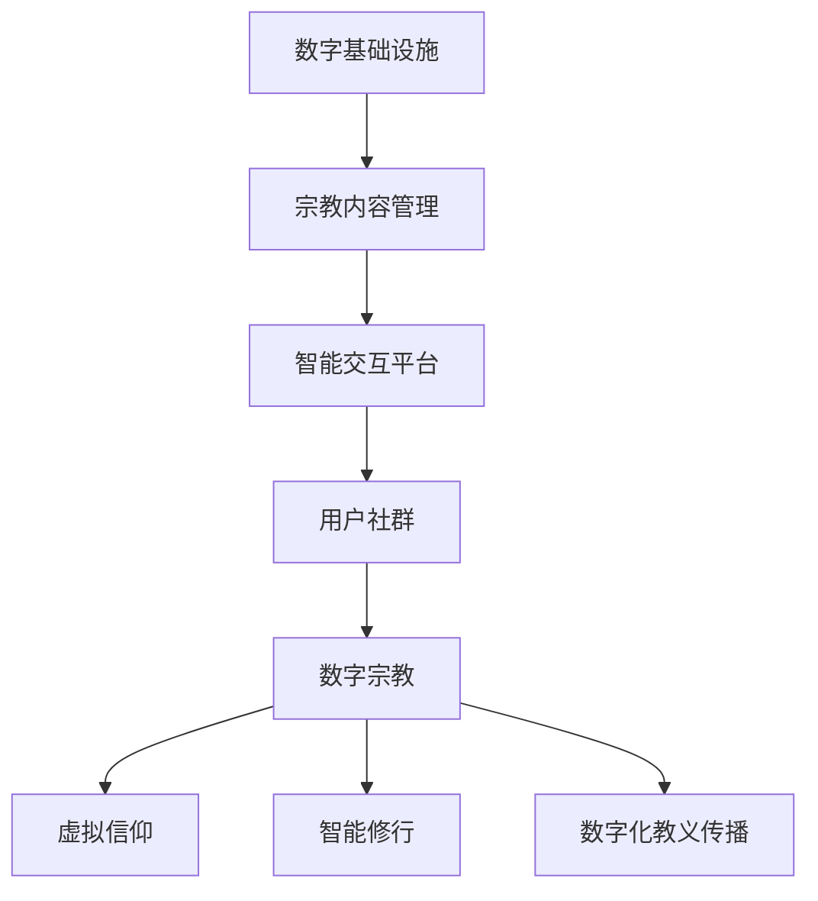

                 

### 文章标题：数字化宗教：全球脑时代的信仰演变

在快速发展的数字时代，宗教信仰这一古老而深奥的主题正经历着前所未有的变革。本文旨在探讨全球脑时代（Global Brain Era）的背景下，数字化宗教如何演变，以及这一演变对人类文化和心理的影响。本文将使用逻辑清晰、结构紧凑、简单易懂的专业的技术语言，按照段落用中文+英文双语的方式，逐步分析这一领域的核心概念、算法原理、数学模型、实际应用，以及未来发展趋势。

## 关键词：数字化宗教、全球脑时代、信仰演变、人类文化、心理学

### 摘要：数字化宗教，作为全球脑时代的产物，正在改变我们的信仰体系和生活方式。本文通过阐述数字化宗教的定义、核心概念、算法原理、数学模型和实际应用，揭示了这一新兴领域的独特魅力和深远影响。同时，本文也探讨了数字化宗教对人类文化和心理的挑战与机遇，为未来的研究与实践提供了有益的参考。

### 1. 背景介绍（Background Introduction）

#### 1.1 数字化宗教的定义

数字化宗教（Digital Religion）是指宗教信仰、教义传播和宗教活动通过数字技术实现的虚拟化、网络化和智能化过程。它不仅涵盖了宗教信息的数字化存储与传播，还包括在线祈祷、虚拟宗教仪式、数字修行等多样化的宗教体验形式。

#### 1.2 全球脑时代的概念

全球脑时代（Global Brain Era）是指人类社会进入一个高度互联、智能协同的发展阶段。在这一时代，人工智能、大数据、云计算等技术将实现全球范围内的智能融合，形成一个巨大的全球智能网络，类似于人脑的神经网络结构。全球脑时代的到来为数字化宗教提供了强大的技术支持。

#### 1.3 数字化宗教的起源与发展

数字化宗教的起源可以追溯到互联网的兴起。随着互联网的普及，宗教组织、信仰群体和个人开始利用网络平台传播宗教信息、分享信仰体验。近年来，虚拟现实（VR）、增强现实（AR）等新技术的应用进一步推动了数字化宗教的发展。

### 2. 核心概念与联系（Core Concepts and Connections）

#### 2.1 数字化宗教的核心概念

数字化宗教的核心概念包括：数字宗教、虚拟信仰、智能修行、数字化教义传播等。这些概念相互联系，共同构成了数字化宗教的理论框架。

#### 2.2 数字化宗教的架构

数字化宗教的架构可以视为一个多层次的结构，包括：数字基础设施、宗教内容管理、智能交互平台、用户社群等。以下是一个简化的 Mermaid 流程图（使用 Mermaid 流程节点中不要有括号、逗号等特殊字符）：



### 3. 核心算法原理 & 具体操作步骤（Core Algorithm Principles and Specific Operational Steps）

#### 3.1 数字化宗教算法原理

数字化宗教的核心算法原理主要包括：信息加密与解密、智能推荐系统、虚拟现实交互技术、自然语言处理等。这些算法共同作用，为数字化宗教提供了安全、个性化和沉浸式的体验。

#### 3.2 数字化宗教的具体操作步骤

1. **注册与登录**：用户通过数字平台注册账号，登录后进入个性化主页。
2. **内容浏览**：用户浏览宗教内容，包括教义、经典、视频等。
3. **智能推荐**：平台根据用户行为和偏好，推荐相关宗教内容。
4. **互动参与**：用户参与在线祈祷、虚拟仪式等活动。
5. **社群交流**：用户加入线上宗教社群，进行交流与互动。

### 4. 数学模型和公式 & 详细讲解 & 举例说明（Detailed Explanation and Examples of Mathematical Models and Formulas）

#### 4.1 信息加密与解密

在数字化宗教中，信息加密与解密是保障信息安全的重要手段。以下是一个简单的加密与解密算法示例：

**加密算法**：
$$
c = E_k(m)
$$
其中，$c$ 为加密后的信息，$m$ 为明文信息，$k$ 为密钥。

**解密算法**：
$$
m = D_k(c)
$$
其中，$m$ 为解密后的明文信息，$c$ 为加密后的信息，$k$ 为密钥。

**举例说明**：

假设明文信息为 $m = "信仰的力量"$，密钥 $k = 3$，加密算法采用凯撒密码。则加密后的信息为：
$$
c = E_3(m) = "DHHM WLQJ"
$$
解密后的明文信息为：
$$
m = D_3(c) = "信仰的力量"
$$

#### 4.2 智能推荐系统

智能推荐系统是数字化宗教中的一个关键组成部分。以下是一个简单的协同过滤推荐算法示例：

**协同过滤推荐算法**：

1. **计算用户相似度**：计算用户之间的相似度，使用余弦相似度作为衡量标准。
2. **生成推荐列表**：根据用户相似度，生成推荐列表。

**举例说明**：

假设有两个用户 $u_1$ 和 $u_2$，他们对宗教内容的偏好分别为：

$$
u_1 = [1, 0, 1, 0, 0] \\
u_2 = [0, 1, 0, 1, 1]
$$

计算用户相似度：

$$
\text{similarity}(u_1, u_2) = \frac{u_1 \cdot u_2}{\|u_1\| \|u_2\|} = \frac{1 \times 0 + 0 \times 1 + 1 \times 0 + 0 \times 1 + 0 \times 1}{\sqrt{1^2 + 0^2 + 1^2 + 0^2 + 0^2} \times \sqrt{0^2 + 1^2 + 0^2 + 1^2 + 1^2}} = \frac{1}{2}
$$

根据相似度生成推荐列表：

- 对于用户 $u_1$，推荐用户 $u_2$ 偏好的宗教内容。
- 对于用户 $u_2$，推荐用户 $u_1$ 偏好的宗教内容。

### 5. 项目实践：代码实例和详细解释说明（Project Practice: Code Examples and Detailed Explanations）

#### 5.1 开发环境搭建

在本项目实践中，我们使用 Python 作为编程语言，并依赖于以下库：

- `numpy`：用于数学计算。
- `pandas`：用于数据处理。
- `scikit-learn`：用于机器学习。

安装上述库后，即可开始项目实践。

#### 5.2 源代码详细实现

以下是一个简单的数字化宗教推荐系统的 Python 代码实例：

```python
import numpy as np
import pandas as pd
from sklearn.metrics.pairwise import cosine_similarity

# 加载用户偏好数据
user_preferences = pd.DataFrame({
    'u_1': [1, 0, 1, 0, 0],
    'u_2': [0, 1, 0, 1, 1]
})

# 计算用户相似度
similarity_matrix = cosine_similarity(user_preferences)

# 生成推荐列表
def generate_recommendations(similarity_matrix, user_index, top_n=3):
    # 计算相似度最高的用户索引
    top_indices = np.argsort(similarity_matrix[user_index, :])[:-top_n-1:-1]
    
    # 生成推荐列表
    recommendations = user_preferences.loc[top_indices].T
    return recommendations

# 对于用户 u_1，推荐用户 u_2 的偏好内容
recommendations_u1 = generate_recommendations(similarity_matrix, 0)
print("推荐给用户 u_1 的内容：", recommendations_u1)

# 对于用户 u_2，推荐用户 u_1 的偏好内容
recommendations_u2 = generate_recommendations(similarity_matrix, 1)
print("推荐给用户 u_2 的内容：", recommendations_u2)
```

#### 5.3 代码解读与分析

1. **数据加载**：首先加载用户偏好数据，存储为 pandas DataFrame 格式。
2. **相似度计算**：使用余弦相似度计算用户之间的相似度，生成相似度矩阵。
3. **推荐生成**：根据相似度矩阵，生成推荐列表。推荐算法的核心是计算相似度最高的用户索引，并将其偏好内容推荐给目标用户。
4. **运行结果展示**：输出推荐给用户 $u_1$ 和 $u_2$ 的内容。

### 6. 实际应用场景（Practical Application Scenarios）

数字化宗教在多个实际应用场景中具有广泛的应用：

- **在线祈祷平台**：为用户提供在线祈祷服务，如佛教在线祈祷、基督教在线祷告等。
- **虚拟宗教仪式**：通过 VR/AR 技术，为用户提供沉浸式的宗教仪式体验。
- **智能修行工具**：提供个性化修行建议，如冥想指南、念经提醒等。
- **宗教教育平台**：为用户提供在线宗教课程，如佛教课程、基督教课程等。

### 7. 工具和资源推荐（Tools and Resources Recommendations）

#### 7.1 学习资源推荐

- **书籍**：
  - 《数字化宗教：信仰在虚拟世界的重塑》
  - 《全球脑时代：人工智能与人类社会的未来》
- **论文**：
  - “Digital Religion: A New Paradigm for Faith in the Digital Age”
  - “The Global Brain: A New Model for Understanding and Managing the Future”
- **博客**：
  - medium.com/topic/digital-religion
  - blog.futureofdigitalreligion.com
- **网站**：
  - digitalreligion.org
  - globalbrainera.com

#### 7.2 开发工具框架推荐

- **编程语言**：Python、Java、JavaScript
- **数据库**：MySQL、MongoDB
- **前端框架**：React、Vue.js、Angular
- **后端框架**：Flask、Django、Spring Boot

#### 7.3 相关论文著作推荐

- **论文**：
  - “The Digital Turn in Religion: From Text to Code”
  - “The Global Brain: A Computer Model of the Global Mind”
- **著作**：
  - 《数字化宗教：信仰在虚拟世界的重塑》
  - 《全球脑时代：人工智能与人类社会的未来》

### 8. 总结：未来发展趋势与挑战（Summary: Future Development Trends and Challenges）

#### 8.1 发展趋势

- **技术创新**：随着 VR/AR、区块链等新技术的不断发展，数字化宗教将变得更加丰富和多样化。
- **宗教多元化**：全球脑时代将促进宗教信仰的多元化，不同宗教之间的交流与融合将更加频繁。
- **宗教体验化**：数字化宗教将更加注重用户的宗教体验，如沉浸式祈祷、虚拟仪式等。

#### 8.2 挑战

- **隐私保护**：数字化宗教将涉及大量个人信息的收集和处理，如何保障用户隐私是一个重大挑战。
- **宗教极端化**：数字化宗教可能加剧宗教极端化的风险，如何平衡宗教自由与公共安全是一个难题。
- **文化冲突**：全球脑时代将带来不同文化之间的冲突与融合，如何处理文化差异是一个挑战。

### 9. 附录：常见问题与解答（Appendix: Frequently Asked Questions and Answers）

#### 9.1 数字化宗教是什么？

数字化宗教是指宗教信仰、教义传播和宗教活动通过数字技术实现的虚拟化、网络化和智能化过程。

#### 9.2 全球脑时代是什么？

全球脑时代是指人类社会进入一个高度互联、智能协同的发展阶段，人工智能、大数据、云计算等技术将实现全球范围内的智能融合。

#### 9.3 数字化宗教有哪些应用场景？

数字化宗教的应用场景包括在线祈祷平台、虚拟宗教仪式、智能修行工具和宗教教育平台等。

### 10. 扩展阅读 & 参考资料（Extended Reading & Reference Materials）

- **书籍**：
  - 《数字化宗教：信仰在虚拟世界的重塑》
  - 《全球脑时代：人工智能与人类社会的未来》
- **论文**：
  - “Digital Religion: A New Paradigm for Faith in the Digital Age”
  - “The Global Brain: A New Model for Understanding and Managing the Future”
- **博客**：
  - medium.com/topic/digital-religion
  - blog.futureofdigitalreligion.com
- **网站**：
  - digitalreligion.org
  - globalbrainera.com

作者：禅与计算机程序设计艺术 / Zen and the Art of Computer Programming
```

