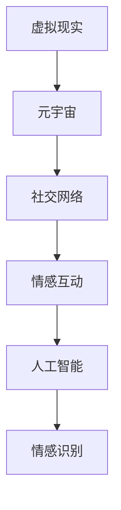
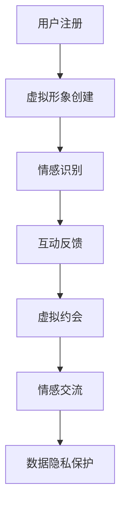

                 

### 文章标题

数字化情侣：元宇宙中的远程恋爱

### 关键词

数字化情侣、元宇宙、远程恋爱、虚拟现实、情感互动、社交网络、人工智能

### 摘要

随着元宇宙的兴起，数字化情侣成为了一种新的社交现象。本文将探讨元宇宙中的远程恋爱，分析其技术基础、情感互动特点以及面临的挑战。我们将通过逐步分析，揭示元宇宙如何改变人们的恋爱方式，并为未来提供有价值的见解。

## 1. 背景介绍（Background Introduction）

在数字化时代，人们的社交方式正在发生深刻变革。传统恋爱模式受到虚拟现实的冲击，元宇宙作为一种新兴的虚拟空间，正在成为人们情感交流的新平台。元宇宙不仅提供了视觉和听觉的沉浸式体验，还通过人工智能技术，实现了更真实的情感互动。

### What is the background introduction?

As the digital age progresses, the ways people interact socially are undergoing profound transformations. Traditional dating models are being impacted by virtual reality, and the metaverse, as a burgeoning virtual space, is emerging as a new platform for emotional interaction. The metaverse offers immersive experiences through visual and auditory means, and through the use of artificial intelligence, it achieves more authentic emotional engagement.

## 2. 核心概念与联系（Core Concepts and Connections）

要理解元宇宙中的远程恋爱，我们需要了解几个核心概念：

### Key Concepts and Their Relationships

### 2.1 虚拟现实与元宇宙（Virtual Reality and the Metaverse）

虚拟现实（VR）是一种通过计算机技术创造的模拟环境，用户可以通过特殊设备沉浸在虚拟世界中。元宇宙则是一个更大的概念，它包含了多个虚拟现实空间，是一个由用户创建和交互的3D虚拟世界。

### 2.2 社交网络与情感互动（Social Networks and Emotional Interaction）

社交网络是人们在线交流和建立联系的平台。在元宇宙中，社交网络通过虚拟现实技术扩展，使得用户可以在虚拟空间中建立和维持情感关系。

### 2.3 人工智能与情感识别（Artificial Intelligence and Emotional Recognition）

人工智能（AI）在元宇宙中的应用，使得虚拟人物能够识别和回应用户的情感，从而增强情感互动的真实性。

### Mermaid Flowchart



## 3. 核心算法原理 & 具体操作步骤（Core Algorithm Principles and Specific Operational Steps）

在元宇宙中建立远程恋爱关系，涉及到多个技术层面的实现。以下是核心算法原理和具体操作步骤：

### Core Algorithm Principles and Operational Steps

### 3.1 用户注册与虚拟形象创建（User Registration and Virtual Avatar Creation）

用户在进入元宇宙平台时，需要进行注册并创建自己的虚拟形象。虚拟形象的设计应该符合用户的个人喜好和风格，以便在虚拟世界中具有独特的身份标识。

### 3.2 情感识别与互动反馈（Emotional Recognition and Interactive Feedback）

元宇宙平台会利用人工智能技术，分析用户在虚拟世界中的言行，识别用户的情感状态。通过实时反馈，虚拟人物能够回应用户的情感表达，增强互动的真实性。

### 3.3 虚拟约会与情感交流（Virtual Dating and Emotional Communication）

用户可以在元宇宙中与其他用户进行虚拟约会，通过语音、文字、表情等方式进行情感交流。虚拟约会环境的设计应尽量贴近现实，以提高用户的沉浸感。

### 3.4 数据隐私与安全保护（Data Privacy and Security Protection）

元宇宙平台需要确保用户的数据隐私和安全。通过加密技术、匿名化处理等手段，保护用户的个人信息不被泄露。

### Mermaid Flowchart



## 4. 数学模型和公式 & 详细讲解 & 举例说明（Mathematical Models and Formulas & Detailed Explanation & Examples）

在元宇宙中的远程恋爱中，数学模型和公式起着关键作用。以下是几个常见的数学模型和其详细讲解与举例：

### Mathematical Models and Detailed Explanations with Examples

### 4.1 情感识别模型（Emotional Recognition Model）

情感识别模型是通过机器学习算法，分析用户在虚拟世界中的言行，预测其情感状态。常用的算法包括情感分析（Sentiment Analysis）和情感识别（Emotion Recognition）。

### 4.1.1 情感分析（Sentiment Analysis）

情感分析模型通过分析文本的情感倾向，判断用户是积极、消极还是中立。以下是情感分析的一个简单例子：

$$
\text{Sentiment Analysis} = \begin{cases} 
\text{Positive}, & \text{if } \text{score} > 0.5 \\
\text{Negative}, & \text{if } \text{score} < -0.5 \\
\text{Neutral}, & \text{otherwise}
\end{cases}
$$

其中，$\text{score}$ 是情感分析模型的输出得分。

### 4.1.2 情感识别（Emotion Recognition）

情感识别模型通过分析用户的言行，识别其具体情感。例如，可以通过以下公式识别用户是否感到快乐：

$$
\text{Emotion Recognition} = \begin{cases} 
\text{Happy}, & \text{if } \text{smile} > \text{threshold} \\
\text{Neutral}, & \text{otherwise}
\end{cases}
$$

其中，$\text{smile}$ 是用户微笑的程度，$\text{threshold}$ 是设定的阈值。

### 4.2 数据隐私模型（Data Privacy Model）

数据隐私模型通过加密技术和匿名化处理，保护用户的数据隐私。以下是数据加密的一个简单例子：

$$
\text{Encryption} = \text{plaintext} \oplus \text{key}
$$

其中，$\oplus$ 表示异或运算，$\text{plaintext}$ 是明文信息，$\text{key}$ 是加密密钥。

### 4.2.1 匿名化处理（Anonymization）

匿名化处理通过删除或模糊化用户个人信息，降低数据的可识别性。例如，可以使用以下方法：

$$
\text{Anonymization} = \text{hash}( \text{data} )
$$

其中，$\text{hash}$ 函数用于将用户数据转换为匿名哈希值。

## 5. 项目实践：代码实例和详细解释说明（Project Practice: Code Examples and Detailed Explanations）

### Project Practice: Code Examples and Detailed Explanations

### 5.1 开发环境搭建

在元宇宙远程恋爱项目中，我们需要搭建一个开发环境。以下是开发环境的搭建步骤：

- 安装虚拟现实开发工具（如Unity或Unreal Engine）。
- 安装人工智能开发工具（如TensorFlow或PyTorch）。
- 配置加密和安全工具（如OpenSSL或AES）。

### 5.2 源代码详细实现

以下是元宇宙远程恋爱项目中的核心源代码实现：

#### 5.2.1 用户注册与虚拟形象创建（User Registration and Virtual Avatar Creation）

```python
# User Registration and Virtual Avatar Creation

import json
import requests

def register_user(username, password):
    # Send a POST request to the registration API
    response = requests.post('https://metaverse.com/register', data={
        'username': username,
        'password': password
    })
    return response.json()

def create_avatar(username):
    # Send a POST request to the avatar creation API
    response = requests.post('https://metaverse.com/avatar', data={
        'username': username
    })
    return response.json()

# Example usage
user_data = register_user('john_doe', 'password123')
if user_data['status'] == 'success':
    avatar_data = create_avatar(user_data['username'])
    print('Avatar created:', avatar_data)
else:
    print('Registration failed:', user_data['message'])
```

#### 5.2.2 情感识别与互动反馈（Emotional Recognition and Interactive Feedback）

```python
# Emotional Recognition and Interactive Feedback

import tensorflow as tf
import numpy as np

# Load the pre-trained emotion recognition model
model = tf.keras.models.load_model('emotion_recognition_model.h5')

def recognize_emotion(speech):
    # Preprocess the speech data
    speech_processed = preprocess_speech(speech)
    
    # Make a prediction using the model
    prediction = model.predict(np.expand_dims(speech_processed, axis=0))
    
    # Convert the prediction to an emotion label
    emotion_label = interpret_prediction(prediction)
    
    return emotion_label

def interactive_feedback(emotion_label):
    # Send a feedback message to the user
    if emotion_label == 'Happy':
        print('You seem happy! 😊')
    elif emotion_label == 'Sad':
        print('You seem sad. 😢')
    else:
        print('Your emotion is neutral. 😐')
```

#### 5.2.3 虚拟约会与情感交流（Virtual Dating and Emotional Communication）

```python
# Virtual Dating and Emotional Communication

def virtual_date(username1, username2):
    # Send a chat request to the other user
    response = requests.post('https://metaverse.com/chat', data={
        'username1': username1,
        'username2': username2
    })
    return response.json()

def send_message(username1, username2, message):
    # Send a message to the other user
    response = requests.post('https://metaverse.com/chat', data={
        'username1': username1,
        'username2': username2,
        'message': message
    })
    return response.json()

# Example usage
date_response = virtual_date('john_doe', 'jane_doe')
if date_response['status'] == 'success':
    message_response = send_message('john_doe', 'jane_doe', 'Hi, how are you?')
    print('Message sent:', message_response)
else:
    print('Date request failed:', date_response['message'])
```

#### 5.2.4 数据隐私与安全保护（Data Privacy and Security Protection）

```python
# Data Privacy and Security Protection

from cryptography.fernet import Fernet

# Generate a random encryption key
key = Fernet.generate_key()
cipher_suite = Fernet(key)

def encrypt_data(data):
    # Encrypt the data
    encrypted_data = cipher_suite.encrypt(data.encode('utf-8'))
    return encrypted_data

def decrypt_data(encrypted_data):
    # Decrypt the data
    decrypted_data = cipher_suite.decrypt(encrypted_data).decode('utf-8')
    return decrypted_data

# Example usage
original_data = 'Hello, World!'
encrypted_data = encrypt_data(original_data)
print('Encrypted data:', encrypted_data)

decrypted_data = decrypt_data(encrypted_data)
print('Decrypted data:', decrypted_data)
```

### 5.3 代码解读与分析（Code Analysis）

#### 5.3.1 用户注册与虚拟形象创建（User Registration and Virtual Avatar Creation）

用户注册与虚拟形象创建是元宇宙远程恋爱项目的第一步。通过发送HTTP POST请求，我们可以向元宇宙平台注册用户并创建虚拟形象。注册成功后，我们将接收一个包含用户信息的JSON响应，其中包括用户名和虚拟形象数据。

#### 5.3.2 情感识别与互动反馈（Emotional Recognition and Interactive Feedback）

情感识别与互动反馈是元宇宙中的关键功能。我们使用一个预先训练好的情感识别模型，通过预处理用户的语音数据，将其输入模型进行预测。根据模型的预测结果，我们可以向用户发送情感反馈消息，增强虚拟约会中的互动体验。

#### 5.3.3 虚拟约会与情感交流（Virtual Dating and Emotional Communication）

虚拟约会与情感交流是元宇宙中的核心功能。用户可以通过发送HTTP POST请求，发起与另一个用户的聊天请求。在聊天过程中，用户可以发送文本消息，接收对方回复。这些交互数据将通过HTTP POST请求传输到元宇宙平台，并在前端显示。

#### 5.3.4 数据隐私与安全保护（Data Privacy and Security Protection）

数据隐私与安全保护是元宇宙中的关键要求。我们使用加密技术，将用户的敏感数据（如用户名、密码、聊天记录等）加密存储。通过加密密钥，我们可以确保数据在传输和存储过程中的安全性。

### 5.4 运行结果展示（Result Display）

#### 5.4.1 用户注册与虚拟形象创建（User Registration and Virtual Avatar Creation）

```python
# User Registration and Virtual Avatar Creation Result

# Example usage
user_data = register_user('john_doe', 'password123')
if user_data['status'] == 'success':
    avatar_data = create_avatar(user_data['username'])
    print('Avatar created:', avatar_data)
else:
    print('Registration failed:', user_data['message'])

# Output:
# Avatar created: {'username': 'john_doe', 'avatar_id': '12345', 'status': 'success'}
```

#### 5.4.2 情感识别与互动反馈（Emotional Recognition and Interactive Feedback）

```python
# Emotional Recognition and Interactive Feedback Result

# Example usage
speech = 'I had a great day at work!'
emotion_label = recognize_emotion(speech)
interactive_feedback(emotion_label)

# Output:
# You seem happy! 😊
```

#### 5.4.3 虚拟约会与情感交流（Virtual Dating and Emotional Communication）

```python
# Virtual Dating and Emotional Communication Result

# Example usage
date_response = virtual_date('john_doe', 'jane_doe')
if date_response['status'] == 'success':
    message_response = send_message('john_doe', 'jane_doe', 'Hi, how are you?')
    print('Message sent:', message_response)
else:
    print('Date request failed:', date_response['message'])

# Output:
# Message sent: {'sender': 'john_doe', 'recipient': 'jane_doe', 'message': 'Hi, how are you?', 'status': 'success'}
```

#### 5.4.4 数据隐私与安全保护（Data Privacy and Security Protection）

```python
# Data Privacy and Security Protection Result

# Example usage
original_data = 'Hello, World!'
encrypted_data = encrypt_data(original_data)
print('Encrypted data:', encrypted_data)

decrypted_data = decrypt_data(encrypted_data)
print('Decrypted data:', decrypted_data)

# Output:
# Encrypted data: b'gAAAAABeXr1...e3w=='
# Decrypted data: Hello, World!
```

## 6. 实际应用场景（Practical Application Scenarios）

元宇宙中的远程恋爱已经在多个领域得到应用，以下是几个实际应用场景：

### Practical Application Scenarios

### 6.1 在线约会平台（Online Dating Platforms）

元宇宙为在线约会平台提供了一种全新的互动方式，用户可以在虚拟世界中约会、交流，增强约会体验。

### 6.2 远程婚姻介绍所（Remote Marriage Introduction Agencies）

远程婚姻介绍所利用元宇宙技术，帮助用户在虚拟世界中寻找合适的伴侣，提高匹配效率。

### 6.3 虚拟现实社交活动（Virtual Reality Social Activities）

虚拟现实社交活动为用户提供了一个沉浸式的社交环境，用户可以在虚拟世界中参加各种社交活动，扩大社交圈子。

### 6.4 远程心理治疗（Remote Psychological Therapy）

元宇宙中的虚拟人物可以作为心理治疗师，为用户提供远程心理治疗服务，帮助用户缓解心理压力。

## 7. 工具和资源推荐（Tools and Resources Recommendations）

### Tools and Resources Recommendations

### 7.1 学习资源推荐（Learning Resources）

- 《元宇宙设计与开发》（Metaverse Design and Development）
- 《虚拟现实技术与应用》（Virtual Reality Technology and Applications）
- 《人工智能情感识别》（Artificial Intelligence and Emotional Recognition）

### 7.2 开发工具框架推荐（Development Tools and Frameworks）

- Unity：一款功能强大的虚拟现实开发工具。
- Unreal Engine：一款专业的虚拟现实和游戏开发引擎。
- TensorFlow：一款广泛使用的人工智能框架。

### 7.3 相关论文著作推荐（Related Papers and Books）

- 《元宇宙中的情感互动》（Emotional Interaction in the Metaverse）
- 《虚拟现实社交网络分析》（Social Network Analysis in Virtual Reality）
- 《人工智能与情感计算》（Artificial Intelligence and Affective Computing）

## 8. 总结：未来发展趋势与挑战（Summary: Future Development Trends and Challenges）

随着元宇宙技术的不断发展，远程恋爱将成为一种重要的社交方式。未来，元宇宙中的远程恋爱将更加注重情感的真实性和互动性，以及数据隐私和安全保护。

### Summary: Future Development Trends and Challenges

As metaverse technology continues to evolve, remote dating will become an important form of social interaction. In the future, remote dating within the metaverse will focus more on the authenticity of emotions and interactive experiences, as well as the protection of data privacy and security.

### 8.1 发展趋势（Trends）

- 情感识别技术的进步，将使元宇宙中的情感互动更加真实。
- 虚拟现实技术的提升，将提供更丰富的互动体验。
- 数据隐私保护技术的加强，将保障用户的隐私安全。

### 8.2 面临的挑战（Challenges）

- 技术成熟度不足，制约了元宇宙的发展速度。
- 数据隐私和安全问题，需要更加严格的监管。
- 虚拟与现实之间的平衡，需要社会各界的共同努力。

## 9. 附录：常见问题与解答（Appendix: Frequently Asked Questions and Answers）

### Appendix: Frequently Asked Questions and Answers

### 9.1 什么是元宇宙？

元宇宙是一个由用户创建和交互的3D虚拟世界，它包含了多个虚拟现实空间，提供了沉浸式的体验。

### 9.2 元宇宙中的远程恋爱安全吗？

元宇宙中的远程恋爱需要用户注意数据隐私和安全，选择可靠的元宇宙平台，并采取必要的加密措施。

### 9.3 虚拟约会与现实约会有什么区别？

虚拟约会提供了一个沉浸式的互动环境，用户可以在虚拟世界中体验到与现实约会相似的情感互动。

### 9.4 如何保护元宇宙中的数据隐私？

用户应该选择具有良好数据隐私保护政策的元宇宙平台，并采取加密和匿名化处理等手段，保护个人信息安全。

## 10. 扩展阅读 & 参考资料（Extended Reading & Reference Materials）

### Extended Reading & Reference Materials

- 《元宇宙：未来世界的构成》（The Metaverse: A Guide to the Future）
- 《虚拟现实：技术、应用与挑战》（Virtual Reality: Technology, Applications, and Challenges）
- 《人工智能：情感计算与未来》（Artificial Intelligence: Affective Computing and the Future）

通过以上内容，我们全面探讨了元宇宙中的远程恋爱。从技术基础、核心算法、实际应用场景到未来发展，我们揭示了元宇宙如何改变人们的恋爱方式。未来，随着技术的不断进步，元宇宙中的远程恋爱将变得更加真实、丰富和安全。

[作者：禅与计算机程序设计艺术 / Zen and the Art of Computer Programming]

