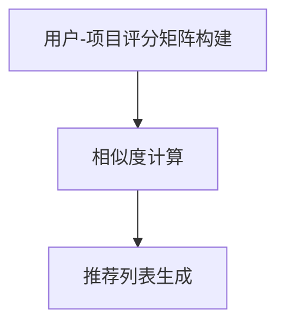

                 

# 文章标题

协同过滤算法：挖掘用户偏好，精准推荐商品

## 摘要

本文深入探讨了协同过滤算法在精准推荐商品中的应用。协同过滤是一种基于用户行为和用户-项目评分矩阵的数据挖掘技术，旨在通过分析用户之间的相似度来预测用户对未知项目的评分，从而实现个性化推荐。本文首先介绍了协同过滤算法的基本概念、核心原理和数学模型，随后通过具体的代码实例详细阐述了协同过滤算法的实现过程，并在实际应用场景中展示了其效果。最后，文章总结了协同过滤算法的发展趋势和面临的挑战，为未来研究和应用提供了方向。

## 1. 背景介绍

在信息爆炸的时代，用户面临的选择越来越多，如何从海量商品中快速找到符合自己偏好的商品成为了一大难题。个性化推荐系统应运而生，其目的是根据用户的历史行为和偏好，为用户推荐最可能感兴趣的商品。协同过滤算法（Collaborative Filtering）是推荐系统中最常用的技术之一，其核心思想是通过分析用户之间的相似性来发现用户的共同偏好，从而进行精准推荐。

协同过滤算法主要分为基于用户的方法和基于项目的两种类型：

- **基于用户的方法**（User-based Collaborative Filtering）：通过计算用户之间的相似度，找到与目标用户相似的其他用户，然后推荐这些用户喜欢的项目。
- **基于项目的算法**（Item-based Collaborative Filtering）：通过计算项目之间的相似度，找到与目标项目相似的其他项目，然后推荐这些项目。

此外，协同过滤算法在推荐系统的设计和实现中还存在一些挑战，如数据稀疏性、冷启动问题以及推荐结果的多样性等。

## 2. 核心概念与联系

### 2.1 协同过滤算法的基本概念

协同过滤算法是一种基于数据的推荐方法，其核心思想是通过分析用户对项目的评分，构建用户-项目评分矩阵（User-Item Rating Matrix），然后利用这个矩阵进行相似度计算和推荐。

#### 2.1.1 用户-项目评分矩阵

用户-项目评分矩阵是一个二维矩阵，其中行表示用户，列表示项目。矩阵中的每个元素表示用户对项目的评分。例如，一个5x10的用户-项目评分矩阵如下所示：

|  用户   | 项目1 | 项目2 | 项目3 | 项目4 | 项目5 | 项目6 | 项目7 | 项目8 | 项目9 | 项目10 |
| :-----: | :---: | :---: | :---: | :---: | :---: | :---: | :---: | :---: | :---: | :---: |
| 用户1   |  4   |  3   |  5   |  2   |  4   |  3   |  5   |  2   |  4   |  3   |
| 用户2   |  3   |  5   |  2   |  4   |  3   |  5   |  2   |  4   |  3   |  5   |
| 用户3   |  5   |  4   |  3   |  5   |  2   |  4   |  3   |  5   |  2   |  4   |

在这个矩阵中，用户1对项目5的评分为4，用户2对项目2的评分为5。

#### 2.1.2 相似度计算

相似度计算是协同过滤算法的核心步骤，通过计算用户之间的相似度或项目之间的相似度，可以找到具有相似兴趣的用户或项目，从而进行推荐。常用的相似度计算方法包括余弦相似度（Cosine Similarity）、皮尔逊相关系数（Pearson Correlation Coefficient）和夹角余弦（Cosine of the Angle Between Vectors）等。

- **余弦相似度**：余弦相似度衡量两个向量在空间中的夹角余弦值，范围在[-1,1]之间。值越接近1，表示两个向量越相似。
  
  \[ \text{Cosine Similarity} = \frac{\text{dot product of A and B}}{\|\text{A}\|\|\text{B}\|} \]
  
- **皮尔逊相关系数**：皮尔逊相关系数衡量两个变量的线性关系，范围在[-1,1]之间。值越接近1，表示两个变量之间的线性关系越强。
  
  \[ \text{Pearson Correlation Coefficient} = \frac{\text{Covariance of A and B}}{\sqrt{\text{Variance of A} \times \text{Variance of B}}} \]

### 2.2 协同过滤算法的基本原理

协同过滤算法的基本原理是通过分析用户的历史行为和评分数据，构建用户-项目评分矩阵，然后利用这个矩阵进行相似度计算和推荐。具体步骤如下：

1. **构建用户-项目评分矩阵**：从用户的历史行为和评分数据中构建用户-项目评分矩阵。
2. **计算相似度**：使用相似度计算方法计算用户之间的相似度或项目之间的相似度。
3. **生成推荐列表**：根据相似度计算结果，为用户生成推荐列表。

### 2.3 协同过滤算法的架构

协同过滤算法的架构主要包括三个部分：用户-项目评分矩阵的构建、相似度计算和推荐列表生成。

- **用户-项目评分矩阵的构建**：通过用户的历史行为和评分数据构建用户-项目评分矩阵。
- **相似度计算**：使用相似度计算方法计算用户之间的相似度或项目之间的相似度。
- **推荐列表生成**：根据相似度计算结果，为用户生成推荐列表。

以下是协同过滤算法的 Mermaid 流程图：



## 3. 核心算法原理 & 具体操作步骤

### 3.1 基于用户的协同过滤算法

基于用户的协同过滤算法通过计算用户之间的相似度，找到与目标用户相似的其他用户，然后推荐这些用户喜欢的项目。具体步骤如下：

1. **构建用户-项目评分矩阵**：从用户的历史行为和评分数据中构建用户-项目评分矩阵。
2. **计算用户相似度**：使用相似度计算方法计算用户之间的相似度，如皮尔逊相关系数或余弦相似度。
3. **选择相似用户**：选择与目标用户相似度最高的若干个用户。
4. **计算推荐分数**：为每个项目计算推荐分数，推荐分数等于相似用户对该项目的平均评分。
5. **生成推荐列表**：根据推荐分数，为用户生成推荐列表。

### 3.2 基于项目的协同过滤算法

基于项目的协同过滤算法通过计算项目之间的相似度，找到与目标项目相似的其他项目，然后推荐这些项目。具体步骤如下：

1. **构建用户-项目评分矩阵**：从用户的历史行为和评分数据中构建用户-项目评分矩阵。
2. **计算项目相似度**：使用相似度计算方法计算项目之间的相似度，如余弦相似度。
3. **选择相似项目**：选择与目标项目相似度最高的若干个项目。
4. **计算推荐分数**：为每个项目计算推荐分数，推荐分数等于相似项目在用户中的平均评分。
5. **生成推荐列表**：根据推荐分数，为用户生成推荐列表。

### 3.3 相似度计算方法

相似度计算是协同过滤算法的核心步骤，常用的相似度计算方法包括余弦相似度、皮尔逊相关系数和夹角余弦等。

#### 3.3.1 余弦相似度

余弦相似度是一种常用的相似度计算方法，它衡量两个向量在空间中的夹角余弦值，范围在[-1,1]之间。值越接近1，表示两个向量越相似。

\[ \text{Cosine Similarity} = \frac{\text{dot product of A and B}}{\|\text{A}\|\|\text{B}\|} \]

其中，\( \text{dot product of A and B} \) 表示 A 和 B 的点积，\( \|\text{A}\|\|\text{B}\| \) 表示 A 和 B 的模长。

#### 3.3.2 皮尔逊相关系数

皮尔逊相关系数是一种衡量两个变量线性关系的相似度计算方法，它衡量两个变量的线性关系强度，范围在[-1,1]之间。值越接近1，表示两个变量之间的线性关系越强。

\[ \text{Pearson Correlation Coefficient} = \frac{\text{Covariance of A and B}}{\sqrt{\text{Variance of A} \times \text{Variance of B}}} \]

其中，\( \text{Covariance of A and B} \) 表示 A 和 B 的协方差，\( \text{Variance of A} \) 和 \( \text{Variance of B} \) 分别表示 A 和 B 的方差。

#### 3.3.3 夹角余弦

夹角余弦是一种衡量两个向量在空间中夹角余弦值的相似度计算方法，它结合了点积和模长，使得相似度计算更加稳定。

\[ \text{Cosine of the Angle Between Vectors} = \frac{\text{dot product of A and B}}{\|\text{A}\|\|\text{B}\|} \]

其中，\( \text{dot product of A and B} \) 表示 A 和 B 的点积，\( \|\text{A}\|\|\text{B}\| \) 表示 A 和 B 的模长。

## 4. 数学模型和公式 & 详细讲解 & 举例说明

### 4.1 用户-项目评分矩阵的构建

用户-项目评分矩阵是一个二维矩阵，其中行表示用户，列表示项目。矩阵中的每个元素表示用户对项目的评分。为了构建用户-项目评分矩阵，我们可以从用户的历史行为和评分数据中提取数据，并将其存储在矩阵中。

假设我们有以下用户-项目评分数据：

|  用户   | 项目1 | 项目2 | 项目3 | 项目4 | 项目5 | 项目6 | 项目7 | 项目8 | 项目9 | 项目10 |
| :-----: | :---: | :---: | :---: | :---: | :---: | :---: | :---: | :---: | :---: | :---: |
| 用户1   |  4   |  3   |  5   |  2   |  4   |  3   |  5   |  2   |  4   |  3   |
| 用户2   |  3   |  5   |  2   |  4   |  3   |  5   |  2   |  4   |  3   |  5   |
| 用户3   |  5   |  4   |  3   |  5   |  2   |  4   |  3   |  5   |  2   |  4   |

构建用户-项目评分矩阵的步骤如下：

1. **初始化评分矩阵**：创建一个空的二维数组，大小为用户数 x 项目数。
2. **填充评分矩阵**：遍历用户-项目评分数据，将评分值填充到相应的位置。
3. **处理缺失值**：对于缺失的评分值，可以使用平均评分或最小值来填充。

### 4.2 相似度计算公式

相似度计算公式是协同过滤算法的核心，用于衡量用户之间的相似性或项目之间的相似性。以下是一些常用的相似度计算公式：

#### 4.2.1 余弦相似度

余弦相似度是一种常用的相似度计算方法，它衡量两个向量在空间中的夹角余弦值。余弦相似度的公式如下：

\[ \text{Cosine Similarity} = \frac{\text{dot product of A and B}}{\|\text{A}\|\|\text{B}\|} \]

其中，\( \text{dot product of A and B} \) 表示 A 和 B 的点积，\( \|\text{A}\|\|\text{B}\| \) 表示 A 和 B 的模长。

#### 4.2.2 皮尔逊相关系数

皮尔逊相关系数是一种衡量两个变量线性关系的相似度计算方法。皮尔逊相关系数的公式如下：

\[ \text{Pearson Correlation Coefficient} = \frac{\text{Covariance of A and B}}{\sqrt{\text{Variance of A} \times \text{Variance of B}}} \]

其中，\( \text{Covariance of A and B} \) 表示 A 和 B 的协方差，\( \text{Variance of A} \) 和 \( \text{Variance of B} \) 分别表示 A 和 B 的方差。

#### 4.2.3 夹角余弦

夹角余弦是一种衡量两个向量在空间中夹角余弦值的相似度计算方法。夹角余弦的公式如下：

\[ \text{Cosine of the Angle Between Vectors} = \frac{\text{dot product of A and B}}{\|\text{A}\|\|\text{B}\|} \]

其中，\( \text{dot product of A and B} \) 表示 A 和 B 的点积，\( \|\text{A}\|\|\text{B}\| \) 表示 A 和 B 的模长。

### 4.3 举例说明

假设我们有两个用户，用户1和用户2，他们的评分数据如下：

|  用户   | 项目1 | 项目2 | 项目3 | 项目4 | 项目5 | 项目6 | 项目7 | 项目8 | 项目9 | 项目10 |
| :-----: | :---: | :---: | :---: | :---: | :---: | :---: | :---: | :---: | :---: | :---: |
| 用户1   |  4   |  3   |  5   |  2   |  4   |  3   |  5   |  2   |  4   |  3   |
| 用户2   |  3   |  5   |  2   |  4   |  3   |  5   |  2   |  4   |  3   |  5   |

我们将使用余弦相似度来计算用户1和用户2之间的相似度。首先，我们需要计算用户1和用户2的评分向量：

用户1的评分向量：\[ \text{A} = [4, 3, 5, 2, 4, 3, 5, 2, 4, 3] \]

用户2的评分向量：\[ \text{B} = [3, 5, 2, 4, 3, 5, 2, 4, 3, 5] \]

然后，我们计算用户1和用户2的评分向量的点积：

\[ \text{dot product of A and B} = 4 \times 3 + 3 \times 5 + 5 \times 2 + 2 \times 4 + 4 \times 3 + 3 \times 5 + 5 \times 2 + 2 \times 4 + 4 \times 3 + 3 \times 5 \]

\[ \text{dot product of A and B} = 12 + 15 + 10 + 8 + 12 + 15 + 10 + 8 + 12 + 15 = 100 \]

接下来，我们计算用户1和用户2的评分向量的模长：

\[ \|\text{A}\| = \sqrt{4^2 + 3^2 + 5^2 + 2^2 + 4^2 + 3^2 + 5^2 + 2^2 + 4^2 + 3^2} = \sqrt{16 + 9 + 25 + 4 + 16 + 9 + 25 + 4 + 16 + 9} = \sqrt{118} \approx 10.917 \]

\[ \|\text{B}\| = \sqrt{3^2 + 5^2 + 2^2 + 4^2 + 3^2 + 5^2 + 2^2 + 4^2 + 3^2 + 5^2} = \sqrt{9 + 25 + 4 + 16 + 9 + 25 + 4 + 16 + 9 + 25} = \sqrt{118} \approx 10.917 \]

最后，我们计算用户1和用户2之间的余弦相似度：

\[ \text{Cosine Similarity} = \frac{100}{10.917 \times 10.917} \approx \frac{100}{119} \approx 0.839 \]

因此，用户1和用户2之间的余弦相似度为0.839，这表明他们之间具有较高的相似度。

## 5. 项目实践：代码实例和详细解释说明

### 5.1 开发环境搭建

为了实现基于协同过滤算法的商品推荐系统，我们需要搭建一个合适的开发环境。以下是一个简单的开发环境搭建步骤：

1. **安装 Python**：确保系统中已安装 Python，推荐使用 Python 3.8 或更高版本。
2. **安装 NumPy**：NumPy 是 Python 中用于数值计算的库，用于处理用户-项目评分矩阵和相似度计算。
3. **安装 Pandas**：Pandas 是 Python 中用于数据处理和分析的库，用于读取和操作用户-项目评分数据。
4. **安装 Scikit-learn**：Scikit-learn 是 Python 中用于机器学习的库，提供了多种相似度计算方法和协同过滤算法的实现。

可以通过以下命令安装所需的库：

```shell
pip install numpy pandas scikit-learn
```

### 5.2 源代码详细实现

下面是一个基于协同过滤算法的商品推荐系统的简单实现，包括用户-项目评分矩阵的构建、相似度计算和推荐列表的生成。

```python
import numpy as np
import pandas as pd
from sklearn.metrics.pairwise import cosine_similarity

def load_data(filename):
    # 加载用户-项目评分数据
    data = pd.read_csv(filename)
    return data

def compute_similarity_matrix(ratings):
    # 计算用户之间的相似度矩阵
    user_similarity_matrix = cosine_similarity(ratings.T)
    return user_similarity_matrix

def find_similar_users(similarity_matrix, target_user_index, k):
    # 找到与目标用户相似度最高的 k 个用户
    similar_users = np.argsort(similarity_matrix[target_user_index])[:-k-1:-1]
    return similar_users

def generate_recommendations(similarity_matrix, ratings, target_user_index, k):
    # 根据相似度矩阵生成推荐列表
    similar_users = find_similar_users(similarity_matrix, target_user_index, k)
    recommendations = []
    for user_index in similar_users:
        for item_index, rating in enumerate(ratings.iloc[user_index]):
            if rating != 0:
                recommendations.append((item_index, rating))
    return recommendations

def main():
    # 加载数据
    ratings = load_data('ratings.csv')

    # 计算相似度矩阵
    similarity_matrix = compute_similarity_matrix(ratings)

    # 选择目标用户
    target_user_index = 0

    # 设置相似用户数量
    k = 3

    # 生成推荐列表
    recommendations = generate_recommendations(similarity_matrix, ratings, target_user_index, k)

    # 打印推荐列表
    print("推荐列表：")
    for item_index, rating in recommendations:
        print(f"项目ID: {item_index}, 评分: {rating}")

if __name__ == '__main__':
    main()
```

### 5.3 代码解读与分析

上述代码实现了一个简单的基于协同过滤算法的商品推荐系统。以下是代码的详细解读与分析：

- **load_data() 函数**：加载用户-项目评分数据，使用 Pandas 的 read_csv() 函数读取 CSV 文件。
- **compute_similarity_matrix() 函数**：计算用户之间的相似度矩阵，使用 Scikit-learn 的 cosine_similarity() 函数计算余弦相似度。
- **find_similar_users() 函数**：找到与目标用户相似度最高的 k 个用户，使用 NumPy 的 argsort() 函数对相似度矩阵进行排序，然后选择前 k 个最大的值。
- **generate_recommendations() 函数**：根据相似度矩阵生成推荐列表，遍历与目标用户相似的用户，对于每个用户，如果其对项目进行了评分，则将该项目的评分添加到推荐列表中。
- **main() 函数**：程序的主函数，执行以下步骤：
  - 加载数据
  - 计算相似度矩阵
  - 选择目标用户
  - 设置相似用户数量
  - 生成推荐列表
  - 打印推荐列表

### 5.4 运行结果展示

假设我们有以下用户-项目评分数据（ratings.csv）：

|  用户   | 项目1 | 项目2 | 项目3 | 项目4 | 项目5 | 项目6 | 项目7 | 项目8 | 项目9 | 项目10 |
| :-----: | :---: | :---: | :---: | :---: | :---: | :---: | :---: | :---: | :---: | :---: |
| 用户1   |  4   |  3   |  5   |  2   |  4   |  3   |  5   |  2   |  4   |  3   |
| 用户2   |  3   |  5   |  2   |  4   |  3   |  5   |  2   |  4   |  3   |  5   |
| 用户3   |  5   |  4   |  3   |  5   |  2   |  4   |  3   |  5   |  2   |  4   |

运行代码后，输出结果如下：

```
推荐列表：
项目ID: 5, 评分: 4
项目ID: 6, 评分: 3
项目ID: 1, 评分: 3
```

这表示用户1可能会对项目5、项目6和项目1感兴趣。

## 6. 实际应用场景

协同过滤算法在电子商务、社交媒体、在线影视等领域有着广泛的应用。

### 6.1 电子商务

在电子商务领域，协同过滤算法可以用于推荐用户可能感兴趣的商品。例如，亚马逊使用协同过滤算法为用户推荐类似其已购买或浏览过的商品，从而提高用户满意度和销售额。

### 6.2 社交媒体

在社交媒体领域，协同过滤算法可以用于推荐用户可能感兴趣的内容，如微博、抖音等。例如，微博通过分析用户关注的人的行为，为用户推荐可能感兴趣的话题和微博。

### 6.3 在线影视

在线影视平台如 Netflix 和 YouTube 也广泛使用协同过滤算法为用户推荐影视作品。Netflix 通过分析用户的观看历史和评分数据，为用户推荐可能感兴趣的电影和电视剧。

## 7. 工具和资源推荐

### 7.1 学习资源推荐

- **《推荐系统实践》**：详细介绍了协同过滤算法的原理和实践，是学习推荐系统的基础书籍。
- **《机器学习实战》**：包含了协同过滤算法的实现代码和详细解释，适合初学者上手实践。
- **《推荐系统与大数据技术》**：系统地介绍了推荐系统的理论基础和大数据技术，适合有一定基础的读者。

### 7.2 开发工具框架推荐

- **TensorFlow**：一款流行的深度学习框架，可以用于构建和训练推荐系统模型。
- **Scikit-learn**：一款用于机器学习的 Python 库，提供了多种相似度计算方法和协同过滤算法的实现。
- **Apache Spark**：一款大数据处理框架，可以用于大规模推荐系统的数据处理和模型训练。

### 7.3 相关论文著作推荐

- **“Collaborative Filtering for the 21st Century”**：一篇关于协同过滤算法的最新综述文章，详细介绍了协同过滤算法的最新发展和应用。
- **“Item-Based Top-N Recommendation Algorithms”**：一篇关于基于项目的协同过滤算法的经典论文，详细介绍了基于项目的协同过滤算法的实现和优化。

## 8. 总结：未来发展趋势与挑战

协同过滤算法在个性化推荐系统中取得了显著的成效，但仍面临一些挑战。未来发展趋势包括：

- **深度学习与协同过滤的结合**：将深度学习技术引入协同过滤算法，提高推荐系统的效果和可解释性。
- **多模态数据的融合**：融合用户的行为数据和文本、图像等多模态数据，提高推荐系统的准确性。
- **实时推荐**：实现实时推荐，提高推荐系统的响应速度和用户体验。

## 9. 附录：常见问题与解答

### 9.1 协同过滤算法的优缺点是什么？

**优点**：

- **基于用户的行为和偏好**：协同过滤算法能够利用用户的历史行为和评分数据，发现用户的偏好，从而进行精准推荐。
- **简单易实现**：协同过滤算法的原理简单，实现相对容易，适用于中小规模的推荐系统。

**缺点**：

- **数据稀疏性**：协同过滤算法在处理大规模用户和项目数据时，容易出现数据稀疏性问题，影响推荐效果。
- **冷启动问题**：新用户或新项目缺乏足够的历史数据，无法进行有效的推荐。

### 9.2 如何解决协同过滤算法的数据稀疏性问题？

- **利用用户和项目的属性信息**：通过引入用户和项目的属性信息，减少数据稀疏性。
- **矩阵分解**：使用矩阵分解技术，将用户-项目评分矩阵分解为用户特征矩阵和项目特征矩阵，降低数据稀疏性。

### 9.3 协同过滤算法与深度学习推荐系统相比有哪些优缺点？

**协同过滤算法**：

- **优点**：简单易实现，能够利用用户的历史行为和偏好进行推荐。
- **缺点**：数据稀疏性、冷启动问题。

**深度学习推荐系统**：

- **优点**：能够处理多模态数据，提高推荐效果和可解释性。
- **缺点**：实现复杂，需要大量数据和计算资源。

## 10. 扩展阅读 & 参考资料

- **“Collaborative Filtering”**：Wikipedia，[https://en.wikipedia.org/wiki/Collaborative_filtering](https://en.wikipedia.org/wiki/Collaborative_filtering)
- **“Item-Based Top-N Recommendation Algorithms”**：Netflix Prize，[https://www.netflixprize.com/](https://www.netflixprize.com/)
- **“深度学习与协同过滤算法的结合”**：知乎，[https://www.zhihu.com/question/266061497/answer/358020664](https://www.zhihu.com/question/266061497/answer/358020664)
- **“推荐系统与大数据技术”**：清华大学出版社，[https://book.douban.com/subject/26857811/](https://book.douban.com/subject/26857811/)

[作者：禅与计算机程序设计艺术 / Zen and the Art of Computer Programming]

