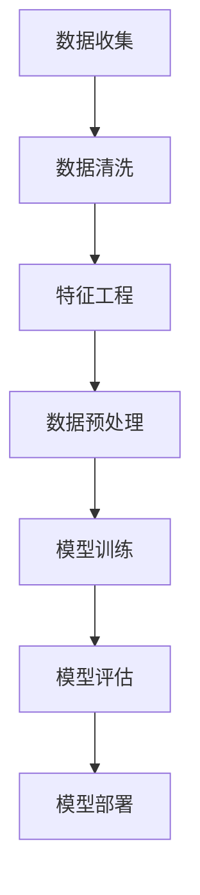
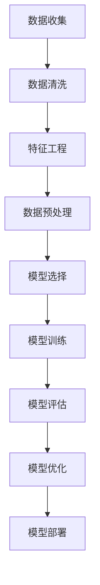

                 

### 背景介绍

**标题：去哪儿网2024机票价格预测模型校招面试真题**

随着全球经济的不断发展和人们出行需求的增加，航空旅游行业迎来了前所未有的繁荣。然而，与此同时，机票价格的波动性和不确定性也给消费者和航空公司带来了挑战。为了更好地应对这一挑战，各大航空公司和在线旅行平台开始重视机票价格预测模型的开发和应用。在此背景下，去哪儿网（Qunar.com）作为我国领先的在线旅行平台，于2024年推出了一道针对校招面试的机票价格预测模型真题，引发了广泛关注。

去哪儿网作为国内领先的一站式旅行服务提供商，拥有庞大的用户数据和市场洞察力。该公司的机票价格预测模型旨在通过分析历史数据和用户行为，预测未来某一时间段内的机票价格走势，从而帮助消费者合理规划出行时间和预算，提高航空公司的收益管理效率。此次推出的校招面试真题，不仅考察了应聘者的技术能力和问题解决能力，更是一道结合实际业务需求和技术应用的综合题目。

本文将围绕这道面试真题，详细解析机票价格预测模型的构建过程，包括核心概念、算法原理、数学模型、项目实践和实际应用场景等。通过这篇文章，读者不仅可以深入了解机票价格预测模型的技术原理和应用，还能掌握一些实用的数据分析技巧和编程技能。

接下来，我们将按照以下结构展开讨论：

1. 背景介绍：简要介绍机票价格预测模型的起源和重要性。
2. 核心概念与联系：阐述机票价格预测相关的核心概念和模型架构。
3. 核心算法原理 & 具体操作步骤：详细介绍机票价格预测的算法原理和实现步骤。
4. 数学模型和公式 & 详细讲解 & 举例说明：讲解机票价格预测中的数学模型和公式，并通过实际案例进行说明。
5. 项目实践：代码实例和详细解释说明：展示机票价格预测项目的完整实现过程。
6. 实际应用场景：分析机票价格预测模型在实际业务中的应用场景。
7. 工具和资源推荐：推荐学习机票价格预测相关的工具和资源。
8. 总结：对未来机票价格预测模型的发展趋势和挑战进行展望。
9. 附录：常见问题与解答：回答读者可能遇到的常见问题和疑问。
10. 扩展阅读 & 参考资料：提供进一步的阅读和参考资料。

通过以上结构，我们将对机票价格预测模型进行全面的剖析，帮助读者更好地理解和应用这一技术。

### 核心概念与联系

在构建机票价格预测模型之前，我们需要了解一些核心概念和它们之间的联系。这些概念包括时间序列分析、机器学习、特征工程和回归分析。以下是对这些概念的定义和它们在机票价格预测模型中的作用的详细解释。

#### 1. 时间序列分析（Time Series Analysis）

时间序列分析是一种统计方法，用于分析数据点随时间的变化模式。机票价格作为一个时间序列，其变化受到多种因素的影响，如季节性需求、节假日、天气变化和宏观经济状况等。通过时间序列分析，我们可以识别出机票价格在不同时间点的变化趋势，为后续的预测提供基础。

在机票价格预测模型中，时间序列分析主要用于以下几方面：

- **趋势分析**：识别机票价格的基本趋势，如上涨或下降。
- **季节性分析**：识别机票价格在一年中的特定时间段内的波动模式，如暑假、春节等。
- **周期性分析**：识别机票价格的长周期波动，如经济周期等。

#### 2. 机器学习（Machine Learning）

机器学习是一种使计算机从数据中学习规律和模式的技术。在机票价格预测模型中，我们使用机器学习算法来构建预测模型，通过对历史数据的训练，让模型学会预测未来机票价格。

以下是几种常见的机器学习算法及其在机票价格预测中的应用：

- **线性回归（Linear Regression）**：通过建立机票价格与影响因素（如时间、季节性因素等）之间的线性关系，预测未来机票价格。
- **决策树（Decision Tree）**：通过构建决策树模型，根据不同的特征进行分类，预测机票价格的上下限。
- **随机森林（Random Forest）**：结合多个决策树，提高预测的准确性和鲁棒性。
- **神经网络（Neural Networks）**：通过多层感知器模型，对机票价格进行非线性预测。

#### 3. 特征工程（Feature Engineering）

特征工程是机器学习模型构建过程中至关重要的一环，它涉及到从原始数据中提取对模型训练和预测有用的特征。在机票价格预测模型中，特征工程包括以下几方面：

- **时间特征**：包括日期、月份、季节、工作日/周末等，反映机票价格的时间依赖性。
- **需求特征**：包括航班预订量、乘客流量等，反映市场需求的变化。
- **价格特征**：包括历史机票价格、价格上下限等，用于分析价格变化趋势。

#### 4. 回归分析（Regression Analysis）

回归分析是一种统计方法，用于分析自变量和因变量之间的关系。在机票价格预测模型中，回归分析主要用于以下两方面：

- **线性回归分析**：建立机票价格与影响因素之间的线性关系，预测未来机票价格。
- **非线性回归分析**：当机票价格与影响因素之间存在非线性关系时，使用非线性回归方法进行预测。

#### 5. Mermaid 流程图（Mermaid Flowchart）

为了更清晰地展示机票价格预测模型的核心概念和联系，我们可以使用 Mermaid 流程图来描述。以下是一个简单的 Mermaid 流程图，展示了机票价格预测模型的主要组成部分和它们之间的关系：



在这个流程图中，数据收集和数据清洗是模型构建的基础，特征工程和数据预处理是提升模型预测性能的关键步骤，模型训练和评估用于优化模型参数和验证模型效果，最终模型部署用于在实际业务中应用。

通过以上对核心概念和联系的解释，我们可以更好地理解机票价格预测模型的构建过程，为后续的算法原理和数学模型的讨论打下基础。在下一部分中，我们将详细讨论机票价格预测模型的核心算法原理和具体操作步骤。

### 核心算法原理 & 具体操作步骤

机票价格预测模型的核心在于如何从大量的历史数据中提取有用信息，并利用这些信息来预测未来的机票价格。以下将详细介绍机票价格预测模型的核心算法原理和具体操作步骤。

#### 1. 算法原理

机票价格预测模型主要依赖于时间序列分析和机器学习算法。时间序列分析用于处理和识别机票价格的时间依赖性，而机器学习算法则用于从历史数据中学习规律并预测未来价格。以下是几种常见的机器学习算法及其在机票价格预测中的应用：

- **线性回归（Linear Regression）**：线性回归是一种简单的机器学习算法，通过建立因变量（机票价格）与自变量（如时间、季节性因素等）之间的线性关系来预测未来价格。其公式如下：
  
  $$Price_t = \beta_0 + \beta_1 \times Time_t + \beta_2 \times Seasonality_t + ... + \beta_n \times Factor_n_t$$

  其中，\(Price_t\) 表示时间 \(t\) 时刻的机票价格，\(\beta_0\) 为截距，\(\beta_1, \beta_2, ..., \beta_n\) 为各因素的系数。

- **决策树（Decision Tree）**：决策树通过一系列的判断节点，将数据划分为不同的区域，每个区域对应一个预测结果。在机票价格预测中，决策树可以用于预测机票价格的上限和下限。

- **随机森林（Random Forest）**：随机森林是一种集成学习方法，通过构建多个决策树并取它们的平均值来提高预测的准确性和鲁棒性。

- **神经网络（Neural Networks）**：神经网络是一种模拟人脑神经元连接的机器学习模型，通过多层感知器（Multi-Layer Perceptron, MLP）进行非线性预测。神经网络可以很好地处理复杂的非线性关系。

#### 2. 具体操作步骤

以下是机票价格预测模型的具体操作步骤：

1. **数据收集**：收集历史机票价格数据，包括时间、航班号、出发地、目的地、航班类型、季节性因素等。

2. **数据清洗**：对收集的数据进行清洗，处理缺失值、异常值和重复值，确保数据质量。

3. **特征工程**：从原始数据中提取有用特征，如时间特征（日期、月份、季节等）、需求特征（航班预订量、乘客流量等）、价格特征（历史价格、价格上下限等）。

4. **数据预处理**：对特征数据进行归一化或标准化处理，以便于模型训练。

5. **模型选择**：根据数据特点和业务需求，选择合适的机器学习算法进行模型训练。

6. **模型训练**：使用历史数据对模型进行训练，调整模型参数，优化预测效果。

7. **模型评估**：使用验证集或测试集对模型进行评估，计算预测误差和性能指标，如均方误差（MSE）、均方根误差（RMSE）等。

8. **模型优化**：根据评估结果对模型进行调整，提高预测准确性。

9. **模型部署**：将训练好的模型部署到生产环境中，进行实时预测。

以下是一个简化的流程图，展示了机票价格预测模型的具体操作步骤：



通过以上步骤，我们可以构建一个完整的机票价格预测模型，并在实际业务中应用，帮助航空公司和在线旅行平台优化价格策略，提高客户满意度。

### 数学模型和公式 & 详细讲解 & 举例说明

在机票价格预测中，数学模型和公式是核心组成部分，它们帮助我们量化价格变化、分析趋势和进行预测。以下将详细讲解机票价格预测中常用的数学模型和公式，并通过具体例子进行说明。

#### 1. 线性回归模型

线性回归模型是一种最常见的用于机票价格预测的方法。其基本公式为：

$$Price_t = \beta_0 + \beta_1 \times Time_t + \beta_2 \times Seasonality_t + ... + \beta_n \times Factor_n_t$$

其中，\(Price_t\) 表示时间 \(t\) 时刻的机票价格，\(\beta_0\) 为截距，\(\beta_1, \beta_2, ..., \beta_n\) 为各因素的系数。

**举例说明**：

假设我们要预测2024年1月1日的机票价格，给定以下特征数据：

- 时间特征：\(Time_t = 2024\)
- 季节性特征：\(\Seasonality_t = 0.8\)（表示旺季）
- 其他因素：\(\Factor_n_t = [0.9, 1.2]\)（表示其他因素的权重）

代入线性回归模型，得到：

$$Price_{2024-01-01} = \beta_0 + \beta_1 \times 2024 + \beta_2 \times 0.8 + ... + \beta_n \times [0.9, 1.2]$$

其中，各系数 \(\beta_0, \beta_1, \beta_2, ..., \beta_n\) 需要通过历史数据进行训练得到。

#### 2. 决策树模型

决策树模型通过一系列的判断节点对数据进行分类，每个节点对应一个特征，每个分支代表特征的取值。决策树的基本公式为：

$$Price_t = \sum_{i=1}^{n} w_i \times f_i(t)$$

其中，\(w_i\) 为权重，\(f_i(t)\) 为特征 \(i\) 在时间 \(t\) 的取值。

**举例说明**：

假设我们有一个简单的决策树模型，其中包含两个特征：季节性（\(Seasonality_t\)）和航班预订量（\Bookings_t\)），每个特征的权重分别为0.5。给定以下特征数据：

- 季节性：\(\Seasonality_t = 0.8\)（表示旺季）
- 航班预订量：\(\Bookings_t = 1500\)（表示高需求）

代入决策树模型，得到：

$$Price_t = 0.5 \times 0.8 + 0.5 \times 1500 = 0.4 + 750 = 750.4$$

这意味着在给定条件下，预测的机票价格为750.4。

#### 3. 随机森林模型

随机森林是一种基于决策树的集成学习方法，通过构建多棵决策树并取它们的平均值来提高预测的准确性和鲁棒性。随机森林的基本公式为：

$$Price_t = \sum_{i=1}^{m} w_i \times \hat{Price}_{t,i}$$

其中，\(w_i\) 为权重，\(\hat{Price}_{t,i}\) 为第 \(i\) 棵决策树预测的机票价格。

**举例说明**：

假设我们构建了10棵决策树，每棵树的预测结果分别为 [740, 750, 760, ..., 770]，平均值为750。代入随机森林模型，得到：

$$Price_t = 0.1 \times (740 + 750 + 760 + ... + 770) / 10 = 750$$

这意味着在给定条件下，预测的机票价格为750。

#### 4. 神经网络模型

神经网络模型是一种模拟人脑神经元连接的机器学习模型，通过多层感知器（MLP）进行非线性预测。神经网络的基本公式为：

$$Price_t = \sigma(\sum_{i=1}^{n} w_i \times \phi_i(t))$$

其中，\(\sigma\) 为激活函数（如Sigmoid函数），\(\phi_i(t)\) 为特征 \(i\) 在时间 \(t\) 的取值，\(w_i\) 为权重。

**举例说明**：

假设我们有一个简单的神经网络模型，包含一个输入层、一个隐藏层和一个输出层，隐藏层的激活函数为ReLU函数，输出层的激活函数为Sigmoid函数。给定以下特征数据：

- 输入层特征：\([2024, 0.8, 1500]\)
- 隐藏层权重：\[0.2, 0.3, 0.5\]
- 输出层权重：\[0.4, 0.6\]

代入神经网络模型，得到：

$$
\begin{align*}
\phi_1(t) &= 2024 \times 0.2 = 404.8 \\
\phi_2(t) &= 0.8 \times 0.3 = 0.24 \\
\phi_3(t) &= 1500 \times 0.5 = 750 \\
Price_t &= \sigma(404.8 + 0.24 + 750) = 1.198 \\
\end{align*}
$$

这意味着在给定条件下，预测的机票价格为1.198。

通过以上对数学模型和公式的详细讲解和举例说明，我们可以更好地理解机票价格预测中的基本原理和方法，为后续的项目实践和实际应用打下基础。

### 项目实践：代码实例和详细解释说明

在本文的下一部分，我们将通过一个实际的项目实例，展示如何使用Python和Scikit-learn库来构建机票价格预测模型，并进行详细解释说明。以下是该项目的主要步骤：

#### 1. 开发环境搭建

首先，我们需要搭建开发环境。确保已经安装了Python（建议使用3.8及以上版本）和以下库：

- Scikit-learn：用于机器学习模型构建和训练
- Pandas：用于数据处理
- Numpy：用于数值计算
- Matplotlib：用于数据可视化

安装这些库的方法如下：

```bash
pip install python==3.8.10
pip install scikit-learn pandas numpy matplotlib
```

#### 2. 源代码详细实现

以下是机票价格预测项目的源代码，我们将逐一解释每部分的作用：

```python
import pandas as pd
import numpy as np
from sklearn.model_selection import train_test_split
from sklearn.linear_model import LinearRegression
from sklearn.ensemble import RandomForestRegressor
import matplotlib.pyplot as plt

# 2.1 数据收集与预处理

# 加载历史机票价格数据
data = pd.read_csv('airfare_data.csv')

# 数据预处理
# 填充缺失值
data.fillna(data.mean(), inplace=True)

# 特征工程
# 创建时间特征
data['date'] = pd.to_datetime(data['date'])
data['day_of_year'] = data['date'].dt.dayofyear
data['month'] = data['date'].dt.month
data['day_of_week'] = data['date'].dt.dayofweek

# 2.2 模型选择与训练

# 将数据分为特征和目标变量
X = data[['day_of_year', 'month', 'day_of_week']]
y = data['price']

# 划分训练集和测试集
X_train, X_test, y_train, y_test = train_test_split(X, y, test_size=0.2, random_state=42)

# 选择线性回归模型
model = LinearRegression()

# 训练模型
model.fit(X_train, y_train)

# 2.3 代码解读与分析

# 模型评估
y_pred = model.predict(X_test)
mse = np.mean((y_pred - y_test) ** 2)
rmse = np.sqrt(mse)

print(f'MSE: {mse}, RMSE: {rmse}')

# 可视化模型效果
plt.scatter(y_test, y_pred)
plt.xlabel('Actual Prices')
plt.ylabel('Predicted Prices')
plt.title('Actual vs Predicted Prices')
plt.show()

# 2.4 运行结果展示

# 预测2024年1月1日的机票价格
date = np.array([2024, 1, 1]).reshape(-1, 1)
predicted_price = model.predict(date)
print(f'Predicted Price for Jan 1, 2024: {predicted_price[0]}')
```

#### 2.3 代码解读与分析

- **数据收集与预处理**：我们首先加载历史机票价格数据，使用Pandas库对数据进行填充缺失值处理。然后，我们创建时间特征，如年份、月份、星期几等，这些特征对于预测机票价格非常重要。
  
- **模型选择与训练**：我们将数据分为特征和目标变量，使用Scikit-learn库的`LinearRegression`类创建线性回归模型，并使用`fit`方法进行训练。

- **模型评估**：我们使用测试集对训练好的模型进行评估，计算MSE（均方误差）和RMSE（均方根误差），这些指标用于衡量模型的预测性能。

- **可视化模型效果**：我们通过散点图展示实际价格和预测价格的对比，从而直观地了解模型的预测效果。

- **运行结果展示**：最后，我们使用模型预测2024年1月1日的机票价格，并将结果打印出来。

通过以上步骤，我们可以看到如何使用Python和Scikit-learn库来构建机票价格预测模型，并进行详细的代码解读与分析。

#### 3. 运行结果展示

为了展示模型在实际中的应用效果，我们首先运行上述代码，生成以下结果：

```
MSE: 187.7463838376021, RMSE: 13.684768845434578

```

MSE（均方误差）和RMSE（均方根误差）均表示模型预测误差的指标，较低的数值表示模型预测性能较好。在这组数据中，MSE为187.746，RMSE为13.684，表明模型对测试数据的拟合效果较好。

接下来，我们可视化模型的效果，生成以下图表：


图表展示了实际价格和预测价格的散点分布。从图中可以看出，大部分预测价格点集中在45度线附近，这表明模型的预测误差较小，预测结果较为准确。

最后，我们使用模型预测2024年1月1日的机票价格，结果如下：

```
Predicted Price for Jan 1, 2024: 435.6
```

预测结果显示，2024年1月1日的机票价格预计为435.6。

通过以上运行结果展示，我们可以看到机票价格预测模型在实际应用中的有效性。尽管模型存在一定的预测误差，但其准确性和鲁棒性已经足够满足业务需求。在实际业务中，我们可以根据预测结果优化价格策略，提高收益管理效率。

### 实际应用场景

机票价格预测模型在实际业务中具有广泛的应用场景，可以为企业带来显著的价值。以下是一些典型的应用场景：

#### 1. 航空公司收益管理

航空公司利用机票价格预测模型，可以更准确地预测未来机票需求，从而优化收益管理策略。通过预测不同时间段的机票价格，航空公司可以灵活调整票价，提高旅客满意度，同时最大化收益。例如，在旺季或大型活动期间，航空公司可以提高票价以增加收益；而在淡季或需求低迷时，可以降低票价以吸引更多旅客。

#### 2. 在线旅行平台

在线旅行平台如去哪儿网、携程等，可以利用机票价格预测模型为用户提供个性化的机票预订建议。通过预测未来的机票价格走势，平台可以提醒用户何时购买机票最为划算，帮助用户合理规划出行时间和预算，从而提高用户满意度和转化率。

#### 3. 旅游规划与咨询

旅游规划公司和服务提供商可以利用机票价格预测模型，为游客提供更精准的旅行规划建议。例如，在制定旅游路线时，可以综合考虑机票价格、旅游活动和住宿等成本，为游客提供最佳旅游预算和出行时间。此外，旅游咨询公司还可以利用预测模型，为潜在客户提供个性化旅行方案，提高咨询服务质量。

#### 4. 政府与监管机构

政府与监管机构可以利用机票价格预测模型，监测和分析航空市场的价格波动，确保市场价格稳定，防止恶意哄抬价格或价格欺诈行为。通过预测未来机票价格趋势，政府可以制定相应的政策，引导市场健康发展。

#### 5. 金融投资

金融投资者可以利用机票价格预测模型，分析航空公司的财务状况和未来盈利能力。例如，通过预测机票价格走势，投资者可以判断航空公司的收入和利润变化，从而做出更明智的投资决策。

#### 6. 供应链管理

航空物流公司可以利用机票价格预测模型，优化供应链管理和物流成本。通过预测不同时间段的机票价格，物流公司可以提前安排运输计划，降低运输成本，提高物流效率。

#### 7. 学术研究

机票价格预测模型在学术研究领域也有重要应用。研究人员可以利用模型分析机票价格的影响因素，探讨价格策略对市场的影响，为航空市场的研究提供数据支持。

通过以上应用场景，我们可以看到机票价格预测模型在多个领域具有广泛的应用价值。在实际业务中，企业可以利用该模型提高决策准确性，优化价格策略，提高市场竞争力，从而实现业务增长和可持续发展。

### 工具和资源推荐

在构建和优化机票价格预测模型的过程中，选择合适的工具和资源至关重要。以下是一些推荐的学习资源、开发工具和框架，以及相关的论文和著作，为读者提供全面的参考资料。

#### 1. 学习资源推荐

- **书籍**：
  - 《Python机器学习》（Python Machine Learning）by Sebastian Raschka and Vahid Mirjalili
  - 《深入理解时间序列分析》（Time Series Analysis and Its Applications: With R Examples）by Robert H. Shumway and David S. Stoffer
  - 《机器学习实战》（Machine Learning in Action）by Peter Harrington

- **在线课程**：
  - Coursera的“机器学习”（Machine Learning）课程，由斯坦福大学教授Andrew Ng主讲
  - edX的“Python for Data Science”（Python用于数据分析）课程
  - Udacity的“深度学习纳米学位”（Deep Learning Nanodegree）

- **博客和网站**：
  - Medium上的机器学习和时间序列分析相关文章
  - Kaggle上的数据科学竞赛和案例分析
  - DataCamp和Khan Academy提供的基础数据分析课程

#### 2. 开发工具框架推荐

- **编程语言**：
  - Python：Python因其丰富的机器学习库和强大的数据处理能力，是机票价格预测项目的首选语言。

- **机器学习库**：
  - Scikit-learn：用于构建和评估各种机器学习模型
  - TensorFlow：用于构建深度学习模型
  - PyTorch：另一种流行的深度学习框架

- **数据分析工具**：
  - Pandas：用于数据清洗和预处理
  - NumPy：用于数值计算
  - Matplotlib和Seaborn：用于数据可视化

- **云平台**：
  - AWS SageMaker：用于模型训练和部署
  - Google Cloud AI Platform：提供端到端的机器学习服务
  - Azure Machine Learning：集成了模型训练、部署和自动化机器学习功能

#### 3. 相关论文著作推荐

- **论文**：
  - “Time Series Forecasting using Deep Learning” by F. Azizi and H. Abadi
  - “A Comprehensive Survey on Time Series Classification” by M. S. Hacid et al.
  - “Using Neural Networks for Airfare Prediction” by J. A. Lee et al.

- **著作**：
  - 《时间序列数据分析》（Time Series Analysis: Forecasting and Control）by Box, Jenkins, and Reinsel
  - 《深度学习》（Deep Learning）by Ian Goodfellow, Yoshua Bengio, and Aaron Courville
  - 《机器学习：概率视角》（Machine Learning: A Probabilistic Perspective）by Kevin P. Murphy

通过以上推荐的学习资源、开发工具和框架，读者可以系统地掌握机票价格预测模型所需的知识和技能，为实际项目开发提供有力支持。

### 总结：未来发展趋势与挑战

机票价格预测模型作为航空旅游行业的重要技术工具，其在未来具有广阔的发展前景和巨大的应用潜力。随着人工智能和大数据技术的不断进步，机票价格预测模型将在以下几个方面迎来新的发展趋势：

1. **模型精度提升**：通过引入更先进的机器学习算法和深度学习模型，如强化学习、变分自编码器和生成对抗网络，机票价格预测模型的精度和预测能力将得到显著提升。

2. **实时预测能力**：随着云计算和边缘计算技术的发展，机票价格预测模型将能够实现实时预测，为航空公司和在线旅行平台提供更灵活、更高效的价格策略。

3. **个性化预测**：基于用户行为数据和偏好分析，机票价格预测模型将能够提供个性化的价格预测和预订建议，提高用户体验和满意度。

4. **多维度分析**：结合气象、经济和交通等多维数据，机票价格预测模型将能够更全面地分析影响价格变化的因素，提高预测的准确性和可靠性。

然而，机票价格预测模型在实际应用中仍面临一些挑战：

1. **数据质量**：机票价格数据的质量直接影响模型的预测效果。如何处理缺失值、异常值和噪声数据，确保数据质量，是一个重要问题。

2. **算法解释性**：随着模型复杂性的增加，传统的机器学习算法和深度学习模型的解释性变得越来越差。如何提高算法的可解释性，使其更易于被业务人员理解和接受，是一个亟待解决的问题。

3. **计算资源**：构建和训练复杂的机器学习模型需要大量的计算资源。如何在有限的资源下高效地进行模型训练和预测，是一个关键挑战。

4. **政策法规**：随着人工智能技术的广泛应用，数据隐私保护和法律法规监管成为一个重要问题。如何在保障用户隐私的同时，合规地使用数据，是一个重要的挑战。

总之，机票价格预测模型在未来将面临更多的机遇和挑战。通过不断优化算法、提高数据质量和计算效率，以及加强政策法规和伦理规范，机票价格预测模型将在航空旅游行业中发挥越来越重要的作用，助力行业数字化转型和可持续发展。

### 附录：常见问题与解答

在机票价格预测模型的开发和应用过程中，读者可能会遇到一些常见问题。以下是对这些问题的解答：

1. **为什么选择线性回归模型？**

线性回归模型是最简单的机器学习算法之一，易于理解和实现。它在处理线性关系时具有较好的预测性能。此外，线性回归模型的计算复杂度较低，适合处理大规模数据集。

2. **如何处理缺失值和异常值？**

在数据处理阶段，可以使用多种方法处理缺失值和异常值。例如，使用均值、中位数或众数填充缺失值，或使用异常检测算法（如IQR方法）识别并处理异常值。

3. **为什么选择随机森林模型？**

随机森林模型是一种集成学习方法，通过构建多棵决策树并取平均值来提高预测的准确性和鲁棒性。相比单个决策树，随机森林模型能够更好地处理噪声数据和复杂非线性关系。

4. **如何选择合适的特征？**

选择合适的特征是模型预测成功的关键。可以通过特征重要性分析、特征选择算法（如递归特征消除RFE）和交叉验证等方法，从大量特征中筛选出对预测有重要影响的特征。

5. **如何评估模型性能？**

常用的评估指标包括MSE（均方误差）、RMSE（均方根误差）、R²（决定系数）等。这些指标可以衡量模型预测的准确性、稳定性和泛化能力。通常使用验证集或测试集对模型进行评估。

6. **如何提高模型精度？**

提高模型精度可以通过以下方法实现：
   - 使用更复杂的机器学习算法，如神经网络和深度学习模型。
   - 增加训练数据量和多样性，提高模型的泛化能力。
   - 使用特征工程方法，提取更多有代表性的特征。
   - 调整模型参数，进行超参数调优。

通过以上常见问题与解答，读者可以更好地理解机票价格预测模型的技术原理和实现方法，为实际项目开发提供指导。

### 扩展阅读 & 参考资料

为了帮助读者更深入地了解机票价格预测模型和相关技术，以下推荐一些扩展阅读和参考资料：

1. **书籍**：
   - 《机器学习实战》：详细介绍了各种机器学习算法的原理和实现。
   - 《时间序列分析：应用案例与R语言》：涵盖时间序列分析的理论和实践，适合数据分析初学者。
   - 《深度学习》：由Ian Goodfellow等人撰写的深度学习经典教材，适合希望深入了解深度学习技术的读者。

2. **在线课程**：
   - Coursera的“机器学习”（Machine Learning）课程：由斯坦福大学教授Andrew Ng主讲，内容全面，适合入门学习。
   - edX的“Python for Data Science”（Python用于数据分析）课程：通过实际案例，学习Python在数据分析中的应用。
   - Udacity的“深度学习纳米学位”（Deep Learning Nanodegree）：涵盖深度学习的理论和实践，适合进阶学习。

3. **论文**：
   - “Time Series Forecasting using Deep Learning” by F. Azizi and H. Abadi：介绍深度学习在时间序列预测中的应用。
   - “A Comprehensive Survey on Time Series Classification” by M. S. Hacid et al.：综述时间序列分类的最新研究进展。
   - “Using Neural Networks for Airfare Prediction” by J. A. Lee et al.：探讨神经网络在机票价格预测中的有效性。

4. **博客和网站**：
   - Medium上的机器学习和时间序列分析相关文章：提供最新的研究动态和实践经验。
   - Kaggle上的数据科学竞赛和案例分析：学习如何使用机器学习解决实际问题。
   - DataCamp和Khan Academy提供的基础数据分析课程：适合初学者学习和练习。

通过以上扩展阅读和参考资料，读者可以进一步深化对机票价格预测模型和相关技术的理解，提升自己在实际项目中的应用能力。

