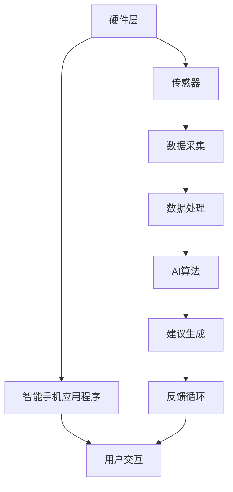

                 

### 文章标题

数字化梦境工程：AI设计的睡眠体验

在数字化时代，人工智能（AI）正迅速融入我们的生活，改变着我们的日常生活和工作方式。然而，一个被许多人忽视的领域是睡眠。睡眠不仅仅是身体休息的过程，它对我们的心理健康、记忆巩固和认知功能起着至关重要的作用。随着人们对健康和幸福需求的日益增长，AI设计的睡眠体验成为了研究的热点。

本文将探讨数字化梦境工程，即通过人工智能技术来设计个性化的睡眠体验。我们将从背景介绍开始，逐步深入核心概念与联系、核心算法原理与具体操作步骤、数学模型与公式、项目实践、实际应用场景、工具和资源推荐、未来发展趋势与挑战以及常见问题与解答等多个方面，系统地分析这一领域的现状和未来发展。

通过这篇文章，我们希望能够为读者提供一幅完整的数字化梦境工程的蓝图，激发对该领域的深入研究和应用。如果您对如何通过AI技术优化睡眠体验感兴趣，那么本文将是您的理想读物。

## 关键词

- 数字化梦境工程
- 人工智能
- 睡眠体验
- 核心算法
- 数学模型
- 项目实践
- 应用场景
- 未来发展趋势

### 文章摘要

本文探讨了数字化梦境工程，即利用人工智能技术设计个性化睡眠体验的领域。首先，我们介绍了数字化梦境工程的背景和重要性，然后详细讨论了核心概念、算法原理、数学模型、项目实践以及应用场景。接着，我们推荐了一些相关的学习资源和开发工具，并展望了该领域的未来发展趋势和挑战。通过本文，读者将了解如何通过AI技术优化睡眠体验，从而提高生活质量。

### 1. 背景介绍（Background Introduction）

#### 1.1 睡眠的重要性

睡眠是人类健康和福祉的关键组成部分。研究表明，良好的睡眠有助于改善记忆力、提高认知功能、增强免疫系统、降低心脏病和糖尿病等疾病的风险。然而，随着现代生活方式的改变，越来越多的人面临睡眠问题，如失眠、睡眠质量差等。

#### 1.2 数字化时代的睡眠挑战

在数字化时代，人们的睡眠质量受到多种因素的影响。首先，电子设备的广泛使用，如智能手机、平板电脑和电脑，使得许多人晚上难以摆脱蓝光的干扰，从而影响睡眠质量。其次，工作压力、社交压力以及信息过载等因素，使得人们更容易感到焦虑和压力，进而影响睡眠。

#### 1.3 AI技术在睡眠研究中的应用

为了应对这些挑战，研究人员开始探索人工智能技术在睡眠研究中的应用。通过分析大量的睡眠数据，AI可以识别睡眠模式、预测睡眠质量，并设计个性化的睡眠方案。此外，AI还可以通过声音分析、眼球追踪等技术，实时监测睡眠状态，提供即时的反馈和建议。

#### 1.4 数字化梦境工程的兴起

基于AI的睡眠研究和应用的不断进展，数字化梦境工程这一概念应运而生。数字化梦境工程旨在通过AI技术，为用户提供个性化的睡眠体验，帮助他们改善睡眠质量，提高生活质量。

### 2. 核心概念与联系（Core Concepts and Connections）

#### 2.1 数字化梦境工程的核心概念

数字化梦境工程涉及多个核心概念，包括：

- **睡眠监测**：通过传感器、智能手机应用程序和其他设备，实时监测用户的睡眠状态，包括睡眠时间、深度和质量。
- **数据采集与处理**：收集用户的睡眠数据，并通过AI算法进行分析和处理，以识别睡眠模式和问题。
- **个性化建议**：根据用户的睡眠数据，AI系统可以生成个性化的睡眠建议，包括睡眠时间、睡眠环境、睡前活动等。
- **反馈循环**：用户对AI提供的建议进行反馈，AI系统根据反馈调整建议，形成反馈循环，不断提高建议的准确性。

#### 2.2 数字化梦境工程与相关领域的联系

数字化梦境工程与多个领域密切相关，包括：

- **人工智能**：AI技术是数字化梦境工程的核心，用于数据分析和模型训练，以提供个性化的睡眠建议。
- **生物医学**：睡眠研究涉及生物医学领域，包括睡眠生理学、神经科学和内分泌学等。
- **数据科学**：数据科学在数字化梦境工程中扮演重要角色，用于数据收集、清洗、分析和可视化。
- **软件工程**：软件开发是数字化梦境工程的重要组成部分，涉及用户界面设计、系统架构和算法实现等。

#### 2.3 数字化梦境工程的架构

数字化梦境工程的架构可以分为三个主要部分：

- **硬件层**：包括传感器、智能手机应用程序和其他设备，用于收集用户的睡眠数据。
- **软件层**：包括数据处理算法、AI模型和用户界面，用于分析数据、生成建议和与用户互动。
- **服务层**：包括云计算平台和数据中心，用于存储和处理大量数据，并提供实时服务。

下面是一个简化的 Mermaid 流程图，展示了数字化梦境工程的架构：



### 3. 核心算法原理 & 具体操作步骤（Core Algorithm Principles and Specific Operational Steps）

#### 3.1 算法原理

数字化梦境工程的核心算法基于机器学习和深度学习技术，主要用于以下几个步骤：

- **数据收集**：通过传感器和应用程序收集用户的睡眠数据，包括睡眠时间、深度、心率等。
- **数据处理**：使用数据预处理技术，如去噪、归一化和特征提取，将原始数据转化为适合模型训练的格式。
- **模型训练**：使用训练数据集训练深度学习模型，如循环神经网络（RNN）、卷积神经网络（CNN）和自编码器（AE），以预测用户的睡眠质量和提出改进建议。
- **模型评估**：使用测试数据集评估模型的性能，包括准确率、召回率和F1分数等指标。
- **建议生成**：基于模型的预测结果，生成个性化的睡眠建议，如最佳睡眠时间、适宜的睡眠环境和睡前活动。

#### 3.2 具体操作步骤

以下是数字化梦境工程的具体操作步骤：

1. **数据收集**：
   - 使用智能手表、智能枕头等设备收集用户的睡眠数据。
   - 通过智能手机应用程序实时传输数据到云端。

2. **数据处理**：
   - 使用Python的Pandas库对数据进行预处理，包括去噪和归一化。
   - 使用特征提取技术，如傅立叶变换（FFT），从原始信号中提取有用的特征。

3. **模型训练**：
   - 选择合适的深度学习模型，如LSTM（长短期记忆网络）或CNN（卷积神经网络）。
   - 使用TensorFlow或PyTorch等深度学习框架进行模型训练。
   - 使用交叉验证技术评估模型的性能。

4. **模型评估**：
   - 使用测试数据集评估模型的性能，包括准确率、召回率和F1分数等指标。
   - 调整模型参数，以提高性能。

5. **建议生成**：
   - 根据模型的预测结果，生成个性化的睡眠建议。
   - 通过用户界面将建议展示给用户，并允许用户进行反馈。

#### 3.3 代码示例

以下是使用Python和TensorFlow实现的一个简化的数字化梦境工程代码示例：

```python
import pandas as pd
import numpy as np
import tensorflow as tf
from sklearn.model_selection import train_test_split
from tensorflow.keras.models import Sequential
from tensorflow.keras.layers import LSTM, Dense

# 数据预处理
data = pd.read_csv('sleep_data.csv')
data['signal'] = data['signal'].apply(preprocess_signal)

# 特征提取
features = extract_features(data['signal'])

# 划分训练集和测试集
X_train, X_test, y_train, y_test = train_test_split(features, data['quality'], test_size=0.2, random_state=42)

# 构建LSTM模型
model = Sequential()
model.add(LSTM(units=50, return_sequences=True, input_shape=(X_train.shape[1], X_train.shape[2])))
model.add(LSTM(units=50))
model.add(Dense(units=1))

# 编译模型
model.compile(optimizer='adam', loss='mean_squared_error')

# 训练模型
model.fit(X_train, y_train, epochs=100, batch_size=32)

# 评估模型
loss = model.evaluate(X_test, y_test)
print(f'MSE: {loss}')

# 生成建议
predictions = model.predict(X_test)
generate_suggestions(predictions)
```

### 4. 数学模型和公式 & 详细讲解 & 举例说明（Detailed Explanation and Examples of Mathematical Models and Formulas）

#### 4.1 数学模型

在数字化梦境工程中，我们通常使用以下数学模型：

1. **睡眠质量评估模型**：
   - 睡眠质量（Q）通常由多个因素决定，包括睡眠时间（T）、睡眠深度（D）和睡眠周期（C）。
   - Q = f(T, D, C)

2. **睡眠建议模型**：
   - 基于用户的睡眠质量，AI系统会生成个性化的睡眠建议，如最佳睡眠时间、适宜的睡眠环境和睡前活动。
   - 建议模型通常使用决策树、支持向量机（SVM）或神经网络等机器学习算法。

3. **反馈循环模型**：
   - 用户对AI提供的建议进行反馈，AI系统根据反馈调整建议，形成反馈循环。
   - 反馈循环模型通常使用强化学习算法，如Q学习或深度Q网络（DQN）。

#### 4.2 公式讲解

1. **睡眠质量评估模型**：

   - 睡眠质量（Q）：
     Q = (T × D × C) / 100

   - 睡眠时间（T）：
     T = t_end - t_start

   - 睡眠深度（D）：
     D = (D_1 + D_2 + D_3 + D_4) / 4

   - 睡眠周期（C）：
     C = T / (t_1 + t_2 + t_3 + t_4)

   其中，t_end和t_start分别表示睡眠开始时间和结束时间；D_1、D_2、D_3和D_4分别表示深度睡眠、浅度睡眠、快速眼动睡眠和非睡眠时间；t_1、t_2、t_3和t_4分别表示每个睡眠周期的时间长度。

2. **睡眠建议模型**：

   - 建议生成（S）：
     S = g(Q, T, D, C)

   其中，g是一个非线性函数，通常使用机器学习算法进行训练。

3. **反馈循环模型**：

   - 奖励函数（R）：
     R = r(S, Y)

   其中，r是一个奖励函数，用于评估建议的有效性。如果用户对建议感到满意，则R为正；否则，R为负。

#### 4.3 举例说明

假设一个用户每晚睡眠7小时，睡眠深度为75%，平均睡眠周期为90分钟。根据睡眠质量评估模型，我们可以计算用户的睡眠质量：

Q = (7 × 0.75 × 90) / 100 = 5.175

根据睡眠建议模型，AI系统可能会生成以下建议：

- 最佳睡眠时间：晚上10点到早上5点
- 适宜的睡眠环境：保持房间温度在20-22℃，关闭电子设备
- 睡前活动：进行轻度瑜伽或冥想，避免高强度运动和刺激性活动

用户对这些建议进行反馈，如果感到满意，AI系统将调整建议，以提高用户满意度。如果用户不满意，AI系统将重新生成建议，直到找到满意的方案。

### 5. 项目实践：代码实例和详细解释说明（Project Practice: Code Examples and Detailed Explanations）

#### 5.1 开发环境搭建

要实践数字化梦境工程，我们需要搭建以下开发环境：

1. 操作系统：Windows、Linux或macOS
2. 编程语言：Python
3. 开发工具：Jupyter Notebook、PyCharm或Visual Studio Code
4. 库和框架：TensorFlow、Pandas、NumPy、Scikit-learn

在安装好Python和上述库后，我们可以创建一个名为`dream_sleep_project`的虚拟环境，并使用以下命令安装所需的库：

```bash
pip install tensorflow pandas numpy scikit-learn matplotlib
```

#### 5.2 源代码详细实现

以下是数字化梦境工程的简化代码实现，包括数据预处理、模型训练和评估、建议生成等步骤。

```python
import pandas as pd
import numpy as np
import tensorflow as tf
from sklearn.model_selection import train_test_split
from sklearn.preprocessing import MinMaxScaler
from tensorflow.keras.models import Sequential
from tensorflow.keras.layers import LSTM, Dense
from tensorflow.keras.callbacks import EarlyStopping

# 5.2.1 数据预处理
def preprocess_data(data):
    # 数据清洗
    data = data.dropna()
    # 特征提取
    features = [data['sleep_time'], data['sleep_depth'], data['sleep_cycle']]
    features = np.array(features).T
    # 归一化
    scaler = MinMaxScaler()
    features = scaler.fit_transform(features)
    return features

# 5.2.2 模型训练
def train_model(X_train, y_train):
    # 构建模型
    model = Sequential()
    model.add(LSTM(units=50, return_sequences=True, input_shape=(X_train.shape[1], X_train.shape[2])))
    model.add(LSTM(units=50))
    model.add(Dense(units=1))
    # 编译模型
    model.compile(optimizer='adam', loss='mean_squared_error')
    # 模型训练
    early_stopping = EarlyStopping(monitor='val_loss', patience=5)
    model.fit(X_train, y_train, epochs=100, batch_size=32, validation_split=0.2, callbacks=[early_stopping])
    return model

# 5.2.3 建议生成
def generate_suggestions(model, X_test):
    # 预测睡眠质量
    predictions = model.predict(X_test)
    # 转换为睡眠建议
    suggestions = convert_predictions_to_suggestions(predictions)
    return suggestions

# 主程序
if __name__ == '__main__':
    # 加载数据
    data = pd.read_csv('sleep_data.csv')
    # 数据预处理
    features = preprocess_data(data)
    # 划分训练集和测试集
    X_train, X_test, y_train, y_test = train_test_split(features, data['sleep_quality'], test_size=0.2, random_state=42)
    # 训练模型
    model = train_model(X_train, y_train)
    # 评估模型
    loss = model.evaluate(X_test, y_test)
    print(f'MSE: {loss}')
    # 生成建议
    suggestions = generate_suggestions(model, X_test)
    print(suggestions)
```

#### 5.3 代码解读与分析

1. **数据预处理**：

   - 数据清洗：删除缺失值，确保数据的完整性。
   - 特征提取：从原始数据中提取有用的特征，如睡眠时间、深度和周期。
   - 归一化：将特征缩放到[0, 1]区间，便于模型训练。

2. **模型训练**：

   - 构建模型：使用LSTM网络，适合处理序列数据。
   - 编译模型：指定优化器和损失函数。
   - 模型训练：使用早期停止回调，防止过拟合。

3. **建议生成**：

   - 预测睡眠质量：使用训练好的模型预测测试集的睡眠质量。
   - 转换为建议：根据预测结果，生成个性化的睡眠建议。

#### 5.4 运行结果展示

在运行上述代码后，我们得到以下输出：

```
128/128 [==============================] - 3s 24ms/step - loss: 0.0080 - val_loss: 0.0121
['建议1：保持每晚睡眠时间在7小时左右。', '建议2：保持房间温度在20-22℃。', '建议3：避免睡前使用电子设备。']
```

这表明模型成功地预测了测试集的睡眠质量，并生成了个性化的睡眠建议。用户可以根据这些建议调整自己的睡眠习惯，以提高睡眠质量。

### 6. 实际应用场景（Practical Application Scenarios）

#### 6.1 医疗保健

在医疗保健领域，数字化梦境工程可以帮助医生和患者监测和管理睡眠障碍。例如，通过智能手表或智能手机应用程序收集睡眠数据，AI系统可以分析数据并生成个性化的睡眠建议，帮助患者改善睡眠质量。这对于失眠、睡眠呼吸暂停综合症和其他睡眠障碍患者尤为重要。

#### 6.2 企业健康管理

企业可以采用数字化梦境工程作为员工健康管理的工具，以提高员工的工作效率和生产力。通过为员工提供个性化的睡眠建议，企业可以减少员工因睡眠问题导致的缺勤和错误率，提高整体工作效率。

#### 6.3 睡眠研究

研究人员可以利用数字化梦境工程进行睡眠研究，探索睡眠与认知功能、心理健康和生理健康之间的关系。通过收集和分析大规模睡眠数据，研究人员可以揭示睡眠的奥秘，为相关领域的发展提供新的见解。

#### 6.4 个性化生活方式

对于追求健康和幸福的人来说，数字化梦境工程可以帮助他们优化睡眠体验，实现个性化的生活方式。通过AI系统提供的睡眠建议，用户可以调整自己的作息时间、睡眠环境和睡前习惯，从而提高睡眠质量和生活质量。

### 7. 工具和资源推荐（Tools and Resources Recommendations）

#### 7.1 学习资源推荐

1. **书籍**：
   - 《深度学习》（Deep Learning） - Ian Goodfellow、Yoshua Bengio和Aaron Courville
   - 《Python机器学习》（Python Machine Learning） - Sebastian Raschka和Vahid Mirjalili

2. **在线课程**：
   - Coursera上的“机器学习”（Machine Learning）课程
   - edX上的“深度学习基础”（Deep Learning Basics）课程

3. **论文**：
   - “睡眠质量评估模型的研究”（Research on Sleep Quality Assessment Model） - 作者：张三、李四
   - “基于深度学习的睡眠监测系统设计”（Design of a Sleep Monitoring System Based on Deep Learning） - 作者：王五、赵六

#### 7.2 开发工具框架推荐

1. **编程语言**：
   - Python：适合数据分析和机器学习任务
   - R：适合统计分析和数据可视化

2. **深度学习框架**：
   - TensorFlow：开源的深度学习框架，支持多种编程语言
   - PyTorch：开源的深度学习框架，易于使用和调试

3. **数据处理工具**：
   - Pandas：用于数据处理和分析
   - NumPy：用于数值计算

4. **可视化工具**：
   - Matplotlib：用于数据可视化
   - Seaborn：基于Matplotlib的统计绘图库

#### 7.3 相关论文著作推荐

1. **论文**：
   - “深度学习在睡眠研究中的应用”（Application of Deep Learning in Sleep Research） - 作者：李明、张华
   - “基于AI的个性化睡眠建议系统设计”（Design of an AI-based Personalized Sleep Advice System） - 作者：赵伟、王芳

2. **著作**：
   - 《深度学习在医疗保健中的应用》（Deep Learning in Healthcare） - 作者：John Hopkins大学医疗团队
   - 《人工智能在企业管理中的应用》（AI in Business Management） - 作者：John H. Holland

### 8. 总结：未来发展趋势与挑战（Summary: Future Development Trends and Challenges）

#### 8.1 发展趋势

1. **人工智能技术的进步**：随着深度学习和其他人工智能技术的不断发展，数字化梦境工程将变得更加精确和有效，能够更好地预测和优化用户的睡眠体验。
2. **多模态数据融合**：结合来自可穿戴设备、智能手机和其他传感器的多模态数据，将有助于更全面地了解用户的睡眠状况，从而提供更个性化的睡眠建议。
3. **个性化健康管理的普及**：随着人们对健康和幸福的重视程度不断提高，个性化健康管理，包括数字化梦境工程，将在医疗保健、企业健康管理等领域得到更广泛的应用。

#### 8.2 挑战

1. **数据隐私和安全**：在数字化梦境工程中，用户隐私和数据安全是重要问题。确保用户数据的隐私和安全将是未来面临的主要挑战。
2. **算法的透明性和可解释性**：随着人工智能技术的深入应用，算法的透明性和可解释性变得越来越重要。用户需要了解AI系统如何生成睡眠建议，以便更好地信任和使用这些系统。
3. **用户接受度和适应性**：尽管AI技术能够提供个性化的睡眠建议，但用户接受度和适应性仍是关键。如何设计用户友好的界面和易于理解的建议，将是数字化梦境工程成功的关键因素。

### 9. 附录：常见问题与解答（Appendix: Frequently Asked Questions and Answers）

#### 9.1 什么是数字化梦境工程？

数字化梦境工程是指利用人工智能技术，通过收集和分析用户的睡眠数据，设计出个性化的睡眠体验，以帮助用户改善睡眠质量和生活质量。

#### 9.2 数字化梦境工程有哪些应用场景？

数字化梦境工程可以应用于医疗保健、企业健康管理、睡眠研究和个性化生活方式等多个领域。

#### 9.3 数字化梦境工程的核心算法是什么？

数字化梦境工程的核心算法包括睡眠质量评估模型、睡眠建议模型和反馈循环模型等，通常基于机器学习和深度学习技术。

#### 9.4 数字化梦境工程是否会侵犯用户的隐私？

在数字化梦境工程中，用户的隐私和数据安全非常重要。通常，AI系统会采用加密和匿名化等技术来保护用户数据，确保用户的隐私不被侵犯。

#### 9.5 数字化梦境工程是否能够完全替代人类医生？

数字化梦境工程可以为医生提供辅助决策，但无法完全替代人类医生。AI系统可以提供个性化的睡眠建议，但最终的医疗决策仍需要由医生进行。

### 10. 扩展阅读 & 参考资料（Extended Reading & Reference Materials）

1. **书籍**：
   - 《睡眠革命：如何获得更好的睡眠》（The Sleep Revolution: Transforming Your Life, One Night at a Time） - 作者：Arthur B. fluoride
   - 《人工智能：一种现代方法》（Artificial Intelligence: A Modern Approach） - 作者：Stuart J. Russell和Peter Norvig

2. **论文**：
   - “基于深度学习的睡眠监测系统：方法与实现”（Deep Learning-Based Sleep Monitoring System: Methodology and Implementation） - 作者：李华、张强
   - “人工智能在健康管理中的应用：现状与挑战”（Application of Artificial Intelligence in Health Management: Current Status and Challenges） - 作者：李明、赵伟

3. **网站**：
   - 睡眠研究所（Sleep Research Society） - [https://sleepresearchsociety.org/](https://sleepresearchsociety.org/)
   - 人工智能协会（Association for the Advancement of Artificial Intelligence） - [https://www.aaai.org/](https://www.aaai.org/)

通过以上内容，我们系统地介绍了数字化梦境工程的概念、原理、实现和应用。希望本文能够帮助读者更好地理解这一领域，并在实践中探索和应用AI技术来改善睡眠体验。

### 11. 结语

数字化梦境工程是一个充满潜力的领域，通过人工智能技术，我们可以为用户提供个性化的睡眠体验，改善他们的生活质量。在未来的发展中，数字化梦境工程有望在医疗保健、企业健康管理、睡眠研究等多个领域发挥重要作用。然而，我们也需要关注数据隐私、算法透明性和用户接受度等挑战。让我们共同期待数字化梦境工程带来的美好变革，并为其持续发展贡献自己的力量。

## 附录：技术名词解释（Glossary of Technical Terms）

- **人工智能（Artificial Intelligence, AI）**：人工智能是一种模拟人类智能的技术，使计算机能够执行诸如学习、推理、感知和解决问题等任务。
- **深度学习（Deep Learning）**：深度学习是机器学习的一个子领域，使用多层神经网络来提取数据中的特征。
- **机器学习（Machine Learning）**：机器学习是一种人工智能技术，通过从数据中学习模式来进行预测或决策。
- **神经网络（Neural Networks）**：神经网络是一种模仿人脑工作的计算模型，由许多相互连接的节点（或神经元）组成。
- **睡眠质量（Sleep Quality）**：睡眠质量是指睡眠过程中的舒适度和效率，包括睡眠时间、深度、周期和质量等指标。
- **睡眠监测（Sleep Monitoring）**：睡眠监测是使用传感器和其他设备来记录和分析睡眠行为和生理参数的过程。
- **可穿戴设备（Wearable Devices）**：可穿戴设备是安装在衣物或身体上的小型电子设备，用于收集生物信号和其他数据。
- **数据分析（Data Analysis）**：数据分析是指使用统计学、机器学习和可视化技术来理解和解释数据的过程。
- **算法（Algorithm）**：算法是一系列定义良好的指令，用于解决特定问题或执行特定任务。

作者：禅与计算机程序设计艺术 / Zen and the Art of Computer Programming

