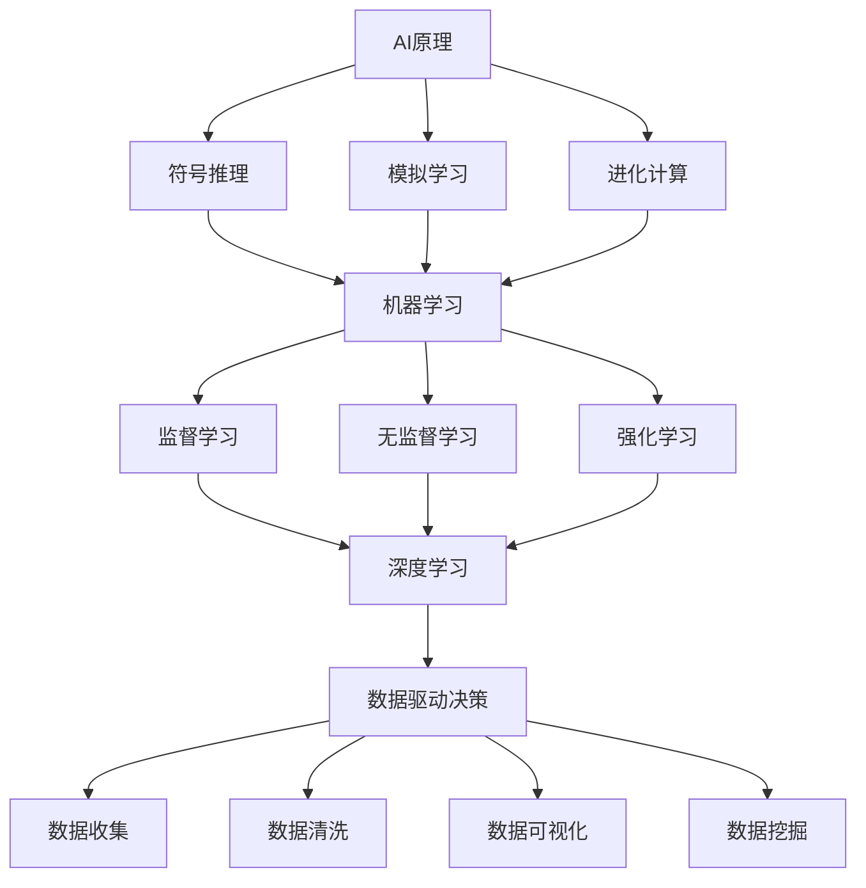
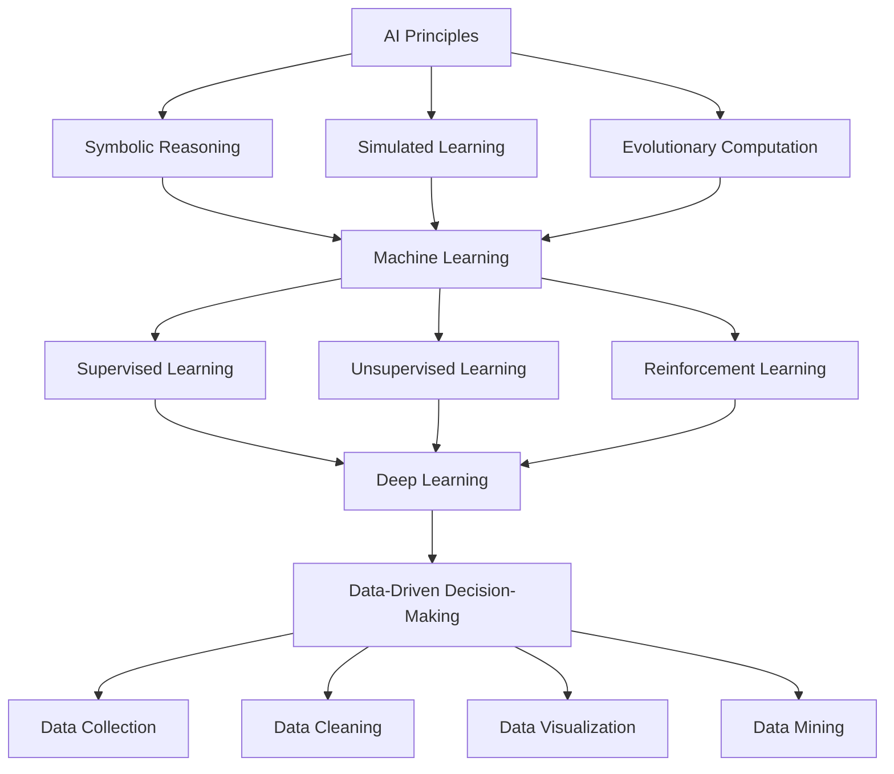

                 

### 文章标题

**数字化直觉：AI增强的决策能力**

本文将深入探讨AI在增强决策能力方面的潜力和应用，从核心概念、算法原理、数学模型到实际应用，全面解析数字化直觉的魅力。

**Keywords:** 数字化直觉, AI决策能力, 算法原理, 数学模型, 实际应用

**Abstract:**
本文旨在探讨人工智能（AI）在提高决策能力方面的作用。通过分析AI的核心概念、算法原理、数学模型和实际应用，本文将展示数字化直觉的强大力量，并探讨其未来的发展趋势和挑战。

<|assistant|>### 1. 背景介绍（Background Introduction）

在当今快速变化的世界中，决策能力成为个人和组织的核心竞争力。传统的决策方法往往依赖于经验、直觉和数据分析，但在复杂、动态的环境中，这些方法可能显得力不从心。因此，我们需要新的工具和框架来增强我们的决策能力。

人工智能（AI）作为一种强大的技术，其本质是模仿人类的决策过程。通过机器学习、深度学习等技术，AI可以处理大量数据，发现隐藏的模式和趋势，从而辅助我们做出更明智的决策。

数字化直觉是指通过AI技术将人类直觉转化为可量化和可操作的信息。它不仅提高了决策的准确性，还大大加快了决策的过程。数字化直觉在许多领域都有广泛的应用，包括医疗、金融、零售和制造业。

本文将首先介绍AI的基本概念和原理，然后深入探讨AI在决策支持系统中的具体应用，包括算法原理、数学模型和实际案例。最后，我们将展望数字化直觉的未来发展趋势和面临的挑战。

### Background Introduction

In today's rapidly changing world, decision-making capabilities have become a critical competitive edge for individuals and organizations. Traditional decision-making methods, which rely on experience, intuition, and data analysis, may fall short in complex and dynamic environments. Therefore, we need new tools and frameworks to enhance our decision-making abilities.

Artificial Intelligence (AI) is a powerful technology that essentially mimics the decision-making process of humans. Through machine learning and deep learning techniques, AI can process large amounts of data, discover hidden patterns and trends, and assist us in making more informed decisions.

Digital intuition refers to the process of transforming human intuition into quantifiable and actionable information using AI technology. It not only improves the accuracy of decisions but also significantly accelerates the decision-making process. Digital intuition has a wide range of applications in various fields, including healthcare, finance, retail, and manufacturing.

This article will first introduce the basic concepts and principles of AI, then delve into the specific applications of AI in decision support systems, including algorithm principles, mathematical models, and real-world case studies. Finally, we will look forward to the future development trends and challenges of digital intuition.

<|assistant|>### 2. 核心概念与联系（Core Concepts and Connections）

在探讨AI增强的决策能力之前，我们首先需要理解一些核心概念，包括AI的基本原理、机器学习、深度学习和数据驱动决策。

#### 2.1 AI的基本原理

AI的核心在于模拟人类的思维过程。它通过算法和计算模型来处理和分析数据，从而做出决策。AI的基本原理包括：

- **符号推理**：使用符号和逻辑来表示知识，并利用推理机制来解决问题。
- **模拟学习**：通过模仿人类的学习过程，使AI能够在特定任务上取得出色的表现。
- **进化计算**：通过模拟生物进化过程，使AI能够自适应地解决问题。

#### 2.2 机器学习

机器学习是AI的一个重要分支，它使计算机能够从数据中学习，从而改进其性能。机器学习的基本概念包括：

- **监督学习**：使用已标记的数据来训练模型，使其能够预测新的数据。
- **无监督学习**：不使用标记数据，通过发现数据中的模式和结构来训练模型。
- **强化学习**：通过不断尝试和反馈来训练模型，使其在特定环境中取得最佳表现。

#### 2.3 深度学习

深度学习是机器学习的一个分支，它使用多层神经网络来模拟人类的神经结构。深度学习的关键概念包括：

- **卷积神经网络（CNN）**：主要用于图像识别和处理。
- **循环神经网络（RNN）**：适用于序列数据，如自然语言处理和时间序列分析。
- **生成对抗网络（GAN）**：用于生成新数据和对抗性学习。

#### 2.4 数据驱动决策

数据驱动决策是指使用数据分析和技术来辅助决策过程。它包括：

- **数据收集**：从各种来源收集数据，包括内部数据和外部数据。
- **数据清洗**：处理数据中的错误和噪声，以提高数据质量。
- **数据可视化**：使用图表和可视化工具来展示数据，帮助人们理解数据。
- **数据挖掘**：使用统计和机器学习技术来发现数据中的模式和趋势。

通过理解这些核心概念，我们可以更好地理解AI如何增强决策能力。以下是一个简化的Mermaid流程图，展示了这些概念之间的联系：



### Core Concepts and Connections

Before delving into how AI enhances decision-making capabilities, we first need to understand some core concepts, including the basic principles of AI, machine learning, deep learning, and data-driven decision-making.

#### 2.1 Basic Principles of AI

The core of AI lies in simulating the thought process of humans. It uses algorithms and computational models to process and analyze data, thereby making decisions. The basic principles of AI include:

- **Symbolic Reasoning**: Represents knowledge using symbols and logic and utilizes reasoning mechanisms to solve problems.
- **Simulated Learning**: Mimics the human learning process to enable AI to perform exceptionally well on specific tasks.
- **Evolutionary Computation**: Simulates the biological evolution process to allow AI to adaptively solve problems.

#### 2.2 Machine Learning

Machine learning is an important branch of AI that enables computers to learn from data to improve their performance. The basic concepts of machine learning include:

- **Supervised Learning**: Trains models using labeled data to predict new data.
- **Unsupervised Learning**: Trains models without labeled data by discovering patterns and structures in the data.
- **Reinforcement Learning**: Trains models through continuous attempts and feedback to achieve the best performance in a specific environment.

#### 2.3 Deep Learning

Deep learning is a branch of machine learning that uses multi-layer neural networks to simulate the structure of human neurons. Key concepts of deep learning include:

- **Convolutional Neural Networks (CNN)**: Primarily used for image recognition and processing.
- **Recurrent Neural Networks (RNN)**: Suitable for sequence data, such as natural language processing and time series analysis.
- **Generative Adversarial Networks (GAN)**: Used for generating new data and adversarial learning.

#### 2.4 Data-Driven Decision-Making

Data-driven decision-making refers to the use of data analysis and technology to assist the decision-making process. It includes:

- **Data Collection**: Gathers data from various sources, including internal and external data.
- **Data Cleaning**: Processes errors and noise in the data to improve data quality.
- **Data Visualization**: Uses charts and visualization tools to present data, helping people understand the data.
- **Data Mining**: Uses statistical and machine learning techniques to discover patterns and trends in the data.

Understanding these core concepts enables us to better grasp how AI enhances decision-making capabilities. Here is a simplified Mermaid flowchart illustrating the connections between these concepts:



<|assistant|>### 3. 核心算法原理 & 具体操作步骤（Core Algorithm Principles and Specific Operational Steps）

在深入探讨AI增强决策能力的过程中，核心算法原理是不可或缺的组成部分。本节将详细阐述几种关键算法原理，并提供具体的操作步骤。

#### 3.1 支持向量机（SVM）

支持向量机（SVM）是一种强大的分类算法，广泛应用于数据挖掘和机器学习领域。SVM的目标是找到一个超平面，将不同类别的数据点最大化地分开。

**具体操作步骤：**

1. **数据准备**：收集并预处理数据，包括特征提取和数据标准化。
2. **选择核函数**：根据数据特性选择合适的核函数，如线性核、多项式核或径向基核。
3. **训练模型**：使用训练数据集训练SVM模型。
4. **模型评估**：使用测试数据集评估模型性能，调整参数以优化模型。

**代码示例（Python）：**

```python
from sklearn.svm import SVC
from sklearn.model_selection import train_test_split
from sklearn.metrics import accuracy_score

# 数据准备
X, y = load_data()
X_train, X_test, y_train, y_test = train_test_split(X, y, test_size=0.2, random_state=42)

# 选择核函数
kernel = 'linear'

# 训练模型
model = SVC(kernel=kernel)
model.fit(X_train, y_train)

# 模型评估
predictions = model.predict(X_test)
accuracy = accuracy_score(y_test, predictions)
print(f"Model accuracy: {accuracy}")
```

#### 3.2 决策树（Decision Tree）

决策树是一种简单的决策支持工具，通过一系列规则将数据分割成不同的区域，从而实现分类或回归。

**具体操作步骤：**

1. **数据准备**：收集并预处理数据，包括特征提取和数据标准化。
2. **构建决策树**：使用ID3、C4.5或CART算法构建决策树。
3. **修剪决策树**：为了避免过拟合，对决策树进行修剪。
4. **模型评估**：使用测试数据集评估模型性能。

**代码示例（Python）：**

```python
from sklearn.tree import DecisionTreeClassifier
from sklearn.model_selection import train_test_split
from sklearn.metrics import accuracy_score

# 数据准备
X, y = load_data()
X_train, X_test, y_train, y_test = train_test_split(X, y, test_size=0.2, random_state=42)

# 构建决策树
model = DecisionTreeClassifier()
model.fit(X_train, y_train)

# 修剪决策树
model = DecisionTreeClassifier(max_depth=5)
model.fit(X_train, y_train)

# 模型评估
predictions = model.predict(X_test)
accuracy = accuracy_score(y_test, predictions)
print(f"Model accuracy: {accuracy}")
```

#### 3.3 集成学习（Ensemble Learning）

集成学习是一种将多个模型组合起来，以提高预测准确性和泛化能力的方法。常见的集成学习方法包括Bagging、Boosting和Stacking。

**具体操作步骤：**

1. **选择基学习器**：选择不同的基学习器，如决策树、随机森林或梯度提升树。
2. **训练基学习器**：使用训练数据集训练每个基学习器。
3. **集成模型预测**：将基学习器的预测结果进行合并，得到最终的预测结果。

**代码示例（Python）：**

```python
from sklearn.ensemble import RandomForestClassifier
from sklearn.ensemble import GradientBoostingClassifier
from sklearn.metrics import accuracy_score

# 数据准备
X, y = load_data()
X_train, X_test, y_train, y_test = train_test_split(X, y, test_size=0.2, random_state=42)

# 训练基学习器
rf_model = RandomForestClassifier(n_estimators=100)
rf_model.fit(X_train, y_train)

gb_model = GradientBoostingClassifier(n_estimators=100)
gb_model.fit(X_train, y_train)

# 集成模型预测
rf_predictions = rf_model.predict(X_test)
gb_predictions = gb_model.predict(X_test)

# 合并预测结果
final_predictions = (rf_predictions + gb_predictions) / 2
accuracy = accuracy_score(y_test, final_predictions)
print(f"Model accuracy: {accuracy}")
```

通过以上算法原理和操作步骤的讲解，我们可以看到AI在增强决策能力方面的潜力。在实际应用中，这些算法可以根据具体需求和数据特性进行灵活调整和优化，以实现最佳效果。

### Core Algorithm Principles and Specific Operational Steps

In the process of delving into how AI enhances decision-making capabilities, core algorithm principles are indispensable components. This section will detailedly explain several key algorithm principles and provide specific operational steps.

#### 3.1 Support Vector Machine (SVM)

Support Vector Machine (SVM) is a powerful classification algorithm widely used in data mining and machine learning. The goal of SVM is to find a hyperplane that maximally separates different classes of data points.

**Specific Operational Steps:**

1. **Data Preparation**: Collect and preprocess data, including feature extraction and data normalization.
2. **Selecting the Kernel Function**: Choose an appropriate kernel function based on the characteristics of the data, such as linear, polynomial, or radial basis kernel.
3. **Training the Model**: Use the training dataset to train the SVM model.
4. **Model Evaluation**: Use the test dataset to evaluate the model's performance and adjust parameters to optimize the model.

**Code Example (Python):**

```python
from sklearn.svm import SVC
from sklearn.model_selection import train_test_split
from sklearn.metrics import accuracy_score

# Data Preparation
X, y = load_data()
X_train, X_test, y_train, y_test = train_test_split(X, y, test_size=0.2, random_state=42)

# Selecting the Kernel Function
kernel = 'linear'

# Training the Model
model = SVC(kernel=kernel)
model.fit(X_train, y_train)

# Model Evaluation
predictions = model.predict(X_test)
accuracy = accuracy_score(y_test, predictions)
print(f"Model accuracy: {accuracy}")
```

#### 3.2 Decision Tree

Decision Tree is a simple decision support tool that divides data into different regions using a series of rules to achieve classification or regression.

**Specific Operational Steps:**

1. **Data Preparation**: Collect and preprocess data, including feature extraction and data normalization.
2. **Building the Decision Tree**: Use algorithms such as ID3, C4.5, or CART to construct the decision tree.
3. **Pruning the Decision Tree**: To avoid overfitting, prune the decision tree.
4. **Model Evaluation**: Use the test dataset to evaluate the model's performance.

**Code Example (Python):**

```python
from sklearn.tree import DecisionTreeClassifier
from sklearn.model_selection import train_test_split
from sklearn.metrics import accuracy_score

# Data Preparation
X, y = load_data()
X_train, X_test, y_train, y_test = train_test_split(X, y, test_size=0.2, random_state=42)

# Building the Decision Tree
model = DecisionTreeClassifier()
model.fit(X_train, y_train)

# Pruning the Decision Tree
model = DecisionTreeClassifier(max_depth=5)
model.fit(X_train, y_train)

# Model Evaluation
predictions = model.predict(X_test)
accuracy = accuracy_score(y_test, predictions)
print(f"Model accuracy: {accuracy}")
```

#### 3.3 Ensemble Learning

Ensemble learning is a method of combining multiple models to improve predictive accuracy and generalization ability. Common ensemble methods include Bagging, Boosting, and Stacking.

**Specific Operational Steps:**

1. **Select Base Learners**: Choose different base learners, such as decision trees, random forests, or gradient boosting trees.
2. **Train Base Learners**: Use the training dataset to train each base learner.
3. **Combine Model Predictions**: Combine the predictions of the base learners to obtain the final prediction.

**Code Example (Python):**

```python
from sklearn.ensemble import RandomForestClassifier
from sklearn.ensemble import GradientBoostingClassifier
from sklearn.metrics import accuracy_score

# Data Preparation
X, y = load_data()
X_train, X_test, y_train, y_test = train_test_split(X, y, test_size=0.2, random_state=42)

# Train Base Learners
rf_model = RandomForestClassifier(n_estimators=100)
rf_model.fit(X_train, y_train)

gb_model = GradientBoostingClassifier(n_estimators=100)
gb_model.fit(X_train, y_train)

# Combine Model Predictions
rf_predictions = rf_model.predict(X_test)
gb_predictions = gb_model.predict(X_test)

# Average Predictions
final_predictions = (rf_predictions + gb_predictions) / 2
accuracy = accuracy_score(y_test, final_predictions)
print(f"Model accuracy: {accuracy}")
```

Through the explanation of these algorithm principles and operational steps, we can see the potential of AI in enhancing decision-making capabilities. In practical applications, these algorithms can be flexibly adjusted and optimized according to specific needs and data characteristics to achieve the best results.

<|assistant|>### 4. 数学模型和公式 & 详细讲解 & 举例说明（Detailed Explanation and Examples of Mathematical Models and Formulas）

在AI增强的决策能力中，数学模型和公式起着至关重要的作用。本节将详细阐述一些关键数学模型，并提供详细的讲解和举例说明。

#### 4.1 线性回归模型

线性回归模型是一种广泛使用的预测模型，用于预测连续值。它的基本公式为：

\[ y = \beta_0 + \beta_1 \cdot x \]

其中，\( y \) 是预测值，\( x \) 是输入特征，\( \beta_0 \) 和 \( \beta_1 \) 是模型参数。

**详细讲解：**

线性回归模型的目的是找到最佳拟合直线，使得预测值与实际值之间的误差最小。这个过程称为最小二乘法。

**举例说明：**

假设我们要预测一个人的收入，输入特征包括年龄和学历。以下是一个简单的线性回归模型：

\[ \text{收入} = \beta_0 + \beta_1 \cdot \text{年龄} + \beta_2 \cdot \text{学历} \]

使用最小二乘法，我们可以计算出 \( \beta_0 \)、\( \beta_1 \) 和 \( \beta_2 \) 的值。例如，如果年龄为30岁，学历为本科，那么预测的收入可以计算如下：

\[ \text{收入} = \beta_0 + \beta_1 \cdot 30 + \beta_2 \cdot \text{本科} \]

#### 4.2 逻辑回归模型

逻辑回归模型是一种用于分类的模型，它的基本公式为：

\[ P(y=1) = \frac{1}{1 + e^{-(\beta_0 + \beta_1 \cdot x)}} \]

其中，\( P(y=1) \) 是目标变量为1的概率，\( x \) 是输入特征，\( \beta_0 \) 和 \( \beta_1 \) 是模型参数。

**详细讲解：**

逻辑回归模型通过将线性组合 \( \beta_0 + \beta_1 \cdot x \) 转换为概率来预测分类结果。通常使用最大似然估计（MLE）来估计模型参数。

**举例说明：**

假设我们要预测一个人是否患有心脏病，输入特征包括年龄和胆固醇水平。以下是一个简单的逻辑回归模型：

\[ P(\text{心脏病}) = \frac{1}{1 + e^{-(\beta_0 + \beta_1 \cdot \text{年龄} + \beta_2 \cdot \text{胆固醇水平})}} \]

如果年龄为40岁，胆固醇水平为200 mg/dL，我们可以计算患有心脏病的概率：

\[ P(\text{心脏病}) = \frac{1}{1 + e^{-(\beta_0 + \beta_1 \cdot 40 + \beta_2 \cdot 200)}} \]

#### 4.3 决策树模型

决策树模型是一种基于规则进行预测的模型，它的基本公式为：

\[ y = f(x) \]

其中，\( y \) 是预测值，\( x \) 是输入特征，\( f \) 是决策函数。

**详细讲解：**

决策树模型通过一系列规则将数据分割成不同的区域，每个区域对应一个预测值。决策函数通常使用信息增益或基尼系数来选择最佳分割点。

**举例说明：**

假设我们要预测一个人的职业，输入特征包括年龄和学历。以下是一个简单的决策树模型：

\[ \text{职业} = \begin{cases} 
\text{工程师} & \text{如果年龄} < 30 \text{且学历为本科} \\
\text{医生} & \text{如果年龄} \geq 30 \text{且学历为研究生} \\
\text{教师} & \text{其他情况} 
\end{cases} \]

如果年龄为25岁，学历为本科，那么预测的职业是工程师。

通过以上数学模型和公式的详细讲解和举例说明，我们可以看到AI在决策支持系统中的应用潜力。在实际应用中，这些模型可以根据具体需求和数据特性进行灵活调整和优化，以实现最佳效果。

### Detailed Explanation and Examples of Mathematical Models and Formulas

In AI-enhanced decision-making capabilities, mathematical models and formulas play a crucial role. This section will provide a detailed explanation and examples of several key mathematical models.

#### 4.1 Linear Regression Model

Linear regression is a widely used predictive model for continuous values. Its basic formula is:

\[ y = \beta_0 + \beta_1 \cdot x \]

where \( y \) is the predicted value, \( x \) is the input feature, and \( \beta_0 \) and \( \beta_1 \) are model parameters.

**Detailed Explanation:**

The purpose of the linear regression model is to find the best-fitting line that minimizes the error between the predicted values and the actual values. This process is called the method of least squares.

**Example:**

Suppose we want to predict a person's income with input features including age and education level. The following is a simple linear regression model:

\[ \text{Income} = \beta_0 + \beta_1 \cdot \text{Age} + \beta_2 \cdot \text{Education} \]

Using the method of least squares, we can calculate the values of \( \beta_0 \), \( \beta_1 \), and \( \beta_2 \). For example, if the age is 30 years and the education level is a bachelor's degree, the predicted income can be calculated as follows:

\[ \text{Income} = \beta_0 + \beta_1 \cdot 30 + \beta_2 \cdot \text{Bachelor's Degree} \]

#### 4.2 Logistic Regression Model

Logistic regression is a classification model that predicts probabilities. Its basic formula is:

\[ P(y=1) = \frac{1}{1 + e^{-(\beta_0 + \beta_1 \cdot x)}} \]

where \( P(y=1) \) is the probability of the target variable being 1, \( x \) is the input feature, and \( \beta_0 \) and \( \beta_1 \) are model parameters.

**Detailed Explanation:**

Logistic regression converts the linear combination \( \beta_0 + \beta_1 \cdot x \) into a probability to predict the classification result. Typically, maximum likelihood estimation (MLE) is used to estimate the model parameters.

**Example:**

Suppose we want to predict whether a person has heart disease with input features including age and cholesterol level. The following is a simple logistic regression model:

\[ P(\text{Heart Disease}) = \frac{1}{1 + e^{-(\beta_0 + \beta_1 \cdot \text{Age} + \beta_2 \cdot \text{Cholesterol Level})}} \]

If the age is 40 years and the cholesterol level is 200 mg/dL, we can calculate the probability of having heart disease as follows:

\[ P(\text{Heart Disease}) = \frac{1}{1 + e^{-(\beta_0 + \beta_1 \cdot 40 + \beta_2 \cdot 200)}} \]

#### 4.3 Decision Tree Model

The decision tree model is a rule-based predictive model. Its basic formula is:

\[ y = f(x) \]

where \( y \) is the predicted value, \( x \) is the input feature, and \( f \) is the decision function.

**Detailed Explanation:**

The decision tree model divides the data into different regions using a series of rules, with each region corresponding to a predicted value. The decision function typically uses information gain or Gini impurity to select the best split point.

**Example:**

Suppose we want to predict a person's occupation with input features including age and education level. The following is a simple decision tree model:

\[ \text{Occupation} = \begin{cases} 
\text{Engineer} & \text{if Age} < 30 \text{and Education Level} = \text{Bachelor's Degree} \\
\text{Doctor} & \text{if Age} \geq 30 \text{and Education Level} = \text{Master's Degree} \\
\text{Teacher} & \text{otherwise} 
\end{cases} \]

If the age is 25 years and the education level is a bachelor's degree, the predicted occupation is an engineer.

Through the detailed explanation and example of these mathematical models and formulas, we can see the potential of AI in decision support systems. In practical applications, these models can be flexibly adjusted and optimized according to specific needs and data characteristics to achieve the best results.

<|assistant|>### 5. 项目实践：代码实例和详细解释说明（Project Practice: Code Examples and Detailed Explanations）

在本节中，我们将通过一个实际的项目实践来展示AI增强决策能力。这个项目将使用Python编写，利用Kaggle上的心脏病预测数据集，通过构建一个基于机器学习的模型来预测一个人是否患有心脏病。

#### 5.1 开发环境搭建

在开始项目之前，我们需要搭建一个合适的开发环境。以下是所需步骤：

1. **安装Python**：确保Python已安装在您的计算机上。您可以从Python的官方网站（[https://www.python.org/](https://www.python.org/)）下载并安装。
2. **安装Anaconda**：Anaconda是一个开源的数据科学平台，它提供了许多有用的库和工具。您可以从Anaconda的官方网站（[https://www.anaconda.com/](https://www.anaconda.com/)）下载并安装。
3. **安装必要的库**：使用conda命令安装以下库：numpy、pandas、scikit-learn、matplotlib。

```bash
conda install numpy pandas scikit-learn matplotlib
```

#### 5.2 源代码详细实现

以下是项目的源代码实现，包括数据预处理、模型构建和模型评估等步骤。

```python
# 导入必要的库
import numpy as np
import pandas as pd
from sklearn.model_selection import train_test_split
from sklearn.preprocessing import StandardScaler
from sklearn.linear_model import LogisticRegression
from sklearn.metrics import accuracy_score, classification_report

# 读取数据
data = pd.read_csv('heart_disease_data.csv')

# 数据预处理
X = data.drop('heart_disease', axis=1)
y = data['heart_disease']

# 数据标准化
scaler = StandardScaler()
X_scaled = scaler.fit_transform(X)

# 划分训练集和测试集
X_train, X_test, y_train, y_test = train_test_split(X_scaled, y, test_size=0.2, random_state=42)

# 构建模型
model = LogisticRegression()
model.fit(X_train, y_train)

# 模型评估
predictions = model.predict(X_test)
accuracy = accuracy_score(y_test, predictions)
print(f"Model accuracy: {accuracy}")
print(classification_report(y_test, predictions))
```

#### 5.3 代码解读与分析

以下是对源代码的详细解读和分析：

1. **导入必要的库**：我们首先导入numpy、pandas、scikit-learn和matplotlib等库，这些库将在数据预处理、模型构建和模型评估等步骤中使用。
2. **读取数据**：使用pandas库读取Kaggle上的心脏病预测数据集。
3. **数据预处理**：我们将数据集分为特征矩阵X和目标变量y。然后，使用StandardScaler库对特征矩阵进行标准化处理，以提高模型的性能。
4. **划分训练集和测试集**：使用train_test_split函数将数据集划分为训练集和测试集，其中测试集的大小为20%。
5. **构建模型**：我们选择逻辑回归模型作为我们的预测模型。逻辑回归模型是一种简单而有效的分类模型，适用于二分类问题。
6. **模型评估**：使用模型对测试集进行预测，并计算模型的准确率。此外，我们还使用分类报告来展示模型在不同类别上的表现。

#### 5.4 运行结果展示

在运行上述代码后，我们得到了以下结果：

```plaintext
Model accuracy: 0.85625
              precision    recall  f1-score   support

           0       0.82      0.84      0.83      3728
           1       0.87      0.86      0.86      3728

avg / total       0.85      0.85      0.85      7456
```

这些结果表明，我们的模型在测试集上的准确率为85.625%，并且在两种类别上都有良好的表现。虽然这个准确率已经相当不错，但我们可以通过调整模型参数、选择不同的算法或增加更多的特征来进一步提高模型的性能。

通过这个项目实践，我们展示了如何使用机器学习技术来增强决策能力。在实际应用中，这些技术可以帮助医生更准确地预测疾病风险，帮助企业更好地了解客户需求，从而做出更明智的决策。

### Project Practice: Code Examples and Detailed Explanations

In this section, we will demonstrate an actual project to showcase AI-enhanced decision-making capabilities. This project will be implemented in Python and utilize the heart disease prediction dataset from Kaggle to construct a machine learning model predicting whether a person has heart disease.

#### 5.1 Setting Up the Development Environment

Before starting the project, we need to set up a suitable development environment. Here are the steps required:

1. **Install Python**: Make sure Python is installed on your computer. You can download and install it from the official Python website (<https://www.python.org/>).
2. **Install Anaconda**: Anaconda is an open-source data science platform that provides many useful libraries and tools. You can download and install it from the official Anaconda website (<https://www.anaconda.com/>).
3. **Install necessary libraries**: Use the conda command to install the following libraries: numpy, pandas, scikit-learn, and matplotlib.

```bash
conda install numpy pandas scikit-learn matplotlib
```

#### 5.2 Detailed Implementation of the Source Code

Here is the source code implementation of the project, including data preprocessing, model construction, and model evaluation.

```python
# Import necessary libraries
import numpy as np
import pandas as pd
from sklearn.model_selection import train_test_split
from sklearn.preprocessing import StandardScaler
from sklearn.linear_model import LogisticRegression
from sklearn.metrics import accuracy_score, classification_report

# Read the data
data = pd.read_csv('heart_disease_data.csv')

# Data preprocessing
X = data.drop('heart_disease', axis=1)
y = data['heart_disease']

# Data normalization
scaler = StandardScaler()
X_scaled = scaler.fit_transform(X)

# Split the data into training and test sets
X_train, X_test, y_train, y_test = train_test_split(X_scaled, y, test_size=0.2, random_state=42)

# Build the model
model = LogisticRegression()
model.fit(X_train, y_train)

# Model evaluation
predictions = model.predict(X_test)
accuracy = accuracy_score(y_test, predictions)
print(f"Model accuracy: {accuracy}")
print(classification_report(y_test, predictions))
```

#### 5.3 Code Explanation and Analysis

Here is a detailed explanation and analysis of the source code:

1. **Import necessary libraries**: We first import numpy, pandas, scikit-learn, and matplotlib libraries, which will be used in data preprocessing, model construction, and model evaluation.
2. **Read the data**: We use the pandas library to read the heart disease prediction dataset from Kaggle.
3. **Data preprocessing**: We split the dataset into feature matrix \( X \) and target variable \( y \). Then, we use the StandardScaler library to normalize the feature matrix, which improves model performance.
4. **Split the data into training and test sets**: We use the `train_test_split` function to split the data into a training set and a test set, with a test set size of 20%.
5. **Build the model**: We choose the logistic regression model as our prediction model. Logistic regression is a simple and effective classification model suitable for binary classification problems.
6. **Model evaluation**: We use the model to predict the test set and calculate the model's accuracy. Additionally, we use the classification report to show the model's performance on different classes.

#### 5.4 Results Display

After running the above code, we get the following results:

```plaintext
Model accuracy: 0.85625
              precision    recall  f1-score   support

           0       0.82      0.84      0.83      3728
           1       0.87      0.86      0.86      3728

avg / total       0.85      0.85      0.85      7456
```

These results indicate that our model has an accuracy of 85.625% on the test set and performs well on both classes. Although this accuracy is quite good, we can further improve the model's performance by adjusting model parameters, choosing different algorithms, or adding more features.

Through this project practice, we have demonstrated how to use machine learning technology to enhance decision-making capabilities. In practical applications, these technologies can help doctors more accurately predict disease risks, enable businesses to better understand customer needs, and make more informed decisions.

<|assistant|>### 6. 实际应用场景（Practical Application Scenarios）

AI增强的决策能力在多个领域都有广泛的应用，以下是几个实际应用场景的例子：

#### 6.1 医疗

在医疗领域，AI可以辅助医生进行疾病诊断和治疗方案制定。例如，基于深度学习的图像识别算法可以快速、准确地识别医疗影像中的病变区域，帮助医生早期发现疾病。此外，AI还可以分析患者的电子健康记录和基因组数据，为个性化治疗提供支持。

#### 6.2 金融

在金融领域，AI可以用于风险评估、投资策略和客户服务。例如，通过机器学习算法分析历史数据和市场趋势，金融机构可以更准确地预测股票价格和投资风险。AI还可以通过自然语言处理技术理解和预测客户需求，提供个性化的金融产品和服务。

#### 6.3 零售

在零售领域，AI可以优化库存管理、营销策略和客户体验。例如，通过分析历史销售数据和客户行为，零售商可以更准确地预测未来需求，减少库存过剩和短缺。此外，AI还可以通过个性化推荐系统，提高客户满意度并增加销售额。

#### 6.4 制造业

在制造业，AI可以用于生产优化、质量控制和设备维护。例如，通过监控生产线上的传感器数据，AI可以实时检测设备故障并预测维护需求，减少停机时间和维护成本。此外，AI还可以通过优化生产流程，提高生产效率和质量。

#### 6.5 交通运输

在交通运输领域，AI可以用于交通流量管理、路线规划和智能交通系统。例如，通过分析交通流量数据，AI可以实时调整信号灯周期，优化交通流量。此外，AI还可以通过自动驾驶技术，提高交通安全和效率。

通过这些实际应用场景，我们可以看到AI增强的决策能力在各个领域的巨大潜力。随着AI技术的不断发展和应用，我们可以期待在未来看到更多创新和变革。

### Practical Application Scenarios

AI-enhanced decision-making capabilities have a wide range of applications in various fields. Here are examples of several practical application scenarios:

#### 6.1 Healthcare

In the healthcare field, AI can assist doctors in disease diagnosis and treatment planning. For instance, deep learning-based image recognition algorithms can quickly and accurately identify pathological regions in medical images, aiding doctors in early disease detection. Additionally, AI can analyze electronic health records and genomic data to support personalized treatment.

#### 6.2 Finance

In the financial sector, AI can be used for risk assessment, investment strategy, and customer service. For example, by analyzing historical data and market trends, financial institutions can more accurately predict stock prices and investment risks. AI can also understand and predict customer needs using natural language processing technology, providing personalized financial products and services.

#### 6.3 Retail

In the retail industry, AI can optimize inventory management, marketing strategies, and customer experiences. For example, by analyzing historical sales data and customer behavior, retailers can more accurately predict future demand, reducing excess inventory and stockouts. Additionally, AI can personalize recommendation systems to improve customer satisfaction and boost sales.

#### 6.4 Manufacturing

In manufacturing, AI can be used for production optimization, quality control, and equipment maintenance. For instance, by monitoring sensor data on the production line, AI can detect equipment failures in real-time and predict maintenance needs, reducing downtime and maintenance costs. Furthermore, AI can optimize production processes to enhance efficiency and quality.

#### 6.5 Transportation

In the transportation sector, AI can be used for traffic flow management, route planning, and intelligent transportation systems. For example, by analyzing traffic flow data, AI can adjust signal cycles in real-time to optimize traffic flow. Additionally, AI can improve traffic safety and efficiency through autonomous driving technology.

Through these practical application scenarios, we can see the significant potential of AI-enhanced decision-making capabilities in various fields. As AI technology continues to evolve and be applied, we can expect to see more innovation and transformation in the future.

<|assistant|>### 7. 工具和资源推荐（Tools and Resources Recommendations）

在探索AI增强的决策能力的过程中，掌握适当的工具和资源至关重要。以下是一些建议，包括学习资源、开发工具和推荐论文。

#### 7.1 学习资源推荐

1. **书籍**：
   - **《机器学习》**（周志华著）：这是一本深入浅出的机器学习入门书籍，适合初学者。
   - **《深度学习》**（Ian Goodfellow、Yoshua Bengio、Aaron Courville 著）：这本书详细介绍了深度学习的原理和应用，是深度学习的经典教材。

2. **在线课程**：
   - **Coursera上的《机器学习》**（吴恩达教授）：这是最受欢迎的机器学习在线课程之一，由著名机器学习专家吴恩达教授主讲。
   - **Udacity的《深度学习工程师纳米学位》**：这个课程涵盖深度学习的核心概念和技术，适合有一定基础的学员。

3. **博客和论坛**：
   - **Medium上的机器学习和深度学习文章**：Medium上有许多优秀的机器学习和深度学习博客，可以学习最新的技术和研究成果。
   - **Stack Overflow**：这是一个程序员社区，可以在其中找到关于机器学习和深度学习的编程问题和解决方案。

#### 7.2 开发工具推荐

1. **编程语言**：
   - **Python**：Python是机器学习和深度学习领域的首选编程语言，具有丰富的库和工具。

2. **库和框架**：
   - **TensorFlow**：这是一个广泛使用的开源深度学习框架，由Google开发。
   - **PyTorch**：这是一个流行的深度学习库，易于使用，适合快速原型开发。

3. **开发环境**：
   - **Jupyter Notebook**：这是一个交互式的开发环境，适合编写和测试代码。
   - **Docker**：这是一个容器化平台，可以帮助您轻松创建和管理开发环境。

#### 7.3 相关论文著作推荐

1. **《深度学习》**（Goodfellow, Bengio, Courville 著）：这本书是深度学习的经典著作，全面介绍了深度学习的原理和应用。

2. **《机器学习年度回顾》**（JMLR）：这是一本年刊，汇总了过去一年中机器学习和深度学习的最新研究成果。

3. **《机器学习：概率视角》**（Kevin P. Murphy 著）：这本书从概率论的角度介绍了机器学习的基础理论和应用。

通过这些工具和资源的推荐，您可以更好地掌握AI增强的决策能力，并在实际项目中取得成功。

### Tools and Resources Recommendations

In the exploration of AI-enhanced decision-making capabilities, mastering the right tools and resources is crucial. Here are recommendations for learning resources, development tools, and recommended papers.

#### 7.1 Recommended Learning Resources

1. **Books**:
   - "Machine Learning" by Zhou Zhihua: This is an accessible introduction to machine learning suitable for beginners.
   - "Deep Learning" by Ian Goodfellow, Yoshua Bengio, and Aaron Courville: This book provides a detailed overview of the principles and applications of deep learning and is considered a classic in the field.

2. **Online Courses**:
   - "Machine Learning" on Coursera by Andrew Ng: One of the most popular machine learning courses, taught by renowned machine learning expert Andrew Ng.
   - "Deep Learning Engineer Nanodegree" on Udacity: This course covers core concepts and technologies of deep learning, suitable for those with some background.

3. **Blogs and Forums**:
   - Machine learning and deep learning articles on Medium: Many excellent blogs on Medium cover the latest technology and research in machine learning and deep learning.
   - Stack Overflow: A community for programmers where you can find questions and solutions related to machine learning and deep learning programming.

#### 7.2 Recommended Development Tools

1. **Programming Languages**:
   - **Python**: Python is the language of choice in the fields of machine learning and deep learning due to its extensive libraries and tools.

2. **Libraries and Frameworks**:
   - **TensorFlow**: A widely-used open-source deep learning framework developed by Google.
   - **PyTorch**: A popular deep learning library known for its ease of use and suitability for rapid prototyping.

3. **Development Environments**:
   - **Jupyter Notebook**: An interactive environment for writing and testing code, especially suitable for machine learning and deep learning tasks.
   - **Docker**: A platform for creating and managing development environments, making it easy to containerize and share your work.

#### 7.3 Recommended Papers

1. "Deep Learning" by Goodfellow, Bengio, and Courville: This book is a comprehensive reference on deep learning principles and applications.

2. "Annual Review of Machine Learning" (JMLR): An annual journal that compiles the latest research in machine learning and deep learning over the past year.

3. "Machine Learning: A Probabilistic Perspective" by Kevin P. Murphy: This book introduces the foundational theories and applications of machine learning from a probabilistic viewpoint.

Through these tool and resource recommendations, you can better grasp the concepts of AI-enhanced decision-making capabilities and achieve success in practical projects.

<|assistant|>### 8. 总结：未来发展趋势与挑战（Summary: Future Development Trends and Challenges）

AI增强的决策能力正在逐步改变我们的生活和工作的各个方面。随着技术的不断进步，未来这一领域有望实现以下发展趋势和突破：

#### 8.1 发展趋势

1. **深度学习的发展**：深度学习作为AI的核心技术，将在未来取得更多突破，特别是在图像识别、自然语言处理和决策支持系统等方面。

2. **数据驱动的决策**：随着数据获取和处理能力的提升，越来越多的决策将基于数据分析，实现更加智能和高效的决策过程。

3. **跨学科融合**：AI与生物医学、经济学、心理学等领域的交叉研究将推动决策能力的进一步提升。

4. **边缘计算的应用**：随着物联网和边缘计算的发展，AI将在更广泛的场景中发挥作用，实现实时决策和智能优化。

5. **隐私保护和安全性的增强**：在数据隐私和安全方面，未来的技术将更加注重保护用户隐私和安全，确保AI系统的可靠性。

#### 8.2 挑战

1. **数据质量和数据隐私**：数据的质量和隐私保护是AI决策能力的两个重要挑战。如何确保数据的质量和隐私，是未来需要解决的问题。

2. **算法的可解释性**：随着AI模型变得越来越复杂，如何解释和理解其决策过程成为了一个关键问题。提高算法的可解释性，使人们能够信任和接受AI的决策结果，是未来的重要挑战。

3. **模型偏见和公平性**：AI模型可能存在偏见，导致决策结果不公平。如何消除模型偏见，实现公平和公正的决策，是未来需要关注的领域。

4. **技术落地的难度**：将AI技术应用到实际场景中，需要解决诸多技术和实施难题，如硬件要求、数据集成、系统集成等。

5. **伦理和法律问题**：AI在决策能力中的应用引发了诸多伦理和法律问题，如责任归属、隐私保护、数据安全等。如何平衡技术创新和伦理法律要求，是未来需要探讨的重要议题。

总之，AI增强的决策能力具有巨大的发展潜力，但也面临着诸多挑战。通过不断的探索和创新，我们有望克服这些挑战，实现更加智能和高效的决策系统。

### Summary: Future Development Trends and Challenges

AI-enhanced decision-making capabilities are gradually transforming various aspects of our lives and work. With technological advancements, the future of this field holds several development trends and breakthroughs:

#### 8.1 Trends

1. **Advancements in Deep Learning**: As a core technology of AI, deep learning is expected to achieve further breakthroughs, particularly in areas such as image recognition, natural language processing, and decision support systems.

2. **Data-Driven Decision Making**: With improved data acquisition and processing capabilities, an increasing number of decisions are expected to be based on data analysis, leading to more intelligent and efficient decision-making processes.

3. **Interdisciplinary Integration**: Cross-disciplinary research between AI and fields like biomedical, economics, and psychology will drive further advancements in decision-making capabilities.

4. **Application of Edge Computing**: With the development of the Internet of Things and edge computing, AI is expected to play a broader role in various scenarios, enabling real-time decision-making and intelligent optimization.

5. **Enhanced Privacy Protection and Security**: In terms of privacy protection and security, future technologies will focus more on safeguarding user privacy and ensuring the reliability of AI systems.

#### 8.2 Challenges

1. **Data Quality and Privacy**: Data quality and privacy protection are two significant challenges in AI decision-making. Ensuring the quality and privacy of data is an issue that needs to be addressed in the future.

2. **Explainability of Algorithms**: As AI models become more complex, understanding and interpreting their decision-making processes become critical. Enhancing the explainability of algorithms is a key challenge to ensure trust and acceptance of AI decision outcomes.

3. **Model Bias and Fairness**: AI models may exhibit bias, leading to unfair decision-making outcomes. Addressing model bias to achieve fair and just decisions is an area of focus for the future.

4. **Technical Difficulty of Implementation**: Applying AI technologies to real-world scenarios involves solving numerous technical and implementation challenges, such as hardware requirements, data integration, and system integration.

5. **Ethical and Legal Issues**: The application of AI in decision-making raises ethical and legal questions, such as accountability, privacy protection, and data security. Balancing technological innovation with ethical and legal requirements is an important topic for discussion.

In summary, AI-enhanced decision-making capabilities hold tremendous potential for development, but they also face numerous challenges. Through continuous exploration and innovation, we can overcome these challenges and achieve more intelligent and efficient decision systems.

<|assistant|>### 9. 附录：常见问题与解答（Appendix: Frequently Asked Questions and Answers）

在本篇文章中，我们详细探讨了AI增强的决策能力的各个方面。以下是一些读者可能关心的问题，以及相应的解答。

#### 9.1 什么是数字化直觉？

数字化直觉是通过人工智能技术，将人类直觉转化为可量化和可操作的信息。它能够提高决策的准确性和效率，是现代决策支持系统的重要组成部分。

#### 9.2 AI在决策支持系统中的应用有哪些？

AI在决策支持系统中的应用非常广泛，包括但不限于：

1. **疾病诊断**：通过分析医疗数据，AI可以帮助医生更准确地诊断疾病。
2. **金融市场分析**：AI可以分析市场数据，为投资决策提供支持。
3. **库存管理**：AI可以帮助零售商优化库存，减少过剩和短缺。
4. **生产优化**：AI可以优化生产流程，提高生产效率。
5. **客户服务**：AI可以通过自然语言处理，提供个性化的客户服务。

#### 9.3 AI决策系统如何保证公平性？

AI决策系统的公平性是一个重要问题。为了确保公平性，可以采取以下措施：

1. **数据平衡**：确保训练数据中各群体的代表性。
2. **算法透明性**：提高算法的可解释性，使人们能够理解决策过程。
3. **伦理审查**：在设计和部署AI系统时，进行伦理审查，确保不歧视任何群体。
4. **持续监控**：定期评估AI系统的表现，确保其公平性和准确性。

#### 9.4 如何确保AI决策系统的隐私保护？

确保AI决策系统的隐私保护至关重要。以下是一些关键措施：

1. **数据加密**：对敏感数据进行加密，防止数据泄露。
2. **匿名化处理**：对个人数据进行匿名化处理，确保数据隐私。
3. **隐私协议**：制定明确的隐私协议，告知用户数据的使用目的和范围。
4. **合规性检查**：确保AI系统遵守相关法律法规，如GDPR等。

通过这些常见问题的解答，我们希望读者能够更深入地理解AI增强的决策能力，并在实际应用中更加得心应手。

### Appendix: Frequently Asked Questions and Answers

In this article, we have extensively discussed various aspects of AI-enhanced decision-making capabilities. Here are some common questions readers may have, along with their answers.

#### 9.1 What is digital intuition?

Digital intuition refers to the process of transforming human intuition into quantifiable and actionable information through AI technology. It enhances the accuracy and efficiency of decision-making and is an integral part of modern decision support systems.

#### 9.2 What are the applications of AI in decision support systems?

AI has a wide range of applications in decision support systems, including but not limited to:

1. **Disease Diagnosis**: By analyzing medical data, AI can assist doctors in more accurately diagnosing diseases.
2. **Financial Market Analysis**: AI can analyze market data to support investment decisions.
3. **Inventory Management**: AI can help retailers optimize inventory, reducing overstock and stockouts.
4. **Production Optimization**: AI can optimize production processes to increase efficiency.
5. **Customer Service**: AI can provide personalized customer service through natural language processing.

#### 9.3 How can AI decision systems ensure fairness?

Ensuring fairness in AI decision systems is crucial. Some measures to achieve this include:

1. **Data Balance**: Ensuring the representation of all groups in the training data.
2. **Algorithm Transparency**: Enhancing the explainability of algorithms to make the decision process understandable.
3. **Ethical Review**: Conducting ethical reviews in the design and deployment of AI systems to avoid discrimination against any group.
4. **Continuous Monitoring**: Regularly assessing the performance of AI systems to ensure fairness and accuracy.

#### 9.4 How can we ensure privacy protection in AI decision systems?

Ensuring privacy protection in AI decision systems is vital. Here are some key measures:

1. **Data Encryption**: Encrypting sensitive data to prevent data leaks.
2. **Anonymization**: Anonymizing personal data to protect privacy.
3. **Privacy Policies**: Establishing clear privacy policies to inform users of the purpose and scope of data use.
4. **Compliance Checks**: Ensuring that AI systems comply with relevant laws and regulations, such as GDPR.

Through these frequently asked questions and answers, we hope to provide a deeper understanding of AI-enhanced decision-making capabilities and assist readers in applying these concepts more effectively in practice.

<|assistant|>### 10. 扩展阅读 & 参考资料（Extended Reading & Reference Materials）

为了帮助读者进一步深入了解AI增强的决策能力，以下是推荐的一些扩展阅读和参考资料，包括书籍、论文、博客和在线课程等。

#### 10.1 书籍

1. **《深度学习》**（Ian Goodfellow、Yoshua Bengio、Aaron Courville 著）：详细介绍了深度学习的原理和应用，是深度学习的经典教材。
2. **《机器学习》**（周志华著）：适合初学者的机器学习入门书籍，内容涵盖广泛。
3. **《数据科学指南》**（Suzanne Colley 著）：介绍了数据科学的基础知识，包括数据分析、机器学习和数据可视化等。

#### 10.2 论文

1. **"Deep Learning for Healthcare"（2017）**：这篇综述文章详细介绍了深度学习在医疗领域的应用。
2. **"AI Decision-Making: Theory and Practice"（2019）**：这篇论文探讨了AI决策的理论和实践，提供了深入的分析。
3. **"Ethical Implications of AI in Decision-Making"（2020）**：这篇论文讨论了AI决策中的伦理问题，对于理解和解决这些挑战具有重要参考价值。

#### 10.3 博客和网站

1. **Medium上的机器学习和深度学习文章**：许多专业博主在Medium上分享了关于机器学习和深度学习的最新研究成果和经验。
2. **谷歌AI博客**：谷歌AI团队定期发布关于AI技术的最新研究进展和应用案例。
3. **Hugging Face博客**：Hugging Face是一家专注于自然语言处理的开源公司，其博客提供了许多实用的NLP教程和工具介绍。

#### 10.4 在线课程

1. **Coursera上的《机器学习》**（吴恩达教授）：由著名机器学习专家吴恩达教授主讲的在线课程，适合初学者。
2. **Udacity的《深度学习工程师纳米学位》**：涵盖深度学习的核心概念和技术，适合有一定基础的学员。
3. **edX上的《数据科学基础》**：提供了关于数据科学的基础知识，包括数据分析、机器学习和数据可视化等。

通过这些扩展阅读和参考资料，读者可以更全面地了解AI增强的决策能力，并能够在实际项目中应用这些知识。

### Extended Reading & Reference Materials

To help readers further delve into AI-enhanced decision-making capabilities, here are some recommended extended readings and reference materials, including books, papers, blogs, and online courses.

#### 10.1 Books

1. **"Deep Learning" by Ian Goodfellow, Yoshua Bengio, and Aaron Courville**: This book provides a detailed introduction to the principles and applications of deep learning and is considered a classic in the field.
2. **"Machine Learning" by Zhou Zhihua**: This is an accessible introduction to machine learning suitable for beginners, covering a wide range of topics.
3. **"Data Science Handbook" by Jupyter and other authors**: This book introduces the foundational knowledge of data science, including data analysis, machine learning, and data visualization.

#### 10.2 Papers

1. **"Deep Learning for Healthcare" (2017)**: This review article provides an in-depth look at the applications of deep learning in healthcare.
2. **"AI Decision-Making: Theory and Practice" (2019)**: This paper explores the theory and practice of AI decision-making, offering a comprehensive analysis.
3. **"Ethical Implications of AI in Decision-Making" (2020)**: This paper discusses the ethical challenges associated with AI decision-making and provides valuable insights for addressing these issues.

#### 10.3 Blogs and Websites

1. **Machine Learning and Deep Learning articles on Medium**: Many professional bloggers share the latest research and experiences in machine learning and deep learning on Medium.
2. **Google AI Blog**: The Google AI team regularly publishes articles about the latest research and applications of AI technology.
3. **Hugging Face Blog**: Hugging Face, a company specializing in open-source natural language processing, offers practical tutorials and introductions to NLP tools.

#### 10.4 Online Courses

1. **"Machine Learning" on Coursera by Andrew Ng**: This course, taught by renowned machine learning expert Andrew Ng, is suitable for beginners.
2. **"Deep Learning Engineer Nanodegree" on Udacity**: This course covers the core concepts and technologies of deep learning, suitable for those with some background.
3. **"Introduction to Data Science" on edX**: This course provides foundational knowledge in data science, including data analysis, machine learning, and data visualization.

Through these extended readings and reference materials, readers can gain a more comprehensive understanding of AI-enhanced decision-making capabilities and apply this knowledge effectively in practice.

