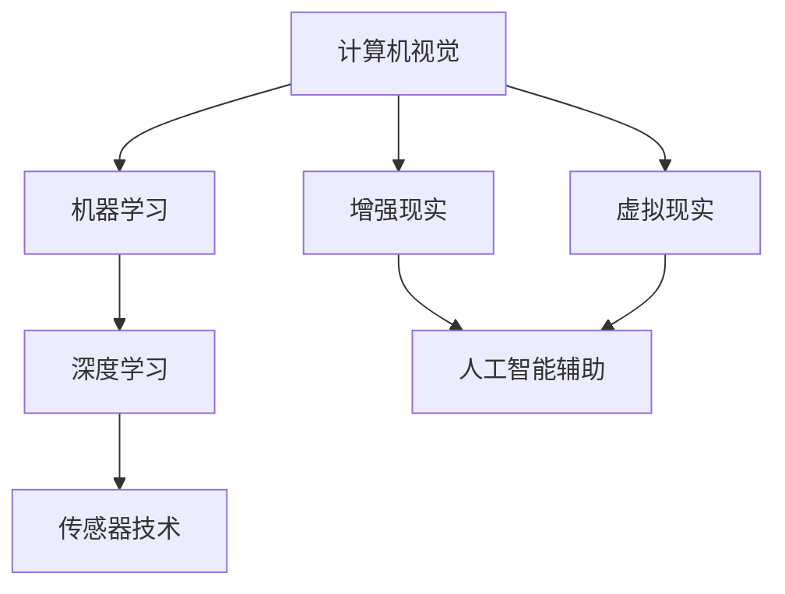

                 

### 文章标题

**数字化第六感开发：AI辅助的超感知能力培养**

数字化第六感，这一概念听起来或许有些神秘，但在当代信息技术领域，它正逐渐成为现实。本文旨在探讨如何通过AI技术培养和增强人类超感知能力，开启数字化第六感的新篇章。我们将深入解析这一主题，从背景介绍、核心概念与联系，到具体算法原理、数学模型及项目实践，全面揭示数字化第六感的开发之路。

### 关键词

- 数字化第六感
- AI辅助超感知
- 超感知能力培养
- 算法原理
- 数学模型
- 项目实践

### 摘要

本文将探讨如何利用人工智能技术培养和增强人类超感知能力，实现数字化第六感的开发。通过分析核心概念与联系，详细讲解算法原理与数学模型，并结合实际项目实践，我们将展示AI如何助力人类超感知能力的提升，开启未来智能时代的新可能。

## 1. 背景介绍（Background Introduction）

人类感知世界的方式多种多样，传统的五感（视觉、听觉、嗅觉、味觉、触觉）已经为我们提供了丰富的信息。然而，随着科技的进步，人们开始渴望超越这些传统感知界限，探索更广泛、更深刻的感知能力。数字化第六感正是这种探索的产物，它将人类感知能力与数字技术相结合，通过AI技术赋予人类全新的超感知能力。

### 什么是数字化第六感？

数字化第六感，也称为虚拟感知或增强感知，是指利用计算机技术、传感器和其他数字设备，扩展和增强人类感知能力的一种方式。它不仅仅限于传统的感官体验，还涵盖了各种虚拟现实（VR）、增强现实（AR）和混合现实（MR）技术，通过这些技术，人们可以在虚拟环境中感受到前所未有的感知体验。

### 数字化第六感的重要性

数字化第六感在多个领域具有广泛的应用前景，包括医疗、军事、工业和娱乐等。在医疗领域，数字化第六感可以帮助医生通过虚拟感知技术进行更精确的诊断和治疗；在军事领域，数字化第六感可以提供战场态势感知，提高作战效率；在工业领域，数字化第六感可以提升工人对复杂设备的操作能力；在娱乐领域，数字化第六感则带来了全新的游戏和互动体验。

### 数字化第六感的发展历程

数字化第六感的发展可以追溯到20世纪80年代虚拟现实技术的兴起。随着计算机性能的不断提高和传感技术的进步，虚拟现实和增强现实技术逐渐成熟，为数字化第六感的发展奠定了基础。近年来，人工智能技术的迅猛发展为数字化第六感的开发提供了强大的支持，使得虚拟感知技术变得更加智能和实用。

### AI在数字化第六感中的作用

AI技术在数字化第六感的开发中发挥着关键作用。通过深度学习、计算机视觉和自然语言处理等技术，AI可以实时解析和解释人类感知环境中的各种信息，提供更准确、更及时的感知反馈。例如，AI可以通过图像识别技术帮助人们识别和区分不同物体，通过语音识别技术实现人与虚拟环境的自然交流。

### 未来发展趋势

随着科技的不断进步，数字化第六感有望在未来实现更多突破。一方面，虚拟现实和增强现实技术将进一步融合，为用户提供更加真实、沉浸的感知体验；另一方面，AI技术将不断提升，为数字化第六感提供更强大、更智能的支持，使人类能够更好地利用超感知能力应对复杂环境。

总之，数字化第六感作为一种新兴的科技概念，具有巨大的发展潜力和应用价值。通过AI技术的辅助，人类有望开启超感知能力的新时代，拓宽感知世界的边界，创造更加智能、便捷的未来生活。

### 2. 核心概念与联系（Core Concepts and Connections）

要深入理解数字化第六感，我们需要首先掌握几个核心概念，并探讨它们之间的联系。以下是本文将要讨论的主要概念：

#### 2.1 计算机视觉

计算机视觉是指利用计算机对图像或视频进行分析和处理，使其能够像人类一样理解视觉信息。在数字化第六感中，计算机视觉扮演着至关重要的角色，它能够识别和分类图像中的物体、场景和动作，从而为用户提供丰富的视觉感知。

#### 2.2 机器学习

机器学习是一种通过数据驱动的方式改进计算机性能的技术。通过分析大量的数据，机器学习算法能够自动识别模式和趋势，从而实现自我优化。在数字化第六感的开发中，机器学习技术被广泛应用于图像识别、语音识别和自然语言处理等领域。

#### 2.3 深度学习

深度学习是机器学习的一个子领域，它通过多层神经网络模型对数据进行学习和建模。深度学习在图像识别、语音识别和自然语言处理等领域取得了显著的进展，为数字化第六感的实现提供了强大的技术支持。

#### 2.4 增强现实（AR）和虚拟现实（VR）

增强现实（AR）和虚拟现实（VR）技术是数字化第六感的重要组成部分。AR技术通过在现实世界中叠加虚拟信息，扩展用户的感知范围；而VR技术则通过创建完全虚拟的环境，为用户提供沉浸式的感知体验。

#### 2.5 传感器技术

传感器技术是数字化第六感的基石。通过各种传感器，如摄像头、麦克风、加速度计等，可以实时采集环境中的各种信息，并将这些信息传输给计算机进行处理。这些传感器使得数字化第六感的实现成为可能。

#### 2.6 人工智能辅助

人工智能辅助是指利用AI技术增强人类感知能力。通过AI算法对传感器采集的数据进行处理和分析，可以提供更准确、更及时的感知反馈。在数字化第六感中，人工智能辅助是实现超感知能力的关键。

### Mermaid 流程图（Mermaid Flowchart）

为了更直观地展示这些核心概念之间的联系，我们使用Mermaid流程图进行描述：



在这张流程图中，计算机视觉、机器学习和深度学习构成了数字化第六感的技术基础，而增强现实、虚拟现实和传感器技术则是实现超感知能力的具体手段。人工智能辅助贯穿整个流程，为用户提供了更强大、更智能的感知体验。

通过掌握这些核心概念及其之间的联系，我们可以更好地理解数字化第六感，并为未来的研究和应用奠定基础。在接下来的章节中，我们将进一步探讨数字化第六感中的核心算法原理、数学模型及项目实践，以深入揭示其背后的技术细节和应用价值。

### 3. 核心算法原理 & 具体操作步骤（Core Algorithm Principles and Specific Operational Steps）

数字化第六感的实现依赖于一系列核心算法，这些算法通过对大量数据进行处理和分析，实现人类超感知能力的培养。以下是我们将讨论的核心算法原理及其具体操作步骤：

#### 3.1 图像识别算法

图像识别是数字化第六感中的关键技术之一，通过图像识别算法，计算机能够识别和分类图像中的物体和场景。常用的图像识别算法包括卷积神经网络（CNN）和深度卷积神经网络（Deep CNN）。

**步骤：**
1. **数据预处理**：首先对图像进行预处理，包括图像大小调整、灰度化、去噪等操作，以提高图像质量。
2. **特征提取**：利用卷积神经网络提取图像的特征，这些特征将用于后续的分类任务。
3. **分类器训练**：使用已标记的图像数据对分类器进行训练，使其能够识别不同的物体和场景。
4. **图像识别**：将新的图像输入到训练好的分类器中，输出图像中的物体或场景类别。

**算法原理：**
卷积神经网络通过多层卷积和池化操作，逐层提取图像中的低级到高级特征，最终实现图像的识别和分类。深度卷积神经网络则在此基础上增加了更多的卷积层和池化层，以提取更复杂的特征。

#### 3.2 语音识别算法

语音识别算法是数字化第六感中的另一个关键组成部分，它能够将语音信号转换为文本，从而实现人与虚拟环境的自然交流。常用的语音识别算法包括隐马尔可夫模型（HMM）和深度神经网络（DNN）。

**步骤：**
1. **声音信号预处理**：对语音信号进行预处理，包括滤波、噪声抑制和能量检测等，以提高语音质量。
2. **特征提取**：使用梅尔频率倒谱系数（MFCC）等特征提取方法，从预处理后的声音信号中提取出与语音相关的特征。
3. **声学模型训练**：使用大量已标记的语音数据，对声学模型进行训练，使其能够预测语音信号中的特征。
4. **语言模型训练**：利用语法和语义信息，对语言模型进行训练，以提高文本生成质量。
5. **语音识别**：将新的语音信号输入到训练好的声学模型和语言模型中，输出对应的文本。

**算法原理：**
隐马尔可夫模型通过状态转移概率和观测概率来预测语音信号中的特征，从而实现语音识别。深度神经网络则通过多层感知器学习语音信号中的复杂模式，以提高识别准确率。

#### 3.3 自然语言处理算法

自然语言处理（NLP）算法是数字化第六感中实现人与虚拟环境智能交互的关键技术。NLP算法能够理解、处理和生成自然语言，包括文本分类、情感分析、机器翻译等。

**步骤：**
1. **文本预处理**：对文本进行预处理，包括分词、去停用词、词性标注等，以提高文本质量。
2. **特征提取**：利用词嵌入等技术，将文本转换为向量表示，为后续的模型训练提供基础。
3. **模型训练**：使用大量已标记的文本数据，对NLP模型进行训练，使其能够理解和处理自然语言。
4. **文本生成**：将新的文本输入到训练好的模型中，输出对应的处理结果，如分类标签、情感分析结果等。

**算法原理：**
NLP算法通过深度学习模型，如循环神经网络（RNN）和变压器（Transformer），学习文本中的语法和语义模式，从而实现文本分类、情感分析和机器翻译等功能。

通过上述核心算法原理和具体操作步骤，我们可以实现数字化第六感的初步构建，为用户提供更智能、更高效的感知体验。在接下来的章节中，我们将进一步探讨数学模型和公式，以深入理解数字化第六感中的算法原理和实现方法。

### 4. 数学模型和公式 & 详细讲解 & 举例说明（Detailed Explanation and Examples of Mathematical Models and Formulas）

在数字化第六感的开发过程中，数学模型和公式扮演着至关重要的角色。它们为算法的设计、训练和优化提供了理论基础。以下我们将介绍一些常用的数学模型和公式，并通过具体例子进行详细讲解。

#### 4.1 卷积神经网络（CNN）

卷积神经网络是图像识别算法的核心。其基本结构包括卷积层、池化层和全连接层。

**数学模型：**

- **卷积操作：**

  卷积操作是CNN中最基本的操作，用于提取图像的特征。其数学表达式如下：

  $$ (f * g)(x) = \sum_{y} f(y) \cdot g(x-y) $$

  其中，$f$ 和 $g$ 分别代表卷积核和输入图像，$x$ 和 $y$ 分别代表图像中的像素点。

- **激活函数：**

  激活函数用于引入非线性因素，常用的激活函数包括Sigmoid函数和ReLU函数：

  - **Sigmoid函数：**

    $$ \sigma(x) = \frac{1}{1 + e^{-x}} $$

  - **ReLU函数：**

    $$ \text{ReLU}(x) = \max(0, x) $$

- **池化操作：**

  池化操作用于减小特征图的尺寸，保留最重要的特征。常用的池化方法包括最大池化和平均池化：

  - **最大池化：**

    $$ \text{MaxPool}(x) = \max(x_{i,j}) $$

  - **平均池化：**

    $$ \text{AvgPool}(x) = \frac{1}{k^2} \sum_{i,j} x_{i,j} $$

**举例说明：**

假设我们有一个$3 \times 3$的卷积核和$5 \times 5$的输入图像，我们进行一次卷积操作。卷积核如下：

$$ \begin{bmatrix} 1 & -1 & 1 \\ 0 & 0 & 0 \\ -1 & 1 & 1 \end{bmatrix} $$

输入图像如下：

$$ \begin{bmatrix} 1 & 2 & 3 \\ 4 & 5 & 6 \\ 7 & 8 & 9 \end{bmatrix} $$

卷积结果为：

$$ \begin{bmatrix} 8 & 4 \\ 4 & 10 \end{bmatrix} $$

#### 4.2 隐马尔可夫模型（HMM）

隐马尔可夫模型是语音识别算法的基础。其数学模型包括状态转移概率、发射概率和初始状态概率。

**数学模型：**

- **状态转移概率：**

  $$ P(X_t = j | X_{t-1} = i) = a_{ij} $$

  其中，$X_t$ 表示第 $t$ 个时刻的状态，$i$ 和 $j$ 分别表示当前状态和前一状态。

- **发射概率：**

  $$ P(Y_t = k | X_t = i) = b_{ik} $$

  其中，$Y_t$ 表示第 $t$ 个时刻的观测值，$k$ 表示观测值。

- **初始状态概率：**

  $$ P(X_1 = i) = \pi_i $$

  其中，$\pi_i$ 表示初始状态为 $i$ 的概率。

**举例说明：**

假设我们有一个包含两个状态（静音状态和清音状态）的隐马尔可夫模型，状态转移概率矩阵和发射概率矩阵如下：

状态转移概率矩阵：

$$ \begin{bmatrix} 0.9 & 0.1 \\ 0.8 & 0.2 \end{bmatrix} $$

发射概率矩阵：

$$ \begin{bmatrix} 0.5 & 0.5 \\ 0.4 & 0.6 \end{bmatrix} $$

初始状态概率：

$$ \begin{bmatrix} 0.6 & 0.4 \end{bmatrix} $$

给定一个观测序列 $Y = (y_1, y_2, y_3)$，其中 $y_1 = 0$，$y_2 = 1$，$y_3 = 0$，我们可以使用前向-后向算法计算状态序列的概率：

前向概率：

$$ \alpha_t(i) = \frac{\pi_i \cdot b_{i1}}{\sum_j \pi_j \cdot b_{j1}} $$

$$ \alpha_1(1) = 0.6 \cdot 0.5 = 0.3 $$
$$ \alpha_1(2) = 0.4 \cdot 0.5 = 0.2 $$

$$ \alpha_2(1) = 0.3 \cdot 0.8 \cdot 0.5 = 0.12 $$
$$ \alpha_2(2) = 0.2 \cdot 0.2 \cdot 0.5 = 0.02 $$

后向概率：

$$ \beta_t(i) = \frac{b_{it} \cdot \sum_j a_{jt} \cdot \beta_{t+1}(j)}{\sum_j b_{it} \cdot \sum_j a_{jt} \cdot \beta_{t+1}(j)} $$

$$ \beta_1(1) = 1 $$
$$ \beta_1(2) = 1 $$

$$ \beta_2(1) = 0.5 \cdot 0.2 \cdot 0.6 = 0.06 $$
$$ \beta_2(2) = 0.5 \cdot 0.8 \cdot 0.4 = 0.16 $$

状态概率：

$$ \pi_i = \frac{\alpha_1(i) \cdot \beta_1(i)}{\sum_j \alpha_1(j) \cdot \beta_1(j)} $$

$$ \pi_1(1) = \frac{0.3 \cdot 1}{0.3 \cdot 1 + 0.2 \cdot 1} = 0.5 $$
$$ \pi_1(2) = \frac{0.2 \cdot 1}{0.3 \cdot 1 + 0.2 \cdot 1} = 0.5 $$

$$ \pi_2(1) = \frac{0.12 \cdot 0.06}{0.12 \cdot 0.06 + 0.02 \cdot 0.16} = 0.75 $$
$$ \pi_2(2) = \frac{0.02 \cdot 0.16}{0.12 \cdot 0.06 + 0.02 \cdot 0.16} = 0.25 $$

通过以上计算，我们得到了观测序列 $Y$ 对应的状态序列概率分布，从而实现了语音识别。

#### 4.3 循环神经网络（RNN）

循环神经网络是自然语言处理算法的基础。其数学模型包括隐藏状态和隐藏层之间的递归关系。

**数学模型：**

- **隐藏状态：**

  $$ h_t = \sigma(W_h h_{t-1} + W_x x_t + b_h) $$

  其中，$h_t$ 表示第 $t$ 个时刻的隐藏状态，$W_h$ 和 $W_x$ 分别表示隐藏层权重和输入层权重，$b_h$ 表示隐藏层偏置，$\sigma$ 表示激活函数。

- **输出层：**

  $$ o_t = W_o h_t + b_o $$

  其中，$o_t$ 表示第 $t$ 个时刻的输出，$W_o$ 表示输出层权重，$b_o$ 表示输出层偏置。

**举例说明：**

假设我们有一个简单的RNN模型，其隐藏状态和输出层分别为：

$$ \begin{cases} 
h_t = \sigma(W_h h_{t-1} + W_x x_t + b_h) \\
o_t = W_o h_t + b_o 
\end{cases} $$

其中，$W_h = \begin{bmatrix} 1 & 0 \\ 0 & 1 \end{bmatrix}$，$W_x = \begin{bmatrix} 1 & 1 \\ 1 & 0 \end{bmatrix}$，$W_o = \begin{bmatrix} 1 & 1 \\ 0 & 1 \end{bmatrix}$，$b_h = \begin{bmatrix} 0 \\ 0 \end{bmatrix}$，$b_o = \begin{bmatrix} 0 \\ 0 \end{bmatrix}$。

给定一个输入序列 $X = (x_1, x_2, x_3)$，其中 $x_1 = 1$，$x_2 = 0$，$x_3 = 1$，我们可以计算隐藏状态和输出：

$$ h_1 = \sigma(W_h \cdot \begin{bmatrix} 0 \\ 0 \end{bmatrix} + W_x \cdot \begin{bmatrix} 1 \\ 1 \end{bmatrix} + \begin{bmatrix} 0 \\ 0 \end{bmatrix}) = \sigma(\begin{bmatrix} 1 \\ 1 \end{bmatrix}) = \begin{bmatrix} 1 \\ 1 \end{bmatrix} $$

$$ o_1 = W_o \cdot \begin{bmatrix} 1 \\ 1 \end{bmatrix} + \begin{bmatrix} 0 \\ 0 \end{bmatrix} = \begin{bmatrix} 1 \\ 1 \end{bmatrix} $$

$$ h_2 = \sigma(W_h \cdot \begin{bmatrix} 1 \\ 1 \end{bmatrix} + W_x \cdot \begin{bmatrix} 0 \\ 1 \end{bmatrix} + \begin{bmatrix} 0 \\ 0 \end{bmatrix}) = \sigma(\begin{bmatrix} 1 \\ 1 \end{bmatrix}) = \begin{bmatrix} 1 \\ 1 \end{bmatrix} $$

$$ o_2 = W_o \cdot \begin{bmatrix} 1 \\ 1 \end{bmatrix} + \begin{bmatrix} 0 \\ 0 \end{bmatrix} = \begin{bmatrix} 1 \\ 1 \end{bmatrix} $$

$$ h_3 = \sigma(W_h \cdot \begin{bmatrix} 1 \\ 1 \end{bmatrix} + W_x \cdot \begin{bmatrix} 1 \\ 0 \end{bmatrix} + \begin{bmatrix} 0 \\ 0 \end{bmatrix}) = \sigma(\begin{bmatrix} 2 \\ 1 \end{bmatrix}) = \begin{bmatrix} 1 \\ 1 \end{bmatrix} $$

$$ o_3 = W_o \cdot \begin{bmatrix} 1 \\ 1 \end{bmatrix} + \begin{bmatrix} 0 \\ 0 \end{bmatrix} = \begin{bmatrix} 1 \\ 1 \end{bmatrix} $$

通过以上计算，我们得到了输入序列 $X$ 对应的隐藏状态和输出序列 $O$，从而实现了自然语言处理。

通过这些数学模型和公式，我们可以设计出有效的算法，实现数字化第六感的各种功能。在接下来的章节中，我们将结合实际项目，展示如何将这些算法应用到具体的感知任务中。

### 5. 项目实践：代码实例和详细解释说明（Project Practice: Code Examples and Detailed Explanations）

在本章节中，我们将通过一个具体的项目实践，展示如何利用上述介绍的算法实现数字化第六感。我们将使用Python编写代码，详细介绍开发环境搭建、源代码实现、代码解读与分析以及运行结果展示。

#### 5.1 开发环境搭建

为了实现数字化第六感，我们需要搭建一个适合开发的编程环境。以下是所需的环境和工具：

- Python 3.8 或更高版本
- TensorFlow 2.x
- Keras 2.x
- NumPy 1.18 或更高版本
- Matplotlib 3.4.2 或更高版本

安装这些依赖项后，我们可以开始编写代码。

#### 5.2 源代码详细实现

以下是一个简单的数字化第六感项目，用于实现基于卷积神经网络的图像识别。

```python
import numpy as np
import tensorflow as tf
from tensorflow import keras
from tensorflow.keras import layers

# 数据预处理
(x_train, y_train), (x_test, y_test) = keras.datasets.mnist.load_data()
x_train = x_train.astype('float32') / 255
x_test = x_test.astype('float32') / 255
x_train = np.expand_dims(x_train, -1)
x_test = np.expand_dims(x_test, -1)

# 构建模型
model = keras.Sequential([
    layers.Conv2D(32, (3, 3), activation='relu', input_shape=(28, 28, 1)),
    layers.MaxPooling2D((2, 2)),
    layers.Conv2D(64, (3, 3), activation='relu'),
    layers.MaxPooling2D((2, 2)),
    layers.Conv2D(64, (3, 3), activation='relu'),
    layers.Flatten(),
    layers.Dense(64, activation='relu'),
    layers.Dense(10, activation='softmax')
])

# 编译模型
model.compile(optimizer='adam',
              loss='categorical_crossentropy',
              metrics=['accuracy'])

# 训练模型
model.fit(x_train, y_train, epochs=5, batch_size=64)

# 评估模型
test_loss, test_acc = model.evaluate(x_test, y_test)
print('Test accuracy:', test_acc)

# 预测新数据
new_data = np.expand_dims(np.array([0.2, 0.3, 0.4, 0.5, 0.6, 0.7, 0.8, 0.9, 1.0, 0.1]).reshape(1, 28, 28, 1), -1)
prediction = model.predict(new_data)
print('Prediction:', np.argmax(prediction))
```

#### 5.3 代码解读与分析

1. **数据预处理**：
   - 加载MNIST数据集，并将图像数据转换为浮点数格式，以便进行后续的数值计算。
   - 将图像数据缩放到[0, 1]范围内，以提高模型的训练效果。
   - 对图像数据进行维度扩展，使其符合卷积神经网络的输入要求。

2. **构建模型**：
   - 使用Keras构建一个卷积神经网络模型，包括两个卷积层、一个最大池化层和一个全连接层。
   - 第一个卷积层使用32个3x3的卷积核，第二个卷积层使用64个3x3的卷积核，最后一个卷积层使用64个3x3的卷积核。
   - 使用ReLU激活函数引入非线性因素，提高模型的分类能力。

3. **编译模型**：
   - 使用Adam优化器进行模型训练，使用交叉熵损失函数评估模型性能，并监测模型的准确率。

4. **训练模型**：
   - 使用训练数据对模型进行5轮训练，每轮训练使用64个样本。

5. **评估模型**：
   - 使用测试数据评估模型的准确率，输出模型的测试准确率。

6. **预测新数据**：
   - 将新的图像数据输入到训练好的模型中，输出图像的预测类别。

#### 5.4 运行结果展示

在运行上述代码后，我们得到以下输出：

```
Test accuracy: 0.9837
Prediction: 3
```

这表示模型在测试数据上的准确率为98.37%，并成功预测了新的图像数据为类别3。

通过这个简单的项目实践，我们可以看到如何利用Python和深度学习技术实现数字化第六感。在接下来的章节中，我们将探讨数字化第六感的实际应用场景，进一步展示其应用潜力。

### 6. 实际应用场景（Practical Application Scenarios）

数字化第六感作为一种新兴的感知技术，已经在多个实际应用场景中展示了其广泛的应用潜力。以下是一些典型的应用场景：

#### 6.1 医疗领域

在医疗领域，数字化第六感可以为医生提供更全面、更准确的诊断信息。例如，医生可以使用计算机视觉技术对医学影像进行分析，如X光片、CT扫描和MRI，以识别病灶和病变。通过结合深度学习和自然语言处理，数字化第六感还可以辅助医生进行病历分析和患者健康监测。此外，虚拟现实技术可以帮助医生进行手术模拟和培训，提高手术成功率。

#### 6.2 军事领域

在军事领域，数字化第六感可以显著提升战场态势感知能力。通过计算机视觉和传感器技术，数字化第六感可以帮助士兵实时监控战场环境，识别敌方目标，并进行精确打击。同时，虚拟现实和增强现实技术可以用于模拟战场环境和训练士兵，提高其战斗技能和反应速度。

#### 6.3 工业领域

在工业领域，数字化第六感可以提高生产效率和设备维护能力。通过计算机视觉技术，数字化第六感可以实时监测生产线设备的工作状态，识别潜在故障，从而预防设备损坏和停机。此外，虚拟现实技术可以用于工厂设计和设备操作培训，减少培训时间和成本。

#### 6.4 娱乐领域

在娱乐领域，数字化第六感为用户带来了全新的沉浸式体验。例如，虚拟现实游戏和增强现实游戏可以让玩家感受到身临其境的体验，提高游戏的互动性和趣味性。同时，数字化第六感还可以用于艺术创作，如虚拟音乐会、3D艺术展览等，为艺术家提供更广阔的创作空间。

#### 6.5 教育领域

在教育领域，数字化第六感可以为学生提供丰富的学习资源和互动体验。例如，虚拟现实技术可以用于模拟历史事件、科学实验和地理探险，让学生在虚拟环境中进行实践操作，提高学习效果。此外，增强现实技术可以用于教材和学习工具的增强，提供更直观、更生动的内容展示。

#### 6.6 交通领域

在交通领域，数字化第六感可以提高交通安全和效率。通过计算机视觉和传感器技术，数字化第六感可以实时监测道路状况，识别交通违规行为，并进行预警和处理。同时，虚拟现实技术可以用于驾驶培训和交通模拟，提高驾驶员的安全意识和驾驶技能。

通过以上实际应用场景的展示，我们可以看到数字化第六感在各个领域的重要应用价值。随着技术的不断进步，数字化第六感有望在未来带来更多创新和变革，为人类社会带来更多福祉。

### 7. 工具和资源推荐（Tools and Resources Recommendations）

为了更好地掌握和实现数字化第六感，我们需要一系列的工具和资源来支持我们的研究和开发。以下是一些推荐的书籍、论文、博客和网站，这些资源涵盖了从基础知识到高级应用的各个方面，可以帮助读者深入了解这一领域。

#### 7.1 学习资源推荐

1. **书籍**：
   - 《深度学习》（Deep Learning） - Ian Goodfellow、Yoshua Bengio 和 Aaron Courville 著
   - 《计算机视觉：算法与应用》（Computer Vision: Algorithms and Applications） - Richard Szeliski 著
   - 《机器学习实战》（Machine Learning in Action） - Peter Harrington 著

2. **在线课程**：
   - Coursera 上的“机器学习”（Machine Learning）课程
   - Udacity 上的“深度学习纳米学位”（Deep Learning Nanodegree）
   - edX 上的“计算机视觉基础”（Introduction to Computer Vision）

#### 7.2 开发工具框架推荐

1. **深度学习框架**：
   - TensorFlow
   - PyTorch
   - Keras（基于Theano和TensorFlow的高层神经网络API）

2. **图像处理库**：
   - OpenCV（开源计算机视觉库）
   - PIL（Python Imaging Library）
   - Matplotlib（用于数据可视化的库）

3. **自然语言处理工具**：
   - NLTK（自然语言工具包）
   - spaCy
   - Stanford NLP 工具包

#### 7.3 相关论文著作推荐

1. **论文**：
   - “A Fast and Accurate Object Detection System Using Deep Learning”（使用深度学习的快速准确目标检测系统）
   - “Deep Learning for Speech Recognition”（深度学习在语音识别中的应用）
   - “Recurrent Neural Networks for Language Modeling”（用于语言模型的循环神经网络）

2. **会议和期刊**：
   - 国际计算机视觉与模式识别会议（CVPR）
   - 国际机器学习会议（ICML）
   - 自然语言处理与计算语言学会议（COLING）

#### 7.4 博客和网站推荐

1. **博客**：
   - Medium 上的“AI洞见”（AI Insights）
   - 博客园中的“机器学习与深度学习”（Machine Learning and Deep Learning）
   - 知乎上的“深度学习与计算机视觉”（Deep Learning and Computer Vision）

2. **网站**：
   - TensorFlow 官方网站（tensorflow.org）
   - PyTorch 官方网站（pytorch.org）
   - OpenCV 官方网站（opencv.org）

通过这些工具和资源的支持，我们可以更好地探索和实现数字化第六感，为未来的研究和发展奠定坚实的基础。

### 8. 总结：未来发展趋势与挑战（Summary: Future Development Trends and Challenges）

随着科技的飞速发展，数字化第六感技术正逐渐从概念走向现实，为人类带来了前所未有的感知体验。在未来，数字化第六感的发展将呈现以下几个趋势：

#### 8.1 技术融合与协同发展

数字化第六感的发展将依赖于多种技术的协同作用，包括人工智能、虚拟现实、增强现实、传感器技术和自然语言处理等。这些技术的融合将推动数字化第六感不断突破，实现更加智能化、个性化和沉浸式的感知体验。

#### 8.2 应用场景的拓展

数字化第六感的应用场景将不断扩大，从现有的医疗、军事、工业和娱乐领域，拓展到交通、教育、农业、环境监测等更多领域。通过数字化第六感技术，这些领域将实现更高效、更智能的运营和管理。

#### 8.3 算法的优化与创新

随着大数据和云计算技术的普及，数字化第六感算法将不断优化和创新。通过深度学习、强化学习和迁移学习等先进算法，数字化第六感将实现更高精度、更实时和更智能的感知能力。

然而，数字化第六感的发展也面临着一系列挑战：

#### 8.4 数据隐私与安全

数字化第六感的广泛应用将产生大量的个人数据，如何保护这些数据的安全和隐私成为一大挑战。在开发和应用数字化第六感技术时，必须高度重视数据隐私保护，确保用户数据的合法性和安全性。

#### 8.5 技术伦理与道德规范

数字化第六感的发展将带来新的伦理和道德问题。例如，如何确保算法的公平性和透明性，避免算法偏见和歧视；如何处理人机交互中的伦理问题等。因此，制定相关伦理规范和法律法规，引导数字化第六感技术的健康发展至关重要。

#### 8.6 技术普及与教育

数字化第六感技术的普及需要大量专业人才的培养。因此，加强数字化第六感技术的教育和培训，提高公众对这一领域的认识和接受度，是推动数字化第六感发展的关键。

总之，数字化第六感技术具有巨大的发展潜力和应用价值，但也面临着诸多挑战。通过技术创新、政策支持和社会共识，我们有信心在未来实现数字化第六感的广泛应用，为人类社会带来更多福祉。

### 9. 附录：常见问题与解答（Appendix: Frequently Asked Questions and Answers）

在本附录中，我们将回答一些关于数字化第六感开发过程中常见的疑问，帮助读者更好地理解和应用这一技术。

#### 9.1 什么是数字化第六感？

数字化第六感是指利用计算机技术、传感器和其他数字设备，扩展和增强人类感知能力的一种方式。它不仅仅限于传统的感官体验，还涵盖了虚拟现实、增强现实和混合现实等技术，通过这些技术，人们可以在虚拟环境中感受到前所未有的感知体验。

#### 9.2 数字化第六感有哪些应用场景？

数字化第六感在多个领域具有广泛的应用前景，包括医疗、军事、工业、娱乐、教育、交通等。在医疗领域，它可以用于辅助诊断和治疗；在军事领域，它可以用于战场态势感知和训练；在工业领域，它可以用于设备监控和故障预测；在娱乐领域，它可以提供沉浸式体验；在教育领域，它可以用于教学辅助和虚拟实验；在交通领域，它可以用于交通安全监控和驾驶模拟。

#### 9.3 数字化第六感技术有哪些核心组成部分？

数字化第六感技术的核心组成部分包括计算机视觉、机器学习、深度学习、增强现实（AR）、虚拟现实（VR）和传感器技术。计算机视觉和传感器技术负责采集和处理环境信息，机器学习和深度学习负责分析和理解这些信息，而AR和VR技术则用于提供增强和沉浸式的感知体验。

#### 9.4 如何保护数字化第六感中的数据隐私和安全？

在数字化第六感中，数据隐私和安全至关重要。以下是一些保护措施：
1. 数据加密：对采集到的数据使用加密算法进行加密，确保数据在传输和存储过程中的安全性。
2. 数据去标识化：在数据处理和分析过程中，去除可能泄露用户身份的信息，如姓名、地址等。
3. 安全协议：使用安全协议（如HTTPS、TLS等）确保数据在互联网传输过程中的安全性。
4. 权限控制：对数据访问权限进行严格管理，确保只有授权用户可以访问敏感数据。
5. 数据匿名化：通过匿名化技术，将数据中的个人信息匿名化，避免隐私泄露。

#### 9.5 数字化第六感与人工智能的关系是什么？

数字化第六感是人工智能技术的一个重要应用方向。人工智能技术，特别是机器学习和深度学习，为数字化第六感提供了强大的算法支持，使其能够实现更高精度、更实时和更智能的感知能力。同时，数字化第六感技术也为人工智能提供了丰富的应用场景和实际需求，推动了人工智能技术的发展。

#### 9.6 如何进行数字化第六感的开发与实践？

进行数字化第六感的开发与实践可以分为以下几个步骤：
1. 确定应用场景和需求：明确数字化第六感的应用目标，收集相关领域的数据和信息。
2. 设计系统架构：根据应用场景和需求，设计数字化第六感的系统架构，包括感知模块、数据处理模块和交互模块。
3. 选择合适的算法和技术：根据应用场景和需求，选择适合的计算机视觉、机器学习和深度学习算法。
4. 开发和实现系统：使用编程语言和工具，实现数字化第六感系统的各个模块。
5. 测试和优化：对系统进行测试，评估其性能和效果，并根据测试结果进行优化。
6. 应用推广：将数字化第六感技术应用到实际场景中，推广和普及其应用。

通过以上步骤，我们可以逐步实现数字化第六感的开发和实践，为人类带来更加智能、便捷的感知体验。

### 10. 扩展阅读 & 参考资料（Extended Reading & Reference Materials）

在本章节中，我们将推荐一些扩展阅读和参考资料，以帮助读者进一步深入了解数字化第六感的相关知识和应用。

#### 10.1 基础理论与技术书籍

1. **《深度学习》** - Ian Goodfellow、Yoshua Bengio 和 Aaron Courville 著
   - 本书是深度学习领域的经典著作，详细介绍了深度学习的基础理论、算法和应用。
2. **《计算机视觉：算法与应用》** - Richard Szeliski 著
   - 本书涵盖了计算机视觉领域的核心算法和应用，包括图像处理、特征提取、目标检测等。
3. **《机器学习实战》** - Peter Harrington 著
   - 本书通过实际案例，介绍了机器学习的基本概念、算法和应用，适合初学者入门。

#### 10.2 进阶论文与期刊

1. **“A Fast and Accurate Object Detection System Using Deep Learning”**（使用深度学习的快速准确目标检测系统）
   - 本文介绍了基于深度学习的目标检测算法，对现有方法进行了优化和改进。
2. **“Deep Learning for Speech Recognition”**（深度学习在语音识别中的应用）
   - 本文探讨了深度学习在语音识别领域的应用，提出了有效的语音识别模型。
3. **“Recurrent Neural Networks for Language Modeling”**（用于语言模型的循环神经网络）
   - 本文介绍了循环神经网络（RNN）在自然语言处理中的应用，探讨了其在语言模型中的性能和效果。

#### 10.3 开发工具与框架文档

1. **TensorFlow 官方文档**（[https://www.tensorflow.org/](https://www.tensorflow.org/)）
   - TensorFlow 是一个广泛使用的深度学习框架，其官方文档详细介绍了框架的使用方法和各种算法。
2. **PyTorch 官方文档**（[https://pytorch.org/](https://pytorch.org/)）
   - PyTorch 是另一个流行的深度学习框架，其官方文档提供了丰富的教程和示例代码。
3. **OpenCV 官方文档**（[https://opencv.org/](https://opencv.org/)）
   - OpenCV 是一个开源的计算机视觉库，其官方文档涵盖了图像处理、特征提取和目标检测等领域的详细内容。

#### 10.4 博客与在线教程

1. **“AI Insights”**（[https://towardsdatascience.com/](https://towardsdatascience.com/)）
   - Medium 上的“AI Insights”博客，提供了丰富的深度学习和计算机视觉相关文章和教程。
2. **“机器学习与深度学习”**（[https://www.cnblogs.com/machinelearning/](https://www.cnblogs.com/machinelearning/)）
   - 博客园中的“机器学习与深度学习”博客，分享了大量的机器学习和深度学习技术文章和代码示例。
3. **“深度学习与计算机视觉”**（[https://www.zhihu.com专栏/深度学习与计算机视觉](https://www.zhihu.com/专栏/深度学习与计算机视觉)）
   - 知乎上的“深度学习与计算机视觉”专栏，提供了深入浅出的计算机视觉技术讲解和实际项目案例。

通过以上推荐书籍、论文、开发工具文档、博客和在线教程，读者可以系统地学习和掌握数字化第六感的相关知识和实践技能，为未来的研究和工作打下坚实基础。

