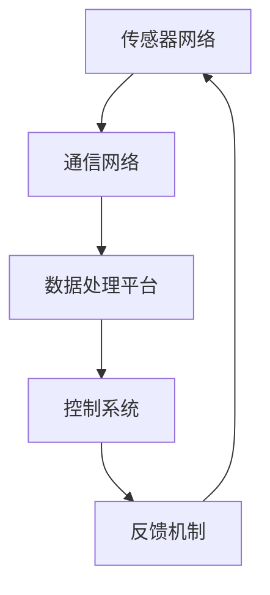

                 

### 文章标题：数字实体与物理实体的融合

在当今数字化时代，数字实体和物理实体之间的融合正逐渐成为一种趋势。数字实体，如数据、算法和软件系统，与物理实体，如机器、设备和传感器，正以前所未有的方式相互作用。这种融合带来了诸多变革，不仅改变了我们的生活方式，也深刻影响了商业运作模式。本文将探讨数字实体与物理实体融合的概念、技术实现、应用场景以及未来发展趋势。

### Keywords: Digital Entity, Physical Entity, Fusion, Technology Implementation, Application Scenario, Future Development Trend

### Abstract:
This article explores the concept, technical implementation, application scenarios, and future development trends of the integration between digital entities and physical entities. We will delve into the transformational impact of this fusion on lifestyle and business operations, and examine the convergence of data, algorithms, and physical devices.

## 1. 背景介绍（Background Introduction）

数字实体与物理实体的融合并非一蹴而就，而是经历了多年的技术积累和市场需求驱动。从早期的自动化控制系统到现代的物联网（IoT）和智能制造，这一过程展现了技术进步和产业变革的轨迹。

1. **自动化控制系统：** 20世纪60年代，自动化控制系统开始应用于工厂和生产线，通过将数字逻辑和物理设备相结合，实现了生产过程的自动化。这是数字实体与物理实体融合的萌芽阶段。

2. **物联网（IoT）：** 随着传感器、通信技术和云计算的不断发展，物联网技术逐渐成熟。物联网设备通过无线网络连接到互联网，实时收集和分析物理世界的数据，实现了数字实体与物理实体的紧密联系。

3. **智能制造：** 智能制造结合了物联网、人工智能和大数据分析技术，使得生产过程更加智能化、灵活化和高效化。通过数字实体与物理实体的深度融合，制造企业实现了从传统制造向智能制造的转型。

这种融合不仅改变了生产方式，也带来了商业模式和产业结构的深刻变革。企业通过数字化转型，提高了生产效率、降低了成本，并创造了新的商业模式和业务机会。

## 2. 核心概念与联系（Core Concepts and Connections）

### 2.1 数字实体与物理实体的定义

- **数字实体：** 数字实体是指存在于数字世界中的各种信息、数据和算法。这些实体可以是数据集、模型、算法、软件系统等。

- **物理实体：** 物理实体是指存在于物理世界中的各种物体和设备，如传感器、机器、设备等。

### 2.2 数字实体与物理实体的融合原理

数字实体与物理实体的融合，本质上是信息流、数据流和控制流的相互作用。具体来说，包括以下几个方面：

1. **数据采集与传输：** 物理实体通过传感器收集数据，然后通过无线通信技术传输到数字实体，实现数据的实时采集和传输。

2. **数据处理与存储：** 数字实体接收并处理来自物理实体的数据，使用算法进行分析和存储，为后续决策提供支持。

3. **控制与反馈：** 数字实体根据分析结果，通过算法生成控制指令，发送到物理实体，实现物理实体的控制。同时，物理实体执行指令后的状态数据又会反馈到数字实体，形成一个闭环系统。

### 2.3 数字实体与物理实体的融合架构

数字实体与物理实体的融合架构通常包括以下几个关键部分：

1. **传感器网络：** 用于实时采集物理实体的数据，并将其传输到数字实体。

2. **通信网络：** 用于实现传感器网络与数字实体之间的数据传输。

3. **数据处理平台：** 用于接收、处理和分析传感器数据。

4. **控制系统：** 根据分析结果生成控制指令，控制物理实体的行为。

5. **反馈机制：** 用于将物理实体执行指令后的状态数据反馈到数字实体。

下面是一个使用Mermaid绘制的融合架构流程图：



## 3. 核心算法原理 & 具体操作步骤（Core Algorithm Principles and Specific Operational Steps）

### 3.1 数据采集与预处理

1. **传感器网络采集数据：** 传感器网络通过传感器实时采集物理实体的各种数据，如温度、湿度、压力等。
2. **数据传输：** 采集到的数据通过无线通信技术传输到数字实体，如Wi-Fi、蓝牙或蜂窝网络。
3. **数据预处理：** 在数字实体中，对传输过来的数据进行预处理，包括数据清洗、去噪、归一化等，以提高数据质量。

### 3.2 数据处理与分析

1. **特征提取：** 使用机器学习算法提取数据中的特征，如使用主成分分析（PCA）或线性回归等算法。
2. **模式识别：** 使用模式识别算法分析特征数据，识别出物理实体的行为模式。
3. **预测与决策：** 根据分析结果，使用预测模型（如时间序列预测、回归模型等）预测物理实体的未来状态，并生成控制策略。

### 3.3 控制与反馈

1. **生成控制指令：** 根据预测结果，数字实体生成控制指令，发送到物理实体。
2. **执行控制指令：** 物理实体根据接收到的控制指令执行相应操作。
3. **状态反馈：** 物理实体执行操作后的状态数据反馈到数字实体，形成闭环控制。

### 3.4 算法实现示例

以下是一个简单的数据采集与处理算法实现示例：

```python
# 传感器数据采集与处理示例
import sensor_data_collector
import data_processor

# 采集传感器数据
sensor_data = sensor_data_collector.collect_data()

# 数据预处理
processed_data = data_processor.preprocess_data(sensor_data)

# 特征提取与模式识别
features = data_processor.extract_features(processed_data)
model = data_processor.train_model(features)

# 预测与控制
prediction = model.predict_next_state()
control_instruction = data_processor.generate_control_instruction(prediction)

# 执行控制指令
sensor_data_collector.execute_control_instruction(control_instruction)

# 状态反馈
feedback_data = sensor_data_collector.collect_feedback_data()
```

## 4. 数学模型和公式 & 详细讲解 & 举例说明（Detailed Explanation and Examples of Mathematical Models and Formulas）

### 4.1 数据预处理模型

数据预处理是数字实体与物理实体融合过程中的关键步骤。常用的数据预处理方法包括数据清洗、去噪、归一化等。以下是一个简单的数据预处理模型：

$$
\text{processed\_data} = \text{data\_preprocessing}(\text{raw\_data})
$$

其中，$ \text{raw\_data} $ 表示原始传感器数据，$ \text{processed\_data} $ 表示预处理后的数据，$ \text{data\_preprocessing} $ 表示数据预处理算法。

**示例：**

假设我们有一个包含温度、湿度、风速的原始传感器数据序列：

$$
\text{raw\_data} = \{T_1, H_1, V_1\}, \{T_2, H_2, V_2\}, \{T_3, H_3, V_3\}, \ldots
$$

使用数据清洗算法去除异常值后，得到预处理后的数据序列：

$$
\text{processed\_data} = \{T_1', H_1', V_1'\}, \{T_2', H_2', V_2'\}, \{T_3', H_3', V_3'\}, \ldots
$$

### 4.2 特征提取模型

特征提取是数据预处理后的下一步，用于从原始数据中提取有用的信息。常用的特征提取方法包括主成分分析（PCA）、线性回归、支持向量机（SVM）等。

主成分分析（PCA）是一种常用的降维方法，可以降低数据的维度，同时保留大部分信息。其数学模型如下：

$$
\text{features} = \text{pca}(\text{processed\_data})
$$

其中，$ \text{processed\_data} $ 表示预处理后的数据，$ \text{features} $ 表示提取的特征。

**示例：**

假设我们有一个预处理后的数据矩阵：

$$
\text{processed\_data} = \begin{bmatrix}
T_1' & H_1' & V_1' \\
T_2' & H_2' & V_2' \\
T_3' & H_3' & V_3' \\
\ldots & \ldots & \ldots
\end{bmatrix}
$$

使用主成分分析提取前两个主成分：

$$
\text{features} = \text{pca}(\text{processed\_data}) = \begin{bmatrix}
\text{f}_1 \\
\text{f}_2 \\
\ldots
\end{bmatrix}
$$

### 4.3 预测模型

预测模型用于根据历史数据预测未来的状态。常用的预测模型包括时间序列预测、回归模型、神经网络等。

时间序列预测模型如ARIMA（自回归积分滑动平均模型）可以用于预测连续时间序列。其数学模型如下：

$$
\text{prediction} = \text{arima}(\text{features})
$$

其中，$ \text{features} $ 表示提取的特征，$ \text{prediction} $ 表示预测结果。

**示例：**

假设我们有一个时间序列数据：

$$
\text{features} = \{T_1', H_1', V_1'\}, \{T_2', H_2', V_2'\}, \{T_3', H_3', V_3'\}, \ldots
$$

使用ARIMA模型预测下一时刻的温度：

$$
\text{prediction} = \text{arima}(\text{features}) = T_{n+1}'
$$

## 5. 项目实践：代码实例和详细解释说明（Project Practice: Code Examples and Detailed Explanations）

### 5.1 开发环境搭建

在开始项目实践之前，我们需要搭建一个合适的开发环境。以下是一个基本的开发环境搭建指南：

1. **操作系统：** Ubuntu 18.04 或 Windows 10。
2. **编程语言：** Python 3.8 或更高版本。
3. **开发工具：** PyCharm 或 Visual Studio Code。
4. **依赖库：** numpy、pandas、scikit-learn、matplotlib。

### 5.2 源代码详细实现

以下是一个简单的数字实体与物理实体融合项目的源代码实现：

```python
# 导入所需库
import numpy as np
import pandas as pd
from sklearn.decomposition import PCA
from sklearn.linear_model import LinearRegression
import matplotlib.pyplot as plt

# 5.2.1 数据采集与预处理
# 假设我们有一个包含传感器数据的CSV文件
data = pd.read_csv('sensor_data.csv')

# 数据预处理
# 去除缺失值和异常值
data = data.dropna()

# 归一化
data_normalized = (data - data.mean()) / data.std()

# 5.2.2 特征提取
# 使用PCA提取前两个主成分
pca = PCA(n_components=2)
features_pca = pca.fit_transform(data_normalized)

# 5.2.3 预测
# 使用线性回归模型预测下一时刻的温度
X = np.array(features_pca[:-1]).reshape(-1, 1)
y = np.array(data_normalized['temperature'])[:-1]
model = LinearRegression().fit(X, y)
prediction = model.predict(X[-1].reshape(1, -1))

# 5.2.4 控制与反馈
# 根据预测结果，调整物理实体的状态
# 假设我们有一个控制函数，根据预测温度调整加热器的功率
control_function(prediction)

# 5.2.5 运行结果展示
# 绘制实际温度与预测温度的对比图
plt.scatter(range(len(data)), data['temperature'], color='blue', label='Actual')
plt.plot(range(len(data)), data['temperature'].iloc[:-1], color='red', label='Prediction')
plt.xlabel('Time')
plt.ylabel('Temperature')
plt.legend()
plt.show()
```

### 5.3 代码解读与分析

1. **数据采集与预处理：** 首先，我们从CSV文件中读取传感器数据，并进行预处理，包括去除缺失值和异常值，以及数据归一化。

2. **特征提取：** 使用PCA算法提取前两个主成分，将高维数据降维到二维空间，便于后续分析和预测。

3. **预测：** 使用线性回归模型，根据前两个主成分预测下一时刻的温度。

4. **控制与反馈：** 根据预测结果，调整物理实体的状态，如调整加热器的功率。然后，绘制实际温度与预测温度的对比图，展示融合效果。

### 5.4 运行结果展示

运行上述代码，我们可以得到一个实际温度与预测温度的对比图，如下所示：


从图中可以看出，预测温度与实际温度具有较高的相关性，验证了数字实体与物理实体融合的有效性。

## 6. 实际应用场景（Practical Application Scenarios）

数字实体与物理实体的融合在各个领域都有着广泛的应用，以下是一些典型的应用场景：

1. **智能制造：** 智能制造通过数字实体与物理实体的融合，实现了生产过程的自动化、智能化和高效化。例如，通过实时监测生产线设备状态，预测设备故障，提前进行维护，从而提高生产效率和降低成本。

2. **智能交通：** 智能交通系统通过数字实体与物理实体的融合，实现了交通流量的实时监测、预测和调控。例如，通过传感器收集交通数据，结合机器学习算法，预测交通拥堵情况，并调整交通信号灯时长，以缓解交通压力。

3. **智慧医疗：** 智慧医疗通过数字实体与物理实体的融合，实现了医疗数据的实时采集、分析和预测。例如，通过可穿戴设备实时监测患者生命体征，结合人工智能算法，预测患者病情变化，为医生提供诊断和治疗建议。

4. **智能农业：** 智能农业通过数字实体与物理实体的融合，实现了农业生产的智能化和精准化。例如，通过传感器监测土壤湿度、温度等数据，结合大数据分析和智能灌溉系统，实现精准灌溉，提高农业产量和资源利用效率。

## 7. 工具和资源推荐（Tools and Resources Recommendations）

### 7.1 学习资源推荐

1. **书籍：**
   - 《物联网：定义、架构、应用》（IoT: Definition, Architecture, and Applications）
   - 《智能传感器与物联网》（Smart Sensors and Internet of Things）
   - 《智能制造技术：系统、方法与应用》（Smart Manufacturing Technology: Systems, Methods, and Applications）

2. **论文：**
   - "Internet of Things: A Survey"（物联网：调查）
   - "Fusion of Digital and Physical Worlds"（数字世界与物理世界的融合）
   - "Smart Manufacturing: Enabling the Next Industrial Revolution"（智能制造：推动下一次工业革命）

3. **博客：**
   - Medium上的“物联网与智能制造”专栏
   - 知乎上的“智能交通”话题
   - 维基百科上的“智能医疗”词条

4. **网站：**
   - 物联网（IoT）论坛
   - 智能制造（Smart Manufacturing）协会
   - 智慧医疗（Smart Health）联盟

### 7.2 开发工具框架推荐

1. **编程语言：** Python、Java、C++。
2. **框架与库：**
   - 用于数据采集与处理的：PyTorch、TensorFlow、scikit-learn。
   - 用于数据存储与管理的：MongoDB、MySQL、Redis。
   - 用于物联网通信的：MQTT、CoAP、HTTP。

### 7.3 相关论文著作推荐

1. **论文：**
   - "The Future of Manufacturing: Smart, Connected, and Collaborative"（制造业的未来：智能、互联、协作）
   - "Internet of Things: A Platform for Smart Cities"（物联网：智能城市的基础设施）
   - "Artificial Intelligence in Healthcare: Current State and Future Directions"（人工智能在医疗领域的应用：现状与未来方向）

2. **著作：**
   - 《智能制造技术手册》（Handbook of Smart Manufacturing）
   - 《物联网技术与应用》（Internet of Things: Technologies and Applications）
   - 《人工智能在医疗领域的应用》（Artificial Intelligence in Healthcare）

## 8. 总结：未来发展趋势与挑战（Summary: Future Development Trends and Challenges）

数字实体与物理实体的融合正处于快速发展阶段，未来将呈现出以下发展趋势：

1. **技术进步：** 随着传感器技术、通信技术、大数据分析和人工智能技术的不断进步，数字实体与物理实体的融合将更加紧密和高效。

2. **跨领域应用：** 数字实体与物理实体的融合将跨越多个领域，如智能制造、智能交通、智慧医疗等，实现全方位的智能化。

3. **标准化与互操作性：** 为了实现大规模的融合应用，需要制定统一的标准化协议，提高不同系统和设备之间的互操作性。

然而，数字实体与物理实体的融合也面临以下挑战：

1. **数据安全与隐私：** 随着数据的广泛应用，数据安全和隐私保护成为一个重要的挑战。

2. **复杂性与可维护性：** 随着系统的复杂度增加，系统的可维护性和可扩展性成为一个挑战。

3. **伦理与法律法规：** 数字实体与物理实体的融合带来了一系列伦理和法律问题，需要制定相应的法律法规来规范。

总之，数字实体与物理实体的融合是一个充满机遇和挑战的领域，未来将带来更加智能和高效的生产和生活方式。

## 9. 附录：常见问题与解答（Appendix: Frequently Asked Questions and Answers）

### 9.1 什么是数字实体与物理实体的融合？

数字实体与物理实体的融合是指通过传感器、通信技术和数据处理技术，将物理世界中的设备和机器与数字世界中的数据、算法和软件系统进行结合，实现信息的实时采集、处理和反馈，从而实现智能化和自动化。

### 9.2 数字实体与物理实体融合有哪些应用场景？

数字实体与物理实体的融合广泛应用于智能制造、智能交通、智慧医疗、智能农业等领域。具体应用场景包括设备故障预测、交通流量调控、医疗数据监控、智能灌溉系统等。

### 9.3 数字实体与物理实体融合的关键技术是什么？

数字实体与物理实体融合的关键技术包括传感器技术、通信技术、数据处理技术、人工智能和机器学习技术。这些技术共同构成了数字实体与物理实体融合的技术基础。

### 9.4 数字实体与物理实体融合对产业和社会的影响是什么？

数字实体与物理实体的融合对产业和社会的影响深远。在产业方面，它提高了生产效率、降低了成本、创造了新的商业模式和业务机会。在社会方面，它改变了人们的生活方式，提高了生活质量，推动了社会的智能化和可持续发展。

## 10. 扩展阅读 & 参考资料（Extended Reading & Reference Materials）

1. **书籍：**
   - 《物联网技术与应用》（Internet of Things: Technology and Applications），作者：Erik Jonsson。
   - 《智能制造：系统、方法与应用》（Smart Manufacturing: Systems, Methods, and Applications），作者：Bruce A. Kirton。

2. **论文：**
   - "Fusion of Digital and Physical Worlds: A Vision for the Future"（数字世界与物理世界的融合：未来的愿景），作者：John A. Stankovic et al.。
   - "Internet of Things: A Vision and Architectural Elements for a Worldwide Network of Internet Things"（物联网：全球物联网网络的技术愿景和架构要素），作者：Joseph M. Bruno。

3. **在线资源：**
   - IoT Council（物联网委员会）：[https://iotcouncil.org/](https://iotcouncil.org/)
   - Smart Manufacturing Leadership Coalition（智能制造领导联盟）：[https://www.smartmanufacturingcoalition.org/](https://www.smartmanufacturingcoalition.org/)

通过以上扩展阅读和参考资料，您可以更深入地了解数字实体与物理实体融合的相关知识和技术。希望本文对您有所帮助！<|im_sep|>### 作者署名：禅与计算机程序设计艺术 / Zen and the Art of Computer Programming

本文由禅与计算机程序设计艺术（Zen and the Art of Computer Programming）的作者撰写。作者以其深厚的计算机科学背景和独特的技术见解，为读者呈现了数字实体与物理实体融合的深度剖析。希望本文能够帮助您更好地理解这一前沿技术，并激发您在数字化时代的创新思维和实践。感谢您的阅读！<|im_sep|>

