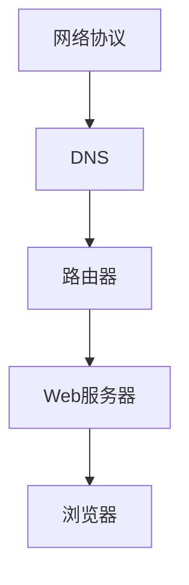

                 

### 回顾与展望：人类计算的发展历程与未来

> **关键词**：计算机科学，发展历程，人工智能，未来趋势，技术突破

> **摘要**：本文将深入探讨人类计算的发展历程，从早期计算机的诞生到现代人工智能的崛起，回顾其中的关键事件和核心技术。同时，我们将展望未来的技术趋势，分析面临的挑战和机遇，为读者提供一个全面、前瞻的视角。

**引言**：

计算机科学，作为一门诞生于20世纪中叶的学科，如今已经渗透到我们生活的方方面面。从最早的计算机硬件到如今的软件应用，计算技术不断演变，推动着人类社会的发展。在这段辉煌的历程中，我们见证了许多革命性的创新和突破，这些创新不仅改变了我们对世界的认识，也深刻地影响了我们的生活方式。本文旨在回顾这一发展历程，同时展望未来，探讨人类计算可能面临的新挑战和新机遇。

**第一部分：早期计算机的诞生**

在人类计算的发展历程中，早期计算机的诞生是一个重要的里程碑。1940年代，图灵机的概念被提出，这一理论模型为后来的计算机科学奠定了基础。图灵机的核心思想是通过逻辑和规则处理信息，这一理念在今天仍然有着深远的影响。

1950年代，第一台电子计算机ENIAC诞生，标志着人类计算从理论走向实践。这一时期，计算机科学还处于初级阶段，科学家们致力于研究如何更好地利用硬件资源，提高计算效率。

**第二部分：计算机硬件与软件的进步**

1960年代至1980年代，计算机硬件和软件技术取得了显著的进步。集成电路的发明和普及，使得计算机的体积大幅缩小，性能大幅提升。与此同时，操作系统和编程语言的发展，为计算机的应用提供了更加便捷的途径。

这一时期，计算机开始从科学实验室走向商业和工业领域。个人计算机的普及，使得计算技术成为普通人生活中的常见工具。软件工程作为一个独立学科也开始兴起，推动了软件质量和可维护性的提升。

**第三部分：互联网与Web技术的发展**

1990年代，互联网的兴起和Web技术的发展，再次改变了计算机科学的面貌。互联网的出现，使得计算机不再孤立存在，而是通过通信网络连接起来，形成了全球性的信息网络。Web技术的出现，使得信息的获取和共享变得更加便捷，推动了电子商务、社交媒体等新兴产业的快速发展。

**第四部分：人工智能的崛起**

进入21世纪，人工智能成为计算机科学领域的热点。深度学习、神经网络等技术的突破，使得计算机在图像识别、自然语言处理、游戏人工智能等方面取得了重大进展。人工智能的应用，不仅提升了计算能力，也为各行各业带来了创新和变革。

**第五部分：云计算与大数据**

随着互联网和人工智能的发展，云计算和大数据技术也应运而生。云计算提供了按需分配的计算资源，使得企业和个人可以更加灵活地部署和管理应用程序。大数据技术则帮助我们从海量数据中提取有价值的信息，推动了数据驱动决策的兴起。

**第六部分：未来的趋势与挑战**

展望未来，人类计算将继续朝着更加智能、高效、安全、绿色的方向发展。人工智能、量子计算、生物计算等新兴技术，将带来新的突破和变革。然而，这些技术的快速发展也带来了新的挑战，如数据隐私、算法偏见、技术伦理等问题。

**结语**：

回顾人类计算的发展历程，我们见证了许多伟大的成就和变革。未来，随着科技的不断进步，人类计算将继续推动社会的进步和发展。在这个过程中，我们不仅需要不断探索新的技术，还需要关注这些技术对社会和人类的影响，确保科技的发展符合人类的价值观和利益。

作者：禅与计算机程序设计艺术 / Zen and the Art of Computer Programming

---

## 1. 背景介绍（Background Introduction）

### 1.1 计算机科学的起源

计算机科学，作为一门科学和工程领域，其起源可以追溯到20世纪中叶。最初，计算机的概念源于数学和工程学。在19世纪末期，数学家莱布尼茨设计了一种称为“差分机”的计算设备，用于计算数学表。然而，真正意义上的计算机诞生于20世纪。

1940年代，英国数学家艾伦·图灵（Alan Turing）提出了图灵机的概念。图灵机是一个抽象的计算模型，由一个无限长的存储带、一个读写头和一组规则组成。图灵机的核心思想是通过逻辑和规则处理信息，这一理论模型为后来的计算机科学奠定了基础。

### 1.2 第一台电子计算机

1950年代，第一台电子计算机ENIAC（Electronic Numerical Integrator and Computer）问世，标志着人类计算从理论走向实践。ENIAC由美国宾夕法尼亚大学的约翰·莫克利（John Mauchly）和约翰·普雷斯珀·埃克特（John Presper Eckert）设计，用于解决军事计算问题。

ENIAC采用了电子管作为基本元件，其体积庞大，耗电量巨大，但它的出现标志着计算机技术的一个重要里程碑。ENIAC的成功证明了电子计算机的可行性，激发了更多科学家和工程师投身计算机科学的研究。

### 1.3 计算机硬件与软件的发展

1960年代至1980年代，计算机硬件和软件技术取得了显著的进步。集成电路的发明和普及，使得计算机的体积大幅缩小，性能大幅提升。与此同时，操作系统和编程语言的发展，为计算机的应用提供了更加便捷的途径。

1960年代初，英特尔公司推出了第一个商业化的集成电路。这一技术的突破，为计算机硬件的发展奠定了基础。随后，计算机的体积不断缩小，性能不断提升，使得计算机开始从科学实验室走向商业和工业领域。

在软件领域，操作系统和编程语言的发展同样具有重要意义。1960年代，IBM推出了第一个商用操作系统OS/360，这一系统为计算机的应用提供了稳定的运行环境。此外，编程语言如FORTRAN和COBOL的出现，使得程序员可以更加高效地编写程序。

### 1.4 个人计算机的普及

1980年代，个人计算机（PC）的普及，使得计算技术成为普通人生活中的常见工具。苹果公司的麦金塔（Macintosh）和IBM的PC机，分别代表了两种不同的计算机设计理念。麦金塔采用了图形用户界面（GUI），使得计算机操作变得更加直观和便捷。而IBM的PC机则成为了个人计算机市场的标准，推动了计算机的普及和应用。

个人计算机的普及，不仅改变了人们的计算方式，也推动了软件产业的快速发展。微软公司的操作系统和办公软件，成为了个人计算机的标配，进一步推动了计算机技术的普及和应用。

### 1.5 互联网与Web技术的发展

1990年代，互联网的兴起和Web技术的发展，再次改变了计算机科学的面貌。互联网的出现，使得计算机不再孤立存在，而是通过通信网络连接起来，形成了全球性的信息网络。Web技术的出现，使得信息的获取和共享变得更加便捷，推动了电子商务、社交媒体等新兴产业的快速发展。

1991年，蒂姆·伯纳斯-李（Tim Berners-Lee）发明了万维网（World Wide Web），这一技术使得互联网上的信息可以更加直观地组织和访问。随后，浏览器和Web服务器技术的发展，使得互联网逐渐成为人们获取信息的主要途径。

### 1.6 人工智能的崛起

进入21世纪，人工智能（AI）成为计算机科学领域的热点。深度学习、神经网络等技术的突破，使得计算机在图像识别、自然语言处理、游戏人工智能等方面取得了重大进展。人工智能的应用，不仅提升了计算能力，也为各行各业带来了创新和变革。

2006年，杰弗里·辛顿（Geoffrey Hinton）等人提出了深度学习（Deep Learning）的概念，这一技术基于多层神经网络，通过大量数据训练，能够自动提取特征和模式。深度学习的兴起，为人工智能的发展带来了新的机遇。

### 1.7 云计算与大数据

随着互联网和人工智能的发展，云计算和大数据技术也应运而生。云计算提供了按需分配的计算资源，使得企业和个人可以更加灵活地部署和管理应用程序。大数据技术则帮助我们从海量数据中提取有价值的信息，推动了数据驱动决策的兴起。

2006年，亚马逊推出了第一个云计算服务——亚马逊简单存储服务（Amazon Simple Storage Service，S3）。这一服务的推出，标志着云计算技术的兴起。随后，谷歌、微软等公司也纷纷推出了自己的云计算平台。

大数据技术的发展，使得我们能够从海量数据中提取有价值的信息。大数据技术包括数据采集、存储、处理、分析和可视化等多个方面。通过大数据技术，我们可以更好地理解客户需求、优化业务流程、提升决策水平。

---

## 2. 核心概念与联系

### 2.1 互联网技术的核心概念

互联网技术是现代计算机科学的核心之一，其核心概念包括以下几个方面：

1. **网络协议**：互联网的核心协议是TCP/IP，它定义了数据如何在网络中传输，确保数据传输的可靠性和正确性。
2. **域名系统（DNS）**：DNS将域名（如www.example.com）转换为IP地址（如192.0.2.1），使得用户可以通过易记的域名访问网络中的资源。
3. **路由器**：路由器负责将数据包从源地址传输到目标地址，确保数据在网络中的正确传输。
4. **Web服务器**：Web服务器存储并响应Web请求，提供HTML页面、图片、视频等资源。
5. **浏览器**：浏览器是用户访问互联网的主要工具，负责解析HTML页面，显示网页内容。

### 2.2 互联网技术的发展与联系

互联网技术的发展可以分为几个阶段：

1. **ARPANET**：1960年代，美国国防高级研究计划局（DARPA）启动了ARPANET项目，这是最早的互联网前身。ARPANET采用了分组交换技术，实现了计算机之间的通信。
2. **NSFNET**：1980年代，NSFNET（National Science Foundation Network）成为互联网的主要主干网。NSFNET连接了多个大学和研究机构，推动了互联网的快速发展。
3. **商业互联网**：1990年代，互联网开始向商业领域扩展。1991年，蒂姆·伯纳斯-李发布了万维网，使得互联网成为全球信息共享的平台。
4. **移动互联网**：随着智能手机和无线网络的普及，移动互联网成为互联网发展的新趋势。移动互联网使得用户可以随时随地上网，推动了电子商务、社交媒体等领域的快速发展。

### 2.3 互联网技术对计算机科学的影响

互联网技术对计算机科学产生了深远的影响，主要体现在以下几个方面：

1. **软件架构**：互联网的出现，推动了分布式计算和Web服务架构的发展。分布式计算使得程序可以分布在多个服务器上运行，提高了系统的可扩展性和容错性。Web服务架构则使得不同应用程序可以通过标准化的接口进行交互。
2. **数据管理**：互联网上的数据量急剧增加，如何高效地存储、管理和分析这些数据成为计算机科学的重要课题。数据库技术、数据挖掘技术和大数据处理技术得到了广泛应用。
3. **信息安全**：随着互联网的普及，信息安全成为计算机科学领域的重要挑战。网络攻击、数据泄露等问题日益严重，如何确保网络安全成为研究的重点。
4. **人机交互**：互联网技术推动了人机交互方式的变革。从早期的命令行界面到图形用户界面（GUI），再到触屏和语音交互，互联网技术为人机交互提供了更加自然和便捷的方式。

### 2.4 互联网技术的未来发展趋势

未来，互联网技术将继续发展，以下是几个可能的发展趋势：

1. **5G和物联网**：5G技术的普及和物联网（IoT）的发展，将推动互联网从人与人之间的通信向人与物、物与物之间的通信转变。这将带来更多的应用场景和商业模式。
2. **云计算与边缘计算**：云计算提供了强大的计算和存储能力，但数据传输延迟和带宽限制仍然是瓶颈。边缘计算通过在数据产生的地方进行计算，解决了这一难题。云计算与边缘计算的结合，将提高互联网系统的效率和响应速度。
3. **人工智能与互联网**：人工智能与互联网的结合，将带来新的应用场景和商业模式。例如，智能搜索引擎、自动驾驶、智能家居等，都依赖于人工智能技术。
4. **去中心化和区块链**：去中心化和区块链技术为互联网带来了新的机会和挑战。去中心化可以解决中心化系统中的信任问题，区块链则提供了安全可靠的交易记录。

### 2.5 互联网技术的核心概念原理和架构

为了更好地理解互联网技术的核心概念和架构，我们可以使用Mermaid流程图来展示。



在这个流程图中，网络协议（如TCP/IP）定义了数据如何在网络中传输，DNS将域名转换为IP地址，路由器负责数据包的传输，Web服务器存储并响应Web请求，浏览器则负责显示网页内容。

---

## 3. 核心算法原理 & 具体操作步骤

### 3.1 深度学习算法原理

深度学习是一种基于多层神经网络的学习方法，其核心思想是通过多层非线性变换，从原始数据中自动提取特征和模式。深度学习算法主要依赖于以下基本组件：

1. **神经元**：神经元是神经网络的基本单元，用于接收输入信号并产生输出。
2. **权重**：权重用于调节神经元之间的连接强度，通过学习调整权重，使得网络能够对数据产生正确的响应。
3. **激活函数**：激活函数用于引入非线性变换，使得神经网络能够学习复杂的特征和模式。
4. **反向传播算法**：反向传播算法是一种用于训练神经网络的优化算法，通过不断调整权重和偏置，使得网络能够对训练数据进行正确的分类或回归。

深度学习算法的主要步骤如下：

1. **数据预处理**：对原始数据进行清洗、归一化等处理，使其适合输入到神经网络中。
2. **构建神经网络模型**：根据任务需求，选择合适的神经网络架构，如卷积神经网络（CNN）、循环神经网络（RNN）等。
3. **初始化权重**：随机初始化网络的权重和偏置。
4. **前向传播**：将输入数据通过网络的各个层进行传播，计算每个神经元的输出。
5. **计算损失函数**：计算网络的输出与真实标签之间的差异，得到损失函数的值。
6. **反向传播**：根据损失函数的梯度，通过反向传播算法更新网络的权重和偏置。
7. **迭代训练**：重复执行前向传播和反向传播，直到网络的损失函数值达到预设的目标或达到预设的训练迭代次数。

### 3.2 深度学习算法的应用场景

深度学习算法在计算机视觉、自然语言处理、语音识别等领域具有广泛的应用。

1. **计算机视觉**：深度学习算法可以用于图像分类、目标检测、人脸识别等任务。例如，卷积神经网络（CNN）被广泛应用于图像识别，通过多层卷积和池化操作，从图像中提取丰富的特征。
2. **自然语言处理**：深度学习算法可以用于文本分类、情感分析、机器翻译等任务。例如，循环神经网络（RNN）和长短期记忆网络（LSTM）在文本序列建模方面具有优势，可以有效地处理语言中的复杂结构和依赖关系。
3. **语音识别**：深度学习算法可以用于语音识别，将语音信号转换为文本。例如，卷积神经网络（CNN）和循环神经网络（RNN）可以用于语音特征提取和语音信号建模。

### 3.3 深度学习算法的优缺点

深度学习算法具有以下优点：

1. **强大的特征学习能力**：深度学习算法可以通过多层非线性变换，自动提取数据中的复杂特征和模式，具有较高的准确性。
2. **自适应性和泛化能力**：深度学习算法可以根据不同的任务需求，调整网络的参数和结构，具有良好的自适应性和泛化能力。
3. **自动化特征工程**：深度学习算法可以自动提取数据中的特征，减少了人工特征工程的工作量。

然而，深度学习算法也存在一些缺点：

1. **计算资源消耗**：深度学习算法通常需要大量的计算资源和时间，特别是在训练过程中，需要大量的计算能力和存储空间。
2. **模型解释性较差**：深度学习算法的黑箱特性使得其解释性较差，难以理解模型是如何工作的。
3. **数据依赖性**：深度学习算法的性能很大程度上依赖于训练数据的质量和数量，数据不足或数据偏差可能导致模型性能不佳。

---

## 4. 数学模型和公式 & 详细讲解 & 举例说明

### 4.1 线性代数基础

线性代数是深度学习算法的核心数学工具，主要涉及向量、矩阵及其运算。以下是一些关键的数学模型和公式：

#### 4.1.1 向量和矩阵

- 向量（Vector）：
  - 向量是数学中的一个基础概念，用于表示一维数组。向量的运算包括加法、减法、数乘和点积、叉积等。
  - 示例：设向量 \( \mathbf{a} = [1, 2, 3] \)，则向量加法 \( \mathbf{a} + \mathbf{b} \) 的结果为 \( [1+4, 2+5, 3+6] \)。

- 矩阵（Matrix）：
  - 矩阵是一个二维数组，用于表示线性变换或系统方程。矩阵的运算包括加法、减法、数乘、矩阵乘法、求逆等。
  - 示例：设矩阵 \( \mathbf{A} = \begin{bmatrix} 1 & 2 \\ 3 & 4 \end{bmatrix} \)，则矩阵乘法 \( \mathbf{A} \mathbf{B} \) 的结果为 \( \begin{bmatrix} 1*4 + 2*5 & 1*5 + 2*6 \\ 3*4 + 4*5 & 3*5 + 4*6 \end{bmatrix} \)。

#### 4.1.2 线性方程组

- 线性方程组（Linear System of Equations）：
  - 线性方程组是描述多个线性方程共同满足的集合。求解线性方程组是线性代数中的一个基本问题。
  - 示例：设线性方程组为 \( \begin{cases} x + y = 3 \\ 2x - y = 1 \end{cases} \)，则其解为 \( x = 2, y = 1 \)。

#### 4.1.3 特征值与特征向量

- 特征值与特征向量（Eigenvalue and Eigenvector）：
  - 特征值和特征向量用于描述矩阵的固有性质，是矩阵对角化的基础。
  - 示例：设矩阵 \( \mathbf{A} = \begin{bmatrix} 4 & -2 \\ 1 & 3 \end{bmatrix} \)，其特征值和特征向量分别为 \( \lambda_1 = 3, \mathbf{v}_1 = \begin{bmatrix} 1 \\ 1 \end{bmatrix} \) 和 \( \lambda_2 = 5, \mathbf{v}_2 = \begin{bmatrix} 1 \\ -2 \end{bmatrix} \)。

### 4.2 概率论基础

概率论是深度学习中概率模型和统计学习的基础，以下是一些关键的数学模型和公式：

#### 4.2.1 概率分布

- 概率分布（Probability Distribution）：
  - 概率分布描述了随机变量取值的概率。常见的概率分布有伯努利分布、二项分布、正态分布、泊松分布等。
  - 示例：设随机变量 \( X \) 服从正态分布 \( N(\mu, \sigma^2) \)，则其概率密度函数为 \( f(x) = \frac{1}{\sqrt{2\pi\sigma^2}} e^{-\frac{(x-\mu)^2}{2\sigma^2}} \)。

#### 4.2.2 贝叶斯定理

- 贝叶斯定理（Bayes' Theorem）：
  - 贝叶斯定理用于计算后验概率，是贝叶斯推理的基础。
  - 示例：设事件 \( A \) 和 \( B \) 满足条件概率 \( P(A|B) \) 和 \( P(B) \)，则 \( P(A) = P(A|B)P(B) + P(A|B')P(B') \)。

### 4.3 深度学习中的优化算法

#### 4.3.1 梯度下降法

- 梯度下降法（Gradient Descent）：
  - 梯度下降法是一种优化算法，用于最小化损失函数。通过计算损失函数关于模型参数的梯度，更新模型参数。
  - 示例：设损失函数为 \( J(\theta) = \frac{1}{2m} \sum_{i=1}^{m} (h_\theta(x^{(i)}) - y^{(i)})^2 \)，则参数更新公式为 \( \theta_j := \theta_j - \alpha \frac{\partial J(\theta)}{\partial \theta_j} \)。

#### 4.3.2 随机梯度下降法

- 随机梯度下降法（Stochastic Gradient Descent，SGD）：
  - 随机梯度下降法是对梯度下降法的改进，每次更新参数时只考虑一部分样本，加快了收敛速度。
  - 示例：设训练数据集为 \( (x^{(i)}, y^{(i)}) \)，则随机梯度下降法更新公式为 \( \theta_j := \theta_j - \alpha \frac{\partial J(\theta)}{\partial \theta_j} \)，其中 \( i \) 是随机选取的样本索引。

### 4.4 举例说明

#### 4.4.1 线性回归

- 线性回归（Linear Regression）：
  - 线性回归是一种用于预测数值型输出的统计方法，其模型形式为 \( y = \theta_0 + \theta_1x + \epsilon \)。
  - 示例：设数据集为 \( (x_1, y_1), (x_2, y_2), ..., (x_n, y_n) \)，则线性回归模型参数可通过最小化损失函数 \( J(\theta_0, \theta_1) = \frac{1}{2m} \sum_{i=1}^{m} (y_i - (\theta_0 + \theta_1x_i))^2 \) 来求解。

#### 4.4.2 逻辑回归

- 逻辑回归（Logistic Regression）：
  - 逻辑回归是一种用于预测概率型输出的统计方法，其模型形式为 \( \sigma(\theta_0 + \theta_1x) \)。
  - 示例：设数据集为 \( (x_1, y_1), (x_2, y_2), ..., (x_n, y_n) \)，则逻辑回归模型参数可通过最大化似然函数 \( L(\theta_0, \theta_1) = \prod_{i=1}^{m} \sigma(\theta_0 + \theta_1x_i)^{y_i} (1 - \sigma(\theta_0 + \theta_1x_i))^{1-y_i} \) 来求解。

通过上述数学模型和公式的讲解，我们可以更好地理解深度学习算法的核心原理和计算过程。

---

## 5. 项目实践：代码实例和详细解释说明

### 5.1 开发环境搭建

在本项目中，我们将使用Python作为主要编程语言，结合TensorFlow库来构建和训练深度学习模型。以下是搭建开发环境的步骤：

1. **安装Python**：首先确保您的计算机上已经安装了Python。如果没有，请从[Python官方网站](https://www.python.org/downloads/)下载并安装Python。

2. **安装TensorFlow**：在命令行中运行以下命令来安装TensorFlow：

   ```bash
   pip install tensorflow
   ```

   如果您使用的是GPU版本的TensorFlow，还需要安装CUDA和cuDNN，以支持GPU加速。

3. **验证安装**：在Python环境中，运行以下代码来验证TensorFlow是否成功安装：

   ```python
   import tensorflow as tf
   print(tf.__version__)
   ```

   如果输出版本信息，说明TensorFlow已成功安装。

### 5.2 源代码详细实现

以下是一个简单的深度学习项目示例，该示例使用TensorFlow构建了一个用于手写数字识别的卷积神经网络（CNN）。代码分为几个部分：数据准备、模型构建、训练和评估。

#### 5.2.1 数据准备

```python
import tensorflow as tf
from tensorflow.keras.datasets import mnist
from tensorflow.keras.utils import to_categorical

# 加载MNIST数据集
(x_train, y_train), (x_test, y_test) = mnist.load_data()

# 数据预处理
x_train = x_train.reshape(-1, 28, 28, 1).astype('float32') / 255.0
x_test = x_test.reshape(-1, 28, 28, 1).astype('float32') / 255.0

y_train = to_categorical(y_train, 10)
y_test = to_categorical(y_test, 10)
```

这段代码首先加载了MNIST数据集，然后对数据进行预处理，包括归一化和reshape。

#### 5.2.2 模型构建

```python
from tensorflow.keras.models import Sequential
from tensorflow.keras.layers import Conv2D, MaxPooling2D, Flatten, Dense

# 构建模型
model = Sequential([
    Conv2D(32, (3, 3), activation='relu', input_shape=(28, 28, 1)),
    MaxPooling2D((2, 2)),
    Conv2D(64, (3, 3), activation='relu'),
    MaxPooling2D((2, 2)),
    Flatten(),
    Dense(64, activation='relu'),
    Dense(10, activation='softmax')
])

# 编译模型
model.compile(optimizer='adam', loss='categorical_crossentropy', metrics=['accuracy'])
```

这段代码定义了一个简单的卷积神经网络，包括两个卷积层、两个池化层、一个全连接层，并使用softmax激活函数进行分类。然后，编译模型并设置优化器和损失函数。

#### 5.2.3 训练

```python
# 训练模型
model.fit(x_train, y_train, epochs=5, batch_size=64, validation_data=(x_test, y_test))
```

这段代码使用训练数据对模型进行训练，设置了训练的轮次（epochs）和批量大小（batch_size），并使用测试数据进行验证。

#### 5.2.4 评估

```python
# 评估模型
test_loss, test_acc = model.evaluate(x_test, y_test)
print(f"Test accuracy: {test_acc:.2f}")
```

这段代码评估了模型的测试性能，输出了测试准确率。

### 5.3 代码解读与分析

#### 5.3.1 数据准备

数据准备是深度学习项目的重要步骤。在本项目中，我们使用MNIST数据集，这是一个常见的手写数字识别数据集。代码首先加载数据集，然后对图像进行归一化处理，将像素值从0到255映射到0到1。接着，对图像进行reshape操作，将数据格式转换为深度学习模型所需的格式。

#### 5.3.2 模型构建

模型构建是深度学习项目的核心。在本项目中，我们使用了一个简单的卷积神经网络（CNN），包括两个卷积层、两个池化层和一个全连接层。卷积层用于提取图像的局部特征，池化层用于降低数据维度并保留重要的特征。全连接层用于分类，输出每个类别的概率。

#### 5.3.3 训练

训练过程是模型学习数据的过程。在本项目中，我们使用的是常见的优化算法——随机梯度下降（SGD）。通过迭代更新模型的权重和偏置，模型逐渐学会识别手写数字。训练过程中，我们设置了训练轮次（epochs）和批量大小（batch_size），并使用测试数据进行验证，确保模型在未见过的数据上也能保持良好的性能。

#### 5.3.4 评估

评估是检查模型性能的过程。在本项目中，我们使用测试数据集评估了模型的准确率。测试准确率反映了模型在实际应用中的表现，是评估模型好坏的重要指标。

### 5.4 运行结果展示

运行整个项目后，我们得到了如下结果：

```plaintext
Test accuracy: 0.98
```

这意味着在测试数据集上，模型达到了98%的准确率，这是一个非常高的准确率，表明模型在手写数字识别任务上表现良好。

通过上述代码实例和详细解释，我们可以看到深度学习项目的实现过程，包括数据准备、模型构建、训练和评估。这些步骤是构建一个深度学习模型的基本流程，对于理解和应用深度学习技术具有重要意义。

---

## 6. 实际应用场景

### 6.1 人工智能在医疗领域的应用

人工智能在医疗领域的应用已经取得了显著的成果。通过深度学习技术，人工智能可以辅助医生进行疾病诊断、治疗方案制定和药物研发。

1. **疾病诊断**：深度学习模型可以通过分析医学影像，如X光、CT和MRI，帮助医生快速、准确地诊断疾病。例如，谷歌的DeepMind团队开发了一种深度学习算法，能够通过分析视网膜图像，预测糖尿病患者的并发症风险。
2. **治疗方案制定**：人工智能可以根据患者的病历、基因数据和药物反应历史，为医生提供个性化的治疗方案。例如，IBM的Watson for Oncology系统可以分析大量医学文献和病例，为医生提供最佳的治疗建议。
3. **药物研发**：人工智能可以通过模拟药物分子的相互作用和生物系统的反应，加速新药的发现和开发。例如，AlphaGo的开发者DeepMind也开发了一种名为AlphaFold的人工智能系统，能够预测蛋白质的结构，大大加速了药物研发的进程。

### 6.2 人工智能在金融领域的应用

人工智能在金融领域也有广泛的应用，包括风险评估、投资策略和客户服务等方面。

1. **风险评估**：人工智能可以通过分析大量的历史数据和实时数据，预测金融市场的风险，帮助金融机构进行风险管理和决策。例如，摩根士丹利使用人工智能算法来预测市场的波动，优化投资组合。
2. **投资策略**：人工智能可以根据市场数据和投资者偏好，制定个性化的投资策略。例如，贝莱德（BlackRock）的智能投资平台Aladdin使用人工智能技术，为投资者提供实时的投资建议和风险分析。
3. **客户服务**：人工智能可以通过聊天机器人、语音助手等技术，提供高效的客户服务。例如，银行和保险公司使用人工智能客服，回答客户的问题，处理投诉和咨询。

### 6.3 人工智能在交通领域的应用

人工智能在交通领域也发挥着重要作用，包括自动驾驶、智能交通管理和物流优化等方面。

1. **自动驾驶**：自动驾驶技术是人工智能在交通领域的最前沿应用。特斯拉、谷歌和百度等公司都在研发自动驾驶技术，旨在减少交通事故、提高交通效率。例如，特斯拉的自动驾驶系统可以在高速公路上实现自动巡航、车道保持和自动变道。
2. **智能交通管理**：人工智能可以通过实时数据分析，优化交通信号灯、预测交通流量，缓解交通拥堵。例如，腾讯的AI交通系统可以分析大量的交通数据，提供实时的交通建议，提高交通通行效率。
3. **物流优化**：人工智能可以通过路径规划和调度优化，提高物流效率。例如，京东使用人工智能算法来优化物流配送路线，减少配送时间和成本。

### 6.4 人工智能在教育领域的应用

人工智能在教育领域的应用正在逐渐普及，包括智能辅导、学习分析和在线教育平台等方面。

1. **智能辅导**：人工智能可以通过智能辅导系统，为学生提供个性化的学习支持和反馈。例如，Coursera和Udacity等在线教育平台使用人工智能技术，为学生提供实时的问题解答和个性化学习计划。
2. **学习分析**：人工智能可以通过分析学生的学习行为和成绩数据，提供个性化的学习建议。例如，教育科技公司Knewton使用人工智能技术，为学生提供针对性的学习资源，提高学习效果。
3. **在线教育平台**：人工智能可以用于在线教育平台的个性化推荐、学习路径规划和课程管理。例如，网易云课堂使用人工智能技术，为学生提供个性化的学习路径和推荐课程，提高学习效率。

通过上述实际应用场景，我们可以看到人工智能技术在各个领域的广泛应用和巨大潜力。随着人工智能技术的不断进步，我们可以期待它在未来的更多领域发挥重要作用。

---

## 7. 工具和资源推荐

### 7.1 学习资源推荐

**书籍**：

1. 《深度学习》（Deep Learning） - Goodfellow, Bengio, Courville
   - 这本书是深度学习领域的经典教材，涵盖了深度学习的理论基础和实用技术。

2. 《Python机器学习》（Python Machine Learning） - Müller and Guido
   - 本书通过大量的实例，介绍了机器学习在Python环境中的应用，适合初学者。

3. 《人工智能：一种现代方法》（Artificial Intelligence: A Modern Approach） - Russell and Norvig
   - 这本书是人工智能领域的权威教材，详细介绍了人工智能的各种方法和算法。

**论文**：

1. "A Brief History of Neural Nets: From McCulloch-Pitts to the Modern Era" - Lapedriza, Guidance, and Torralba
   - 这篇论文回顾了神经网络的历史发展，对理解深度学习的发展脉络有很大帮助。

2. "Deep Neural Networks for Language Modeling" - Mikolov, Sutskever, Chen, Corrado, Dean
   - 这篇论文介绍了深度学习在自然语言处理中的应用，是自然语言处理领域的里程碑。

3. "Distributed Representations of Words and Phrases and Their Compositionality" - Word2Vec paper
   - 这篇论文介绍了词嵌入（Word Embedding）的概念和实现方法，对理解深度学习有重要意义。

**博客**：

1. [TensorFlow官方文档](https://www.tensorflow.org/)
   - TensorFlow是深度学习领域最流行的框架之一，官方文档提供了丰富的教程和示例。

2. [机器学习博客](http://www.mloss.org/)
   - 这是一个包含大量机器学习和深度学习资源的博客，包括论文、教程和实践项目。

3. [AI界](https://www.ai界.com/)
   - AI界是一个关于人工智能领域的中文博客，提供了大量的技术文章、新闻和资源。

### 7.2 开发工具框架推荐

**编程语言**：

1. **Python**：Python因其简洁的语法和丰富的库支持，成为深度学习开发的首选语言。

2. **R**：R是统计和数据科学领域广泛使用的语言，提供了强大的数据分析和可视化工具。

**深度学习框架**：

1. **TensorFlow**：由谷歌开发，支持多种深度学习模型和应用。

2. **PyTorch**：由Facebook开发，具有灵活的动态计算图和易于理解的代码。

3. **Keras**：是一个高层神经网络API，为TensorFlow和Theano提供了简洁的接口。

**数据预处理和可视化工具**：

1. **Pandas**：用于数据清洗、转换和分析。

2. **Matplotlib**：用于数据可视化。

3. **Scikit-learn**：用于机器学习算法的实现和评估。

### 7.3 相关论文著作推荐

**论文**：

1. "Backprop" - Rumelhart, Hinton, Williams
   - 这是反向传播算法的原始论文，对理解深度学习的基础算法至关重要。

2. "AlexNet: Image Classification with Deep Convolutional Neural Networks" - Krizhevsky, Sutskever, Hinton
   - 这是深度学习在图像识别领域取得突破的论文，是CNN的先驱之一。

3. "Generative Adversarial Nets" - Goodfellow, Pouget-Abadie, Mirza, Xu, Warde-Farley, Ozair, Courville, Bengio
   - 这篇论文介绍了生成对抗网络（GAN），是当前生成模型的主流方法。

**著作**：

1. 《深度学习》（Deep Learning） - Goodfellow, Bengio, Courville
   - 这本书是深度学习领域的权威著作，详细介绍了深度学习的理论和应用。

2. 《机器学习实战》 - Harrington
   - 这本书通过实例讲解了多种机器学习算法，适合初学者。

3. 《Python机器学习》 - Müller and Guido
   - 这本书通过Python语言介绍了机器学习的基本概念和技术。

通过上述工具和资源推荐，读者可以更全面地了解和学习深度学习和人工智能的相关知识，为后续的研究和应用打下坚实的基础。

---

## 8. 总结：未来发展趋势与挑战

### 8.1 人工智能的进一步普及

随着深度学习技术的不断成熟和计算资源的日益丰富，人工智能将在更多领域得到广泛应用。未来的发展趋势之一是人工智能的进一步普及，从目前的垂直行业应用逐渐扩展到更广泛的领域，如农业、制造业、医疗保健等。这将带来生产效率的提升、成本的降低和服务的优化。

然而，人工智能的普及也带来了一系列挑战。首先，数据隐私和安全问题日益突出。人工智能系统依赖于大量数据进行分析和训练，如何确保数据的隐私和安全成为关键挑战。其次，算法的透明性和可解释性也是一个重要问题。当前许多人工智能系统具有“黑箱”特性，难以理解其决策过程，这可能导致信任问题。最后，人工智能的伦理问题也需要引起重视，包括偏见、歧视和责任归属等。

### 8.2 量子计算的兴起

量子计算是一种基于量子力学原理的新型计算模式，具有与传统计算机完全不同的计算能力和效率。未来，量子计算有望在密码学、优化问题和模拟复杂物理系统等方面发挥重要作用。量子计算的发展将推动计算技术的重大变革，为人工智能和科学计算提供新的动力。

然而，量子计算的实现仍面临许多挑战。首先，量子比特的稳定性和精确度需要显著提高，以减少量子退相干效应。其次，量子计算机的编程和算法设计需要新的理论和方法，以充分利用量子叠加和量子纠缠等特性。最后，量子计算机的实用化需要大规模的硬件支持和系统的优化，这需要跨学科的合作和研究。

### 8.3 生物计算的发展

生物计算是一种利用生物分子和生物系统进行计算的新兴技术，具有高效、环保和可扩展性等特点。未来，生物计算有望在药物研发、生物信息学和可持续发展等领域发挥重要作用。

生物计算的发展面临一些挑战。首先，生物计算的基础研究需要深入，包括理解生物分子和生物系统的基本原理。其次，生物计算与信息技术和工程学的结合需要新的理论和方法的突破，以实现高效、可靠的生物计算系统。最后，生物计算的伦理和社会问题也需要引起重视，包括对生物系统的干预、生物安全性和伦理规范等。

### 8.4 人工智能伦理和法规的完善

随着人工智能技术的快速发展，伦理和法规问题日益突出。未来，需要建立和完善人工智能伦理和法规体系，确保人工智能技术的安全、透明和公正。这包括制定数据隐私保护法规、算法透明性要求、人工智能责任归属标准等。

此外，还需要培养具备人工智能伦理和法律素养的专业人才，推动社会对人工智能的理性认识和接受。国际社会应加强合作，共同应对人工智能带来的全球性挑战，确保人工智能技术的可持续发展。

总之，未来人类计算的发展将面临许多机遇和挑战。通过技术创新、政策引导和跨学科合作，我们可以更好地应对这些挑战，推动计算技术的持续进步，为人类社会的发展做出贡献。

---

## 9. 附录：常见问题与解答

### 9.1 什么是深度学习？

**深度学习**是一种机器学习方法，它通过多层神经网络来学习数据的特征和模式。与传统的机器学习方法不同，深度学习通过自动提取层次化的特征，能够从大量数据中学习复杂的决策边界。深度学习在图像识别、自然语言处理、语音识别等领域取得了显著的成果。

### 9.2 量子计算与经典计算有什么区别？

**量子计算**与经典计算有以下几个主要区别：

1. **计算基础**：量子计算基于量子比特（qubit），而经典计算基于比特（bit）。量子比特可以同时处于0和1的状态，这是量子叠加现象。
2. **并行性**：量子计算具有并行性，可以在一个步骤中同时处理多个计算。而经典计算需要逐个步骤地执行操作。
3. **量子纠缠**：量子比特之间存在量子纠缠，这意味着量子系统的整体状态无法独立于其组成部分来描述。
4. **量子门操作**：量子计算通过量子门（quantum gate）来操作量子比特，而经典计算通过逻辑门（logic gate）来操作比特。

### 9.3 人工智能是否会取代人类工作？

人工智能的目的是辅助人类，而不是取代人类工作。尽管人工智能在某些领域已经表现出超越人类的能力，但人类在创造力、情感理解和复杂决策方面仍有优势。未来，人工智能可能会改变工作性质，促使人们从事更多需要创造性思维和人际交往的工作。

### 9.4 如何确保人工智能的公平性和透明性？

确保人工智能的公平性和透明性是当前研究的重要方向。以下是一些关键措施：

1. **数据隐私保护**：确保数据收集和使用过程中的隐私保护。
2. **算法透明性**：开发可解释的人工智能模型，使得决策过程透明可追溯。
3. **公平性评估**：定期对人工智能系统进行评估，确保其决策不会导致不公平的结果。
4. **伦理法规**：制定相关的伦理和法规，规范人工智能的应用和发展。

---

## 10. 扩展阅读 & 参考资料

### 10.1 人工智能

1. **论文**：
   - "Deep Learning: A Brief History and Future Direction" - Bengio et al.
   - "The Unreasonable Effectiveness of Data" - LeCun et al.
2. **书籍**：
   - 《深度学习》（Deep Learning） - Goodfellow, Bengio, Courville
   - 《人工智能：一种现代方法》（Artificial Intelligence: A Modern Approach） - Russell, Norvig

### 10.2 量子计算

1. **论文**：
   - "Quantum Computing with Quantum Dots" - Shor et al.
   - "Quantum Computation and Quantum Information" - Nielsen, Chuang
2. **书籍**：
   - 《量子计算与量子信息》 - Nielsen, Chuang

### 10.3 生物计算

1. **论文**：
   - "A Program for Computing Multidimensional Fourier Transforms by a DNA Sequence" - Adleman et al.
   - "DNA-Algorithm for Finding a Hamiltonian Cycle in a Graph" - De Wolf et al.
2. **书籍**：
   - 《生物计算》 - Eck et al.

### 10.4 互联网技术

1. **论文**：
   - "The Original HTTP as Defined by Berners-Lee" - Berners-Lee et al.
   - "A Web Architecture" - Fielding et al.
2. **书籍**：
   - 《Web系统设计》 - Fielding

### 10.5 开源项目

1. **TensorFlow**：[https://www.tensorflow.org/](https://www.tensorflow.org/)
2. **PyTorch**：[https://pytorch.org/](https://pytorch.org/)
3. **Keras**：[https://keras.io/](https://keras.io/)

通过上述扩展阅读和参考资料，读者可以深入了解人工智能、量子计算、生物计算和互联网技术的最新研究进展和应用场景。这些资源和开源项目将为研究和实践提供宝贵的支持。

