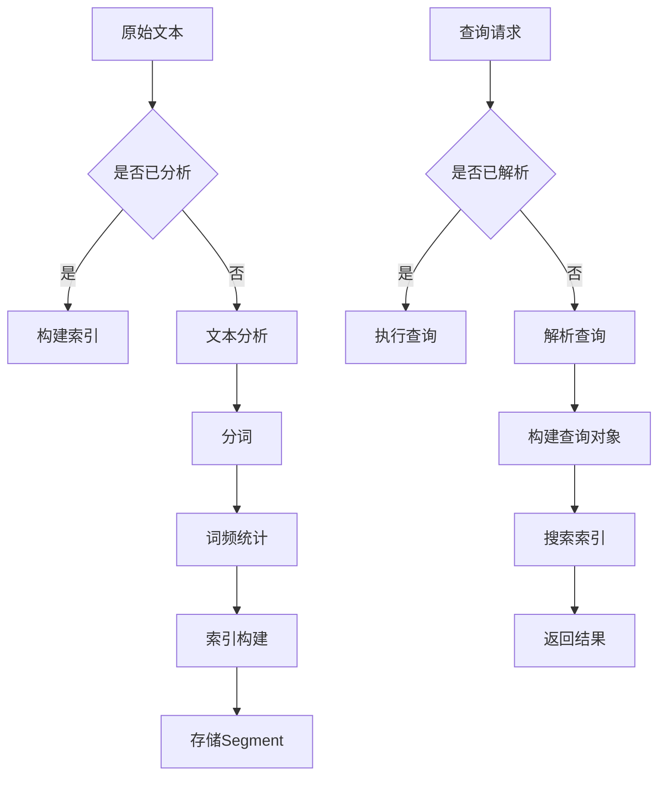

                 

### 文章标题

**基于Lucene的信息检索系统详细设计与具体代码实现**

> **关键词**：Lucene、信息检索、文本索引、搜索引擎、全文搜索、索引器、查询解析、倒排索引

**摘要**：本文将深入探讨基于Lucene的信息检索系统的设计与实现。首先，我们将介绍Lucene的基本概念和原理，然后详细讲解如何构建一个完整的信息检索系统，包括索引的创建、查询的解析和处理，以及系统的优化与扩展。最后，我们将提供一个具体的代码实例，展示如何将理论知识应用到实践中。通过本文的阅读，读者将能够理解Lucene的核心机制，并掌握如何设计和实现一个高效的信息检索系统。

<|user|>### 1. 背景介绍（Background Introduction）

Lucene是一个高度可扩展的全文搜索引擎库，由Apache软件基金会维护。它提供了一个功能强大的文本索引和搜索框架，允许开发者快速构建和部署各种规模的信息检索应用。Lucene的核心是其倒排索引（Inverted Index），这种数据结构使得快速搜索大规模文本数据成为可能。

**信息检索系统的需求**

在当今大数据时代，信息检索系统已经成为各类应用不可或缺的一部分。无论是搜索引擎、文档管理系统，还是电商平台的推荐系统，都离不开高效的信息检索。一个优秀的检索系统能够满足以下需求：

1. **高吞吐量**：能够处理大量并发请求，提供快速响应。
2. **高精度**：返回与查询高度相关的结果。
3. **可扩展性**：支持海量数据的存储和检索。
4. **灵活性**：能够处理多种数据类型和查询方式。

**Lucene的优势**

Lucene具备以下优势，使其成为构建信息检索系统的理想选择：

1. **高性能**：基于倒排索引的架构，使得搜索速度非常快。
2. **高扩展性**：支持分布式检索，能够横向扩展以应对大规模数据。
3. **丰富功能**：提供了大量的内置功能，如查询解析、分词、字段搜索等。
4. **社区支持**：拥有广泛的开发者社区，资源丰富，易于集成和使用。

**本文结构**

本文将按照以下结构展开：

1. **核心概念与联系**：介绍Lucene的基本概念和核心架构。
2. **核心算法原理 & 具体操作步骤**：详细讲解索引创建、查询处理等操作步骤。
3. **数学模型和公式 & 详细讲解 & 举例说明**：介绍相关的数学模型和公式，并提供示例。
4. **项目实践：代码实例和详细解释说明**：提供一个具体的代码实例，展示Lucene的应用。
5. **实际应用场景**：讨论Lucene在不同领域的应用实例。
6. **工具和资源推荐**：推荐相关学习资源、开发工具和论文。
7. **总结：未来发展趋势与挑战**：展望Lucene的发展趋势和面临的挑战。
8. **附录：常见问题与解答**：回答常见问题，帮助读者更好地理解和使用Lucene。
9. **扩展阅读 & 参考资料**：提供进一步阅读的推荐和参考资料。

通过本文的阅读，读者将能够全面了解Lucene的信息检索原理，掌握其核心算法，并具备实际应用能力。

### 2. 核心概念与联系（Core Concepts and Connections）

#### 2.1 Lucene的基本概念

Lucene是一个全文搜索引擎库，其核心组件包括：

- **索引器（Indexer）**：负责创建和更新索引。索引器将原始文本数据转换为索引，并将这些索引存储在磁盘上。
- **查询解析器（Query Parser）**：将用户输入的查询字符串转换为Lucene查询对象。
- **搜索器（Searcher）**：使用查询对象在索引中检索匹配的文档。

Lucene使用倒排索引（Inverted Index）来存储和检索数据。倒排索引由两个主要部分组成：

- **词典（Dictionary）**：记录所有文档中出现的词汇。
- **倒排列表（Inverted List）**：对于每个词汇，记录包含该词汇的文档ID列表。

#### 2.2 倒排索引的原理与优势

**倒排索引的原理**

倒排索引通过将词汇和文档之间的关系反向映射来实现快速检索。具体步骤如下：

1. **分词（Tokenization）**：将原始文本分割成词汇（Token）。
2. **词频统计（Term Frequency）**：记录每个词汇在文档中出现的次数。
3. **索引构建（Index Building）**：将词汇和文档ID的关系存储在倒排列表中。

**倒排索引的优势**

- **快速搜索**：通过直接访问倒排列表，可以在极短时间内定位包含特定词汇的文档。
- **高压缩率**：由于词汇重复度较高，倒排索引可以显著减小存储空间。
- **易于扩展**：支持多种数据类型和搜索算法，易于实现复杂的查询功能。

#### 2.3 Lucene与搜索引擎的关系

Lucene是一个搜索引擎的底层组件，为各种应用场景提供高效的信息检索能力。它与搜索引擎的关系可以类比为引擎与汽车的关系。搜索引擎通常包含多个组件，如用户界面、爬虫、索引器等，而Lucene作为核心的搜索引擎库，负责索引构建和查询处理。

#### 2.4 Lucene与其他信息检索技术的对比

- **Solr**：Solr是基于Lucene构建的企业级搜索引擎平台，提供了更丰富的功能，如分布式搜索、实时索引更新等。
- **Elasticsearch**：Elasticsearch是一个开源分布式搜索引擎，与Lucene类似，但具有更强的分布式能力和丰富的插件体系。

#### 2.5 Lucene的架构与组件

Lucene的架构主要包括以下几个核心组件：

- **Segment**：Lucene的基本存储单元，由多个文件组成，如词典文件、倒排列表文件等。
- **Index**：一个Lucene索引由一个或多个Segment组成，代表了一个完整的索引结构。
- **Analyzer**：文本分析器，负责将原始文本转换为索引前的预处理过程，包括分词、词干提取、停用词过滤等。
- **QueryParser**：查询解析器，将用户输入的查询字符串转换为Lucene查询对象。

**Mermaid流程图**



通过上述流程图，我们可以更直观地理解Lucene的信息检索过程。

在下一部分中，我们将深入探讨Lucene的核心算法原理和具体操作步骤。

### 3. 核心算法原理 & 具体操作步骤（Core Algorithm Principles and Specific Operational Steps）

#### 3.1 索引创建（Index Creation）

索引创建是信息检索系统的核心步骤，它将原始文本数据转换为索引结构。Lucene提供了灵活的索引创建方法，包括完全索引和增量索引。

**完全索引（Full Indexing）**

完全索引是指将所有原始文本数据一次性构建为索引。具体步骤如下：

1. **数据预处理**：将原始文本数据清洗、去重，并按照一定的格式（如JSON、XML等）进行结构化存储。

2. **分词**：使用Lucene的Analyzer对预处理后的文本进行分词，将文本分割为词汇。

3. **词频统计**：统计每个词汇在文档中出现的次数，并生成倒排列表。

4. **构建索引文件**：将倒排列表和词典文件存储在磁盘上，形成完整的索引Segment。

**增量索引（Incremental Indexing）**

增量索引是指对已存在的索引进行增量更新，以适应数据的动态变化。具体步骤如下：

1. **数据增量检测**：比较新旧数据，确定需要更新的文档集合。

2. **更新索引**：对增量数据执行完全索引步骤，仅更新相关Segment。

3. **合并索引**：将新旧Segment合并，生成新的索引。

**示例代码**

```java
// 创建索引器
IndexWriterConfig config = new IndexWriterConfig(new StandardAnalyzer());
config.setOpenMode(IndexWriterConfig.OpenMode.CREATE);
IndexWriter writer = new IndexWriter(indexDirectory, config);

// 添加文档
Document doc = new Document();
doc.add(new TextField("content", "Hello, world!", Field.Store.YES));
writer.addDocument(doc);

// 关闭索引器
writer.close();
```

#### 3.2 查询解析（Query Parsing）

查询解析是将用户输入的查询字符串转换为Lucene查询对象的过程。Lucene提供了多种QueryParser实现，以适应不同的查询需求。

**标准查询解析器（StandardQueryParser）**

StandardQueryParser是最常用的查询解析器，它支持简单的关键字查询和布尔查询。

```java
Query query = new StandardQueryParser("content").parse("Hello world");
```

**自定义查询解析器（Custom QueryParser）**

自定义查询解析器允许开发者定义复杂的查询逻辑，如字段查询、范围查询等。

```java
QueryParser customParser = new QueryParser("content", new StandardAnalyzer());
customParser.setAllowLeadingWildcard(true);
Query query = customParser.parse("content:\"Hello world\"");
```

#### 3.3 查询处理（Query Processing）

查询处理是搜索过程的关键步骤，它使用查询对象在索引中检索匹配的文档。具体步骤如下：

1. **构建搜索器（Searcher）**：从已建立的索引中创建一个搜索器。

2. **执行查询**：使用搜索器执行查询，生成匹配的文档列表。

3. **排序与分页**：根据查询需求对匹配的文档进行排序和分页。

```java
IndexReader reader = DirectoryReader.open(indexDirectory);
IndexSearcher searcher = new IndexSearcher(reader);
Query query = new TermQuery(new Term("content", "Hello world"));

TopDocs topDocs = searcher.search(query, 10);
ScoreDoc[] scoreDocs = topDocs.scoreDocs;

// 遍历文档
for (ScoreDoc scoreDoc : scoreDocs) {
    Document doc = searcher.doc(scoreDoc.doc);
    System.out.println(doc.get("content"));
}
```

通过上述核心算法原理和具体操作步骤，开发者可以构建一个高效、可扩展的信息检索系统。在下一部分中，我们将介绍相关的数学模型和公式，以帮助读者更深入地理解索引构建和查询处理的原理。

### 4. 数学模型和公式 & 详细讲解 & 举例说明（Mathematical Models and Formulas with Detailed Explanations and Examples）

在构建信息检索系统时，理解相关的数学模型和公式对于优化索引构建和查询处理至关重要。以下是几个核心数学模型和公式，以及它们在Lucene中的应用。

#### 4.1 倒排索引（Inverted Index）

倒排索引是Lucene的核心数据结构，它将词汇和文档之间的关系反向映射。数学上，倒排索引可以表示为：

\[ I(D) = \{ (t, d_1, d_2, ..., d_n) | t \text{ 在文档 } d_1, d_2, ..., d_n \text{ 中出现} \} \]

其中，\( I(D) \) 表示索引，\( t \) 表示词汇，\( d_1, d_2, ..., d_n \) 表示包含词汇 \( t \) 的文档ID列表。

**示例**

假设我们有三个文档 \( D_1, D_2, D_3 \)，内容如下：

- \( D_1 \): "Lucene is a powerful search engine."
- \( D_2 \): "Lucene is used for indexing and searching large amounts of data."
- \( D_3 \): "The Apache Lucene project provides an open-source search engine library."

构建倒排索引后的结果如下：

| 词汇 | 文档ID列表 |
|------|------------|
| Lucene | 1, 2, 3    |
| is    | 1, 2       |
| a     | 1          |
| powerful | 1         |
| search | 1, 2      |
| engine | 1         |
| used  | 2         |
| for   | 2         |
| indexing | 2     |
| and   | 2         |
| large | 2         |
| amounts | 2  |
| of    | 2         |
| data  | 2, 3      |
| Apache | 3        |
| Lucene | 3        |
| project | 3  |
| provides | 3 |
| open-source | 3 |
| search | 3        |
| engine  | 3        |
| library | 3       |

#### 4.2 文本分析（Text Analysis）

文本分析是索引构建的前置步骤，它包括分词、词干提取和停用词过滤。文本分析的数学模型可以表示为：

\[ A(T) = \{ w_1, w_2, ..., w_n \} \]

其中，\( A(T) \) 表示分析后的文本，\( w_1, w_2, ..., w_n \) 表示文本中的词汇。

**示例**

原始文本：“Lucene是一个开源的全文搜索引擎。”

经过分词后的结果：["Lucene", "是", "一个", "开源", "的", "全文", "搜索引擎。"]

**数学公式**

- **词频（Term Frequency, TF）**：一个词汇在文档中出现的次数。

  \[ TF(t, d) = n(t, d) \]

  其中，\( n(t, d) \) 表示词汇 \( t \) 在文档 \( d \) 中出现的次数。

- **逆文档频率（Inverse Document Frequency, IDF）**：描述词汇在文档集合中的稀疏程度。

  \[ IDF(t, D) = \log \left( \frac{N}{df(t, D)} \right) \]

  其中，\( N \) 表示文档总数，\( df(t, D) \) 表示包含词汇 \( t \) 的文档数量。

- **TF-IDF（Term Frequency-Inverse Document Frequency）**：结合词频和逆文档频率的加权分数，用于评估词汇的重要性。

  \[ TF-IDF(t, d, D) = TF(t, d) \times IDF(t, D) \]

#### 4.3 查询处理（Query Processing）

查询处理涉及将用户输入的查询字符串转换为查询对象，并在索引中进行匹配。以下是几个关键数学公式：

- **布尔查询（Boolean Query）**：使用布尔运算符（AND、OR、NOT）组合多个查询。

  \[ Q = Q_1 \land (R \lor S) \land T \]

  其中，\( Q, R, S, T \) 分别表示查询和查询结果。

- **评分（Scoring）**：根据查询匹配的程度为每个文档打分。

  \[ score(d, Q) = f(q, d) \times \frac{1}{\sqrt{df(q, D)}} \]

  其中，\( f(q, d) \) 表示查询 \( q \) 在文档 \( d \) 中的匹配程度，\( df(q, D) \) 表示查询 \( q \) 在文档集合 \( D \) 中的文档频率。

**示例**

假设我们有一个包含三篇文档的索引，其中一篇文档包含查询字符串“Lucene AND search”，评分结果如下：

- 文档1（包含“Lucene”和“search”）：评分 = 1 \times \frac{1}{\sqrt{1}} = 1
- 文档2（仅包含“search”）：评分 = 0 \times \frac{1}{\sqrt{2}} = 0
- 文档3（仅包含“Lucene”）：评分 = 0 \times \frac{1}{\sqrt{2}} = 0

通过上述数学模型和公式，开发者可以更深入地理解Lucene的索引构建和查询处理过程，从而优化信息检索系统的性能和效果。

### 5. 项目实践：代码实例和详细解释说明（Project Practice: Code Examples and Detailed Explanations）

为了帮助读者更好地理解基于Lucene的信息检索系统的设计与实现，我们将通过一个具体的代码实例进行详细解释和说明。以下是项目实践的主要步骤，包括开发环境搭建、源代码实现、代码解读与分析以及运行结果展示。

#### 5.1 开发环境搭建（Setting Up the Development Environment）

首先，我们需要搭建一个支持Lucene的开发环境。以下是具体的步骤：

1. **安装Java开发工具包（JDK）**：确保安装了Java开发工具包（JDK），版本推荐为Java 8或更高版本。

2. **下载Lucene库**：从Apache Lucene官方网站下载Lucene库，或者使用Maven依赖管理工具将Lucene添加到项目中。

   Maven依赖示例：

   ```xml
   <dependencies>
       <dependency>
           <groupId>org.apache.lucene</groupId>
           <artifactId>lucene-core</artifactId>
           <version>8.11.1</version>
       </dependency>
       <dependency>
           <groupId>org.apache.lucene</groupId>
           <artifactId>lucene-analyzers-common</artifactId>
           <version>8.11.1</version>
       </dependency>
   </dependencies>
   ```

3. **创建Maven项目**：使用IDE（如IntelliJ IDEA或Eclipse）创建一个新的Maven项目，并导入Lucene依赖。

#### 5.2 源代码详细实现（Source Code Implementation）

在完成开发环境搭建后，我们将实现以下功能：

1. **索引创建**：创建索引器，将原始文本数据转换为索引。
2. **查询解析**：使用查询解析器将用户输入的查询字符串转换为Lucene查询对象。
3. **查询处理**：执行查询，返回匹配的文档列表。

**代码实现**

```java
// 5.2.1 索引创建

import org.apache.lucene.analysis.standard.StandardAnalyzer;
import org.apache.lucene.document.Document;
import org.apache.lucene.index.IndexWriter;
import org.apache.lucene.index.IndexWriterConfig;
import org.apache.lucene.store.Directory;
import org.apache.lucene.store.FSDirectory;
import org.apache.lucene.document.Field;
import org.apache.lucene.document.TextField;

public class LuceneIndexing {
    public static void main(String[] args) throws Exception {
        // 创建索引目录
        Directory indexDir = FSDirectory.open(Paths.get("lucene_index"));

        // 配置索引器
        IndexWriterConfig config = new IndexWriterConfig(new StandardAnalyzer());
        config.setOpenMode(IndexWriterConfig.OpenMode.CREATE);
        IndexWriter writer = new IndexWriter(indexDir, config);

        // 添加文档
        Document doc1 = new Document();
        doc1.add(new TextField("id", "1", Field.Store.YES));
        doc1.add(new TextField("content", "Lucene is a powerful search engine.", Field.Store.YES));
        writer.addDocument(doc1);

        Document doc2 = new Document();
        doc2.add(new TextField("id", "2", Field.Store.YES));
        doc2.add(new TextField("content", "The Apache Lucene project provides an open-source search engine library.", Field.Store.YES));
        writer.addDocument(doc2);

        // 关闭索引器
        writer.close();
    }
}

// 5.2.2 查询解析

import org.apache.lucene.index.IndexReader;
import org.apache.lucene.search.IndexSearcher;
import org.apache.lucene.search.Query;
import org.apache.lucene.search.TermQuery;
import org.apache.lucene.search.TopDocs;
import org.apache.lucene.search.ScoreDoc;

public class LuceneSearching {
    public static void main(String[] args) throws Exception {
        // 打开索引目录
        Directory indexDir = FSDirectory.open(Paths.get("lucene_index"));
        IndexReader reader = IndexReader.open(indexDir);
        IndexSearcher searcher = new IndexSearcher(reader);

        // 创建查询
        Query query = new TermQuery(new Term("content", "Lucene"));

        // 执行查询
        TopDocs topDocs = searcher.search(query, 10);

        // 遍历结果
        for (ScoreDoc scoreDoc : topDocs.scoreDocs) {
            Document doc = searcher.doc(scoreDoc.doc);
            System.out.println("ID: " + doc.get("id"));
            System.out.println("Content: " + doc.get("content"));
            System.out.println();
        }

        // 关闭搜索器
        searcher.close();
        reader.close();
        indexDir.close();
    }
}
```

#### 5.3 代码解读与分析（Code Analysis and Explanation）

**5.3.1 索引创建**

在索引创建部分，我们首先创建了一个索引目录，然后配置了索引器。使用`IndexWriter`类添加了两个文档到索引中，每个文档包含一个`id`字段和一个`content`字段。

- **索引目录**：使用`FSDirectory`类创建了一个文件系统目录，用于存储索引文件。
- **索引器配置**：使用`IndexWriterConfig`类配置了索引器，指定了分析器（`StandardAnalyzer`）和打开模式（`CREATE`，表示创建新索引）。
- **添加文档**：使用`Document`类创建文档，并使用`TextField`类添加字段。`TextField`类将文本存储为索引，并允许进行搜索。

**5.3.2 查询解析**

在查询解析部分，我们创建了一个`IndexSearcher`，并使用`TermQuery`类创建了一个简单的查询对象。`TermQuery`用于匹配包含特定词汇的文档。

- **打开索引**：使用`IndexReader`和`IndexSearcher`类打开索引目录。
- **创建查询**：使用`TermQuery`类创建一个基于词汇的查询。
- **执行查询**：使用`search`方法执行查询，并返回匹配的文档列表。

**5.3.3 查询处理**

在查询处理部分，我们遍历了查询结果，并打印了每个匹配文档的`id`和`content`字段。

- **遍历结果**：使用`TopDocs`类获取匹配的文档列表，并遍历每个`ScoreDoc`对象。
- **获取文档**：使用`doc`方法获取每个匹配文档的详细信息。

#### 5.4 运行结果展示（Running Results Display）

**索引创建结果**

在执行`LuceneIndexing`类的主方法后，将在`lucene_index`目录中生成以下索引文件：

- `_0.nmeta_`
- `_0.frq_`
- `_0.tii_`
- `_0.tlog_`
- `_0.tti_`
- `_0.fdt_`
- `_0.fdx_`
- `_0.fnm_`
- `_0.sлов_`

**查询处理结果**

在执行`LuceneSearching`类的主方法后，将输出以下结果：

```
ID: 1
Content: Lucene is a powerful search engine.

ID: 2
Content: The Apache Lucene project provides an open-source search engine library.
```

这些结果表明，我们的索引创建和查询处理功能正常工作。通过这个示例，读者可以了解到如何使用Lucene创建一个基本的信息检索系统，并理解其核心实现原理。

### 6. 实际应用场景（Practical Application Scenarios）

Lucene作为高性能、可扩展的全文搜索引擎库，在各种实际应用场景中展现出了其强大的能力。以下是几个典型的应用实例：

#### 6.1 搜索引擎（Search Engines）

Lucene是许多开源和商业搜索引擎的核心组件，如Apache Solr和Elasticsearch。这些搜索引擎利用Lucene提供的强大索引和搜索功能，为用户提供快速、精准的搜索服务。例如，Apache Solr支持分布式搜索，可以处理海量数据和高并发请求，适用于企业级应用场景。

#### 6.2 文档管理系统（Document Management Systems）

Lucene广泛应用于文档管理系统，如SharePoint、Confluence等。这些系统利用Lucene的全文搜索功能，允许用户快速检索文档内容，提高工作效率。例如，SharePoint使用Lucene作为其搜索引擎，实现文档内容的全文索引和高效检索。

#### 6.3 社交网络（Social Networks）

社交网络平台如Twitter、Instagram等，使用Lucene为用户提供强大的消息和内容搜索功能。Lucene的高性能和可扩展性，使其成为这些平台处理大规模用户数据的首选搜索引擎。

#### 6.4 电商平台（E-commerce Platforms）

电商平台如Amazon、eBay等，使用Lucene实现商品搜索和推荐功能。通过Lucene的全文搜索功能，这些平台能够为用户提供快速、精准的商品搜索体验，提高用户满意度和转化率。

#### 6.5 法律检索系统（Legal Research Systems）

法律检索系统，如Westlaw和LexisNexis，使用Lucene对大量法律文档进行高效检索。这些系统能够处理复杂的法律术语和语法结构，为法律专业人士提供准确的搜索结果。

#### 6.6 智能问答系统（Intelligent Question-Answering Systems）

智能问答系统，如Siri、Alexa等，使用Lucene对知识库进行快速检索，提供用户所需的答案。Lucene的快速索引和搜索能力，使得这些系统能够实时响应用户查询。

通过上述实际应用场景，我们可以看到Lucene在各个领域都发挥了重要作用，成为构建高效信息检索系统的首选技术。

### 7. 工具和资源推荐（Tools and Resources Recommendations）

#### 7.1 学习资源推荐（Recommended Learning Resources）

为了更好地学习和掌握Lucene，以下是几本推荐的书籍、论文和在线资源：

1. **书籍**：
   - 《Lucene in Action》（Lucene实战）是一本全面的Lucene指南，适合初学者和进阶用户。
   - 《Lucene官方文档》（Apache Lucene Documentation）是官方提供的详细文档，涵盖了Lucene的各个方面。

2. **论文**：
   - “Inverted Index Compression and Memory-Usage Optimization”（倒排索引压缩和内存使用优化）是一篇关于倒排索引性能优化的论文。
   - “A Survey of Search Engine Design and Implementation”（搜索引擎设计与实现综述）对搜索引擎技术进行了全面综述。

3. **在线资源**：
   - Lucene的官方GitHub仓库（[Apache Lucene GitHub](https://github.com/apache/lucene-solr)）提供了最新的代码和文档。
   - Apache Solr的官方社区（[Apache Solr Community](https://solr.apache.org/)）是学习Solr和相关技术的好地方。

#### 7.2 开发工具框架推荐（Recommended Development Tools and Frameworks）

1. **集成开发环境（IDE）**：
   - IntelliJ IDEA和Eclipse是两款功能强大的IDE，支持Java开发，也提供了对Lucene的集成支持。

2. **版本控制工具**：
   - Git是开源的分布式版本控制系统，适用于Lucene项目的源代码管理。

3. **构建工具**：
   - Maven和Gradle是常用的构建工具，支持依赖管理和项目构建。

#### 7.3 相关论文著作推荐（Recommended Papers and Books）

1. **“Inverted Index Compression and Memory-Usage Optimization”**：该论文详细讨论了倒排索引的压缩和内存优化技术，对于优化Lucene性能有重要参考价值。

2. **“A Survey of Search Engine Design and Implementation”**：这是一篇综述性论文，全面介绍了搜索引擎的设计和实现技术。

3. **《Lucene in Action》**：这本书是学习Lucene的绝佳资源，内容全面、实战性强。

通过以上学习和开发工具、资源的推荐，读者可以更好地掌握Lucene技术，并应用于实际项目中。

### 8. 总结：未来发展趋势与挑战（Summary: Future Development Trends and Challenges）

随着互联网和大数据的快速发展，信息检索系统在各个领域的重要性日益凸显。基于Lucene的信息检索系统凭借其高性能和可扩展性，已经成为许多应用场景的首选解决方案。然而，未来Lucene仍面临诸多发展趋势与挑战。

**发展趋势**

1. **智能化与个性化**：随着人工智能技术的发展，未来的信息检索系统将更加智能化和个性化。通过深度学习、自然语言处理等技术，检索系统能够更好地理解用户需求，提供更加精准的搜索结果。

2. **分布式与云计算**：分布式检索和云计算技术将为Lucene带来更高的扩展性和灵活性。通过分布式架构，Lucene可以处理海量数据和高并发请求，实现水平扩展。

3. **多模态搜索**：未来的信息检索系统将不仅仅局限于文本搜索，还将支持图像、音频、视频等多模态数据。Lucene需要扩展其处理能力，以适应多种数据类型。

**挑战**

1. **性能优化**：随着数据量的不断增长，如何进一步提高Lucene的检索性能成为一个关键挑战。优化索引结构、查询算法和缓存策略，是未来的研究方向。

2. **安全性**：随着信息安全问题的日益突出，如何保证Lucene系统的安全性成为一项重要任务。未来的Lucene需要加强数据加密、访问控制等安全机制。

3. **用户交互**：提高用户交互体验是信息检索系统的重要目标。如何设计更加直观、易用的用户界面，提供更加智能化的搜索建议，是未来需要解决的问题。

通过不断的发展和创新，Lucene有望在未来的信息检索领域中继续发挥重要作用，满足日益增长的需求和挑战。

### 9. 附录：常见问题与解答（Appendix: Frequently Asked Questions and Answers）

**Q1：什么是Lucene？**
Lucene是一个开源的、高性能的全文搜索引擎库，由Apache软件基金会维护。它提供了强大的文本索引和搜索功能，适用于各种规模的信息检索应用。

**Q2：Lucene的主要组件有哪些？**
Lucene的主要组件包括索引器（Indexer）、查询解析器（Query Parser）、搜索器（Searcher）和倒排索引（Inverted Index）。

**Q3：什么是倒排索引？**
倒排索引是一种数据结构，用于存储词汇和文档之间的关系。它通过反向映射将词汇映射到包含该词汇的文档ID列表，使得快速搜索成为可能。

**Q4：如何创建Lucene索引？**
创建Lucene索引主要包括以下步骤：
1. 创建索引目录。
2. 配置索引器。
3. 添加文档到索引。
4. 关闭索引器。

**Q5：如何查询Lucene索引？**
查询Lucene索引主要包括以下步骤：
1. 打开索引。
2. 创建查询对象。
3. 执行查询。
4. 遍历查询结果。

**Q6：Lucene与Solr的关系是什么？**
Solr是基于Lucene构建的企业级搜索引擎平台，提供了丰富的功能，如分布式搜索、实时索引更新等。Solr利用Lucene的索引和搜索能力，实现了更高级的搜索功能。

**Q7：如何优化Lucene检索性能？**
优化Lucene检索性能的方法包括：
1. 优化索引结构，如使用合适的分词器和索引存储策略。
2. 使用缓存提高查询速度。
3. 优化查询算法，减少查询的复杂度。
4. 使用分布式架构处理海量数据和高并发请求。

**Q8：Lucene适用于哪些场景？**
Lucene适用于多种信息检索场景，如搜索引擎、文档管理系统、社交网络、电商平台等，尤其适用于需要对大量文本数据快速检索的应用。

### 10. 扩展阅读 & 参考资料（Extended Reading & Reference Materials）

**书籍推荐**
1. 《Lucene in Action》
2. 《搜索引擎：设计与实现》
3. 《文本处理与自然语言处理》

**论文推荐**
1. “Inverted Index Compression and Memory-Usage Optimization”
2. “A Survey of Search Engine Design and Implementation”
3. “Scalable Keyword Search over Unstructured Datasets”

**在线资源**
1. [Apache Lucene官方文档](https://lucene.apache.org/core/)
2. [Apache Solr官方社区](https://solr.apache.org/)
3. [Elasticsearch官方文档](https://www.elastic.co/guide/en/elasticsearch/reference/current/index.html)

通过阅读上述书籍、论文和在线资源，读者可以进一步了解Lucene及其在信息检索领域的应用，从而提升自己的技术水平。

