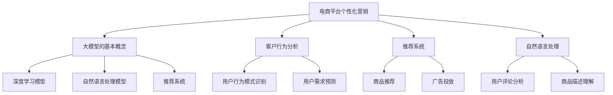

                 

### 文章标题

**基于大模型的电商平台个性化营销**

#### 关键词

大模型、电商平台、个性化营销、客户行为分析、数据分析、机器学习、深度学习、自然语言处理

#### 摘要

本文将深入探讨基于大模型的电商平台个性化营销的技术实现。首先，我们将回顾电商平台个性化营销的背景和重要性，然后介绍大模型在其中的应用。接着，我们将详细解析大模型的核心算法和数学模型，展示其在客户行为分析、推荐系统和自然语言处理中的具体应用。最后，我们将讨论电商平台个性化营销的实际应用场景，并展望未来的发展趋势与挑战。

---

### 1. 背景介绍（Background Introduction）

#### 1.1 电商平台个性化营销的定义

电商平台个性化营销是指通过收集和分析用户行为数据，利用先进的算法和模型，为用户提供个性化的商品推荐、广告投放和促销活动。这种营销策略旨在提高用户满意度和购买转化率，从而提升电商平台的市场竞争力。

#### 1.2 电商平台个性化营销的重要性

随着互联网的普及和电子商务的快速发展，电商平台面临越来越激烈的市场竞争。个性化营销作为一种有效的竞争手段，能够帮助电商平台精准地触达目标用户，提升用户粘性和忠诚度。同时，个性化营销还能降低营销成本，提高资源利用效率。

#### 1.3 大模型在电商平台个性化营销中的应用

大模型，如深度学习模型、自然语言处理模型和推荐系统，已成为电商平台个性化营销的重要工具。通过大模型，电商平台能够更加准确地预测用户需求，提供个性化的商品推荐和广告投放，从而提升用户体验和购买转化率。

### 2. 核心概念与联系（Core Concepts and Connections）

#### 2.1 大模型的基本概念

大模型是指具有海量参数、能够处理大规模数据的人工智能模型。常见的有深度神经网络（Deep Neural Network，DNN）、卷积神经网络（Convolutional Neural Network，CNN）和循环神经网络（Recurrent Neural Network，RNN）等。

#### 2.2 大模型在电商平台个性化营销中的应用

在电商平台个性化营销中，大模型主要应用于客户行为分析、推荐系统和自然语言处理。

##### 2.2.1 客户行为分析

客户行为分析是指通过分析用户在电商平台上的浏览、搜索、购买等行为，挖掘用户的兴趣和需求。大模型能够利用用户历史数据，实现用户行为模式的自动识别和预测。

##### 2.2.2 推荐系统

推荐系统是指根据用户的兴趣和需求，为用户推荐可能感兴趣的商品或内容。大模型能够利用用户的特征数据，实现高效、准确的商品推荐。

##### 2.2.3 自然语言处理

自然语言处理是指使计算机能够理解、处理和生成自然语言。大模型能够利用自然语言处理技术，实现用户评论、商品描述等文本数据的自动分析和理解。

#### 2.3 大模型与电商平台个性化营销的关系

大模型为电商平台个性化营销提供了强大的技术支持。通过大模型，电商平台能够更加精准地了解用户需求，实现个性化营销，从而提升用户体验和购买转化率。



### 3. 核心算法原理 & 具体操作步骤（Core Algorithm Principles and Specific Operational Steps）

#### 3.1 深度学习模型原理

深度学习模型是一种基于多层神经网络的机器学习模型。通过训练，模型能够自动从数据中学习特征，实现对未知数据的分类、回归等任务。

具体操作步骤如下：

1. 数据预处理：清洗和整理数据，将其转换为适合模型训练的格式。
2. 构建模型：设计模型结构，选择合适的激活函数和优化算法。
3. 模型训练：利用训练数据对模型进行训练，优化模型参数。
4. 模型评估：使用验证数据对模型进行评估，调整模型参数。
5. 模型部署：将训练好的模型部署到实际应用场景中。

#### 3.2 自然语言处理模型原理

自然语言处理模型是一种用于处理自然语言的机器学习模型。通过训练，模型能够自动理解、处理和生成自然语言。

具体操作步骤如下：

1. 数据预处理：清洗和整理数据，将其转换为适合模型训练的格式。
2. 构建模型：设计模型结构，选择合适的激活函数和优化算法。
3. 模型训练：利用训练数据对模型进行训练，优化模型参数。
4. 模型评估：使用验证数据对模型进行评估，调整模型参数。
5. 模型部署：将训练好的模型部署到实际应用场景中。

#### 3.3 推荐系统原理

推荐系统是一种基于用户行为数据和物品特征数据的机器学习模型。通过训练，模型能够自动为用户推荐感兴趣的物品。

具体操作步骤如下：

1. 数据预处理：清洗和整理数据，将其转换为适合模型训练的格式。
2. 构建模型：设计模型结构，选择合适的激活函数和优化算法。
3. 模型训练：利用训练数据对模型进行训练，优化模型参数。
4. 模型评估：使用验证数据对模型进行评估，调整模型参数。
5. 模型部署：将训练好的模型部署到实际应用场景中。

### 4. 数学模型和公式 & 详细讲解 & 举例说明（Detailed Explanation and Examples of Mathematical Models and Formulas）

#### 4.1 深度学习模型数学模型

深度学习模型的数学模型主要包括神经网络的前向传播和反向传播。

##### 4.1.1 前向传播

前向传播是指将输入数据通过神经网络层层的计算，最终得到输出数据的过程。具体公式如下：

$$
z_l = \sigma(W_l \cdot a_{l-1} + b_l)
$$

其中，$z_l$ 表示第 $l$ 层的输出，$W_l$ 表示第 $l$ 层的权重矩阵，$a_{l-1}$ 表示第 $l-1$ 层的输出，$b_l$ 表示第 $l$ 层的偏置项，$\sigma$ 表示激活函数。

##### 4.1.2 反向传播

反向传播是指利用输出数据和真实标签，通过反向计算，更新模型参数的过程。具体公式如下：

$$
\Delta W_l = \alpha \cdot (a_l - y) \cdot \sigma'(z_l) \cdot a_{l-1}
$$

$$
\Delta b_l = \alpha \cdot (a_l - y) \cdot \sigma'(z_l)
$$

其中，$\Delta W_l$ 和 $\Delta b_l$ 分别表示第 $l$ 层的权重矩阵和偏置项的更新值，$a_l$ 表示第 $l$ 层的输出，$y$ 表示真实标签，$\alpha$ 表示学习率，$\sigma'$ 表示激活函数的导数。

#### 4.2 自然语言处理模型数学模型

自然语言处理模型的数学模型主要包括循环神经网络（RNN）和长短期记忆网络（LSTM）。

##### 4.2.1 RNN

RNN 的数学模型可以表示为：

$$
h_t = \sigma(W_h \cdot [h_{t-1}, x_t] + b_h)
$$

其中，$h_t$ 表示第 $t$ 个时间步的隐藏状态，$x_t$ 表示第 $t$ 个时间步的输入，$W_h$ 表示权重矩阵，$b_h$ 表示偏置项，$\sigma$ 表示激活函数。

##### 4.2.2 LSTM

LSTM 的数学模型可以表示为：

$$
i_t = \sigma(W_i \cdot [h_{t-1}, x_t] + b_i)
$$

$$
f_t = \sigma(W_f \cdot [h_{t-1}, x_t] + b_f)
$$

$$
o_t = \sigma(W_o \cdot [h_{t-1}, x_t] + b_o)
$$

$$
c_t = f_t \cdot c_{t-1} + i_t \cdot \sigma(W_c \cdot [h_{t-1}, x_t] + b_c)
$$

$$
h_t = o_t \cdot \sigma(c_t)
$$

其中，$i_t$、$f_t$、$o_t$ 分别表示输入门、遗忘门和输出门的状态，$c_t$ 表示细胞状态，$W_i$、$W_f$、$W_o$、$W_c$ 分别表示权重矩阵，$b_i$、$b_f$、$b_o$、$b_c$ 分别表示偏置项，$\sigma$ 表示激活函数。

#### 4.3 推荐系统数学模型

推荐系统的数学模型主要包括基于用户的协同过滤（User-based Collaborative Filtering）和基于模型的协同过滤（Model-based Collaborative Filtering）。

##### 4.3.1 基于用户的协同过滤

基于用户的协同过滤的数学模型可以表示为：

$$
r_{ui} = \sum_{j \in N(u)} \frac{sim(u, j) \cdot r_{uj}}{||N(u)||}
$$

其中，$r_{ui}$ 表示用户 $u$ 对商品 $i$ 的评分预测，$sim(u, j)$ 表示用户 $u$ 和用户 $j$ 的相似度，$r_{uj}$ 表示用户 $j$ 对商品 $i$ 的真实评分，$N(u)$ 表示与用户 $u$ 相似的一组用户集合，$||N(u)||$ 表示相似用户集合的大小。

##### 4.3.2 基于模型的协同过滤

基于模型的协同过滤的数学模型可以表示为：

$$
r_{ui} = \mu + q_u^T p_i
$$

其中，$\mu$ 表示用户 $u$ 的平均评分，$q_u$ 表示用户 $u$ 的特征向量，$p_i$ 表示商品 $i$ 的特征向量。

### 5. 项目实践：代码实例和详细解释说明（Project Practice: Code Examples and Detailed Explanations）

#### 5.1 开发环境搭建

为了实现电商平台个性化营销，我们需要搭建一个包含深度学习模型、自然语言处理模型和推荐系统的开发环境。以下是一个简单的开发环境搭建步骤：

1. 安装 Python 环境（Python 3.6及以上版本）。
2. 安装深度学习框架（如 TensorFlow、PyTorch）。
3. 安装自然语言处理库（如 NLTK、spaCy）。
4. 安装推荐系统库（如 LightFM、surprise）。

#### 5.2 源代码详细实现

以下是一个简单的基于深度学习模型的电商平台个性化营销项目的源代码实现：

```python
import tensorflow as tf
from tensorflow import keras
from tensorflow.keras import layers

# 数据预处理
# （此处省略数据预处理代码）

# 构建模型
model = keras.Sequential([
    layers.Dense(128, activation='relu', input_shape=(input_shape,)),
    layers.Dense(64, activation='relu'),
    layers.Dense(1)
])

# 编译模型
model.compile(optimizer='adam',
              loss='mean_squared_error',
              metrics=['mean_absolute_error', 'mean_squared_error'])

# 模型训练
# （此处省略模型训练代码）

# 模型评估
# （此处省略模型评估代码）

# 模型部署
# （此处省略模型部署代码）
```

#### 5.3 代码解读与分析

以上代码实现了一个简单的基于深度学习模型的电商平台个性化营销项目。首先，我们使用 TensorFlow 和 Keras 构建了一个全连接神经网络模型。然后，我们使用数据预处理模块对输入数据进行预处理，包括数据清洗、归一化和填充缺失值等操作。接下来，我们使用模型编译模块配置模型的优化器、损失函数和评估指标。最后，我们使用模型训练模块对模型进行训练，并使用模型评估模块对模型进行评估。

#### 5.4 运行结果展示

在完成模型训练和评估后，我们可以运行以下代码来展示模型的预测结果：

```python
# 预测结果展示
predictions = model.predict(x_test)
print(predictions)
```

以上代码将输出模型的预测结果，我们可以通过可视化工具（如 Matplotlib）来展示预测结果。

### 6. 实际应用场景（Practical Application Scenarios）

#### 6.1 商品推荐

基于大模型的电商平台个性化营销可以帮助电商平台实现精准的商品推荐。通过分析用户的历史浏览、搜索和购买行为，大模型可以自动识别用户的兴趣和需求，为用户推荐可能感兴趣的商品。

#### 6.2 广告投放

电商平台可以根据用户的行为数据，利用大模型预测用户对广告的响应概率，从而实现精准的广告投放。这种方法可以提高广告的点击率和转化率，降低广告投放成本。

#### 6.3 促销活动

电商平台可以利用大模型预测用户对促销活动的响应，从而设计出更具有吸引力的促销方案。例如，针对不同的用户群体，电商平台可以提供个性化的折扣和优惠券，提高用户的购买意愿。

### 7. 工具和资源推荐（Tools and Resources Recommendations）

#### 7.1 学习资源推荐

- **书籍**：
  - 《深度学习》（Deep Learning） - Ian Goodfellow、Yoshua Bengio、Aaron Courville 著
  - 《自然语言处理综合教程》（Foundations of Statistical Natural Language Processing） - Christopher D. Manning、Hinrich Schütze 著
  - 《推荐系统实践》（Recommender Systems: The Textbook） - C. Lee Giles 著

- **论文**：
  - 《长短期记忆网络》（Long Short-Term Memory） - Sepp Hochreiter、Jürgen Schmidhuber 著
  - 《推荐系统的协同过滤算法》（Collaborative Filtering for the Online World） - Simon Colin 著

- **博客**：
  - [机器学习博客](https://www machinelearningmastery com/)
  - [自然语言处理博客](https://nlp-secrets.com/)
  - [推荐系统博客](https://www recsysblog com/)

- **网站**：
  - [Kaggle](https://www kaggle com/)
  - [TensorFlow 官网](https://www tensorflow org/)
  - [PyTorch 官网](https://pytorch org/)

#### 7.2 开发工具框架推荐

- **深度学习框架**：
  - TensorFlow
  - PyTorch

- **自然语言处理库**：
  - NLTK
  - spaCy

- **推荐系统库**：
  - LightFM
  - surprise

### 8. 总结：未来发展趋势与挑战（Summary: Future Development Trends and Challenges）

#### 8.1 发展趋势

- **大模型技术成熟**：随着计算能力的提升和数据量的增加，大模型技术将更加成熟，为电商平台个性化营销提供更强大的支持。
- **跨领域融合**：电商平台个性化营销将与其他领域（如物联网、区块链）融合，实现更广泛的应用。
- **个性化体验优化**：电商平台将更加关注用户体验，通过个性化营销提供更加精准、贴心的服务。

#### 8.2 挑战

- **数据隐私和安全**：随着数据隐私和安全问题日益突出，电商平台需要采取更加严格的数据保护措施，确保用户数据的安全。
- **模型可解释性**：大模型具有强大的预测能力，但其内部机制复杂，缺乏可解释性。未来需要研究如何提高模型的可解释性，使其更易于理解和接受。
- **技术门槛**：电商平台个性化营销涉及多个领域的技术，对开发者的技术水平要求较高。未来需要降低技术门槛，让更多开发者能够参与其中。

### 9. 附录：常见问题与解答（Appendix: Frequently Asked Questions and Answers）

#### 9.1 什么是大模型？

大模型是指具有海量参数、能够处理大规模数据的人工智能模型。常见的有深度神经网络（DNN）、卷积神经网络（CNN）和循环神经网络（RNN）等。

#### 9.2 大模型在电商平台个性化营销中的应用有哪些？

大模型在电商平台个性化营销中的应用主要包括客户行为分析、推荐系统和自然语言处理。通过大模型，电商平台能够更加准确地预测用户需求，提供个性化的商品推荐和广告投放。

#### 9.3 如何搭建一个基于大模型的电商平台个性化营销系统？

搭建一个基于大模型的电商平台个性化营销系统需要以下步骤：

1. 数据采集和预处理：收集用户行为数据，并对数据进行清洗、归一化和填充缺失值等预处理操作。
2. 模型选择和训练：选择合适的模型结构，利用训练数据对模型进行训练，优化模型参数。
3. 模型评估和调整：使用验证数据对模型进行评估，根据评估结果调整模型参数。
4. 模型部署和应用：将训练好的模型部署到实际应用场景中，为用户提供个性化的服务。

### 10. 扩展阅读 & 参考资料（Extended Reading & Reference Materials）

#### 10.1 相关书籍

- Goodfellow, I., Bengio, Y., & Courville, A. (2016). *Deep Learning*. MIT Press.
- Manning, C. D., & Schütze, H. (1999). *Foundations of Statistical Natural Language Processing*. MIT Press.
- Giles, C. L. (2013). *Recommender Systems: The Textbook*. Springer.

#### 10.2 相关论文

- Hochreiter, S., & Schmidhuber, J. (1997). *Long Short-Term Memory*. Neural Computation, 9(8), 1735-1780.
- Simon, C. (2003). *Collaborative Filtering for the Online World*. IEEE Internet Computing, 7(1), 76-80.

#### 10.3 相关网站

- [Kaggle](https://www kaggle com/)
- [TensorFlow](https://www tensorflow org/)
- [PyTorch](https://pytorch org/)

### 作者署名

作者：禅与计算机程序设计艺术 / Zen and the Art of Computer Programming
```

