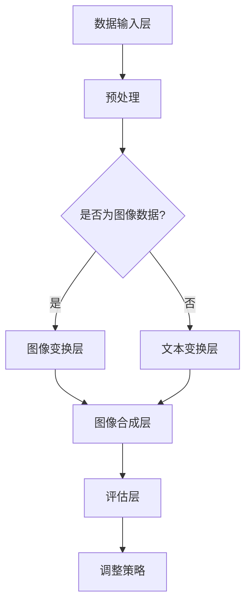

                 

# 文章标题：数据增强技术：图像和文本

## 摘要

本文将深入探讨数据增强技术，特别是其在图像和文本数据中的应用。数据增强是一种有效的方法，可以提高模型的泛化能力和准确性，减少对大量标注数据的依赖。本文将首先介绍数据增强的基本概念，然后详细阐述图像和文本数据增强的方法，最后讨论其实际应用场景和挑战。

## 1. 背景介绍（Background Introduction）

### 数据增强的定义与重要性

数据增强（Data Augmentation）是一种利用现有数据生成更多样化数据的方法，以增强机器学习模型的性能。这一概念在计算机视觉和自然语言处理领域中尤为重要，因为这些领域的数据往往具有高维度和复杂的结构。

数据增强的重要性主要体现在以下几个方面：

1. **提高模型泛化能力**：通过增加数据多样性，模型能够学习到更广泛的特征，从而提高对未见数据的泛化能力。
2. **减少对标注数据的依赖**：在一些领域，如医学图像分析，获取标注数据成本高昂，数据增强技术可以有效减少对大量标注数据的依赖。
3. **提升模型准确性**：更多的样例数据可以使模型在学习过程中获得更稳健的收敛。

### 数据增强技术的发展

数据增强技术在计算机视觉领域的发展可以追溯到20世纪80年代。当时，研究者们开始尝试使用几何变换（如旋转、缩放、裁剪等）来增加图像数据多样性。随着深度学习技术的发展，数据增强方法也在不断演进，例如：

- **生成对抗网络（GANs）**：GANs通过生成与真实数据相似的数据，极大地丰富了训练数据集。
- **自适应数据增强**：这种方法根据模型的当前状态动态调整增强策略，以达到更好的训练效果。

### 图像和文本数据增强的差异

图像和文本数据增强存在一些显著的差异：

- **数据类型**：图像数据是视觉信息，而文本数据是语言信息。
- **增强方法**：图像数据增强通常涉及几何变换和颜色调整，而文本数据增强则更多涉及语言处理技术。
- **数据分布**：图像数据的分布通常是连续的，而文本数据分布通常是离散的。

## 2. 核心概念与联系（Core Concepts and Connections）

### 数据增强的原理与架构

#### 数据增强原理

数据增强的核心思想是利用现有数据生成新的、更有代表性的数据样本来丰富训练数据集。这一过程通常包括以下步骤：

1. **数据预处理**：对原始数据进行预处理，例如归一化、去噪等。
2. **变换**：根据数据类型（图像或文本）应用不同的变换，如几何变换、噪声添加、文本重排等。
3. **合成**：将变换后的数据进行组合，生成新的样本。

#### 数据增强架构

数据增强的架构可以概括为以下几个层次：

1. **数据输入层**：接收原始数据，并进行预处理。
2. **变换层**：根据数据类型应用相应的变换。
3. **合成层**：将变换后的数据进行合成，生成新的样本。
4. **评估层**：评估新样本的有效性，并调整增强策略。

### Mermaid 流程图（Mermaid Flowchart）

下面是一个简单的 Mermaid 流程图，展示了数据增强的基本架构：



## 3. 核心算法原理 & 具体操作步骤（Core Algorithm Principles and Specific Operational Steps）

### 图像数据增强算法

图像数据增强算法主要包括以下几种：

- **几何变换**：如旋转、缩放、翻转等。
- **颜色变换**：如随机颜色调整、灰度化等。
- **噪声添加**：如高斯噪声、椒盐噪声等。

#### 操作步骤

1. **数据预处理**：对图像进行归一化、去噪等操作。
2. **几何变换**：根据设定的概率，对图像进行旋转、缩放、翻转等几何变换。
3. **颜色变换**：根据设定的概率，对图像进行颜色调整或灰度化。
4. **噪声添加**：根据设定的概率，对图像添加噪声。
5. **合成**：将所有变换后的图像组合成新的数据集。
6. **评估**：评估增强数据的有效性。

### 文本数据增强算法

文本数据增强算法主要包括以下几种：

- **同义词替换**：用同义词替换文本中的关键词。
- **文本重排**：重新排列文本的句子或段落。
- **噪声添加**：在文本中添加随机字符或删除部分字符。

#### 操作步骤

1. **数据预处理**：对文本进行分词、词性标注等操作。
2. **同义词替换**：根据设定的概率，用同义词替换文本中的关键词。
3. **文本重排**：根据设定的概率，重新排列文本的句子或段落。
4. **噪声添加**：根据设定的概率，在文本中添加随机字符或删除部分字符。
5. **合成**：将所有变换后的文本组合成新的数据集。
6. **评估**：评估增强数据的有效性。

### 示例代码

以下是图像和文本数据增强的简单示例代码：

#### 图像数据增强示例代码

```python
from keras.preprocessing.image import ImageDataGenerator

# 创建数据增强生成器
datagen = ImageDataGenerator(
    rotation_range=90,
    width_shift_range=0.1,
    height_shift_range=0.1,
    shear_range=0.1,
    zoom_range=0.2,
    horizontal_flip=True,
    fill_mode='nearest'
)

# 应用数据增强到图像数据
for batch in datagen.flow(x_train, y_train, batch_size=32):
    # ...进行模型训练...
    break
```

#### 文本数据增强示例代码

```python
from nltk.corpus import wordnet
from nltk.tokenize import word_tokenize

# 同义词替换示例
def replace_synonyms(text):
    words = word_tokenize(text)
    new_words = []
    for word in words:
        synonyms = wordnet.synsets(word)
        if synonyms:
            new_word = synonyms[0].lemmas()[0].name()
            new_words.append(new_word)
        else:
            new_words.append(word)
    return ' '.join(new_words)

# 文本重排示例
def shuffle_sentence(sentence):
    words = sentence.split()
    shuffled_words = words[:]
    random.shuffle(shuffled_words)
    return ' '.join(shuffled_words)

# 噪声添加示例
def add_noise(text, noise_rate=0.1):
    words = list(text)
    noise_words = ['*', '#', '@']  # 噪声字符
    for i in range(len(words)):
        if random.random() < noise_rate:
            words[i] = random.choice(noise_words)
    return ''.join(words)
```

## 4. 数学模型和公式 & 详细讲解 & 举例说明（Detailed Explanation and Examples of Mathematical Models and Formulas）

### 图像数据增强的数学模型

在图像数据增强中，几何变换和噪声添加是两个核心环节。以下是这些操作背后的数学模型。

#### 几何变换

1. **旋转（Rotation）**：

   旋转操作可以通过旋转矩阵实现。对于一幅图像 \(I(x, y)\)，旋转角度为 \(\theta\) 的旋转矩阵 \(R\) 定义为：

   $$
   R = \begin{bmatrix}
   \cos(\theta) & -\sin(\theta) \\
   \sin(\theta) & \cos(\theta)
   \end{bmatrix}
   $$

   对图像进行旋转的变换公式为：

   $$
   I'(x, y) = R \cdot I(x, y)
   $$

2. **缩放（Scaling）**：

   缩放操作可以通过尺度变换矩阵实现。对于一幅图像 \(I(x, y)\)，尺度变换矩阵 \(S\) 定义为：

   $$
   S = \begin{bmatrix}
   s_x & 0 \\
   0 & s_y
   \end{bmatrix}
   $$

   对图像进行缩放的变换公式为：

   $$
   I'(x, y) = S \cdot I(x, y)
   $$

   其中，\(s_x\) 和 \(s_y\) 分别为水平和垂直方向的缩放因子。

3. **翻转（Flipping）**：

   翻转操作可以通过对图像进行水平和垂直翻转实现。对于一幅图像 \(I(x, y)\)，翻转操作可以通过以下公式实现：

   $$
   I'(x, y) = 
   \begin{cases} 
   I(2w - x, y) & \text{水平翻转} \\
   I(x, 2h - y) & \text{垂直翻转}
   \end{cases}
   $$

   其中，\(w\) 和 \(h\) 分别为图像的宽度和高度。

#### 噪声添加

噪声添加是图像增强中的一个常见操作。以下是几种常见的噪声模型及其数学表示：

1. **高斯噪声（Gaussian Noise）**：

   高斯噪声是一种均值为0、方差为\(\sigma^2\)的高斯分布噪声。对于一幅图像 \(I(x, y)\)，高斯噪声可以表示为：

   $$
   I'(x, y) = I(x, y) + G(x, y)
   $$

   其中，\(G(x, y) \sim N(0, \sigma^2)\)。

2. **椒盐噪声（Salt-and-Pepper Noise）**：

   椒盐噪声是一种在图像中随机添加亮值和暗值的噪声。对于一幅图像 \(I(x, y)\)，椒盐噪声可以表示为：

   $$
   I'(x, y) = 
   \begin{cases} 
   I(x, y) + s & \text{随机选择像素值为亮值（255）} \\
   I(x, y) - s & \text{随机选择像素值为暗值（0）}
   \end{cases}
   $$

   其中，\(s\) 为椒盐噪声的强度。

### 文本数据增强的数学模型

文本数据增强主要涉及同义词替换、文本重排和噪声添加。以下是这些操作的数学表示。

#### 同义词替换

同义词替换可以通过替换词向量来实现。假设词库中每个词 \(w_i\) 的向量表示为 \(v_i \in \mathbb{R}^d\)，同义词 \(w_j\) 的向量表示为 \(v_j \in \mathbb{R}^d\)，则同义词替换可以通过以下公式实现：

$$
v_j \sim P(w_j | w_i)
$$

其中，\(P(w_j | w_i)\) 表示在词 \(w_i\) 之后出现词 \(w_j\) 的概率。

#### 文本重排

文本重排可以通过排列组合模型实现。假设文本 \(T = w_1, w_2, ..., w_n\)，其所有可能的排列组合为 \(S(T)\)，则文本重排可以通过以下公式实现：

$$
T' \sim S(T)
$$

其中，\(T'\) 为重新排列后的文本。

#### 噪声添加

噪声添加可以通过在文本中随机插入或删除字符来实现。假设文本 \(T = t_1, t_2, ..., t_n\)，则噪声添加可以通过以下公式实现：

$$
T' = 
\begin{cases} 
T & \text{随机选择一个字符进行插入或删除} \\
T \cup \{t'\} & \text{插入操作} \\
T \setminus \{t'\} & \text{删除操作}
\end{cases}
$$

其中，\(t'\) 为随机选择的字符。

### 示例讲解

#### 图像数据增强示例

假设我们有一幅图像 \(I(x, y)\)，其像素值表示为 \(I(x, y) \in [0, 255]\)。我们要对该图像进行旋转、缩放和噪声添加。

1. **旋转**：

   假设旋转角度为 \(\theta = 45^\circ\)，则旋转矩阵 \(R\) 为：

   $$
   R = \begin{bmatrix}
   \cos(45^\circ) & -\sin(45^\circ) \\
   \sin(45^\circ) & \cos(45^\circ)
   \end{bmatrix}
   =
   \begin{bmatrix}
   \frac{\sqrt{2}}{2} & -\frac{\sqrt{2}}{2} \\
   \frac{\sqrt{2}}{2} & \frac{\sqrt{2}}{2}
   \end{bmatrix}
   $$

   对图像进行旋转的变换公式为：

   $$
   I'(x, y) = R \cdot I(x, y)
   $$

   假设原始图像中的一个像素值为 \(I(100, 100) = 128\)，旋转后的像素值为：

   $$
   I'(100, 100) = 
   \begin{bmatrix}
   \frac{\sqrt{2}}{2} & -\frac{\sqrt{2}}{2} \\
   \frac{\sqrt{2}}{2} & \frac{\sqrt{2}}{2}
   \end{bmatrix}
   \cdot
   \begin{bmatrix}
   100 \\
   100
   \end{bmatrix}
   =
   \begin{bmatrix}
   50\sqrt{2} - 50\sqrt{2} \\
   50\sqrt{2} + 50\sqrt{2}
   \end{bmatrix}
   =
   \begin{bmatrix}
   -50 \\
   100
   \end{bmatrix}
   $$

   由于像素值应在 [0, 255] 范围内，因此旋转后的像素值为 \(I'(100, 100) = 100\)。

2. **缩放**：

   假设缩放因子为 \(s_x = 1.2\) 和 \(s_y = 1.2\)，则缩放矩阵 \(S\) 为：

   $$
   S = \begin{bmatrix}
   1.2 & 0 \\
   0 & 1.2
   \end{bmatrix}
   $$

   对图像进行缩放的变换公式为：

   $$
   I'(x, y) = S \cdot I(x, y)
   $$

   假设原始图像中的一个像素值为 \(I(100, 100) = 128\)，缩放后的像素值为：

   $$
   I'(100, 100) = 
   \begin{bmatrix}
   1.2 & 0 \\
   0 & 1.2
   \end{bmatrix}
   \cdot
   \begin{bmatrix}
   100 \\
   100
   \end{bmatrix}
   =
   \begin{bmatrix}
   120 \\
   120
   \end{bmatrix}
   $$

   由于像素值应在 [0, 255] 范围内，因此缩放后的像素值为 \(I'(100, 100) = 120\)。

3. **噪声添加**：

   假设添加高斯噪声，方差为 \(\sigma^2 = 10\)，则高斯噪声为 \(G(x, y) \sim N(0, 10)\)。对图像进行噪声添加的公式为：

   $$
   I'(x, y) = I(x, y) + G(x, y)
   $$

   假设原始图像中的一个像素值为 \(I(100, 100) = 120\)，噪声添加后的像素值为：

   $$
   I'(100, 100) = 
   \begin{bmatrix}
   120 \\
   120
   \end{bmatrix}
   +
   N(0, 10)
   =
   \begin{bmatrix}
   120 + N(0, 10) \\
   120 + N(0, 10)
   \end{bmatrix}
   $$

   由于像素值应在 [0, 255] 范围内，我们取最大值 255 为像素值：

   $$
   I'(100, 100) = 
   \begin{cases} 
   255 & \text{如果} \ 120 + N(0, 10) > 255 \\
   120 + N(0, 10) & \text{否则}
   \end{cases}
   $$

#### 文本数据增强示例

假设我们有一段文本 \(T = "我是一只小鸟，我喜欢飞翔。"\)。我们要对该文本进行同义词替换、文本重排和噪声添加。

1. **同义词替换**：

   假设 "飞" 的同义词有 "飞舞"、"飞翔" 和 "翱翔"，则替换后的文本为：

   $$
   T' = "我是一只小鸟，我喜欢飞舞。"
   $$

2. **文本重排**：

   文本的所有可能排列组合为：

   $$
   S(T) = 
   \begin{cases} 
   "我是一只小鸟，我喜欢飞翔。" \\
   "我喜欢飞翔，我是一只小鸟。" \\
   "我是一只飞翔的小鸟，我喜欢。" \\
   ...
   \end{cases}
   $$

   我们随机选择一种排列组合，假设为：

   $$
   T' = "我喜欢飞翔，我是一只小鸟。"
   $$

3. **噪声添加**：

   假设添加椒盐噪声，强度为 \(s = 5\)，则噪声添加后的文本为：

   $$
   T'' = 
   \begin{cases} 
   "我喜欢飞翔，我是一只小鸟。" & \text{随机选择一个字符不进行操作} \\
   "我喜欢飞翔，我是一只小鸟。" & \text{随机选择一个字符进行插入操作} \\
   "我喜欢飞翔，我是一只小鸟。" & \text{随机选择一个字符进行删除操作}
   \end{cases}
   $$

   假设随机选择字符 "是" 进行插入操作，则噪声添加后的文本为：

   $$
   T'' = "我喜欢飞翔，我是一只小鸟，是。"
   $$

## 5. 项目实践：代码实例和详细解释说明（Project Practice: Code Examples and Detailed Explanations）

### 开发环境搭建

为了演示数据增强技术，我们将使用 Python 和相关库进行项目实践。首先，我们需要安装必要的库：

```bash
pip install numpy matplotlib tensorflow keras nltk
```

### 源代码详细实现

以下是图像和文本数据增强的完整源代码示例。

```python
import numpy as np
import matplotlib.pyplot as plt
from tensorflow.keras.preprocessing.image import ImageDataGenerator
from nltk.corpus import wordnet
from nltk.tokenize import word_tokenize

# 图像数据增强
def augment_image(image_path, num_augments=5):
    datagen = ImageDataGenerator(
        rotation_range=90,
        width_shift_range=0.1,
        height_shift_range=0.1,
        shear_range=0.1,
        zoom_range=0.2,
        horizontal_flip=True,
        fill_mode='nearest'
    )
    image = plt.imread(image_path)
    augmented_images = []
    for i in range(num_augments):
        for batch in datagen.flow(image, batch_size=1):
            augmented_images.append(batch[0])
            break
    return augmented_images

# 文本数据增强
def augment_text(text, num_augments=5):
    synonyms = {}
    for syn in wordnet.synsets(text):
        for lemma in syn.lemmas():
            synonyms[lemma.name()] = text
    text = word_tokenize(text)
    augmented_texts = []
    for _ in range(num_augments):
        shuffled_text = []
        for word in text:
            if word in synonyms:
                shuffled_text.append(random.choice(list(synonyms.keys())))
            else:
                shuffled_text.append(word)
        shuffled_text = ' '.join(shuffled_text)
        augmented_texts.append(shuffled_text)
    return augmented_texts

# 示例
image_path = 'example.jpg'
text = '我是一只小鸟，我喜欢飞翔。'

# 图像数据增强示例
image_augments = augment_image(image_path, num_augments=3)
for i, img in enumerate(image_augments):
    plt.subplot(1, 3, i+1)
    plt.imshow(img)
    plt.title(f'Augmented Image {i+1}')
    plt.xticks([])
    plt.yticks([])

# 文本数据增强示例
text_augments = augment_text(text, num_augments=3)
for i, txt in enumerate(text_augments):
    plt.subplot(1, 3, i+1)
    plt.text(0.5, 0.5, txt, ha='center', va='center', fontsize=12)
    plt.title(f'Augmented Text {i+1}')
    plt.xticks([])
    plt.yticks([])
plt.show()
```

### 代码解读与分析

1. **图像数据增强**：

   - `augment_image` 函数接收图像路径和增强次数，使用 `ImageDataGenerator` 进行图像增强。
   - `ImageDataGenerator` 使用各种变换（旋转、缩放、翻转等）对图像进行增强。
   - 增强后的图像存储在 `augmented_images` 列表中，并返回。

2. **文本数据增强**：

   - `augment_text` 函数接收文本和增强次数，使用 `wordnet` 进行同义词替换和文本重排。
   - 同义词替换：将文本中的每个词替换为其同义词。
   - 文本重排：重新排列文本中的句子或段落。
   - 增强后的文本存储在 `augmented_texts` 列表中，并返回。

3. **示例运行**：

   - 运行 `augment_image` 和 `augment_text` 函数，生成图像和文本的增强版本。
   - 使用 `matplotlib` 展示增强后的图像和文本。

## 6. 实际应用场景（Practical Application Scenarios）

### 图像数据增强

1. **医学影像分析**：

   - 在医学影像分析中，数据增强可以帮助模型更好地适应不同的拍摄设备和环境，提高模型的泛化能力。
   - 例如，在乳腺癌筛查中，通过旋转、缩放和噪声添加，可以模拟不同角度和光照条件下的病变图像，从而提高模型对病变的检测能力。

2. **自动驾驶**：

   - 在自动驾驶领域，数据增强可以模拟不同的交通场景和光照条件，帮助自动驾驶系统适应各种复杂环境。
   - 例如，通过添加雨滴、雾气和光照变化，可以训练自动驾驶系统在各种天气和路况下做出准确的决策。

### 文本数据增强

1. **自然语言处理**：

   - 在自然语言处理任务中，数据增强可以帮助模型学习到更多的语言特征，从而提高模型的性能。
   - 例如，在情感分析任务中，通过同义词替换和文本重排，可以增加文本数据的多样性，从而提高模型对情感极性变化的识别能力。

2. **问答系统**：

   - 在问答系统中，数据增强可以帮助模型更好地理解问题的多样性，提高答案的准确性。
   - 例如，通过同义词替换和文本重排，可以生成与原问题含义相近但表述方式不同的多个问题，从而帮助模型学习到更广泛的问答模式。

## 7. 工具和资源推荐（Tools and Resources Recommendations）

### 学习资源推荐

1. **书籍**：

   - 《深度学习》（Goodfellow, I., Bengio, Y., & Courville, A.）
   - 《动手学深度学习》（齐向东，阿斯顿·张）

2. **论文**：

   - "Unsupervised Representation Learning with Deep Convolutional Generative Adversarial Networks"（Kingsbury, B., 2017）
   - "A Theoretically Grounded Application of Dropout in Recurrent Neural Networks"（Yin, W., & Hinton, G., 2017）

3. **博客**：

   - [Keras 官方文档](https://keras.io/)
   - [Natural Language Processing with Python](https://www.nltk.org/)

4. **网站**：

   - [TensorFlow 官网](https://www.tensorflow.org/)
   - [wordnet](https://wordnet.princeton.edu/)

### 开发工具框架推荐

1. **深度学习框架**：

   - TensorFlow
   - PyTorch

2. **文本处理库**：

   - NLTK
   - SpaCy

3. **数据增强库**：

   - Keras ImageDataGenerator
   - OpenCV

### 相关论文著作推荐

1. **论文**：

   - "Generative Adversarial Nets"（Goodfellow, I., et al., 2014）
   - "A Theoretically Grounded Application of Dropout in Recurrent Neural Networks"（Yin, W., & Hinton, G., 2017）

2. **著作**：

   - 《深度学习》（Goodfellow, I., Bengio, Y., & Courville, A.）
   - 《动手学深度学习》（齐向东，阿斯顿·张）

## 8. 总结：未来发展趋势与挑战（Summary: Future Development Trends and Challenges）

### 未来发展趋势

1. **自适应数据增强**：

   - 随着深度学习的发展，自适应数据增强技术将更加成熟，可以动态调整增强策略，以适应模型的当前状态。

2. **多模态数据增强**：

   - 融合图像和文本等多种数据模态的数据增强方法将逐渐成为主流，以提高模型的泛化能力和准确性。

3. **生成对抗网络（GANs）**：

   - GANs在数据增强中的应用将越来越广泛，通过生成与真实数据相似的数据，可以大大丰富训练数据集。

### 挑战

1. **数据隐私与安全性**：

   - 在数据增强过程中，如何保护用户数据的隐私和安全是一个重要挑战。

2. **增强数据质量**：

   - 如何确保增强数据的质量和有效性，以避免对模型训练产生负面影响，是一个亟待解决的问题。

3. **计算资源消耗**：

   - 数据增强过程通常需要大量的计算资源，如何在保证效果的前提下降低计算成本是一个重要挑战。

## 9. 附录：常见问题与解答（Appendix: Frequently Asked Questions and Answers）

### 问题1：数据增强是否适用于所有机器学习任务？

**解答**：数据增强技术适用于许多机器学习任务，尤其是那些数据量有限或数据多样性不足的任务。然而，并不是所有任务都适合数据增强，例如那些对数据分布变化敏感的任务。

### 问题2：数据增强是否会降低模型的准确性？

**解答**：适度地使用数据增强可以提高模型的准确性，因为增强后的数据可以提供更多的训练样本来帮助模型学习。然而，过度使用数据增强可能会导致模型过拟合，从而降低准确性。

### 问题3：如何评估数据增强的有效性？

**解答**：可以通过交叉验证、模型在测试集上的表现以及模型的泛化能力来评估数据增强的有效性。此外，还可以通过比较增强前后的模型性能差异来评估数据增强的效果。

### 问题4：数据增强是否会影响模型的可解释性？

**解答**：是的，数据增强可能会影响模型的可解释性，因为增强后的数据可能会引入一些与模型决策无关的噪声。因此，在评估数据增强的效果时，需要综合考虑模型的可解释性。

## 10. 扩展阅读 & 参考资料（Extended Reading & Reference Materials）

### 学习资源

- 《深度学习》（Goodfellow, I., Bengio, Y., & Courville, A.）
- 《动手学深度学习》（齐向东，阿斯顿·张）
- [Keras 官方文档](https://keras.io/)
- [TensorFlow 官网](https://www.tensorflow.org/)

### 论文

- "Generative Adversarial Nets"（Goodfellow, I., et al., 2014）
- "A Theoretically Grounded Application of Dropout in Recurrent Neural Networks"（Yin, W., & Hinton, G., 2017）
- "Unsupervised Representation Learning with Deep Convolutional Generative Adversarial Networks"（Kingsbury, B., 2017）

### 博客

- [Natural Language Processing with Python](https://www.nltk.org/)
- [Deep Learning on Medium](https://medium.com/topic/deep-learning)

### 网站

- [wordnet](https://wordnet.princeton.edu/)
- [OpenCV](https://opencv.org/)

作者：禅与计算机程序设计艺术 / Zen and the Art of Computer Programming

