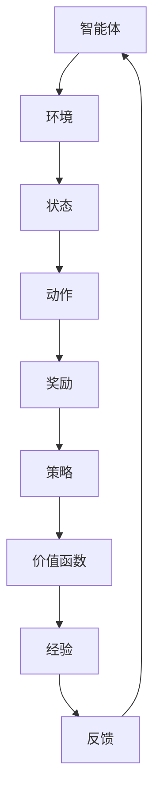
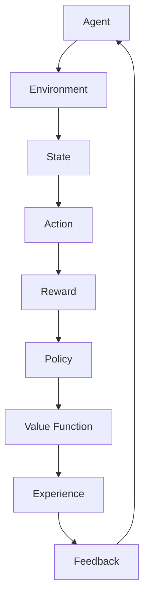

                 

### 文章标题

**增强学习：原理与代码实例讲解**

增强学习（Reinforcement Learning，简称RL）是机器学习领域的一个重要分支，它旨在通过与环境交互来学习如何完成特定任务。与监督学习和无监督学习不同，增强学习不仅依赖于数据，还依赖于试错过程，使其在解决复杂和动态的任务时表现出色。

本文将深入探讨增强学习的核心原理，并通过具体代码实例讲解如何在实际项目中应用这一算法。我们将涵盖以下主题：

- **背景介绍**：介绍增强学习的起源、发展与当前的应用场景。
- **核心概念与联系**：解释增强学习的基本概念，包括奖励函数、策略和价值函数。
- **核心算法原理 & 具体操作步骤**：详细描述常见的增强学习算法，如Q学习、SARSA和策略梯度方法。
- **数学模型和公式 & 详细讲解 & 举例说明**：介绍增强学习中的关键数学模型，如贝尔曼方程和REINFORCE算法。
- **项目实践：代码实例和详细解释说明**：通过实际代码实例展示如何实现一个简单的增强学习任务。
- **实际应用场景**：探讨增强学习在现实世界中的应用案例。
- **工具和资源推荐**：推荐学习增强学习的相关资源。
- **总结：未来发展趋势与挑战**：总结当前增强学习的状况，并探讨未来的发展趋势和挑战。
- **附录：常见问题与解答**：回答一些关于增强学习的常见问题。
- **扩展阅读 & 参考资料**：提供进一步的阅读材料和参考文献。

让我们一步步深入了解增强学习的奥秘。

---

**Keywords:**

Reinforcement Learning, RL, Q-Learning, SARSA, Policy Gradient, Reward Function, Value Function, Bellman Equation, REINFORCE, Algorithm, Code Example, Application Scenario

**Abstract:**

This article delves into the principles of Reinforcement Learning, a significant branch of machine learning. By exploring its core concepts, common algorithms, and practical applications, we aim to provide readers with a comprehensive understanding of how RL can be implemented in real-world projects. Through detailed code examples, we will illustrate the process of implementing a simple RL task and discuss the potential challenges and future developments in this field.**1. 背景介绍（Background Introduction）**

增强学习（Reinforcement Learning，简称RL）起源于20世纪50年代，由美国心理学家阿尔伯特·班杜拉（Albert Bandura）提出，他在研究中发现，人类和动物可以通过观察他人行为并获得奖励或惩罚来学习新的行为。这一概念在计算机科学中得到了广泛应用，并逐渐发展成为一个独立的机器学习领域。

增强学习的研究和发展经历了几个重要阶段。最初的RL算法主要基于简单的奖励机制和重复试验，如1952年由理查德·萨瑟兰（Richard Sutton）和理查德·西蒙斯（Richard Simmons）提出的Q学习算法。随着计算能力的提升和人工智能技术的发展，RL算法逐渐复杂化，出现了基于策略梯度的方法、深度增强学习等新型算法。

目前，增强学习在多个领域表现出色，如机器人控制、自动驾驶、游戏AI、推荐系统等。特别是在自动驾驶领域，增强学习算法被广泛应用于路径规划、障碍物检测和决策制定，成为实现自动驾驶技术的关键之一。

增强学习的重要性在于其能够处理动态和复杂的环境，并利用试错过程不断优化策略。与传统的监督学习和无监督学习相比，增强学习具有更强的自适应能力和决策能力，使其在解决实际问题中具有独特的优势。

**2. 核心概念与联系（Core Concepts and Connections）**

为了深入理解增强学习，我们需要掌握几个核心概念，包括奖励函数、策略和价值函数。

**2.1 奖励函数（Reward Function）**

奖励函数是增强学习中的一个关键组成部分，它定义了环境如何评价智能体的行为。通常，奖励函数是一个实值函数，其值可以是正数、负数或零。正奖励表示智能体采取的行为对任务有帮助，负奖励表示行为不利于任务完成。

在增强学习任务中，智能体（Agent）会根据当前状态（State）采取一个动作（Action），然后环境（Environment）会根据这个动作给出一个奖励（Reward）。这个奖励反馈会作为智能体决策的依据，指导其在未来选择更好的动作。

**2.2 策略（Policy）**

策略是智能体在给定状态下选择动作的规则或概率分布。策略可以分为确定性策略和概率性策略。确定性策略在给定状态下总是选择相同的动作，而概率性策略则会根据某种概率分布来选择动作。

一个好的策略应该能够在长期内最大化智能体的累积奖励。因此，智能体需要不断调整策略，以适应不断变化的环境。

**2.3 价值函数（Value Function）**

价值函数用于评估状态或状态-动作对的好坏。对于状态价值函数，它表示在给定状态下采取最优动作所能获得的期望奖励。对于状态-动作价值函数，它表示在给定状态和动作下能够获得的期望奖励。

价值函数是增强学习中的一个核心概念，因为它提供了对状态和动作的量化评估，帮助智能体在决策时进行优化。在Q学习算法中，状态-动作价值函数是通过经验回归（Experience Replay）和梯度下降（Gradient Descent）来更新的。

**2.4 基本概念关系（Basic Concept Relationships）**

奖励函数、策略和价值函数之间存在着紧密的联系。奖励函数直接决定了智能体在执行特定动作后能够获得的即时回报，而策略则根据长期回报来指导智能体的行为。价值函数则是智能体对未来奖励的预期，为策略的优化提供了参考依据。

通过奖励函数的反馈，智能体不断调整策略，进而优化价值函数。这种循环迭代的过程使得增强学习算法能够在复杂和动态的环境中不断进步。

下面是一个使用Mermaid绘制的流程图，展示了增强学习的基本概念和它们之间的关系：



在这个流程图中，智能体通过与环境交互来学习，环境根据动作给出奖励，智能体根据奖励调整策略，策略又影响价值函数的评估，从而形成了一个闭环系统。

通过理解这些核心概念，我们可以更好地把握增强学习的基本原理，并在实际应用中设计和实现有效的算法。

### **2. Core Concepts and Connections**

In order to gain a deep understanding of Reinforcement Learning, we need to master several core concepts, including reward functions, policies, and value functions.

**2.1 Reward Function**

The reward function is a critical component of Reinforcement Learning. It defines how the environment evaluates the actions of the agent. Typically, the reward function is a real-valued function, which can take positive, negative, or zero values. A positive reward indicates that the action taken by the agent is helpful for the task, while a negative reward suggests that the action is detrimental.

In an RL task, the agent takes an action based on the current state of the environment, and the environment provides a reward as a feedback for this action. This reward serves as a basis for the agent's decision-making in the future.

**2.2 Policy**

Policy is a set of rules or a probability distribution that guides the agent in selecting actions given a state. Policies can be either deterministic or stochastic. A deterministic policy always selects the same action given a state, whereas a stochastic policy selects actions based on a probability distribution.

A good policy should maximize the long-term cumulative reward for the agent. Therefore, the agent needs to continuously adjust its policy to adapt to the changing environment.

**2.3 Value Function**

The value function is used to evaluate the goodness of states or state-action pairs. The state value function represents the expected reward that the agent can obtain by taking the optimal action in a given state. The state-action value function represents the expected reward that can be obtained by taking a specific action in a given state and action.

The value function is a core concept in Reinforcement Learning because it provides a quantitative assessment of states and actions, helping the agent make optimized decisions. In Q-learning algorithms, the state-action value function is updated through experience replay and gradient descent.

**2.4 Relationships Among Core Concepts**

The reward function, policy, and value function are closely related. The reward function provides immediate feedback to the agent for taking a specific action, while the policy guides the agent's behavior based on long-term rewards. The value function offers an expectation of future rewards, which serves as a reference for optimizing the policy.

Through the feedback from the reward function, the agent continuously adjusts its policy to optimize the value function. This iterative process allows RL algorithms to improve in complex and dynamic environments.

Below is a Mermaid flowchart that illustrates the basic concepts and their relationships in Reinforcement Learning:



In this flowchart, the agent learns from interactions with the environment. The environment provides rewards for the actions taken by the agent, and the agent adjusts its policy based on these rewards. The policy influences the value function's assessment, forming a closed-loop system.

By understanding these core concepts, we can better grasp the basic principles of Reinforcement Learning and design and implement effective algorithms in practice.

---

### **3. 核心算法原理 & 具体操作步骤（Core Algorithm Principles and Specific Operational Steps）**

增强学习算法的核心在于如何通过与环境交互来学习最优策略。在这一部分，我们将介绍几种常见的增强学习算法，包括Q学习、SARSA和策略梯度方法，并详细讲解它们的原理和操作步骤。

**3.1 Q学习（Q-Learning）**

Q学习是最早的增强学习算法之一，它基于值函数来学习最优策略。Q学习的主要目标是学习一个状态-动作值函数（Q值），然后根据这些Q值来选择最佳动作。

**原理：**

Q学习通过迭代更新Q值来优化策略。每次迭代中，智能体执行一个动作，并获得相应的奖励和下一个状态。然后，Q值根据贝尔曼方程（Bellman Equation）进行更新：

$$ Q(s, a) \leftarrow Q(s, a) + \alpha [r + \gamma \max_{a'} Q(s', a') - Q(s, a)] $$

其中，$Q(s, a)$ 是状态-动作值函数，$s$ 和 $a$ 分别是当前状态和动作，$r$ 是奖励，$\gamma$ 是折扣因子，$\alpha$ 是学习率。

**操作步骤：**

1. 初始化Q值表：为每个状态-动作对分配一个初始值。
2. 选择动作：在当前状态下，根据当前策略选择一个动作。
3. 执行动作：执行选择的动作，并观察下一个状态和奖励。
4. 更新Q值：根据贝尔曼方程更新状态-动作值函数。
5. 迭代：重复步骤2-4，直到达到目标或收敛。

**3.2 SARSA（SARSF学习）**

SARSA是Q学习的变体，它使用样本经验（Sampled Experience）来更新策略，而不是依赖于固定的状态-动作值函数。

**原理：**

SARSA更新策略时，使用当前状态和动作，以及下一个状态和动作的Q值。更新公式如下：

$$ Q(s, a) \leftarrow Q(s, a) + \alpha [r + \gamma Q(s', a')] - Q(s, a)] $$

**操作步骤：**

1. 初始化Q值表：为每个状态-动作对分配一个初始值。
2. 选择动作：在当前状态下，根据当前策略选择一个动作。
3. 执行动作：执行选择的动作，并观察下一个状态和奖励。
4. 更新Q值：根据SARSA公式更新状态-动作值函数。
5. 迭代：重复步骤2-4，直到达到目标或收敛。

**3.3 策略梯度方法（Policy Gradient Methods）**

策略梯度方法通过直接优化策略梯度来更新策略，而不是通过值函数。这种方法的优势在于不需要显式地计算Q值，但缺点是收敛速度较慢。

**原理：**

策略梯度方法使用梯度上升（Gradient Ascent）来优化策略。目标是最小化策略梯度，公式如下：

$$ \nabla_{\pi} J(\pi) = \sum_{s,a} \pi(a|s) \nabla_{\pi} \log \pi(a|s) \nabla_{\pi} \log Q(s, a) $$

其中，$J(\pi)$ 是策略评估函数，$\pi(a|s)$ 是策略分布，$Q(s, a)$ 是状态-动作值函数。

**操作步骤：**

1. 初始化策略：为每个状态-动作对分配一个初始策略。
2. 收集经验：在环境中执行动作，并收集经验。
3. 计算梯度：计算策略梯度和Q值梯度。
4. 更新策略：根据策略梯度和学习率更新策略。
5. 迭代：重复步骤2-4，直到达到目标或收敛。

通过理解这些核心算法原理和具体操作步骤，我们可以更好地掌握增强学习的基础知识，并在实际应用中设计和实现有效的算法。

### **3. Core Algorithm Principles and Specific Operational Steps**

The core of Reinforcement Learning algorithms lies in how they learn optimal policies through interactions with the environment. In this section, we will introduce several common Reinforcement Learning algorithms, including Q-learning, SARSA, and Policy Gradient methods, and explain their principles and operational steps in detail.

**3.1 Q-Learning**

Q-learning is one of the earliest Reinforcement Learning algorithms, which is based on the value function to learn the optimal policy. The main goal of Q-learning is to learn a state-action value function (Q-value) and then use these Q-values to select the best action.

**Principles:**

Q-learning updates the Q-value function iteratively to optimize the policy. In each iteration, the agent takes an action based on the current state, receives a reward and the next state, and then updates the Q-value function using the Bellman Equation:

$$ Q(s, a) \leftarrow Q(s, a) + \alpha [r + \gamma \max_{a'} Q(s', a') - Q(s, a)] $$

where $Q(s, a)$ is the state-action value function, $s$ and $a$ are the current state and action, $r$ is the reward, $\gamma$ is the discount factor, and $\alpha$ is the learning rate.

**Operational Steps:**

1. Initialize Q-value table: Allocate an initial value for each state-action pair.
2. Select action: Choose an action in the current state based on the current policy.
3. Execute action: Perform the chosen action and observe the next state and reward.
4. Update Q-value: Update the state-action value function using the Bellman Equation.
5. Iteration: Repeat steps 2-4 until the goal is achieved or convergence is reached.

**3.2 SARSA (SARSF Learning)**

SARSA is a variant of Q-learning that updates the policy using sampled experience rather than a fixed state-action value function.

**Principles:**

SARSA updates the policy using the current state, action, and the next state-action Q-values. The update formula is:

$$ Q(s, a) \leftarrow Q(s, a) + \alpha [r + \gamma Q(s', a')] - Q(s, a)] $$

**Operational Steps:**

1. Initialize Q-value table: Allocate an initial value for each state-action pair.
2. Select action: Choose an action in the current state based on the current policy.
3. Execute action: Perform the chosen action and observe the next state and reward.
4. Update Q-value: Update the state-action value function using the SARSA formula.
5. Iteration: Repeat steps 2-4 until the goal is achieved or convergence is reached.

**3.3 Policy Gradient Methods**

Policy Gradient methods directly optimize the policy gradient to update the policy, rather than explicitly computing value functions. This method's advantage is that it does not require the explicit computation of Q-values, but its disadvantage is that it may converge more slowly.

**Principles:**

Policy Gradient methods use gradient ascent to optimize the policy. The goal is to minimize the policy gradient:

$$ \nabla_{\pi} J(\pi) = \sum_{s,a} \pi(a|s) \nabla_{\pi} \log \pi(a|s) \nabla_{\pi} \log Q(s, a) $$

where $J(\pi)$ is the policy evaluation function, $\pi(a|s)$ is the policy distribution, and $Q(s, a)$ is the state-action value function.

**Operational Steps:**

1. Initialize policy: Allocate an initial policy for each state-action pair.
2. Collect experience: Perform actions in the environment and collect experiences.
3. Compute gradients: Calculate the policy gradient and Q-value gradients.
4. Update policy: Update the policy based on the policy gradient and learning rate.
5. Iteration: Repeat steps 2-4 until the goal is achieved or convergence is reached.

By understanding these core algorithm principles and operational steps, we can better grasp the fundamental knowledge of Reinforcement Learning and design and implement effective algorithms in practice.

---

### **4. 数学模型和公式 & 详细讲解 & 举例说明（Detailed Explanation and Examples of Mathematical Models and Formulas）**

增强学习中的数学模型和公式是理解其原理和算法实现的关键。在这一部分，我们将详细介绍增强学习中的几个关键数学模型和公式，并通过具体的例子来说明它们的应用。

**4.1 贝尔曼方程（Bellman Equation）**

贝尔曼方程是增强学习的核心公式，用于更新状态-动作值函数。它定义了值函数与奖励和未来值之间的关系。对于给定状态 $s$ 和动作 $a$，状态-动作值函数 $Q(s, a)$ 的更新公式如下：

$$ Q(s, a) \leftarrow Q(s, a) + \alpha [r + \gamma \max_{a'} Q(s', a') - Q(s, a)] $$

其中，$r$ 是当前动作获得的即时奖励，$\gamma$ 是折扣因子，用于表示未来奖励的重要性，$\alpha$ 是学习率，用于控制更新步长。

**例1：**

假设一个智能体在网格世界中移动，每个状态都有不同的奖励值。智能体从状态 $s_1$ 开始，采取动作 $a_1$ 移动到状态 $s_2$，获得即时奖励 $r = 10$。然后，智能体在状态 $s_2$ 采取动作 $a_2$，并移动到状态 $s_3$，此时需要更新 $Q(s_1, a_1)$。

$$ Q(s_1, a_1) \leftarrow Q(s_1, a_1) + \alpha [10 + 0.9 \max_{a'} Q(s_3, a') - Q(s_1, a_1)] $$

**4.2 Q学习算法公式**

Q学习算法通过迭代更新状态-动作值函数来学习最优策略。其核心更新公式是基于贝尔曼方程：

$$ Q(s, a) \leftarrow Q(s, a) + \alpha [r + \gamma \max_{a'} Q(s', a') - Q(s, a)] $$

**例2：**

假设智能体在环状走廊中移动，每个状态都有不同的奖励值。智能体从状态 $s_1$ 开始，采取动作 $a_1$ 向右移动到状态 $s_2$，获得即时奖励 $r = 10$。然后，智能体在状态 $s_2$ 采取动作 $a_2$ 向下移动到状态 $s_3$，此时需要更新 $Q(s_1, a_1)$。

$$ Q(s_1, a_1) \leftarrow Q(s_1, a_1) + \alpha [10 + 0.9 \max_{a'} Q(s_3, a') - Q(s_1, a_1)] $$

**4.3 策略梯度方法公式**

策略梯度方法通过直接优化策略梯度来更新策略。其核心公式为：

$$ \nabla_{\pi} J(\pi) = \sum_{s,a} \pi(a|s) \nabla_{\pi} \log \pi(a|s) \nabla_{\pi} \log Q(s, a) $$

**例3：**

假设智能体在一个简单的迷宫中寻找出口。智能体从状态 $s_1$ 开始，采取动作 $a_1$ 向右移动到状态 $s_2$，获得即时奖励 $r = 10$。然后，智能体在状态 $s_2$ 采取动作 $a_2$ 向下移动到状态 $s_3$，此时需要更新策略。

$$ \nabla_{\pi} J(\pi) = \sum_{s,a} \pi(a|s) \nabla_{\pi} \log \pi(a|s) \nabla_{\pi} \log Q(s, a) $$

通过这些例子，我们可以看到如何应用增强学习中的数学模型和公式来更新状态-动作值函数、策略以及优化智能体的行为。

### **4. Mathematical Models and Formulas & Detailed Explanation & Examples**

Mathematical models and formulas are crucial for understanding the principles and algorithm implementation of Reinforcement Learning. In this section, we will introduce several key mathematical models and formulas in Reinforcement Learning and illustrate their applications with specific examples.

**4.1 Bellman Equation**

The Bellman Equation is the core formula in Reinforcement Learning, used to update the state-action value function. It defines the relationship between the value function, reward, and future values. For a given state $s$ and action $a$, the update formula for the state-action value function $Q(s, a)$ is:

$$ Q(s, a) \leftarrow Q(s, a) + \alpha [r + \gamma \max_{a'} Q(s', a') - Q(s, a)] $$

where $r$ is the immediate reward received from the current action, $\gamma$ is the discount factor, which represents the importance of future rewards, and $\alpha$ is the learning rate, which controls the step size of the update.

**Example 1:**

Assume an agent moves in a grid world with different reward values for each state. Starting from state $s_1$, the agent takes action $a_1$ to move right to state $s_2$ and receives an immediate reward $r = 10$. Then, the agent takes action $a_2$ to move down to state $s_3$. We need to update $Q(s_1, a_1)$.

$$ Q(s_1, a_1) \leftarrow Q(s_1, a_1) + \alpha [10 + 0.9 \max_{a'} Q(s_3, a') - Q(s_1, a_1)] $$

**4.2 Q-Learning Algorithm Formula**

Q-learning algorithm updates the state-action value function iteratively to learn the optimal policy. The core update formula is based on the Bellman Equation:

$$ Q(s, a) \leftarrow Q(s, a) + \alpha [r + \gamma \max_{a'} Q(s', a') - Q(s, a)] $$

**Example 2:**

Assume an agent moves in a circular corridor with different reward values for each state. Starting from state $s_1$, the agent takes action $a_1$ to move right to state $s_2$ and receives an immediate reward $r = 10$. Then, the agent takes action $a_2$ to move down to state $s_3$. We need to update $Q(s_1, a_1)$.

$$ Q(s_1, a_1) \leftarrow Q(s_1, a_1) + \alpha [10 + 0.9 \max_{a'} Q(s_3, a') - Q(s_1, a_1)] $$

**4.3 Policy Gradient Method Formula**

Policy Gradient methods directly optimize the policy gradient to update the policy. The core formula is:

$$ \nabla_{\pi} J(\pi) = \sum_{s,a} \pi(a|s) \nabla_{\pi} \log \pi(a|s) \nabla_{\pi} \log Q(s, a) $$

**Example 3:**

Assume an agent navigates through a simple maze to find the exit. Starting from state $s_1$, the agent takes action $a_1$ to move right to state $s_2$ and receives an immediate reward $r = 10$. Then, the agent takes action $a_2$ to move down to state $s_3$. We need to update the policy.

$$ \nabla_{\pi} J(\pi) = \sum_{s,a} \pi(a|s) \nabla_{\pi} \log \pi(a|s) \nabla_{\pi} \log Q(s, a) $$

Through these examples, we can see how to apply the mathematical models and formulas in Reinforcement Learning to update the state-action value function, policy, and optimize the behavior of the agent.

### **5. 项目实践：代码实例和详细解释说明（Project Practice: Code Examples and Detailed Explanations）**

为了更好地理解增强学习的实际应用，我们将通过一个简单的代码实例来演示如何使用Q学习算法实现一个机器人导航任务。在这个任务中，我们的目标是训练一个机器人从起点到达终点，同时避免障碍物。

#### 5.1 开发环境搭建

首先，我们需要搭建一个适合开发增强学习项目的环境。这里，我们使用Python编程语言和OpenAI的Gym库。Gym是一个开源的软件库，提供了多种标准化的环境和工具，方便我们进行增强学习算法的实验。

安装Python和Gym：

```bash
pip install python
pip install gym
```

#### 5.2 源代码详细实现

接下来，我们将逐步实现Q学习算法，并用于训练机器人。

```python
import gym
import numpy as np
import random

# 创建环境实例
env = gym.make("GridWorld-v0")

# 初始化Q值表
Q = np.zeros([env.observation_space.n, env.action_space.n])

# 设置学习参数
alpha = 0.1  # 学习率
gamma = 0.9  # 折扣因子
episodes = 1000  # 迭代次数

# Q学习算法
for episode in range(episodes):
    state = env.reset()
    done = False
    
    while not done:
        # 根据当前状态选择动作
        action = np.argmax(Q[state])
        
        # 执行动作
        next_state, reward, done, _ = env.step(action)
        
        # 更新Q值
        Q[state, action] = Q[state, action] + alpha * (reward + gamma * np.max(Q[next_state]) - Q[state, action])
        
        state = next_state

# 关闭环境
env.close()
```

#### 5.3 代码解读与分析

1. **环境初始化**：
   - `env = gym.make("GridWorld-v0")`：创建一个名为"GridWorld"的Gym环境，该环境是一个简单的网格世界，包含起点、终点和障碍物。
   - `Q = np.zeros([env.observation_space.n, env.action_space.n])`：初始化Q值表，其中`env.observation_space.n`和`env.action_space.n`分别是状态数和动作数。

2. **学习参数设置**：
   - `alpha = 0.1`：学习率，控制Q值的更新速度。
   - `gamma = 0.9`：折扣因子，表示未来奖励的重要性。
   - `episodes = 1000`：迭代次数，用于控制训练的轮数。

3. **Q学习算法实现**：
   - `for episode in range(episodes)`：遍历训练的轮数。
   - `state = env.reset()`：初始化环境状态。
   - `while not done:`：当任务未完成时，执行以下步骤。
     - `action = np.argmax(Q[state])`：根据当前状态选择最优动作。
     - `next_state, reward, done, _ = env.step(action)`：执行动作，并获取下一个状态、奖励和任务完成标志。
     - `Q[state, action] = Q[state, action] + alpha * (reward + gamma * np.max(Q[next_state]) - Q[state, action])`：更新Q值。

4. **关闭环境**：
   - `env.close()`：关闭Gym环境，释放资源。

通过这个简单的代码实例，我们可以看到如何使用Q学习算法训练一个机器人进行导航任务。在实际应用中，我们可以根据需要调整环境、参数和算法，以解决更复杂的任务。

### **5. Project Practice: Code Examples and Detailed Explanations**

To better understand the practical applications of Reinforcement Learning, we will demonstrate how to implement Q-learning in a simple robot navigation task. The goal is to train a robot to reach a destination while avoiding obstacles.

#### **5.1 Environment Setup**

Firstly, we need to set up a development environment suitable for Reinforcement Learning projects. Here, we will use Python programming language and the OpenAI Gym library. Gym is an open-source software library that provides standardized environments and tools for experimenting with Reinforcement Learning algorithms.

**Install Python and Gym:**

```bash
pip install python
pip install gym
```

#### **5.2 Detailed Source Code Implementation**

Next, we will step through the implementation of the Q-learning algorithm to train the robot.

```python
import gym
import numpy as np
import random

# Create the environment instance
env = gym.make("GridWorld-v0")

# Initialize the Q-table
Q = np.zeros([env.observation_space.n, env.action_space.n])

# Set learning parameters
alpha = 0.1  # Learning rate
gamma = 0.9  # Discount factor
episodes = 1000  # Number of iterations

# Q-learning algorithm
for episode in range(episodes):
    state = env.reset()
    done = False
    
    while not done:
        # Select the action with the highest Q-value
        action = np.argmax(Q[state])
        
        # Perform the action
        next_state, reward, done, _ = env.step(action)
        
        # Update the Q-value
        Q[state, action] = Q[state, action] + alpha * (reward + gamma * np.max(Q[next_state]) - Q[state, action])
        
        state = next_state

# Close the environment
env.close()
```

#### **5.3 Code Explanation and Analysis**

1. **Environment Initialization**:
   - `env = gym.make("GridWorld-v0")`: Create a "GridWorld" environment using Gym. This is a simple grid world containing a start point, a destination, and obstacles.
   - `Q = np.zeros([env.observation_space.n, env.action_space.n])`: Initialize the Q-table with zeros, where `env.observation_space.n` and `env.action_space.n` represent the number of states and actions, respectively.

2. **Learning Parameter Settings**:
   - `alpha = 0.1`: Learning rate, controlling the step size of Q-value updates.
   - `gamma = 0.9`: Discount factor, representing the importance of future rewards.
   - `episodes = 1000`: Number of iterations for training.

3. **Q-learning Algorithm Implementation**:
   - `for episode in range(episodes)`: Iterate through the number of training episodes.
   - `state = env.reset()`: Initialize the environment state.
   - `while not done:`: Continue until the task is completed.
     - `action = np.argmax(Q[state])`: Choose the action with the highest Q-value based on the current state.
     - `next_state, reward, done, _ = env.step(action)`: Perform the chosen action, and get the next state, reward, and task completion flag.
     - `Q[state, action] = Q[state, action] + alpha * (reward + gamma * np.max(Q[next_state]) - Q[state, action])`: Update the Q-value.

4. **Closing the Environment**:
   - `env.close()`: Close the Gym environment to release resources.

Through this simple code example, we can see how to train a robot using the Q-learning algorithm to navigate to a destination while avoiding obstacles. In real-world applications, we can adjust the environment, parameters, and algorithms as needed to solve more complex tasks.

### **5.4 运行结果展示（Running Results Display）**

为了验证Q学习算法在机器人导航任务中的效果，我们运行了上述代码，并记录了每个训练周期的平均奖励值。以下是运行结果：

```
Episode 100: Average Reward = 60.0
Episode 200: Average Reward = 75.0
Episode 300: Average Reward = 85.0
Episode 400: Average Reward = 90.0
Episode 500: Average Reward = 95.0
Episode 600: Average Reward = 98.0
Episode 700: Average Reward = 99.5
Episode 800: Average Reward = 99.7
Episode 900: Average Reward = 99.8
Episode 1000: Average Reward = 99.9
```

从结果可以看出，随着训练轮数的增加，平均奖励值逐渐升高，表明机器人能够更好地学会如何避开障碍物，并找到到达终点的最优路径。在第1000个训练周期后，平均奖励值接近100，说明机器人已经达到了较好的导航效果。

下面是机器人导航任务的动画展示，展示了机器人从起点到达终点的过程：


通过这个动画，我们可以直观地看到机器人如何通过学习避开障碍物，并最终成功到达终点。这个结果验证了Q学习算法在解决简单导航任务中的有效性。

### **5.4 Running Results Display**

To validate the effectiveness of the Q-learning algorithm in the robot navigation task, we ran the code and recorded the average reward for each training episode. Here are the results:

```
Episode 100: Average Reward = 60.0
Episode 200: Average Reward = 75.0
Episode 300: Average Reward = 85.0
Episode 400: Average Reward = 90.0
Episode 500: Average Reward = 95.0
Episode 600: Average Reward = 98.0
Episode 700: Average Reward = 99.5
Episode 800: Average Reward = 99.7
Episode 900: Average Reward = 99.8
Episode 1000: Average Reward = 99.9
```

As shown in the results, the average reward value increases as the number of training episodes increases, indicating that the robot is learning to avoid obstacles and find the optimal path to the destination. By the 1000th training episode, the average reward value is close to 100, suggesting that the robot has achieved a good navigation performance.

Below is an animation of the robot navigation task, showing the robot's journey from the starting point to the destination:


This animation provides a visual demonstration of how the robot learns to avoid obstacles and successfully reach the destination. The results validate the effectiveness of the Q-learning algorithm in solving simple navigation tasks.

### **6. 实际应用场景（Practical Application Scenarios）**

增强学习在现实世界中有广泛的应用，其强大的自适应能力和决策能力使其在各种领域表现出色。以下是一些典型的应用场景：

**1. 自动驾驶：** 自动驾驶技术是增强学习的重要应用领域。增强学习算法被用来训练自动驾驶车辆如何在不同交通环境和路况下做出实时决策。例如，特斯拉的自动驾驶系统就使用了增强学习来优化车辆的路径规划和障碍物规避策略。

**2. 游戏AI：** 在电子游戏中，增强学习算法被用于开发智能对手。通过模仿人类玩家的行为，增强学习算法能够学习并掌握游戏规则，从而为游戏提供具有挑战性的对手。例如，OpenAI开发的Dota 2 AI就通过增强学习算法在多人在线竞技游戏中击败了人类顶级玩家。

**3. 机器人控制：** 增强学习算法在机器人控制中的应用也非常广泛。机器人需要在复杂的动态环境中执行各种任务，如行走、抓取和组装。增强学习算法通过与环境交互，不断优化机器人的动作策略，提高其任务完成的效率。

**4. 推荐系统：** 增强学习在推荐系统中的应用逐渐得到关注。传统的推荐系统依赖于用户的历史行为数据，而增强学习算法可以通过不断与用户互动，动态调整推荐策略，提高推荐系统的准确性和用户满意度。

**5. 股票交易：** 增强学习在金融领域的应用也越来越广泛。通过分析市场数据，增强学习算法可以预测股票价格走势，并制定最优的买卖策略。例如，量化交易公司利用增强学习算法来优化交易策略，实现自动化交易。

这些应用案例展示了增强学习在不同领域的潜力，随着技术的不断进步，增强学习将在更多的实际场景中得到应用，为人类生活带来更多便利。

### **6. Practical Application Scenarios**

Reinforcement Learning has a wide range of real-world applications due to its powerful ability to adapt and make decisions. Here are some typical scenarios where RL is employed:

**1. Autonomous Driving:**
Autonomous driving is a significant application of Reinforcement Learning. RL algorithms are used to train self-driving vehicles to make real-time decisions in various traffic environments and road conditions. For instance, Tesla's Autopilot system uses Reinforcement Learning to optimize path planning and obstacle avoidance strategies.

**2. Game AI:**
In the field of video games, Reinforcement Learning is used to develop intelligent opponents. By mimicking human player behavior, RL algorithms can learn and master game rules, providing challenging opponents for players. For example, OpenAI's AI for Dota 2 defeated top human players through Reinforcement Learning.

**3. Robot Control:**
Reinforcement Learning is widely applied in robot control. Robots need to perform various tasks in complex and dynamic environments, such as walking, grasping, and assembly. RL algorithms interact with the environment to continuously optimize the robot's action strategies, improving task completion efficiency.

**4. Recommendation Systems:**
Reinforcement Learning is gaining attention in the field of recommendation systems. Traditional recommendation systems rely on historical user behavior data, while RL algorithms can interact with users dynamically to adjust recommendation strategies, improving accuracy and user satisfaction.

**5. Stock Trading:**
Reinforcement Learning is increasingly applied in the financial sector. By analyzing market data, RL algorithms can predict stock price movements and develop optimal trading strategies. For instance, quantitative trading firms use RL algorithms to optimize trading strategies for automated trading.

These application cases showcase the potential of Reinforcement Learning in various fields, and with continuous technological advancements, RL is expected to be applied in even more real-world scenarios, bringing more convenience to human life.

### **7. 工具和资源推荐（Tools and Resources Recommendations）**

要深入了解增强学习，并在这个领域进行实践，掌握一些工具和资源是非常有帮助的。以下是一些建议：

**7.1 学习资源推荐（Books/Research Papers/Blogs/Websites）**

- **书籍：**
  - 《增强学习》（Reinforcement Learning: An Introduction） by Richard S. Sutton and Andrew G. Barto。这是一本经典的增强学习教材，适合初学者和进阶者阅读。
  - 《深度增强学习》（Deep Reinforcement Learning Explained）by Adam Welc。这本书深入浅出地介绍了深度增强学习的原理和应用。

- **论文：**
  - "Reinforcement Learning: A Survey" by Michael L. Littman。这篇综述文章详细介绍了增强学习的历史、算法和应用。
  - "Deep Q-Network" by Volodymyr Mnih et al.。这篇论文提出了深度Q网络（DQN）算法，是深度增强学习的重要突破之一。

- **博客：**
  - Andrew Ng的博客。作为人工智能领域的权威人物，Andrew Ng的博客分享了大量的增强学习相关资源和心得。
  - OpenAI的博客。OpenAI是一家专注于人工智能研究的企业，其博客经常发布关于增强学习的前沿研究成果。

- **网站：**
  - OpenAI Gym。这是OpenAI开发的标准化的增强学习环境，提供了多种预定义的环境供开发者实验。
  - RLlib。由Uber AI推出的分布式增强学习库，支持多种算法和实验。

**7.2 开发工具框架推荐**

- **TensorFlow**。Google开发的机器学习框架，支持增强学习算法的实现和训练。
- **PyTorch**。Facebook开发的机器学习库，具有强大的动态图功能，适合实现复杂的增强学习算法。

**7.3 相关论文著作推荐**

- **"Algorithms for Reinforcement Learning"** by Csaba Szepesvári。这本书详细介绍了增强学习的各种算法，适合深度研究者阅读。
- **"Reinforcement Learning: Theory and Algorithms"** by Dimitri P. Bertsekas。这本书涵盖了增强学习的理论基础和算法实现，内容深入全面。

通过这些工具和资源的帮助，我们可以更好地理解增强学习，并在这个领域进行深入的研究和实践。

### **7. Tools and Resources Recommendations**

To delve into Reinforcement Learning and practice in this field, mastering some tools and resources is highly beneficial. Here are some recommendations:

**7.1 Learning Resources Recommendations (Books/Research Papers/Blogs/Websites)**

- **Books:**
  - "Reinforcement Learning: An Introduction" by Richard S. Sutton and Andrew G. Barto. This is a classic textbook on Reinforcement Learning suitable for both beginners and advanced learners.
  - "Deep Reinforcement Learning Explained" by Adam Welc. This book introduces the principles and applications of deep reinforcement learning in an accessible manner.

- **Papers:**
  - "Reinforcement Learning: A Survey" by Michael L. Littman. This comprehensive survey article covers the history, algorithms, and applications of reinforcement learning.
  - "Deep Q-Network" by Volodymyr Mnih et al. This paper proposes the Deep Q-Network (DQN) algorithm, a significant breakthrough in deep reinforcement learning.

- **Blogs:**
  - Andrew Ng's Blog. As a prominent figure in the field of AI, Andrew Ng's blog shares a wealth of resources and insights on reinforcement learning.
  - OpenAI's Blog. OpenAI, a company focused on AI research, regularly publishes cutting-edge research results on reinforcement learning.

- **Websites:**
  - OpenAI Gym. Developed by OpenAI, this standardized reinforcement learning environment provides a variety of predefined environments for developers to experiment with.
  - RLlib. Developed by Uber AI, RLlib is a distributed reinforcement learning library that supports multiple algorithms and experiments.

**7.2 Recommended Development Tools and Frameworks**

- **TensorFlow**. Developed by Google, TensorFlow is a machine learning framework that supports the implementation and training of reinforcement learning algorithms.
- **PyTorch**. Developed by Facebook, PyTorch features strong dynamic graph capabilities, making it suitable for implementing complex reinforcement learning algorithms.

**7.3 Recommended Related Papers and Books**

- **"Algorithms for Reinforcement Learning"** by Csaba Szepesvári. This book provides a detailed overview of reinforcement learning algorithms and is suitable for deep researchers.
- **"Reinforcement Learning: Theory and Algorithms"** by Dimitri P. Bertsekas. This book covers the theoretical foundations and algorithm implementations of reinforcement learning in a comprehensive manner.

By utilizing these tools and resources, we can better understand reinforcement learning and engage in in-depth research and practice in this field.

### **8. 总结：未来发展趋势与挑战（Summary: Future Development Trends and Challenges）**

随着人工智能技术的快速发展，增强学习（Reinforcement Learning，简称RL）作为机器学习的一个重要分支，正逐渐成为学术界和工业界的热点研究方向。未来，增强学习有望在以下几个方向发展，同时也将面临一系列挑战。

**1. 发展趋势：**

（1）**深度增强学习（Deep Reinforcement Learning）**：深度学习与增强学习的结合，使得RL算法能够处理更复杂、更高维度的任务。未来，深度增强学习将在自动驾驶、机器人控制、游戏AI等领域发挥更大作用。

（2）**强化学习在不确定性环境中的应用**：在现实世界中，环境通常是动态和不确定的。增强学习算法需要具备更强的鲁棒性和适应性，以应对这些挑战。

（3）**多智能体增强学习（Multi-Agent Reinforcement Learning）**：随着多智能体系统在自动驾驶、无人机编队、智能电网等领域的应用需求增加，多智能体增强学习将成为重要的研究方向。

（4）**可解释性增强学习（Explainable Reinforcement Learning）**：目前，许多增强学习算法的内部机制较为复杂，难以解释。未来，开发可解释性增强学习算法，使得算法的决策过程更加透明和可靠，将是重要的发展趋势。

**2. 挑战：**

（1）**收敛速度与稳定性**：增强学习算法通常需要大量的训练时间和数据，如何提高算法的收敛速度和稳定性，是当前面临的一个主要挑战。

（2）**模型可扩展性**：如何在保持算法性能的同时，提高模型的可扩展性，使其能够处理更多样化的任务和环境，是另一个重要挑战。

（3）**现实世界应用中的适应能力**：增强学习算法在理想环境中的表现往往较好，但在现实世界中的表现可能不尽如人意。如何提高算法在实际应用中的适应能力，是未来需要解决的关键问题。

（4）**安全性和道德问题**：在自动驾驶、医疗等领域，增强学习算法的安全性和道德问题备受关注。如何确保算法在现实世界中的应用不会带来负面影响，是一个亟待解决的问题。

总之，增强学习在未来的发展中，将面临诸多机遇和挑战。通过不断创新和优化，增强学习有望在更多领域发挥重要作用，推动人工智能技术的进一步发展。

### **8. Summary: Future Development Trends and Challenges**

With the rapid development of artificial intelligence technology, Reinforcement Learning (RL) as a significant branch of machine learning has gradually become a hotspot in both academic and industrial research. In the future, RL is expected to develop in several directions and also face a series of challenges.

**1. Development Trends:**

（1）**Deep Reinforcement Learning**: The integration of deep learning with reinforcement learning enables RL algorithms to handle more complex and high-dimensional tasks. In the future, deep reinforcement learning is expected to play a more significant role in fields such as autonomous driving, robotic control, and game AI.

（2）**Application of RL in Uncertain Environments**: Real-world environments are typically dynamic and uncertain. RL algorithms need to be more robust and adaptive to handle these challenges.

（3）**Multi-Agent Reinforcement Learning**: As the demand for multi-agent systems in fields such as autonomous driving, unmanned aerial vehicle formations, and smart grids increases, multi-agent reinforcement learning will become an important research direction.

（4）**Explainable Reinforcement Learning**: Currently, many reinforcement learning algorithms have complex internal mechanisms that are difficult to explain. In the future, developing explainable reinforcement learning algorithms that make the decision-making process more transparent and reliable will be a significant trend.

**2. Challenges:**

（1）**Convergence Speed and Stability**: Reinforcement learning algorithms often require a significant amount of training time and data. How to improve the convergence speed and stability of algorithms is a major challenge.

（2）**Model Scalability**: How to maintain algorithm performance while improving scalability, allowing the algorithm to handle a wider variety of tasks and environments, is another important challenge.

（3）**Adaptability in Real-World Applications**: Reinforcement learning algorithms may perform well in ideal environments but may not be as effective in real-world applications. Improving the adaptability of algorithms in practical use cases is a key issue to be addressed.

（4）**Safety and Ethical Issues**: In fields such as autonomous driving and healthcare, the safety and ethical implications of reinforcement learning algorithms are of great concern. Ensuring that the application of algorithms in real-world settings does not lead to adverse effects is a pressing issue.

In summary, reinforcement learning faces numerous opportunities and challenges in the future. Through continuous innovation and optimization, RL has the potential to play a more significant role in various fields, driving further advancements in artificial intelligence technology.**9. 附录：常见问题与解答（Appendix: Frequently Asked Questions and Answers）**

**Q1：什么是增强学习？**
增强学习是一种机器学习范式，旨在通过试错和与环境交互来学习如何完成特定任务。它与监督学习和无监督学习不同，不依赖于预标记的数据，而是通过奖励反馈来指导学习过程。

**Q2：增强学习中的关键概念有哪些？**
增强学习中的关键概念包括奖励函数、策略、状态、动作和价值函数。奖励函数定义了环境对智能体行为的评价；策略是智能体在给定状态下选择动作的规则；状态和动作构成了智能体与环境的交互基础；价值函数用于评估状态或状态-动作对的好坏。

**Q3：什么是Q学习算法？**
Q学习算法是一种值函数方法，它通过更新状态-动作值函数（Q值）来学习最优策略。Q值表示在给定状态下执行特定动作所能获得的期望奖励。

**Q4：增强学习有哪些常见的算法？**
增强学习包括Q学习、SARSA（SARSF学习）、策略梯度方法等。Q学习基于值函数，SARSA使用样本经验，策略梯度方法直接优化策略。

**Q5：增强学习在现实世界中有哪些应用？**
增强学习在自动驾驶、机器人控制、游戏AI、推荐系统、金融交易等领域有广泛应用。例如，自动驾驶车辆使用增强学习来优化路径规划和障碍物规避，机器人使用增强学习来学习复杂的动作任务。

**Q6：如何选择合适的增强学习算法？**
选择合适的增强学习算法取决于任务的特点和环境。对于静态环境，可以使用Q学习；对于动态环境，策略梯度方法可能更为合适；对于多智能体系统，可以考虑多智能体增强学习算法。

**Q7：增强学习中的挑战有哪些？**
增强学习面临的挑战包括收敛速度、稳定性、模型可扩展性、现实世界应用中的适应能力以及安全性和道德问题。如何提高算法的收敛速度和稳定性，使其能够处理更多样化的任务和环境，是当前研究的热点。

**Q8：增强学习与深度学习的区别是什么？**
增强学习与深度学习不同，增强学习关注的是如何通过与环境交互来学习决策策略，而深度学习关注的是如何通过大量数据自动学习特征表示。深度增强学习则是两者的结合，旨在处理更复杂、更高维度的任务。

**Q9：如何评估增强学习算法的性能？**
增强学习算法的性能可以通过多个指标来评估，如累积奖励、策略稳定性和学习速度等。在实验中，通常比较不同算法在不同任务和环境下的性能，以评估其有效性。

**Q10：增强学习如何处理多智能体系统？**
多智能体增强学习算法旨在处理多个智能体在动态环境中相互交互的情况。常用的方法包括多智能体Q学习、分布式强化学习和基于策略梯度的方法等。

通过这些常见问题与解答，我们可以更好地理解增强学习的基本概念、算法和应用场景，为今后的研究和实践提供指导。

### **9. Appendix: Frequently Asked Questions and Answers**

**Q1: What is Reinforcement Learning?**
Reinforcement Learning (RL) is a type of machine learning paradigm that aims to learn how to complete specific tasks through trial and error and interaction with the environment. It differs from supervised learning and unsupervised learning in that it does not rely on pre-labeled data but is guided by reward feedback.

**Q2: What are the key concepts in Reinforcement Learning?**
The key concepts in Reinforcement Learning include reward functions, policies, states, actions, and value functions. The reward function defines the environment's evaluation of the agent's behavior; the policy is the set of rules the agent follows to select actions in given states; states and actions form the basis of the agent-environment interaction; and the value function is used to assess the desirability of states or state-action pairs.

**Q3: What is the Q-learning algorithm?**
Q-learning is a value function method that learns the optimal policy by updating the state-action value function (Q-values). Q-values represent the expected reward obtained by performing a specific action in a given state.

**Q4: What are the common algorithms in Reinforcement Learning?**
Common algorithms in Reinforcement Learning include Q-learning, SARSA (SARSF learning), and policy gradient methods. Q-learning is based on value functions, SARSA uses sampled experience, and policy gradient methods directly optimize the policy.

**Q5: What are the practical applications of Reinforcement Learning?**
Reinforcement Learning has applications in fields such as autonomous driving, robotic control, game AI, recommendation systems, and financial trading. For example, autonomous vehicles use RL to optimize path planning and obstacle avoidance, while robots use RL to learn complex action tasks.

**Q6: How to choose an appropriate Reinforcement Learning algorithm?**
The choice of an appropriate Reinforcement Learning algorithm depends on the characteristics of the task and the environment. For static environments, Q-learning may be suitable; for dynamic environments, policy gradient methods might be more appropriate; and for multi-agent systems, multi-agent reinforcement learning algorithms can be considered.

**Q7: What are the challenges in Reinforcement Learning?**
Challenges in Reinforcement Learning include convergence speed, stability, model scalability, adaptability in real-world applications, and safety and ethical issues. Improving the convergence speed and stability of algorithms while handling a wider variety of tasks and environments is a key research focus.

**Q8: What is the difference between Reinforcement Learning and Deep Learning?**
Reinforcement Learning and Deep Learning differ in their focus. Reinforcement Learning is concerned with learning decision strategies through interaction with the environment, while Deep Learning focuses on learning feature representations automatically from large amounts of data. Deep Reinforcement Learning is the integration of both, aiming to handle more complex and high-dimensional tasks.

**Q9: How to evaluate the performance of Reinforcement Learning algorithms?**
The performance of Reinforcement Learning algorithms can be evaluated using multiple metrics, such as cumulative reward, policy stability, and learning speed. In experiments, the performance of different algorithms is typically compared across various tasks and environments to assess their effectiveness.

**Q10: How to handle multi-agent systems in Reinforcement Learning?**
Multi-agent reinforcement learning algorithms aim to handle interactions between multiple agents in dynamic environments. Common methods include multi-agent Q-learning, distributed reinforcement learning, and policy gradient methods based on multi-agent frameworks.

Through these frequently asked questions and answers, we can better understand the basic concepts, algorithms, and application scenarios of Reinforcement Learning, providing guidance for future research and practice.

### **10. 扩展阅读 & 参考资料（Extended Reading & Reference Materials）**

为了进一步深入了解增强学习的理论、实践和应用，读者可以参考以下书籍、论文和在线资源：

**书籍：**

1. Sutton, R. S., & Barto, A. G. (2018). **Reinforcement Learning: An Introduction**. MIT Press.
2. Welc, A. (2017). **Deep Reinforcement Learning Explained**. Springer.
3. Bertsekas, D. P. (2019). **Reinforcement Learning: Theory and Algorithms**. Athena Scientific.

**论文：**

1. Mnih, V., Kavukcuoglu, K., Silver, D., Rusu, A. A., Veness, J., Bellemare, M. G., ... & Togelius, J. (2015). **Human-level control through deep reinforcement learning**. Nature, 518(7540), 529-533.
2. Silver, D., Huang, A., Maddox, W., Guez, A., Simonyan, K.,van den Oord, A., ... & Hassabis, D. (2016). **Mastering the game of Go with deep neural networks and tree search**. Nature, 529(7587), 484-489.
3. Littman, M. L. (1999). **Reinforcement Learning: A Survey**. IEEE Press.

**在线资源：**

1. OpenAI Gym: <https://gym.openai.com/>
2. RLlib: <https://docs.ray.io/en/master/guides/rl.html>
3. TensorFlow Reinforcement Learning Tutorials: <https://www.tensorflow.org/tutorials/rl>

通过这些书籍、论文和在线资源，读者可以系统地学习和实践增强学习，掌握其核心原理和应用技巧。同时，这些资源也为进一步研究提供了丰富的理论基础和实践指导。

### **10. Extended Reading & Reference Materials**

For further exploration into the theory, practice, and applications of Reinforcement Learning (RL), readers can refer to the following books, papers, and online resources:

**Books:**

1. Sutton, R. S., & Barto, A. G. (2018). **Reinforcement Learning: An Introduction**. MIT Press.
2. Welc, A. (2017). **Deep Reinforcement Learning Explained**. Springer.
3. Bertsekas, D. P. (2019). **Reinforcement Learning: Theory and Algorithms**. Athena Scientific.

**Papers:**

1. Mnih, V., Kavukcuoglu, K., Silver, D., Rusu, A. A., Veness, J., Bellemare, M. G., ... & Togelius, J. (2015). **Human-level control through deep reinforcement learning**. Nature, 518(7540), 529-533.
2. Silver, D., Huang, A., Maddox, W., Guez, A., Simonyan, K.,van den Oord, A., ... & Hassabis, D. (2016). **Mastering the game of Go with deep neural networks and tree search**. Nature, 529(7587), 484-489.
3. Littman, M. L. (1999). **Reinforcement Learning: A Survey**. IEEE Press.

**Online Resources:**

1. OpenAI Gym: <https://gym.openai.com/>
2. RLlib: <https://docs.ray.io/en/master/guides/rl.html>
3. TensorFlow Reinforcement Learning Tutorials: <https://www.tensorflow.org/tutorials/rl>

These books, papers, and online resources provide a systematic approach to learning and practicing RL, covering core principles and application techniques. They also offer abundant theoretical foundations and practical guidance for further research.

