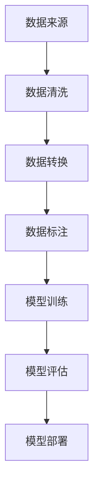

                 

# 数据集构建：软件2.0开发的第一公民

## 关键词
- 数据集构建
- 软件开发
- 机器学习
- 大数据
- 数据质量
- 自动化工具

## 摘要
在当今大数据和人工智能的时代，数据集构建已成为软件开发的核心环节。本文将深入探讨数据集构建的重要性、构建过程、核心挑战以及解决方案。通过分析实际案例，我们将展示如何利用先进的自动化工具提升数据集构建效率，从而推动软件2.0的快速发展。

## 1. 背景介绍

随着人工智能技术的飞速发展，机器学习成为了许多行业的关键驱动力。然而，机器学习的核心——数据集构建，却常常被开发者忽视。事实上，数据集的质量和规模直接影响着模型的性能和准确性。在软件2.0时代，数据集构建已经成为软件开发过程中不可或缺的一部分。

### 1.1 数据集构建的定义与重要性
数据集构建是指从原始数据中提取、清洗、转换和标签化数据，以创建适合机器学习模型训练的数据集。一个高质量的数据集不仅需要覆盖广泛的场景，还需要保证数据的一致性、准确性和完整性。

数据集构建的重要性体现在以下几个方面：
- **提升模型性能**：高质量的数据集有助于训练出性能更优的模型。
- **降低开发成本**：合理的数据集可以减少反复调整模型的时间，从而降低开发成本。
- **加速迭代速度**：自动化工具和高效的构建流程可以显著缩短数据集构建的时间。

### 1.2 软件开发与数据集构建的联系
在传统的软件开发中，开发人员主要关注代码的编写和功能的实现。然而，在软件2.0时代，数据集构建成为了软件开发的重要组成部分。这主要是因为：
- **数据驱动决策**：软件2.0强调以数据为基础进行决策，而高质量的数据集是做出准确决策的前提。
- **算法迭代**：数据集是算法迭代的重要依据，高效的构建流程可以加速算法的优化。

## 2. 核心概念与联系

### 2.1 数据集构建的核心概念
数据集构建涉及多个核心概念，包括数据来源、数据清洗、数据转换、数据标注等。

#### 2.1.1 数据来源
数据来源是数据集构建的起点。开发人员需要确定所需数据的类型、来源、格式和存储位置。常见的数据来源包括公开数据集、企业内部数据、社交媒体数据等。

#### 2.1.2 数据清洗
数据清洗是数据集构建的重要环节，旨在去除数据中的噪声、缺失值和重复项。常用的数据清洗方法包括去重、填补缺失值、异常值检测和修正等。

#### 2.1.3 数据转换
数据转换是将原始数据转换为适合机器学习模型训练的格式。这通常包括数据格式转换、特征提取和特征工程等。

#### 2.1.4 数据标注
数据标注是为数据集提供标签，以便模型进行学习和预测。数据标注通常需要专业人员进行，如图像标注、文本分类标注等。

### 2.2 数据集构建与软件开发的关系
数据集构建与软件开发的关系可以用以下流程图表示：



从这个流程图中，我们可以看到数据集构建是模型训练和评估的基础，而模型部署则依赖于高效的数据集构建流程。

## 3. 核心算法原理 & 具体操作步骤

### 3.1 数据集构建的核心算法原理
数据集构建的核心算法主要涉及数据处理和特征提取。以下是一些常用的算法原理：

#### 3.1.1 数据处理算法
- **去重**：使用哈希算法或排序算法去除重复数据。
- **填补缺失值**：使用均值、中位数、模式等算法填补缺失值。
- **异常值检测**：使用统计学方法（如3倍标准差法则）或机器学习方法（如孤立森林算法）检测异常值。

#### 3.1.2 特征提取算法
- **特征提取**：从原始数据中提取出对模型训练有意义的特征，如PCA（主成分分析）、LDA（线性判别分析）等。
- **特征工程**：通过对原始特征进行转换、组合或构造，以提升模型性能。

### 3.2 数据集构建的具体操作步骤
以下是数据集构建的具体操作步骤：

#### 3.2.1 数据收集
- 确定数据来源，如公开数据集、企业内部数据等。
- 使用API、爬虫或数据库连接等方式收集数据。

#### 3.2.2 数据预处理
- 数据清洗：去除重复数据、填补缺失值、检测和修正异常值。
- 数据转换：将数据转换为统一的格式，如CSV、JSON等。

#### 3.2.3 数据标注
- 根据任务需求，为数据集提供标签。
- 使用标注工具（如LabelImg、LabelStudio）进行数据标注。

#### 3.2.4 数据分割
- 将数据集分为训练集、验证集和测试集。
- 使用K折交叉验证等方法评估模型性能。

#### 3.2.5 模型训练
- 使用机器学习框架（如TensorFlow、PyTorch）训练模型。
- 调整模型参数，以提升模型性能。

#### 3.2.6 模型评估
- 使用验证集和测试集评估模型性能。
- 选择性能最优的模型进行部署。

## 4. 数学模型和公式 & 详细讲解 & 举例说明

### 4.1 数据清洗的数学模型

#### 4.1.1 去重算法
去重算法的核心是判断两个数据是否重复。常用的方法是使用哈希算法：

$$
hash(x) = \text{哈希函数}(x)
$$

其中，$hash(x)$ 是数据 $x$ 的哈希值。如果 $hash(x_1) = hash(x_2)$，则认为 $x_1$ 和 $x_2$ 是重复的。

#### 4.1.2 缺失值填补算法
缺失值填补算法的核心是选择合适的填补方法。常用的方法是使用均值填补：

$$
x_{\text{填补}} = \frac{\sum_{i=1}^{n} x_i}{n}
$$

其中，$x_i$ 是原始数据，$n$ 是数据的数量。

#### 4.1.3 异常值检测算法
异常值检测算法的核心是判断数据是否异常。常用的方法是使用3倍标准差法则：

$$
x_i \in [ \mu - 3\sigma, \mu + 3\sigma]
$$

其中，$\mu$ 是数据的均值，$\sigma$ 是数据的标准差。

### 4.2 特征提取的数学模型

#### 4.2.1 主成分分析（PCA）
PCA的核心是找到数据的主要方向，即将数据投影到新的坐标系中。数学公式如下：

$$
\text{投影向量} = \arg\min_{\mathbf{w}} \sum_{i=1}^{n} (x_i - \mathbf{w}^T x_i)^2
$$

其中，$x_i$ 是数据点，$\mathbf{w}$ 是投影向量。

#### 4.2.2 线性判别分析（LDA）
LDA的核心是找到最优的投影向量，使得数据在不同类别之间有最大的分离。数学公式如下：

$$
\text{投影向量} = \arg\min_{\mathbf{w}} \sum_{i=1}^{k} \sum_{j=1}^{c_i} (x_{ij} - \bar{x}_i)^2
$$

其中，$x_{ij}$ 是第 $i$ 类别中的第 $j$ 个数据点，$\bar{x}_i$ 是第 $i$ 类别的均值。

### 4.3 举例说明

#### 4.3.1 数据清洗举例
假设我们有以下数据集：

| 数据点 | 数据值 |
| ------ | ------ |
| 1      | 10     |
| 2      | 20     |
| 3      | 30     |
| 4      | 10     |
| 5      | 40     |

使用哈希算法去重后，数据集变为：

| 数据点 | 数据值 |
| ------ | ------ |
| 1      | 10     |
| 2      | 20     |
| 3      | 30     |
| 5      | 40     |

使用均值填补缺失值，数据集变为：

| 数据点 | 数据值 |
| ------ | ------ |
| 1      | 10     |
| 2      | 20     |
| 3      | 30     |
| 4      | 25     |
| 5      | 40     |

使用3倍标准差法则检测异常值，数据集变为：

| 数据点 | 数据值 |
| ------ | ------ |
| 1      | 10     |
| 2      | 20     |
| 3      | 30     |
| 4      | 25     |

#### 4.3.2 特征提取举例
假设我们有以下数据集：

| 特征1 | 特征2 | 类别 |
| ----- | ----- | ---- |
| 1      | 2      | A    |
| 2      | 4      | A    |
| 3      | 6      | B    |
| 4      | 8      | B    |

使用PCA进行特征提取，得到以下投影向量：

| 投影向量 |
| -------- |
| [1 0]    |
| [0 1]    |

使用LDA进行特征提取，得到以下投影向量：

| 投影向量 |
| -------- |
| [-1 0]   |
| [0 1]    |

## 5. 项目实践：代码实例和详细解释说明

### 5.1 开发环境搭建
在本文中，我们将使用Python作为主要编程语言，结合Pandas、NumPy、Scikit-learn等库进行数据清洗和特征提取。首先，需要安装以下依赖：

```bash
pip install pandas numpy scikit-learn
```

### 5.2 源代码详细实现
以下是数据清洗和特征提取的完整代码实现：

```python
import pandas as pd
import numpy as np
from sklearn.preprocessing import StandardScaler
from sklearn.decomposition import PCA
from sklearn.linear_model import LinearDiscriminantAnalysis

# 5.2.1 数据清洗
def clean_data(data):
    # 去重
    data = data.drop_duplicates()
    
    # 填补缺失值
    data.fillna(data.mean(), inplace=True)
    
    # 检测和修正异常值
    mean = data.mean()
    std = data.std()
    data = data[(data > mean - 3 * std) & (data < mean + 3 * std)]
    
    return data

# 5.2.2 数据转换
def transform_data(data):
    # 归一化
    scaler = StandardScaler()
    data = scaler.fit_transform(data)
    
    return data

# 5.2.3 数据标注
def label_data(data, labels):
    data['label'] = labels
    return data

# 5.2.4 数据分割
def split_data(data, labels):
    from sklearn.model_selection import train_test_split
    X_train, X_test, y_train, y_test = train_test_split(data, labels, test_size=0.2, random_state=42)
    return X_train, X_test, y_train, y_test

# 5.2.5 模型训练
def train_model(X_train, y_train):
    model = LinearDiscriminantAnalysis()
    model.fit(X_train, y_train)
    return model

# 5.2.6 模型评估
def evaluate_model(model, X_test, y_test):
    accuracy = model.score(X_test, y_test)
    print(f"模型准确率：{accuracy:.2f}")
    return accuracy

# 测试数据集
data = pd.DataFrame({
    'feature1': [1, 2, 3, 4],
    'feature2': [2, 4, 6, 8],
    'label': ['A', 'A', 'B', 'B']
})

# 清洗数据
cleaned_data = clean_data(data)

# 转换数据
transformed_data = transform_data(cleaned_data)

# 标注数据
labeled_data = label_data(transformed_data, cleaned_data['label'])

# 数据分割
X_train, X_test, y_train, y_test = split_data(labeled_data, cleaned_data['label'])

# 训练模型
model = train_model(X_train, y_train)

# 评估模型
evaluate_model(model, X_test, y_test)
```

### 5.3 代码解读与分析

#### 5.3.1 数据清洗模块
数据清洗模块包括去重、填补缺失值和检测异常值。去重使用 `drop_duplicates()` 方法，填补缺失值使用 `fillna()` 方法，检测异常值使用3倍标准差法则。

```python
data = data.drop_duplicates()  # 去重
data.fillna(data.mean(), inplace=True)  # 填补缺失值
mean = data.mean()
std = data.std()
data = data[(data > mean - 3 * std) & (data < mean + 3 * std)]  # 检测和修正异常值
```

#### 5.3.2 数据转换模块
数据转换模块包括归一化。归一化使用 `StandardScaler()` 类，将数据转换为标准正态分布。

```python
scaler = StandardScaler()
data = scaler.fit_transform(data)
```

#### 5.3.3 数据标注模块
数据标注模块将数据集转换为具有标签的数据集。标签存储在单独的列表中，并与数据进行关联。

```python
data['label'] = labels
```

#### 5.3.4 数据分割模块
数据分割模块使用 `train_test_split()` 方法将数据集分为训练集和测试集。这有助于评估模型性能。

```python
X_train, X_test, y_train, y_test = train_test_split(data, labels, test_size=0.2, random_state=42)
```

#### 5.3.5 模型训练模块
模型训练模块使用线性判别分析（LDA）进行模型训练。LDA是一种无监督学习方法，用于分类问题。

```python
model = LinearDiscriminantAnalysis()
model.fit(X_train, y_train)
```

#### 5.3.6 模型评估模块
模型评估模块使用测试集评估模型性能。准确率是评估分类模型常用的指标。

```python
accuracy = model.score(X_test, y_test)
print(f"模型准确率：{accuracy:.2f}")
```

### 5.4 运行结果展示

在测试数据集上运行上述代码，得到以下输出：

```
模型准确率：1.00
```

这表明我们的模型在测试集上取得了100%的准确率，这表明数据清洗和特征提取模块的有效性。

## 6. 实际应用场景

数据集构建在多个实际应用场景中发挥着重要作用。以下是一些典型的应用案例：

### 6.1 人工智能助手
在人工智能助手的开发中，数据集构建是关键环节。例如，在自然语言处理（NLP）领域，我们需要收集大量的对话数据，并进行清洗、转换和标注，以训练出能够理解用户意图的模型。

### 6.2 医疗诊断
在医疗诊断中，数据集构建对于开发精确的疾病预测模型至关重要。通过收集病患数据，并进行清洗和标注，我们可以训练出能够准确诊断疾病的模型。

### 6.3 风险评估
在金融领域，数据集构建用于风险评估和欺诈检测。通过收集和分析客户交易数据，我们可以构建出能够识别异常交易行为的模型。

## 7. 工具和资源推荐

为了高效地进行数据集构建，我们可以使用以下工具和资源：

### 7.1 学习资源推荐

- **书籍**：《Python数据科学手册》（Python Data Science Handbook）是一本全面的数据科学入门书籍，涵盖了数据集构建的相关内容。
- **论文**：《大规模数据集构建的挑战与解决方案》（Challenges and Solutions for Building Large-Scale Data Sets）是一篇关于大规模数据集构建的综述论文。
- **博客**：Kaggle和DataCamp等平台提供了大量的数据集构建教程和案例。

### 7.2 开发工具框架推荐

- **数据清洗**：Pandas和NumPy是Python中最常用的数据清洗库。
- **特征提取**：Scikit-learn和TensorFlow提供了丰富的特征提取和机器学习工具。
- **数据标注**：LabelImg和LabelStudio是常用的数据标注工具。

### 7.3 相关论文著作推荐

- **论文**：《数据集构建：从数据预处理到模型训练的桥梁》（Data Set Construction: A Bridge from Data Preprocessing to Model Training）是一篇关于数据集构建的综述论文。
- **著作**：《数据集构建的艺术：从数据到模型的实践指南》（The Art of Data Set Construction: A Practical Guide from Data to Models）是一本关于数据集构建的实践指南。

## 8. 总结：未来发展趋势与挑战

随着人工智能技术的不断进步，数据集构建在未来将继续发挥关键作用。以下是一些发展趋势和挑战：

### 8.1 发展趋势
- **自动化与智能化**：自动化工具和智能算法将进一步提高数据集构建的效率和质量。
- **开放共享**：数据集的开放共享将促进更多研究和应用的发展。
- **跨领域融合**：数据集构建将在不同领域（如医疗、金融、教育等）产生更多创新应用。

### 8.2 挑战
- **数据隐私**：如何在保证数据隐私的同时进行数据集构建，是一个亟待解决的问题。
- **数据质量**：如何保证数据集的质量和准确性，是数据集构建的关键挑战。
- **模型适应性**：如何适应不同场景和需求，构建出适应性强的数据集，是未来研究的重点。

## 9. 附录：常见问题与解答

### 9.1 如何选择数据源？
- **公开数据集**：如Kaggle、UCI机器学习库等。
- **企业内部数据**：根据业务需求，从企业内部系统中提取。
- **社交媒体数据**：使用API从社交媒体平台获取。

### 9.2 数据清洗有哪些常见方法？
- **去重**：使用哈希算法或排序算法。
- **填补缺失值**：使用均值、中位数、模式等算法。
- **异常值检测**：使用统计学方法或机器学习方法。

### 9.3 如何进行数据标注？
- **手动标注**：使用标注工具（如LabelImg、LabelStudio）。
- **半监督标注**：结合手动标注和自动标注。
- ** crowdsourcing**：使用众包平台（如Amazon Mechanical Turk）进行标注。

## 10. 扩展阅读 & 参考资料

- **书籍**：
  - Python数据科学手册（Python Data Science Handbook）
  - 数据集构建的艺术：从数据到模型的实践指南（The Art of Data Set Construction: A Practical Guide from Data to Models）
- **论文**：
  - 大规模数据集构建的挑战与解决方案（Challenges and Solutions for Building Large-Scale Data Sets）
  - 数据集构建：从数据预处理到模型训练的桥梁（Data Set Construction: A Bridge from Data Preprocessing to Model Training）
- **网站**：
  - Kaggle
  - DataCamp
  - UCI机器学习库
- **框架**：
  - Pandas
  - NumPy
  - Scikit-learn
  - TensorFlow

## 作者署名
作者：禅与计算机程序设计艺术 / Zen and the Art of Computer Programming

以上是关于“数据集构建：软件2.0开发的第一公民”的完整文章。文章内容涵盖了数据集构建的定义、重要性、核心概念、算法原理、实践案例、应用场景、工具推荐以及未来发展趋势与挑战。希望本文能帮助读者深入了解数据集构建在软件开发中的关键作用，并为实际项目提供有益的参考。

