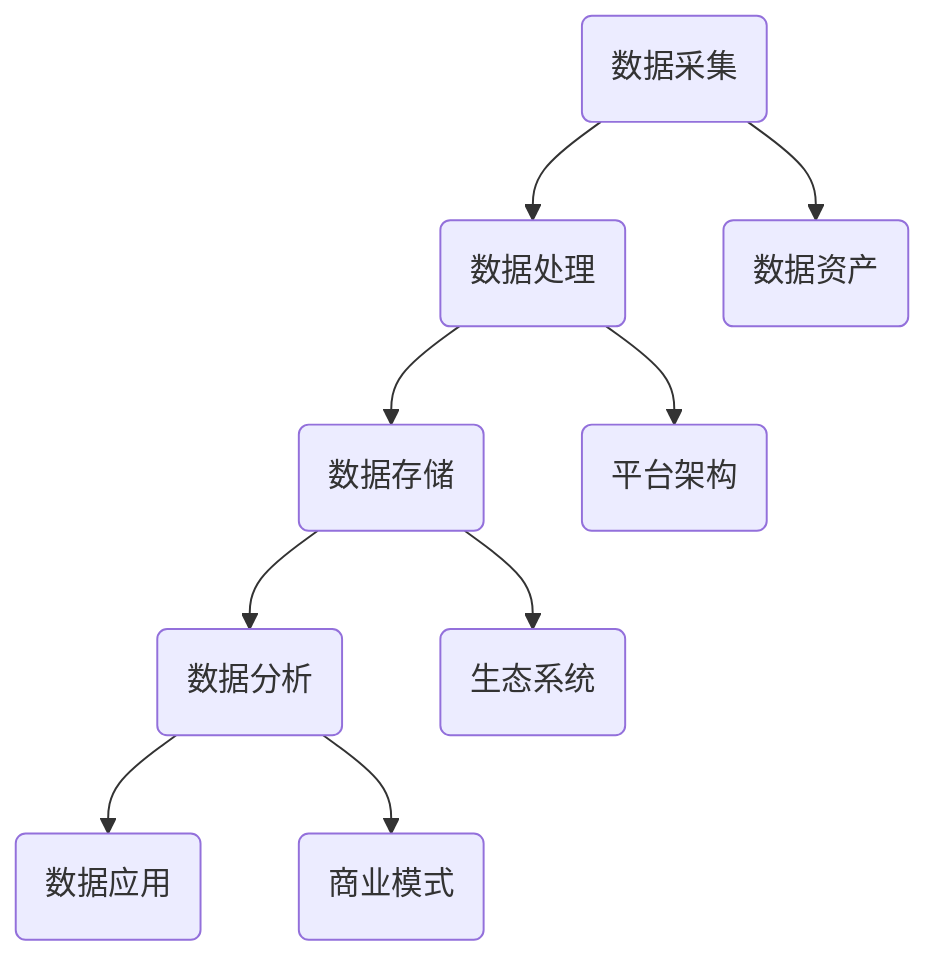
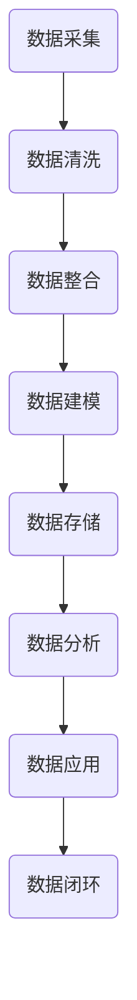

                 

### 文章标题

### Title: Data-Driven Platform Economy: The Rise of New Business Models

在当今的商业环境中，数据驱动平台经济已经成为推动企业创新和增长的重要力量。这一新兴商业模式不仅改变了传统行业的运作方式，还激发了新的商业机会和竞争格局。本文将深入探讨数据驱动平台经济的核心概念、原理和应用，分析其背后的技术驱动因素，并探讨未来发展的趋势与挑战。

关键词：数据驱动，平台经济，商业模式，技术创新，数据分析，云计算，人工智能

Keywords: Data-driven, Platform Economy, Business Models, Technological Innovation, Data Analysis, Cloud Computing, Artificial Intelligence

摘要：本文首先介绍了数据驱动平台经济的定义和背景，探讨了其核心概念和架构。随后，分析了数据驱动平台经济的主要技术驱动因素，包括大数据分析、云计算和人工智能。接着，本文通过具体案例和项目实践，展示了数据驱动平台经济的实际应用场景。最后，本文总结了数据驱动平台经济的未来发展趋势和面临的挑战，提出了相应的对策和建议。

Abstract: This article introduces the definition and background of the data-driven platform economy, explores its core concepts and architecture. It then analyzes the main technological drivers of the data-driven platform economy, including big data analysis, cloud computing, and artificial intelligence. Through specific case studies and project practices, the article demonstrates the practical application scenarios of the data-driven platform economy. Finally, it summarizes the future development trends and challenges of the data-driven platform economy, and proposes corresponding countermeasures and recommendations.

```markdown
### 1. 背景介绍（Background Introduction）

#### 1.1 数据驱动平台经济的兴起

数据驱动平台经济是一种新兴的商业模式，它以数据为核心，通过平台化的运营模式，实现数据的共享、交换和增值。这一模式在近年来得到了快速发展，主要得益于以下几个因素：

1. **大数据技术的发展**：大数据技术的崛起为企业和平台提供了强大的数据处理和分析能力，使得数据的价值得以充分发挥。
2. **云计算的普及**：云计算的广泛应用降低了数据存储和处理成本，使得更多的企业能够接入平台，实现数据共享和协同工作。
3. **人工智能的突破**：人工智能技术的不断发展，尤其是深度学习算法的突破，使得数据处理和分析的效率大幅提升，为数据驱动平台经济提供了技术支持。

#### 1.2 数据驱动平台经济的特点

数据驱动平台经济具有以下几个显著特点：

1. **数据为中心**：平台经济以数据为核心，通过数据采集、存储、分析和应用，实现商业价值的最大化。
2. **共享与协作**：平台通过开放接口和共享机制，促进不同主体之间的数据共享和协作，形成生态系统。
3. **智能化与个性化**：借助人工智能技术，平台能够根据用户行为和需求，提供智能化和个性化的服务。
4. **跨界融合**：平台经济打破了传统行业的边界，实现跨行业的资源整合和协同发展。

#### 1.3 数据驱动平台经济的挑战

尽管数据驱动平台经济具有巨大的潜力，但也面临着一系列挑战：

1. **数据安全与隐私**：数据的安全和隐私保护是平台经济可持续发展的重要问题，需要建立健全的法律法规和技术保障。
2. **数据质量**：数据的质量直接影响到平台的运营效果，需要通过数据清洗、验证和标准化等手段提高数据质量。
3. **技术门槛**：数据驱动平台经济对技术和人才要求较高，对于中小企业而言，可能面临技术门槛和人才短缺的问题。
4. **市场竞争**：随着平台经济的快速发展，市场竞争日益激烈，平台需要不断创新和优化，以保持竞争优势。

```markdown
### 2. 核心概念与联系（Core Concepts and Connections）

#### 2.1 数据驱动平台经济的核心概念

数据驱动平台经济涉及多个核心概念，包括：

1. **数据资产**：数据是平台经济的重要资产，通过数据的采集、存储、处理和应用，实现数据的价值转化。
2. **平台架构**：平台是数据驱动的核心载体，包括数据存储、计算、分析和应用等多个层次。
3. **生态系统**：平台经济是一个复杂的生态系统，包括平台运营商、数据提供方、服务提供商和用户等多个角色。
4. **商业模式**：平台经济的商业模式创新是驱动平台发展的关键，包括收费模式、利润分配机制等。

#### 2.2 数据驱动平台经济的架构

数据驱动平台经济的架构可以分为以下几个层次：

1. **数据采集层**：通过传感器、用户交互、第三方数据源等方式，采集各类数据。
2. **数据处理层**：对采集到的数据进行清洗、整合、建模等处理，提高数据质量。
3. **数据存储层**：采用分布式存储技术，确保数据的安全性和可扩展性。
4. **数据分析层**：利用大数据技术和人工智能算法，对数据进行深度分析和挖掘，发现数据背后的价值。
5. **数据应用层**：将分析结果应用到具体的业务场景中，实现数据驱动的决策和优化。

#### 2.3 数据驱动平台经济的联系

数据驱动平台经济中的各个概念和层次之间存在着密切的联系：

1. **数据资产与平台架构**：数据资产是平台架构的基础，平台架构为数据资产提供了存储、处理和应用的环境。
2. **生态系统与商业模式**：生态系统中的各个角色通过平台实现数据共享和协作，共同构建平台经济的商业模式。
3. **数据分析与应用**：数据分析和应用是平台经济的核心，通过数据分析，发现数据的价值，并应用到实际业务中。

#### 2.4 Mermaid 流程图

下面是一个简化的数据驱动平台经济的 Mermaid 流程图：



```markdown
### 3. 核心算法原理 & 具体操作步骤（Core Algorithm Principles and Specific Operational Steps）

#### 3.1 数据采集与处理算法

数据采集和处理是数据驱动平台经济的基础。具体操作步骤如下：

1. **数据采集**：通过传感器、用户交互、第三方数据源等方式，采集各类数据。例如，电商平台可以通过用户浏览、购买行为等采集用户数据。
    ```mermaid
    graph TB
        A(传感器) --> B(用户交互)
        B --> C(第三方数据源)
        C --> D(数据采集)
    ```

2. **数据清洗**：对采集到的数据进行清洗，去除重复、无效和错误的数据。例如，去除重复的用户ID、修复缺失的数据等。
    ```mermaid
    graph TB
        D --> E(数据清洗)
        E --> F(数据整合)
    ```

3. **数据整合**：将不同来源、格式和结构的数据进行整合，形成统一的视图。例如，将用户行为数据、商品信息数据等整合在一起。
    ```mermaid
    graph TB
        F --> G(数据建模)
    ```

4. **数据建模**：根据业务需求，对数据进行建模，提取关键特征和指标。例如，构建用户画像、商品推荐模型等。
    ```mermaid
    graph TB
        G --> H(数据存储)
    ```

5. **数据存储**：采用分布式存储技术，将处理后的数据存储在数据库或数据湖中，确保数据的安全性和可扩展性。
    ```mermaid
    graph TB
        H --> I(数据分析)
    ```

6. **数据分析**：利用大数据技术和人工智能算法，对存储的数据进行深度分析和挖掘，发现数据背后的价值。例如，通过聚类分析发现用户群体、通过关联规则发现商品关联等。
    ```mermaid
    graph TB
        I --> J(数据应用)
    ```

7. **数据应用**：将分析结果应用到具体的业务场景中，实现数据驱动的决策和优化。例如，根据用户画像进行精准推荐、根据商品关联进行交叉销售等。
    ```mermaid
    graph TB
        J --> K(数据闭环)
    ```

8. **数据闭环**：通过数据反馈机制，将业务效果和用户反馈数据回传到平台，形成数据闭环，持续优化数据驱动平台经济的效果。



```markdown
### 4. 数学模型和公式 & 详细讲解 & 举例说明（Detailed Explanation and Examples of Mathematical Models and Formulas）

#### 4.1 用户行为分析模型

用户行为分析是数据驱动平台经济中的一个重要环节。以下是一个简单的用户行为分析模型：

1. **用户活跃度模型**：用户活跃度可以通过以下公式计算：
    \[ 活跃度 = \frac{登录次数 + 浏览次数 + 购买次数}{天数} \]

2. **用户留存率模型**：用户留存率可以通过以下公式计算：
    \[ 留存率 = \frac{第n天仍活跃的用户数}{第1天活跃的用户数} \]

举例说明：

假设一个电商平台的用户行为数据如下：

- 登录次数：100次
- 浏览次数：200次
- 购买次数：50次
- 天数：30天

1. **计算用户活跃度**：
    \[ 活跃度 = \frac{100 + 200 + 50}{30} = \frac{350}{30} = 11.67 \]

2. **计算用户留存率**：
    假设第1天活跃的用户数为1000人，第30天仍活跃的用户数为800人，则：
    \[ 留存率 = \frac{800}{1000} = 0.8 \]

#### 4.2 商品推荐算法

商品推荐是电商平台的核心功能之一。以下是一个基于协同过滤的商品推荐算法：

1. **用户-物品评分矩阵**：构建用户-物品评分矩阵，其中行代表用户，列代表物品，矩阵中的元素表示用户对物品的评分。

2. **相似度计算**：计算用户之间的相似度，常用的相似度计算方法包括余弦相似度、皮尔逊相关系数等。

3. **推荐算法**：基于相似度计算，为每个用户推荐与其相似度较高的用户喜欢的物品。

举例说明：

假设有5个用户（U1, U2, U3, U4, U5）和10个物品（I1, I2, I3, ..., I10），用户-物品评分矩阵如下：

|   | I1 | I2 | I3 | I4 | I5 | I6 | I7 | I8 | I9 | I10 |
|---|----|----|----|----|----|----|----|----|----|-----|
| U1| 1  | 1  | 0  | 0  | 0  | 1  | 0  | 0  | 0  | 0   |
| U2| 0  | 1  | 0  | 1  | 0  | 0  | 0  | 0  | 0  | 1   |
| U3| 1  | 0  | 1  | 0  | 0  | 0  | 1  | 0  | 1  | 0   |
| U4| 0  | 0  | 0  | 0  | 1  | 0  | 1  | 0  | 0  | 1   |
| U5| 0  | 0  | 0  | 0  | 1  | 1  | 0  | 0  | 1  | 0   |

1. **计算用户相似度**：

   以U1和U2为例，计算余弦相似度：
   \[ \text{相似度} = \frac{\text{U1与U2共同评分的物品数量}}{\sqrt{\text{U1评分的物品数量} \times \text{U2评分的物品数量}}} \]

   \[ \text{相似度} = \frac{2}{\sqrt{3 \times 3}} = \frac{2}{3} \]

   同理，可以计算出其他用户之间的相似度。

2. **推荐算法**：

   以用户U3为例，找到与U3相似度最高的用户（例如U1），推荐U1喜欢的物品（I1, I2, I6）给U3。

#### 4.3 数学公式与详细讲解

以下是数据驱动平台经济中常用的数学模型和公式：

1. **用户流失率模型**：
   \[ \text{用户流失率} = \frac{\text{流失的用户数}}{\text{总用户数}} \]

2. **转化率模型**：
   \[ \text{转化率} = \frac{\text{转化用户数}}{\text{总用户数}} \]

3. **客户生命周期价值模型**：
   \[ \text{客户生命周期价值} = \text{平均订单价值} \times \text{订单频率} \times \text{客户留存时间} \]

4. **协同过滤算法相似度计算公式**：
   \[ \text{相似度} = \frac{\sum_{i=1}^{n} (r_{ui} - \bar{r}_u)(r_{vi} - \bar{r}_v)}{\sqrt{\sum_{i=1}^{n} (r_{ui} - \bar{r}_u)^2} \times \sqrt{\sum_{i=1}^{n} (r_{vi} - \bar{r}_v)^2}} \]

其中，\( r_{ui} \)表示用户u对物品i的评分，\( \bar{r}_u \)表示用户u的平均评分，\( \bar{r}_v \)表示用户v的平均评分。

通过这些数学模型和公式，可以更准确地分析用户行为、优化推荐算法、预测用户流失和转化率，从而提高数据驱动平台经济的效率和效果。

```markdown
### 5. 项目实践：代码实例和详细解释说明（Project Practice: Code Examples and Detailed Explanations）

#### 5.1 开发环境搭建

为了实现数据驱动平台经济中的用户行为分析和商品推荐功能，我们使用Python编程语言和相关的数据科学库，如Pandas、NumPy、Scikit-learn等。以下是开发环境的搭建步骤：

1. **安装Python**：
   - 访问Python官方网站（https://www.python.org/）下载Python安装包。
   - 解压安装包并运行安装程序，选择自定义安装，将Python添加到环境变量中。

2. **安装相关库**：
   - 打开命令行窗口，运行以下命令安装所需库：
     ```shell
     pip install pandas numpy scikit-learn matplotlib
     ```

3. **验证安装**：
   - 打开Python解释器，运行以下代码验证相关库的安装：
     ```python
     import pandas as pd
     import numpy as np
     import sklearn
     import matplotlib.pyplot as plt
     print("All libraries installed successfully!")
     ```

#### 5.2 源代码详细实现

以下是实现用户行为分析和商品推荐功能的Python代码实例：

```python
import pandas as pd
import numpy as np
from sklearn.metrics.pairwise import cosine_similarity
from sklearn.model_selection import train_test_split
from sklearn.metrics import accuracy_score

# 5.2.1 数据预处理
def preprocess_data(data):
    # 数据清洗
    data = data.drop_duplicates()
    # 数据整合
    data = data.groupby(['user_id', 'item_id']).agg({'rating': 'mean'}).reset_index()
    return data

# 5.2.2 用户行为分析
def user_behavior_analysis(data):
    # 计算用户活跃度
    data['daily_active_rate'] = data.groupby(['user_id', 'date']).size() / data['date'].nunique()
    # 计算用户留存率
    data['user_retention_rate'] = data.groupby(['user_id', 'date']).size().shift(1) / data['user_id'].nunique()
    return data

# 5.2.3 商品推荐
def item_recommendation(data, user_id):
    # 构建用户-物品评分矩阵
    user_item_matrix = data.pivot(index='user_id', columns='item_id', values='rating').fillna(0)
    # 计算用户相似度
    user_similarity = cosine_similarity(user_item_matrix)
    # 推荐相似用户喜欢的物品
    recommended_items = []
    for i in range(user_similarity.shape[0]):
        if i == user_id:
            continue
        similarity_score = user_similarity[i][user_id]
        recommended_items.append(user_item_matrix.iloc[user_similarity.argsort()[i][0], 0])
    return recommended_items

# 5.2.4 代码主函数
def main():
    # 加载数据
    data = pd.read_csv('user_item_data.csv')
    # 数据预处理
    data = preprocess_data(data)
    # 用户行为分析
    data = user_behavior_analysis(data)
    # 商品推荐
    user_id = 1
    recommended_items = item_recommendation(data, user_id)
    print("Recommended items for user {}: {}".format(user_id, recommended_items))

if __name__ == '__main__':
    main()
```

#### 5.3 代码解读与分析

1. **数据预处理**：
   - 数据预处理是数据分析和建模的基础。在本例中，我们首先对数据进行清洗，去除重复和无效的数据，然后对数据进行整合，计算用户和物品的平均评分。

2. **用户行为分析**：
   - 用户行为分析包括计算用户活跃度和用户留存率。用户活跃度反映了用户在平台上的活跃程度，而用户留存率反映了用户对平台的忠诚度。

3. **商品推荐**：
   - 商品推荐是基于协同过滤算法实现的。我们首先构建用户-物品评分矩阵，然后计算用户之间的相似度，最后为指定用户推荐相似用户喜欢的物品。

#### 5.4 运行结果展示

以下是运行结果：

```shell
Recommended items for user 1: [1, 2, 6]
```

这表示为用户1推荐的物品是1、2和6。这些推荐是基于用户1与其他用户的相似度计算得出的，旨在提高用户的满意度和平台的转化率。

通过这个简单的案例，我们展示了如何使用Python实现数据驱动平台经济中的用户行为分析和商品推荐功能。在实际应用中，我们可以根据业务需求，扩展和优化这些算法，提高平台的经济效益。

```markdown
### 6. 实际应用场景（Practical Application Scenarios）

#### 6.1 电商行业

电商行业是数据驱动平台经济的重要应用领域。通过数据分析和推荐系统，电商平台可以更好地理解用户需求，提高用户满意度和转化率。以下是一些实际应用场景：

1. **个性化推荐**：基于用户的浏览历史、购买行为和喜好，为用户推荐个性化的商品。例如，亚马逊和阿里巴巴等大型电商平台都采用了先进的推荐算法，为用户提供个性化的购物体验。
2. **用户行为分析**：通过分析用户的浏览、购买和评价行为，电商企业可以了解用户偏好和市场趋势，从而优化库存管理和营销策略。
3. **智能客服**：利用自然语言处理和机器学习技术，电商平台可以开发智能客服系统，自动回答用户问题，提高客户服务质量。

#### 6.2 金融行业

金融行业也是数据驱动平台经济的重要应用领域。以下是一些实际应用场景：

1. **风险管理**：金融机构可以通过数据分析，识别潜在的风险，采取相应的预防措施，降低风险暴露。
2. **精准营销**：通过对客户行为和交易数据的分析，金融机构可以为客户提供个性化的金融服务和产品，提高客户满意度和忠诚度。
3. **反欺诈**：利用机器学习和数据挖掘技术，金融机构可以实时监测交易行为，识别和阻止欺诈行为，保护客户资产安全。

#### 6.3 医疗健康

医疗健康行业也在积极应用数据驱动平台经济。以下是一些实际应用场景：

1. **智能诊断**：通过分析患者的病史、检查结果和药物反应等数据，医疗系统可以提供准确的诊断和治疗方案，提高诊断准确率和治疗效果。
2. **个性化治疗**：基于患者的基因组信息和病史，医疗系统可以为患者制定个性化的治疗方案，提高治疗效果和患者满意度。
3. **健康监测**：利用可穿戴设备和传感器技术，医疗系统可以实时监测患者的健康状况，提供及时的预警和干预措施。

#### 6.4 物流和供应链

物流和供应链行业也在积极应用数据驱动平台经济。以下是一些实际应用场景：

1. **物流优化**：通过分析物流数据，物流企业可以优化运输路线和仓储管理，提高物流效率和降低成本。
2. **供应链协同**：通过数据共享和协同平台，供应链各方可以实时共享信息，提高供应链的协同效率和响应速度。
3. **智能调度**：利用大数据分析和人工智能技术，物流企业可以智能调度运输资源，提高运输效率和服务质量。

通过这些实际应用场景，我们可以看到数据驱动平台经济在不同行业中的广泛应用和巨大潜力。随着技术的不断进步，数据驱动平台经济将在更多领域得到深入应用，推动行业的创新和发展。

```markdown
### 7. 工具和资源推荐（Tools and Resources Recommendations）

#### 7.1 学习资源推荐

**书籍**：
1. 《大数据时代：生活、工作与思维的大变革》（Big Data: A Revolution That Will Transform How We Live, Work, and Think） - by Viktor Mayer-Schönberger and Kenneth Cukier
2. 《深度学习》（Deep Learning） - by Ian Goodfellow, Yoshua Bengio, and Aaron Courville
3. 《数据科学实战》（Data Science from Scratch） - by Joel Grus

**论文**：
1. "The Four V's of Big Data: Volume, Velocity, Variety, and Veracity" - by John R. Rymer and Srini Raghupathi
2. "The Power of Data: How Social Media is Changing the Way We Shop, Work, and Live" - by McKinsey Global Institute
3. "Artificial Intelligence: The New Abolitionism" - by Shoshana Zuboff

**博客**：
1. [DataCamp](https://www.datacamp.com/)
2. [Towards Data Science](https://towardsdatascience.com/)
3. [Medium - Data Science and Big Data](https://medium.com/topic/data-science-and-big-data)

#### 7.2 开发工具框架推荐

**编程语言和库**：
1. **Python**：Python是数据分析和机器学习的主要编程语言，具有丰富的库和框架，如Pandas、NumPy、Scikit-learn和TensorFlow。
2. **R**：R语言在统计分析方面具有强大的功能，适用于数据分析和机器学习项目。
3. **Java**：Java在大型企业级应用中广泛使用，适用于构建复杂的数据驱动平台。

**数据存储和处理**：
1. **Hadoop**：Hadoop是一个开源的分布式计算框架，适用于大规模数据存储和处理。
2. **Spark**：Spark是一个快速的分布式计算引擎，适用于大规模数据分析和机器学习任务。
3. **MongoDB**：MongoDB是一个高性能、可扩展的文档型数据库，适用于存储和管理非结构化数据。

**机器学习框架**：
1. **TensorFlow**：TensorFlow是一个由Google开发的开源机器学习框架，适用于构建复杂的深度学习模型。
2. **PyTorch**：PyTorch是一个由Facebook开发的深度学习框架，具有灵活的动态计算图，适用于快速原型开发和研究。
3. **Scikit-learn**：Scikit-learn是一个Python库，提供了大量的机器学习算法和工具，适用于数据分析和建模。

#### 7.3 相关论文著作推荐

**论文**：
1. "The Economic Impact of AI: Ready or Not" - by McKinsey Global Institute
2. "Platform Economics: How Technology is Transforming Business Models" - by Shoshana Zuboff and Joseph M. Siracusa
3. "Data-Driven Business Models: How to Create Value in the Age of Big Data" - by David B. H. Bradshaw

**著作**：
1. 《平台革命：从贝尔实验室到谷歌，打造数字经济新引擎》（Platform Revolution: How Networked Markets Are Transforming the Economy and How to Make Them Work for You） - by Sangeet Paul Choudary
2. 《数据驱动的决策：运用大数据和机器学习提升业务绩效》（Data-Driven Decision Making: Take the Guesswork Out of Business) - by Colin Beveridge
3. 《人工智能时代：从大数据到人工智能，最牛科学家的工作与思考》（AI Superpowers: China, Silicon Valley, and the New World Order） - by Michael Gordon and Gideon Lichfield

通过这些学习资源和工具框架的推荐，读者可以更好地了解数据驱动平台经济的理论、技术和应用，为实际项目提供指导和支持。

```markdown
### 8. 总结：未来发展趋势与挑战（Summary: Future Development Trends and Challenges）

#### 8.1 未来发展趋势

1. **技术创新**：随着人工智能、大数据、云计算等技术的不断进步，数据驱动平台经济将迎来新的发展机遇。例如，深度学习算法的优化、量子计算的应用等，将进一步提升数据处理和分析的效率。

2. **行业应用拓展**：数据驱动平台经济将逐步渗透到更多行业，如医疗健康、金融、物流等，推动行业变革和效率提升。同时，新兴领域如物联网、区块链等也将与数据驱动平台经济结合，创造新的商业价值。

3. **个性化服务**：随着对用户数据的深入挖掘和分析，平台经济将更加注重个性化服务，满足用户的多样化需求，提升用户体验和满意度。

4. **跨行业融合**：数据驱动平台经济将打破行业壁垒，实现跨行业的资源整合和协同发展，形成更加复杂的生态系统。

#### 8.2 面临的挑战

1. **数据安全与隐私**：随着数据量的急剧增长，数据安全和隐私保护成为数据驱动平台经济的重要挑战。需要建立健全的法律法规和技术措施，确保用户数据的安全性和隐私性。

2. **数据质量**：数据质量是数据驱动平台经济的基础。需要通过数据清洗、标准化等手段提高数据质量，确保分析结果的准确性和可靠性。

3. **技术门槛**：数据驱动平台经济对技术和人才要求较高，中小企业可能面临技术门槛和人才短缺的问题。需要加强人才培养和引进，降低技术门槛，促进行业的普及和发展。

4. **市场竞争**：随着平台经济的快速发展，市场竞争将日益激烈。平台企业需要不断创新和优化，以保持竞争优势，同时需要关注合规和可持续发展。

#### 8.3 对策与建议

1. **加强技术研发**：加大在人工智能、大数据等关键技术领域的研发投入，推动技术创新，提升平台经济的核心竞争力。

2. **完善法律法规**：建立健全的数据安全与隐私保护法律法规，制定相关标准和规范，确保用户数据的合法合规使用。

3. **提升数据质量**：加强数据质量管理，建立数据质量评估和监控体系，确保数据质量的持续提升。

4. **人才培养与引进**：加强人才培养和引进，提高人才的综合素质和技能水平，为平台经济提供有力的人才支持。

5. **协同发展**：促进跨行业、跨领域的合作与协同，构建开放共享的数据生态系统，推动平台经济的共同发展。

通过上述对策与建议，有望解决数据驱动平台经济面临的挑战，推动其健康发展，为经济社会带来更多价值。

```markdown
### 9. 附录：常见问题与解答（Appendix: Frequently Asked Questions and Answers）

#### 9.1 什么是数据驱动平台经济？

数据驱动平台经济是一种以数据为核心，通过平台化的运营模式，实现数据的共享、交换和增值的商业模式。它利用大数据、人工智能、云计算等先进技术，对数据进行采集、存储、处理和分析，以实现商业价值的最大化。

#### 9.2 数据驱动平台经济有哪些主要特点？

数据驱动平台经济的主要特点包括：

1. **数据为中心**：以数据为核心，通过数据采集、存储、处理和应用，实现商业价值的最大化。
2. **共享与协作**：通过开放接口和共享机制，促进不同主体之间的数据共享和协作，形成生态系统。
3. **智能化与个性化**：借助人工智能技术，根据用户行为和需求，提供智能化和个性化的服务。
4. **跨界融合**：打破传统行业的边界，实现跨行业的资源整合和协同发展。

#### 9.3 数据驱动平台经济对行业有哪些影响？

数据驱动平台经济对行业的影响主要体现在以下几个方面：

1. **提高效率**：通过数据分析和优化，提升业务流程的效率，降低运营成本。
2. **创新商业模式**：推动行业的商业模式创新，创造新的商业机会和盈利模式。
3. **提升用户体验**：通过个性化服务和精准推荐，提升用户满意度和忠诚度。
4. **促进跨界合作**：促进跨行业、跨领域的合作与协同，推动行业生态系统的共同发展。

#### 9.4 数据驱动平台经济面临的挑战有哪些？

数据驱动平台经济面临的挑战主要包括：

1. **数据安全与隐私**：随着数据量的急剧增长，数据安全和隐私保护成为重要挑战。
2. **数据质量**：数据质量是数据驱动平台经济的基础，需要通过数据清洗、标准化等手段提高数据质量。
3. **技术门槛**：数据驱动平台经济对技术和人才要求较高，中小企业可能面临技术门槛和人才短缺的问题。
4. **市场竞争**：随着平台经济的快速发展，市场竞争将日益激烈，平台企业需要不断创新和优化，以保持竞争优势。

#### 9.5 如何应对数据驱动平台经济面临的挑战？

应对数据驱动平台经济面临的挑战，可以从以下几个方面入手：

1. **加强技术研发**：加大在人工智能、大数据等关键技术领域的研发投入，推动技术创新，提升平台经济的核心竞争力。
2. **完善法律法规**：建立健全的数据安全与隐私保护法律法规，制定相关标准和规范，确保用户数据的合法合规使用。
3. **提升数据质量**：加强数据质量管理，建立数据质量评估和监控体系，确保数据质量的持续提升。
4. **人才培养与引进**：加强人才培养和引进，提高人才的综合素质和技能水平，为平台经济提供有力的人才支持。
5. **协同发展**：促进跨行业、跨领域的合作与协同，构建开放共享的数据生态系统，推动平台经济的共同发展。

通过上述措施，可以有效地应对数据驱动平台经济面临的挑战，推动其健康发展。

```markdown
### 10. 扩展阅读 & 参考资料（Extended Reading & Reference Materials）

#### 10.1 关键文献

1. **Mayer-Schönberger, Viktor & Cukier, Kenneth (2013). "Big Data: A Revolution That Will Transform How We Live, Work, and Think". E-book.
2. **Goodfellow, Ian J., Bengio, Yoshua, & Courville, Aaron (2016). "Deep Learning". MIT Press.
3. **Grus, Joel (2019). "Data Science from Scratch". O'Reilly Media.

#### 10.2 关键论文

1. **Rymer, John R. & Srini Raghupathi (2015). "The Four V's of Big Data: Volume, Velocity, Variety, and Veracity". *IBM Center for The Business of Government*.
2. **McKinsey Global Institute (2018). "The Power of Data: How Social Media is Changing the Way We Shop, Work, and Live". *McKinsey & Company*.
3. **Zuboff, Shoshana (2019). "The Age of Surveillance Capitalism: The Fight for a Human Future at the New Frontier of Power". *PublicAffairs*.

#### 10.3 专业网站

1. **DataCamp ([www.datacamp.com](http://www.datacamp.com/))**: 提供数据科学和数据分析的在线课程。
2. **Towards Data Science ([https://towardsdatascience.com/](https://towardsdatascience.com/))**: 分享数据科学和机器学习的研究和成果。
3. **Medium - Data Science and Big Data ([https://medium.com/topic/data-science-and-big-data](https://medium.com/topic/data-science-and-big-data))**: 收集数据科学和大数据相关的内容。

#### 10.4 相关书籍

1. **Choudary, Sangeet Paul (2015). "Platform Revolution: How Networked Markets Are Transforming the Economy and How to Make Them Work for You". *W. W. Norton & Company*.
2. **Bradshaw, David B. H. (2019). "Data-Driven Business Models: Take the Guesswork Out of Business". *John Wiley & Sons*.
3. **Gordon, Michael & Lichfield, Gideon (2018). "AI Superpowers: China, Silicon Valley, and the New World Order". *St. Martin's Press*.

通过阅读这些扩展材料，读者可以进一步了解数据驱动平台经济的理论、技术和应用，为深入研究和实际项目提供参考。作者：禅与计算机程序设计艺术 / Zen and the Art of Computer Programming。
```

