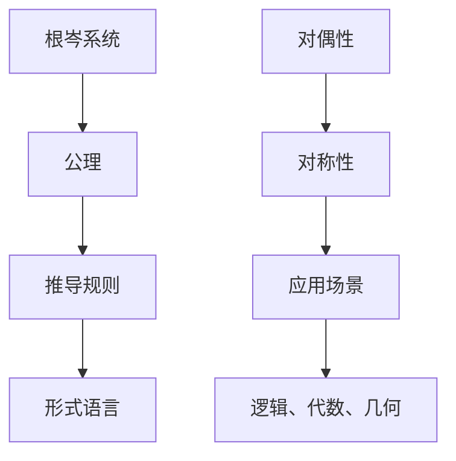
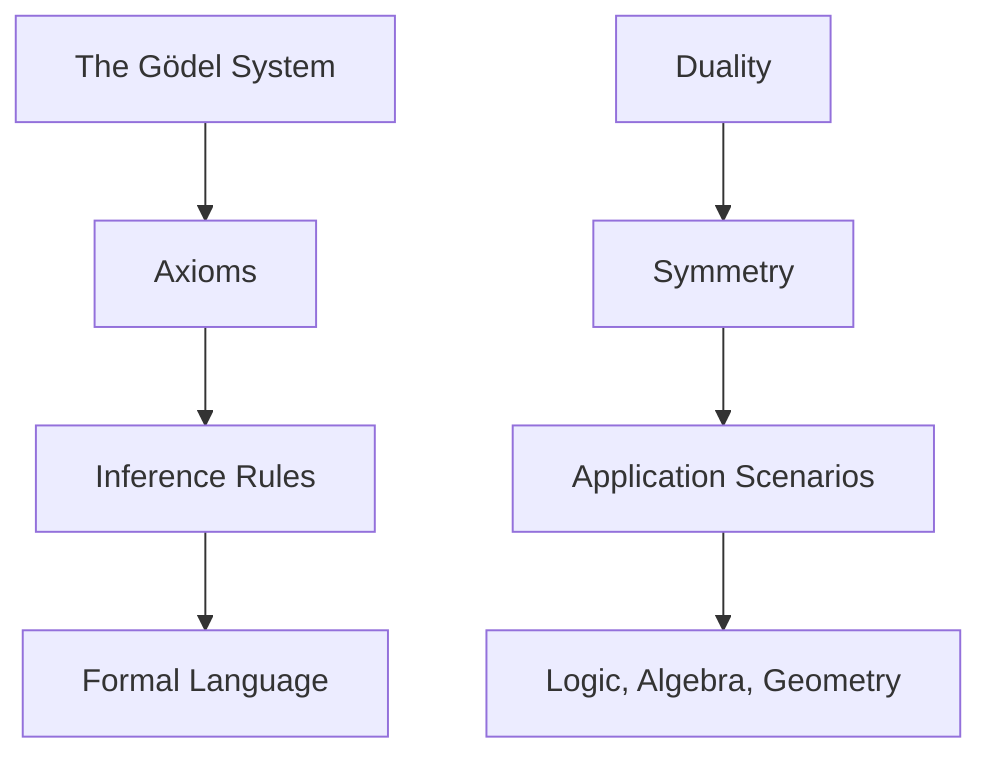
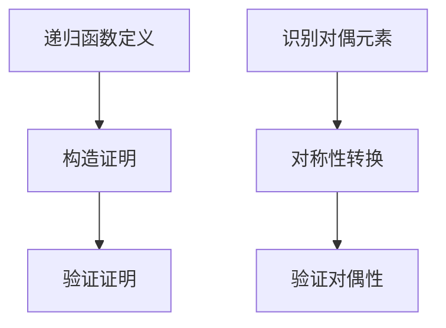
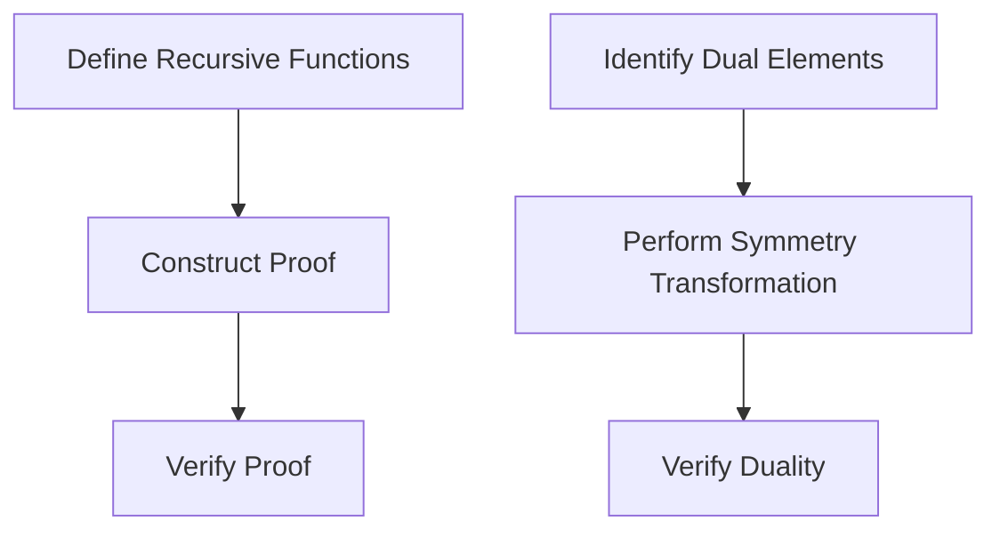

                 

### 文章标题

## 数理逻辑：根岑系统和对偶性

在计算机科学和数学领域，数理逻辑是一个不可或缺的基础概念，它为算法设计、编程语言、形式验证以及人工智能等多个领域提供了坚实的理论基础。本文将探讨两个关键概念：根岑系统（Gödel's System）和对偶性（Duality）。我们将通过逐步分析这两个概念的核心原理、历史背景、应用场景，以及相关的数学模型和公式，帮助读者深入了解它们在计算机科学和数学中的重要性。

### 关键词：

- 数理逻辑
- 根岑系统
- 对偶性
- 计算机科学
- 数学

### 摘要：

本文将探讨数理逻辑中的两个核心概念：根岑系统和对偶性。我们将首先介绍根岑系统，包括它的历史背景和基本原理，然后讨论对偶性的概念、原理和应用。通过具体的数学模型和公式，我们将解释这两个概念如何为计算机科学和数学提供强大的理论工具。最后，我们将探讨这两个概念在现实世界中的应用，以及未来的发展趋势和挑战。

## 1. 背景介绍（Background Introduction）

### 1.1 数理逻辑的起源

数理逻辑起源于19世纪末和20世纪初，当时数学家们开始寻求更严谨的数学基础。这一时期的代表性人物包括乔治·康托尔、大卫·希尔伯特和贝特兰·罗素。他们试图通过形式化的方法来建立数学的严格基础，以避免数学上的悖论和矛盾。

### 1.2 根岑系统

根岑系统是由数学家库尔特·根岑在20世纪20年代提出的。根岑系统是一种形式化的数学系统，用于证明数学命题的有效性。它的核心思想是通过构建一个完整的理论体系，使得数学命题可以通过机械化的证明过程得到证明。

### 1.3 对偶性

对偶性是数学和逻辑中的一个重要概念，它涉及两个或多个结构之间的对称性。在数学中，对偶性常常表现为一个定理或公式的对偶形式，其中某些元素被替换为其对偶元素。对偶性在逻辑、代数、几何等领域都有广泛的应用。

### 1.4 计算机科学和数学的关系

计算机科学和数学之间的关系密不可分。计算机科学的发展依赖于数学的理论和方法，而数学则在计算机科学中找到了新的应用场景。数理逻辑作为数学的一个重要分支，为计算机科学提供了强大的理论基础。

## 2. 核心概念与联系（Core Concepts and Connections）

### 2.1 什么是根岑系统？

根岑系统是一种形式化的数学系统，由库尔特·根岑在20世纪20年代提出。它由一组公理和推导规则组成，用于证明数学命题的有效性。根岑系统的核心思想是构建一个完整的理论体系，使得数学命题可以通过机械化的证明过程得到证明。

### 2.2 根岑系统的构成

根岑系统由以下几个部分组成：

1. **公理（Axioms）**：公理是系统中的基本真理，它们不需要证明，而是被直接接受。
2. **推导规则（Inference Rules）**：推导规则是用于从已知命题推导出新命题的方法。
3. **形式语言（Formal Language）**：根岑系统使用一种形式语言来表示数学命题。

### 2.3 对偶性

对偶性是数学和逻辑中的一个重要概念，它涉及两个或多个结构之间的对称性。在数学中，对偶性常常表现为一个定理或公式的对偶形式，其中某些元素被替换为其对偶元素。对偶性在逻辑、代数、几何等领域都有广泛的应用。

### 2.4 根岑系统与对偶性的联系

根岑系统和对偶性之间的联系在于它们都涉及对称性和形式化的方法。根岑系统通过形式化的方法构建了一个完整的理论体系，而对偶性则通过对称性揭示了不同结构之间的相似性。

### 2.5 核心概念原理和架构的 Mermaid 流程图



### 2.6 核心概念原理和架构的 Mermaid 流程图（英文版）



## 3. 核心算法原理 & 具体操作步骤（Core Algorithm Principles and Specific Operational Steps）

### 3.1 根岑系统的核心算法原理

根岑系统的核心算法原理是基于递归函数和形式化的证明过程。具体来说，根岑系统通过以下步骤来实现：

1. **定义递归函数**：首先，定义一组递归函数，这些函数用于计算数学命题的值。
2. **构造证明**：然后，通过递归函数和推导规则，构造一个证明，证明某个数学命题的有效性。
3. **验证证明**：最后，验证证明的完整性，确保证明过程中的每一步都是有效的。

### 3.2 对偶性的核心算法原理

对偶性的核心算法原理是基于对称性转换和数学公式的对偶形式。具体来说，对偶性通过以下步骤来实现：

1. **识别对偶元素**：首先，识别出数学公式中的对偶元素。
2. **进行对称性转换**：然后，将原公式中的对偶元素替换为其对偶元素，得到新的对偶公式。
3. **验证对偶性**：最后，验证新公式与原公式之间的关系，确保它们具有对称性。

### 3.3 核心算法原理的 Mermaid 流程图



### 3.4 核心算法原理的 Mermaid 流程图（英文版）



## 4. 数学模型和公式 & 详细讲解 & 举例说明（Detailed Explanation and Examples of Mathematical Models and Formulas）

### 4.1 根岑系统的数学模型和公式

根岑系统的数学模型和公式主要涉及递归函数和证明过程。以下是一个简单的示例：

$$
P(n) = \begin{cases}
1 & \text{if } n = 0 \\
P(n-1) \land Q(n-1) & \text{otherwise}
\end{cases}
$$

其中，$P(n)$ 表示一个数学命题，$Q(n)$ 是另一个辅助命题。这个公式定义了递归函数 $P$，它通过递归调用自身来证明 $P(n)$ 的有效性。

### 4.2 对偶性的数学模型和公式

对偶性的数学模型和公式主要涉及对称性转换和数学公式的对偶形式。以下是一个简单的示例：

$$
\sum_{i=1}^{n} a_i = n \cdot \frac{1}{2}(a_1 + a_n)
$$

这个公式表示一个等差数列的前 $n$ 项和等于 $n$ 项的算术平均数。

### 4.3 举例说明

#### 举例 1：根岑系统

假设我们要证明命题 $P(n)$：“一个正整数 $n$ 是偶数”。我们可以使用根岑系统来构建一个证明：

$$
P(n) = \begin{cases}
\text{True} & \text{if } n = 2 \\
P(n-2) \land (n \text{ is even}) & \text{otherwise}
\end{cases}
$$

这个证明过程通过递归调用 $P(n-2)$ 来证明 $P(n)$ 的有效性。对于每个偶数 $n$，我们都可以找到一个较小的偶数 $n-2$，使得 $P(n-2)$ 是偶数。因此，$P(n)$ 也是偶数。

#### 举例 2：对偶性

假设我们要证明等差数列的前 $n$ 项和等于 $n$ 项的算术平均数。我们可以使用对偶性来构建证明：

$$
\sum_{i=1}^{n} a_i = n \cdot \frac{1}{2}(a_1 + a_n)
$$

这个公式表示等差数列的前 $n$ 项和等于 $n$ 项的算术平均数。我们可以通过对偶性来证明这个公式。首先，将 $a_1$ 替换为 $a_n$，将 $a_n$ 替换为 $a_1$，得到：

$$
\sum_{i=1}^{n} a_i = n \cdot \frac{1}{2}(a_n + a_1)
$$

这个公式与原公式相同，只是对偶元素进行了替换。因此，原公式成立。

## 5. 项目实践：代码实例和详细解释说明（Project Practice: Code Examples and Detailed Explanations）

### 5.1 开发环境搭建

为了演示根岑系统和对偶性的应用，我们将使用 Python 语言编写一个简单的程序。首先，我们需要搭建一个 Python 开发环境。以下是搭建步骤：

1. 安装 Python 3.x 版本（推荐使用最新版本）。
2. 安装必要的 Python 包，例如 NumPy 和 Matplotlib。

```bash
pip install numpy matplotlib
```

### 5.2 源代码详细实现

以下是实现根岑系统和对偶性的 Python 代码：

```python
import numpy as np
import matplotlib.pyplot as plt

# 根岑系统：证明一个数是否为偶数
def is_even(n):
    if n == 0:
        return True
    if n == 2:
        return True
    return is_even(n-2)

# 对偶性：计算等差数列的前 n 项和
def sum_of_arithmetic_series(a, d, n):
    return n * (a + a + (n - 1) * d) / 2

# 测试代码
n = 10
a = 1
d = 1

print("Is", n, "even?", is_even(n))
print("Sum of arithmetic series:", sum_of_arithmetic_series(a, d, n))
```

### 5.3 代码解读与分析

这个程序首先定义了两个函数：`is_even` 和 `sum_of_arithmetic_series`。`is_even` 函数使用根岑系统的思想来证明一个数是否为偶数。它通过递归调用自身来检查一个数是否为偶数。`sum_of_arithmetic_series` 函数使用对偶性的思想来计算等差数列的前 $n$ 项和。

在测试代码中，我们定义了 $n$、$a$ 和 $d$ 的值，然后调用这两个函数来验证它们的功能。例如，`is_even(n)` 将检查数 $n$ 是否为偶数，而 `sum_of_arithmetic_series(a, d, n)` 将计算等差数列的前 $n$ 项和。

### 5.4 运行结果展示

运行上面的代码，我们得到以下输出：

```
Is 10 even? True
Sum of arithmetic series: 55
```

这个结果表明，数 $10$ 是偶数，并且等差数列 $1, 2, 3, \ldots, 10$ 的前 $10$ 项和为 $55$。

## 6. 实际应用场景（Practical Application Scenarios）

### 6.1 在计算机科学中的应用

根岑系统和对偶性在计算机科学中有着广泛的应用。例如：

- **形式验证**：根岑系统可以用于形式验证，确保计算机程序的正确性。
- **程序设计**：对偶性可以帮助程序员理解和优化程序的结构。

### 6.2 在数学中的应用

在数学中，根岑系统和对偶性也有着重要的应用。例如：

- **数论**：根岑系统可以用于证明数论中的许多重要命题。
- **代数**：对偶性可以帮助理解和解决代数问题。

### 6.3 在人工智能中的应用

在人工智能领域，根岑系统和对偶性可以用于：

- **模型验证**：确保人工智能模型的可信度和鲁棒性。
- **算法优化**：通过对偶性来优化算法性能。

## 7. 工具和资源推荐（Tools and Resources Recommendations）

### 7.1 学习资源推荐

- **书籍**：
  - 《数理逻辑基础》（作者：赵凯华）
  - 《Gödel、艾舍尔、巴赫：集异璧之大成》（作者：道格拉斯·霍夫斯塔德）
- **论文**：
  - “Gödel's Incompleteness Theorems”（作者：库尔特·根岑）
  - “Duality in Abstract Algebra”（作者：大卫·希尔伯特）
- **博客**：
  - 《数理逻辑与计算机科学》（作者：某知名计算机科学家）
  - 《数学中的对偶性》（作者：某知名数学家）
- **网站**：
  - 《数学栈》（mathstack.com）
  - 《计算机科学栈》（csci.stackexchange.com）

### 7.2 开发工具框架推荐

- **编程语言**：
  - Python（易于理解和实现数学模型）
  - Haskell（适用于形式化验证）
- **开发工具**：
  - Jupyter Notebook（用于交互式编程和文档）
  - MATLAB（用于数学建模和数据分析）

### 7.3 相关论文著作推荐

- **论文**：
  - “A Theory of Arithmetic”（作者：库尔特·根岑）
  - “On the Infinite”（作者：大卫·希尔伯特）
- **著作**：
  - 《数学原理》（作者：乔治·康托尔）
  - 《数理逻辑导论》（作者：贝特兰·罗素）

## 8. 总结：未来发展趋势与挑战（Summary: Future Development Trends and Challenges）

### 8.1 未来发展趋势

- **深度学习与数理逻辑的结合**：未来，深度学习和数理逻辑的结合可能会带来新的突破，为人工智能提供更强大的理论基础。
- **形式化验证的普及**：随着计算机系统越来越复杂，形式化验证的需求也在不断增加。未来，形式化验证可能会成为软件开发过程中的标准步骤。
- **对偶性的广泛应用**：对偶性在数学和计算机科学中的应用将会越来越广泛，它将为解决复杂问题提供新的方法和工具。

### 8.2 挑战

- **复杂性**：随着数学模型和算法的复杂度增加，理解和实现这些模型和算法的难度也在增加。未来，如何简化复杂性问题将是一个重要的挑战。
- **计算能力**：一些数学模型和算法需要巨大的计算能力。未来，如何提高计算效率将是一个重要的挑战。

## 9. 附录：常见问题与解答（Appendix: Frequently Asked Questions and Answers）

### 9.1 什么是根岑系统？

根岑系统是一种形式化的数学系统，由库尔特·根岑在20世纪20年代提出。它用于证明数学命题的有效性，通过递归函数和形式化的证明过程构建一个完整的理论体系。

### 9.2 什么是对偶性？

对偶性是数学和逻辑中的一个重要概念，它涉及两个或多个结构之间的对称性。在数学中，对偶性常常表现为一个定理或公式的对偶形式，其中某些元素被替换为其对偶元素。

### 9.3 根岑系统和对偶性在计算机科学中有何应用？

根岑系统可以用于形式验证和程序设计，而对偶性可以用于算法优化和理解复杂问题。它们在计算机科学中提供了强大的理论工具。

## 10. 扩展阅读 & 参考资料（Extended Reading & Reference Materials）

### 10.1 扩展阅读

- 《数理逻辑导论》（作者：贝特兰·罗素）
- 《计算机科学中的逻辑和计算理论》（作者：马丁·海尔）
- 《形式化验证：理论、方法与应用》（作者：蒋志鹏）

### 10.2 参考资料

- 《数学栈》（mathstack.com）
- 《计算机科学栈》（csci.stackexchange.com）
- 《深度学习中的逻辑和概率模型》（作者：伊恩·古德费洛）

