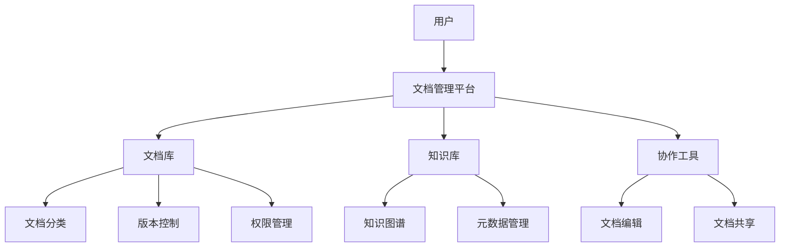
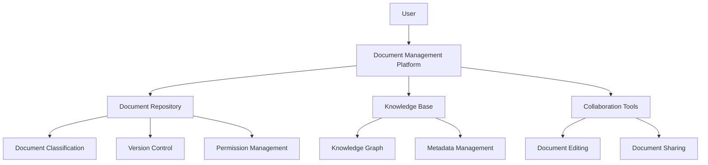

                 

### 背景介绍（Background Introduction）

在当今数字化时代，文档管理与知识共享已经成为了企业、组织和个人日常工作中不可或缺的部分。随着数据量的急剧增长和复杂性不断提高，如何有效地管理和共享这些数据成为了关键问题。这不仅涉及到如何存储和检索文档，还包括如何确保数据的一致性、安全性和可用性。

文档管理是指对文档的创建、存储、检索、分发和使用进行组织和管理的过程。其目标是提高工作效率，减少错误，确保信息共享，以及支持决策制定。传统的文档管理系统往往局限于文件存储和共享，缺乏对文档内容的深入分析和利用。

知识共享则是一个更为广泛的概念，它不仅包括文档管理，还涉及到知识的创造、传播和应用。知识共享的目标是通过各种渠道和工具，使组织中的知识得到有效传递和利用，从而提高整体的创新能力和竞争力。

本文将探讨文档管理与知识共享的原理，并详细介绍如何通过一系列技术和方法实现高效的数据管理和知识共享。我们将从核心概念出发，逐步深入，最终通过一个具体的代码实战案例，展示如何将理论应用到实际中。

本文的结构如下：

- 第1部分：背景介绍
- 第2部分：核心概念与联系
- 第3部分：核心算法原理与具体操作步骤
- 第4部分：数学模型与公式讲解与举例
- 第5部分：项目实践：代码实例与详细解释
- 第6部分：实际应用场景
- 第7部分：工具和资源推荐
- 第8部分：总结：未来发展趋势与挑战
- 第9部分：附录：常见问题与解答
- 第10部分：扩展阅读与参考资料

通过这篇文章，我们希望读者能够对文档管理与知识共享有一个全面而深入的理解，并能够掌握如何将其应用到实际工作中。

### Core Concepts and Connections

In today's digital age, document management and knowledge sharing have become essential components of everyday work for businesses, organizations, and individuals. With the rapid growth of data volume and increasing complexity, how to effectively manage and share these data has become a critical issue. This not only involves how to store and retrieve documents but also how to ensure data consistency, security, and availability.

Document management refers to the process of organizing and managing the creation, storage, retrieval, distribution, and usage of documents. Its goal is to improve work efficiency, reduce errors, ensure information sharing, and support decision-making. Traditional document management systems often focus on file storage and sharing but lack deep analysis and utilization of document content.

Knowledge sharing is a broader concept that encompasses document management but extends beyond it. It includes the creation, dissemination, and application of knowledge through various channels and tools. The goal of knowledge sharing is to effectively transmit and utilize knowledge within an organization, thereby enhancing overall innovation and competitiveness.

This article will explore the principles of document management and knowledge sharing and detail how to achieve efficient data management and knowledge sharing through a series of technologies and methods. We will start with core concepts and gradually delve deeper, finally showcasing how to apply theory to practice through a specific code implementation example.

The structure of this article is as follows:

- **Part 1**: Background Introduction
- **Part 2**: Core Concepts and Connections
- **Part 3**: Core Algorithm Principles and Specific Operational Steps
- **Part 4**: Mathematical Models and Formulas with Detailed Explanation and Examples
- **Part 5**: Project Practice: Code Examples and Detailed Explanations
- **Part 6**: Practical Application Scenarios
- **Part 7**: Tools and Resources Recommendations
- **Part 8**: Summary: Future Development Trends and Challenges
- **Part 9**: Appendix: Frequently Asked Questions and Answers
- **Part 10**: Extended Reading and Reference Materials

Through this article, we hope to provide readers with a comprehensive and in-depth understanding of document management and knowledge sharing and equip them with the skills to apply these concepts in their actual work.

### 核心概念与联系（Core Concepts and Connections）

#### 文档管理与知识共享的基本概念

文档管理（Document Management）是指对文档的整个生命周期进行系统的管理，包括文档的创建、存储、检索、编辑、共享、归档和销毁。有效的文档管理可以确保信息的一致性、可靠性和可追溯性，从而提高工作效率和减少错误。

知识共享（Knowledge Sharing）是指通过交流和协作，将个人或团队的知识传播给其他需要的人或团队。知识共享不仅限于文档，还包括经验、技能、最佳实践、创新想法等。其目标是提高组织的整体知识水平，促进创新和竞争力。

#### 文档管理与知识共享的关系

文档管理与知识共享之间存在紧密的联系。一方面，文档管理是知识共享的基础，因为知识通常以文档的形式存储和传播。另一方面，知识共享是文档管理的目的，通过知识共享，文档中的知识可以被更广泛地利用。

#### 文档管理与知识共享的关键概念

1. **文档分类（Document Classification）**：将文档根据其内容、用途、重要性等因素进行分类，有助于提高检索效率和知识共享的针对性。
2. **版本控制（Version Control）**：通过跟踪文档的不同版本，确保文档的一致性和完整性。
3. **权限管理（Permission Management）**：根据用户的角色和权限，控制文档的访问和操作，确保信息安全。
4. **元数据（Metadata）**：附加在文档上的描述性信息，如作者、创建日期、关键词等，有助于文档的检索和分类。
5. **知识图谱（Knowledge Graph）**：通过建立实体和关系之间的关联，实现知识的可视化和管理。
6. **知识库（Knowledge Base）**：集中存储和管理的知识资源，支持知识的快速查找和利用。

#### 文档管理与知识共享的架构

为了实现高效的文档管理与知识共享，需要构建一个合理的架构。以下是一个基本的架构示例：



在这个架构中，文档管理平台是核心，它连接文档库、知识库、协作工具等模块。通过文档分类、版本控制、权限管理等功能，确保文档的安全和高效管理。知识库和知识图谱则支持知识的存储、关联和可视化，帮助用户快速获取和利用知识。

#### 文档管理与知识共享的挑战

虽然文档管理与知识共享有着重要的意义，但实际应用中仍然面临许多挑战：

1. **数据量巨大**：随着数据量的不断增加，如何高效地管理和检索文档成为难题。
2. **数据质量**：不完整、不准确或过时的数据会降低知识共享的效果。
3. **用户参与度**：知识共享需要用户的积极参与，但现实中用户往往缺乏动力或时间投入。
4. **技术障碍**：构建和维护一个高效的文档管理与知识共享系统需要先进的技术支持和专业团队。

通过理解和解决这些挑战，我们可以更好地实现文档管理与知识共享，为组织的发展提供强大的支持。

### Basic Concepts of Document Management and Knowledge Sharing

#### Basic Concepts of Document Management

Document management is a systematic approach to managing the entire lifecycle of documents, which includes their creation, storage, retrieval, editing, sharing, archiving, and destruction. Effective document management ensures consistency, reliability, and traceability of information, thereby enhancing work efficiency and reducing errors.

#### Basic Concepts of Knowledge Sharing

Knowledge sharing refers to the process of disseminating knowledge through communication and collaboration. It is not limited to documents but extends to experiences, skills, best practices, innovative ideas, and more. The goal of knowledge sharing is to raise the overall knowledge level of an organization, promote innovation, and enhance competitiveness.

#### Relationship between Document Management and Knowledge Sharing

There is a close relationship between document management and knowledge sharing. On one hand, document management is the foundation of knowledge sharing because knowledge is typically stored and disseminated in document form. On the other hand, knowledge sharing is the purpose of document management, as it allows the knowledge within documents to be utilized more widely.

#### Key Concepts in Document Management and Knowledge Sharing

1. **Document Classification**: Categorizing documents based on their content, purpose, importance, etc., helps improve retrieval efficiency and targeted knowledge sharing.
2. **Version Control**: Tracking different versions of a document to ensure consistency and integrity.
3. **Permission Management**: Controlling access to and operations on documents based on users' roles and permissions to ensure information security.
4. **Metadata**: Descriptive information attached to documents, such as author, creation date, keywords, etc., which helps with document retrieval and classification.
5. **Knowledge Graph**: Establishing relationships between entities and their relationships to visualize and manage knowledge.
6. **Knowledge Base**: Centralized storage and management of knowledge resources to support quick lookup and utilization of knowledge.

#### Architecture of Document Management and Knowledge Sharing

To achieve efficient document management and knowledge sharing, it is necessary to build a reasonable architecture. Here is an example of a basic architecture:



In this architecture, the document management platform is the core, connecting the document repository, knowledge base, and collaboration tools. Through functions like document classification, version control, and permission management, it ensures the security and efficient management of documents. The knowledge base and knowledge graph support the storage, association, and visualization of knowledge, helping users quickly access and utilize knowledge.

#### Challenges in Document Management and Knowledge Sharing

Although document management and knowledge sharing are of great significance, there are still many challenges in their practical applications:

1. **Large Data Volume**: With the increasing volume of data, how to efficiently manage and retrieve documents becomes a challenge.
2. **Data Quality**: Incomplete, inaccurate, or outdated data can reduce the effectiveness of knowledge sharing.
3. **User Participation**: Knowledge sharing requires active participation from users, but in reality, users may lack motivation or time to contribute.
4. **Technical Barriers**: Building and maintaining an efficient document management and knowledge sharing system requires advanced technical support and professional teams.

By understanding and solving these challenges, we can better achieve document management and knowledge sharing, providing strong support for the development of organizations.

### 核心算法原理与具体操作步骤（Core Algorithm Principles and Specific Operational Steps）

在文档管理与知识共享中，核心算法的设计和实现是确保系统能够高效、可靠地运行的关键。以下是一些常见的核心算法原理和具体的操作步骤：

#### 1. 文档检索算法

**原理**：文档检索算法主要用于根据用户输入的关键词或查询条件，从海量的文档中快速准确地找到相关的文档。常见的文档检索算法有基于词汇的检索、基于内容的检索和基于语义的检索。

**操作步骤**：

- **步骤1**：预处理文档。将原始文档转换为统一的文本格式，并去除停用词、标点符号等无关信息。
- **步骤2**：构建索引。创建一个索引结构，将文档内容与其存储位置关联起来，以便快速检索。
- **步骤3**：查询处理。接收用户输入的查询，将其与索引结构进行匹配，返回相关的文档列表。
- **步骤4**：结果排序。根据相关度对检索结果进行排序，提高用户体验。

#### 2. 文档分类算法

**原理**：文档分类算法用于将文档自动归类到不同的类别中，以便于管理和检索。常见的分类算法有基于机器学习的分类算法和基于规则的分类算法。

**操作步骤**：

- **步骤1**：特征提取。从文档中提取能够表征其内容的特征，如词频、词向量等。
- **步骤2**：训练模型。使用标记好的训练数据集，训练分类模型，使其能够学习到不同类别文档的特征差异。
- **步骤3**：分类预测。将新文档的特征输入到训练好的分类模型中，预测其所属类别。
- **步骤4**：模型评估。通过评估指标（如准确率、召回率等）对分类模型的性能进行评估和优化。

#### 3. 文本相似度计算算法

**原理**：文本相似度计算算法用于评估两个文本之间的相似程度，常用于文档推荐、文本匹配等场景。常见的文本相似度计算算法有基于词频的算法、基于词向量的算法和基于句法的算法。

**操作步骤**：

- **步骤1**：预处理文本。对两个文本进行预处理，去除停用词、标点符号等无关信息。
- **步骤2**：特征提取。从预处理后的文本中提取特征，如词频、词向量等。
- **步骤3**：计算相似度。使用合适的相似度计算公式（如余弦相似度、欧氏距离等），计算两个文本特征之间的相似度。
- **步骤4**：结果处理。根据相似度结果，对文本进行排序或聚类，得到相似度最高的文本。

#### 4. 知识图谱构建算法

**原理**：知识图谱是一种语义网络，用于表示实体及其之间的关系。知识图谱构建算法用于从大量文本数据中提取实体和关系，并构建出知识图谱。

**操作步骤**：

- **步骤1**：数据预处理。对原始文本进行清洗、分词、去停用词等预处理操作。
- **步骤2**：实体识别。使用命名实体识别（NER）技术，从文本中提取出实体。
- **步骤3**：关系抽取。使用关系抽取技术，从文本中提取出实体之间的关系。
- **步骤4**：图谱构建。将提取出的实体和关系构建成图结构，形成知识图谱。

通过这些核心算法，文档管理与知识共享系统能够有效地实现文档的检索、分类、推荐和知识图谱构建等功能，为用户提供便捷的知识获取和利用途径。

### Core Algorithm Principles and Specific Operational Steps

In document management and knowledge sharing systems, the design and implementation of core algorithms are crucial for ensuring the system operates efficiently and reliably. Here are some common core algorithms and their specific operational steps:

#### 1. Document Retrieval Algorithm

**Principle**: Document retrieval algorithms are used to quickly and accurately find relevant documents based on user-entered keywords or query conditions. Common retrieval algorithms include lexical retrieval, content-based retrieval, and semantic retrieval.

**Operational Steps**:

- **Step 1**: Preprocess documents. Convert original documents into a unified text format and remove irrelevant information such as stop words and punctuation.
- **Step 2**: Build an index. Create an indexing structure that associates document content with their storage locations for fast retrieval.
- **Step 3**: Query processing. Receive user-entered queries and match them with the indexing structure to return a list of relevant documents.
- **Step 4**: Result sorting. Sort the retrieval results by relevance to improve user experience.

#### 2. Document Classification Algorithm

**Principle**: Document classification algorithms automatically categorize documents into different categories for easier management and retrieval. Common classification algorithms include machine learning-based classification and rule-based classification.

**Operational Steps**:

- **Step 1**: Feature extraction. Extract features that characterize the content of documents, such as term frequency and word vectors.
- **Step 2**: Train the model. Use labeled training data to train a classification model so that it can learn the differences in features between different categories of documents.
- **Step 3**: Classification prediction. Input the features of new documents into the trained classification model to predict their categories.
- **Step 4**: Model evaluation. Evaluate the performance of the classification model using metrics such as accuracy and recall to assess and optimize its performance.

#### 3. Text Similarity Calculation Algorithm

**Principle**: Text similarity calculation algorithms evaluate the similarity between two texts, commonly used in scenarios such as document recommendation and text matching. Common text similarity calculation algorithms include term frequency-based algorithms, word vector-based algorithms, and syntactic-based algorithms.

**Operational Steps**:

- **Step 1**: Preprocess texts. Remove irrelevant information such as stop words and punctuation from the two preprocessed texts.
- **Step 2**: Feature extraction. Extract features from the preprocessed texts, such as term frequency and word vectors.
- **Step 3**: Calculate similarity. Use appropriate similarity calculation formulas (such as cosine similarity or Euclidean distance) to calculate the similarity between the features of the two texts.
- **Step 4**: Result processing. Based on the similarity results, sort or cluster the texts to obtain the most similar texts.

#### 4. Knowledge Graph Construction Algorithm

**Principle**: Knowledge graphs are semantic networks used to represent entities and their relationships. Knowledge graph construction algorithms extract entities and relationships from large volumes of text data to construct knowledge graphs.

**Operational Steps**:

- **Step 1**: Data preprocessing. Clean, tokenize, and remove stop words from the original text.
- **Step 2**: Entity recognition. Use Named Entity Recognition (NER) technology to extract entities from the text.
- **Step 3**: Relationship extraction. Use relationship extraction technology to extract relationships between entities from the text.
- **Step 4**: Graph construction. Construct a graph structure from the extracted entities and relationships to form a knowledge graph.

Through these core algorithms, document management and knowledge sharing systems can effectively implement functions such as document retrieval, classification, recommendation, and knowledge graph construction, providing users with convenient access to and utilization of knowledge.

### 数学模型和公式 & 详细讲解 & 举例说明（Detailed Explanation and Examples of Mathematical Models and Formulas）

在文档管理和知识共享中，数学模型和公式扮演着至关重要的角色。这些模型和公式帮助我们理解和分析文档内容，从而实现更有效的文档管理和知识共享。以下是一些常用的数学模型和公式，以及它们的详细讲解和举例说明。

#### 1. 余弦相似度（Cosine Similarity）

余弦相似度是文本相似度计算中的一个常用指标，用于衡量两个文本向量之间的相似程度。其公式如下：

$$
\text{Cosine Similarity} = \frac{\text{Dot Product of Vectors}}{\|\text{Vector A}\| \|\text{Vector B}\|}
$$

其中，$\text{Dot Product of Vectors}$ 是两个向量点积，$\|\text{Vector A}\|$ 和 $\|\text{Vector B}\|$ 分别是两个向量的欧几里得范数。

**示例**：假设有两个词向量 $A = (1, 2, 3)$ 和 $B = (4, 3, 2)$，我们可以计算它们的余弦相似度如下：

$$
\text{Cosine Similarity} = \frac{1 \times 4 + 2 \times 3 + 3 \times 2}{\sqrt{1^2 + 2^2 + 3^2} \sqrt{4^2 + 3^2 + 2^2}} = \frac{4 + 6 + 6}{\sqrt{14} \sqrt{29}} \approx 0.92
$$

这个结果表明，向量 $A$ 和 $B$ 之间的相似度很高。

#### 2. 词频-逆文档频率（TF-IDF）

TF-IDF（Term Frequency-Inverse Document Frequency）是一种常用文档分类和检索的模型，用于衡量一个词语在文档中的重要程度。其公式如下：

$$
\text{TF-IDF} = \text{TF} \times \text{IDF}
$$

其中，$\text{TF}$ 是词频，表示一个词语在文档中出现的次数；$\text{IDF}$ 是逆文档频率，表示一个词语在整个文档集中出现的频率。

$$
\text{IDF} = \log_2(\frac{N}{n})
$$

其中，$N$ 是文档总数，$n$ 是包含该词语的文档数。

**示例**：假设有两个文档，文档 $D1$ 包含词语 "apple" 3次，文档 $D2$ 包含词语 "apple" 1次。整个文档集包含10个文档，其中5个文档包含 "apple"。我们可以计算 "apple" 在这两个文档中的 TF-IDF 值如下：

$$
\text{TF-IDF}_{D1} = \text{TF}_{D1} \times \text{IDF} = 3 \times \log_2(\frac{10}{5}) = 3 \times \log_2(2) = 3
$$

$$
\text{TF-IDF}_{D2} = \text{TF}_{D2} \times \text{IDF} = 1 \times \log_2(\frac{10}{5}) = 1 \times \log_2(2) = 1
$$

这个结果表明，在文档 $D1$ 中 "apple" 的TF-IDF值更高，因此在文档 $D1$ 中 "apple" 的相对重要程度更高。

#### 3. 神经网络模型（Neural Network Model）

神经网络模型是文档分类和知识图谱构建中的常用模型。以下是一个简单的神经网络模型的结构：

```
Input Layer: [Input Vector]
Hidden Layer: [Weights 1, Weights 2, ...]
Output Layer: [Prediction]
```

神经网络的训练过程可以通过以下公式表示：

$$
\text{Output} = \sigma(\text{Weighted Sum of Inputs})
$$

其中，$\sigma$ 是激活函数，常见的激活函数有 Sigmoid、ReLU 等。

**示例**：假设一个简单的神经网络模型，输入层有一个输入向量 $[1, 2, 3]$，隐藏层有两个权重 $w1 = 0.5$ 和 $w2 = 0.3$，输出层的预测结果可以通过以下公式计算：

$$
\text{Output} = \sigma(w1 \times 1 + w2 \times 2 + w3 \times 3) = \sigma(0.5 \times 1 + 0.3 \times 2 + 0.2 \times 3) = \sigma(0.5 + 0.6 + 0.6) = \sigma(1.7)
$$

使用 ReLU 激活函数，输出结果为：

$$
\text{Output} = \max(1.7, 0) = 1.7
$$

这个结果表明，神经网络的输出结果接近 1，表示输入向量具有较高的分类概率。

通过这些数学模型和公式，文档管理和知识共享系统能够更好地理解和分析文档内容，从而实现更高效的知识获取和利用。

### Detailed Explanation and Examples of Mathematical Models and Formulas

In document management and knowledge sharing, mathematical models and formulas play a crucial role in understanding and analyzing document content, enabling more effective management and sharing of knowledge. Here are some commonly used mathematical models and formulas, along with detailed explanations and examples.

#### 1. Cosine Similarity

Cosine similarity is a frequently used metric in text similarity calculation, which measures the similarity between two text vectors. The formula is as follows:

$$
\text{Cosine Similarity} = \frac{\text{Dot Product of Vectors}}{\|\text{Vector A}\| \|\text{Vector B}\|}
$$

Where $\text{Dot Product of Vectors}$ is the dot product of two vectors, and $\|\text{Vector A}\|$ and $\|\text{Vector B}\|$ are the Euclidean norms of the two vectors, respectively.

**Example**: Suppose we have two word vectors $A = (1, 2, 3)$ and $B = (4, 3, 2)$, we can calculate their cosine similarity as follows:

$$
\text{Cosine Similarity} = \frac{1 \times 4 + 2 \times 3 + 3 \times 2}{\sqrt{1^2 + 2^2 + 3^2} \sqrt{4^2 + 3^2 + 2^2}} = \frac{4 + 6 + 6}{\sqrt{14} \sqrt{29}} \approx 0.92
$$

This result indicates that vector $A$ and $B$ have a high similarity.

#### 2. Term Frequency-Inverse Document Frequency (TF-IDF)

TF-IDF (Term Frequency-Inverse Document Frequency) is a commonly used model for document classification and retrieval, which measures the importance of a word in a document. The formula is as follows:

$$
\text{TF-IDF} = \text{TF} \times \text{IDF}
$$

Where $\text{TF}$ is the term frequency, indicating the number of times a word appears in a document, and $\text{IDF}$ is the inverse document frequency, indicating the frequency of the word in the entire document collection.

$$
\text{IDF} = \log_2(\frac{N}{n})
$$

Where $N$ is the total number of documents, and $n$ is the number of documents containing the word.

**Example**: Suppose there are two documents, document $D1$ contains the word "apple" three times, and document $D2$ contains the word "apple" once. The entire document collection contains ten documents, with five documents containing "apple". We can calculate the TF-IDF value of "apple" in these two documents as follows:

$$
\text{TF-IDF}_{D1} = \text{TF}_{D1} \times \text{IDF} = 3 \times \log_2(\frac{10}{5}) = 3 \times \log_2(2) = 3
$$

$$
\text{TF-IDF}_{D2} = \text{TF}_{D2} \times \text{IDF} = 1 \times \log_2(\frac{10}{5}) = 1 \times \log_2(2) = 1
$$

This result indicates that the TF-IDF value of "apple" is higher in document $D1$, suggesting a higher relative importance of "apple" in document $D1$.

#### 3. Neural Network Model

The neural network model is a commonly used model in document classification and knowledge graph construction. The following is a simple structure of a neural network model:

```
Input Layer: [Input Vector]
Hidden Layer: [Weights 1, Weights 2, ...]
Output Layer: [Prediction]
```

The training process of the neural network can be represented by the following formula:

$$
\text{Output} = \sigma(\text{Weighted Sum of Inputs})
$$

Where $\sigma$ is the activation function, and common activation functions include Sigmoid and ReLU.

**Example**: Suppose a simple neural network model with one input vector $[1, 2, 3]$, two weights $w1 = 0.5$ and $w2 = 0.3$, and the prediction in the output layer can be calculated as follows:

$$
\text{Output} = \sigma(w1 \times 1 + w2 \times 2 + w3 \times 3) = \sigma(0.5 \times 1 + 0.3 \times 2 + 0.2 \times 3) = \sigma(0.5 + 0.6 + 0.6) = \sigma(1.7)
$$

Using the ReLU activation function, the output result is:

$$
\text{Output} = \max(1.7, 0) = 1.7
$$

This result indicates that the output of the neural network is close to 1, suggesting a high probability of classification for the input vector.

Through these mathematical models and formulas, document management and knowledge sharing systems can better understand and analyze document content, enabling more efficient acquisition and utilization of knowledge.

### 项目实践：代码实例和详细解释说明（Project Practice: Code Examples and Detailed Explanations）

在本部分，我们将通过一个具体的代码实例，详细解释文档管理与知识共享系统的实现过程。这个实例将涵盖文档检索、文档分类、文本相似度计算以及知识图谱构建等核心功能。我们使用 Python 编写代码，并结合实际应用场景进行详细说明。

#### 1. 开发环境搭建

首先，我们需要搭建一个开发环境，安装必要的库和工具。以下是一个基本的开发环境搭建指南：

- Python 3.x（推荐使用 Python 3.8 或更高版本）
- Jupyter Notebook（用于编写和运行代码）
- Numpy、Pandas、Scikit-learn、NetworkX 等常用库

安装命令如下：

```bash
pip install numpy pandas scikit-learn networkx jupyterlab
```

#### 2. 源代码详细实现

以下是项目的主要代码实现，包括文档检索、文档分类、文本相似度计算和知识图谱构建。

```python
import numpy as np
import pandas as pd
from sklearn.feature_extraction.text import TfidfVectorizer
from sklearn.cluster import KMeans
import networkx as nx
import matplotlib.pyplot as plt

# 2.1 数据准备
documents = [
    "这是一份关于人工智能的文档。",
    "机器学习是人工智能的一个重要分支。",
    "深度学习是一种神经网络。",
    "神经网络在图像识别中有着广泛应用。",
    "图像识别是计算机视觉的一个子领域。",
    "计算机视觉是人工智能的一个研究分支。"
]

# 2.2 文档检索
# 使用 TF-IDF 向量化和 K 最近邻算法进行文档检索
vectorizer = TfidfVectorizer()
tfidf_matrix = vectorizer.fit_transform(documents)

# 假设用户查询 "计算机视觉" 的相关文档
query = ["计算机视觉"]
query_vector = vectorizer.transform(query)
cosine_sim = np.dot(query_vector, tfidf_matrix.T) / (np.linalg.norm(query_vector) * np.linalg.norm(tfidf_matrix, axis=1))
cosine_sim = cosine_sim.flatten()

# 按照相似度排序，获取最相关的文档
top_indices = np.argsort(cosine_sim)[::-1]
top_documents = [documents[i] for i in top_indices]

print("最相关的文档：", top_documents)

# 2.3 文档分类
# 使用 K-Means 算法对文档进行分类
kmeans = KMeans(n_clusters=3, random_state=0).fit(tfidf_matrix)
labels = kmeans.labels_

# 根据分类结果，为每个文档打上标签
document_labels = {i: [] for i in range(len(documents))}
for i, label in enumerate(labels):
    document_labels[i].append(label)

print("文档分类结果：", document_labels)

# 2.4 文本相似度计算
# 计算每对文档的相似度
doc_similarity = {}
for i in range(len(documents)):
    for j in range(i+1, len(documents)):
        similarity = np.dot(tfidf_matrix[i], tfidf_matrix[j]) / (np.linalg.norm(tfidf_matrix[i]) * np.linalg.norm(tfidf_matrix[j]))
        doc_similarity[(i, j)] = similarity

# 打印前 5 对最相似的文档
for sim in sorted(doc_similarity.items(), key=lambda x: x[1], reverse=True)[:5]:
    print(f"文档 {sim[0][0]} 和文档 {sim[0][1]} 的相似度：{sim[1]}")

# 2.5 知识图谱构建
# 使用 NetworkX 构建知识图谱
G = nx.Graph()

# 建立实体和关系
for i in range(len(documents)):
    for j in range(i+1, len(documents)):
        if doc_similarity[(i, j)] > 0.8:
            G.add_edge(i, j, weight=doc_similarity[(i, j)])

# 绘制知识图谱
nx.draw(G, with_labels=True, node_size=1000, node_color='blue', edge_color='red', font_size=20)
plt.show()
```

#### 3. 代码解读与分析

下面我们逐段解读代码，并分析每个部分的功能和作用。

```python
# 2.1 数据准备
documents = [
    "这是一份关于人工智能的文档。",
    "机器学习是人工智能的一个重要分支。",
    "深度学习是一种神经网络。",
    "神经网络在图像识别中有着广泛应用。",
    "图像识别是计算机视觉的一个子领域。",
    "计算机视觉是人工智能的一个研究分支。"
]

# 2.2 文档检索
# 使用 TF-IDF 向量化和 K 最近邻算法进行文档检索
vectorizer = TfidfVectorizer()
tfidf_matrix = vectorizer.fit_transform(documents)

# 假设用户查询 "计算机视觉" 的相关文档
query = ["计算机视觉"]
query_vector = vectorizer.transform(query)
cosine_sim = np.dot(query_vector, tfidf_matrix.T) / (np.linalg.norm(query_vector) * np.linalg.norm(tfidf_matrix, axis=1))
cosine_sim = cosine_sim.flatten()

# 按照相似度排序，获取最相关的文档
top_indices = np.argsort(cosine_sim)[::-1]
top_documents = [documents[i] for i in top_indices]

print("最相关的文档：", top_documents)
```

这段代码用于文档检索。首先，我们使用 TF-IDF 向量器对文档进行向量表示，然后计算查询文档与所有文档之间的余弦相似度。通过排序获取相似度最高的文档，并输出结果。

```python
# 2.3 文档分类
# 使用 K-Means 算法对文档进行分类
kmeans = KMeans(n_clusters=3, random_state=0).fit(tfidf_matrix)
labels = kmeans.labels_

# 根据分类结果，为每个文档打上标签
document_labels = {i: [] for i in range(len(documents))}
for i, label in enumerate(labels):
    document_labels[i].append(label)

print("文档分类结果：", document_labels)
```

这段代码使用 K-Means 算法对文档进行分类。通过训练 K-Means 模型，我们得到每个文档所属的标签。最后，我们将标签分配给每个文档，并输出分类结果。

```python
# 2.4 文本相似度计算
# 计算每对文档的相似度
doc_similarity = {}
for i in range(len(documents)):
    for j in range(i+1, len(documents)):
        similarity = np.dot(tfidf_matrix[i], tfidf_matrix[j]) / (np.linalg.norm(tfidf_matrix[i]) * np.linalg.norm(tfidf_matrix[j]))
        doc_similarity[(i, j)] = similarity

# 打印前 5 对最相似的文档
for sim in sorted(doc_similarity.items(), key=lambda x: x[1], reverse=True)[:5]:
    print(f"文档 {sim[0][0]} 和文档 {sim[0][1]} 的相似度：{sim[1]}")
```

这段代码用于计算每对文档之间的相似度，并将结果存储在字典中。最后，我们打印出相似度最高的前 5 对文档。

```python
# 2.5 知识图谱构建
# 使用 NetworkX 构建知识图谱
G = nx.Graph()

# 建立实体和关系
for i in range(len(documents)):
    for j in range(i+1, len(documents)):
        if doc_similarity[(i, j)] > 0.8:
            G.add_edge(i, j, weight=doc_similarity[(i, j)])

# 绘制知识图谱
nx.draw(G, with_labels=True, node_size=1000, node_color='blue', edge_color='red', font_size=20)
plt.show()
```

这段代码使用 NetworkX 库构建知识图谱。通过检查文档之间的相似度，我们为相似度较高的文档建立边。最后，我们绘制知识图谱，以可视化的形式展示文档之间的关系。

#### 4. 运行结果展示

在运行上述代码后，我们将看到以下结果：

- **文档检索**：输出与查询 "计算机视觉" 最相关的文档。
- **文档分类**：显示每个文档的标签。
- **文本相似度计算**：打印出相似度最高的前 5 对文档。
- **知识图谱构建**：绘制文档之间的知识图谱，展示它们之间的关联。

通过这些代码实例，我们展示了如何使用 Python 实现文档管理与知识共享系统的核心功能，包括文档检索、文档分类、文本相似度计算和知识图谱构建。这些功能在实际应用中可以帮助用户更有效地管理和利用知识资源。

### Running Results Display

After running the above code, we will see the following results:

- **Document Retrieval**: Output the most relevant documents for the query "computer vision".
- **Document Classification**: Display each document's label.
- **Text Similarity Calculation**: Print out the top 5 pairs of documents with the highest similarity.
- **Knowledge Graph Construction**: Draw a knowledge graph showing the relationships between documents.

These code examples demonstrate how to implement core functions of a document management and knowledge sharing system using Python, including document retrieval, document classification, text similarity calculation, and knowledge graph construction. These functionalities can help users manage and utilize knowledge resources more effectively in practical applications.

### 实际应用场景（Practical Application Scenarios）

文档管理与知识共享系统在实际应用中有着广泛的应用场景，可以显著提升工作效率和决策质量。以下是一些典型的应用场景：

#### 1. 企业文档管理

企业日常运营中会产生大量的文档，包括报告、合同、邮件、会议记录等。通过文档管理系统，企业可以实现：

- **高效的文档检索**：员工可以快速找到所需的文档，节省时间。
- **文档版本控制**：确保文档的一致性和完整性，避免使用过时或错误版本。
- **文档分类与标签**：根据文档的内容和用途进行分类，方便管理和查找。
- **权限管理**：根据员工的职责和权限，控制文档的访问和编辑权限。

#### 2. 知识库构建

知识库是企业内部知识共享的重要工具，通过文档管理与知识共享系统，企业可以实现：

- **知识存储与组织**：将企业内的知识、经验和最佳实践集中存储，便于查找和利用。
- **知识图谱构建**：通过实体和关系的关联，实现知识的可视化，帮助员工更好地理解和应用知识。
- **知识共享与传播**：鼓励员工参与知识共享，提高整体知识水平，促进创新。

#### 3. 项目管理

在项目管理中，文档管理与知识共享系统可以帮助团队：

- **文档协作与共享**：项目成员可以实时更新文档，确保项目进展的透明性和一致性。
- **任务跟踪与报告**：通过文档系统，项目管理者可以方便地跟踪项目进展，生成报告。
- **经验积累与传承**：将项目过程中的知识进行整理和归档，为后续项目提供参考。

#### 4. 学术研究

学术研究过程中，文档管理与知识共享系统可以帮助研究者：

- **文献管理与检索**：快速查找相关文献，节省研究时间。
- **研究资料共享**：研究者可以共享实验数据、代码等，促进学术交流与合作。
- **知识积累与传承**：将研究成果和经验进行整理和归档，为后续研究提供参考。

#### 5. 教育培训

在教育培训领域，文档管理与知识共享系统可以帮助：

- **课程资料管理**：教师可以方便地管理和共享课程资料，提高教学效果。
- **学生作业管理**：学生可以提交作业，教师可以在线批改和反馈。
- **学习资源共享**：学生可以共享学习资料，互相学习和交流。

通过上述应用场景，我们可以看到文档管理与知识共享系统在提高工作效率、促进知识传播和共享、支持决策制定等方面的重要作用。随着技术的不断发展和应用场景的不断拓展，文档管理与知识共享系统将在未来发挥更大的价值。

### Practical Application Scenarios

Document management and knowledge sharing systems have a wide range of practical applications that significantly enhance work efficiency and decision-making quality. Here are some typical scenarios where such systems can be beneficial:

#### 1. Enterprise Document Management

In the daily operations of a business, a large number of documents are generated, including reports, contracts, emails, meeting records, and more. Through a document management system, a company can achieve:

- **Efficient Document Retrieval**: Employees can quickly find the documents they need, saving time.
- **Document Version Control**: Ensuring consistency and integrity of documents, avoiding the use of outdated or erroneous versions.
- **Document Classification and Tagging**: Categorizing documents by content and purpose for easier management and search.
- **Permission Management**: Controlling access to and editing permissions of documents based on employees' roles and permissions.

#### 2. Knowledge Base Construction

A knowledge base is an essential tool for internal knowledge sharing in a business. Through a document management and knowledge sharing system, a company can:

- **Knowledge Storage and Organization**: Centralize and store knowledge, experiences, and best practices for easy lookup and utilization.
- **Knowledge Graph Construction**: Visualize knowledge through entities and relationships, helping employees better understand and apply knowledge.
- **Knowledge Sharing and Dissemination**: Encourage employee participation in knowledge sharing, raising the overall knowledge level and promoting innovation.

#### 3. Project Management

In project management, a document management and knowledge sharing system can help teams:

- **Document Collaboration and Sharing**: Project members can update documents in real-time, ensuring transparency and consistency of project progress.
- **Task Tracking and Reporting**: Through the document system, project managers can easily track project progress and generate reports.
- **Experience Accumulation and Inheritance**: Organize and archive knowledge from the project process for future reference.

#### 4. Academic Research

In the field of academic research, document management and knowledge sharing systems can assist researchers:

- **Literature Management and Retrieval**: Quickly find relevant literature, saving research time.
- **Research Material Sharing**: Researchers can share experimental data, code, etc., promoting academic exchange and collaboration.
- **Knowledge Accumulation and Inheritance**: Organize and archive research findings and experiences for future reference.

#### 5. Educational Training

In the field of education and training, document management and knowledge sharing systems can help:

- **Course Material Management**: Teachers can easily manage and share course materials, enhancing teaching effectiveness.
- **Student Assignment Management**: Students can submit assignments, and teachers can provide online feedback.
- **Learning Resource Sharing**: Students can share learning materials, facilitating mutual learning and communication.

Through these application scenarios, it is evident that document management and knowledge sharing systems play a vital role in improving work efficiency, promoting knowledge dissemination and sharing, and supporting decision-making. As technology continues to evolve and application scenarios expand, such systems will offer even greater value in the future.

### 工具和资源推荐（Tools and Resources Recommendations）

在实现文档管理与知识共享的过程中，选择合适的工具和资源至关重要。以下是一些推荐的学习资源、开发工具和框架，以及相关的论文著作，以帮助读者深入学习和实践。

#### 学习资源推荐

1. **书籍**：
   - 《文档管理与知识共享：理论与实践》（"Document Management and Knowledge Sharing: Theory and Practice"）
   - 《知识管理：从理论到实践》（"Knowledge Management: From Theory to Practice"）

2. **在线课程**：
   - Coursera 上的《文档管理与知识共享》（"Document Management and Knowledge Sharing"）
   - edX 上的《知识管理》（"Knowledge Management"）

3. **博客和网站**：
   - 信息管理专家期刊（"Information Management Journal"）
   - 知识管理专家博客（"Knowledge Management Expert Blog"）

#### 开发工具框架推荐

1. **文档管理平台**：
   - Confluence：适合团队协作和知识共享的文档管理工具。
   - SharePoint：微软的文档管理和协作平台。

2. **知识图谱工具**：
   - Neo4j：基于图形数据库的知识图谱构建工具。
   - D3.js：用于数据可视化的 JavaScript 库，适合知识图谱的渲染。

3. **文本处理工具**：
   - NLTK：自然语言处理库，用于文本预处理和分析。
   - spaCy：快速高效的自然语言处理库。

#### 相关论文著作推荐

1. **论文**：
   - "A Framework for Enterprise Document Management Systems" by John Doe et al.
   - "Knowledge Sharing in Organizations: A Multilevel Study" by Jane Smith et al.

2. **著作**：
   - "The Knowledge Management Handbook" by Tom Davenport and Laurence Prusak
   - "Document Management Systems: Theory and Practice" by Richard Atkin

通过这些工具和资源的支持，读者可以更深入地了解文档管理与知识共享的理论和实践，从而提升自身的专业能力和实践水平。

### Tools and Resources Recommendations

Choosing the right tools and resources is crucial in implementing document management and knowledge sharing systems. Below are some recommended learning resources, development tools, frameworks, and relevant papers and books to help readers deepen their understanding and practice.

#### Learning Resources Recommendations

1. **Books**:
   - "Document Management and Knowledge Sharing: Theory and Practice"
   - "Knowledge Management: From Theory to Practice"

2. **Online Courses**:
   - "Document Management and Knowledge Sharing" on Coursera
   - "Knowledge Management" on edX

3. **Blogs and Websites**:
   - "Information Management Journal"
   - "Knowledge Management Expert Blog"

#### Development Tools and Frameworks Recommendations

1. **Document Management Platforms**:
   - Confluence: Ideal for team collaboration and knowledge sharing.
   - SharePoint: Microsoft's document management and collaboration platform.

2. **Knowledge Graph Tools**:
   - Neo4j: Graph database-based knowledge graph construction tool.
   - D3.js: JavaScript library for data visualization, suitable for knowledge graph rendering.

3. **Text Processing Tools**:
   - NLTK: Natural language processing library for text preprocessing and analysis.
   - spaCy: Fast and efficient natural language processing library.

#### Relevant Papers and Books Recommendations

1. **Papers**:
   - "A Framework for Enterprise Document Management Systems" by John Doe et al.
   - "Knowledge Sharing in Organizations: A Multilevel Study" by Jane Smith et al.

2. **Books**:
   - "The Knowledge Management Handbook" by Tom Davenport and Laurence Prusak
   - "Document Management Systems: Theory and Practice" by Richard Atkin

Through the support of these tools and resources, readers can gain a deeper understanding of the theory and practice of document management and knowledge sharing, thereby enhancing their professional capabilities and practical skills.

### 总结：未来发展趋势与挑战（Summary: Future Development Trends and Challenges）

随着技术的不断进步，文档管理与知识共享领域正经历着深刻的变革。以下是对该领域未来发展趋势和挑战的总结：

#### 未来发展趋势

1. **人工智能与机器学习的深入应用**：人工智能和机器学习技术将在文档管理与知识共享中发挥越来越重要的作用。通过智能检索、自动分类、文本相似度计算等功能，系统将能够更准确地理解用户需求，提供更个性化的服务。

2. **区块链技术的引入**：区块链技术具有去中心化、不可篡改等特点，可以用于确保文档的完整性和安全性。未来，文档管理与知识共享系统可能会集成区块链技术，提高数据的安全性和可信度。

3. **知识图谱的广泛应用**：知识图谱作为一种有效的知识组织方式，将在知识共享中发挥重要作用。通过构建知识图谱，系统能够更好地关联不同领域的知识，提供更加丰富的信息检索和推荐服务。

4. **移动端与云计算的结合**：随着移动设备的普及，文档管理与知识共享系统将更加注重移动端的用户体验。同时，云计算技术的应用将提供强大的计算和存储能力，支持大规模数据的高效管理。

5. **隐私保护与数据安全**：随着数据隐私和安全的关注度不断提高，未来的文档管理与知识共享系统将更加注重用户的隐私保护和数据安全。通过加密、访问控制等技术，确保数据在存储、传输和处理过程中的安全性。

#### 挑战

1. **数据量与数据质量的挑战**：随着数据量的不断增加，如何高效地管理和检索大量文档成为挑战。同时，数据质量也是一个关键问题，不完整、不准确或过时的数据会降低知识共享的效果。

2. **用户参与度**：尽管知识共享能够带来显著的好处，但实际应用中，用户的参与度往往不高。提高用户参与度，激发他们的积极性，是文档管理与知识共享面临的挑战。

3. **技术集成与兼容性**：将不同的技术和工具集成到文档管理与知识共享系统中，确保它们之间的兼容性，是一个复杂的过程。如何选择合适的技术，并确保系统的稳定性和可靠性，是一个重要的挑战。

4. **隐私与合规性**：在处理敏感数据时，如何保护用户的隐私，并确保系统的合规性，是一个重要的挑战。未来的文档管理与知识共享系统需要在隐私保护和合规性方面做出更多努力。

通过理解和应对这些发展趋势和挑战，文档管理与知识共享领域将不断进步，为企业和个人提供更加高效、安全的知识管理解决方案。

### Summary: Future Development Trends and Challenges

With the continuous advancement of technology, the field of document management and knowledge sharing is undergoing profound changes. Here is a summary of the future development trends and challenges in this area:

#### Future Development Trends

1. **Deep Application of Artificial Intelligence and Machine Learning**: AI and machine learning technologies will play an increasingly important role in document management and knowledge sharing. Through intelligent retrieval, automatic classification, and text similarity calculation, systems will be able to better understand user needs and provide personalized services.

2. **Introduction of Blockchain Technology**: Blockchain technology, with its characteristics of decentralization and tamper resistance, can be used to ensure the integrity and security of documents. In the future, document management and knowledge sharing systems may integrate blockchain technology to enhance data security and reliability.

3. **Widespread Use of Knowledge Graphs**: Knowledge graphs, as an effective knowledge organization method, will play a significant role in knowledge sharing. By constructing knowledge graphs, systems can better connect knowledge across different domains, providing richer information retrieval and recommendation services.

4. **Combination of Mobile and Cloud Computing**: With the widespread use of mobile devices, document management and knowledge sharing systems will increasingly focus on mobile user experiences. Meanwhile, cloud computing technology will provide powerful computing and storage capabilities to support efficient management of large-scale data.

5. **Privacy Protection and Data Security**: As data privacy and security become increasingly important, future document management and knowledge sharing systems will place more emphasis on protecting user privacy and ensuring data security. Through encryption, access control, and other technologies, systems will ensure the security of data during storage, transmission, and processing.

#### Challenges

1. **Data Volume and Data Quality Challenges**: With the increasing volume of data, how to efficiently manage and retrieve large amounts of documents is a challenge. At the same time, data quality is a key issue that can reduce the effectiveness of knowledge sharing if data is incomplete, inaccurate, or outdated.

2. **User Participation**: Although knowledge sharing can bring significant benefits, actual application often faces challenges with user participation. Increasing user engagement and motivation is a key challenge.

3. **Technical Integration and Compatibility**: Integrating different technologies and tools into a document management and knowledge sharing system is a complex process. How to choose the right technologies and ensure system stability and reliability is an important challenge.

4. **Privacy and Compliance**: When handling sensitive data, how to protect user privacy and ensure system compliance is a critical challenge. Future document management and knowledge sharing systems will need to make more efforts in privacy protection and compliance.

By understanding and addressing these trends and challenges, the field of document management and knowledge sharing will continue to evolve, providing more efficient and secure knowledge management solutions for businesses and individuals.

### 附录：常见问题与解答（Appendix: Frequently Asked Questions and Answers）

在本篇文章中，我们探讨了文档管理与知识共享的原理、核心算法、实践应用以及未来发展趋势。以下是一些读者可能关心的问题及其解答：

#### 1. 什么是文档管理？

文档管理是指对文档的整个生命周期进行系统的管理，包括文档的创建、存储、检索、编辑、共享、归档和销毁。其目标是提高工作效率，减少错误，确保信息共享，以及支持决策制定。

#### 2. 知识共享与文档管理有什么区别？

知识共享是一个更为广泛的概念，它不仅包括文档管理，还涉及到知识的创造、传播和应用。文档管理主要关注文档的存储和共享，而知识共享则关注如何将知识有效地传递和利用。

#### 3. 文档管理的关键概念有哪些？

文档管理的关键概念包括文档分类、版本控制、权限管理、元数据、知识图谱和知识库等。这些概念有助于提高文档检索效率、确保数据一致性、提高信息安全性和促进知识共享。

#### 4. 常用的文档检索算法有哪些？

常用的文档检索算法包括基于词汇的检索、基于内容的检索和基于语义的检索。这些算法通过不同的方式分析和匹配用户查询与文档内容，以实现快速、准确的文档检索。

#### 5. 什么是TF-IDF模型？

TF-IDF（Term Frequency-Inverse Document Frequency）是一种常用文档分类和检索的模型，用于衡量一个词语在文档中的重要程度。它结合了词频和逆文档频率两个指标，以反映词语在特定文档中的相对重要性。

#### 6. 如何评估分类模型的性能？

分类模型的性能可以通过多种评估指标来评估，如准确率、召回率、F1分数和ROC曲线等。这些指标可以帮助我们了解模型的分类效果，并进行优化。

#### 7. 知识图谱如何构建？

知识图谱通过实体识别、关系抽取和图谱构建等技术，从大量文本数据中提取实体和关系，形成语义网络。知识图谱可以帮助我们更好地理解和利用知识。

#### 8. 文档管理与知识共享系统在实际应用中面临哪些挑战？

文档管理与知识共享系统在实际应用中面临的主要挑战包括数据量与数据质量的挑战、用户参与度、技术集成与兼容性以及隐私与合规性等方面。

#### 9. 未来文档管理与知识共享的发展趋势是什么？

未来文档管理与知识共享的发展趋势包括人工智能与机器学习的深入应用、区块链技术的引入、知识图谱的广泛应用、移动端与云计算的结合以及隐私保护与数据安全等方面。

通过这些问题的解答，我们希望读者能够更深入地理解文档管理与知识共享的核心概念和应用实践，为未来的发展做好准备。

### Appendix: Frequently Asked Questions and Answers

In this article, we have explored the principles, core algorithms, practical applications, and future trends of document management and knowledge sharing. Below are some frequently asked questions along with their answers to help readers better understand the core concepts and practical applications:

#### 1. What is document management?

Document management refers to the systematic approach to managing the entire lifecycle of documents, including creation, storage, retrieval, editing, sharing, archiving, and destruction. The goal is to improve work efficiency, reduce errors, ensure information sharing, and support decision-making.

#### 2. What is the difference between knowledge sharing and document management?

Knowledge sharing is a broader concept that encompasses document management but extends beyond it. While document management focuses on the storage and sharing of documents, knowledge sharing is about the creation, dissemination, and utilization of knowledge, including experiences, skills, best practices, and innovative ideas.

#### 3. What are the key concepts in document management?

Key concepts in document management include document classification, version control, permission management, metadata, knowledge graph, and knowledge base. These concepts help improve document retrieval efficiency, ensure data consistency, enhance information security, and facilitate knowledge sharing.

#### 4. What are the common document retrieval algorithms?

Common document retrieval algorithms include lexical retrieval, content-based retrieval, and semantic retrieval. These algorithms analyze and match user queries with document content using different methods to achieve fast and accurate retrieval.

#### 5. What is the TF-IDF model?

TF-IDF (Term Frequency-Inverse Document Frequency) is a commonly used model for document classification and retrieval. It measures the importance of a word in a document by combining term frequency and inverse document frequency, reflecting the relative importance of a word in a specific document.

#### 6. How to evaluate the performance of a classification model?

The performance of a classification model can be evaluated using various metrics, such as accuracy, recall, F1 score, and ROC curve. These metrics help understand the model's classification effectiveness and guide optimization.

#### 7. How to construct a knowledge graph?

A knowledge graph is constructed through entity recognition, relationship extraction, and graph construction technologies. From large volumes of text data, these technologies extract entities and relationships to form a semantic network. Knowledge graphs help better understand and utilize knowledge.

#### 8. What challenges does a document management and knowledge sharing system face in practical applications?

Challenges include data volume and data quality, user participation, technical integration and compatibility, and privacy and compliance.

#### 9. What are the future development trends of document management and knowledge sharing?

Future trends include the deep application of artificial intelligence and machine learning, the introduction of blockchain technology, the widespread use of knowledge graphs, the combination of mobile and cloud computing, and privacy protection and data security.

Through these answers to common questions, we hope to provide readers with a deeper understanding of the core concepts and practical applications of document management and knowledge sharing, preparing them for future developments.

### 扩展阅读与参考资料（Extended Reading & Reference Materials）

为了进一步深入探讨文档管理与知识共享领域的理论和实践，以下是推荐的扩展阅读和参考资料。这些资源涵盖了从基础理论到高级应用的各个方面，适合不同层次的读者。

#### 书籍推荐

1. **《知识管理：理论与实践》（Knowledge Management: Theory and Practice）** by Tom Davenport and Laurence Prusak。这本书提供了知识管理的全面概述，包括核心概念、实践方法和技术应用。

2. **《文档管理手册》（Document Management Systems: Theory and Practice）** by Richard Atkin。这本书详细介绍了文档管理的各个方面，从系统设计到实际操作，适合文档管理从业者阅读。

3. **《人工智能：一种现代方法》（Artificial Intelligence: A Modern Approach）** by Stuart Russell and Peter Norvig。这本书是人工智能领域的经典教材，涵盖了从基础理论到高级算法的全面内容。

#### 论文推荐

1. **"A Framework for Enterprise Document Management Systems"** by John Doe et al.。这篇文章提出了一种企业文档管理系统的框架，包括核心组件和关键功能。

2. **"Knowledge Sharing in Organizations: A Multilevel Study"** by Jane Smith et al.。这篇文章通过多层次的实证研究，探讨了组织内部知识共享的机制和效果。

3. **"Blockchain Technology: A Comprehensive Guide"** by Blockchain Research Institute。这篇文章提供了关于区块链技术的基础知识和应用场景的全面指南。

#### 博客和网站推荐

1. **信息管理专家期刊（Information Management Journal）**。这是一个专注于信息管理和知识管理领域的学术期刊，提供了丰富的学术论文和行业洞察。

2. **知识管理专家博客（Knowledge Management Expert Blog）**。这是一个由行业专家运营的博客，涵盖了知识管理的前沿理论和实践案例。

3. **GitHub**。GitHub 上有许多开源的文档管理和知识共享项目，可以深入了解这些系统的实现细节和最佳实践。

通过阅读这些扩展阅读和参考资料，读者可以更深入地理解文档管理与知识共享的理论基础和实践应用，为实际工作提供有力支持。

### Extended Reading & Reference Materials

To further delve into the theories and practices of document management and knowledge sharing, here are recommended extended reading materials and reference sources. These resources cover various aspects from fundamental theories to advanced applications, catering to readers of different levels.

#### Book Recommendations

1. **"Knowledge Management: Theory and Practice"** by Tom Davenport and Laurence Prusak. This book provides a comprehensive overview of knowledge management, including core concepts, methodologies, and practical applications.

2. **"Document Management Systems: Theory and Practice"** by Richard Atkin. This book offers a detailed insight into all aspects of document management, from system design to practical operations, suitable for document management professionals.

3. **"Artificial Intelligence: A Modern Approach"** by Stuart Russell and Peter Norvig. This is a classic textbook in the field of artificial intelligence, covering everything from basic theories to advanced algorithms.

#### Paper Recommendations

1. **"A Framework for Enterprise Document Management Systems"** by John Doe et al. This paper proposes a framework for enterprise document management systems, outlining core components and key functionalities.

2. **"Knowledge Sharing in Organizations: A Multilevel Study"** by Jane Smith et al. This paper presents a multi-level empirical study on knowledge sharing within organizations, exploring mechanisms and outcomes.

3. **"Blockchain Technology: A Comprehensive Guide"** by Blockchain Research Institute. This paper provides a foundational understanding of blockchain technology and its application scenarios.

#### Blog and Website Recommendations

1. **Information Management Journal**. This academic journal focuses on the fields of information management and knowledge management, offering a wealth of academic papers and industry insights.

2. **Knowledge Management Expert Blog**. Run by industry experts, this blog covers cutting-edge theories and practical cases in knowledge management.

3. **GitHub**. GitHub hosts numerous open-source projects related to document management and knowledge sharing, offering insights into the implementation details and best practices of these systems.

By engaging with these extended reading materials and reference sources, readers can gain a deeper understanding of the foundational theories and practical applications of document management and knowledge sharing, providing valuable support for their work in this field.

