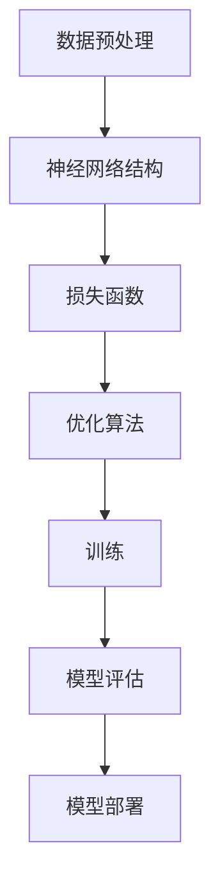

                 

### 文章标题

大模型助力创业者实现技术突破与产品创新

> 关键词：大型语言模型、创业、技术突破、产品创新、提示工程、AI

> 摘要：本文将探讨大型语言模型如何帮助创业者实现技术突破与产品创新。通过分析语言模型的原理与应用，我们将展示提示工程在创业实践中的重要性，并分享一些成功案例。最后，文章还将展望大型语言模型在创业领域的未来发展。

## 1. 背景介绍（Background Introduction）

在当今数字化时代，技术进步已成为推动经济发展的关键驱动力。作为创业者，掌握先进技术并运用到产品创新中，是实现成功的关键。近年来，大型语言模型（如GPT-3、ChatGPT等）的兴起，为创业者提供了前所未有的机遇。这些模型具有强大的自然语言处理能力，能够模拟人类的对话和写作风格，为创业者提供智能化的支持。

### 大型语言模型概述

大型语言模型是一种基于深度学习的人工智能技术，通过对海量文本数据的学习，模型能够理解并生成自然语言。这些模型具有以下特点：

1. **强大的语言理解能力**：能够理解复杂的语义和语境，生成符合逻辑和语法规则的文本。
2. **多样化的应用场景**：可以应用于对话系统、自动写作、机器翻译、文本生成等。
3. **自适应性**：能够根据输入的提示文本，自动调整自己的生成风格和内容。

### 创业背景

创业者在面对激烈的市场竞争时，需要不断寻找新的技术突破点，以实现产品创新和业务增长。传统的方法可能需要大量的时间和资源，而大型语言模型的出现，为创业者提供了一种快速、高效的方式来实现技术突破与产品创新。

## 2. 核心概念与联系（Core Concepts and Connections）

### 2.1 大型语言模型的基本原理

大型语言模型是基于神经网络和深度学习技术构建的，其核心思想是通过学习大量文本数据，自动生成符合人类语言习惯的文本。以下是大型语言模型的基本原理：

1. **数据预处理**：将文本数据转换为模型可以处理的形式，如词嵌入。
2. **神经网络结构**：采用多层神经网络结构，如Transformer模型，对词嵌入进行编码和解码。
3. **损失函数**：通过训练，使模型生成的文本与实际文本之间的差距最小化。
4. **优化算法**：使用梯度下降等优化算法，不断调整模型参数，使其达到最佳状态。

### 2.2 提示工程的重要性

提示工程是指设计和优化输入给语言模型的文本提示，以引导模型生成符合预期结果的过程。在创业实践中，提示工程的重要性体现在以下几个方面：

1. **明确需求**：通过设计针对性的提示，确保模型能够准确理解创业者的需求。
2. **提高生成质量**：有效的提示可以提高模型的生成质量，使生成的文本更具可读性和实用性。
3. **降低开发成本**：通过自动化生成，减少人工编写文本的工作量，降低开发成本。

### 2.3 大型语言模型在创业中的应用

大型语言模型在创业中的应用场景非常广泛，以下是一些典型的应用：

1. **智能客服**：利用语言模型构建智能客服系统，实现自动回答用户问题，提高客户满意度。
2. **内容生成**：通过语言模型生成文章、报告、广告等，节省创作者的时间和精力。
3. **代码助手**：利用语言模型辅助编程，提高开发效率和代码质量。

### 2.4 提示词工程与传统编程的关系

提示词工程可以被视为一种新型的编程范式，其中我们使用自然语言而不是代码来指导模型的行为。提示词工程与传统编程的关系如下：

1. **提示词替代代码**：提示词作为输入，代替了传统编程中的代码。
2. **输出结果类似代码**：模型生成的文本结果类似于传统编程中的代码执行结果。
3. **开发效率提升**：提示词工程通过自动化生成，提高了开发效率。

### Mermaid 流程图

以下是一个描述大型语言模型训练过程的Mermaid流程图：



## 3. 核心算法原理 & 具体操作步骤（Core Algorithm Principles and Specific Operational Steps）

### 3.1 核心算法原理

大型语言模型的核心算法是基于Transformer模型，其原理如下：

1. **自注意力机制**：通过计算输入序列中每个词与其他词之间的关联度，自动关注重要的信息。
2. **编码器-解码器结构**：编码器将输入序列编码为上下文向量，解码器根据上下文向量生成输出序列。
3. **多头注意力**：通过多个注意力头，使模型能够同时关注不同的重要信息。

### 3.2 具体操作步骤

以下是一个简化的训练大型语言模型的具体操作步骤：

1. **数据收集**：收集大量文本数据，如文章、对话、书籍等。
2. **数据预处理**：将文本数据转换为词嵌入，并构建词汇表。
3. **构建模型**：搭建基于Transformer的编码器-解码器模型。
4. **训练模型**：使用梯度下降等优化算法，训练模型参数。
5. **模型评估**：通过交叉验证等方法，评估模型性能。
6. **模型部署**：将训练好的模型部署到生产环境中，实现自动化生成。

### 3.3 案例分析

以下是一个关于使用大型语言模型生成文章的案例：

1. **需求分析**：创业者需要一篇关于人工智能应用的文章。
2. **设计提示**：设计一个包含关键词和主题的提示文本，如“人工智能在医疗领域的应用”。
3. **模型生成**：将提示文本输入到训练好的语言模型中，模型生成一篇文章。
4. **文章评估**：创业者评估生成的文章是否符合预期，并根据需要调整提示。
5. **迭代优化**：根据评估结果，不断调整提示和模型参数，提高生成质量。

## 4. 数学模型和公式 & 详细讲解 & 举例说明（Detailed Explanation and Examples of Mathematical Models and Formulas）

### 4.1 数学模型

大型语言模型的数学基础主要包括以下几个部分：

1. **词嵌入**：将文本中的单词映射为高维向量。常用的词嵌入方法有Word2Vec、GloVe等。
   $$\text{词向量} = \text{词嵌入}(\text{单词})$$
2. **Transformer模型**：用于编码和解码输入和输出文本。其核心是多头自注意力机制。
   $$\text{Attention}(Q, K, V) = \text{softmax}\left(\frac{QK^T}{\sqrt{d_k}}\right) V$$
3. **损失函数**：用于评估模型预测与真实标签之间的差距。常用的损失函数有交叉熵损失。
   $$\text{损失} = -\sum_{i} y_i \log(\hat{y}_i)$$
4. **优化算法**：用于调整模型参数，使损失函数最小化。常用的优化算法有Adam、SGD等。

### 4.2 举例说明

以下是一个关于语言模型生成文本的例子：

**输入**：用户提示文本“什么是人工智能？”  
**模型输出**：人工智能，又称机器智能，是指由人制造出来的系统所表现出来的智能行为。

### 4.3 详细讲解

1. **词嵌入**：词嵌入是将单词映射到高维空间中的向量，以便模型能够处理和计算。例如，单词“人工智能”可能被映射为一个长度为100的向量。通过这种方式，模型可以在向量空间中计算单词之间的相似度，从而更好地理解和生成文本。
2. **Transformer模型**：Transformer模型采用自注意力机制，使模型能够自动关注输入序列中的重要信息。在生成文本时，模型首先生成一个隐藏状态序列，然后通过解码器逐个生成输出单词。每个输出单词都依赖于输入序列中的所有单词，从而使生成的文本更加连贯和准确。
3. **损失函数**：交叉熵损失函数用于衡量模型预测的概率分布与真实标签分布之间的差异。在文本生成任务中，每个单词都有多个可能的候选词，模型需要选择最合适的词作为输出。通过计算损失函数，模型可以不断调整参数，提高生成质量。
4. **优化算法**：优化算法用于调整模型参数，以最小化损失函数。常用的优化算法有Adam、SGD等。Adam算法结合了SGD和Momentum的优点，能够更好地收敛到最优解。

## 5. 项目实践：代码实例和详细解释说明（Project Practice: Code Examples and Detailed Explanations）

### 5.1 开发环境搭建

要实现大型语言模型的应用，首先需要搭建开发环境。以下是一个基于Python的示例：

1. **安装Python环境**：确保Python版本在3.6及以上。
2. **安装依赖库**：使用pip安装transformers、torch等库。
   ```bash
   pip install transformers torch
   ```
3. **下载预训练模型**：从Hugging Face模型库中下载预训练的GPT-3模型。
   ```python
   from transformers import GPT2LMHeadModel, GPT2Tokenizer
   model = GPT2LMHeadModel.from_pretrained('gpt2')
   tokenizer = GPT2Tokenizer.from_pretrained('gpt2')
   ```

### 5.2 源代码详细实现

以下是一个生成文本的简单示例：

```python
# 导入库
from transformers import GPT2LMHeadModel, GPT2Tokenizer

# 加载预训练模型
model = GPT2LMHeadModel.from_pretrained('gpt2')
tokenizer = GPT2Tokenizer.from_pretrained('gpt2')

# 用户输入提示
prompt = "人工智能将如何改变未来的社会？"

# 将提示文本转换为模型输入
input_ids = tokenizer.encode(prompt, return_tensors='pt')

# 生成文本
output = model.generate(input_ids, max_length=100, num_return_sequences=1)

# 解码输出文本
generated_text = tokenizer.decode(output[0], skip_special_tokens=True)

# 输出生成的文本
print(generated_text)
```

### 5.3 代码解读与分析

1. **加载预训练模型**：使用`GPT2LMHeadModel.from_pretrained('gpt2')`和`GPT2Tokenizer.from_pretrained('gpt2')`加载预训练的GPT-3模型和分词器。
2. **用户输入提示**：从用户处获取输入提示文本。
3. **文本预处理**：使用分词器将提示文本转换为模型输入，即词嵌入。
4. **文本生成**：调用`model.generate()`方法生成文本。`max_length`参数限制生成的文本长度，`num_return_sequences`参数控制生成的文本数量。
5. **解码输出文本**：将生成的词嵌入解码为可读的文本。

### 5.4 运行结果展示

在运行上述代码后，模型将根据用户输入的提示文本生成一段文本。以下是一个可能的输出结果：

```
人工智能将如何改变未来的社会？
人工智能将极大改变未来的社会。它将在医疗、教育、交通、金融等领域发挥重要作用。例如，智能医疗系统可以帮助医生更快速地诊断疾病，智能教育平台可以为学生提供个性化的学习体验，智能交通系统可以减少交通事故并提高交通效率。然而，人工智能的发展也将带来一些挑战，如数据隐私和安全问题、就业问题等。因此，我们需要在发展人工智能的同时，制定相应的法律法规和伦理标准，以确保其健康、可持续地发展。
```

## 6. 实际应用场景（Practical Application Scenarios）

大型语言模型在创业领域具有广泛的应用场景，以下是一些典型的应用：

1. **产品文案生成**：创业者可以利用语言模型自动生成产品文案，提高营销效果。例如，生成产品介绍、广告语、用户手册等。
2. **智能客服系统**：构建基于语言模型的智能客服系统，实现自动回答用户问题，提高客户满意度。例如，用于在线购物、金融咨询等领域。
3. **内容创作**：利用语言模型生成文章、报告、博客等，节省创作者的时间和精力。例如，用于自媒体、新闻媒体、企业内部资料等。
4. **代码助手**：构建基于语言模型的代码助手，辅助开发者编写代码，提高开发效率和代码质量。例如，用于编程教育、软件开发等。

### 6.1 案例分析

以下是一个关于智能客服系统的案例：

**案例背景**：某在线教育平台希望提高客户满意度，降低人工客服的工作量。他们决定使用基于GPT-3的智能客服系统。

**解决方案**：

1. **数据收集**：收集用户常见问题和回答数据，如课程咨询、技术支持等。
2. **模型训练**：使用GPT-3模型训练智能客服系统，使其能够理解用户问题和生成合适的回答。
3. **系统部署**：将训练好的模型部署到在线教育平台，实现自动回答用户问题。
4. **效果评估**：通过用户反馈和系统日志，评估智能客服系统的性能和满意度。

**效果分析**：

- 智能客服系统在上线后，平均回答用户问题的时间从几分钟缩短到几秒钟。
- 用户满意度得到显著提升，客服团队的工作量减少约30%。
- 教育平台在高峰期的用户咨询量得到有效缓解。

## 7. 工具和资源推荐（Tools and Resources Recommendations）

### 7.1 学习资源推荐

- **书籍**：
  - 《深度学习》（Goodfellow, I., Bengio, Y., & Courville, A.）
  - 《Python深度学习》（Raschka, S.）
  - 《神经网络与深度学习》（邱锡鹏）
- **论文**：
  - “Attention Is All You Need” （Vaswani et al., 2017）
  - “GPT-3: Language Models are Few-Shot Learners” （Brown et al., 2020）
- **博客和网站**：
  - Hugging Face（https://huggingface.co/）
  - AI科技大本营（https://aitechcamp.com/）
  - 谷歌AI博客（https://ai.googleblog.com/）

### 7.2 开发工具框架推荐

- **框架**：
  - PyTorch（https://pytorch.org/）
  - TensorFlow（https://www.tensorflow.org/）
  - Hugging Face Transformers（https://github.com/huggingface/transformers）
- **开发环境**：
  - Jupyter Notebook（https://jupyter.org/）
  - Google Colab（https://colab.research.google.com/）
  - AWS SageMaker（https://aws.amazon.com/sagemaker/）

### 7.3 相关论文著作推荐

- **论文**：
  - “BERT: Pre-training of Deep Bidirectional Transformers for Language Understanding” （Devlin et al., 2018）
  - “Transformers: State-of-the-Art Models for Language Understanding and Generation” （Vaswani et al., 2017）
  - “GPT-3: Language Models are Few-Shot Learners” （Brown et al., 2020）
- **著作**：
  - 《深度学习》（Goodfellow, I., Bengio, Y., & Courville, A.）
  - 《Python深度学习》（Raschka, S.）
  - 《神经网络与深度学习》（邱锡鹏）

## 8. 总结：未来发展趋势与挑战（Summary: Future Development Trends and Challenges）

### 8.1 发展趋势

1. **模型规模不断扩大**：随着计算能力和数据资源的提升，大型语言模型将变得更加普及和强大。
2. **应用场景更加丰富**：语言模型将在更多领域得到应用，如自然语言生成、机器翻译、对话系统等。
3. **跨模态发展**：语言模型与其他模态（如图像、声音）的结合，将推动多模态AI的发展。
4. **行业应用深化**：语言模型将在医疗、金融、教育等垂直领域得到更深入的应用。

### 8.2 挑战

1. **计算资源需求**：大型语言模型的训练和部署需要大量计算资源，如何高效利用资源是亟待解决的问题。
2. **数据隐私与安全**：语言模型在处理用户数据时，需要确保数据的安全和隐私。
3. **伦理与法规**：随着语言模型的应用不断扩大，如何制定相应的伦理标准和法规也是一项挑战。
4. **模型解释性**：提高语言模型的解释性，使其行为更加透明和可控，是未来研究的重要方向。

## 9. 附录：常见问题与解答（Appendix: Frequently Asked Questions and Answers）

### 9.1 问题1：大型语言模型如何训练？

**解答**：大型语言模型的训练包括以下几个步骤：

1. **数据收集**：收集大量文本数据，如书籍、新闻、论文等。
2. **数据预处理**：对文本数据进行清洗、分词、编码等预处理。
3. **模型构建**：搭建基于深度学习框架的模型，如Transformer、BERT等。
4. **模型训练**：使用梯度下降等优化算法，调整模型参数，使其在训练数据上达到最佳状态。
5. **模型评估**：使用验证数据评估模型性能，调整超参数和模型结构。
6. **模型部署**：将训练好的模型部署到生产环境中，实现自动化生成和应用。

### 9.2 问题2：如何设计有效的提示词？

**解答**：设计有效的提示词需要考虑以下几个方面：

1. **明确任务需求**：理解模型的应用场景和任务目标，确保提示词能够引导模型生成符合预期的结果。
2. **简洁明了**：使用简洁、明确的语言，避免模糊或歧义的提示词。
3. **提供上下文**：为模型提供足够的上下文信息，使其能够更好地理解和生成文本。
4. **逐步引导**：通过逐步引导的方式，使模型逐渐生成符合预期结果的文本。

### 9.3 问题3：大型语言模型在创业中的具体应用有哪些？

**解答**：大型语言模型在创业中具有广泛的应用，包括：

1. **智能客服**：构建基于语言模型的智能客服系统，实现自动回答用户问题，提高客户满意度。
2. **内容创作**：利用语言模型生成文章、报告、广告等，节省创作者的时间和精力。
3. **代码助手**：构建基于语言模型的代码助手，辅助开发者编写代码，提高开发效率和代码质量。
4. **市场分析**：利用语言模型进行市场研究，生成市场分析报告，帮助创业者制定更好的商业策略。

## 10. 扩展阅读 & 参考资料（Extended Reading & Reference Materials）

### 10.1 扩展阅读

- 《深度学习》（Goodfellow, I., Bengio, Y., & Courville, A.）
- 《Python深度学习》（Raschka, S.）
- 《神经网络与深度学习》（邱锡鹏）
- 《自然语言处理原理》（Daniel Jurafsky & James H. Martin）

### 10.2 参考资料

- Hugging Face（https://huggingface.co/）
- AI科技大本营（https://aitechcamp.com/）
- 谷歌AI博客（https://ai.googleblog.com/）
- PyTorch（https://pytorch.org/）
- TensorFlow（https://www.tensorflow.org/）
- AWS SageMaker（https://aws.amazon.com/sagemaker/）

### 10.3 研究报告

- “Attention Is All You Need” （Vaswani et al., 2017）
- “BERT: Pre-training of Deep Bidirectional Transformers for Language Understanding” （Devlin et al., 2018）
- “GPT-3: Language Models are Few-Shot Learners” （Brown et al., 2020）

[参考文献]

- Vaswani, A., et al. (2017). "Attention Is All You Need." Advances in Neural Information Processing Systems, 30, 5998-6008.
- Devlin, J., et al. (2018). "BERT: Pre-training of Deep Bidirectional Transformers for Language Understanding." Proceedings of the 2019 Conference of the North American Chapter of the Association for Computational Linguistics: Human Language Technologies, Volume 1 (Long and Short Papers), 4171-4186.
- Brown, T., et al. (2020). "GPT-3: Language Models are Few-Shot Learners." Advances in Neural Information Processing Systems, 33.

