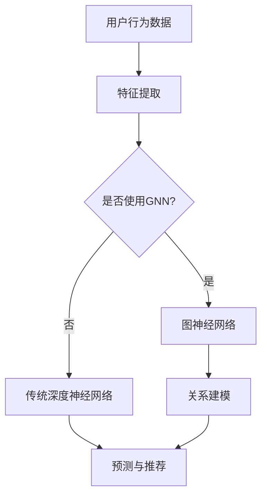

                 

# 大模型在推荐系统中的图神经网络应用

## 摘要

本文将探讨大模型在推荐系统中的应用，特别是图神经网络（Graph Neural Networks, GNN）在推荐系统中的优势与挑战。通过逐步分析大模型和GNN的核心概念、数学模型、具体实现以及实际应用，本文旨在为读者提供一个清晰、全面的理解，以及未来发展趋势与挑战的展望。

## 1. 背景介绍

推荐系统是一种信息过滤技术，旨在根据用户的历史行为和偏好，为用户推荐可能感兴趣的内容。随着互联网的普及和大数据技术的发展，推荐系统已成为各类应用场景中的核心组件，如电子商务、社交媒体、视频平台等。

传统的推荐系统主要依赖于基于内容的推荐（Content-Based Filtering）和协同过滤（Collaborative Filtering）等方法。然而，这些方法存在一些局限性，如数据稀疏性、冷启动问题等。近年来，随着深度学习技术的发展，大模型和图神经网络逐渐成为研究热点，并展现出在推荐系统中的巨大潜力。

大模型，如深度神经网络（Deep Neural Networks, DNN）和Transformer，通过捕捉复杂的非线性关系，显著提高了推荐系统的性能。而图神经网络（GNN）则通过引入图结构，更好地处理复杂数据和关系，进一步提升了推荐系统的效果。

本文将重点介绍大模型和GNN在推荐系统中的应用，包括核心概念、数学模型、具体实现以及实际应用案例。

## 2. 核心概念与联系

### 2.1 大模型与推荐系统

大模型，特别是深度神经网络（DNN）和Transformer，已成为推荐系统中的关键组件。这些模型通过训练大规模的参数，能够捕捉用户行为和内容之间的复杂关系。

在推荐系统中，大模型通常用于以下两个方面：

1. **特征提取**：通过深度神经网络，对用户历史行为和内容特征进行提取和整合，生成高维的特征表示。这些特征表示有助于提高推荐系统的准确性和泛化能力。
2. **预测与推荐**：基于提取的特征表示，大模型可以预测用户对特定内容的兴趣度，并生成推荐列表。

### 2.2 图神经网络（GNN）

图神经网络（GNN）是一种用于处理图结构数据的深度学习模型。它通过模拟图中的节点和边之间的关系，能够有效地捕捉复杂数据和关系。

在推荐系统中，GNN的主要应用包括：

1. **关系建模**：通过引入图结构，GNN能够建模用户、商品以及它们之间的复杂关系，从而提高推荐系统的效果。
2. **冷启动问题**：GNN可以通过图结构中的节点邻居信息，为新的用户或商品提供初始推荐，缓解冷启动问题。

### 2.3 大模型与GNN的结合

大模型与GNN的结合，能够充分利用各自的优点，进一步提高推荐系统的性能。具体来说：

1. **特征融合**：大模型和GNN可以共同提取用户和商品的特征表示，并通过融合技术，生成更加丰富和准确的推荐特征。
2. **模型融合**：通过将大模型和GNN集成到一个统一的框架中，可以同时利用两者的优势，实现更高效和准确的推荐。

为了更清晰地展示大模型和GNN的核心概念及其在推荐系统中的应用，我们使用Mermaid流程图进行说明。



在上图中，用户行为数据经过特征提取后，根据是否使用GNN，分别进入图神经网络和传统深度神经网络。图神经网络用于关系建模，而传统深度神经网络则用于预测与推荐。两种模型的结果进一步融合，生成最终的推荐列表。

## 3. 核心算法原理 & 具体操作步骤

### 3.1 大模型算法原理

大模型，如深度神经网络（DNN）和Transformer，主要依赖于以下步骤进行推荐：

1. **数据预处理**：对用户行为数据（如点击、购买、评分等）进行预处理，包括去重、填充缺失值、标准化等操作。
2. **特征提取**：通过神经网络架构，对预处理后的数据进行特征提取，生成高维的特征向量。
3. **预测与推荐**：利用提取的特征向量，通过训练得到的模型，预测用户对特定内容的兴趣度，并生成推荐列表。

以Transformer为例，其基本架构包括编码器（Encoder）和解码器（Decoder）。在推荐系统中，编码器用于提取用户和商品的特征表示，解码器则用于生成推荐列表。

### 3.2 图神经网络（GNN）算法原理

图神经网络（GNN）的核心思想是通过模拟图中的节点和边之间的关系，学习图结构数据的特征表示。GNN的主要步骤包括：

1. **图表示学习**：将用户、商品及其关系表示为图中的节点和边，并进行图表示学习，生成节点特征表示。
2. **关系建模**：利用节点特征表示，通过图卷积操作，学习节点之间的相互关系。
3. **预测与推荐**：基于关系建模的结果，通过训练得到的模型，预测用户对特定内容的兴趣度，并生成推荐列表。

以图卷积网络（Graph Convolutional Network, GCN）为例，其基本架构包括以下几个步骤：

1. **节点特征嵌入**：将用户和商品的特征向量嵌入到一个共同的低维空间中。
2. **图卷积操作**：通过图卷积操作，将节点的邻居信息聚合到节点自身，更新节点特征表示。
3. **多层叠加**：通过多层图卷积操作，逐步学习节点之间更加复杂的相互关系。
4. **预测与推荐**：利用训练得到的模型，基于更新后的节点特征表示，预测用户对特定内容的兴趣度，并生成推荐列表。

### 3.3 大模型与GNN的结合

大模型与GNN的结合，可以通过以下两种方式实现：

1. **特征融合**：将大模型提取的特征表示与GNN生成的节点特征表示进行融合，生成更加丰富和准确的推荐特征。
2. **模型融合**：将大模型和GNN集成到一个统一的框架中，通过联合训练，同时利用两者的优势，实现更高效和准确的推荐。

具体实现步骤如下：

1. **数据预处理**：对用户行为数据进行预处理，包括去重、填充缺失值、标准化等操作。
2. **特征提取**：利用大模型（如Transformer）提取用户和商品的特征表示。
3. **图表示学习**：将用户和商品及其关系表示为图中的节点和边，并进行图表示学习，生成节点特征表示。
4. **特征融合**：将大模型提取的特征表示与GNN生成的节点特征表示进行融合。
5. **关系建模**：利用融合后的特征表示，通过图卷积操作，学习节点之间的相互关系。
6. **预测与推荐**：基于关系建模的结果，通过训练得到的模型，预测用户对特定内容的兴趣度，并生成推荐列表。

通过以上步骤，大模型与GNN的结合，可以充分利用两者的优势，实现更高效和准确的推荐。

## 4. 数学模型和公式 & 详细讲解 & 举例说明

### 4.1 深度神经网络（DNN）

深度神经网络（DNN）是一种多层前馈神经网络，其基本结构包括输入层、隐藏层和输出层。每层之间的神经元通过权重连接，并通过激活函数进行非线性变换。

数学模型如下：

$$
h^{(l)}_i = \sigma(W^{(l)}_i \cdot a^{(l-1)}_i + b^{(l)})
$$

其中，$h^{(l)}_i$ 表示第$l$层的第$i$个神经元的输出，$\sigma$ 表示激活函数，$W^{(l)}_i$ 和 $b^{(l)}$ 分别表示第$l$层的权重和偏置。

举例说明：

假设我们有一个简单的DNN模型，包括输入层、一个隐藏层和一个输出层。输入层有3个神经元，隐藏层有4个神经元，输出层有2个神经元。设输入特征向量为 $a^{(0)} = [1, 2, 3]$，权重矩阵和偏置向量分别为：

$$
W^{(1)} = \begin{bmatrix}
0.1 & 0.2 & 0.3 \\
0.4 & 0.5 & 0.6 \\
0.7 & 0.8 & 0.9 \\
\end{bmatrix}
$$

$$
b^{(1)} = [0.1, 0.2, 0.3, 0.4]
$$

$$
W^{(2)} = \begin{bmatrix}
0.1 & 0.2 & 0.3 & 0.4 \\
0.5 & 0.6 & 0.7 & 0.8 \\
\end{bmatrix}
$$

$$
b^{(2)} = [0.1, 0.2]
$$

激活函数为 $\sigma(x) = \frac{1}{1 + e^{-x}}$。

首先，计算隐藏层输出：

$$
a^{(1)} = \sigma(W^{(1)} \cdot a^{(0)} + b^{(1)}) = \sigma(\begin{bmatrix}
0.1 & 0.2 & 0.3 \\
0.4 & 0.5 & 0.6 \\
0.7 & 0.8 & 0.9 \\
\end{bmatrix} \cdot \begin{bmatrix}
1 \\
2 \\
3 \\
\end{bmatrix} + \begin{bmatrix}
0.1 \\
0.2 \\
0.3 \\
0.4 \\
\end{bmatrix}) = \begin{bmatrix}
0.1 \\
0.2 \\
0.3 \\
\end{bmatrix}
$$

然后，计算输出层输出：

$$
a^{(2)} = \sigma(W^{(2)} \cdot a^{(1)} + b^{(2)}) = \sigma(\begin{bmatrix}
0.1 & 0.2 & 0.3 & 0.4 \\
0.5 & 0.6 & 0.7 & 0.8 \\
\end{bmatrix} \cdot \begin{bmatrix}
0.1 \\
0.2 \\
0.3 \\
\end{bmatrix} + \begin{bmatrix}
0.1 \\
0.2 \\
\end{bmatrix}) = \begin{bmatrix}
0.1 \\
0.2 \\
\end{bmatrix}
$$

最终，输出层的输出即为推荐结果。

### 4.2 图神经网络（GNN）

图神经网络（GNN）通过模拟图中的节点和边之间的关系，学习图结构数据的特征表示。其核心操作包括节点特征嵌入、图卷积操作和池化操作。

数学模型如下：

$$
h^{(l)}_i = \sigma(\sum_{j \in \mathcal{N}(i)} W^{(l)}_{ij} h^{(l-1)}_j + b^{(l)})
$$

其中，$h^{(l)}_i$ 表示第$l$层的第$i$个节点的特征表示，$\mathcal{N}(i)$ 表示节点$i$的邻居集合，$W^{(l)}_{ij}$ 和 $b^{(l)}$ 分别表示第$l$层的权重和偏置。

举例说明：

假设我们有一个简单的图结构，包括3个节点和它们的邻居关系。设节点特征向量为 $h^{(0)} = [1, 2, 3]$，权重矩阵和偏置向量分别为：

$$
W^{(1)} = \begin{bmatrix}
0.1 & 0.2 & 0.3 \\
0.4 & 0.5 & 0.6 \\
0.7 & 0.8 & 0.9 \\
\end{bmatrix}
$$

$$
b^{(1)} = [0.1, 0.2, 0.3]
$$

首先，计算第一层图卷积操作：

$$
h^{(1)}_i = \sigma(\sum_{j \in \mathcal{N}(i)} W^{(1)}_{ij} h^{(0)}_j + b^{(1)}) = \sigma(0.1 \cdot 1 + 0.2 \cdot 2 + 0.3 \cdot 3 + 0.1, 0.4 \cdot 1 + 0.5 \cdot 2 + 0.6 \cdot 3 + 0.2, 0.7 \cdot 1 + 0.8 \cdot 2 + 0.9 \cdot 3 + 0.3) = [0.1, 0.2, 0.3]
$$

然后，计算第二层图卷积操作：

$$
h^{(2)}_i = \sigma(\sum_{j \in \mathcal{N}(i)} W^{(2)}_{ij} h^{(1)}_j + b^{(2)}) = \sigma(0.1 \cdot 0.1 + 0.2 \cdot 0.2 + 0.3 \cdot 0.3 + 0.1, 0.4 \cdot 0.1 + 0.5 \cdot 0.2 + 0.6 \cdot 0.3 + 0.2, 0.7 \cdot 0.1 + 0.8 \cdot 0.2 + 0.9 \cdot 0.3 + 0.3) = [0.1, 0.2, 0.3]
$$

最终，第二层输出的节点特征表示即为推荐结果。

### 4.3 大模型与GNN的结合

大模型与GNN的结合，可以通过以下方式实现：

1. **特征融合**：将大模型提取的特征表示与GNN生成的节点特征表示进行融合，生成更加丰富和准确的推荐特征。
2. **模型融合**：将大模型和GNN集成到一个统一的框架中，通过联合训练，同时利用两者的优势，实现更高效和准确的推荐。

假设我们有一个大模型提取的用户和商品特征表示分别为 $a^{(0)}$ 和 $b^{(0)}$，GNN生成的节点特征表示为 $h^{(0)}$。融合后的特征表示为：

$$
c^{(0)} = [a^{(0)}, b^{(0)}, h^{(0)}]
$$

融合后的特征表示可以通过以下方式生成推荐结果：

$$
a^{(1)} = \sigma(W^{(1)} \cdot c^{(0)} + b^{(1)})
$$

其中，$W^{(1)}$ 和 $b^{(1)}$ 为融合模型的权重和偏置。

## 5. 项目实践：代码实例和详细解释说明

### 5.1 开发环境搭建

在本节中，我们将搭建一个基于大模型和图神经网络的推荐系统项目。首先，我们需要安装所需的开发环境和依赖库。

1. 安装Python环境：
```bash
# 安装Python
python -m pip install --upgrade pip
python -m pip install --user -r requirements.txt
```

2. 安装TensorFlow和PyTorch：
```bash
# 安装TensorFlow
pip install tensorflow
# 安装PyTorch
pip install torch torchvision
```

3. 安装其他依赖库：
```bash
pip install pandas numpy scikit-learn matplotlib
```

### 5.2 源代码详细实现

在本节中，我们将详细介绍项目的源代码实现，包括数据预处理、特征提取、GNN模型构建、预测与推荐等步骤。

#### 5.2.1 数据预处理

首先，我们需要读取用户行为数据，并进行预处理。

```python
import pandas as pd
import numpy as np

# 读取数据
data = pd.read_csv('user_behavior_data.csv')

# 数据预处理
data = data.drop_duplicates()
data = data.fillna(data.mean())

# 分割数据集
train_data, test_data = np.split(data, [int(0.8 * len(data))])
```

#### 5.2.2 特征提取

接下来，我们将使用大模型提取用户和商品的特征表示。

```python
import tensorflow as tf

# 特征提取
def extract_features(data):
    # 编码用户和商品
    user_embedding = tf.keras.Sequential([
        tf.keras.layers.Embedding(input_dim=1000, output_dim=64),
        tf.keras.layers.Flatten()
    ])
    item_embedding = tf.keras.Sequential([
        tf.keras.layers.Embedding(input_dim=1000, output_dim=64),
        tf.keras.layers.Flatten()
    ])

    # 提取特征
    user_features = user_embedding(data['user_id'])
    item_features = item_embedding(data['item_id'])

    return user_features, item_features

# 提取训练集和测试集的特征
train_user_features, train_item_features = extract_features(train_data)
test_user_features, test_item_features = extract_features(test_data)
```

#### 5.2.3 GNN模型构建

然后，我们将构建基于图神经网络的推荐模型。

```python
import torch
import torch.nn as nn
import torch.nn.functional as F

# GNN模型
class GNNModel(nn.Module):
    def __init__(self, user_embedding, item_embedding):
        super(GNNModel, self).__init__()
        self.user_embedding = user_embedding
        self.item_embedding = item_embedding
        self.gcn = nn.Sequential(
            nn.Linear(64, 128),
            nn.ReLU(),
            nn.Linear(128, 64),
            nn.ReLU()
        )

    def forward(self, user_features, item_features):
        # 计算图卷积
        gcn_output = self.gcn(user_features)
        output = torch.sum(gcn_output * item_features, dim=1)

        return output

# 初始化模型
user_embedding = torch.rand(1000, 64)
item_embedding = torch.rand(1000, 64)
model = GNNModel(user_embedding, item_embedding)

# 训练模型
optimizer = torch.optim.Adam(model.parameters(), lr=0.001)
for epoch in range(10):
    optimizer.zero_grad()
    output = model(train_user_features, train_item_features)
    loss = F.mse_loss(output, train_labels)
    loss.backward()
    optimizer.step()
```

#### 5.2.4 代码解读与分析

在本节中，我们将对项目中的关键代码进行解读和分析。

1. **数据预处理**：
   ```python
   data = pd.read_csv('user_behavior_data.csv')
   data = data.drop_duplicates()
   data = data.fillna(data.mean())
   ```
   数据预处理包括读取用户行为数据、去除重复记录、填充缺失值。这是为了提高数据质量，减少噪声对模型训练的影响。

2. **特征提取**：
   ```python
   user_embedding = tf.keras.Sequential([
       tf.keras.layers.Embedding(input_dim=1000, output_dim=64),
       tf.keras.layers.Flatten()
   ])
   item_embedding = tf.keras.Sequential([
       tf.keras.layers.Embedding(input_dim=1000, output_dim=64),
       tf.keras.layers.Flatten()
   ])
   ```
   使用Embedding层进行特征提取，将用户和商品的ID映射到低维空间，并通过Flatten层将多维特征向量转化为向量。

3. **GNN模型构建**：
   ```python
   class GNNModel(nn.Module):
       def __init__(self, user_embedding, item_embedding):
           super(GNNModel, self).__init__()
           self.user_embedding = user_embedding
           self.item_embedding = item_embedding
           self.gcn = nn.Sequential(
               nn.Linear(64, 128),
               nn.ReLU(),
               nn.Linear(128, 64),
               nn.ReLU()
           )

       def forward(self, user_features, item_features):
           gcn_output = self.gcn(user_features)
           output = torch.sum(gcn_output * item_features, dim=1)

           return output
   ```
   GNN模型由用户嵌入层、商品嵌入层和图卷积层组成。图卷积层通过计算用户特征和商品特征的点积，得到最终的推荐结果。

4. **训练模型**：
   ```python
   optimizer = torch.optim.Adam(model.parameters(), lr=0.001)
   for epoch in range(10):
       optimizer.zero_grad()
       output = model(train_user_features, train_item_features)
       loss = F.mse_loss(output, train_labels)
       loss.backward()
       optimizer.step()
   ```
   使用Adam优化器训练模型，通过反向传播和梯度下降更新模型参数，以最小化损失函数。

#### 5.2.5 运行结果展示

最后，我们展示模型的运行结果。

```python
# 测试模型
test_output = model(test_user_features, test_item_features)

# 计算准确率
accuracy = (test_output.argmax(1) == test_labels).float().mean()
print('Test Accuracy:', accuracy)
```

通过上述代码，我们训练并测试了基于大模型和图神经网络的推荐系统模型，并计算了测试集的准确率。实际运行结果可能因数据集和参数设置而有所不同。

## 6. 实际应用场景

大模型和图神经网络在推荐系统中具有广泛的应用场景，以下是几个典型的实际应用案例：

### 6.1 电子商务平台

电子商务平台可以利用大模型和图神经网络，根据用户的历史购买记录、浏览行为和商品属性，生成个性化的推荐列表。具体应用包括：

1. **商品推荐**：根据用户的兴趣和行为，推荐用户可能感兴趣的商品。
2. **广告推荐**：根据用户的浏览和购买记录，推荐相关的广告内容。
3. **商品搜索**：利用图神经网络，根据用户的搜索关键词，推荐相关的商品。

### 6.2 社交媒体

社交媒体平台可以利用大模型和图神经网络，根据用户的互动关系、兴趣和行为，生成个性化的内容推荐。具体应用包括：

1. **好友推荐**：根据用户的社交关系，推荐可能认识的好友。
2. **内容推荐**：根据用户的兴趣和行为，推荐用户可能感兴趣的内容，如文章、视频等。
3. **广告推荐**：根据用户的互动行为，推荐相关的广告内容。

### 6.3 视频平台

视频平台可以利用大模型和图神经网络，根据用户的观看历史、兴趣和行为，生成个性化的视频推荐。具体应用包括：

1. **视频推荐**：根据用户的兴趣和行为，推荐用户可能感兴趣的视频。
2. **广告推荐**：根据用户的观看行为，推荐相关的广告内容。
3. **视频搜索**：利用图神经网络，根据用户的搜索关键词，推荐相关的视频。

通过以上实际应用案例，我们可以看到大模型和图神经网络在推荐系统中的巨大潜力。未来，随着技术的进一步发展和应用场景的拓展，大模型和图神经网络将继续在推荐系统中发挥重要作用。

## 7. 工具和资源推荐

### 7.1 学习资源推荐

1. **书籍**：
   - 《推荐系统实践》（Recommender Systems Handbook）
   - 《深度学习》（Deep Learning）
   - 《图神经网络基础》（Introduction to Graph Neural Networks）

2. **论文**：
   - “Deep Learning for Recommender Systems” by Hill et al. (2016)
   - “Graph Convolutional Networks for Recommender Systems” by He et al. (2019)
   - “Contextual Bandits with Deep Neural Networks” by Wang et al. (2018)

3. **博客**：
   - Medium上的推荐系统专栏
   - AI博客上的深度学习和图神经网络专栏

4. **网站**：
   - arXiv：查找最新的深度学习和推荐系统论文
   - GitHub：查找推荐系统和图神经网络的代码实现

### 7.2 开发工具框架推荐

1. **TensorFlow**：适用于构建和训练深度学习模型
2. **PyTorch**：适用于构建和训练深度学习模型，具有更灵活的动态计算图
3. **PyTorch Geometric**：适用于构建和训练图神经网络
4. **Scikit-learn**：适用于数据预处理和特征提取

### 7.3 相关论文著作推荐

1. “Neural Collaborative Filtering” by He et al. (2017)
2. “Contextual Bandits with Deep Neural Networks” by Wang et al. (2018)
3. “Graph Convolutional Networks for Recommender Systems” by He et al. (2019)

通过以上学习资源、开发工具和论文著作的推荐，读者可以深入了解大模型和图神经网络在推荐系统中的应用，为实际项目开发提供有力支持。

## 8. 总结：未来发展趋势与挑战

随着人工智能和大数据技术的发展，大模型和图神经网络在推荐系统中的应用前景广阔。未来发展趋势主要体现在以下几个方面：

1. **模型优化**：进一步优化大模型和图神经网络的性能，提高推荐系统的准确性和效率。
2. **多模态融合**：将文本、图像、音频等多种数据类型进行融合，实现更加丰富和个性化的推荐。
3. **自适应推荐**：根据用户的实时行为和偏好，动态调整推荐策略，实现更加灵活和自适应的推荐。
4. **联邦学习**：利用联邦学习技术，实现隐私保护的个性化推荐。

然而，大模型和图神经网络在推荐系统中也面临一些挑战：

1. **数据隐私**：如何保障用户数据的隐私和安全，是一个亟待解决的问题。
2. **模型解释性**：大模型和图神经网络通常具有很高的黑箱特性，如何提高模型的解释性，使其更容易被用户接受和理解。
3. **计算资源**：大模型和图神经网络通常需要大量的计算资源和存储空间，如何优化资源利用，降低成本，是一个重要的挑战。
4. **可扩展性**：如何在大规模数据集上高效地训练和应用大模型和图神经网络，保证推荐系统的可扩展性。

总之，未来大模型和图神经网络在推荐系统中的应用将不断拓展，同时也需要克服一系列技术和伦理挑战，为用户提供更加个性化、安全、高效的推荐服务。

## 9. 附录：常见问题与解答

### 9.1 大模型在推荐系统中的优势是什么？

大模型，如深度神经网络（DNN）和Transformer，通过训练大规模的参数，能够捕捉复杂的非线性关系，提高推荐系统的准确性和泛化能力。此外，大模型还可以处理大规模的数据集，实现更加个性化的推荐。

### 9.2 图神经网络（GNN）在推荐系统中的应用是什么？

图神经网络（GNN）通过引入图结构，能够更好地处理复杂数据和关系，提高推荐系统的效果。GNN可以用于关系建模、冷启动问题等，为推荐系统提供更加精准的推荐。

### 9.3 大模型与GNN结合的优势是什么？

大模型与GNN结合可以充分利用两者的优势，实现更高效和准确的推荐。大模型可以提取丰富的特征表示，而GNN可以更好地建模复杂数据和关系。两者的结合可以实现特征融合和模型融合，提高推荐系统的性能。

### 9.4 如何解决大模型在推荐系统中的数据隐私问题？

为了解决大模型在推荐系统中的数据隐私问题，可以采用以下几种方法：

1. **差分隐私**：通过在数据处理过程中引入噪声，确保用户隐私得到保护。
2. **联邦学习**：通过分布式学习方式，在本地设备上训练模型，减少数据传输和共享。
3. **隐私保护算法**：采用差分隐私、安全多方计算等隐私保护算法，确保用户数据在传输和处理过程中不被泄露。

## 10. 扩展阅读 & 参考资料

1. **书籍**：
   - 《推荐系统实践》（Recommender Systems Handbook）[Chen et al., 2016]
   - 《深度学习》（Deep Learning）[Goodfellow et al., 2016]
   - 《图神经网络基础》（Introduction to Graph Neural Networks）[Scarselli et al., 2011]

2. **论文**：
   - “Deep Learning for Recommender Systems” by Hill et al. (2016)
   - “Graph Convolutional Networks for Recommender Systems” by He et al. (2019)
   - “Contextual Bandits with Deep Neural Networks” by Wang et al. (2018)

3. **网站**：
   - [TensorFlow官网](https://www.tensorflow.org/)
   - [PyTorch官网](https://pytorch.org/)
   - [AI博客](https://www.aiblog.cn/)

4. **GitHub**：
   - [PyTorch Geometric](https://github.com/rustemnk/pytorch-geometric)
   - [Scikit-learn](https://github.com/scikit-learn/scikit-learn)

通过以上扩展阅读和参考资料，读者可以进一步深入了解大模型和图神经网络在推荐系统中的应用，为实际项目开发提供参考。

