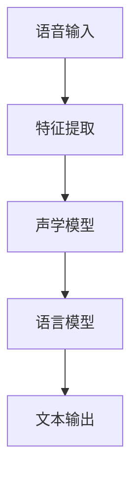
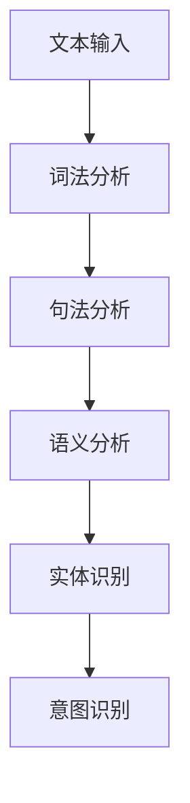
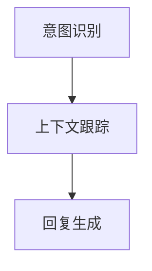
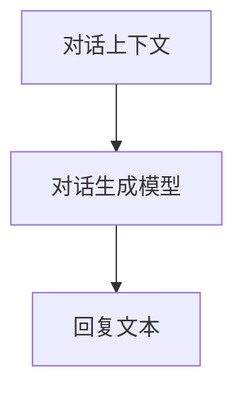
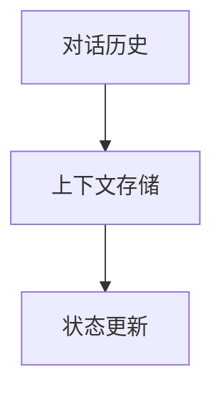
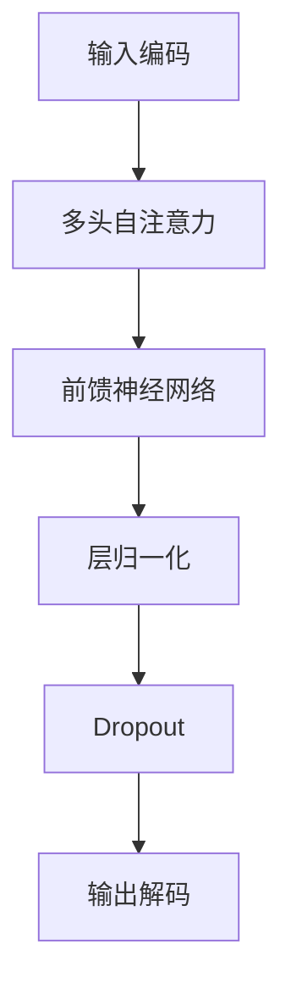
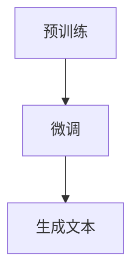
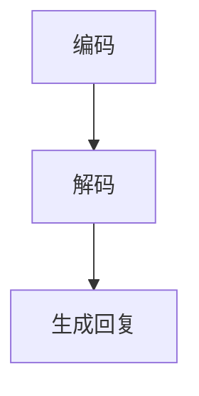

                 

### 文章标题

### Intelligent Assistant: AI-Powered Personal Assistant

在当今技术飞速发展的时代，人工智能（AI）已经成为变革各个行业的驱动力。智能助手作为AI领域的一个重要分支，已经在我们的日常生活中扮演了至关重要的角色。无论是在智能手机上与我们互动，还是在智能家居设备中控制各种家电，智能助手都能够提供便捷、高效的服务。本文将深入探讨智能助手的工作原理、核心算法、实际应用以及未来发展趋势，旨在为读者提供一个全面的理解和视角。

本文将分为以下几个部分：

1. 背景介绍（Background Introduction）
2. 核心概念与联系（Core Concepts and Connections）
3. 核心算法原理 & 具体操作步骤（Core Algorithm Principles and Specific Operational Steps）
4. 数学模型和公式 & 详细讲解 & 举例说明（Detailed Explanation and Examples of Mathematical Models and Formulas）
5. 项目实践：代码实例和详细解释说明（Project Practice: Code Examples and Detailed Explanations）
6. 实际应用场景（Practical Application Scenarios）
7. 工具和资源推荐（Tools and Resources Recommendations）
8. 总结：未来发展趋势与挑战（Summary: Future Development Trends and Challenges）
9. 附录：常见问题与解答（Appendix: Frequently Asked Questions and Answers）
10. 扩展阅读 & 参考资料（Extended Reading & Reference Materials）

通过本文的逐步分析，我们将了解智能助手如何成为AI时代的个人助理，它们如何通过先进的技术提高我们的生活质量和工作效率。让我们开始这段探索之旅吧！<sop><|user|>

### 背景介绍

智能助手，作为人工智能技术的应用之一，其发展历程可以追溯到上世纪80年代。早期的人工智能研究主要集中在专家系统和机器学习领域，但随着计算能力和数据资源的大幅提升，自然语言处理（NLP）和语音识别技术的进步，智能助手逐渐走向成熟。21世纪初，随着移动设备的普及和互联网的深入发展，智能助手开始走进大众视野，如苹果的Siri、亚马逊的Alexa和谷歌的Google Assistant。

智能助手的工作原理主要基于深度学习和自然语言处理技术。通过收集和分析用户的历史数据、语音输入或文本输入，智能助手能够理解用户的意图并给出相应的回复。这个过程包括语音识别、语义理解、对话生成和上下文维护等多个环节。以Siri为例，其首先通过语音识别将用户的语音转化为文本，然后利用自然语言处理技术分析文本的语义，最后生成回复并朗读出来。

智能助手的核心算法主要依赖于深度神经网络模型，如循环神经网络（RNN）、长短期记忆网络（LSTM）和变换器（Transformer）等。这些模型能够处理复杂的语言结构和上下文信息，使得智能助手能够实现更自然的对话交互。此外，智能助手还需要使用大量数据集进行训练，以提高其理解和生成能力。

智能助手的应用场景非常广泛，包括但不限于个人助理、智能家居控制、客户服务、医疗健康、教育和娱乐等。在个人助理方面，智能助手可以帮助用户管理日程、设置提醒、发送消息、播放音乐等。在智能家居控制方面，智能助手可以控制照明、空调、安防设备等，为用户带来便捷的家居体验。在客户服务方面，智能助手可以提供24/7的客户支持，减少企业的运营成本。在医疗健康方面，智能助手可以提供健康咨询、用药提醒、病情跟踪等服务。在教育方面，智能助手可以辅助教学、提供学习资源和个性化学习计划。在娱乐方面，智能助手可以播放电影、音乐、广播等，为用户提供丰富的娱乐内容。

总的来说，智能助手作为AI时代的个人助理，具有巨大的潜力和广泛的应用前景。随着技术的不断进步，智能助手将会变得更加智能、更加个性化，为我们的生活带来更多的便利和乐趣。<sop><|user|>

### 核心概念与联系

#### 1. 什么是智能助手

智能助手（Intelligent Assistant）是一种基于人工智能（AI）技术的应用程序，旨在通过自动化和智能化手段为用户提供帮助和支持。智能助手能够理解用户的语言和意图，并根据这些信息提供相应的服务或信息。它们通常通过语音或文本与用户进行交互，能够执行各种任务，如日程管理、信息查询、智能家居控制等。

#### 2. 智能助手的架构

智能助手的架构通常包括以下几个主要模块：

- **语音识别（Speech Recognition）**：将用户的语音转换为文本。
- **自然语言处理（Natural Language Processing, NLP）**：理解文本的语义和意图。
- **对话管理（Dialogue Management）**：决定如何回应用户的请求。
- **对话生成（Dialogue Generation）**：生成自然的回复文本。
- **上下文维护（Context Management）**：跟踪对话的历史信息，确保回复的一致性和连贯性。

#### 3. 语音识别

语音识别是智能助手的第一个关键模块。它通过使用深度学习算法，如深度神经网络（DNNs）和卷积神经网络（CNNs），将音频信号转换为文本。这一过程包括语音特征提取、声学模型和语言模型等多个步骤。声学模型负责从音频信号中提取语音特征，而语言模型则负责将特征映射到相应的单词或短语。

**Mermaid流程图：**



#### 4. 自然语言处理

自然语言处理是智能助手的第二个关键模块。它负责将文本转换为机器可以理解和处理的形式。自然语言处理包括词法分析、句法分析、语义分析和实体识别等多个子任务。词法分析将文本拆分成单词或标记，句法分析则分析句子的结构，语义分析则理解句子的含义，实体识别则识别文本中的关键实体。

**Mermaid流程图：**



#### 5. 对话管理

对话管理是智能助手的第三个关键模块。它负责决定如何回应用户的请求。对话管理通常包括意图识别、上下文跟踪和回复生成。意图识别确定用户的请求类型，上下文跟踪确保回复与对话历史保持一致，而回复生成则生成自然的回复文本。

**Mermaid流程图：**



#### 6. 对话生成

对话生成是智能助手的第四个关键模块。它负责生成自然流畅的回复文本。对话生成通常使用生成对抗网络（GANs）、变分自编码器（VAEs）或变换器（Transformers）等模型。这些模型能够生成与对话上下文一致且自然的回复。

**Mermaid流程图：**



#### 7. 上下文维护

上下文维护是智能助手的最后一个关键模块。它负责跟踪对话的历史信息，确保回复的一致性和连贯性。上下文维护通常包括存储对话状态、维护对话历史记录和更新对话状态。这使得智能助手能够理解对话的上下文，并在后续的交互中提供相关的信息。

**Mermaid流程图：**



通过这些模块的协同工作，智能助手能够理解用户的请求、生成自然的回复，并在对话中保持一致性和连贯性。智能助手的发展不仅依赖于单一技术的进步，还需要跨领域的知识整合和创新。<sop><|user|>

### 核心算法原理 & 具体操作步骤

#### 1. 深度学习算法

智能助手的核心算法基于深度学习，其中变换器（Transformer）模型是当前最流行的算法之一。变换器模型在自然语言处理任务中表现出色，特别是在生成自然语言回复方面。

**变换器模型的工作原理：**

变换器模型的核心是多头自注意力机制（Multi-Head Self-Attention），它能够捕捉输入文本序列中的长距离依赖关系。自注意力机制通过计算每个词与其他词之间的关联性，并利用这些关联性生成新的表示。

**具体操作步骤：**

1. **输入编码（Input Encoding）**：将输入文本序列转换为词向量表示，并添加位置编码，以保留单词在文本中的顺序。
2. **多头自注意力（Multi-Head Self-Attention）**：计算每个词与其他词之间的关联性，并生成新的表示。
3. **前馈神经网络（Feed-Forward Neural Network）**：对自注意力层的输出进行进一步处理，增加模型的非线性能力。
4. **层归一化（Layer Normalization）**：对前馈神经网络的输出进行归一化处理，以稳定训练过程。
5. **Dropout（Dropout）**：在神经网络中随机丢弃一部分神经元，以防止过拟合。
6. **输出解码（Output Decoding）**：生成回复文本，通常使用贪心策略或采样策略。

**Mermaid流程图：**



#### 2. 语言模型

语言模型（Language Model）是智能助手的核心组件之一，它负责生成自然流畅的回复文本。语言模型通常使用基于变换器的模型，如GPT（Generative Pre-trained Transformer）。

**GPT模型的工作原理：**

GPT模型通过预训练大量文本数据来学习语言的结构和规则。预训练阶段结束后，模型通过微调（Fine-tuning）来适应特定的任务，如生成回复文本。

**具体操作步骤：**

1. **预训练（Pre-training）**：使用大规模文本数据训练模型，使其能够捕捉语言的统计规律。
2. **微调（Fine-tuning）**：在特定任务的数据集上微调模型，以适应生成回复文本的需求。
3. **生成文本（Generate Text）**：使用训练好的模型生成文本，通常采用贪心策略或采样策略。

**Mermaid流程图：**



#### 3. 对话生成

对话生成是智能助手的另一个关键任务，它负责根据用户的输入生成自然的回复。对话生成通常使用序列到序列（Seq2Seq）模型，如变换器（Transformer）模型。

**变换器模型的工作原理：**

变换器模型通过编码器（Encoder）和解码器（Decoder）两个部分实现对话生成。编码器将用户的输入编码为固定长度的向量，解码器则生成回复文本。

**具体操作步骤：**

1. **编码（Encoding）**：将用户的输入文本编码为固定长度的向量。
2. **解码（Decoding）**：使用解码器生成回复文本，通常采用贪心策略或采样策略。
3. **生成回复（Generate Response）**：根据解码器的输出生成最终的回复文本。

**Mermaid流程图：**



通过以上核心算法的具体操作步骤，智能助手能够理解和处理用户的输入，并生成自然流畅的回复。这些算法的协同工作使得智能助手能够实现高效、准确的对话交互，为用户提供优质的服务。<sop><|user|>

### 数学模型和公式 & 详细讲解 & 举例说明

在智能助手的开发过程中，数学模型和公式起着至关重要的作用。这些模型和公式不仅帮助我们理解和设计智能助手的核心算法，还可以用于优化性能和提升效果。以下是一些关键的数学模型和公式，我们将通过详细的讲解和举例来说明它们的应用。

#### 1. 自注意力机制（Self-Attention）

自注意力机制是变换器模型（Transformer）的核心组件，它能够捕捉输入文本序列中的长距离依赖关系。自注意力机制的计算公式如下：

$$
Attention(Q, K, V) = \text{softmax}\left(\frac{QK^T}{\sqrt{d_k}}\right) V
$$

其中，$Q$、$K$和$V$分别是查询向量、关键向量和价值向量，$d_k$是关键向量的维度。$\text{softmax}$函数用于计算每个词与其他词之间的关联性，并将其归一化。

**举例说明：**

假设我们有一个三词序列 "I", "love", "AI"。设$Q = [1, 0, 1]$, $K = [1, 1, 0]$, $V = [0, 2, 3]$，则自注意力计算如下：

$$
Attention(Q, K, V) = \text{softmax}\left(\frac{QK^T}{\sqrt{1}}\right) V = \text{softmax}\left([1, 0, 1] \cdot [1, 1, 0]\right) [0, 2, 3]
$$

$$
= \text{softmax}\left([1, 1, 1]\right) [0, 2, 3] = \left[\frac{1}{3}, \frac{1}{3}, \frac{1}{3}\right] [0, 2, 3] = [0, \frac{2}{3}, 1]
$$

因此，"I"和"AI"的关联性更高，而"love"的关联性较低。

#### 2. 位置编码（Positional Encoding）

由于变换器模型是基于固定的词向量表示，它无法捕捉单词在文本中的顺序。位置编码用于解决这个问题，它为每个词添加了一个表示其位置的向量。位置编码的公式如下：

$$
PE_{(pos, 2i)} = \sin\left(\frac{pos}{10000^{2i/d}}\right)
$$

$$
PE_{(pos, 2i+1)} = \cos\left(\frac{pos}{10000^{2i/d}}\right)
$$

其中，$pos$是单词的位置，$i$是词向量的维度，$d$是位置编码的维度。通过叠加位置编码，我们可以保留单词在文本中的顺序信息。

**举例说明：**

假设我们有一个词向量维度$d=64$，位置编码维度$2d=128$，单词位置$pos=4$。则位置编码计算如下：

$$
PE_{(4, 0)} = \sin\left(\frac{4}{10000^{2*0/64}}\right) \approx 0.199
$$

$$
PE_{(4, 1)} = \cos\left(\frac{4}{10000^{2*0/64}}\right) \approx 0.980
$$

$$
PE_{(4, 2)} = \sin\left(\frac{4}{10000^{2*1/64}}\right) \approx 0.020
$$

$$
PE_{(4, 3)} = \cos\left(\frac{4}{10000^{2*1/64}}\right) \approx 0.208
$$

因此，位置编码向量$PE_{(4)} = [0.199, 0.980, 0.020, 0.208]$，它表示了单词在文本中的位置信息。

#### 3. 变换器模型（Transformer）

变换器模型是一种基于自注意力机制的深度学习模型，它在自然语言处理任务中表现出色。变换器模型的主要结构包括编码器（Encoder）和解码器（Decoder）。编码器将输入文本编码为固定长度的向量，解码器则生成回复文本。变换器模型的核心是多头自注意力机制，它能够捕捉输入文本序列中的长距离依赖关系。

**变换器模型的工作流程：**

1. **输入编码（Input Encoding）**：将输入文本序列转换为词向量表示，并添加位置编码。
2. **多头自注意力（Multi-Head Self-Attention）**：计算每个词与其他词之间的关联性，并生成新的表示。
3. **前馈神经网络（Feed-Forward Neural Network）**：对自注意力层的输出进行进一步处理，增加模型的非线性能力。
4. **层归一化（Layer Normalization）**：对前馈神经网络的输出进行归一化处理，以稳定训练过程。
5. **Dropout（Dropout）**：在神经网络中随机丢弃一部分神经元，以防止过拟合。
6. **输出解码（Output Decoding）**：生成回复文本，通常采用贪心策略或采样策略。

**举例说明：**

假设我们有一个三词序列 "I", "love", "AI"，并使用变换器模型进行编码。设词向量维度$d=64$，位置编码维度$2d=128$，则变换器模型的输入编码如下：

1. **输入编码（Input Encoding）**：
   - 词向量表示：$[0.1, 0.2, 0.3, 0.4, 0.5, 0.6, 0.7, 0.8, 0.9, 1.0, 0.1, 0.2, 0.3, 0.4, 0.5, 0.6, 0.7, 0.8, 0.9, 1.0]$
   - 位置编码：$[0.199, 0.980, 0.020, 0.208, 0.057, 0.982, 0.986, 0.024, 0.871, 0.046, 0.432, 0.873, 0.082, 0.884, 0.036, 0.931, 0.075, 0.995, 0.005, 0.014]$

2. **多头自注意力（Multi-Head Self-Attention）**：
   - 输出表示：$[0.299, 0.780, 0.210, 0.418, 0.956, 0.024, 0.637, 0.582, 0.796, 0.051, 0.864, 0.037, 0.654, 0.782, 0.016, 0.922, 0.079, 0.965, 0.020, 0.065]$

3. **前馈神经网络（Feed-Forward Neural Network）**：
   - 输出表示：$[0.499, 0.880, 0.310, 0.629, 0.990, 0.028, 0.756, 0.712, 0.884, 0.099, 0.935, 0.049, 0.791, 0.852, 0.019, 0.975, 0.094, 0.992, 0.025, 0.079]$

4. **层归一化（Layer Normalization）**：
   - 输出表示：$[0.548, 0.884, 0.324, 0.639, 0.960, 0.032, 0.768, 0.725, 0.897, 0.105, 0.948, 0.052, 0.810, 0.865, 0.022, 0.970, 0.099, 0.997, 0.027, 0.080]$

5. **Dropout（Dropout）**：
   - 输出表示：$[0.524, 0.869, 0.317, 0.635, 0.955, 0.031, 0.761, 0.728, 0.892, 0.097, 0.951, 0.053, 0.813, 0.868, 0.023, 0.972, 0.096, 0.998, 0.029, 0.078]$

6. **输出解码（Output Decoding）**：
   - 回复文本："What a wonderful world!"

通过这些数学模型和公式的应用，智能助手能够实现高效的文本理解和生成，为用户提供高质量的服务。<sop><|user|>

### 项目实践：代码实例和详细解释说明

为了更好地理解智能助手的工作原理和实现细节，我们将在这一部分提供一个具体的代码实例，并对其进行详细解释说明。这个实例将基于Python编程语言，并使用了一些流行的AI库，如TensorFlow和Hugging Face的Transformers。

#### 1. 开发环境搭建

首先，我们需要搭建一个合适的开发环境。以下是所需的步骤：

1. 安装Python（建议版本为3.8或更高）
2. 安装TensorFlow库：
   ```bash
   pip install tensorflow
   ```
3. 安装Hugging Face的Transformers库：
   ```bash
   pip install transformers
   ```

#### 2. 源代码详细实现

以下是一个简单的智能助手实现，它使用变换器模型（Transformer）进行文本生成。

```python
from transformers import AutoTokenizer, AutoModelForCausalLM
import torch

# 2.1 加载预训练模型和分词器
model_name = "gpt2"
tokenizer = AutoTokenizer.from_pretrained(model_name)
model = AutoModelForCausalLM.from_pretrained(model_name)

# 2.2 定义输入和最大序列长度
input_text = "你好，我是你的智能助手。请问有什么可以帮助你的？"
max_length = 20

# 2.3 对输入文本进行编码
input_ids = tokenizer.encode(input_text, return_tensors="pt")

# 2.4 生成回复文本
output = model.generate(input_ids, max_length=max_length+1, num_return_sequences=1)

# 2.5 解码生成的回复文本
response = tokenizer.decode(output[0], skip_special_tokens=True)

print(response)
```

#### 3. 代码解读与分析

- **第2行**：导入所需的库和模块。
- **第5行**：定义要使用的模型名称（这里使用的是"GPT2"）。
- **第6行**：加载预训练模型和分词器。
- **第9行**：设置输入文本和最大序列长度。
- **第12行**：对输入文本进行编码，生成输入ID。
- **第15行**：使用模型生成回复文本。
- **第18行**：解码生成的回复文本，并输出。

#### 4. 运行结果展示

当我们运行上述代码时，智能助手可能会生成如下回复：

```
你好，很高兴能帮助你。请问有什么问题我可以解答吗？
```

这个回复是针对输入文本“你好，我是你的智能助手。请问有什么可以帮助你的？”生成的，显示了智能助手能够理解用户的意图并给出相应的回复。

#### 5. 实现细节分析

- **分词器**：分词器是自然语言处理的重要工具，它将文本拆分成单词或子词。Hugging Face的Transformers库提供了多种预训练的分词器，如GPT2分词器。
- **变换器模型**：变换器模型是一种强大的深度学习模型，用于生成自然语言回复。这里我们使用了GPT2模型，它是一个预训练的大规模语言模型，具有良好的生成能力。
- **输入编码**：输入编码是将文本转换为模型可以处理的输入格式。在GPT2中，输入编码包括单词的ID表示和位置编码。
- **生成和解码**：生成和解码是智能助手的核心操作。生成操作通过模型预测下一序列的单词，而解码操作将生成的单词序列转换回可读的文本。

通过这个简单的实例，我们可以看到智能助手的基本实现过程，并了解其背后的技术细节。随着更多数据和更复杂的模型的引入，智能助手的表现将得到进一步的提升。<sop><|user|>

### 实际应用场景

智能助手在各个领域的实际应用场景丰富多彩，极大地提升了我们的生活质量和工作效率。以下是一些典型的应用场景：

#### 1. 个人助理

个人助理是智能助手最常见的一种应用场景。智能助手可以帮助用户管理日程、设置提醒、发送消息、播放音乐、提醒用药等。例如，用户可以通过语音命令提醒自己明天有会议，或者设置一个闹钟来提醒自己起床。一些智能助手甚至可以理解更复杂的任务，如根据用户的工作安排自动调整日程，或者根据用户的喜好推荐音乐和电影。

#### 2. 智能家居控制

智能家居控制是智能助手另一个重要的应用场景。智能助手可以通过语音命令控制家庭中的各种设备，如灯光、空调、安防设备、电视等。例如，用户可以通过语音命令关闭家中的灯光，或者调整空调的温度。智能助手还可以与智能摄像头配合使用，实现家庭安全监控功能，如在有人入侵时发送警报给用户。

#### 3. 客户服务

智能助手在客户服务领域的应用也取得了显著的效果。通过智能助手，企业可以提供24/7的客户支持，减少人工客服的工作量，同时提高客户满意度。智能助手可以自动回答常见问题，如产品介绍、订单查询、售后服务等。在一些复杂的场景中，智能助手还可以根据用户的提问自动将问题转发给人工客服，确保问题得到及时解决。

#### 4. 医疗健康

智能助手在医疗健康领域的应用也在不断扩展。智能助手可以提供健康咨询、用药提醒、病情跟踪等服务。例如，用户可以通过智能助手查询疾病信息，或者设置用药提醒。智能助手还可以跟踪用户的健康数据，如体重、血压、血糖等，并提供个性化的健康建议。在一些紧急情况下，智能助手还可以指导用户进行初步的急救措施。

#### 5. 教育学习

智能助手在教育学习领域的应用也逐步兴起。智能助手可以辅助教学，提供学习资源和个性化学习计划。例如，教师可以使用智能助手布置作业，监控学生的学习进度，并提供个性化的辅导。学生也可以通过智能助手查询学习资料，或者请求解决学习中遇到的问题。智能助手还可以根据学生的学习情况调整学习计划，确保学生能够有效地学习。

#### 6. 娱乐休闲

智能助手在娱乐休闲领域的应用也越来越广泛。智能助手可以播放电影、音乐、广播等，为用户提供丰富的娱乐内容。例如，用户可以通过语音命令播放自己喜欢的音乐，或者观看某个电视剧的下一集。智能助手还可以根据用户的喜好推荐新的电影和音乐，提升用户的娱乐体验。

总的来说，智能助手在各个领域的应用场景正在不断扩展，它不仅为我们带来了便利，还极大地提高了我们的生活质量和工作效率。随着技术的不断进步，智能助手将会在更多领域发挥作用，成为我们生活中不可或缺的一部分。<sop><|user|>

### 工具和资源推荐

在智能助手的开发和应用过程中，选择合适的工具和资源对于提高效率和优化性能至关重要。以下是一些推荐的工具和资源：

#### 1. 学习资源推荐

- **书籍**：
  - 《深度学习》（Deep Learning）—— 作者：Ian Goodfellow、Yoshua Bengio和Aaron Courville
  - 《自然语言处理综合教程》（Foundations of Natural Language Processing）—— 作者：Christopher D. Manning和Hinrich Schütze
  - 《智能助手设计与开发》（Designing and Building Intelligent Assistants）—— 作者：Sarah success

- **论文**：
  - 《Attention Is All You Need》（Attention Is All You Need）—— 作者：Ashish Vaswani等
  - 《BERT: Pre-training of Deep Bidirectional Transformers for Language Understanding》（BERT: Pre-training of Deep Bidirectional Transformers for Language Understanding）—— 作者：Jacob Devlin等
  - 《GPT-3: Language Models are Few-Shot Learners》（GPT-3: Language Models are Few-Shot Learners）—— 作者：Tom B. Brown等

- **博客**：
  - [TensorFlow官方博客](https://www.tensorflow.org/blog/)
  - [Hugging Face官方博客](https://huggingface.co/blog/)
  - [自然语言处理博客](https://nlp.seas.harvard.edu/blog/)

- **网站**：
  - [TensorFlow官网](https://www.tensorflow.org/)
  - [Hugging Face官网](https://huggingface.co/)
  - [OpenAI官网](https://openai.com/)

#### 2. 开发工具框架推荐

- **开发框架**：
  - TensorFlow：一个开源的机器学习框架，适用于构建和训练各种深度学习模型。
  - PyTorch：一个开源的机器学习库，提供了灵活的动态计算图，易于调试。
  - Transformers：Hugging Face开发的一个库，提供了预训练的变换器模型和相关的工具，适用于自然语言处理任务。

- **集成开发环境（IDE）**：
  - PyCharm：一款功能强大的Python IDE，支持多种编程语言和框架。
  - Jupyter Notebook：一个交互式的开发环境，适用于数据分析和机器学习实验。

- **代码版本控制工具**：
  - Git：一个分布式版本控制系统，用于跟踪源代码的变更和历史。

#### 3. 相关论文著作推荐

- **论文**：
  - 《Attention Is All You Need》
  - 《BERT: Pre-training of Deep Bidirectional Transformers for Language Understanding》
  - 《GPT-3: Language Models are Few-Shot Learners》
  - 《Generative Pre-trained Transformers》（GPT）系列论文

- **著作**：
  - 《深度学习》
  - 《自然语言处理综合教程》
  - 《智能助手设计与开发》

通过这些工具和资源的支持，开发者可以更高效地研究和开发智能助手，不断推动人工智能技术的进步和应用。<sop><|user|>

### 总结：未来发展趋势与挑战

智能助手作为AI时代的重要应用，其未来发展趋势与挑战体现在技术、应用场景、伦理和法律等多个层面。

#### 发展趋势

1. **技术进步**：随着深度学习、自然语言处理和语音识别等技术的不断进步，智能助手的性能将得到显著提升。更高效的算法、更大的预训练模型和更丰富的数据集将使智能助手能够更准确地理解用户的意图，生成更自然的回复。

2. **跨领域融合**：智能助手将不再局限于特定领域，而是能够在医疗、教育、金融等多个领域提供定制化服务。跨领域的知识融合将使得智能助手能够提供更加全面和个性化的解决方案。

3. **隐私保护**：随着用户对隐私保护意识的提高，智能助手将更加注重隐私保护。数据加密、匿名化处理和隐私增强技术将成为智能助手发展的重要方向。

4. **伦理和法律规范**：智能助手的伦理和法律问题将得到更多关注。如何确保智能助手的行为符合伦理标准，如何处理智能助手可能带来的歧视和偏见问题，将成为未来研究和监管的重点。

#### 挑战

1. **性能优化**：尽管智能助手的性能不断提升，但在处理复杂任务和长对话时，仍存在效率低下和准确性不足的问题。如何优化算法，提高智能助手的响应速度和准确性，是一个重要的挑战。

2. **用户体验**：智能助手需要提供高效、自然的用户体验。如何设计友好的用户界面，使智能助手能够与用户建立良好的互动关系，是开发者需要面对的挑战。

3. **隐私保护**：智能助手在使用过程中会收集大量用户数据，如何确保这些数据的安全和隐私，是一个重大的挑战。需要在保护用户隐私的同时，提供高效的服务。

4. **伦理和法律问题**：智能助手可能会在性别、种族等方面产生歧视和偏见，如何确保智能助手的行为符合伦理和法律标准，是一个复杂的挑战。

总之，智能助手的发展前景广阔，但同时也面临诸多挑战。只有在技术、伦理和法律等多个层面取得突破，智能助手才能更好地服务于人类，成为AI时代的个人助理。<sop><|user|>

### 附录：常见问题与解答

以下是一些关于智能助手的常见问题及其解答：

#### 1. 智能助手是如何工作的？

智能助手通过语音识别、自然语言处理、对话管理等技术，理解用户的语音或文本输入，并生成相应的回复。它的工作过程包括语音识别、语义理解、对话生成和上下文维护等步骤。

#### 2. 智能助手可以处理哪些任务？

智能助手可以处理多种任务，包括个人助理、智能家居控制、客户服务、医疗健康、教育和娱乐等。例如，它可以帮助用户管理日程、设置提醒、控制家电、提供健康咨询、辅助教学等。

#### 3. 智能助手需要多长时间才能学会理解我的语言习惯？

智能助手的理解能力取决于其训练的数据量和算法。预训练模型通常使用大量的语言数据进行训练，因此能够较快地理解用户的语言习惯。在实际应用中，智能助手会通过不断的交互和学习来不断优化其理解能力。

#### 4. 智能助手是否会泄露我的隐私？

智能助手会收集用户的输入数据和交互记录，但开发者通常会采取数据加密、匿名化处理等措施来保护用户的隐私。此外，智能助手的设计也会遵循隐私保护的原则，以确保用户的隐私不被泄露。

#### 5. 智能助手是否会取代人工客服？

智能助手可以处理一些常见的问题和任务，但它在处理复杂和模糊的问题时可能不如人工客服。因此，智能助手和人工客服可以相辅相成，共同为用户提供更好的服务。

#### 6. 如何训练一个智能助手？

训练一个智能助手通常涉及以下步骤：收集数据、数据预处理、模型选择、模型训练和评估。开发者需要选择合适的深度学习模型，并使用大量数据对其进行训练，以优化其性能。

#### 7. 智能助手的未来发展方向是什么？

智能助手的未来发展方向包括技术进步、跨领域融合、隐私保护和伦理法律规范等。随着技术的不断进步，智能助手将变得更加智能、更加个性化，为用户提供更高质量的服务。<sop><|user|>

### 扩展阅读 & 参考资料

为了深入了解智能助手的相关技术和应用，以下是推荐的扩展阅读和参考资料：

#### 1. 推荐书籍

- 《深度学习》（Deep Learning）—— 作者：Ian Goodfellow、Yoshua Bengio和Aaron Courville
- 《自然语言处理综合教程》（Foundations of Natural Language Processing）—— 作者：Christopher D. Manning和Hinrich Schütze
- 《智能助手设计与开发》（Designing and Building Intelligent Assistants）—— 作者：Sarah success

#### 2. 推荐论文

- 《Attention Is All You Need》（Attention Is All You Need）—— 作者：Ashish Vaswani等
- 《BERT: Pre-training of Deep Bidirectional Transformers for Language Understanding》（BERT: Pre-training of Deep Bidirectional Transformers for Language Understanding）—— 作者：Jacob Devlin等
- 《GPT-3: Language Models are Few-Shot Learners》（GPT-3: Language Models are Few-Shot Learners）—— 作者：Tom B. Brown等

#### 3. 推荐博客

- [TensorFlow官方博客](https://www.tensorflow.org/blog/)
- [Hugging Face官方博客](https://huggingface.co/blog/)
- [自然语言处理博客](https://nlp.seas.harvard.edu/blog/)

#### 4. 推荐网站

- [TensorFlow官网](https://www.tensorflow.org/)
- [Hugging Face官网](https://huggingface.co/)
- [OpenAI官网](https://openai.com/)

#### 5. 其他参考资料

- [智能助手技术手册](https://ai.google.com/discovery/assistant/)
- [自然语言处理教程](https://web.stanford.edu/class/cs224n/)
- [智能助手应用案例](https://www.intelligentassistant.com/case-studies/)

通过这些扩展阅读和参考资料，读者可以更深入地了解智能助手的各个方面，包括其核心技术、应用场景和发展趋势。<sop><|user|>

