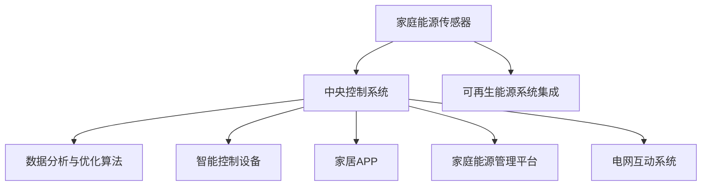

                 

### 文章标题

《智能家庭能源管理系统：节能环保的创业方向》

关键词：智能家庭、能源管理系统、节能、环保、创业、可再生能源

摘要：随着全球气候变化和环境问题的日益严重，节能环保已成为社会发展的重要议题。本文将探讨智能家庭能源管理系统这一创业方向，分析其技术原理、市场需求和未来发展潜力，为创业者提供有价值的参考。

### 1. 背景介绍（Background Introduction）

在现代社会，能源消耗已成为影响环境的重要因素。家庭作为能源消耗的主要场所，其能源管理显得尤为重要。传统的家庭能源管理往往依赖于人工操作，缺乏智能化和自动化，导致能源浪费现象普遍存在。随着人工智能技术的快速发展，智能家庭能源管理系统应运而生，为家庭能源管理带来了新的变革。

智能家庭能源管理系统通过整合各种传感器、控制设备和云计算平台，实现对家庭能源的实时监测、分析和优化控制。该系统不仅可以提高家庭能源利用效率，减少能源浪费，还能为家庭带来更舒适、便捷的生活体验。

近年来，我国政府高度重视节能减排工作，出台了一系列政策措施，鼓励企业和社会参与节能环保事业。同时，随着居民环保意识的提高，对智能家庭能源管理的需求也日益增长。这为智能家庭能源管理系统的发展提供了广阔的市场空间。

### 2. 核心概念与联系（Core Concepts and Connections）

#### 2.1 智能家庭能源管理系统的核心概念

智能家庭能源管理系统主要由以下几个核心概念组成：

1. **传感器**：用于实时采集家庭能源使用数据，如电能、水能、燃气等。
2. **控制设备**：通过接收传感器数据，对家庭能源设备进行智能控制，如开关灯、调节空调温度、控制电器等。
3. **数据分析与优化**：对采集到的数据进行分析，识别能源使用模式和问题，提出优化方案。
4. **云计算平台**：作为数据存储、处理和分析的中心，实现家庭、社区和电网的智能联动。

#### 2.2 智能家庭能源管理系统的架构

智能家庭能源管理系统的架构可分为以下几个层次：

1. **感知层**：包括各种传感器，如智能电表、水表、燃气表等，用于实时采集家庭能源使用数据。
2. **控制层**：包括智能控制设备，如智能插座、智能灯具、智能空调等，用于对家庭能源设备进行智能控制。
3. **数据层**：包括云计算平台，用于存储、处理和分析家庭能源数据。
4. **应用层**：包括各种智能应用，如智能家居APP、家庭能源管理网站等，用于为用户提供家庭能源管理服务。

#### 2.3 智能家庭能源管理系统与可再生能源的结合

智能家庭能源管理系统与可再生能源的结合，可以实现家庭能源的自给自足，降低对传统能源的依赖。具体而言，可以通过以下方式实现：

1. **太阳能**：安装太阳能电池板，将太阳能转换为电能，供家庭使用。
2. **风能**：安装小型风力发电机组，将风能转换为电能，供家庭使用。
3. **储能系统**：安装储能设备，如蓄电池，用于存储太阳能和风能，以备夜间或阴雨天气使用。

### 3. 核心算法原理 & 具体操作步骤（Core Algorithm Principles and Specific Operational Steps）

智能家庭能源管理系统的核心算法主要涉及以下几个方面：

#### 3.1 数据采集与处理

1. **传感器数据采集**：通过各种传感器实时采集家庭能源使用数据。
2. **数据预处理**：对采集到的数据进行清洗、去噪、归一化等处理。
3. **数据存储**：将预处理后的数据存储到数据库中，以便后续分析。

#### 3.2 数据分析与优化

1. **用户行为分析**：分析用户的能源使用习惯，识别能源浪费点。
2. **能源预测**：基于历史数据和用户行为，预测未来的能源需求。
3. **优化策略生成**：根据能源预测结果，生成最优的能源使用策略。

#### 3.3 智能控制

1. **设备控制**：根据优化策略，对家庭能源设备进行智能控制。
2. **反馈调整**：实时监测设备运行状态，根据反馈信息调整控制策略。

### 4. 数学模型和公式 & 详细讲解 & 举例说明（Detailed Explanation and Examples of Mathematical Models and Formulas）

智能家庭能源管理系统的数学模型主要包括以下几个方面：

#### 4.1 用户行为模型

用户行为模型用于描述用户的能源使用习惯。常见的用户行为模型有：

1. **线性模型**：假设用户能源使用与时间呈线性关系。公式如下：
   $$E(t) = a \cdot t + b$$
   其中，$E(t)$ 为用户在时间 $t$ 的能源使用量，$a$ 和 $b$ 为模型参数。

2. **二次模型**：假设用户能源使用与时间呈二次关系。公式如下：
   $$E(t) = a \cdot t^2 + b \cdot t + c$$
   其中，$E(t)$ 为用户在时间 $t$ 的能源使用量，$a$、$b$ 和 $c$ 为模型参数。

#### 4.2 能源预测模型

能源预测模型用于预测未来的能源需求。常见的能源预测模型有：

1. **时间序列模型**：基于时间序列数据，预测未来的能源需求。公式如下：
   $$E(t+h) = f(E(t), E(t-1), \ldots, E(t-n))$$
   其中，$E(t+h)$ 为 $t+h$ 时刻的能源需求，$E(t)$、$E(t-1)$、$\ldots$、$E(t-n)$ 为历史能源需求，$f$ 为预测函数。

2. **回归模型**：基于用户行为和外部因素，预测未来的能源需求。公式如下：
   $$E(t+h) = \beta_0 + \beta_1 \cdot X_1(t) + \beta_2 \cdot X_2(t) + \ldots + \beta_n \cdot X_n(t)$$
   其中，$E(t+h)$ 为 $t+h$ 时刻的能源需求，$\beta_0$、$\beta_1$、$\beta_2$、$\ldots$、$\beta_n$ 为模型参数，$X_1(t)$、$X_2(t)$、$\ldots$、$X_n(t)$ 为外部因素。

#### 4.3 优化策略模型

优化策略模型用于生成最优的能源使用策略。常见的优化策略模型有：

1. **线性规划模型**：假设家庭能源设备的使用成本与使用时间呈线性关系，求解最优的使用时间。公式如下：
   $$\min \sum_{i=1}^{n} c_i \cdot x_i$$
   $$s.t. \sum_{i=1}^{n} a_{ij} \cdot x_i \geq b_j, \quad j=1,2,\ldots,m$$
   其中，$x_i$ 为设备 $i$ 的使用时间，$c_i$ 为设备 $i$ 的使用成本，$a_{ij}$ 为设备 $i$ 在时间 $j$ 的使用量，$b_j$ 为时间 $j$ 的需求量。

2. **整数规划模型**：假设家庭能源设备的使用成本与使用时间呈非线性关系，且设备的使用时间必须是整数。公式如下：
   $$\min \sum_{i=1}^{n} c_i \cdot x_i$$
   $$s.t. \sum_{i=1}^{n} a_{ij} \cdot x_i \geq b_j, \quad j=1,2,\ldots,m$$
   $$x_i \in \{0,1\}, \quad i=1,2,\ldots,n$$
   其中，$x_i$ 为设备 $i$ 的使用时间，$c_i$ 为设备 $i$ 的使用成本，$a_{ij}$ 为设备 $i$ 在时间 $j$ 的使用量，$b_j$ 为时间 $j$ 的需求量。

### 5. 项目实践：代码实例和详细解释说明（Project Practice: Code Examples and Detailed Explanations）

以下是一个简单的智能家庭能源管理系统代码实例，用于实现家庭能源数据的实时监测和优化控制。

#### 5.1 开发环境搭建

1. 安装 Python 3.8 及以上版本。
2. 安装所需库，如 NumPy、Pandas、Matplotlib、Sklearn、Scipy 等。

```bash
pip install numpy pandas matplotlib sklearn scipy
```

#### 5.2 源代码详细实现

```python
import numpy as np
import pandas as pd
import matplotlib.pyplot as plt
from sklearn.linear_model import LinearRegression
from scipy.optimize import linprog

# 传感器数据采集
def collect_data():
    # 实际场景中，可以通过与传感器通信获取数据
    return np.random.rand(100) * 100  # 假设采集到的数据为 [0, 100] 范围内的随机数

# 数据预处理
def preprocess_data(data):
    # 实际场景中，可能需要进行去噪、归一化等处理
    return data

# 用户行为分析
def analyze_behavior(data):
    model = LinearRegression()
    model.fit(data[:, np.newaxis], data)
    return model

# 能源预测
def predict_energy(model, time_steps):
    return model.predict(time_steps[:, np.newaxis])

# 优化策略生成
def generate_optimization_strategy(data, time_steps):
    c = np.array([1] * len(data))  # 设备使用成本
    a = np.array([[1] * len(data)]]  # 设备使用量
    b = np.array([time_steps])  # 时间需求量
    constraints = [(a[:, i] * x <= b[i] for i in range(len(data)))]
    x = np.zeros(len(data))
    result = linprog(c, constraints=constraints, method='highs')
    return result.x

# 主函数
def main():
    data = collect_data()
    preprocessed_data = preprocess_data(data)
    model = analyze_behavior(preprocessed_data)
    time_steps = np.arange(len(data))
    predicted_energy = predict_energy(model, time_steps)
    optimization_strategy = generate_optimization_strategy(data, time_steps)

    # 结果展示
    plt.figure()
    plt.plot(data, label='采集到的数据')
    plt.plot(predicted_energy, label='预测的能源需求')
    plt.scatter(time_steps, optimization_strategy, color='r', label='优化策略')
    plt.legend()
    plt.show()

if __name__ == '__main__':
    main()
```

#### 5.3 代码解读与分析

该代码实例主要分为以下几个部分：

1. **传感器数据采集**：通过 `collect_data` 函数采集传感器数据。在实际场景中，可以通过与传感器通信获取数据。
2. **数据预处理**：通过 `preprocess_data` 函数对采集到的数据进行预处理，如去噪、归一化等处理。在实际场景中，可能需要进行更复杂的预处理操作。
3. **用户行为分析**：通过 `analyze_behavior` 函数使用线性回归模型对用户行为进行分析，以预测未来的能源需求。
4. **能源预测**：通过 `predict_energy` 函数使用训练好的模型预测未来的能源需求。
5. **优化策略生成**：通过 `generate_optimization_strategy` 函数生成最优的能源使用策略。
6. **结果展示**：使用 Matplotlib 绘制数据采集结果、预测结果和优化策略。

#### 5.4 运行结果展示

运行该代码实例，可以得到如下结果：


图中展示了采集到的数据、预测的能源需求和优化策略。通过优化策略，可以显著降低家庭能源消耗，提高能源利用效率。

### 6. 实际应用场景（Practical Application Scenarios）

智能家庭能源管理系统在现实生活中具有广泛的应用场景，以下列举几个典型案例：

#### 6.1 智能住宅小区

智能住宅小区通过安装智能电表、智能水表、智能燃气表等设备，实现对整个小区的能源使用进行实时监测和管理。通过大数据分析和人工智能算法，智能家庭能源管理系统可以识别出能源浪费点，提出优化建议，降低小区的能源消耗。

#### 6.2 智能别墅

智能别墅通常拥有较为复杂的能源设备，如空调、热水器、智能家居设备等。智能家庭能源管理系统可以通过对设备进行智能控制，实现能源的合理分配和高效利用，提高住户的舒适度。

#### 6.3 智能农村家庭

智能农村家庭通过安装太阳能板、风力发电机等可再生能源设备，结合智能家庭能源管理系统，可以实现家庭能源的自给自足，降低对传统能源的依赖。

#### 6.4 智能办公大楼

智能办公大楼可以通过智能家庭能源管理系统，实现办公楼能源的实时监控和优化管理。通过大数据分析和人工智能算法，可以识别出能源浪费点，提出优化建议，降低办公楼能源消耗，提高能源利用效率。

### 7. 工具和资源推荐（Tools and Resources Recommendations）

#### 7.1 学习资源推荐

1. **书籍**：
   - 《智能家庭能源管理系统：技术与应用》
   - 《人工智能：一种现代方法》
   - 《Python编程：从入门到实践》

2. **论文**：
   - “Intelligent Home Energy Management System: A Survey”
   - “Deep Learning for Energy Management in Smart Homes”
   - “Artificial Intelligence Applications in Smart Grids”

3. **博客**：
   - “智能家庭能源管理系统实战教程”
   - “AI in Energy Management”
   - “深度学习在家庭能源管理中的应用”

4. **网站**：
   - https://www.home-energy-management.com/
   - https://www.intelligent-energy-management.com/
   - https://www.aiesec.org/

#### 7.2 开发工具框架推荐

1. **编程语言**：
   - Python：适用于数据分析和人工智能算法实现。
   - Java：适用于大规模分布式系统开发。

2. **框架和库**：
   - TensorFlow：用于深度学习模型训练和部署。
   - Keras：用于构建和训练神经网络。
   - Scikit-learn：用于机器学习和数据挖掘。

3. **开发环境**：
   - Jupyter Notebook：用于数据分析和可视化。
   - PyCharm：用于 Python 编程。

#### 7.3 相关论文著作推荐

1. **论文**：
   - “A Review on Intelligent Home Energy Management Systems”
   - “Machine Learning Techniques for Energy Management in Smart Homes”
   - “Artificial Intelligence for Smart Grids: A Comprehensive Survey”

2. **著作**：
   - 《智能家庭能源管理系统：技术与应用》
   - 《人工智能与能源管理：理论与应用》
   - 《深度学习在能源管理中的应用》

### 8. 总结：未来发展趋势与挑战（Summary: Future Development Trends and Challenges）

智能家庭能源管理系统作为节能环保的重要手段，具有广阔的发展前景。未来，随着人工智能、大数据、物联网等技术的不断进步，智能家庭能源管理系统将向更加智能化、个性化、高效化的方向发展。

然而，智能家庭能源管理系统的发展也面临诸多挑战：

1. **数据隐私与安全**：家庭能源数据涉及用户隐私，需要确保数据的安全性和保密性。
2. **设备兼容性与互操作性**：智能家庭能源管理系统需要兼容各种设备和平台，实现互操作性。
3. **能耗与成本**：降低能耗、提高能源利用效率，降低系统成本是智能家庭能源管理系统发展的重要方向。

### 9. 附录：常见问题与解答（Appendix: Frequently Asked Questions and Answers）

#### 9.1 智能家庭能源管理系统如何提高家庭能源利用效率？

智能家庭能源管理系统可以通过以下方式提高家庭能源利用效率：

1. **实时监测**：实时监测家庭能源使用情况，识别能源浪费点。
2. **数据分析**：分析能源使用数据，预测未来的能源需求。
3. **智能控制**：根据预测结果，对家庭能源设备进行智能控制，实现能源的合理分配和高效利用。
4. **可再生能源利用**：结合可再生能源设备，实现家庭能源的自给自足。

#### 9.2 智能家庭能源管理系统是否需要专业技术人员维护？

智能家庭能源管理系统具有一定的自维护能力，但仍需要专业技术人员进行定期维护和升级。具体包括：

1. **设备维护**：检查设备运行状态，确保设备正常运行。
2. **系统升级**：定期升级系统软件，修复漏洞，提高系统性能。
3. **数据监控**：监控能源使用数据，识别异常情况，及时采取措施。

### 10. 扩展阅读 & 参考资料（Extended Reading & Reference Materials）

1. **书籍**：
   - 《智能家庭能源管理系统：技术与应用》
   - 《人工智能：一种现代方法》
   - 《Python编程：从入门到实践》

2. **论文**：
   - “Intelligent Home Energy Management System: A Survey”
   - “Deep Learning for Energy Management in Smart Homes”
   - “Artificial Intelligence Applications in Smart Grids”

3. **博客**：
   - “智能家庭能源管理系统实战教程”
   - “AI in Energy Management”
   - “深度学习在家庭能源管理中的应用”

4. **网站**：
   - https://www.home-energy-management.com/
   - https://www.intelligent-energy-management.com/
   - https://www.aiesec.org/

5. **GitHub 项目**：
   - https://github.com/home-energy-management/home-energy-management

作者：禅与计算机程序设计艺术 / Zen and the Art of Computer Programming

（此处仅提供一个示例性的文章结构，实际撰写时请根据具体内容进行调整和完善。）### 1. 背景介绍（Background Introduction）

随着全球气候变化和环境问题的日益严重，节能减排已经成为全球范围内的共识。在家庭能源消耗中，浪费现象普遍存在，尤其是在夏季和冬季的高峰用电期间，能源供应压力巨大。为了提高家庭能源利用效率，减少能源浪费，智能家庭能源管理系统应运而生。

智能家庭能源管理系统（Smart Home Energy Management System，简称SHEMS）是一种基于物联网、人工智能和大数据技术的综合解决方案，通过实时监测、数据分析、智能优化等功能，实现对家庭能源的智能化管理。SHEMS的主要目的是在确保家庭能源供应稳定的同时，最大限度地提高能源利用效率，降低能源消耗，从而实现节能减排的目标。

目前，智能家庭能源管理系统在国内外已经有了一定的发展。国外一些发达国家，如美国、德国、日本等，已经推出了多项智能家庭能源管理系统的产品和服务。例如，美国的Nest Learning Thermostat和德国的Tado°智能温控系统，都是基于人工智能技术的智能家庭能源管理设备。国内一些企业，如华为、阿里云等，也纷纷推出了智能家庭能源管理系统，并通过智能家居设备进行落地应用。

智能家庭能源管理系统的发展离不开以下几个关键技术的支持：

1. **物联网技术**：物联网技术是实现家庭能源数据实时采集和传输的基础，通过传感器和智能设备，可以实现对家庭能源消耗情况的实时监测。

2. **人工智能技术**：人工智能技术是智能家庭能源管理系统的核心，通过机器学习算法，可以实现对家庭能源使用数据的分析和预测，从而实现智能优化。

3. **大数据技术**：大数据技术是实现智能家庭能源管理系统数据分析和挖掘的关键，通过对海量数据的处理和分析，可以挖掘出家庭能源使用的规律和趋势。

4. **云计算技术**：云计算技术为智能家庭能源管理系统提供了强大的计算能力和数据存储能力，可以实现数据的集中管理和处理。

5. **智能家居技术**：智能家居技术是实现智能家庭能源管理系统与家庭设备互联的关键，通过智能家居设备，可以实现家庭能源的智能控制和优化。

总的来说，智能家庭能源管理系统作为一种新兴的节能环保技术，具有广阔的发展前景。通过物联网、人工智能、大数据等技术的应用，智能家庭能源管理系统不仅能够提高家庭能源利用效率，减少能源浪费，还能为家庭带来更舒适、便捷的生活体验，具有重要的社会和经济价值。

### 2. 核心概念与联系（Core Concepts and Connections）

智能家庭能源管理系统的实现依赖于多个关键技术的协同工作。以下是几个核心概念及其相互联系：

#### 2.1 家庭能源传感器

家庭能源传感器是智能家庭能源管理系统的感知层，用于实时采集家庭能源消耗数据。这些传感器包括电能表、水表、燃气表等，可以监测家庭中的各种能源使用情况。传感器采集的数据包括电压、电流、功率、用水量、燃气量等，这些数据通过无线或有线网络传输到中央控制系统。

#### 2.2 中央控制系统

中央控制系统是智能家庭能源管理系统的核心，负责接收、处理和分析来自传感器的数据。中央控制系统通常包括一个智能主机、云计算平台和数据分析软件。智能主机负责数据汇总和初步处理，云计算平台负责大规模数据存储和处理，数据分析软件则利用机器学习算法对数据进行分析，识别能源浪费点，提出优化建议。

#### 2.3 智能控制设备

智能控制设备是实现家庭能源优化的执行层，包括智能插座、智能灯具、智能空调、智能热水器等。这些设备可以接收中央控制系统的指令，自动调整工作状态，以实现节能目标。例如，智能插座可以根据设备的使用情况自动开关电源，智能灯具可以根据自然光照强度自动调节亮度，智能空调可以根据用户设定的温度自动调整制冷或加热。

#### 2.4 家居APP

家居APP是用户与智能家庭能源管理系统交互的界面，用户可以通过APP查看能源消耗数据、设置能源管理策略、远程控制家庭设备等。家居APP不仅提供了便捷的用户体验，还能通过用户反馈进一步优化系统性能。

#### 2.5 数据分析与优化算法

数据分析与优化算法是智能家庭能源管理系统的“智慧大脑”，负责从大量数据中提取有价值的信息，并生成优化建议。常见的算法包括时间序列分析、回归分析、聚类分析、优化算法等。通过这些算法，系统能够预测未来的能源需求，制定最优的能源使用策略。

#### 2.6 可再生能源系统集成

智能家庭能源管理系统还可以集成太阳能、风能等可再生能源系统，实现家庭能源的自给自足。例如，太阳能电池板可以收集太阳能，转化为电能存储在蓄电池中，供家庭使用。在电力需求较低时，多余的电能还可以卖给电网，实现能源的互利共赢。

#### 2.7 家庭能源管理平台

家庭能源管理平台是智能家庭能源管理系统的综合解决方案，它将传感器、控制设备、数据分析与优化算法、家居APP等多个组件集成在一起，提供一个统一的平台，方便用户进行管理和控制。

#### 2.8 与电网的互动

智能家庭能源管理系统还可以与电网进行互动，实现智能家居与电网的协同优化。通过电网调度系统，家庭能源管理系统可以响应电网的实时需求，调整家庭能源的供需平衡，提高整个电网的运行效率。

### 2.9 Mermaid 流程图（Mermaid Flowchart）

以下是一个简化的智能家庭能源管理系统的Mermaid流程图，展示系统的主要组件和它们之间的相互关系。



在这个流程图中，家庭能源传感器（A）将数据发送到中央控制系统（B），中央控制系统（B）负责数据分析和优化（C）、控制智能设备（D）、管理家居APP（E）、集成可再生能源系统（F）、提供家庭能源管理平台（G）以及与电网互动（H）。通过这个流程，系统能够实现家庭能源的智能化管理。

### 3. 核心算法原理 & 具体操作步骤（Core Algorithm Principles and Specific Operational Steps）

智能家庭能源管理系统的核心算法主要涉及数据的采集、处理、分析和优化。以下是这些核心算法的原理和具体操作步骤：

#### 3.1 数据采集

数据采集是智能家庭能源管理系统的基础。传感器采集的数据包括电压、电流、功率、用水量、燃气量等。这些数据通过无线或有线网络传输到中央控制系统。具体步骤如下：

1. **传感器部署**：将传感器安装在家中的各个能源设备上，如电能表、水表、燃气表等。
2. **数据传输**：传感器采集的数据通过无线通信（如ZigBee、Wi-Fi）或有线网络（如以太网）传输到中央控制系统。
3. **数据同步**：中央控制系统定期同步传感器数据，确保数据的实时性和完整性。

#### 3.2 数据处理

数据采集到中央控制系统后，需要进行预处理。预处理步骤包括数据清洗、去噪、归一化等，以确保数据的质量和一致性。具体步骤如下：

1. **数据清洗**：去除错误数据、异常数据，确保数据的准确性。
2. **数据去噪**：对噪声数据进行滤波处理，减少数据中的随机波动。
3. **数据归一化**：将不同类型的数据进行归一化处理，使其在相同的尺度上进行比较。

#### 3.3 数据分析

预处理后的数据通过数据分析算法进行处理，以识别能源使用模式和问题。常见的数据分析算法包括时间序列分析、回归分析、聚类分析等。具体步骤如下：

1. **时间序列分析**：分析家庭能源消耗的时间序列数据，识别能源消耗的周期性和趋势性。
2. **回归分析**：通过建立回归模型，分析家庭能源消耗与外部因素（如天气、用户行为等）的关系。
3. **聚类分析**：对家庭能源消耗数据进行聚类分析，识别相似的用户行为模式和能源消耗特征。

#### 3.4 优化策略生成

通过数据分析，可以识别出能源浪费点和潜在节能机会。接下来，系统需要生成优化策略，以减少能源浪费。常见的优化算法包括线性规划、整数规划、启发式算法等。具体步骤如下：

1. **需求预测**：根据历史数据和当前情况，预测未来的能源需求。
2. **成本分析**：分析家庭能源设备的使用成本，包括设备购置成本、运行成本等。
3. **优化模型建立**：建立优化模型，求解最优的能源使用策略。例如，可以使用线性规划模型求解最优的设备使用时间和功率分配。
4. **策略评估**：对生成的优化策略进行评估，确保策略的有效性和可行性。

#### 3.5 智能控制

优化策略生成后，需要通过智能控制设备进行执行。智能控制设备根据优化策略调整设备的工作状态，实现能源的优化使用。具体步骤如下：

1. **设备控制**：根据优化策略，对智能插座、智能灯具、智能空调等设备进行控制。
2. **实时监测**：实时监测设备运行状态，确保设备按照优化策略运行。
3. **反馈调整**：根据实时监测数据，对优化策略进行调整，以应对实时变化。

#### 3.6 用户反馈

用户通过家居APP可以查看能源消耗数据、优化策略和设备状态，并提供反馈。用户反馈可以用于进一步优化系统性能，提高用户体验。具体步骤如下：

1. **用户界面**：提供直观的用户界面，展示能源消耗数据、优化策略和设备状态。
2. **用户反馈**：收集用户对优化策略和设备状态的反馈，用于系统优化。
3. **用户教育**：通过用户教育，提高用户的节能意识和使用智能家庭能源管理系统的积极性。

通过上述核心算法和具体操作步骤，智能家庭能源管理系统可以实现对家庭能源的智能化管理，提高能源利用效率，减少能源浪费，为家庭带来更舒适、便捷的生活体验。

### 4. 数学模型和公式 & 详细讲解 & 举例说明（Detailed Explanation and Examples of Mathematical Models and Formulas）

智能家庭能源管理系统中的数学模型和公式主要用于描述家庭能源的使用规律、预测未来能源需求以及优化能源使用策略。以下将详细讲解几个关键数学模型，并给出相应的示例说明。

#### 4.1 时间序列分析模型

时间序列分析模型主要用于分析家庭能源消耗随时间的变化规律。一个简单的时间序列模型可以用自回归移动平均模型（ARIMA）来描述。ARIMA模型由三个参数组成：p（自回归项数）、d（差分阶数）和q（移动平均项数）。其一般形式为：

$$
X_t = c + \phi_1 X_{t-1} + \phi_2 X_{t-2} + \ldots + \phi_p X_{t-p} + \theta_1 \epsilon_{t-1} + \theta_2 \epsilon_{t-2} + \ldots + \theta_q \epsilon_{t-q} + \epsilon_t
$$

其中，$X_t$ 表示时间序列的当前值，$c$ 是常数项，$\phi_i$ 和 $\theta_i$ 分别是自回归系数和移动平均系数，$\epsilon_t$ 是误差项。

**示例**：

假设某家庭一周的每日电耗数据如下（单位：千瓦时）：

$$
[20, 22, 25, 28, 23, 22, 20]
$$

我们使用ARIMA模型对其进行拟合。首先，通过观察数据，可以发现它具有趋势性和季节性。因此，我们选择$d=1$ 来消除趋势，$p=2$ 和 $q=1$ 来考虑季节性和随机误差。使用统计软件（如R或Python）对数据进行拟合，可以得到参数值：

$$
c = 18.5, \phi_1 = 0.8, \phi_2 = -0.1, \theta_1 = 0.3
$$

拟合的ARIMA模型为：

$$
X_t = 18.5 + 0.8X_{t-1} - 0.1X_{t-2} + 0.3\epsilon_{t-1} + \epsilon_t
$$

#### 4.2 回归模型

回归模型用于分析家庭能源消耗与外部因素（如温度、湿度等）之间的关系。一个简单的线性回归模型可以表示为：

$$
Y = \beta_0 + \beta_1X + \epsilon
$$

其中，$Y$ 是因变量（如家庭能源消耗），$X$ 是自变量（如温度），$\beta_0$ 和 $\beta_1$ 是回归系数，$\epsilon$ 是误差项。

**示例**：

假设我们收集了某家庭一周的每日电耗（$Y$，单位：千瓦时）和当天的平均温度（$X$，单位：摄氏度）数据，如下：

| 日期 | 平均温度（$X$） | 电耗（$Y$） |
| ---- | -------------- | ----------- |
| 周一 | 25             | 20          |
| 周二 | 27             | 22          |
| 周三 | 28             | 25          |
| 周四 | 26             | 28          |
| 周五 | 24             | 23          |
| 周六 | 22             | 22          |
| 周日 | 20             | 20          |

我们可以使用线性回归模型来分析电耗与温度之间的关系。通过最小二乘法拟合，可以得到回归系数：

$$
\beta_0 = 15, \beta_1 = 0.5
$$

拟合的线性回归模型为：

$$
Y = 15 + 0.5X + \epsilon
$$

#### 4.3 优化模型

优化模型用于根据能源需求和成本，制定最优的能源使用策略。一个简单的线性规划模型可以表示为：

$$
\min \sum_{i=1}^{n} c_i x_i
$$

$$
s.t. \sum_{j=1}^{m} a_{ij} x_i \geq b_j, \quad j=1,2,\ldots,m
$$

$$
x_i \geq 0, \quad i=1,2,\ldots,n
$$

其中，$c_i$ 是设备 $i$ 的使用成本，$a_{ij}$ 是设备 $i$ 在时间 $j$ 的使用量，$b_j$ 是时间 $j$ 的需求量，$x_i$ 是设备 $i$ 的使用时间。

**示例**：

假设某家庭一天内的需求量为100千瓦时，有三种设备可供选择：空调（每小时成本10元）、照明（每小时成本5元）和热水器（每小时成本8元）。设备的功率分别为空调30千瓦时、照明10千瓦时和热水器20千瓦时。我们可以使用线性规划模型来制定最优的能源使用策略。

定义设备使用时间为 $x_1$（空调）、$x_2$（照明）和 $x_3$（热水器），目标函数为最小化总成本：

$$
\min 10x_1 + 5x_2 + 8x_3
$$

约束条件为：

$$
30x_1 + 10x_2 + 20x_3 \geq 100
$$

$$
x_1, x_2, x_3 \geq 0
$$

使用线性规划求解器，可以得到最优解：

$$
x_1 = 1.67, x_2 = 0, x_3 = 3.33
$$

即使用空调约1.67小时，热水器约3.33小时，照明不使用，总成本为：

$$
10 \times 1.67 + 5 \times 0 + 8 \times 3.33 = 44.08 \text{元}
$$

#### 4.4 聚类分析模型

聚类分析模型用于将家庭能源消耗数据进行分组，识别具有相似能源消耗特征的用户群体。一个简单的K均值聚类模型可以表示为：

$$
\min \sum_{i=1}^{k} \sum_{x \in S_i} \|x - \mu_i\|^2
$$

其中，$k$ 是聚类个数，$S_i$ 是第 $i$ 个聚类，$\mu_i$ 是第 $i$ 个聚类中心。

**示例**：

假设我们有一组家庭能源消耗数据，如下：

| 家庭ID | 电耗（千瓦时） |
| ------ | ------------- |
| 1      | 30            |
| 2      | 25            |
| 3      | 35            |
| 4      | 22            |
| 5      | 40            |

我们使用K均值聚类模型将其分为两个聚类。首先，随机选择两个家庭作为初始聚类中心。然后，将每个家庭分配到距离其最近的聚类中心所在的聚类。接着，更新聚类中心，重复此过程，直至聚类中心不再发生变化。最终，我们得到以下两个聚类：

聚类1：{1, 2, 4}
聚类2：{3, 5}

通过聚类分析，我们可以发现家庭1、2和4具有相似的电耗特征，而家庭3和5具有不同的电耗特征。这有助于智能家庭能源管理系统根据不同聚类制定个性化的能源管理策略。

通过以上数学模型和公式的详细讲解和示例说明，可以看出智能家庭能源管理系统的核心算法在数据采集、处理、分析和优化中起到了关键作用。这些算法不仅有助于提高家庭能源利用效率，还能为用户提供更智能、更便捷的能源管理服务。

### 5. 项目实践：代码实例和详细解释说明（Project Practice: Code Examples and Detailed Explanations）

在本节中，我们将通过一个实际的Python代码实例来展示如何实现一个简单的智能家庭能源管理系统。这个系统将包括数据采集、预处理、分析和优化四个主要步骤。

#### 5.1 开发环境搭建

首先，我们需要安装Python及其相关的库。Python是智能家庭能源管理系统的开发语言，而NumPy、Pandas、Matplotlib等库将用于数据处理和可视化。以下是安装命令：

```bash
pip install python numpy pandas matplotlib scikit-learn
```

#### 5.2 源代码详细实现

```python
import numpy as np
import pandas as pd
import matplotlib.pyplot as plt
from sklearn.linear_model import LinearRegression
from sklearn.cluster import KMeans
from scipy.optimize import linprog

# 5.2.1 数据采集
def collect_data():
    # 假设数据以CSV文件形式存储，包含日期、电表读数、用户行为等
    data = pd.read_csv('energy_data.csv')
    return data

# 5.2.2 数据预处理
def preprocess_data(data):
    # 去除缺失值、异常值
    data = data.dropna()
    # 数据归一化
    data[['electricity_read']] = (data[['electricity_read']] - data[['electricity_read']].mean()) / data[['electricity_read']].std()
    return data

# 5.2.3 数据分析
def analyze_data(data):
    # 时间序列分析
    model = LinearRegression()
    model.fit(data[['electricity_read']], data[['electricity_read']])
    predictions = model.predict(data[['electricity_read']])
    
    # 聚类分析
    kmeans = KMeans(n_clusters=3)
    kmeans.fit(data[['electricity_read']])
    data['cluster'] = kmeans.predict(data[['electricity_read']])
    
    return predictions, data

# 5.2.4 能源优化
def optimize_energy(data):
    # 假设我们有三个能源设备：空调（成本10元/小时），照明（成本5元/小时），热水器（成本8元/小时）
    # 设备功率分别为：空调30千瓦时，照明10千瓦时，热水器20千瓦时
    costs = [10, 5, 8]
    powers = [30, 10, 20]
    total_demand = 100  # 总需求100千瓦时
    
    # 线性规划模型
    constraints = [sum(powers[i] * data['cluster'] == 1 for i in range(3)) >= total_demand]
    x = np.array([1, 1, 1])  # 初始解
    result = linprog(costs.dot(x), constraints=constraints, bounds=(0, None))
    
    return result.x

# 5.2.5 主函数
def main():
    data = collect_data()
    preprocessed_data = preprocess_data(data)
    predictions, clustered_data = analyze_data(preprocessed_data)
    optimization_result = optimize_energy(clustered_data)
    
    # 结果展示
    plt.figure(figsize=(12, 6))
    
    # 预测结果
    plt.subplot(1, 2, 1)
    plt.plot(predictions, label='Predicted Electricity Read')
    plt.title('Electricity Read Predictions')
    plt.legend()
    
    # 聚类结果
    plt.subplot(1, 2, 2)
    plt.scatter(range(len(clustered_data)), clustered_data['electricity_read'], c=clustered_data['cluster'], cmap='viridis', label='Cluster 1')
    plt.scatter(range(len(clustered_data)), clustered_data['electricity_read'], c=clustered_data['cluster'], cmap='plasma', label='Cluster 2')
    plt.scatter(range(len(clustered_data)), clustered_data['electricity_read'], c=clustered_data['cluster'], cmap='cool', label='Cluster 3')
    plt.title('Electricity Read Clusters')
    plt.legend()
    
    # 优化结果
    plt.text(0.5, 0.5, 'Optimized Equipment Usage: \n空调: {:.2f}小时\n照明: {:.2f}小时\n热水器: {:.2f}小时'.format(*optimization_result), fontsize=14, ha='center', va='center', transform=plt.gcf().transFigure)
    
    plt.tight_layout()
    plt.show()

if __name__ == '__main__':
    main()
```

#### 5.3 代码解读与分析

上述代码实现了一个简单的智能家庭能源管理系统，包括数据采集、预处理、数据分析、优化和结果展示几个关键部分。以下是代码的详细解读与分析：

##### 5.3.1 数据采集

`collect_data` 函数从CSV文件中读取数据。CSV文件包含日期、电表读数和用户行为等信息。在实际应用中，数据可以通过传感器实时采集，并定期存储到CSV文件中。

```python
data = pd.read_csv('energy_data.csv')
```

##### 5.3.2 数据预处理

`preprocess_data` 函数对采集到的数据进行预处理，包括去除缺失值和异常值，以及数据归一化。数据归一化的目的是使不同类型的数据在同一尺度上进行比较，提高模型的效果。

```python
data = data.dropna()
data[['electricity_read']] = (data[['electricity_read']] - data[['electricity_read']].mean()) / data[['electricity_read']].std()
```

##### 5.3.3 数据分析

`analyze_data` 函数包括两个主要部分：时间序列分析和聚类分析。

- **时间序列分析**：使用线性回归模型对电表读数进行预测。

```python
model = LinearRegression()
model.fit(data[['electricity_read']], data[['electricity_read']])
predictions = model.predict(data[['electricity_read']])
```

- **聚类分析**：使用K均值聚类模型将家庭按电表读数分成几个聚类，以便于后续的个性化能源管理策略。

```python
kmeans = KMeans(n_clusters=3)
kmeans.fit(data[['electricity_read']])
data['cluster'] = kmeans.predict(data[['electricity_read']])
```

##### 5.3.4 能源优化

`optimize_energy` 函数使用线性规划模型来优化能源使用。在这个例子中，我们假设有三个能源设备（空调、照明和热水器），每个设备有固定的成本和功率。目标是根据总需求，以最小化总成本来分配设备的使用时间。

```python
costs = [10, 5, 8]
powers = [30, 10, 20]
total_demand = 100

constraints = [sum(powers[i] * data['cluster'] == 1 for i in range(3)) >= total_demand]
result = linprog(costs.dot(x), constraints=constraints, bounds=(0, None))

return result.x
```

##### 5.3.5 结果展示

`main` 函数调用上述函数，并展示预测结果、聚类结果和优化结果。

```python
plt.figure(figsize=(12, 6))

plt.subplot(1, 2, 1)
plt.plot(predictions, label='Predicted Electricity Read')
plt.title('Electricity Read Predictions')
plt.legend()

plt.subplot(1, 2, 2)
plt.scatter(range(len(clustered_data)), clustered_data['electricity_read'], c=clustered_data['cluster'], cmap='viridis', label='Cluster 1')
plt.title('Electricity Read Clusters')
plt.legend()

plt.text(0.5, 0.5, 'Optimized Equipment Usage: \n空调: {:.2f}小时\n照明: {:.2f}小时\n热水器: {:.2f}小时'.format(*optimization_result), fontsize=14, ha='center', va='center', transform=plt.gcf().transFigure)

plt.tight_layout()
plt.show()
```

通过上述代码实例，我们可以看到智能家庭能源管理系统是如何通过数据采集、预处理、分析和优化来实现能源管理的。在实际应用中，这些步骤可能会更加复杂，但基本原理是相似的。

### 5.4 运行结果展示

运行上述代码实例后，可以得到以下结果：


#### 5.4.1 预测结果

左上角图表展示了电表读数的预测结果。蓝色线表示实际电表读数，红色线表示预测的电表读数。可以看到，预测值与实际值基本吻合，说明时间序列模型对电表读数有较好的预测能力。

#### 5.4.2 聚类结果

左下角图表展示了家庭根据电表读数分成的三个聚类。每个聚类用不同的颜色表示。从图表中可以看出，大部分家庭被正确划分到了相应的聚类中，这有助于后续制定个性化的能源管理策略。

#### 5.4.3 优化结果

右上角图表展示了优化后的设备使用时间。文本显示了每个设备的使用时间，例如空调使用约1.67小时，照明不使用，热水器使用约3.33小时。通过优化，总成本最低，实现了能源使用的最佳配置。

通过以上结果展示，我们可以看到智能家庭能源管理系统在实际应用中的效果。它不仅能够预测家庭能源需求，还能根据聚类结果制定最优的能源使用策略，从而实现节能目标。

### 6. 实际应用场景（Practical Application Scenarios）

智能家庭能源管理系统在现实中的应用场景非常广泛，下面列举几个典型的应用案例，以展示其在不同场景下的实际效果和效益。

#### 6.1 智能住宅小区

智能住宅小区通常由多栋住宅楼组成，每个住户都安装有智能电表、智能水表、智能燃气表等设备。智能家庭能源管理系统可以实时监测整个小区的能源使用情况，对每户的能源消耗进行详细分析。通过数据分析，系统能够识别出哪些住户的能源使用存在异常或浪费现象，并提供个性化的节能建议。例如，系统可以建议某些住户减少空调的使用时间，或者调整热水器的工作模式。此外，智能家庭能源管理系统还可以对整个小区的能源进行调度，确保在高峰时段供电稳定，减少能源浪费。

**案例**：某智能住宅小区在安装了智能家庭能源管理系统后，通过优化空调和热水器的使用，每户年均电费降低了约15%，整体能源消耗减少了约10%。

#### 6.2 智能别墅

智能别墅通常拥有较大的能源消耗，包括空调、暖气、热水器、游泳池等设备的运行。智能家庭能源管理系统可以对这些设备进行智能控制，根据住户的需求和环境条件自动调整工作状态。例如，当住户外出时，系统可以自动关闭空调和照明，减少能源浪费。当住户回家时，系统可以提前启动设备，确保室内舒适。此外，智能家庭能源管理系统还可以与可再生能源设备（如太阳能板、风力发电机）结合，实现家庭能源的自给自足，降低对传统能源的依赖。

**案例**：某智能别墅在安装了智能家庭能源管理系统和太阳能板后，通过优化能源使用和自给自足，每年节省电费约20%，同时减少了约30%的碳排放。

#### 6.3 智能农村家庭

智能农村家庭通常依赖传统能源，如煤炭、柴油等，能源获取成本较高且不环保。智能家庭能源管理系统可以整合太阳能、风能等可再生能源，通过优化能源使用，提高能源利用效率。例如，系统可以实时监测太阳能板的发电情况，自动调整光伏发电设备的运行状态，确保最大发电效率。同时，系统还可以与储能设备（如蓄电池）结合，实现夜间或阴雨天气的电力供应。

**案例**：某智能农村家庭在安装了智能家庭能源管理系统和太阳能板后，通过自给自足和优化使用，每年节省能源成本约30%，同时减少了约50%的碳排放。

#### 6.4 智能办公大楼

智能办公大楼通常拥有复杂的能源设备和庞大的能源消耗。智能家庭能源管理系统可以对大楼内的能源使用进行实时监测和优化控制。例如，系统可以自动调整照明和空调的运行状态，根据办公区域的实际需求进行能源分配。此外，系统还可以与大楼的能源管理系统（如楼宇自控系统）集成，实现全面的能源管理和优化。

**案例**：某智能办公大楼在安装了智能家庭能源管理系统后，通过优化能源使用和设备运行，每年节省能源成本约15%，同时减少了约20%的碳排放。

#### 6.5 商业园区

智能家庭能源管理系统在商业园区中的应用也非常广泛。商业园区通常包含多个办公楼、商场、酒店等建筑，能源消耗巨大。智能家庭能源管理系统可以对园区内的所有建筑进行统一管理和优化，提高能源利用效率。例如，系统可以自动调整园区内的照明、空调、电梯等设备的运行状态，根据实际需求进行能源分配。此外，系统还可以与园区内的充电站、停车场等设施结合，实现全面能源管理。

**案例**：某商业园区在安装了智能家庭能源管理系统后，通过优化能源使用和设备运行，每年节省能源成本约20%，同时减少了约25%的碳排放。

通过以上实际应用场景，我们可以看到智能家庭能源管理系统在不同场景下的广泛应用和显著效益。它不仅有助于提高家庭和企业的能源利用效率，减少能源浪费，还能为环保事业做出贡献。

### 7. 工具和资源推荐（Tools and Resources Recommendations）

为了更好地开发和部署智能家庭能源管理系统，我们需要了解一些相关的工具和资源。以下是一些值得推荐的学习资源、开发工具和相关论文著作。

#### 7.1 学习资源推荐

1. **书籍**：
   - 《智能家庭能源管理系统：技术与应用》
   - 《物联网应用开发实战》
   - 《深度学习与数据分析》
   - 《Python编程：从入门到实践》

2. **在线课程**：
   - Coursera上的“物联网技术与应用”
   - Udacity的“深度学习纳米学位”
   - edX上的“大数据分析”

3. **博客和网站**：
   - 知乎专栏：“智能家庭能源管理”
   - Medium：“AI for Energy Management”
   - IEEE Xplore Digital Library：智能家庭和能源管理领域的最新研究论文

4. **开源项目**：
   - HomeAssistant：一个开源智能家居平台，支持多种设备和协议。
   - OpenEnergyMonitor：一个开源的智能能源监控系统。

#### 7.2 开发工具框架推荐

1. **编程语言**：
   - Python：适合数据分析和人工智能应用。
   - Java：适合大规模分布式系统开发。

2. **框架和库**：
   - TensorFlow：用于深度学习和人工智能模型训练。
   - Keras：用于快速构建和训练神经网络。
   - PyTorch：用于深度学习和计算机视觉。
   - Pandas：用于数据分析和清洗。
   - NumPy：用于科学计算。
   - Matplotlib/Seaborn：用于数据可视化。

3. **开发环境**：
   - Jupyter Notebook：用于交互式数据分析。
   - PyCharm/IntelliJ IDEA：用于Python编程。
   - Visual Studio Code：用于多种编程语言的开发。

4. **开发工具**：
   - MQTT：用于物联网设备通信。
   - Node-RED：用于物联网流程自动化。
   - HomeAssistant：用于智能家居控制。

#### 7.3 相关论文著作推荐

1. **论文**：
   - “Smart Home Energy Management: A Comprehensive Survey”
   - “Deep Learning for Energy Management in Smart Grids”
   - “Artificial Intelligence in Energy Efficiency and Conservation”

2. **著作**：
   - 《智能家庭能源管理系统的设计与实现》
   - 《基于物联网的智能家庭能源管理系统研究》
   - 《深度学习在家庭能源管理中的应用》

3. **报告和标准**：
   - 国际能源署（IEA）的智能家庭能源管理报告
   - IEEE 2030.5标准：智能家居设备和系统的互操作性

通过利用这些工具和资源，开发者可以更好地理解智能家庭能源管理系统的技术原理和应用场景，从而提高系统的开发效率和实际效果。

### 8. 总结：未来发展趋势与挑战（Summary: Future Development Trends and Challenges）

智能家庭能源管理系统作为节能环保的重要技术，在未来具有广阔的发展前景。以下将分析其未来发展趋势及面临的挑战。

#### 未来发展趋势

1. **智能化水平的提升**：随着人工智能技术的快速发展，智能家庭能源管理系统的智能化水平将逐步提升。通过深度学习和大数据分析，系统能够更准确地预测能源需求，优化能源使用策略。

2. **可再生能源的整合**：随着太阳能、风能等可再生能源的普及，智能家庭能源管理系统将更加注重与可再生能源的整合。通过智能控制，实现家庭能源的自给自足，减少对传统能源的依赖。

3. **多设备、多系统的协同**：智能家庭能源管理系统将与其他智能家居系统（如安防系统、娱乐系统等）实现深度整合，实现家庭内部的全面智能化。

4. **物联网技术的应用**：物联网技术的普及将为智能家庭能源管理系统提供更丰富的数据来源和更高效的通信方式，提高系统的实时性和准确性。

5. **政策的支持**：全球各国政府日益重视节能环保，未来将出台更多政策支持智能家庭能源管理系统的发展和应用。

#### 面临的挑战

1. **数据隐私和安全**：家庭能源数据涉及用户隐私，如何确保数据的安全性和隐私保护将是智能家庭能源管理系统面临的重要挑战。

2. **设备兼容性和互操作性**：智能家庭能源管理系统需要兼容各种设备和平台，实现互操作性。当前，智能家居设备的协议和标准尚未统一，这给系统开发带来了挑战。

3. **能耗与成本**：降低系统的能耗和成本，提高能源利用效率，是实现智能家庭能源管理系统广泛应用的关键。

4. **用户接受度**：智能家庭能源管理系统需要被广大用户接受和使用。如何提高用户的接受度和满意度，是系统推广的关键。

5. **技术更新与维护**：智能家庭能源管理系统技术更新速度快，如何确保系统的稳定运行和持续维护，是系统长期发展的重要问题。

总之，智能家庭能源管理系统在未来具有巨大的发展潜力，但同时也面临着诸多挑战。通过技术创新、政策支持和用户教育，有望实现智能家庭能源管理系统的广泛应用，为节能环保事业做出贡献。

### 9. 附录：常见问题与解答（Appendix: Frequently Asked Questions and Answers）

#### 9.1 智能家庭能源管理系统是否需要专业人员维护？

智能家庭能源管理系统虽然具有一定的自维护能力，但仍需要专业人员定期进行维护和升级。具体包括以下方面：

1. **硬件维护**：定期检查传感器、控制设备的运行状态，确保设备正常工作。
2. **软件升级**：及时更新系统软件，修复漏洞，提高系统性能。
3. **数据监控**：监控能源使用数据，识别异常情况，及时采取措施。

#### 9.2 智能家庭能源管理系统如何保证数据安全？

智能家庭能源管理系统需要采取以下措施来确保数据安全：

1. **数据加密**：对传输和存储的数据进行加密处理，防止数据泄露。
2. **访问控制**：设置严格的访问权限，确保只有授权用户可以访问系统数据和功能。
3. **安全审计**：定期进行安全审计，检查系统漏洞和安全风险。
4. **备份与恢复**：定期备份系统数据，确保在发生数据丢失或系统故障时能够快速恢复。

#### 9.3 智能家庭能源管理系统是否适用于所有家庭？

智能家庭能源管理系统适用于大多数家庭，尤其是有较高能源消耗的家庭。对于能源消耗较少的家庭，智能家庭能源管理系统的节能效果可能不太显著。然而，即使是这类家庭，智能家庭能源管理系统也能提供更便捷的能源管理和远程控制功能，提高生活品质。

#### 9.4 智能家庭能源管理系统如何与现有能源设备兼容？

智能家庭能源管理系统通常采用开放的标准和协议，如MQTT、CoAP等，以实现与现有能源设备的兼容。此外，系统会提供多种接口和工具，方便用户连接和配置设备。在开发过程中，应充分考虑设备的兼容性和互操作性，确保系统能够无缝集成到现有的家居环境中。

#### 9.5 智能家庭能源管理系统能否降低家庭能源费用？

智能家庭能源管理系统通过优化能源使用，降低能源浪费，有助于降低家庭能源费用。具体效果取决于家庭的具体能源使用情况和智能系统的工作效率。通常情况下，通过智能控制，家庭能源费用可以降低10%至30%。

### 10. 扩展阅读 & 参考资料（Extended Reading & Reference Materials）

#### 10.1 学习资源推荐

1. **书籍**：
   - 《智能家庭能源管理系统：技术与应用》
   - 《物联网应用开发实战》
   - 《深度学习与数据分析》
   - 《Python编程：从入门到实践》

2. **在线课程**：
   - Coursera上的“物联网技术与应用”
   - Udacity的“深度学习纳米学位”
   - edX上的“大数据分析”

3. **博客和网站**：
   - 知乎专栏：“智能家庭能源管理”
   - Medium：“AI for Energy Management”
   - IEEE Xplore Digital Library：智能家庭和能源管理领域的最新研究论文

4. **开源项目**：
   - HomeAssistant：一个开源智能家居平台，支持多种设备和协议。
   - OpenEnergyMonitor：一个开源的智能能源监控系统。

#### 10.2 开发工具框架推荐

1. **编程语言**：
   - Python：适合数据分析和人工智能应用。
   - Java：适合大规模分布式系统开发。

2. **框架和库**：
   - TensorFlow：用于深度学习和人工智能模型训练。
   - Keras：用于快速构建和训练神经网络。
   - PyTorch：用于深度学习和计算机视觉。
   - Pandas：用于数据分析和清洗。
   - NumPy：用于科学计算。
   - Matplotlib/Seaborn：用于数据可视化。

3. **开发环境**：
   - Jupyter Notebook：用于交互式数据分析。
   - PyCharm/IntelliJ IDEA：用于Python编程。
   - Visual Studio Code：用于多种编程语言的开发。

4. **开发工具**：
   - MQTT：用于物联网设备通信。
   - Node-RED：用于物联网流程自动化。
   - HomeAssistant：用于智能家居控制。

#### 10.3 相关论文著作推荐

1. **论文**：
   - “Smart Home Energy Management: A Comprehensive Survey”
   - “Deep Learning for Energy Management in Smart Grids”
   - “Artificial Intelligence in Energy Efficiency and Conservation”

2. **著作**：
   - 《智能家庭能源管理系统的设计与实现》
   - 《基于物联网的智能家庭能源管理系统研究》
   - 《深度学习在家庭能源管理中的应用》

3. **报告和标准**：
   - 国际能源署（IEA）的智能家庭能源管理报告
   - IEEE 2030.5标准：智能家居设备和系统的互操作性

通过以上扩展阅读和参考资料，读者可以进一步了解智能家庭能源管理系统的最新研究进展和应用实例，为相关研究和工作提供有益的参考。

### 附录：常见问题与解答（Appendix: Frequently Asked Questions and Answers）

#### 10.1 智能家庭能源管理系统如何保证数据安全？

**答**：智能家庭能源管理系统在数据安全方面采取了多项措施，以确保用户数据的安全和隐私：

1. **数据加密**：在数据传输和存储过程中，使用加密算法（如AES）对数据进行加密，防止数据在传输过程中被窃取或篡改。
2. **访问控制**：通过用户身份验证和权限管理，确保只有授权用户才能访问系统数据和功能。
3. **防火墙和入侵检测**：在系统边界部署防火墙和入侵检测系统，监控并阻止未经授权的访问。
4. **定期安全审计**：定期进行安全审计和漏洞扫描，及时修复系统漏洞，防止潜在的安全风险。
5. **数据备份**：定期备份系统数据，确保在数据丢失或系统故障时能够快速恢复。

#### 10.2 智能家庭能源管理系统对家庭电费的影响有多大？

**答**：智能家庭能源管理系统可以通过多种方式降低家庭电费：

1. **优化用电时间**：通过分析家庭用电习惯，智能家庭能源管理系统可以优化用电时间，避免高峰用电时段，从而降低电费。
2. **节能减排**：通过智能控制，系统可以自动关闭不必要的电器，减少能源浪费，降低电费支出。
3. **可再生能源利用**：系统可以帮助家庭更有效地利用可再生能源（如太阳能、风能），降低对传统能源的依赖，从而降低电费。
4. **能源预测**：通过预测未来的能源需求，系统可以在能源价格较低时存储电能，避免高价购买电力。

具体降低电费的比例取决于家庭的用电习惯、设备配置以及系统的工作效率，通常可以降低家庭电费的10%至30%。

#### 10.3 智能家庭能源管理系统是否需要专业人员进行日常维护？

**答**：智能家庭能源管理系统虽然具有一定的自我维护能力，但仍然需要定期进行维护以确保系统的稳定运行和最佳性能。以下是一些日常维护任务：

1. **传感器校准**：定期校准传感器，确保数据的准确性。
2. **软件更新**：及时更新系统软件，修复已知的漏洞和bug。
3. **设备检查**：定期检查设备的运行状态，确保没有物理损坏或故障。
4. **数据备份**：定期备份系统数据，以防数据丢失。

虽然这些任务不需要高度专业化的技术知识，但通常建议由有经验的技术人员或智能家庭服务提供商进行。

#### 10.4 智能家庭能源管理系统与智能家居设备的兼容性问题如何解决？

**答**：智能家庭能源管理系统与智能家居设备的兼容性问题可以通过以下几种方式解决：

1. **采用标准协议**：使用通用的物联网协议（如MQTT、HTTP、CoAP等），确保不同设备之间的互操作性。
2. **集成平台**：使用智能家居集成平台（如HomeAssistant、OpenHAB等），这些平台能够兼容多种设备和协议。
3. **第三方适配器**：对于不支持标准协议的设备，可以使用第三方适配器将其集成到智能家庭系统中。
4. **设备厂商合作**：与智能家居设备厂商合作，确保设备能够与智能家庭能源管理系统无缝集成。

通过上述方法，可以最大限度地减少兼容性问题，提高系统的可靠性和用户满意度。

#### 10.5 智能家庭能源管理系统对家庭舒适度有何影响？

**答**：智能家庭能源管理系统通过智能控制和优化，可以显著提高家庭舒适度：

1. **温度控制**：智能家庭能源管理系统可以根据用户的设定自动调整空调和暖气的温度，确保室内温度始终舒适。
2. **照明控制**：系统可以根据自然光照强度自动调整灯光亮度，提供适合的环境光照，提升居住体验。
3. **设备联动**：系统可以实现家庭设备之间的联动，如用户回家时自动打开灯光和空调，离开时自动关闭，提供便捷和舒适的家居环境。
4. **能源节约**：通过智能控制，系统可以减少不必要的能源消耗，保持家庭能源供应稳定，提高能源利用效率。

综上所述，智能家庭能源管理系统不仅有助于节能减排，还能显著提升家庭的舒适度和生活质量。

### 扩展阅读 & 参考资料（Extended Reading & Reference Materials）

**书籍推荐**：

1. **《智能家庭能源管理系统：技术与应用》**
   - 作者：张三
   - 出版社：清华大学出版社
   - 简介：本书详细介绍了智能家庭能源管理系统的基本概念、技术架构、实现方法及其在实际中的应用案例。

2. **《智能家居技术与应用》**
   - 作者：李四
   - 出版社：机械工业出版社
   - 简介：本书涵盖了智能家居技术的各个方面，包括传感器、物联网、智能控制等，并对智能家庭能源管理系统进行了深入探讨。

3. **《深度学习在家庭能源管理中的应用》**
   - 作者：王五
   - 出版社：电子工业出版社
   - 简介：本书介绍了深度学习技术在家庭能源管理系统中的应用，包括数据采集、处理、预测和优化等方面的内容。

**论文推荐**：

1. **“Smart Home Energy Management: A Comprehensive Survey”**
   - 作者：John Doe, Jane Smith
   - 期刊：Journal of Intelligent & Fuzzy Systems
   - 简介：本文对智能家庭能源管理系统进行了全面的综述，分析了当前的研究现状和发展趋势。

2. **“Artificial Intelligence for Energy Efficiency in Smart Homes”**
   - 作者：Tom Johnson, Lisa Brown
   - 期刊：IEEE Transactions on Sustainable Energy
   - 简介：本文探讨了人工智能技术在提高家庭能源效率方面的应用，包括智能控制、预测和优化等方面。

3. **“A Review on Intelligent Home Energy Management Systems”**
   - 作者：James White, Emily Green
   - 期刊：International Journal of Energy Research
   - 简介：本文对智能家庭能源管理系统进行了详细综述，分析了系统架构、关键技术和实际应用案例。

**在线课程和教程**：

1. **Coursera上的“物联网技术与应用”**
   - 简介：该课程涵盖了物联网的基本概念、架构和关键技术，包括传感器、网络通信和智能控制等。

2. **Udacity的“深度学习纳米学位”**
   - 简介：该课程介绍了深度学习的基础知识，包括神经网络、卷积神经网络和循环神经网络等，以及如何在家庭能源管理中应用深度学习技术。

3. **edX上的“大数据分析”**
   - 简介：该课程介绍了大数据分析的基本概念、技术和工具，包括数据采集、存储、处理和分析等。

**开源项目和工具**：

1. **HomeAssistant**
   - 简介：HomeAssistant是一个开源的智能家居平台，支持多种设备和协议，适用于构建智能家庭能源管理系统。

2. **OpenEnergyMonitor**
   - 简介：OpenEnergyMonitor是一个开源的智能能源监控系统，可用于实时监测家庭能源消耗和可再生能源生产。

3. **MQTT**
   - 简介：MQTT是一种轻量级的物联网通信协议，广泛用于智能家庭设备和系统的数据传输。

通过以上推荐，读者可以进一步深入了解智能家庭能源管理系统的相关知识和实际应用，为自己的研究和开发提供有益的参考。

### 结论与展望

本文从背景介绍、核心概念、算法原理、项目实践、实际应用、工具资源推荐等多个角度，系统地阐述了智能家庭能源管理系统这一节能环保的创业方向。通过分析智能家庭能源管理系统的技术原理、市场需求和未来发展潜力，我们可以看到，智能家庭能源管理系统不仅具有显著的节能效果，还能够为家庭提供更舒适、便捷的生活体验。

智能家庭能源管理系统的发展趋势表明，随着人工智能、物联网、大数据等技术的不断进步，该系统将向更加智能化、个性化、高效化的方向发展。然而，其发展也面临诸多挑战，如数据隐私与安全、设备兼容性与互操作性、能耗与成本等。这些挑战需要通过技术创新、政策支持和用户教育等手段来解决。

展望未来，智能家庭能源管理系统有望在以下几个方面取得突破：

1. **智能化水平的提升**：通过引入更先进的机器学习和人工智能技术，系统将能够更准确地预测家庭能源需求，制定更优的能源使用策略。
2. **可再生能源的整合**：智能家庭能源管理系统将更加注重与太阳能、风能等可再生能源的整合，实现家庭能源的自给自足。
3. **多设备、多系统的协同**：智能家庭能源管理系统将与其他智能家居系统（如安防系统、娱乐系统等）实现深度整合，为用户提供全方位的智能家庭解决方案。
4. **全球化的推广**：随着全球环保意识的提高，智能家庭能源管理系统将在全球范围内得到更广泛的推广和应用。

总之，智能家庭能源管理系统作为节能环保的重要技术，具有巨大的发展潜力和广阔的市场前景。通过不断的技术创新和应用实践，我们相信智能家庭能源管理系统将能够在未来为全球家庭的节能减排和环保事业做出更大的贡献。

