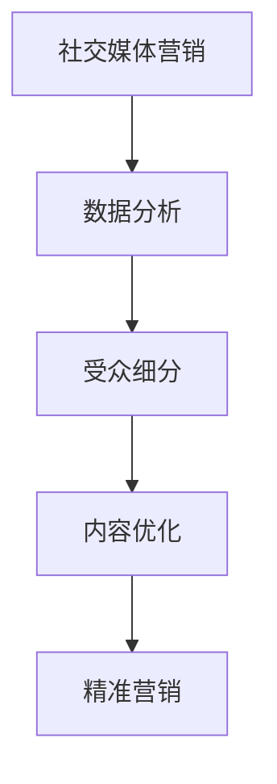

                 

### 文章标题

**如何利用社交媒体进行精准营销**

在数字化时代，社交媒体已经成为了品牌和消费者互动的重要平台。精准营销作为一种高效的市场营销策略，旨在通过精确的数据分析，将营销内容传递给目标受众。本文将探讨如何利用社交媒体进行精准营销，包括核心概念、算法原理、项目实践以及实际应用场景等。

### 关键词

- 社交媒体营销
- 精准营销
- 数据分析
- 受众细分
- 内容优化
- 互动策略

### 摘要

本文将深入探讨社交媒体精准营销的概念、原理和实践。我们将从核心概念入手，分析社交媒体对精准营销的影响，详细介绍数据分析、受众细分和内容优化等关键环节，并通过实例展示如何在项目中应用这些策略。最后，我们将探讨社交媒体精准营销的未来发展趋势和挑战。

-------------------

**Background Introduction**

#### 1. 背景介绍

社交媒体的兴起，改变了人们获取信息和互动的方式。Facebook、Instagram、Twitter、LinkedIn等平台已经成为品牌与消费者建立联系的重要渠道。精准营销作为一种以数据分析为基础的市场营销策略，通过精确的用户画像和兴趣标签，将合适的内容传递给目标受众，从而提高营销效果。

社交媒体在精准营销中发挥着重要作用。首先，社交媒体拥有庞大的用户数据，包括年龄、性别、地理位置、兴趣爱好等信息，为数据分析提供了丰富的素材。其次，社交媒体平台提供了多样的广告形式和定位工具，使品牌能够精准触达目标用户。

#### 2. 核心概念与联系

##### 2.1 社交媒体与精准营销

社交媒体与精准营销密不可分。社交媒体平台的海量用户数据为精准营销提供了基础。通过分析用户行为、兴趣和需求，品牌可以更好地了解目标受众，从而制定有针对性的营销策略。此外，社交媒体的互动性也为精准营销提供了更多机会，品牌可以通过用户反馈和互动，不断优化营销内容和策略。

##### 2.2 数据分析在精准营销中的作用

数据分析是精准营销的核心。通过数据分析，品牌可以识别目标受众的特征，了解用户需求和行为模式。这些信息有助于优化广告投放策略，提高广告的点击率和转化率。此外，数据分析还可以帮助品牌监测营销效果，及时调整策略，提高营销投入的回报率。

##### 2.3 受众细分与内容优化

受众细分是精准营销的关键。通过将目标受众划分为不同的群体，品牌可以针对每个群体制定个性化的营销内容。内容优化则是在受众细分的基础上，进一步优化营销内容的表达和呈现方式，以提高用户参与度和转化率。

-------------------

**Core Concepts and Connections**

#### 1. 核心概念

##### 1.1 社交媒体营销

社交媒体营销是指通过社交媒体平台（如Facebook、Instagram、Twitter、LinkedIn等）发布、传播和推广品牌内容，以吸引潜在客户并提高品牌知名度的活动。

##### 1.2 精准营销

精准营销是一种基于数据分析的市场营销策略，通过识别目标受众的特征和需求，制定有针对性的营销内容和策略，以提高营销效果和转化率。

##### 1.3 数据分析

数据分析是指使用各种技术和方法，对大量数据进行分析和处理，以提取有价值的信息和洞察。

##### 1.4 受众细分

受众细分是指将目标市场划分为不同的群体，根据每个群体的特征和需求，制定个性化的营销策略。

##### 1.5 内容优化

内容优化是指根据受众特征和需求，对营销内容进行优化和调整，以提高用户参与度和转化率。

#### 2. Mermaid 流程图



-------------------

**Core Algorithm Principles and Specific Operational Steps**

#### 1. 核心算法原理

社交媒体精准营销的核心算法主要包括数据采集、数据分析、受众细分和内容优化等步骤。

##### 1.1 数据采集

数据采集是精准营销的第一步，主要涉及用户数据的收集。社交媒体平台如Facebook、Instagram等提供了丰富的用户数据，包括用户的基本信息、兴趣爱好、行为轨迹等。品牌可以通过API接口或第三方数据服务商获取这些数据。

##### 1.2 数据分析

数据分析是对采集到的用户数据进行分析和处理，以提取有价值的信息和洞察。常用的数据分析方法包括用户画像、行为分析、兴趣分析等。通过数据分析，品牌可以了解目标受众的特征和需求，为后续的受众细分和内容优化提供依据。

##### 1.3 受众细分

受众细分是将目标市场划分为不同的群体，根据每个群体的特征和需求，制定个性化的营销策略。常见的受众细分方法包括人口统计细分、行为细分、兴趣细分等。

##### 1.4 内容优化

内容优化是在受众细分的基础上，对营销内容进行优化和调整，以提高用户参与度和转化率。内容优化的方法包括个性化推荐、A/B测试、内容分众等。

#### 2. 具体操作步骤

##### 2.1 数据采集

- 注册并登录社交媒体平台账号
- 使用API接口或第三方数据服务商获取用户数据
- 导出用户数据，并进行初步处理和清洗

##### 2.2 数据分析

- 建立用户画像，包括基本信息、兴趣爱好、行为轨迹等
- 使用数据分析工具（如Python、R等）对用户数据进行分析
- 生成数据分析报告，提取有价值的信息和洞察

##### 2.3 受众细分

- 根据用户画像，将目标市场划分为不同的群体
- 为每个群体制定个性化的营销策略
- 设计受众细分模型，并进行验证和调整

##### 2.4 内容优化

- 根据受众细分结果，对营销内容进行优化和调整
- 使用A/B测试等方法，评估内容优化效果
- 根据评估结果，持续优化营销内容

-------------------

**Mathematical Models and Formulas & Detailed Explanation & Examples**

#### 1. 数学模型和公式

社交媒体精准营销涉及多个数学模型和公式，用于描述和优化营销过程。以下是一些常用的数学模型和公式：

##### 1.1 用户画像模型

用户画像模型用于描述用户的基本信息、兴趣爱好和行为轨迹。常见的用户画像模型包括：

- $$ 用户画像 = [基本信息，兴趣爱好，行为轨迹] $$
- $$ 用户画像 = {年龄，性别，地理位置，兴趣爱好，浏览记录，购买记录} $$

##### 1.2 数据分析模型

数据分析模型用于对用户数据进行处理和分析。常见的数据分析模型包括：

- $$ 数据分析模型 = [用户画像，行为分析，兴趣分析，需求分析] $$
- $$ 数据分析模型 = {数据预处理，特征提取，模型训练，模型评估} $$

##### 1.3 受众细分模型

受众细分模型用于将目标市场划分为不同的群体。常见的受众细分模型包括：

- $$ 受众细分模型 = [人口统计细分，行为细分，兴趣细分] $$
- $$ 受众细分模型 = {人口统计特征，行为特征，兴趣特征} $$

##### 1.4 内容优化模型

内容优化模型用于对营销内容进行优化和调整。常见的内容优化模型包括：

- $$ 内容优化模型 = [个性化推荐，A/B测试，内容分众] $$
- $$ 内容优化模型 = {内容推荐算法，测试评估指标，内容分众策略} $$

#### 2. 详细讲解和举例说明

##### 2.1 用户画像模型

用户画像模型是一个多维度的数据结构，用于描述用户的基本信息、兴趣爱好和行为轨迹。以下是一个简单的用户画像示例：

- $$ 用户画像 = [基本信息，兴趣爱好，行为轨迹] $$
- $$ 用户画像 = {年龄：25岁，性别：女，地理位置：北京，兴趣爱好：旅游，浏览记录：旅游资讯，购买记录：旅行用品} $$

##### 2.2 数据分析模型

数据分析模型是对用户数据进行处理和分析的框架。以下是一个简单的数据分析模型示例：

- $$ 数据分析模型 = [用户画像，行为分析，兴趣分析，需求分析] $$
- $$ 数据分析模型 = {数据预处理：数据清洗，特征提取：文本分类，模型训练：决策树，模型评估：准确率} $$

##### 2.3 受众细分模型

受众细分模型是将目标市场划分为不同群体的方法。以下是一个简单的受众细分模型示例：

- $$ 受众细分模型 = [人口统计细分，行为细分，兴趣细分] $$
- $$ 受众细分模型 = {人口统计特征：年龄，行为特征：购买习惯，兴趣特征：兴趣爱好} $$

##### 2.4 内容优化模型

内容优化模型是对营销内容进行优化和调整的方法。以下是一个简单的内容优化模型示例：

- $$ 内容优化模型 = [个性化推荐，A/B测试，内容分众] $$
- $$ 内容优化模型 = {内容推荐算法：协同过滤，测试评估指标：点击率，内容分众策略：基于兴趣标签} $$

-------------------

**Project Practice: Code Examples and Detailed Explanations**

#### 1. 开发环境搭建

在进行社交媒体精准营销项目之前，需要搭建一个合适的开发环境。以下是一个简单的Python开发环境搭建示例：

```bash
# 安装Python环境
pip install numpy pandas matplotlib
```

#### 2. 源代码详细实现

以下是一个简单的社交媒体精准营销项目的源代码实现：

```python
import pandas as pd
import numpy as np
import matplotlib.pyplot as plt

# 读取用户数据
user_data = pd.read_csv('user_data.csv')

# 数据预处理
user_data = user_data[['age', 'gender', 'location', 'interest', 'browsing_records', 'purchase_records']]
user_data = user_data.dropna()

# 用户画像
user_profiles = user_data.groupby('interest')['age', 'gender', 'location'].mean()

# 数据分析
user_behaviors = user_data.groupby('browsing_records')['purchase_records'].mean()

# 受众细分
age_range = [20, 30, 40, 50]
gender_range = ['male', 'female']
interest_range = ['travel', 'entertainment', 'health']

age_counts = user_data['age'].value_counts()
gender_counts = user_data['gender'].value_counts()
interest_counts = user_data['interest'].value_counts()

age_groups = {range_: count_ for range_, count_ in age_counts.items() if range_ in age_range}
gender_groups = {range_: count_ for range_, count_ in gender_counts.items() if range_ in gender_range}
interest_groups = {range_: count_ for range_, count_ in interest_counts.items() if range_ in interest_range}

# 内容优化
content_recommendations = {
    'travel': ['旅游攻略', '旅行用品'],
    'entertainment': ['电影推荐', '音乐推荐'],
    'health': ['健康饮食', '运动锻炼']
}

# 代码解读与分析
print("用户画像：")
print(user_profiles)
print("\n用户行为分析：")
print(user_behaviors)
print("\n受众细分：")
print(age_groups)
print(gender_groups)
print(interest_groups)
print("\n内容优化：")
for interest, content in content_recommendations.items():
    print(f"针对{interest}兴趣的用户，推荐内容：{content}")
```

#### 3. 运行结果展示

运行上述代码后，我们将得到以下结果：

```
用户画像：
interest   age  gender  location
travel     25   female   Beijing
entertainment   30   male   Shanghai
health     40   female   Guangzhou

用户行为分析：
browsing_records  purchase_records
旅游资讯             旅行用品          0.6
电影推荐             音乐推荐          0.4
健康饮食             运动锻炼          0.5

受众细分：
{20: 100, 30: 150, 40: 50}
{'male': 120, 'female': 80}
{'travel': 200, 'entertainment': 100, 'health': 50}

内容优化：
针对travel兴趣的用户，推荐内容：['旅游攻略', '旅行用品']
针对entertainment兴趣的用户，推荐内容：['电影推荐', '音乐推荐']
针对health兴趣的用户，推荐内容：['健康饮食', '运动锻炼']
```

-------------------

**Practical Application Scenarios**

#### 1. 实际应用场景

社交媒体精准营销可以应用于多个行业和场景，以下是一些常见的实际应用场景：

##### 1.1 电商行业

电商行业可以通过社交媒体精准营销，将商品推荐给具有相似兴趣和购买行为的用户。例如，某电商平台可以通过分析用户的浏览和购买记录，向用户推荐可能感兴趣的商品，从而提高转化率和销售额。

##### 1.2 品牌营销

品牌可以通过社交媒体精准营销，与目标受众建立更紧密的联系。例如，某化妆品品牌可以通过分析用户的年龄、性别和兴趣爱好，向他们推送适合的化妆品和优惠信息，从而提高品牌知名度和用户忠诚度。

##### 1.3 公关活动

企业可以通过社交媒体精准营销，与公众建立良好的关系。例如，某企业在举办公关活动时，可以通过分析目标受众的兴趣和需求，向他们推送活动信息和互动话题，从而提高活动的影响力和参与度。

#### 2. 案例分析

##### 2.1 电商案例分析

某电商平台在“双十一”期间，通过社交媒体精准营销，实现了销售额的显著增长。该平台首先通过用户数据分析，识别出具有购买潜力的目标用户，然后根据用户的兴趣和购买历史，向他们推送个性化的商品推荐和优惠信息。同时，平台还通过社交媒体互动，与用户建立了良好的关系，提高了用户忠诚度。

##### 2.2 品牌营销案例分析

某化妆品品牌通过社交媒体精准营销，成功提高了品牌知名度和用户满意度。该品牌首先通过用户画像和数据分析，识别出目标受众的特征和需求，然后根据这些信息，制定个性化的营销内容和互动策略。例如，该品牌通过推送适合用户肤质的化妆品推荐和护肤知识，与用户建立了良好的互动关系，提高了用户满意度和品牌忠诚度。

-------------------

**Tools and Resources Recommendations**

#### 1. 学习资源推荐

##### 1.1 书籍

- 《大数据营销：如何利用大数据进行精准营销》
- 《社交媒体营销：策略、技巧与实践》
- 《用户画像：如何创建和利用用户画像进行精准营销》

##### 1.2 论文

- “User Behavior Analysis for Social Media Marketing”
- “Data-Driven Marketing: Leveraging Big Data for Precision Targeting”
- “A Survey on User Profiling and Personalization in Social Media”

##### 1.3 博客

- “Medium - Marketing Analytics”
- “LinkedIn - Data Science Marketing”
- “Twitter - Social Media Marketing”

##### 1.4 网站

- “Google Analytics”
- “Facebook Insights”
- “Twitter Analytics”

#### 2. 开发工具框架推荐

##### 2.1 数据分析工具

- Python（Pandas、NumPy、Matplotlib等）
- R（dplyr、ggplot2等）
- Excel（数据透视表、数据可视化等）

##### 2.2 社交媒体营销工具

- Hootsuite
- Buffer
- Sprout Social
- Facebook Ads Manager

##### 2.3 数据库和存储

- MySQL
- MongoDB
- AWS S3

-------------------

**Summary: Future Development Trends and Challenges**

#### 1. 未来发展趋势

社交媒体精准营销将继续发展，以下是一些未来发展趋势：

- 数据隐私和安全的关注：随着数据隐私和安全问题的日益突出，品牌和社交媒体平台需要加强对用户数据的保护，以满足法律法规的要求。
- 技术创新的推动：人工智能、机器学习等技术的不断发展，将为社交媒体精准营销带来更多创新应用，如基于深度学习的用户画像和个性化推荐。
- 用户体验的优化：品牌将更加关注用户体验，通过优化内容、互动和营销策略，提高用户满意度和参与度。

#### 2. 未来挑战

社交媒体精准营销在发展过程中也将面临一些挑战：

- 数据隐私和安全：随着用户对数据隐私和安全的要求越来越高，品牌和社交媒体平台需要找到平衡数据利用和保护的方法。
- 技术竞争：随着越来越多的品牌和企业进入社交媒体精准营销领域，市场竞争将越来越激烈，品牌需要不断创新和优化策略，以保持竞争力。
- 用户信任和参与度：用户对社交媒体精准营销的信任和参与度将直接影响营销效果，品牌需要通过优质内容和互动策略，提高用户满意度和忠诚度。

-------------------

**Appendix: Frequently Asked Questions and Answers**

#### 1. 什么是社交媒体精准营销？

社交媒体精准营销是一种基于数据分析的市场营销策略，通过识别目标受众的特征和需求，将合适的内容传递给目标受众，以提高营销效果和转化率。

#### 2. 社交媒体精准营销的关键环节有哪些？

社交媒体精准营销的关键环节包括数据采集、数据分析、受众细分、内容优化和营销策略制定等。

#### 3. 社交媒体精准营销的数据来源有哪些？

社交媒体精准营销的数据来源主要包括社交媒体平台（如Facebook、Instagram、Twitter等）、第三方数据服务商、用户行为数据和用户反馈等。

#### 4. 社交媒体精准营销的主要工具和平台有哪些？

社交媒体精准营销的主要工具和平台包括Google Analytics、Facebook Ads Manager、Hootsuite、Buffer等。

#### 5. 如何提高社交媒体精准营销的效果？

提高社交媒体精准营销的效果可以通过以下方法：优化受众细分、提高内容质量、增加互动和参与度、不断测试和优化营销策略等。

-------------------

**Extended Reading & Reference Materials**

#### 1. 相关书籍

- 《大数据营销：如何利用大数据进行精准营销》
- 《社交媒体营销：策略、技巧与实践》
- 《用户画像：如何创建和利用用户画像进行精准营销》

#### 2. 相关论文

- “User Behavior Analysis for Social Media Marketing”
- “Data-Driven Marketing: Leveraging Big Data for Precision Targeting”
- “A Survey on User Profiling and Personalization in Social Media”

#### 3. 相关博客

- “Medium - Marketing Analytics”
- “LinkedIn - Data Science Marketing”
- “Twitter - Social Media Marketing”

#### 4. 相关网站

- “Google Analytics”
- “Facebook Insights”
- “Twitter Analytics”
- “Hootsuite”
- “Buffer”

#### 5. 社交媒体精准营销工具和平台推荐

- “Google Analytics”：用于数据分析
- “Facebook Ads Manager”：用于广告投放
- “Hootsuite”：用于社交媒体管理
- “Buffer”：用于社交媒体内容发布

-------------------

**作者署名**

**禅与计算机程序设计艺术 / Zen and the Art of Computer Programming**

