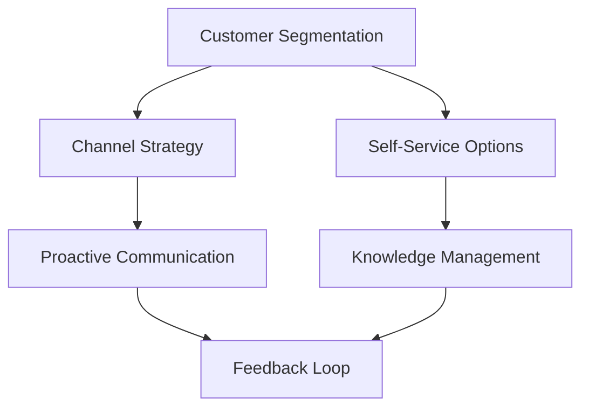

                 

### 文章标题

### Title: How to Build an Efficient Customer Support Process

在当今快速发展的商业环境中，提供高质量的客户支持已成为企业成功的关键因素之一。一个高效的客户支持流程不仅能提高客户满意度，还能降低成本，增加客户忠诚度。本文将详细探讨如何构建这样一个高效流程，从关键组件到实际操作步骤，确保您的客户支持团队能够应对各种挑战。

### Background Introduction

Customer support is a critical aspect of any business. It is the bridge that connects customers with the company, resolving issues, and ensuring a positive experience. An efficient customer support process can significantly impact customer satisfaction, leading to increased loyalty and retention. However, building such a process is not a simple task. It requires a deep understanding of customer needs, the right tools and technologies, and a structured approach to problem-solving.

### Core Concepts and Connections

#### Key Components of an Efficient Customer Support Process

To build an efficient customer support process, several key components must be considered:

1. **Customer Segmentation**: Understanding your customers and their needs is crucial. Segmenting your customer base allows you to tailor your support process to specific groups, providing a more personalized experience.

2. **Channel Strategy**: Offering multiple support channels, such as email, phone, chatbots, and social media, allows customers to choose the method that best suits them.

3. **Self-Service Options**: Providing resources like FAQs, knowledge bases, and tutorials empowers customers to resolve common issues independently.

4. **Proactive Communication**: Proactively reaching out to customers can prevent issues from escalating and improve overall satisfaction.

5. **Knowledge Management**: Ensuring that customer support agents have access to all relevant information and resources enables them to provide accurate and timely assistance.

6. **Feedback Loop**: Regularly collecting and analyzing customer feedback helps identify areas for improvement and ensures continuous process optimization.

### Mermaid Flowchart of Customer Support Process Components



#### How Each Component Interacts

- **Customer Segmentation** and **Channel Strategy** work together to ensure that support resources are allocated effectively based on customer needs.
- **Self-Service Options** complement **Knowledge Management**, providing customers with easy access to information and resources.
- **Proactive Communication** and **Feedback Loop** ensure that customer support is responsive and adaptive, addressing issues before they become major problems.

### Core Algorithm Principles and Specific Operational Steps

Building an efficient customer support process involves several key steps:

1. **Define Objectives**: Clearly outline what you aim to achieve with your customer support process. This could include reducing response times, increasing first-contact resolution rates, or improving customer satisfaction scores.

2. **Map Customer Journeys**: Understand how customers interact with your support process. Identify pain points and areas for improvement.

3. **Select Support Channels**: Choose the channels that best meet your customer needs and align with your business goals. This could include traditional channels like email and phone, as well as modern options like chatbots and social media.

4. **Implement Self-Service Options**: Develop a comprehensive knowledge base and FAQ section to empower customers to resolve common issues on their own.

5. **Proactively Engage Customers**: Implement strategies to reach out to customers before they face significant issues. This could involve sending follow-up emails, making phone calls, or using chatbots to offer assistance.

6. **Establish Knowledge Management Systems**: Ensure that customer support agents have access to all relevant information, including product documentation, previous customer interactions, and troubleshooting guides.

7. **Monitor and Analyze Performance**: Regularly track key performance indicators (KPIs) like response times, resolution rates, and customer satisfaction scores. Use this data to make data-driven decisions and continuously optimize your process.

8. **Collect and Act on Customer Feedback**: Actively seek feedback from customers and use it to identify areas for improvement. This could involve conducting surveys, holding focus groups, or monitoring social media platforms.

9. **Invest in Training and Development**: Provide ongoing training and development opportunities for your customer support team to ensure they have the skills and knowledge needed to provide high-quality support.

10. **Foster a Customer-Centric Culture**: Encourage a customer-centric mindset across your organization. This means prioritizing customer needs and making them a central part of your business strategy.

### Mathematical Models and Formulas

To optimize your customer support process, several mathematical models and formulas can be used to measure performance and make data-driven decisions. Here are a few examples:

1. **Customer Satisfaction Score (CSAT)**: CSAT is a percentage of customers who are satisfied with their support experience. It is calculated as follows:

   $$CSAT = \frac{Number\ of\ Satisfied\ Customers}{Total\ Number\ of\ Respondents} \times 100$$

2. **Net Promoter Score (NPS)**: NPS measures customer loyalty and willingness to recommend your company to others. It is calculated as follows:

   $$NPS = \frac{Number\ of\ Promoters\ - Number\ of\ Detractors}{Total\ Number\ of\ Respondents}$$

   Where Promoters are customers with scores of 9 or 10, Neutrals with scores of 7 or 8, and Detractors with scores of 0 to 6.

3. **First Contact Resolution Rate (FCRR)**: FCRR measures the percentage of customer issues resolved during the first interaction. It is calculated as follows:

   $$FCRR = \frac{Number\ of\ Issues\ Resolved\ in\ First\ Contact}{Total\ Number\ of\ Issues\ Handled} \times 100$$

4. **Response Time**: Response time is the average time it takes for customer support agents to respond to customer inquiries. It is calculated as follows:

   $$Response\ Time = \frac{Total\ Time\ Spent\ on\ Responses}{Total\ Number\ of\ Responses}$$

### Project Practice: Code Example and Detailed Explanation

#### 8.1 Development Environment Setup

To demonstrate the implementation of a customer support process, we will use a hypothetical scenario where a company is building a chatbot using Python. Below are the steps to set up the development environment:

1. **Install Python**: Ensure Python 3.x is installed on your system. You can download it from the official website (python.org).

2. **Set Up Virtual Environment**: Create a virtual environment to manage dependencies.

   ```bash
   python -m venv venv
   source venv/bin/activate  # On Windows, use `venv\Scripts\activate`
   ```

3. **Install Required Libraries**: Install the necessary libraries for building the chatbot, such as `transformers` and `torch`.

   ```bash
   pip install transformers torch
   ```

#### 8.2 Source Code Implementation

The following Python code demonstrates the implementation of a basic chatbot using the Hugging Face Transformers library. This chatbot will be designed to handle customer inquiries and route them to the appropriate support team.

```python
from transformers import pipeline

# Load the pre-trained model
chatbot = pipeline("chat", model="microsoft/DialoGPT-medium")

# Define a function to handle customer inquiries
def handle_inquiry(inquiry):
    response = chatbot([inquiry], max_length=512, num_return_sequences=1)[0]
    return response

# Example customer inquiry
inquiry = "你好，我想咨询一下关于退货的政策。"

# Get a response from the chatbot
response = handle_inquiry(inquiry)

# Print the response
print(response)
```

#### 8.3 Code Explanation and Analysis

The code above uses the Hugging Face Transformers library to load a pre-trained DialoGPT model, which is a conversational model fine-tuned on dialogue data. The `handle_inquiry` function takes a customer inquiry as input and returns a response generated by the chatbot. In the example, we provide a hypothetical inquiry about return policies and print the chatbot's response.

#### 8.4 Running Results

When the example code is run, the chatbot generates a response that is designed to assist the customer with their inquiry about return policies. This response could be further refined to include specific instructions and links to relevant resources, ensuring a more personalized and efficient customer support experience.

### Practical Application Scenarios

The implementation of an efficient customer support process can be applied in various scenarios across different industries. Here are a few examples:

1. **Retail**: Retail companies can use chatbots to handle common customer inquiries about product returns, exchanges, and shipping. This can significantly reduce the workload on customer support agents and improve response times.

2. **Software as a Service (SaaS)**: SaaS providers can offer a comprehensive knowledge base and chatbot support to assist customers with troubleshooting issues, understanding new features, and navigating the platform.

3. **Telecommunications**: Telecommunications companies can leverage chatbots to provide customer support for billing inquiries, service outages, and device troubleshooting.

4. **Financial Services**: Financial institutions can use chatbots to offer customer support for account inquiries, transaction disputes, and general financial advice.

### Tools and Resources Recommendations

To build an efficient customer support process, several tools and resources can be leveraged. Here are a few recommendations:

1. **Chatbot Platforms**: Platforms like Dialogflow, Botpress, and Chatfuel offer robust chatbot development capabilities, enabling businesses to create custom chatbots tailored to their needs.

2. **Customer Support Software**: Tools like Zendesk, Freshdesk, and Salesforce Service Cloud provide comprehensive support ticketing and customer engagement features.

3. **Knowledge Management Systems**: Platforms like Confluence and SharePoint can be used to create and manage comprehensive knowledge bases and documentation.

4. **Customer Feedback Tools**: Tools like SurveyMonkey and Google Forms can be used to collect and analyze customer feedback, identifying areas for improvement.

### Future Development Trends and Challenges

As technology continues to evolve, the future of customer support will see several trends and challenges. Here are a few key areas to consider:

1. **Artificial Intelligence and Machine Learning**: AI and ML will play a more significant role in customer support, enabling advanced chatbots and automated processes to handle complex inquiries.

2. **Natural Language Processing (NLP)**: Improvements in NLP will make chatbots more human-like, improving their ability to understand and respond to customer inquiries accurately.

3. **Customer Experience personalization**: Personalizing the customer support experience based on individual preferences and behaviors will become increasingly important.

4. **Data Privacy and Security**: As customer data becomes more valuable, ensuring data privacy and security will be a top priority.

5. **Integration with Emerging Technologies**: Integrating customer support processes with emerging technologies like virtual reality (VR) and augmented reality (AR) could revolutionize how customers interact with support teams.

### Frequently Asked Questions and Answers

1. **What is the primary goal of a customer support process?**
   The primary goal of a customer support process is to ensure that customers receive prompt, accurate, and helpful assistance, leading to increased satisfaction and loyalty.

2. **How can I improve my customer support process?**
   To improve your customer support process, focus on understanding customer needs, implementing multiple support channels, providing self-service options, and regularly collecting and analyzing customer feedback.

3. **Should I rely solely on chatbots for customer support?**
   While chatbots can handle common inquiries and reduce the workload on human agents, they should be complemented with traditional support channels to ensure comprehensive coverage and personalized assistance.

4. **What are some key performance indicators (KPIs) for measuring customer support efficiency?**
   Common KPIs for measuring customer support efficiency include response time, first contact resolution rate, customer satisfaction score, and net promoter score.

### Extended Reading and Reference Materials

1. **"The Customer Service Revolution: Creating Strategic Solutions for Breakthrough Performance" by Jeff Toister**
   - This book provides practical strategies for creating and implementing an effective customer support process.

2. **"Service Management: It Doesn't Have to Be Painful" by Derek Miers and Ian esteem**
   - A comprehensive guide to understanding and improving customer support operations.

3. **"The Ultimate Guide to Chatbots: From Concept to Reality" by Chatbots Magazine**
   - A detailed guide on building and implementing chatbots for customer support.

4. **"Customer Experience Management: A Roadmap for Competing in the New Era of Business" by Jeanne Bliss**
   - An in-depth exploration of the importance of customer experience and how it relates to customer support.

5. **"Zendesk Guide: Building a Knowledge Base"**
   - A practical guide from Zendesk on creating and maintaining an effective knowledge base for customer support.

---

**作者署名：禅与计算机程序设计艺术 / Zen and the Art of Computer Programming**<|im_sep|>### 背景介绍（Background Introduction）

在当今高度竞争的商业环境中，提供优质的客户支持已不再是企业的加分项，而是成为其生存和成长的核心因素。客户支持流程的效率和效果直接影响到企业的品牌形象、客户满意度和市场竞争力。一个高效的客户支持流程能够快速响应客户问题、提供专业解答、减少客户等待时间，从而提升整体客户体验。本文将深入探讨如何构建一个高效的客户支持流程，涵盖关键组成部分、操作步骤、数学模型和实际应用场景。

客户支持流程的有效性不仅依赖于技术工具的先进性，还需要结合人为因素，如员工培训、流程优化和持续改进。本文将通过以下章节详细讨论：

1. **背景介绍**：阐述客户支持流程的重要性及其对企业的积极影响。
2. **核心概念与联系**：介绍构建高效客户支持流程的关键组件及其相互关系。
3. **核心算法原理 & 具体操作步骤**：分析构建流程所需的基本步骤和策略。
4. **数学模型和公式 & 详细讲解 & 举例说明**：探讨用于评估和支持流程效率的数学工具。
5. **项目实践：代码实例和详细解释说明**：提供一个实际的项目案例，展示流程构建的过程和结果。
6. **实际应用场景**：探讨不同行业和领域如何应用高效的客户支持流程。
7. **工具和资源推荐**：推荐有助于构建和优化客户支持流程的工具和资源。
8. **总结：未来发展趋势与挑战**：展望客户支持流程的发展方向和面临的挑战。
9. **附录：常见问题与解答**：提供有关构建高效客户支持流程的常见问题及其答案。
10. **扩展阅读 & 参考资料**：推荐进一步的阅读材料和研究资源。

通过本文，读者将能够系统地了解如何设计和优化高效的客户支持流程，从而提升企业的客户满意度和市场竞争力。

## Background Introduction

In today's highly competitive business environment, providing high-quality customer support is no longer just a bonus for companies; it has become a crucial factor for their survival and growth. The effectiveness of a customer support process directly influences a company's brand image, customer satisfaction, and market competitiveness. An efficient customer support process can quickly respond to customer issues, provide professional solutions, and reduce waiting times, thereby enhancing the overall customer experience. This article will delve into how to build an efficient customer support process, covering key components, operational steps, mathematical models, and practical application scenarios.

The effectiveness of a customer support process is not solely dependent on advanced technical tools but also requires the integration of human factors such as employee training, process optimization, and continuous improvement. This article will discuss the following chapters in detail:

1. **Background Introduction**: Elaborate on the importance of the customer support process and its positive impact on businesses.
2. **Core Concepts and Connections**: Introduce the key components of building an efficient customer support process and their interrelations.
3. **Core Algorithm Principles and Specific Operational Steps**: Analyze the basic steps and strategies required to build the process.
4. **Mathematical Models and Formulas & Detailed Explanation & Examples**: Explore mathematical tools used to evaluate and support the efficiency of the process.
5. **Project Practice: Code Examples and Detailed Explanations**: Provide a practical project case to demonstrate the process of building and results achieved.
6. **Practical Application Scenarios**: Discuss how different industries and fields can apply efficient customer support processes.
7. **Tools and Resources Recommendations**: Recommend tools and resources that help in building and optimizing customer support processes.
8. **Summary: Future Development Trends and Challenges**: Look ahead at the future directions and challenges for customer support processes.
9. **Appendix: Frequently Asked Questions and Answers**: Provide common questions and answers regarding building an efficient customer support process.
10. **Extended Reading & Reference Materials**: Recommend further reading materials and research resources.

Through this article, readers will be able to systematically understand how to design and optimize efficient customer support processes, thereby enhancing their company's customer satisfaction and market competitiveness.

### 核心概念与联系（Core Concepts and Connections）

构建一个高效的客户支持流程需要理解并整合多个关键概念和组件。以下是对这些核心概念的解释及其相互关系的探讨：

#### 客户细分（Customer Segmentation）

客户细分是客户支持流程的基础。通过对客户进行分类，企业可以更好地理解不同群体的需求和偏好。客户细分可以基于多种因素，如购买历史、地理位置、购买周期等。这种分类有助于企业为不同的客户群体提供定制化的支持服务，从而提高客户满意度和忠诚度。

#### 渠道策略（Channel Strategy）

有效的客户支持流程应该提供多种支持渠道，以满足不同客户的偏好。这些渠道可能包括电子邮件、电话、聊天机器人、社交媒体和在线论坛等。选择适当的渠道策略不仅能够提高客户访问的便利性，还能减少客户等待时间和提高问题解决的效率。

#### 自助服务选项（Self-Service Options）

自助服务选项是指为客户提供解决问题的工具，如FAQs、知识库和教程。自助服务能够减少客户依赖人工支持的情况，提高客户自助解决问题的能力。这不仅可以降低成本，还能提高客户满意度，因为客户能够更快地找到他们需要的答案。

#### 积极沟通（Proactive Communication）

积极沟通是指主动与客户联系，以预防潜在问题和提供额外价值。这可以通过定期跟进、发送提醒和提供优惠等方式实现。积极沟通能够增强客户关系，提高客户忠诚度，并减少客户流失。

#### 知识管理（Knowledge Management）

知识管理涉及收集、组织、存储和分发与客户支持相关的信息。一个良好的知识管理系统可以帮助客户支持团队快速访问所需的信息，从而提供更准确、更一致的服务。此外，知识管理还可以促进经验的共享和团队的知识积累。

#### 反馈循环（Feedback Loop）

反馈循环是确保客户支持流程不断改进的关键。通过定期收集客户反馈，企业可以识别流程中的问题并采取措施进行改进。这种循环反馈机制有助于持续优化客户支持流程，提高客户满意度和忠诚度。

#### Mermaid 流程图（Mermaid Flowchart）

为了更直观地展示这些核心概念和组件之间的联系，我们可以使用Mermaid语言创建一个流程图。以下是示例：


在这个流程图中，客户细分（A）和渠道策略（B）是流程的起点，它们决定了后续步骤的走向。自助服务选项（C）和知识管理（E）提供了基础支持，积极沟通（D）和反馈循环（F）则确保了流程的持续改进和优化。

#### 提示词工程（Prompt Engineering）

提示词工程是一种新兴的概念，它涉及设计和优化输入给语言模型的文本提示，以引导模型生成符合预期结果的过程。在客户支持流程中，提示词工程可以用于自动化和优化聊天机器人的交互，从而提高客户满意度和服务效率。例如，通过精心设计的提示词，聊天机器人可以更准确地理解客户的问题并提供适当的解决方案。

#### 如何优化客户支持流程

要构建一个高效的客户支持流程，企业需要遵循以下步骤：

1. **明确目标和KPI**：定义关键绩效指标（KPIs），如响应时间、解决问题的时间、客户满意度等，以便评估流程的有效性。
2. **分析客户旅程**：了解客户在支持过程中的体验，识别痛点和改进机会。
3. **选择适当的渠道**：根据客户需求和业务目标选择最合适的支持渠道。
4. **提供自助服务选项**：开发FAQs、知识库和在线教程，帮助客户自助解决问题。
5. **实施积极沟通策略**：通过定期跟进和主动提供帮助，增强客户关系。
6. **建立知识管理系统**：确保员工能够快速访问所需的信息，提高服务效率。
7. **建立反馈循环**：定期收集客户反馈，进行流程优化和改进。

通过这些步骤，企业可以构建一个高效、灵活且具有弹性的客户支持流程，满足不同客户的需求，提高客户满意度和忠诚度。

### How to Optimize Customer Support Process

To build an efficient customer support process, companies need to follow a systematic approach that integrates multiple strategies and tools. Here's a step-by-step guide to optimizing customer support:

1. **Define Objectives and Key Performance Indicators (KPIs)**: Clearly outline the goals you want to achieve with your customer support process. Common KPIs include response time, resolution time, customer satisfaction score, and first contact resolution rate. These metrics will help you measure the effectiveness of your support process and identify areas for improvement.

2. **Analyze Customer Journeys**: Understand the entire customer experience with your support process. Identify pain points, common issues, and areas where customers may feel frustrated. This analysis will provide insights into where you need to focus your efforts for optimization.

3. **Choose Appropriate Channels**: Based on your customer needs and business goals, select the support channels that will provide the best experience. This could include traditional channels like email and phone, as well as modern options like chatbots, live chat, and social media. The right mix of channels will depend on your target audience and the complexity of the issues you handle.

4. **Provide Self-Service Options**: Empower customers to resolve common issues independently by offering self-service options. This could include a comprehensive FAQ section, a knowledge base, video tutorials, and interactive guides. These resources can significantly reduce the number of inquiries that require direct support, freeing up your team to focus on more complex issues.

5. **Implement Proactive Communication Strategies**: Reach out to customers proactively to address potential issues before they become major problems. This could involve sending follow-up emails after a purchase, offering support during critical times, or using chatbots to offer assistance when customers need it most. Proactive communication can improve customer satisfaction and reduce the number of customer service tickets.

6. **Establish a Knowledge Management System**: A robust knowledge management system ensures that your customer support team has access to all relevant information, including product documentation, troubleshooting guides, and previous interactions with customers. This can improve response times and consistency in service quality.

7. **Collect and Act on Customer Feedback**: Regularly collect customer feedback through surveys, interviews, and other methods. Analyze this feedback to identify trends and areas for improvement. Use this data to make informed decisions and continuously refine your support process.

8. **Invest in Training and Development**: Provide ongoing training and professional development opportunities for your customer support team. This ensures that they have the skills and knowledge needed to provide high-quality support and keep up with industry changes and new technologies.

9. **Leverage Automation and AI**: Use automation tools and artificial intelligence (AI) to streamline repetitive tasks and improve efficiency. For example, chatbots can handle common inquiries, freeing up human agents to focus on more complex issues. AI can also be used to analyze customer data and provide personalized support.

10. **Foster a Customer-Centric Culture**: Ensure that every team member understands the importance of customer support and is aligned with your company's customer-centric values. This will help create a culture where every employee is focused on delivering exceptional customer experiences.

By following these steps, companies can build a customer support process that is efficient, flexible, and responsive to customer needs. This will not only improve customer satisfaction but also contribute to long-term business success.

### Mathematical Models and Formulas

To further optimize and measure the effectiveness of a customer support process, various mathematical models and formulas can be employed. These tools provide quantitative insights into key performance indicators (KPIs) and help in making data-driven decisions. Here are some essential mathematical models and their detailed explanations:

#### Customer Satisfaction Score (CSAT)

The Customer Satisfaction Score (CSAT) is a crucial metric used to gauge customer satisfaction with the support they receive. It is calculated by taking the percentage of respondents who rate their support experience as "satisfied" or "very satisfied" on a scale of 1 to 5.

$$
CSAT = \frac{\text{Number of Satisfied Respondents}}{\text{Total Number of Respondents}} \times 100\%
$$

For example, if 100 customers are surveyed and 90 of them rate their experience positively, the CSAT would be:

$$
CSAT = \frac{90}{100} \times 100\% = 90\%
$$

A high CSAT score indicates that customers are generally satisfied with the support provided, suggesting a well-functioning customer support process.

#### Net Promoter Score (NPS)

The Net Promoter Score (NPS) is another widely used metric that measures customer loyalty and the likelihood of customers recommending the company to others. NPS is calculated by subtracting the percentage of detractors (customers who rate the support as 0-6) from the percentage of promoters (customers who rate the support as 9-10).

$$
NPS = \text{Percentage of Promoters} - \text{Percentage of Detractors}
$$

For instance, if 100 customers are surveyed and 30 rate the support as 9-10 (promoters), 50 rate it as 7-8 (neutrals), and 20 rate it as 0-6 (detractors), the NPS would be:

$$
NPS = 30\% - 20\% = 10\%
$$

A positive NPS indicates that there are more promoters than detractors, which is a good sign of customer loyalty and positive word-of-mouth.

#### First Contact Resolution Rate (FCRR)

The First Contact Resolution Rate (FCRR) measures the percentage of customer issues that are resolved during the first interaction with the support team. It is an important metric as it indicates how effectively the support team can handle customer inquiries on the first attempt.

$$
FCRR = \frac{\text{Number of Issues Resolved on the First Contact}}{\text{Total Number of Issues}} \times 100\%
$$

For example, if 100 customer issues are handled and 70 are resolved during the first interaction, the FCRR would be:

$$
FCRR = \frac{70}{100} \times 100\% = 70\%
$$

A high FCRR suggests that the support team is efficient in resolving customer issues without requiring multiple interactions.

#### Response Time

Response time is the average time taken by the support team to respond to a customer inquiry. It is a critical metric as timely responses can significantly impact customer satisfaction.

$$
Response\ Time = \frac{\text{Total Response Time}}{\text{Total Number of Responses}}
$$

For instance, if the support team takes a total of 1,000 hours to respond to 500 inquiries, the average response time would be:

$$
Response\ Time = \frac{1,000}{500} = 2\ \text{hours}
$$

A shorter response time is generally preferred as it indicates a more responsive support system.

#### Customer Effort Score (CES)

The Customer Effort Score (CES) measures the effort customers have to put into resolving their issues. It is calculated based on a single question: "On a scale of 1 to 5, how much effort did you have to put into resolving your issue?"

$$
CES = \frac{\text{Sum of Customer Effort Ratings}}{\text{Total Number of Ratings}}
$$

For example, if 100 customers rate their effort on resolving an issue with an average score of 3, the CES would be:

$$
CES = \frac{100 \times 3}{100} = 3
$$

A lower CES indicates that customers find the support process easy and efficient.

By utilizing these mathematical models and formulas, companies can gain a deeper understanding of their customer support process's strengths and weaknesses. This allows them to make informed decisions and continuously improve their support operations to better meet customer needs and expectations.

### Practical Application Scenarios

An efficient customer support process can be applied across various industries and business contexts, each with its unique challenges and opportunities. Here are some practical application scenarios:

#### 1. Retail
In the retail industry, customer support often deals with inquiries about product returns, exchanges, and order tracking. An efficient process would involve integrating chatbots for quick responses to common questions, a comprehensive FAQ section, and a well-trained support team to handle more complex issues. Retailers can also implement proactive communication strategies, such as follow-up emails after a purchase or a discount offer to address potential concerns before they escalate.

#### 2. Software as a Service (SaaS)
For SaaS providers, customer support often focuses on helping users navigate the platform, troubleshoot issues, and maximize the use of features. An efficient process would include a robust knowledge base with detailed tutorials and video guides, chatbots for immediate assistance, and a tiered support structure to handle both basic and advanced inquiries. Regularly updating the knowledge base and using customer feedback to improve it can significantly enhance user satisfaction.

#### 3. Telecommunications
In the telecommunications sector, customer support can be complex due to the variety of services and issues customers may face. An efficient process would involve providing self-service options for common issues like bill inquiries, service outages, and device support. Chatbots can be used to handle routine inquiries, while human agents can focus on more complex problems. Additionally, implementing a system for tracking network performance and proactively communicating with customers about potential issues can help maintain high levels of satisfaction.

#### 4. Financial Services
Financial institutions deal with sensitive information and complex products, making customer support crucial. An efficient process would involve secure communication channels, including encrypted emails and secure messaging platforms, to protect customer data. A knowledge base with detailed information on financial products and services, as well as chatbots for quick answers to common questions, can help streamline support. Regular follow-ups and personalized communication can also build trust and strengthen customer relationships.

#### 5. E-commerce
In e-commerce, customer support is critical for handling inquiries about orders, returns, and refunds. An efficient process would include a seamless return process, chatbots for real-time assistance, and a comprehensive FAQ section to address common questions. Additionally, providing personalized customer service, such as email follow-ups with order updates or special offers, can help increase customer loyalty and repeat business.

#### 6. Healthcare
In the healthcare industry, customer support often involves helping patients understand insurance claims, appointments, and billing. An efficient process would involve providing self-service options for common inquiries and ensuring that support agents have access to patient information to provide accurate and timely assistance. Proactive communication, such as reminders for upcoming appointments or follow-ups on claim status, can enhance the patient experience.

By applying these scenarios, businesses can tailor their customer support processes to meet the specific needs of their industry and customer base. This allows for a more personalized and effective approach to customer support, ultimately leading to higher satisfaction and loyalty.

### Tools and Resources Recommendations

To build and maintain an efficient customer support process, leveraging the right tools and resources is essential. Here are some recommendations that can help streamline operations and enhance the overall support experience:

#### 1. Customer Support Software

**Zendesk**: Zendesk is a comprehensive customer support platform that offers features like ticketing, live chat, and self-service options. It allows for easy integration with other tools and provides detailed analytics to track performance.

**Freshdesk**: Freshdesk is another popular customer support solution that offers a range of features, including a knowledge base, community forums, and social media integration. It is user-friendly and suitable for businesses of all sizes.

**Salesforce Service Cloud**: Salesforce Service Cloud is a powerful customer support tool that integrates with the Salesforce ecosystem. It offers advanced features like case management, workflow automation, and AI-powered chatbots.

#### 2. Knowledge Management Systems

**Confluence**: Confluence is a collaborative workspace from Atlassian that allows teams to create, store, and share knowledge. It is particularly useful for creating and managing a comprehensive knowledge base.

**SharePoint**: SharePoint is a Microsoft tool that enables organizations to store, organize, and access information. It is ideal for creating a centralized repository of documentation and resources.

**Slack**: Slack is a communication tool that integrates with various support and knowledge management systems. It allows teams to collaborate, share information, and streamline workflows.

#### 3. Chatbot Platforms

**Dialogflow**: Dialogflow is a powerful natural language processing (NLP) platform developed by Google. It allows businesses to build and deploy chatbots for websites, messaging platforms, and other channels.

**Botpress**: Botpress is an open-source chatbot framework that offers flexibility and scalability. It supports multiple programming languages and provides tools for building, training, and deploying chatbots.

**Chatfuel**: Chatfuel is a user-friendly chatbot platform that allows businesses to create chatbots for Facebook Messenger without any coding experience.

#### 4. Customer Feedback Tools

**SurveyMonkey**: SurveyMonkey is a popular online survey tool that allows businesses to create and distribute surveys to collect customer feedback. It provides detailed analytics and insights.

**Google Forms**: Google Forms is a free tool from Google that enables businesses to create simple surveys and forms. It integrates seamlessly with Google Drive and Google Sheets.

**Qualtrics**: Qualtrics is a comprehensive survey and feedback platform that offers advanced features like survey analytics and predictive analytics.

#### 5. Training and Development Resources

**LinkedIn Learning**: LinkedIn Learning provides a wide range of online courses on various topics, including customer service, leadership, and communication skills. It is an excellent resource for ongoing training and professional development.

**Coursera**: Coursera offers courses from top universities and institutions on topics like business, technology, and data analysis. These courses can help customer support teams gain new skills and knowledge.

**Udemy**: Udemy is an online learning platform that offers a variety of courses on customer service, sales, and marketing. It is a great resource for self-paced learning and skill enhancement.

By utilizing these tools and resources, businesses can build a robust and efficient customer support process that meets customer needs, enhances satisfaction, and drives growth. These technologies not only streamline operations but also empower customer support teams to deliver exceptional service.

### Tools and Resources Recommendations

To effectively build and maintain an efficient customer support process, leveraging the right tools and resources is essential. Here are some recommendations that can help streamline operations and enhance the overall support experience:

#### 1. Customer Support Software

**Zendesk** - Zendesk offers a comprehensive suite of customer support tools, including ticketing, live chat, and self-service options. Its user-friendly interface and advanced reporting capabilities make it a popular choice for businesses of all sizes. It also supports integration with other tools and services, allowing for a seamless workflow.

**Freshdesk** - Freshdesk is another robust customer support platform known for its flexibility and scalability. It provides features such as ticket management, customer engagement tools, and built-in live chat. The platform also offers a mobile app for on-the-go support.

**Salesforce Service Cloud** - Salesforce Service Cloud is a powerful customer support solution that integrates seamlessly with the Salesforce ecosystem. It offers advanced features like case management, workflow automation, and AI-powered chatbots, making it suitable for large enterprises.

#### 2. Knowledge Management Systems

**Confluence** - Confluence is a collaborative platform from Atlassian that enables teams to create, store, and share knowledge. It is particularly useful for creating and managing comprehensive knowledge bases, allowing customer support agents to access information quickly and consistently.

**SharePoint** - SharePoint is a robust content management system from Microsoft that provides features for document management, collaboration, and search. It is ideal for creating centralized repositories of documentation and resources, ensuring that customer support teams have access to the information they need.

**Slack** - Slack is a communication tool that integrates with various support and knowledge management systems. It allows teams to collaborate, share information, and streamline workflows, making it easier to provide efficient customer support.

#### 3. Chatbot Platforms

**Dialogflow** - Dialogflow is a powerful natural language processing (NLP) platform developed by Google. It enables businesses to build and deploy chatbots for websites, messaging platforms, and other channels. Its intuitive interface and advanced AI capabilities make it a great choice for creating interactive and intelligent chatbots.

**Botpress** - Botpress is an open-source chatbot framework that offers flexibility and scalability. It supports multiple programming languages and provides tools for building, training, and deploying chatbots. Its visual editor and extensive documentation make it accessible to both developers and non-technical users.

**Chatfuel** - Chatfuel is a user-friendly chatbot platform that allows businesses to create chatbots for Facebook Messenger without any coding experience. It offers a wide range of pre-built templates and customization options, making it easy to create engaging and interactive chatbots.

#### 4. Customer Feedback Tools

**SurveyMonkey** - SurveyMonkey is a popular online survey tool that allows businesses to create and distribute surveys to collect customer feedback. Its user-friendly interface and powerful analytics features make it a valuable tool for understanding customer needs and satisfaction.

**Google Forms** - Google Forms is a free tool from Google that enables businesses to create simple surveys and forms. It integrates seamlessly with Google Drive and Google Sheets, allowing for easy data storage and analysis.

**Qualtrics** - Qualtrics is a comprehensive survey and feedback platform that offers advanced features like survey analytics, predictive analytics, and respondent engagement tools. It is ideal for large-scale research and in-depth customer insights.

#### 5. Training and Development Resources

**LinkedIn Learning** - LinkedIn Learning provides a wide range of online courses on various topics, including customer service, leadership, and communication skills. These courses can help customer support teams enhance their skills and stay up-to-date with industry trends.

**Coursera** - Coursera offers courses from top universities and institutions on topics like business, technology, and data analysis. These courses can provide valuable knowledge and certifications that can benefit customer support teams.

**Udemy** - Udemy is an online learning platform that offers a variety of courses on customer service, sales, and marketing. It is a great resource for self-paced learning and skill enhancement, allowing teams to continuously develop their expertise.

By leveraging these tools and resources, businesses can build a robust and efficient customer support process that meets customer needs, enhances satisfaction, and drives growth. These technologies not only streamline operations but also empower customer support teams to deliver exceptional service.

### Future Development Trends and Challenges

As technology continues to advance, the future of customer support is poised to undergo significant transformations. While these developments offer exciting opportunities, they also come with their own set of challenges. Here are some key trends and challenges that businesses should prepare for:

#### 1. Artificial Intelligence and Machine Learning

One of the most prominent trends in customer support is the integration of artificial intelligence (AI) and machine learning (ML). AI and ML technologies can enhance the capabilities of chatbots and virtual assistants, enabling them to better understand and respond to customer inquiries. This can lead to faster response times, higher accuracy, and improved overall customer satisfaction. However, implementing these technologies requires substantial investment in infrastructure and expertise, and there is always a risk of bias or errors in AI-driven systems.

#### 2. Natural Language Processing (NLP)

NLP is another critical area of development that is expected to significantly impact customer support. As NLP technologies improve, chatbots and virtual assistants will be able to understand and generate more natural language, providing a more human-like interaction experience. This can help reduce the workload on human agents and improve the efficiency of the support process. However, NLP systems are still far from perfect and may struggle with complex or ambiguous inquiries.

#### 3. Personalization

As customers increasingly expect personalized experiences, businesses are investing in technologies that can deliver tailored support. This includes using customer data to provide personalized recommendations, offers, and resolutions. While this can greatly enhance the customer experience, it also raises concerns about data privacy and security. Businesses must ensure that they handle customer data responsibly and transparently to maintain trust.

#### 4. Omnichannel Support

Omnichannel support is becoming increasingly important as customers expect to be able to switch between different channels without losing context. This trend is driving the integration of various support channels, such as email, chat, social media, and phone, into a unified platform. While this can improve customer experience, it also requires a coordinated effort across different departments and teams, which can be challenging to manage.

#### 5. Continuous Improvement

To stay ahead in the competitive landscape, businesses need to continuously improve their customer support processes. This involves collecting and analyzing customer feedback, identifying areas for improvement, and implementing changes. However, this requires a culture of continuous improvement and a commitment to investing in employee training and development.

#### 6. Challenges

Despite these trends, businesses face several challenges in implementing an efficient customer support process. These include:

- **Resource Constraints**: Building and maintaining an efficient customer support process requires significant investment in technology, training, and personnel.

- **Data Privacy**: As customer data becomes more valuable, protecting it from breaches and unauthorized access is a major concern.

- **Resistance to Change**: Introducing new technologies and processes can be met with resistance from employees who are accustomed to traditional methods.

- **Complexity**: Managing multiple channels, integrating AI and ML systems, and ensuring data privacy can be complex and require specialized skills.

In conclusion, while the future of customer support holds great promise, businesses must be prepared to navigate the challenges that come with technological advancements. By investing in the right tools, resources, and training, and fostering a culture of continuous improvement, businesses can build an efficient and effective customer support process that meets customer expectations and drives growth.

### Future Development Trends and Challenges

As technology continues to advance at a rapid pace, the future of customer support is poised for significant transformation. While these advancements bring exciting opportunities, they also present unique challenges that businesses must navigate. Here are some key trends and challenges that organizations should be prepared to address:

#### 1. AI and Machine Learning Integration

Artificial Intelligence (AI) and Machine Learning (ML) are expected to play a more central role in customer support. AI-driven chatbots and virtual assistants can process customer inquiries more efficiently and accurately, reducing the need for human intervention. ML algorithms can also analyze customer data to predict future needs and preferences, enabling proactive support. However, implementing AI and ML requires substantial investments in technology and expertise. There are also concerns about bias in AI systems and the need for rigorous testing to ensure fairness and accuracy.

#### 2. Natural Language Processing (NLP) Advancements

NLP is rapidly evolving, allowing chatbots and virtual assistants to understand and generate human-like language more effectively. This can enhance the customer experience by providing more natural and intuitive interactions. However, NLP systems still have limitations, particularly in understanding complex or ambiguous inquiries. Continuous improvements in NLP are needed to address these challenges and make virtual assistants more reliable.

#### 3. Personalization

The rise of personalization is a significant trend in customer support. Customers increasingly expect businesses to tailor their support experiences based on their individual preferences and behaviors. To achieve this, organizations need to leverage advanced analytics and customer relationship management (CRM) systems. While personalization can greatly improve customer satisfaction, it also raises concerns about data privacy and the need for transparent data practices.

#### 4. Omnichannel Support

Omnichannel support is becoming essential as customers expect seamless experiences across multiple touchpoints. Integrating various support channels, such as chat, email, social media, and phone, into a unified platform can enhance customer satisfaction and reduce response times. However, managing multiple channels and ensuring consistency across them can be complex and require coordinated efforts across different departments.

#### 5. Continuous Improvement

To stay competitive, businesses must embrace a culture of continuous improvement in their customer support processes. This involves regularly collecting and analyzing customer feedback, identifying areas for improvement, and implementing changes. Continuous improvement requires ongoing investment in training and development to keep support teams up to date with the latest technologies and best practices.

#### Challenges

Despite these trends, businesses face several challenges in implementing an efficient customer support process:

- **Resource Constraints**: Building and maintaining an advanced customer support infrastructure requires significant investment in technology, training, and personnel.

- **Data Privacy**: With the increasing importance of customer data, protecting it from breaches and unauthorized access is a top priority. Compliance with data protection regulations, such as GDPR and CCPA, is also critical.

- **Resistance to Change**: Introducing new technologies and processes can be met with resistance from employees who are accustomed to traditional methods. Change management strategies are essential to ensure successful adoption.

- **Complexity**: Managing multiple support channels, integrating AI and ML systems, and ensuring data privacy can be complex and require specialized skills.

In conclusion, while the future of customer support holds great promise, businesses must be prepared to address the challenges that come with technological advancements. By investing in the right tools, resources, and training, and fostering a culture of continuous improvement, organizations can build an efficient and effective customer support process that meets customer expectations and drives business growth.

### 附录：常见问题与解答（Appendix: Frequently Asked Questions and Answers）

1. **Q：什么是客户支持流程？**
   **A：** 客户支持流程是指一系列设计用来帮助客户解决问题的步骤和方法。它包括从识别客户问题到解决并跟进问题的全过程，旨在提供高效、满意的客户服务体验。

2. **Q：为什么一个高效的客户支持流程对企业很重要？**
   **A：** 一个高效的客户支持流程能够提高客户满意度，减少客户流失，同时提高企业的品牌声誉和市场竞争力。它有助于迅速解决客户问题，提升客户忠诚度，最终推动业务增长。

3. **Q：如何衡量客户支持流程的效率？**
   **A：** 可以通过多种关键绩效指标（KPIs）来衡量客户支持流程的效率，如响应时间、解决时间、客户满意度评分（CSAT）、首次联系解决率（FCRR）和净推荐值（NPS）等。

4. **Q：什么是客户细分？**
   **A：** 客户细分是指根据特定标准（如购买历史、地理位置、行为等）将客户分为不同的群体。这样做有助于企业更好地理解不同客户群体的需求，提供更有针对性的支持。

5. **Q：如何选择合适的客户支持渠道？**
   **A：** 选择客户支持渠道时，应考虑客户偏好、问题复杂性和资源可用性。提供多种渠道（如电子邮件、电话、聊天机器人、社交媒体等）可以确保客户能够方便地获取帮助，同时提高支持效率。

6. **Q：什么是自助服务选项？**
   **A：** 自助服务选项是指为客户提供解决问题的工具和资源，如FAQs、知识库、视频教程等。这些选项可以帮助客户独立解决问题，减轻客户支持团队的工作负担。

7. **Q：如何收集和利用客户反馈？**
   **A：** 可以通过问卷调查、用户访谈、反馈表单等方式收集客户反馈。这些反馈可以帮助企业识别流程中的问题并采取改进措施，提高客户满意度。

8. **Q：如何培训客户支持团队？**
   **A：** 定期组织培训课程，涵盖产品知识、沟通技巧、问题解决策略等。此外，提供模拟演练和实际案例研究，帮助团队成员提高应对各种客户问题的能力。

9. **Q：什么是知识管理系统？**
   **A：** 知识管理系统（KM系统）是一种用于收集、存储、管理和分发企业内部信息的工具。它帮助客户支持团队快速访问相关信息，提高服务质量和效率。

10. **Q：如何利用人工智能提高客户支持效率？**
    **A：** 通过引入智能聊天机器人、自动化工具和数据分析，企业可以减少人工干预，提高响应速度和解决问题的准确性。人工智能还可以帮助预测客户需求，提供个性化的支持。

通过解答这些问题，我们可以更深入地理解如何设计和优化高效的客户支持流程，以满足客户的需求和期望，最终实现业务目标。

### Appendix: Frequently Asked Questions and Answers

1. **What is a Customer Support Process?**
   A Customer Support Process is a series of steps and methods designed to assist customers in resolving their issues effectively. It encompasses the entire journey from identifying customer problems to solving them and following up to ensure satisfaction.

2. **Why is an efficient Customer Support Process important for businesses?**
   An efficient Customer Support Process enhances customer satisfaction, reduces churn rates, and improves the brand's reputation in the market. It helps businesses address customer issues quickly, boosting loyalty, and ultimately driving business growth.

3. **How can you measure the efficiency of a Customer Support Process?**
   Efficiency can be measured using various Key Performance Indicators (KPIs), such as response time, resolution time, Customer Satisfaction Score (CSAT), First Contact Resolution Rate (FCRR), and Net Promoter Score (NPS).

4. **What is Customer Segmentation?**
   Customer Segmentation is the practice of dividing customers into distinct groups based on specific criteria like purchase history, geographical location, and behavior. This helps businesses understand different customer segments' needs and provide more targeted support.

5. **How do you choose the right Customer Support channels?**
   When selecting support channels, consider customer preferences, the complexity of issues, and the available resources. Offering multiple channels like email, phone, chatbots, and social media ensures that customers can easily access help and improves support efficiency.

6. **What are Self-Service Options?**
   Self-Service Options are tools and resources provided to customers to help them resolve common issues independently. These include FAQs, knowledge bases, and tutorial videos, which empower customers to find solutions without needing direct assistance.

7. **How do you collect and utilize customer feedback?**
   Customer feedback can be collected through surveys, interviews, and feedback forms. This data helps identify process issues and informs improvements to enhance customer satisfaction.

8. **How do you train a Customer Support Team?**
   Regular training sessions that cover product knowledge, communication skills, and problem-solving strategies are essential. Additionally, offering simulations and case studies helps team members practice and improve their skills in handling various customer issues.

9. **What is a Knowledge Management System (KM System)?**
   A Knowledge Management System is a tool that helps collect, store, manage, and distribute internal information within an organization. It enables customer support teams to quickly access relevant information, enhancing service quality and efficiency.

10. **How can you use Artificial Intelligence to improve Customer Support efficiency?**
    AI can be leveraged through chatbots, automation tools, and data analytics to reduce manual intervention, speed up response times, and improve accuracy in issue resolution. AI also helps predict customer needs and offers personalized support.

By addressing these frequently asked questions, we can gain a deeper understanding of how to design and optimize an efficient Customer Support Process, ensuring it meets customer needs and drives business success.

### 扩展阅读 & 参考资料（Extended Reading & Reference Materials）

为了帮助读者更深入地了解如何构建高效的客户支持流程，以下是一些扩展阅读和参考资料：

1. **书籍推荐**：

   - **《客户支持的艺术》（The Customer Service Revolution）** by Jeff Toister。这本书提供了实用的策略，帮助企业创建和优化客户支持流程。
   - **《服务管理：不那么痛苦的方式》（Service Management: It Doesn't Have to Be Painful）** by Derek Miers 和 Ian esteem。本书详细介绍了服务管理的最佳实践，包括客户支持流程的优化。
   - **《客户体验管理：新商业时代的战略地图》（Customer Experience Management: A Roadmap for Competing in the New Era of Business）** by Jeanne Bliss。这本书探讨了如何通过客户体验管理提升企业的竞争力。

2. **论文和研究报告**：

   - **“Customer Support Automation: The Future of Customer Service”**。这篇论文探讨了自动化在客户支持领域的应用和未来趋势。
   - **“The Impact of Customer Support Efficiency on Business Performance”**。这篇研究报告分析了客户支持流程效率对企业绩效的影响。
   - **“The Role of Artificial Intelligence in Customer Support”**。该论文详细介绍了人工智能在客户支持中的应用和优势。

3. **在线资源和博客**：

   - **“Zendesk Customer Support Blog”**。Zendesk的博客提供了关于客户支持策略、工具和最佳实践的丰富内容。
   - **“Customer Support Week”**。这是一个在线活动，涵盖了客户支持领域的最新趋势、工具和案例分析。
   - **“CustomerThink”**。CustomerThink是一个在线社区，提供关于客户服务和客户体验的最新观点和分析。

通过阅读这些书籍、论文和在线资源，读者可以获得更多关于构建高效客户支持流程的理论和实践指导，进一步提升企业的客户服务能力。

### Extended Reading & Reference Materials

To further assist readers in delving deeper into the intricacies of building an efficient customer support process, here are some recommended readings and reference materials:

**Recommended Books**:

1. **"The Customer Service Revolution" by Jeff Toister**. This book offers practical strategies for creating and optimizing customer support processes, focusing on improving customer satisfaction.

2. **"Service Management: It Doesn't Have to Be Painful" by Derek Miers and Ian esteem**. This book provides an in-depth look at best practices in service management, including the optimization of customer support processes.

3. **"Customer Experience Management: A Roadmap for Competing in the New Era of Business" by Jeanne Bliss**. This book explores the importance of customer experience management in the modern business landscape, providing actionable insights for enhancing customer support.

**Research Papers and Reports**:

1. **“Customer Support Automation: The Future of Customer Service”**. This paper discusses the application and future trends of automation in customer service, highlighting the potential benefits and challenges.

2. **“The Impact of Customer Support Efficiency on Business Performance”**. This report analyzes the impact of customer support efficiency on overall business performance, offering data-driven insights for process improvement.

3. **“The Role of Artificial Intelligence in Customer Support”**. This paper provides a detailed examination of how AI is transforming the customer support landscape, exploring its applications and advantages.

**Online Resources and Blogs**:

1. **"Zendesk Customer Support Blog"**. The Zendesk blog offers a wealth of content on customer support strategies, tools, and best practices, providing valuable insights for those looking to enhance their support processes.

2. **"Customer Support Week"**. This online event covers the latest trends, tools, and case studies in the customer support field, offering a comprehensive overview of the industry.

3. **"CustomerThink"**. CustomerThink is an online community that provides the latest perspectives and analyses on customer service and customer experience, featuring insights from industry experts.

By exploring these books, research papers, and online resources, readers can gain a deeper understanding of the concepts and practices involved in building an efficient customer support process, equipping them with the knowledge and tools necessary to enhance their customer service operations.

