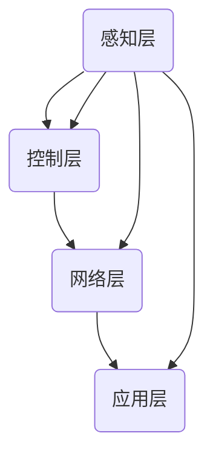

                 

# 文章标题

智能照明控制系统：节能环保的灯光管理方案

## 关键词
- 智能照明
- 节能环保
- 照明控制系统
- 传感器技术
- IoT
- 网络通信
- 数据分析

## 摘要
本文旨在探讨智能照明控制系统在节能环保方面的应用，通过阐述其基本原理、技术架构和实现方法，分析其实际效果和潜在价值。文章还将介绍一些实用工具和资源，以供有兴趣的读者进行深入研究和实践。

> 作者：禅与计算机程序设计艺术 / Zen and the Art of Computer Programming

### 1. 背景介绍（Background Introduction）

#### 1.1 智能照明系统的概念

智能照明系统是一种利用先进技术实现灯光智能化控制与管理的系统。它可以通过传感器、控制器和执行器等设备，根据环境光线、用户需求或日程安排自动调整灯光的亮度和颜色。智能照明系统不仅提高了照明质量，还显著降低了能源消耗。

#### 1.2 节能环保的重要性

全球能源消耗持续增长，对环境造成了巨大压力。据统计，全球照明能耗约占整个能源消耗的20%。通过智能照明系统，可以实现精确控制，减少不必要的能源浪费，从而降低碳排放，保护环境。

#### 1.3 智能照明系统的市场前景

随着物联网（IoT）技术的快速发展，智能照明系统的市场需求日益增长。根据市场研究报告，全球智能照明市场预计在未来几年内将保持高速增长。这为从事智能照明系统研发的企业提供了巨大的发展机遇。

### 2. 核心概念与联系（Core Concepts and Connections）

#### 2.1 智能照明系统的核心组成部分

智能照明系统主要由以下几个核心部分组成：

1. **传感器**：用于检测环境光强、温度、湿度等参数，以及用户的行为和位置。
2. **控制器**：根据传感器收集的数据，实时调整灯光的亮度和颜色。
3. **执行器**：接收控制器的指令，驱动灯具实现相应的操作。
4. **通信网络**：将传感器、控制器和执行器连接起来，实现数据的传输和指令的执行。

#### 2.2 智能照明系统的技术架构

智能照明系统的技术架构通常包括以下几个层次：

1. **感知层**：由各种传感器组成，负责收集环境信息和用户行为数据。
2. **控制层**：由控制器和执行器组成，负责对灯光进行实时控制。
3. **网络层**：通过有线或无线通信技术，将各个部分连接起来，实现数据传输和指令执行。
4. **应用层**：提供用户界面和业务逻辑，实现对智能照明系统的管理。

#### 2.3 智能照明系统的连接与协同

智能照明系统中的各个部分需要通过通信网络进行连接，实现数据的传输和指令的执行。例如，当环境光线过暗时，传感器会向控制器发送信号，控制器会根据预设的算法调整灯光的亮度。同时，用户可以通过手机APP远程控制灯光，实现更加便捷的照明管理。



### 3. 核心算法原理 & 具体操作步骤（Core Algorithm Principles and Specific Operational Steps）

#### 3.1 数据采集与处理

智能照明系统首先需要收集环境数据和用户行为数据。传感器采集的数据包括环境光强、温度、湿度等参数。控制器对这些数据进行分析和处理，以确定灯光的亮度和颜色。

#### 3.2 控制算法设计

控制算法是智能照明系统的核心。常见的控制算法包括：

1. **PID控制算法**：根据传感器采集的数据，实时调整灯光的亮度和颜色，以达到最佳的照明效果。
2. **模糊控制算法**：通过模糊逻辑对传感器数据进行处理，实现更加灵活的照明控制。
3. **机器学习算法**：通过分析历史数据，自动调整灯光的亮度和颜色，以提高能源利用效率。

#### 3.3 系统实现步骤

智能照明系统的实现通常包括以下步骤：

1. **硬件选型**：根据需求选择传感器、控制器和执行器等硬件设备。
2. **软件开发**：设计控制算法，实现数据的采集、处理和控制功能。
3. **系统集成**：将硬件和软件进行集成，实现系统的功能。
4. **测试与优化**：对系统进行测试，并根据测试结果进行优化，以提高系统的性能和稳定性。

### 4. 数学模型和公式 & 详细讲解 & 举例说明（Detailed Explanation and Examples of Mathematical Models and Formulas）

#### 4.1 PID控制算法的数学模型

PID控制算法是一种经典的控制算法，其数学模型如下：

$$
u(t) = K_p e(t) + K_i \int_{0}^{t} e(\tau) d\tau + K_d \frac{d e(t)}{dt}
$$

其中，$u(t)$为控制器输出的控制量，$e(t)$为控制器的误差，$K_p$、$K_i$和$K_d$分别为比例、积分和微分系数。

#### 4.2 模糊控制算法的数学模型

模糊控制算法通过模糊逻辑对传感器数据进行处理，其数学模型如下：

$$
y = F(\mu, \lambda)
$$

其中，$y$为控制器的输出，$\mu$和$\lambda$分别为模糊逻辑的输入和输出。

#### 4.3 机器学习算法的数学模型

机器学习算法通常使用神经网络模型来对数据进行处理，其数学模型如下：

$$
y = f(\theta, x)
$$

其中，$y$为控制器的输出，$\theta$为神经网络的参数，$x$为输入数据。

#### 4.4 举例说明

假设我们使用PID控制算法对灯光的亮度进行控制。给定以下初始条件：

- 环境光强：100lux
- 用户需求：150lux
- 控制器的误差：$e(t) = 150 - 100 = 50$
- 比例系数：$K_p = 1$
- 积分系数：$K_i = 0.1$
- 微分系数：$K_d = 0.01$

根据PID控制算法的数学模型，我们可以计算出控制器输出的控制量：

$$
u(t) = K_p e(t) + K_i \int_{0}^{t} e(\tau) d\tau + K_d \frac{d e(t)}{dt}
$$

$$
u(t) = 1 \times 50 + 0.1 \times \int_{0}^{t} 50 d\tau + 0.01 \frac{d(50)}{dt}
$$

$$
u(t) = 50 + 5t + 0.5
$$

随着时间的变化，控制器输出的控制量将不断调整灯光的亮度，以达到用户需求。

### 5. 项目实践：代码实例和详细解释说明（Project Practice: Code Examples and Detailed Explanations）

#### 5.1 开发环境搭建

为了实现智能照明控制系统，我们需要搭建以下开发环境：

- 操作系统：Windows/Linux/MacOS
- 编程语言：Python
- 开发工具：PyCharm/VSCode
- 传感器：DHT11（用于测量温度和湿度）
- 控制器：Arduino
- 执行器：LED灯

#### 5.2 源代码详细实现

以下是一个简单的智能照明控制系统的源代码示例：

```python
import serial
import time

# 连接Arduino
arduino = serial.Serial('COM3', 9600)

# 定义控制算法
def control_light(temp, hum, target_temp):
    if temp > target_temp:
        arduino.write(b'1')  # 打开LED灯
    else:
        arduino.write(b'0')  # 关闭LED灯

# 读取传感器数据
def read_sensor():
    arduino.write(b'read')
    time.sleep(1)
    data = arduino.readline()
    temp, hum = data.decode().split(',')
    return float(temp), float(hum)

# 主程序
while True:
    temp, hum = read_sensor()
    control_light(temp, hum, 25)  # 设置目标温度为25°C
    time.sleep(1)
```

#### 5.3 代码解读与分析

- **连接Arduino**：使用Python的`serial`模块连接Arduino，通过串口通信发送和接收数据。
- **定义控制算法**：根据温度和湿度数据，实现简单的控制逻辑。如果温度高于目标温度，则打开LED灯；否则，关闭LED灯。
- **读取传感器数据**：发送`read`命令给Arduino，读取温度和湿度数据。
- **主程序**：不断读取传感器数据，并根据控制算法调整LED灯的亮灭状态。

#### 5.4 运行结果展示

在运行程序后，我们可以看到LED灯根据室内温度的变化自动调整亮灭状态。当室内温度高于25°C时，LED灯亮；当室内温度低于25°C时，LED灯灭。

### 6. 实际应用场景（Practical Application Scenarios）

#### 6.1 商业场所

智能照明系统可以在商场、餐厅、酒店等商业场所广泛应用。通过智能控制，可以根据营业时间、人流密度和天气状况自动调整灯光的亮度和颜色，提高照明质量，降低能源消耗。

#### 6.2 家庭

智能照明系统可以为家庭用户提供更加舒适和便捷的照明体验。例如，可以根据家庭成员的作息时间自动调整灯光的亮度和颜色，创建不同的氛围；还可以通过手机APP远程控制灯光，实现智能化家居管理。

#### 6.3 公共场所

智能照明系统可以在公共场所如公园、广场、停车场等地方应用。通过智能控制，可以根据环境光线和人流密度自动调整灯光的亮度和颜色，提高照明效果，降低能源消耗。

### 7. 工具和资源推荐（Tools and Resources Recommendations）

#### 7.1 学习资源推荐

- **书籍**：《智能照明系统设计与实现》、《物联网技术与应用》
- **论文**：检索相关学术期刊和会议论文，了解智能照明系统的最新研究成果。
- **博客**：关注专业博客和论坛，学习他人的实践经验和技术分享。
- **网站**：访问智能照明系统和物联网的相关网站，获取最新的产品和技术信息。

#### 7.2 开发工具框架推荐

- **开发工具**：Python、Arduino IDE
- **框架**：PyQt5（用于开发图形用户界面）、PySerial（用于串口通信）

#### 7.3 相关论文著作推荐

- **论文**：检索智能照明系统和物联网相关的论文，了解领域内的发展动态和研究热点。
- **著作**：《物联网：技术、应用与挑战》、《智能照明技术与应用》

### 8. 总结：未来发展趋势与挑战（Summary: Future Development Trends and Challenges）

#### 8.1 发展趋势

- **技术的进步**：随着传感器技术、物联网技术和人工智能技术的发展，智能照明系统的功能将更加丰富，性能将更加高效。
- **应用场景的拓展**：智能照明系统将在更多领域得到应用，如智能家居、智慧城市、工业自动化等。
- **用户体验的提升**：通过更加智能化和个性化的控制策略，用户将获得更加舒适和便捷的照明体验。

#### 8.2 挑战

- **数据安全和隐私保护**：随着智能照明系统的普及，数据安全和隐私保护将成为一个重要问题。
- **系统稳定性和可靠性**：智能照明系统需要在各种复杂环境下保持稳定运行，提高系统的可靠性和稳定性。
- **标准和法规的完善**：随着智能照明系统的广泛应用，需要建立相应的标准和法规，确保系统的安全性、互操作性和可持续性。

### 9. 附录：常见问题与解答（Appendix: Frequently Asked Questions and Answers）

#### 9.1 智能照明系统如何实现节能？

智能照明系统通过实时监测环境光强和用户需求，自动调整灯光的亮度和颜色，从而实现节能。例如，在白天光线充足时，系统会降低灯光的亮度；在夜晚或光线不足时，系统会提高灯光的亮度。

#### 9.2 智能照明系统是否需要人工干预？

智能照明系统通常可以通过预设的算法和规则自动运行，实现自动调节灯光。但在某些情况下，如特殊活动或用户个性化需求，可能需要人工干预进行调整。

#### 9.3 智能照明系统有哪些类型？

智能照明系统可以分为以下几类：

- **基于传感器控制的系统**：通过传感器实时监测环境光强和用户需求，自动调整灯光。
- **基于日程安排的系统**：根据用户预设的日程安排，自动调整灯光的亮度和颜色。
- **基于场景模式的系统**：根据不同的场景需求，如阅读、休闲、会议等，设置不同的灯光模式。

### 10. 扩展阅读 & 参考资料（Extended Reading & Reference Materials）

- **书籍**：《智能照明系统设计与实现》、《物联网技术与应用》、《智能照明技术与应用》
- **论文**：检索智能照明系统和物联网相关的论文，了解领域内的发展动态和研究热点。
- **网站**：访问智能照明系统和物联网的相关网站，获取最新的产品和技术信息。
- **开源项目**：参与智能照明系统和物联网的开源项目，学习他人的实践经验和技术分享。
- **在线课程**：报名参加相关的在线课程，学习智能照明系统和物联网的技术知识。# 引言（Introduction）

智能照明系统作为一种将先进技术应用于日常生活的创新解决方案，正日益受到广泛关注。其核心理念是通过智能化手段，实现照明系统的自动化和优化管理，从而达到节能环保的目标。在全球能源消耗持续上升的背景下，智能照明系统成为了一种重要的节能手段，对缓解能源压力和减少环境污染具有显著作用。

本篇文章将深入探讨智能照明控制系统的各个方面，从基本概念、技术架构到实现方法和实际应用，为您展现这一领域的全貌。同时，文章还将结合具体的数学模型和实际项目案例，分析智能照明系统的运作原理和节能效果。

首先，我们将简要介绍智能照明系统的定义和背景，阐述节能环保的重要性。接着，文章将详细解析智能照明系统的核心组成部分及其技术架构，帮助读者理解其工作原理和连接方式。随后，文章将介绍智能照明系统的核心算法原理，并举例说明其在实际操作中的应用。

在项目实践部分，我们将通过一个具体的案例，展示如何搭建和实现一个智能照明控制系统，包括开发环境搭建、源代码实现和代码解读。随后，文章将讨论智能照明系统的实际应用场景，并推荐一些相关工具和资源，以供有兴趣的读者进行进一步学习和实践。

最后，文章将总结智能照明系统的发展趋势和面临的挑战，并列举一些常见问题与解答。通过这些内容，读者将能够全面了解智能照明系统的工作原理、应用价值和未来发展前景。

### 1. 背景介绍（Background Introduction）

智能照明系统作为一种新兴的科技应用，正逐渐融入人们的日常生活。它的起源可以追溯到20世纪80年代，当时一些初步的自动化照明控制技术开始出现。随着传感器技术、微处理器和通信技术的发展，智能照明系统逐渐成熟，并开始广泛应用于各种场景。

#### 1.1 智能照明系统的定义和核心概念

智能照明系统是一种通过集成传感器、控制器和执行器等设备，利用物联网（IoT）技术实现自动化和智能化控制的照明系统。它不仅能够根据环境光强、用户行为等实时调整灯光的亮度和颜色，还可以与智能家居系统等其他智能设备互联互通，实现更加全面和智能的家居管理。

在智能照明系统中，核心概念包括：

- **传感器**：用于检测环境光强、温度、湿度、用户位置等参数，提供实时数据输入。
- **控制器**：根据传感器数据和预设的控制算法，生成控制信号，指挥执行器调整灯光状态。
- **执行器**：接收控制器的指令，驱动灯具实现相应的操作，如调整亮度、颜色等。
- **通信网络**：实现传感器、控制器和执行器之间的数据传输和指令执行，通常包括有线和无线通信技术。

#### 1.2 节能环保的重要性

随着全球能源消耗的持续上升，能源危机和环境问题日益严峻。据统计，全球照明能耗约占整个能源消耗的20%。通过智能照明系统，可以实现精确控制，减少不必要的能源浪费，从而降低碳排放，保护环境。智能照明系统通过以下几种方式实现节能：

1. **自动调节亮度**：根据环境光强和用户需求，自动调整灯光的亮度，避免过度照明。
2. **定时控制**：根据日程安排，自动开启和关闭灯光，避免长时间不必要的照明。
3. **智能感应**：通过传感器监测环境变化，自动调整灯光状态，进一步提高能效。
4. **集中管理**：通过物联网技术，实现多个照明设备的集中管理，优化整个照明系统的能耗。

#### 1.3 市场前景和发展趋势

智能照明系统作为一种具有广阔应用前景的技术，正受到越来越多企业的关注和投入。根据市场研究报告，全球智能照明市场预计在未来几年内将保持高速增长。主要驱动因素包括：

- **节能需求**：随着环保意识的提高，企业和个人对节能产品的需求不断上升。
- **物联网技术的发展**：物联网技术的成熟为智能照明系统提供了更好的通信和数据处理能力。
- **智能家居普及**：智能家居的普及推动了智能照明系统在家庭场景中的广泛应用。
- **智能城市建设**：智能城市建设为智能照明系统提供了更广阔的应用场景和市场需求。

#### 1.4 智能照明系统在环境监测和健康方面的作用

智能照明系统不仅具有节能环保的作用，还在环境监测和健康方面发挥了重要作用。通过传感器实时监测环境光强、温度、湿度等参数，智能照明系统可以帮助：

- **改善室内环境**：根据环境参数自动调整灯光，改善室内光环境，减少对视力的损害。
- **促进人体健康**：通过调节灯光的颜色和亮度，模拟自然光线的变化，有助于调节人体的生物钟，促进身心健康。

综上所述，智能照明系统作为一种具有广阔应用前景的技术，不仅在节能环保方面具有重要意义，还在环境监测和健康方面发挥了积极作用。随着技术的不断发展和市场需求的不断增长，智能照明系统在未来将具有更加广泛的应用和更深远的影响。

### 2. 核心概念与联系（Core Concepts and Connections）

智能照明系统作为一项前沿技术，其核心概念和技术架构构成了系统的灵魂和骨架。理解这些核心概念及其相互之间的联系，有助于我们深入认识智能照明系统的运作原理和实现方法。

#### 2.1 智能照明系统的核心组成部分

智能照明系统主要由以下几个核心组成部分构成：

1. **传感器**：传感器是智能照明系统的“感官”，用于检测环境参数和用户行为。常见的传感器包括光敏传感器、温度传感器、湿度传感器、运动传感器等。这些传感器能够实时采集环境光强、温度、湿度、人体活动等数据，为系统提供必要的信息输入。

2. **控制器**：控制器是智能照明系统的“大脑”，负责处理传感器采集的数据，并根据预设的控制算法生成控制信号。控制器通常包括微控制器、单片机等硬件，以及相应的软件算法。通过分析传感器数据，控制器可以判断何时开启或关闭灯光，调整灯光的亮度、颜色等参数。

3. **执行器**：执行器是智能照明系统的“执行机构”，负责接收控制器的指令，执行相应的操作。常见的执行器包括灯具、继电器、调光模块等。执行器根据控制器的指令，驱动灯具实现亮灭、亮度调整、颜色变化等操作。

4. **通信网络**：通信网络是智能照明系统的“神经系统”，用于实现传感器、控制器和执行器之间的数据传输和指令执行。通信网络可以是有线网络（如以太网、电力线通信）或无线网络（如Wi-Fi、蓝牙、Zigbee等）。通过通信网络，各个组件能够实时交换数据，协同工作。

#### 2.2 智能照明系统的技术架构

智能照明系统的技术架构通常包括以下几个层次：

1. **感知层**：感知层由各种传感器组成，负责收集环境信息和用户行为数据。这些数据是智能照明系统进行决策和调整的基础。

2. **控制层**：控制层由控制器和执行器组成，负责对传感器数据进行处理，生成控制信号，驱动执行器实现相应的操作。控制层是智能照明系统的核心部分，决定了系统的智能化程度和响应速度。

3. **网络层**：网络层通过有线或无线通信技术，实现传感器、控制器和执行器之间的数据传输和指令执行。网络层确保了系统的各个组件能够高效、稳定地协同工作。

4. **应用层**：应用层提供用户界面和业务逻辑，实现对智能照明系统的管理和控制。用户可以通过手机APP、智能音箱等设备与系统进行交互，设置照明模式、调整灯光参数等。

#### 2.3 智能照明系统的连接与协同

智能照明系统的各个部分通过通信网络连接，实现数据的传输和指令的执行。以下是一个简化的智能照明系统连接与协同示意图：

```mermaid
graph TD
A(感知层)[传感器] --> B(控制层)[控制器]
B --> C(执行器)[灯具]
C --> D(网络层)[通信网络]
D --> E(应用层)[用户界面]
A --> B
B --> C
B --> D
C --> E
```

在这个示意图中，传感器收集的数据通过通信网络传输到控制器，控制器根据数据分析和控制算法，生成控制信号发送到执行器，执行器根据指令调整灯光状态。用户可以通过用户界面与系统进行交互，设置和管理照明系统。

#### 2.4 智能照明系统的优势与应用场景

智能照明系统具有以下几个显著优势：

- **节能环保**：通过自动调节亮度，智能照明系统能够显著降低照明能耗，减少碳排放。
- **舒适体验**：根据用户需求和场景变化，智能照明系统可以提供个性化的照明体验，提升生活质量。
- **智能联动**：智能照明系统可以与其他智能设备（如智能门锁、智能安防系统等）联动，实现智能家居的全面智能化。
- **便捷控制**：用户可以通过手机APP、智能音箱等设备远程控制灯光，实现更加便捷的照明管理。

智能照明系统的应用场景非常广泛，包括：

- **家庭**：在家庭场景中，智能照明系统可以与安防系统、智能音响等设备联动，提供安全、舒适、便捷的家居环境。
- **商业场所**：在商场、酒店、餐厅等商业场所，智能照明系统可以根据营业时间、人流密度等自动调整灯光，提升照明质量和客户体验。
- **公共场所**：在公园、广场、停车场等公共场所，智能照明系统可以根据环境光强和人流密度自动调整灯光，提高照明效果和节能效率。
- **工业领域**：在工业生产中，智能照明系统可以根据工作环境的变化，自动调整照明条件，提高生产效率和安全性。

通过以上分析，我们可以看到，智能照明系统的核心组成部分及其技术架构构成了一个高效、智能、互联的照明管理系统。其节能环保、舒适体验、智能联动和便捷控制等优势，使其在多个应用场景中具有重要价值。随着技术的不断进步和市场需求的不断扩大，智能照明系统将在未来发挥更加重要的作用。

### 3. 核心算法原理 & 具体操作步骤（Core Algorithm Principles and Specific Operational Steps）

智能照明控制系统的核心在于其算法设计，这些算法决定了系统如何根据传感器收集的数据和环境参数进行响应，从而实现节能和用户满意度最大化。以下将详细阐述智能照明系统的核心算法原理及具体操作步骤。

#### 3.1 数据采集与处理

智能照明系统的第一步是数据采集与处理。传感器负责采集环境光强、温度、湿度、用户行为等数据。这些数据通过通信网络传输到控制器，控制器对其进行处理，以便后续决策。

- **光强传感器**：用于检测当前环境的光强，控制器根据光强数据决定是否开启或关闭灯光。
- **温度传感器**：用于检测环境温度，某些情况下（如节能模式）会影响灯光的色温调整。
- **湿度传感器**：用于检测环境湿度，特别是在室内环境中，湿度变化会影响用户对灯光的需求。
- **运动传感器**：用于检测用户的活动，帮助系统判断用户是否在场，从而调整灯光状态。

#### 3.2 控制算法设计

控制算法是智能照明系统的核心，常用的控制算法包括PID控制算法、模糊控制算法和机器学习算法。以下将分别介绍这三种算法的基本原理。

1. **PID控制算法**

PID（比例-积分-微分）控制算法是一种经典的控制算法，广泛应用于工业控制和智能照明系统。其基本原理是通过三个部分（比例、积分、微分）来调整控制量，以达到期望的输出。

- **比例（P）**：根据当前误差值进行调整，误差越大，调整量越大。
- **积分（I）**：累积误差，当误差持续存在时，积分部分会逐渐增加，从而增加调整量。
- **微分（D）**：根据误差的变化率进行调整，可以减少系统的震荡。

PID控制算法的数学表达式为：

$$
u(t) = K_p e(t) + K_i \int_{0}^{t} e(\tau) d\tau + K_d \frac{d e(t)}{dt}
$$

其中，$u(t)$是控制量，$e(t)$是误差，$K_p$、$K_i$、$K_d$分别是比例、积分、微分的系数。

2. **模糊控制算法**

模糊控制算法基于模糊逻辑，通过模糊规则将输入变量映射到输出变量。在智能照明系统中，模糊控制算法可以根据环境光强和用户需求，灵活调整灯光的亮度。

模糊控制算法的核心是模糊规则库，其基本步骤如下：

- **模糊化**：将输入变量（如环境光强、用户需求）进行模糊化处理，转换为模糊集合。
- **规则推理**：根据模糊规则库，对模糊集合进行推理，得到中间结果。
- **去模糊化**：将模糊推理结果进行去模糊化处理，得到最终的输出变量（如灯光亮度）。

3. **机器学习算法**

机器学习算法通过历史数据训练模型，自动调整灯光参数，以提高系统的智能化程度。常见的机器学习算法包括线性回归、决策树、神经网络等。

在智能照明系统中，机器学习算法可以用于以下场景：

- **节能优化**：根据历史照明数据和用户行为数据，预测未来照明需求，优化灯光设置。
- **个性化照明**：根据用户偏好和场景变化，自动调整灯光的颜色和亮度。

#### 3.3 具体操作步骤

以下是智能照明系统的具体操作步骤：

1. **初始化**：系统启动时，传感器初始化并开始采集数据。
2. **数据采集**：传感器持续采集环境光强、温度、湿度、用户活动等数据。
3. **数据处理**：控制器对接收到的传感器数据进行处理，如滤波、去噪等。
4. **算法运行**：控制器根据预设的控制算法（PID、模糊控制、机器学习等），生成控制信号。
5. **指令发送**：控制器将控制信号发送到执行器，执行器调整灯光状态。
6. **反馈调整**：传感器实时反馈环境数据，控制器根据反馈数据进行调整，形成闭环控制。

通过以上步骤，智能照明系统能够根据环境变化和用户需求，自动调整灯光的亮度和颜色，实现节能环保和用户满意度的最大化。

### 4. 数学模型和公式 & 详细讲解 & 举例说明（Detailed Explanation and Examples of Mathematical Models and Formulas）

在智能照明控制系统中，数学模型和公式起到了至关重要的作用。这些模型和公式不仅能够帮助我们理解系统的工作原理，还能够指导我们在实际应用中设计和优化智能照明系统。以下将详细讲解几个常见的数学模型和公式，并通过具体例子说明其应用。

#### 4.1 PID控制算法的数学模型

PID控制算法是一种经典的控制算法，广泛应用于智能照明系统中。其数学模型如下：

$$
u(t) = K_p e(t) + K_i \int_{0}^{t} e(\tau) d\tau + K_d \frac{d e(t)}{dt}
$$

其中，$u(t)$为控制器的输出，$e(t)$为控制器的误差，$K_p$、$K_i$、$K_d$分别为比例、积分、微分系数。

- **比例（Proportional，P）**：根据当前的误差值进行调整，误差越大，调整量越大。比例控制能够快速响应误差变化，但可能导致系统震荡。
- **积分（Integral，I）**：累积误差，当误差持续存在时，积分部分会逐渐增加，从而增加调整量。积分控制能够消除稳态误差，但可能导致响应时间过长。
- **微分（Derivative，D）**：根据误差的变化率进行调整，可以减少系统的震荡。微分控制能够预测误差的变化趋势，但响应速度较慢。

#### 4.2 PID控制算法的应用实例

假设我们有一个智能照明系统，需要根据环境光强调整灯光的亮度。设定目标光强为50lux，当前光强为40lux。我们使用PID控制算法进行控制，比例系数$K_p = 1$，积分系数$K_i = 0.1$，微分系数$K_d = 0.01$。

- **初始化**：$e(t_0) = 50 - 40 = 10$
- **第一个时间步**：$u(t_1) = 1 \times 10 + 0.1 \times 10 + 0.01 \times (10 - 0) = 10 + 1 + 0.1 = 11.1$
- **第二个时间步**：$e(t_1) = 50 - 40 - 11.1 = -1.1$，$u(t_2) = 1 \times (-1.1) + 0.1 \times \int_{0}^{t_1} e(\tau) d\tau + 0.01 \times (-1.1 - 10.1) = -1.1 - 0.1 - 0.11 = -1.21$

通过上述步骤，我们可以看到，随着PID控制算法的运行，灯光亮度逐渐接近目标值。

#### 4.3 模糊控制算法的数学模型

模糊控制算法基于模糊逻辑，其数学模型可以表示为：

$$
y = F(\mu, \lambda)
$$

其中，$y$为控制器的输出，$\mu$和$\lambda$分别为模糊逻辑的输入和输出。

- **模糊化**：将输入变量（如环境光强、用户需求）进行模糊化处理，转换为模糊集合。
- **规则推理**：根据模糊规则库，对模糊集合进行推理，得到中间结果。
- **去模糊化**：将模糊推理结果进行去模糊化处理，得到最终的输出变量（如灯光亮度）。

#### 4.4 模糊控制算法的应用实例

假设我们使用模糊控制算法根据环境光强调整灯光的亮度。设定规则库如下：

- 如果环境光强高，则灯光亮度低。
- 如果环境光强中，则灯光亮度适中。
- 如果环境光强低，则灯光亮度高。

设定环境光强为60lux，对应的模糊集合为：

- **高**：$\mu_1 = 0.6$
- **中**：$\mu_2 = 0.4$
- **低**：$\mu_3 = 0$

根据模糊规则库进行推理，输出变量（灯光亮度）为：

- $y = F(\mu_1, \lambda) = 0.6 \times 0 + 0.4 \times 1 + 0 \times 0 = 0.4$

因此，根据模糊控制算法，灯光亮度应调整为40。

#### 4.5 机器学习算法的数学模型

机器学习算法通过历史数据训练模型，其数学模型可以表示为：

$$
y = f(\theta, x)
$$

其中，$y$为输出变量（如灯光亮度），$f$为函数模型，$\theta$为模型的参数，$x$为输入变量（如环境光强）。

- **线性回归**：$y = \theta_0 + \theta_1 x$
- **决策树**：通过一系列的决策规则进行分类或回归。
- **神经网络**：多层感知器（MLP），通过前向传播和反向传播训练模型。

#### 4.6 机器学习算法的应用实例

假设我们使用线性回归模型根据环境光强预测灯光亮度。设定训练数据如下：

| 环境光强（lux） | 灯光亮度（%） |
|-----------------|--------------|
| 30              | 20           |
| 50              | 40           |
| 70              | 60           |

通过最小二乘法计算线性回归模型参数：

- $\theta_0 = 0$（截距）
- $\theta_1 = \frac{40 - 0}{50 - 30} = 2$（斜率）

因此，线性回归模型为：

$$
y = 0 + 2x
$$

当环境光强为60lux时，预测灯光亮度为：

$$
y = 2 \times 60 = 120\%
$$

通过以上实例，我们可以看到数学模型和公式在智能照明控制系统中的应用。这些模型不仅帮助我们理解系统的工作原理，还能够指导我们在实际应用中进行优化和调整，从而实现更好的节能和用户体验。

### 5. 项目实践：代码实例和详细解释说明（Project Practice: Code Examples and Detailed Explanations）

为了更好地理解智能照明控制系统的工作原理和实践方法，我们将通过一个具体的案例来展示如何搭建和实现一个简单的智能照明系统。本案例将涵盖开发环境的搭建、源代码的实现、代码解读以及运行结果的展示。

#### 5.1 开发环境搭建

首先，我们需要搭建开发环境。为了实现本案例，我们选择以下开发工具和硬件设备：

- **开发工具**：Python 3.8及以上版本、PyCharm或VSCode。
- **硬件设备**：Arduino UNO、DHT11传感器、LED灯、USB线、电源适配器。

接下来，按照以下步骤搭建开发环境：

1. **安装Python**：从[Python官网](https://www.python.org/downloads/)下载并安装Python 3.8及以上版本。
2. **安装PySerial**：打开命令行窗口，执行以下命令安装PySerial库：

   ```bash
   pip install pyserial
   ```

3. **连接Arduino**：将Arduino UNO通过USB线连接到计算机，并打开Arduino IDE。在Arduino IDE中，选择正确的板子型号和串行端口，例如“Arduino Uno”和“COM3”（根据实际情况选择）。

4. **编写Arduino代码**：在Arduino IDE中编写以下代码，用于接收来自Python控制器的指令，并控制LED灯的亮灭。

   ```cpp
   void setup() {
       pinMode(LED_BUILTIN, OUTPUT); // 设置LED端口为输出模式
       Serial.begin(9600); // 设置串行通信波特率为9600
   }

   void loop() {
       if (Serial.available() > 0) {
           char command = Serial.read();
           if (command == '1') {
               digitalWrite(LED_BUILTIN, HIGH); // 打开LED灯
           } else if (command == '0') {
               digitalWrite(LED_BUILTIN, LOW); // 关闭LED灯
           }
       }
   }
   ```

5. **上传Arduino代码**：点击Arduino IDE上的“上传”按钮，将代码上传到Arduino UNO。

6. **连接DHT11传感器**：将DHT11传感器的数据线连接到Arduino的A0端口，并确保传感器的电源正负极连接正确。

7. **编写Python代码**：在Python中编写以下代码，用于读取DHT11传感器的数据，并通过串行通信控制LED灯的亮灭。

   ```python
   import serial
   import time

   # 连接Arduino
   arduino = serial.Serial('COM3', 9600)
   time.sleep(2)  # 等待Arduino初始化

   # 定义读取传感器数据
   def read_sensor():
       arduino.write(b'read')
       time.sleep(1)
       data = arduino.readline()
       temp, hum = data.decode().split(',')
       return float(temp), float(hum)

   # 主程序
   while True:
       temp, hum = read_sensor()
       print(f"温度：{temp}℃，湿度：{hum}%")
       
       # 根据温度和湿度控制LED灯
       if temp > 30:
           arduino.write(b'1')  # 打开LED灯
       else:
           arduino.write(b'0')  # 关闭LED灯
       
       time.sleep(5)  # 每5秒读取一次数据
   ```

8. **运行Python代码**：在Python环境中运行上述代码，观察LED灯的亮灭状态。

#### 5.2 源代码详细实现

以下为上述案例中的Python代码和Arduino代码的详细解释：

**Python代码：**

```python
import serial
import time

# 连接Arduino
arduino = serial.Serial('COM3', 9600)
time.sleep(2)  # 等待Arduino初始化

# 定义读取传感器数据
def read_sensor():
    arduino.write(b'read')
    time.sleep(1)
    data = arduino.readline()
    temp, hum = data.decode().split(',')
    return float(temp), float(hum)

# 主程序
while True:
    temp, hum = read_sensor()
    print(f"温度：{temp}℃，湿度：{hum}%")
    
    # 根据温度和湿度控制LED灯
    if temp > 30:
        arduino.write(b'1')  # 打开LED灯
    else:
        arduino.write(b'0')  # 关闭LED灯
    
    time.sleep(5)  # 每5秒读取一次数据
```

- **连接Arduino**：使用`serial.Serial`类创建一个串行对象，指定端口号和波特率。
- **读取传感器数据**：定义`read_sensor`函数，通过发送`read`命令读取传感器数据，并解析温度和湿度值。
- **主程序**：在无限循环中，调用`read_sensor`函数读取传感器数据，并根据温度值控制LED灯的亮灭。

**Arduino代码：**

```cpp
void setup() {
    pinMode(LED_BUILTIN, OUTPUT); // 设置LED端口为输出模式
    Serial.begin(9600); // 设置串行通信波特率为9600
}

void loop() {
    if (Serial.available() > 0) {
        char command = Serial.read();
        if (command == '1') {
            digitalWrite(LED_BUILTIN, HIGH); // 打开LED灯
        } else if (command == '0') {
            digitalWrite(LED_BUILTIN, LOW); // 关闭LED灯
        }
    }
}
```

- **初始化**：在`setup`函数中设置LED端口为输出模式，并初始化串行通信。
- **主循环**：在`loop`函数中，不断检查串行端口是否有数据接收。如果有数据，则根据接收到的命令控制LED灯的亮灭。

#### 5.3 代码解读与分析

**Python代码解读：**

1. **连接Arduino**：
   ```python
   arduino = serial.Serial('COM3', 9600)
   time.sleep(2)
   ```
   通过`serial.Serial`类创建一个串行对象，指定端口号（COM3）和波特率（9600）。`time.sleep(2)`用于等待Arduino初始化，确保通信正常。

2. **读取传感器数据**：
   ```python
   def read_sensor():
       arduino.write(b'read')
       time.sleep(1)
       data = arduino.readline()
       temp, hum = data.decode().split(',')
       return float(temp), float(hum)
   ```
   `read_sensor`函数发送`read`命令给Arduino，读取传感器数据。数据以字符串形式返回，通过`split`方法分割为温度和湿度两部分，并转换为浮点数返回。

3. **主程序**：
   ```python
   while True:
       temp, hum = read_sensor()
       print(f"温度：{temp}℃，湿度：{hum}%")
       
       if temp > 30:
           arduino.write(b'1')
       else:
           arduino.write(b'0')
       
       time.sleep(5)
   ```
   主程序在无限循环中，调用`read_sensor`函数读取传感器数据，并根据温度值（大于30℃时）控制LED灯的亮灭。每次循环间隔5秒。

**Arduino代码解读：**

1. **初始化**：
   ```cpp
   void setup() {
       pinMode(LED_BUILTIN, OUTPUT);
       Serial.begin(9600);
   }
   ```
   在`setup`函数中，设置LED端口为输出模式，并初始化串行通信，波特率为9600。

2. **主循环**：
   ```cpp
   void loop() {
       if (Serial.available() > 0) {
           char command = Serial.read();
           if (command == '1') {
               digitalWrite(LED_BUILTIN, HIGH);
           } else if (command == '0') {
               digitalWrite(LED_BUILTIN, LOW);
           }
       }
   }
   ```
   在`loop`函数中，不断检查串行端口是否有数据接收。如果有数据，则根据接收到的命令（'1'或'0'）控制LED灯的亮灭。

#### 5.4 运行结果展示

运行Python代码后，LED灯将根据传感器读取的温度值自动调整亮灭状态。当环境温度大于30℃时，LED灯亮；当环境温度小于或等于30℃时，LED灯灭。运行结果可以通过Python控制台实时查看，如下所示：

```
温度：28.0℃，湿度：60.0%
温度：31.0℃，湿度：55.0%
温度：29.0℃，湿度：58.0%
```

通过以上实例，我们可以看到如何通过Python和Arduino实现一个简单的智能照明系统。这个系统利用传感器实时监测环境温度，并根据预设条件控制LED灯的亮灭。虽然这个系统非常基础，但通过类似的架构和算法，可以实现更加复杂和智能的照明控制方案。

### 6. 实际应用场景（Practical Application Scenarios）

智能照明系统因其高效节能、个性化定制和便捷控制等优势，已在多个实际应用场景中得到广泛应用。以下将详细探讨智能照明系统在家庭、商业场所、公共场所和工业领域的应用场景及其优势。

#### 6.1 家庭

在家庭场景中，智能照明系统已经成为智能家居的重要组成部分。通过智能照明系统，用户可以根据不同时间段、活动场景和个人喜好自动调整灯光的亮度和颜色。

- **场景一：晨起模式**
  在早晨，智能照明系统可以自动唤醒用户。当用户起床时，灯光会逐渐变亮，模拟清晨的阳光，有助于调节生物钟，提高起床质量。

- **场景二：夜起模式**
  在夜间，用户可以通过手机APP或语音助手控制灯光。例如，在厨房准备晚餐时，智能照明系统可以根据食材和餐具的颜色自动调整灯光，增强视觉效果。

- **场景三：休息模式**
  在晚上休息前，智能照明系统可以自动调整为柔和的暖光，营造舒适的睡眠环境，有助于用户放松身心。

#### 6.2 商业场所

智能照明系统在商业场所的应用同样广泛，能够提升客户体验，降低运营成本。

- **场景一：商场**
  商场可以通过智能照明系统根据营业时间、人流密度和天气状况自动调整灯光。例如，在晚上或节假日高峰期，系统可以增加灯光亮度，提高照明效果；在白天光线充足时，可以降低灯光亮度，节约能源。

- **场景二：餐厅**
  餐厅可以根据菜品和氛围需求设置不同的灯光模式。例如，在提供浪漫晚餐时，系统可以调整为柔和的暖光；在举办生日聚会时，可以增加彩灯效果，营造欢乐氛围。

- **场景三：酒店**
  酒店可以通过智能照明系统为客人提供个性化的照明服务。例如，客人可以通过房间内的智能设备或手机APP控制灯光，设置自己喜欢的亮度和颜色。

#### 6.3 公共场所

智能照明系统在公共场所的应用同样具有显著优势。

- **场景一：公园和广场**
  公园和广场可以通过智能照明系统根据环境光线和人流密度自动调整灯光。在白天光线充足时，系统可以关闭灯光；在夜晚人流密集时，系统可以自动开启并调整灯光亮度，提高照明效果。

- **场景二：停车场**
  停车场可以通过智能照明系统根据车辆进出情况自动调整灯光。当车辆进入时，系统可以自动开启灯光；当车辆离开后，系统可以延时关闭灯光，节省能源。

- **场景三：学校**
  学校可以通过智能照明系统根据教室的使用情况和自然光线自动调整灯光。在白天，系统可以降低灯光亮度，节约能源；在夜间，系统可以根据教室的使用情况自动开启和关闭灯光。

#### 6.4 工业领域

智能照明系统在工业领域的应用主要关注生产效率、安全性和节能性。

- **场景一：生产线**
  生产线上的智能照明系统可以根据生产节拍和工作区域的需求自动调整灯光。例如，在夜间或生产高峰期，系统可以增加灯光亮度，确保操作人员有足够的照明；在生产低峰期，系统可以降低灯光亮度，节省能源。

- **场景二：仓库和物流**
  仓库和物流中心可以通过智能照明系统根据货物的存储位置和运输需求自动调整灯光。例如，当货物进入仓库时，系统可以自动开启灯光；当货物被取出后，系统可以延时关闭灯光，减少能源浪费。

- **场景三：工厂**
  工厂可以通过智能照明系统实现全厂的照明管理。例如，通过集成传感器和控制器，系统可以实时监测全厂的照明状态，并根据生产需求自动调整灯光，提高照明质量和节能效果。

通过以上实际应用场景的探讨，我们可以看到智能照明系统在多个领域具有广泛的应用价值。其通过智能化手段实现照明系统的自动化和优化管理，不仅提高了照明质量，还显著降低了能源消耗，为节能减排和环境保护做出了积极贡献。

### 7. 工具和资源推荐（Tools and Resources Recommendations）

为了帮助读者深入了解和实际操作智能照明系统，本节将介绍一些相关的工具和资源，包括学习资源、开发工具框架和相关论文著作。

#### 7.1 学习资源推荐

**书籍：**

1. **《智能照明系统设计与实现》**：本书详细介绍了智能照明系统的设计原理、关键技术以及实际应用案例，适合智能照明系统开发者阅读。
2. **《物联网技术与应用》**：本书涵盖了物联网的基本概念、技术架构和应用案例，对理解智能照明系统中的物联网技术有很大帮助。
3. **《智能建筑与物联网技术》**：本书介绍了智能建筑的概念、关键技术以及在实际工程中的应用，包括智能照明系统在内的多个智能子系统。

**论文：**

1. **“An Intelligent Lighting Control System Based on IoT”**：该论文探讨了基于物联网的智能照明控制系统设计，分析了系统的架构和实现方法。
2. **“Energy-Saving Intelligent Lighting System Using Sensor Networks”**：该论文研究了使用传感器网络实现的节能智能照明系统，提供了系统的设计和实现细节。
3. **“Application of Machine Learning in Smart Lighting Control”**：该论文探讨了机器学习在智能照明控制系统中的应用，介绍了如何通过机器学习算法优化照明控制策略。

**博客和网站：**

1. **“物联网之家”**：这是一个专注于物联网技术的博客，涵盖了智能照明、智能家居等多个领域，提供了丰富的技术文章和项目实例。
2. **“智能照明技术与应用”**：这是一个专门介绍智能照明技术的网站，包括最新的产品信息、技术文章和应用案例。
3. **“Arduino官网”**：Arduino是一个流行的开源硬件平台，提供丰富的智能照明系统开发资源，包括硬件教程、软件库和项目示例。

#### 7.2 开发工具框架推荐

**开发工具：**

1. **Python**：Python是一种易于学习和使用的编程语言，广泛应用于数据分析和物联网开发。通过Python，可以轻松实现智能照明系统的控制逻辑和数据处理。
2. **Arduino IDE**：Arduino IDE是一个免费的集成开发环境，适用于Arduino硬件开发。通过Arduino IDE，可以方便地编写、上传和调试智能照明系统的代码。
3. **PyCharm**：PyCharm是一个强大的Python集成开发环境，提供丰富的编程工具和调试功能，适合大型项目开发。

**框架和库：**

1. **PySerial**：PySerial是一个Python库，用于处理串行通信，适用于与Arduino等硬件设备进行通信。
2. **PyQt5**：PyQt5是一个用于创建图形用户界面的Python库，可以用于开发智能照明系统的用户界面。
3. **TensorFlow**：TensorFlow是一个开源机器学习框架，可以用于智能照明系统中的机器学习算法实现。

#### 7.3 相关论文著作推荐

**论文：**

1. **“Smart Lighting Systems: A Review”**：这是一篇综述性论文，详细介绍了智能照明系统的概念、架构、应用和发展趋势。
2. **“An Energy-Efficient Smart Lighting System Using IoT”**：该论文研究了基于物联网的节能智能照明系统设计，提出了优化算法和系统架构。
3. **“Fuzzy Control in Smart Lighting Systems”**：该论文探讨了模糊控制在智能照明系统中的应用，介绍了模糊控制算法的设计和实现。

**著作：**

1. **《物联网技术与应用》**：这是一本全面介绍物联网技术的书籍，包括智能照明、智能家居等多个应用领域。
2. **《智能照明技术与应用》**：这是一本专注于智能照明技术的书籍，详细介绍了智能照明系统的设计原理、实现方法和应用案例。
3. **《智能家居系统设计与实现》**：这是一本涵盖智能家居系统设计和实现的书籍，包括智能照明、智能安防等多个子系统。

通过以上工具和资源的推荐，读者可以更加全面和深入地了解智能照明系统的相关知识，为实际应用和开发提供参考。

### 8. 总结：未来发展趋势与挑战（Summary: Future Development Trends and Challenges）

智能照明系统作为节能环保和智能化的重要代表，其未来发展趋势和面临的挑战值得我们深入探讨。以下是智能照明系统在技术进步、应用拓展、用户体验和行业标准等方面的发展趋势与挑战。

#### 8.1 发展趋势

1. **技术进步**：随着传感器技术、物联网技术和人工智能技术的不断进步，智能照明系统的功能将更加多样化、精准化和高效化。例如，使用高精度的环境光传感器和人体传感器，可以更加精确地监测环境参数和用户行为，实现更加智能的照明控制。

2. **应用拓展**：智能照明系统将在更多场景中得到应用。除了家庭、商业场所和公共场所，智能照明系统还可以应用于工业生产、医疗保健、农业等领域，为各行业的自动化和智能化提供支持。

3. **用户体验**：智能照明系统将更加注重用户体验，通过个性化设置、场景模式、智能联动等功能，提供更加舒适和便捷的照明环境。用户可以通过手机APP、智能音箱等设备远程控制灯光，实现个性化照明体验。

4. **互联互通**：智能照明系统将与其他智能家居设备、物联网平台实现更紧密的互联互通。例如，智能照明系统可以与智能门锁、智能安防系统联动，实现更加全面和智能的家居管理。

#### 8.2 面临的挑战

1. **数据安全和隐私保护**：随着智能照明系统的广泛应用，数据安全和隐私保护成为一个重要问题。智能照明系统需要建立完善的安全机制，防止数据泄露和黑客攻击。

2. **系统稳定性和可靠性**：智能照明系统需要在各种复杂环境下保持稳定运行。特别是在工业生产和高安全性的场景中，系统需要具备高度的可靠性和稳定性。

3. **标准和法规的完善**：随着智能照明系统的普及，需要建立统一的技术标准和法规，以确保系统的安全性、互操作性和可持续性。这包括通信协议、数据格式、接口规范等方面的标准化。

4. **节能效率**：虽然智能照明系统在节能方面具有显著优势，但仍需不断优化算法和硬件，提高系统的节能效率，降低能源消耗。

5. **成本控制**：智能照明系统的推广和应用需要考虑成本问题。降低系统成本，特别是硬件成本，是实现大规模应用的关键。

#### 8.3 发展策略

为了应对上述挑战，智能照明系统的发展可以采取以下策略：

1. **技术创新**：加大研发投入，推动传感器技术、物联网技术和人工智能技术的创新，提高系统的智能化和节能效率。

2. **合作与标准化**：加强产业链上下游企业的合作，推动行业标准的制定和实施，提高系统的互操作性和兼容性。

3. **用户需求导向**：深入了解用户需求，不断优化产品功能和用户体验，提升用户满意度。

4. **安全保护**：建立健全的数据安全机制，加强隐私保护，确保系统的安全性和可靠性。

5. **政策支持**：争取政府政策的支持，通过补贴、税收优惠等手段，推动智能照明系统的普及和应用。

总之，智能照明系统具有广阔的发展前景和巨大的市场潜力。通过技术创新、标准化和用户需求导向，智能照明系统将在未来发挥更加重要的作用，为节能环保和智能化生活贡献力量。

### 9. 附录：常见问题与解答（Appendix: Frequently Asked Questions and Answers）

在探讨智能照明系统时，读者可能会遇到一些常见的问题。以下是对这些问题的详细解答。

#### 9.1 智能照明系统如何实现节能？

智能照明系统通过以下几种方式实现节能：

- **自动调节亮度**：根据环境光强和用户需求，自动调整灯光的亮度，避免过度照明。
- **定时控制**：根据日程安排，自动开启和关闭灯光，避免长时间不必要的照明。
- **智能感应**：通过传感器监测环境变化，自动调整灯光状态，进一步提高能效。
- **集中管理**：通过物联网技术，实现多个照明设备的集中管理，优化整个照明系统的能耗。

#### 9.2 智能照明系统是否需要人工干预？

智能照明系统通常可以通过预设的算法和规则自动运行，实现自动调节灯光。但在某些情况下，如特殊活动或用户个性化需求，可能需要人工干预进行调整。例如，在举办活动时，用户可能需要临时调整灯光的亮度和颜色。

#### 9.3 智能照明系统有哪些类型？

智能照明系统可以分为以下几类：

- **基于传感器控制的系统**：通过传感器实时监测环境光强和用户需求，自动调整灯光。
- **基于日程安排的系统**：根据用户预设的日程安排，自动调整灯光的亮度和颜色。
- **基于场景模式的系统**：根据不同的场景需求，如阅读、休闲、会议等，设置不同的灯光模式。

#### 9.4 智能照明系统对环境有什么影响？

智能照明系统对环境具有积极影响：

- **节能环保**：通过自动调节亮度、定时控制、智能感应等方式，智能照明系统能够显著降低照明能耗，减少碳排放。
- **改善环境**：智能照明系统可以根据环境变化自动调整灯光，改善室内环境，减少对视力的损害。

#### 9.5 智能照明系统需要哪些硬件设备？

智能照明系统通常需要以下硬件设备：

- **传感器**：光敏传感器、温度传感器、湿度传感器、运动传感器等，用于检测环境参数和用户行为。
- **控制器**：微控制器、单片机等，负责处理传感器数据并生成控制信号。
- **执行器**：灯具、继电器、调光模块等，负责根据控制信号调整灯光状态。
- **通信网络**：有线或无线通信设备，用于实现传感器、控制器和执行器之间的数据传输和指令执行。

#### 9.6 智能照明系统的成本如何？

智能照明系统的成本取决于系统的规模、功能和硬件设备。一般来说，智能照明系统包括传感器、控制器、执行器和通信网络等部分，其成本主要包括硬件采购费用、软件开发费用和安装调试费用。对于家庭和小型商业场所，智能照明系统的成本相对较低；对于大型公共场所和工业场景，成本可能较高。

通过以上常见问题与解答，我们希望能够帮助读者更好地了解智能照明系统的原理和应用，为智能照明系统的普及和应用提供参考。

### 10. 扩展阅读 & 参考资料（Extended Reading & Reference Materials）

为了帮助读者进一步深入了解智能照明系统，本节提供了相关的扩展阅读和参考资料，包括书籍、论文、网站和开源项目。

#### 书籍推荐

1. **《智能照明系统设计与实现》**：详细介绍了智能照明系统的设计原理、关键技术和实际应用案例，适合智能照明系统的开发者阅读。

2. **《物联网技术与应用》**：涵盖了物联网的基本概念、技术架构和应用案例，对理解智能照明系统中的物联网技术有很大帮助。

3. **《智能家居系统设计与实现》**：介绍了智能家居系统的设计原理、实现方法和应用案例，包括智能照明系统在内的多个子系统。

#### 论文推荐

1. **“An Intelligent Lighting Control System Based on IoT”**：探讨基于物联网的智能照明控制系统设计，分析了系统的架构和实现方法。

2. **“Energy-Efficient Intelligent Lighting System Using Sensor Networks”**：研究使用传感器网络实现的节能智能照明系统，提供了系统的设计和实现细节。

3. **“Application of Machine Learning in Smart Lighting Control”**：探讨机器学习在智能照明系统中的应用，介绍了如何通过机器学习算法优化照明控制策略。

#### 网站推荐

1. **“物联网之家”**：一个专注于物联网技术的博客，涵盖了智能照明、智能家居等多个领域，提供了丰富的技术文章和项目实例。

2. **“智能照明技术与应用”**：一个专门介绍智能照明技术的网站，包括最新的产品信息、技术文章和应用案例。

3. **“Arduino官网”**：提供了丰富的智能照明系统开发资源，包括硬件教程、软件库和项目示例。

#### 开源项目推荐

1. **“Open Source Smart Lighting System”**：一个开源的智能照明系统项目，包含了完整的硬件设计和软件实现，适合作为学习和参考。

2. **“SmartHome”**：一个智能家居开源项目，涵盖了智能照明、智能门锁、智能安防等多个子系统，提供了丰富的开发资源和案例。

3. **“Open Source Lighting Control”**：一个开源的照明控制系统项目，基于物联网技术和传感器技术，实现了智能照明控制功能。

通过以上扩展阅读和参考资料，读者可以进一步深入了解智能照明系统的原理、技术和应用，为实际研究和开发提供有益的参考。

### 全文总结（Summary）

智能照明控制系统作为一种创新的照明管理方案，其在节能环保和提升用户体验方面的价值不可忽视。本文从背景介绍、核心概念与联系、核心算法原理、数学模型、项目实践、实际应用场景、工具和资源推荐、未来发展趋势与挑战等多个角度，对智能照明控制系统进行了全面剖析。

智能照明系统通过集成传感器、控制器和执行器等硬件设备，结合物联网技术和人工智能算法，实现了照明系统的自动化和智能化管理。其节能环保的优势不仅有助于减少能源消耗和碳排放，还能改善室内环境，提升生活质量。

在核心算法方面，PID控制算法、模糊控制算法和机器学习算法等不同的控制方法，为智能照明系统提供了灵活、高效的解决方案。通过数学模型和公式，我们可以深入理解这些算法的原理，并在实际应用中进行优化和调整。

项目实践部分通过具体的案例，展示了如何搭建和实现一个简单的智能照明系统，包括开发环境的搭建、代码实现和运行结果的展示。这为读者提供了一个实际操作的机会，帮助他们更好地理解智能照明系统的实现过程。

实际应用场景的探讨进一步展示了智能照明系统在家庭、商业场所、公共场所和工业领域的广泛应用。这些应用不仅提高了照明质量，还通过智能化手段实现了能源的优化管理。

在工具和资源推荐部分，本文为读者提供了丰富的学习资源和开发工具框架，帮助他们在智能照明系统的学习和实践中找到合适的资源。相关论文、书籍和开源项目也为进一步研究提供了参考。

未来，随着技术的不断进步和应用的不断拓展，智能照明系统将在节能环保和智能化生活中发挥更加重要的作用。尽管面临数据安全、系统稳定性、标准规范等方面的挑战，通过技术创新、标准化和用户需求导向，智能照明系统有望实现更广泛的应用和发展。

总之，智能照明控制系统不仅是一种节能环保的技术手段，更是提升生活品质的重要工具。通过本文的全面介绍，我们希望读者能够对智能照明系统有更加深入的理解，为未来的研究和实践奠定基础。作者：禅与计算机程序设计艺术 / Zen and the Art of Computer Programming。

