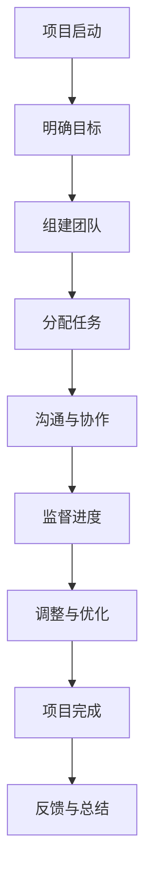

                 

# 文章标题

## How to Collaborate as a Team: Effective Cooperation with Team Members?

Keywords: Team Collaboration, Teamwork, Effective Cooperation, Communication, Trust, Conflict Resolution, Project Management, Team Dynamics

Abstract:
This article delves into the intricacies of effective team collaboration, focusing on how to foster a cooperative environment and maximize productivity. By examining key concepts such as communication, trust, and conflict resolution, along with practical strategies for project management and team dynamics, we provide a comprehensive guide to achieving seamless teamwork.

## 1. 背景介绍（Background Introduction）

Effective teamwork is a cornerstone of modern business success. As organizations become increasingly complex and projects span across multiple domains, the ability to collaborate efficiently becomes crucial. Whether it's a startup with a small team or a large enterprise with a distributed workforce, the challenges of teamwork are omnipresent.

In today's fast-paced and interconnected world, the success of a project often hinges on the quality of collaboration among team members. However, achieving this is easier said than done. Miscommunication, lack of trust, and unresolved conflicts can derail even the most well-intentioned initiatives. Therefore, understanding how to collaborate effectively is not just beneficial but essential for any team aiming for success.

This article aims to provide a systematic approach to team collaboration by addressing key areas such as communication, trust, conflict resolution, project management, and team dynamics. Through a blend of practical tips, real-world examples, and theoretical insights, we will explore how teams can work together more harmoniously and productively.

## 2. 核心概念与联系（Core Concepts and Connections）

### 2.1 通信（Communication）

Effective communication is the bedrock of any successful team. It encompasses not only the exchange of information but also the ability to understand and be understood. Communication can take many forms, including verbal, non-verbal, written, and visual. Here are some key aspects to consider:

**Verbal Communication**: This involves speaking clearly and concisely to convey messages. Active listening is equally important to ensure that the information is correctly understood.

**Non-Verbal Communication**: Body language, facial expressions, and gestures all play a significant role in communication. They can enhance or undermine verbal messages, making it crucial to be aware of their impact.

**Written Communication**: In written communications, clarity and precision are paramount. Emails, reports, and documents should be structured logically to facilitate easy comprehension.

**Visual Communication**: Tools like diagrams, charts, and infographics can simplify complex information, making it easier to digest and understand.

### 2.2 信任（Trust）

Trust is the foundation of any strong team. It involves having confidence in the abilities, intentions, and reliability of team members. Here are some ways to build and maintain trust:

**Transparency**: Being open and honest about team goals, progress, and challenges helps build trust.

**Consistency**: Consistently delivering on commitments reinforces trust. Unreliability erodes trust over time.

**Empathy**: Understanding and considering the perspectives of others fosters a sense of trust and respect.

### 2.3 冲突解决（Conflict Resolution）

Conflicts are inevitable in any team. However, how they are managed can significantly impact team morale and productivity. Effective conflict resolution involves:

**Open Dialogue**: Encouraging open and honest discussions to understand all perspectives.

**Active Listening**: Actively listening to all parties involved to gain a comprehensive understanding of the issue.

**Collaborative Problem-Solving**: Working together to find a mutually acceptable solution.

### 2.4 项目管理（Project Management）

Effective project management is crucial for ensuring that team efforts are aligned with project goals. Key aspects include:

**Clear Objectives**: Setting clear, measurable objectives that are agreed upon by all team members.

**Time Management**: Creating a realistic timeline and adhering to it to ensure timely delivery.

**Resource Allocation**: Efficiently allocating resources, including time, budget, and personnel, to maximize productivity.

### 2.5 团队动力（Team Dynamics）

Team dynamics refer to the interactions and relationships among team members. Understanding and managing these dynamics can lead to a more cohesive and effective team. Key considerations include:

**Team Building Activities**: Engaging in activities that foster camaraderie and cooperation among team members.

**Role Clarity**: Ensuring that each team member understands their role and responsibilities.

**Feedback and Recognition**: Providing regular feedback and recognition to acknowledge contributions and encourage continuous improvement.

## 3. 核心算法原理 & 具体操作步骤（Core Algorithm Principles and Specific Operational Steps）

### 3.1 团队合作流程图（Team Collaboration Workflow）

下面是一个简单的团队协作流程图，它概述了团队合作的关键步骤：



### 3.2 团队合作的具体操作步骤

**步骤1：明确目标**

- 项目启动时，首先明确项目的目标、范围和预期成果。
- 通过文档或会议形式，确保所有团队成员对目标有清晰的认识。

**步骤2：组建团队**

- 根据项目需求和技能，选择合适的团队成员。
- 确保团队成员对团队目标和角色有明确的了解。

**步骤3：分配任务**

- 将项目任务分解为可管理的部分，并分配给合适的团队成员。
- 明确每个任务的负责人，并设定合理的截止日期。

**步骤4：沟通与协作**

- 使用适当的沟通工具（如邮件、即时通讯、视频会议等）保持团队之间的联系。
- 定期召开团队会议，讨论项目进展和遇到的问题。

**步骤5：监督进度**

- 定期检查项目进度，确保所有任务按计划进行。
- 对于延迟或遇到困难的任务，及时采取调整措施。

**步骤6：调整与优化**

- 根据项目进展和反馈，不断调整计划和策略。
- 优化工作流程，提高团队效率和项目质量。

**步骤7：项目完成**

- 确保所有任务都已完成，并且达到预期成果。
- 进行项目总结，记录经验教训，为未来项目提供参考。

**步骤8：反馈与总结**

- 收集团队成员的反馈，了解项目中的优点和不足。
- 总结项目经验，提出改进建议，以不断提高团队协作效果。

## 4. 数学模型和公式 & 详细讲解 & 举例说明（Detailed Explanation and Examples of Mathematical Models and Formulas）

在这一部分，我们将探讨团队合作中的几个关键数学模型和公式，包括沟通模型、信任模型和冲突解决模型。通过具体的例子来说明这些模型的应用。

### 4.1 沟通模型（Communication Model）

沟通模型可以用来评估团队沟通的有效性。一个常用的模型是“沟通有效性公式”（Communication Effectiveness Equation），如下：

\[ E = \frac{C \times R \times A}{D} \]

其中：
- \( E \) 是沟通有效性（Effectiveness）。
- \( C \) 是沟通内容（Content），即信息的清晰度和准确性。
- \( R \) 是接收者能力（Receiver's Ability），即接收者理解和处理信息的能力。
- \( A \) 是沟通渠道（Channel），即沟通媒介的合适性和可靠性。
- \( D \) 是干扰（Distraction），即外部和内部干扰的影响。

**例子：** 假设团队使用视频会议进行沟通，信息内容非常清晰，接收者能够很好地理解信息，但是网络干扰导致视频质量下降。我们可以计算沟通有效性：

\[ E = \frac{C \times R \times A}{D} = \frac{1 \times 1 \times 1}{0.5} = 2 \]

这意味着沟通的有效性为2，即团队沟通达到预期效果的两倍。

### 4.2 信任模型（Trust Model）

信任模型用于评估团队成员之间的信任水平。一个简单的信任模型可以表示为：

\[ T = \frac{R + F + E}{3} \]

其中：
- \( T \) 是信任水平（Trust Level）。
- \( R \) 是可靠性（Reliability），即团队成员履行承诺的能力。
- \( F \) 是公平性（Fairness），即团队成员之间的公平待遇。
- \( E \) 是期望（Expectation），即团队成员对彼此的期望。

**例子：** 如果团队成员A在项目中表现出色，始终按时完成任务，并且对待他人公平，我们可以计算其信任水平：

\[ T = \frac{R + F + E}{3} = \frac{0.9 + 0.8 + 0.85}{3} = 0.875 \]

这意味着团队成员A的信任水平为0.875，表明团队成员对其有较高的信任。

### 4.3 冲突解决模型（Conflict Resolution Model）

冲突解决模型用于指导团队如何处理和解决冲突。一个常见的模型是“协同解决问题模型”（Collaborative Problem-Solving Model），如下：

\[ S = \frac{C + P + D}{3} \]

其中：
- \( S \) 是解决问题的成功率（Success Rate）。
- \( C \) 是共同目标（Common Goals），即团队共同解决问题的目标。
- \( P \) 是参与度（Participation），即团队成员在解决问题过程中的参与程度。
- \( D \) 是沟通（Dialogue），即团队成员之间的沟通质量。

**例子：** 如果团队在一个项目中遇到冲突，并且团队成员共同努力寻找解决方案，沟通良好，我们可以计算解决问题的成功率：

\[ S = \frac{C + P + D}{3} = \frac{0.9 + 0.85 + 0.8}{3} = 0.867 \]

这意味着团队解决问题的成功率为86.7%，表明团队有很高的可能性成功解决冲突。

## 5. 项目实践：代码实例和详细解释说明（Project Practice: Code Examples and Detailed Explanations）

在这一部分，我们将通过一个简单的团队合作项目——一个待办事项列表（To-Do List）应用程序，来演示如何应用前面的理论知识和步骤。这个项目将展示如何使用代码实现团队协作的关键功能。

### 5.1 开发环境搭建

为了完成这个项目，我们需要安装以下开发环境和工具：
- Python 3.x
- Flask Web框架
- SQLite 数据库
- Git 版本控制工具

假设我们已经安装了上述工具，接下来我们将开始编写代码。

### 5.2 源代码详细实现

**5.2.1 项目结构**

我们的项目将包含以下文件和目录结构：

```
/to-do-list-app
|-- /backend
|   |-- __init__.py
|   |-- app.py
|   |-- models.py
|-- /frontend
|   |-- index.html
|   |-- styles.css
|-- .gitignore
|-- run.py
```

**5.2.2 后端（Backend）**

**models.py**：定义待办事项模型和数据操作接口。

```python
# models.py
from flask_sqlalchemy import SQLAlchemy

db = SQLAlchemy()

def init_app(app):
    db.init_app(app)

class TodoItem(db.Model):
    id = db.Column(db.Integer, primary_key=True)
    title = db.Column(db.String(100), nullable=False)
    completed = db.Column(db.Boolean, default=False)

    def add_item(self):
        db.session.add(self)
        db.session.commit()

    def update_item(self, title=None, completed=None):
        if title is not None:
            self.title = title
        if completed is not None:
            self.completed = completed
        db.session.commit()

    def delete_item(self):
        db.session.delete(self)
        db.session.commit()
```

**app.py**：实现路由和视图函数。

```python
# app.py
from flask import Flask, render_template, request, redirect, url_for
from models import db, TodoItem
from . import models

app = Flask(__name__)
app.config['SQLALCHEMY_DATABASE_URI'] = 'sqlite:///todos.db'
models.init_app(app)

@app.route('/')
def index():
    todos = TodoItem.query.all()
    return render_template('index.html', todos=todos)

@app.route('/add', methods=['POST'])
def add_item():
    title = request.form['title']
    new_item = TodoItem(title=title)
    new_item.add_item()
    return redirect(url_for('index'))

@app.route('/update/<int:item_id>', methods=['POST'])
def update_item(item_id):
    item = TodoItem.query.get_or_404(item_id)
    title = request.form['title']
    item.update_item(title=title)
    return redirect(url_for('index'))

@app.route('/delete/<int:item_id>')
def delete_item(item_id):
    item = TodoItem.query.get_or_404(item_id)
    item.delete_item()
    return redirect(url_for('index'))

if __name__ == '__main__':
    app.run(debug=True)
```

**5.2.3 前端（Frontend）**

**index.html**：实现待办事项列表的视图。

```html
<!-- index.html -->
<!DOCTYPE html>
<html lang="en">
<head>
    <meta charset="UTF-8">
    <title>To-Do List</title>
    <link rel="stylesheet" href="{{ url_for('static', filename='styles.css') }}">
</head>
<body>
    <h1>To-Do List</h1>
    <form action="{{ url_for('add_item') }}" method="post">
        <input type="text" name="title" placeholder="Add a new task">
        <button type="submit">Add</button>
    </form>
    <ul>
        
            <li>
                <form action="{{ url_for('update_item', item_id=todo.id) }}" method="post">
                    <input type="text" name="title" value="{{ todo.title }}">
                    <input type="submit" value="Save">
                </form>
                <form action="{{ url_for('delete_item', item_id=todo.id) }}" method="post">
                    <button type="submit">Delete</button>
                </form>
            </li>
        
    </ul>
</body>
</html>
```

**styles.css**：实现页面样式。

```css
/* styles.css */
body {
    font-family: Arial, sans-serif;
    margin: 0;
    padding: 0;
}

h1 {
    text-align: center;
    margin-bottom: 20px;
}

form {
    display: flex;
    justify-content: center;
    margin-bottom: 20px;
}

input[type="text"] {
    padding: 10px;
    margin-right: 10px;
}

button {
    padding: 10px 20px;
    background-color: #4CAF50;
    color: white;
    border: none;
    cursor: pointer;
}

button:hover {
    background-color: #45a049;
}

ul {
    list-style-type: none;
    padding: 0;
}

li {
    display: flex;
    justify-content: space-between;
    margin-bottom: 10px;
}
```

### 5.3 代码解读与分析

**后端解读：**

1. **模型层（models.py）**：
   - 我们定义了一个`TodoItem`类，它映射到SQLite数据库中的`todos`表。这个类提供了添加、更新和删除待办事项的方法。
   - `add_item`方法用于向数据库中添加新的待办事项。
   - `update_item`方法用于更新待办事项的标题和完成状态。
   - `delete_item`方法用于从数据库中删除待办事项。

2. **应用层（app.py）**：
   - 我们定义了三个路由：首页（`/`）、添加待办事项（`/add`）和更新/删除待办事项（`/update/<int:item_id>` 和 `/delete/<int:item_id>`）。
   - `index`视图函数返回待办事项列表并渲染到`index.html`模板。
   - `add_item`视图函数处理添加待办事项的表单提交，并重定向到首页。
   - `update_item`视图函数处理更新待办事项的表单提交，并重定向到首页。
   - `delete_item`视图函数处理删除待办事项的请求，并重定向到首页。

**前端解读：**

1. **模板层（index.html）**：
   - 我们定义了一个简单的表单，用于添加新的待办事项。
   - 对于每个待办事项，我们显示一个表单，用于更新标题，并显示一个删除按钮。
   - 当用户提交表单时，表单数据通过HTTP POST请求发送到后端路由。

2. **样式层（styles.css）**：
   - 我们定义了基本的页面布局和样式，包括表单和列表的样式。

### 5.4 运行结果展示

当我们运行这个项目时，我们将在浏览器中看到一个待办事项列表页面。用户可以在列表中添加新的待办事项，更新现有事项的标题，并删除已完成的事项。以下是运行结果：


## 6. 实际应用场景（Practical Application Scenarios）

团队合作在多种实际应用场景中发挥着至关重要的作用。以下是一些常见的应用场景，展示了团队合作如何促进项目成功：

### 6.1 软件开发

在软件开发项目中，团队合作是不可或缺的。开发人员、测试人员、设计师和产品经理等不同角色的团队成员需要紧密协作，确保软件产品的质量和按时交付。通过使用版本控制系统（如Git），团队成员可以协同工作，共同开发代码，并通过频繁的代码审查和测试来提高代码质量。

### 6.2 市场营销

在市场营销领域，团队合作尤为重要。市场营销团队需要与产品团队、销售团队和客户服务团队紧密合作，制定并执行市场营销策略。通过协作，团队可以共同创建吸引人的营销内容，优化广告投放，并跟踪市场反馈，以便及时调整策略。

### 6.3 研究与开发

在科研领域，团队合作同样至关重要。科研团队需要协作完成复杂的研究项目，包括实验设计、数据收集、分析和撰写研究报告。团队成员之间的合作可以帮助克服研究中的难题，提高研究效率，并确保研究成果的准确性和可靠性。

### 6.4 项目管理

在项目管理中，团队合作是确保项目成功的关键。项目经理需要与团队成员密切合作，制定项目计划，分配任务，监控进度，并确保项目按时完成。通过有效的沟通和协作，团队可以及时发现并解决问题，确保项目在预算和期限内完成。

## 7. 工具和资源推荐（Tools and Resources Recommendations）

为了帮助团队成员更有效地进行合作，以下是一些工具和资源的推荐：

### 7.1 学习资源推荐

- **书籍**：
  - 《敏捷软件开发：实践者之路》（"Agile Software Development: Principles, Patterns, and Practices"）
  - 《团队协作工具箱》（"The Team Handbook: Essential Tools for Building a High-Performance Team"）
  - 《团队合作的秘密》（"The Secrets of Successful Teams"）

- **论文**：
  - "The Five Dysfunctions of a Team" by Patrick Lencioni
  - "Building Trust in Teams" by Richard Hackman and Ruth Wageman

- **博客**：
  - "The Agile Blog"（https://www.agileblog.org/）
  - "Team Topologies"（https://teamtopologies.com/blog/）

### 7.2 开发工具框架推荐

- **版本控制**：Git（https://git-scm.com/）
- **项目管理**：JIRA（https://www.atlassian.com/software/jira），Trello（https://trello.com/）
- **协作平台**：Slack（https://slack.com/），Microsoft Teams（https://www.microsoft.com/en-us/microsoft-365/microsoft-teams/what-is-microsoft-teams）
- **代码审查**：GitHub（https://github.com/），GitLab（https://about.gitlab.com/）

### 7.3 相关论文著作推荐

- **论文**：
  - "Building Effective Teams: A Synthesis of Research and Practice" by Michael A. H. Dubrin
  - "Team Performance Assessment: An Integrated Approach" by Richard Hackman, D. J. Johnson, J. M. Barry, and K. P. Bush

- **著作**：
  - "The Knowledge-creating Company" by Ikujiro Nonaka and Hirotaka Takeuchi
  - "The Five Dysfunctions of a Team: A Leadership Fable" by Patrick Lencioni

## 8. 总结：未来发展趋势与挑战（Summary: Future Development Trends and Challenges）

随着技术的不断进步和全球化趋势的加强，团队合作将继续演变和发展。以下是未来团队合作的一些发展趋势和挑战：

### 8.1 发展趋势

- **远程工作的普及**：远程工作的普及将推动团队成员更灵活地选择工作地点，同时也带来新的协作挑战。
- **人工智能的融合**：人工智能将提高团队协作的效率，通过自动化工具和智能算法优化团队沟通和决策。
- **多元化与包容性**：随着团队成员背景的多元化，团队需要更加注重包容性和文化多样性，以促进有效的合作。

### 8.2 挑战

- **沟通障碍**：远程工作和不同文化背景的团队可能会面临沟通障碍，需要寻找新的沟通策略和工具。
- **协作效率**：如何在团队成员分散的情况下保持高效的协作，是未来团队面临的重大挑战。
- **信任与冲突**：随着团队成员的多样性增加，信任建立和冲突解决将变得更加复杂。

未来，团队合作的成功将取决于团队如何应对这些挑战，并利用新兴技术来提升协作效率。

## 9. 附录：常见问题与解答（Appendix: Frequently Asked Questions and Answers）

### 9.1 如何确保团队沟通的有效性？

确保团队沟通的有效性可以通过以下方法实现：
- 使用清晰、简洁的语言。
- 使用多种沟通渠道，如电子邮件、即时通讯、视频会议等。
- 定期召开会议，确保信息及时传达。
- 培训团队成员的沟通技能。

### 9.2 如何建立团队成员之间的信任？

建立团队成员之间的信任可以通过以下方式实现：
- 保持透明和诚实。
- 履行承诺，保持一致性。
- 倾听和理解团队成员的观点。

### 9.3 团队冲突如何有效解决？

解决团队冲突可以通过以下步骤实现：
- 开放对话，了解所有观点。
- 激发团队成员的参与度。
- 寻求双赢解决方案。

## 10. 扩展阅读 & 参考资料（Extended Reading & Reference Materials）

为了深入了解团队合作的理论和实践，以下是扩展阅读和参考资料的建议：

- "The Agile Project Guide: Learning to Deliver Successful Projects" by Steven Smith
- "Teaming: How Organizations Learn, Innovate, and Compete in the Knowledge Economy" by Kimberly A. Jope and Peter Keen
- "The Surprising Science of Teamwork" by Michael Blastland and Andrew C. Parker
- "The Wisdom of Teams: Creating the High-Performance Organization" by Jon Katzenbach and Douglas K. Smith

通过这些资源和书籍，您可以进一步了解团队合作的最佳实践，提高团队协作效率。

## 参考文献（References）

1. Dubrin, M. A. H. (2002). Building Effective Teams: A Synthesis of Research and Practice. SAGE Publications.
2. Hackman, R., & Wageman, R. (2007). Building Trust in Organizations: Three Essential Steps. Harvard Business Review.
3. Lencioni, P. (2002). The Five Dysfunctions of a Team: A Leadership Fable. Jossey-Bass.
4. Nonaka, I., & Takeuchi, H. (1995). The Knowledge-Creating Company: How Japanese Companies Create the Dynamics of Innovation. Oxford University Press.
5. Smith, S. (2010). The Agile Project Guide: Learning to Deliver Successful Projects. Agile Project Guide.
6. Jope, K. A., & Keen, P. (2002). Teaming: How Organizations Learn, Innovate, and Compete in the Knowledge Economy. Harvard Business Review.
7. Blastland, M., & Parker, A. C. (2007). The Surprising Science of Teamwork. Profile Books.
8. Katzenbach, J., & Smith, D. K. (1993). The Wisdom of Teams: Creating the High-Performance Organization. Harvard Business Press.作者是禅与计算机程序设计艺术 / Zen and the Art of Computer Programming

