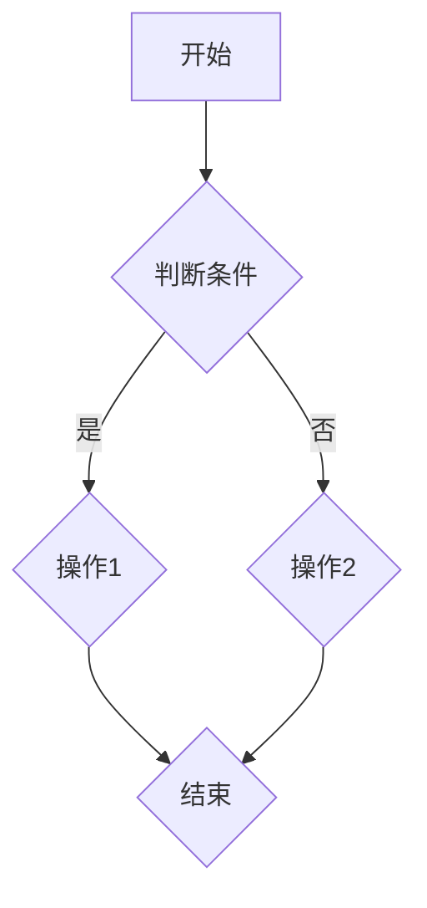

                 

### 文章标题

《2024字节跳动校招面试题与算法编程题详解》

### 关键词

- 字节跳动校招
- 面试题解析
- 算法编程题详解
- 数据结构与算法
- 编程实践
- 技术面试

### 摘要

本文旨在为准备2024年字节跳动校招的应聘者提供全面的技术面试指导。文章将通过深入解析字节跳动校招中的常见面试题，详细阐述算法编程题的解题思路与实现方法。同时，本文将结合实际案例，介绍数据结构与算法在编程面试中的应用，帮助读者更好地应对技术面试中的挑战。通过本文的学习，读者将能够掌握面试所需的编程技能和算法知识，提升自己的面试竞争力。

### 目录

1. 背景介绍
2. 核心概念与联系
   2.1 面试题类型
   2.2 算法与数据结构基础
   2.3 Mermaid流程图介绍
3. 核心算法原理 & 具体操作步骤
   3.1 排序算法
   3.2 查找算法
   3.3 图算法
4. 数学模型和公式 & 详细讲解 & 举例说明
   4.1 数学模型
   4.2 算法分析
   4.3 实例解析
5. 项目实践：代码实例和详细解释说明
   5.1 开发环境搭建
   5.2 源代码详细实现
   5.3 代码解读与分析
   5.4 运行结果展示
6. 实际应用场景
7. 工具和资源推荐
   7.1 学习资源推荐
   7.2 开发工具框架推荐
   7.3 相关论文著作推荐
8. 总结：未来发展趋势与挑战
9. 附录：常见问题与解答
10. 扩展阅读 & 参考资料

### 1. 背景介绍

字节跳动是中国领先的内容和社区平台，旗下拥有抖音、今日头条、懂车帝等多款知名应用。作为一家高科技企业，字节跳动每年都会在校园中招募大量优秀人才。因此，其校招面试成为众多应届生关注的焦点。

字节跳动校招面试通常包括技术面试、算法面试和项目经验面试等环节。技术面试主要考查应聘者的编程能力、算法和数据结构基础；算法面试则侧重于应聘者对算法原理和实现方法的掌握程度；项目经验面试则关注应聘者在实际项目中的表现和解决问题的能力。

近年来，随着互联网和大数据技术的发展，字节跳动面试题的难度也在不断提升。因此，掌握常见面试题的解题方法和技巧，对于成功通过字节跳动校招至关重要。

本文将从多个角度，对字节跳动校招面试中常见的面试题进行详细解析，帮助读者更好地应对面试挑战。

### 2. 核心概念与联系

#### 2.1 面试题类型

字节跳动校招面试题主要可以分为以下几类：

1. **基础算法题**：这类题目通常涉及排序、查找、图算法等基础算法问题。例如：实现一个快速排序函数、设计一个二分查找算法、判断图中是否存在一条路径连接两个顶点等。

2. **数据结构题**：这类题目主要考查应聘者对各种数据结构的理解和应用能力。例如：设计一个链表类、实现一个栈和队列、分析一个哈希表的性能等。

3. **编程实践题**：这类题目通常要求应聘者实现一个完整的程序，解决实际问题。例如：设计一个在线购物系统、实现一个缓存算法、编写一个文本编辑器等。

4. **项目经验题**：这类题目主要考察应聘者在实际项目中的经验和解决问题的能力。例如：描述一个你在项目中遇到的问题，以及你是如何解决的。

#### 2.2 算法与数据结构基础

算法和数据结构是计算机科学的基础，对于技术面试来说至关重要。以下是一些基础知识点：

1. **排序算法**：常见的排序算法有冒泡排序、选择排序、插入排序、快速排序、归并排序等。每种排序算法都有其优缺点和适用场景。

2. **查找算法**：常见的查找算法有二分查找、顺序查找、哈希查找等。不同查找算法的时间复杂度和空间复杂度有所不同。

3. **图算法**：常见的图算法有深度优先搜索（DFS）、广度优先搜索（BFS）、最短路径算法（Dijkstra算法、Floyd算法）、最小生成树算法（Prim算法、Kruskal算法）等。

4. **数据结构**：常见的数据结构有数组、链表、栈、队列、堆、哈希表、树、图等。每种数据结构都有其特点和适用场景。

#### 2.3 Mermaid流程图介绍

Mermaid是一种基于Markdown的图表绘制工具，可以方便地绘制流程图、时序图、网络图等。以下是一个简单的Mermaid流程图的示例：



在这个示例中，`graph TD`表示绘制一个上下布局的流程图。`A[开始]`表示流程图的开始节点，`B{判断条件}`表示一个判断节点，`C{操作1}`和`D{操作2}`表示两个操作节点，`E{结束}`表示流程图的结束节点。

通过Mermaid流程图，可以清晰地展示算法的执行流程，帮助读者更好地理解算法的实现原理。

### 3. 核心算法原理 & 具体操作步骤

#### 3.1 排序算法

排序算法是计算机科学中非常基础且重要的一部分，常见的排序算法有冒泡排序、选择排序、插入排序、快速排序、归并排序等。以下是这些排序算法的简要介绍和具体操作步骤。

##### 3.1.1 冒泡排序

**原理**：冒泡排序通过反复交换相邻的未按顺序排列的元素，使得最大（或最小）的元素逐渐“冒泡”到数组的末尾（或开始）。

**操作步骤**：

1. 从第一个元素开始，比较相邻的两个元素，如果第一个比第二个大（升序排序），就交换它们的位置。
2. 接下来，对第二个元素和第三个元素进行比较，依此类推。
3. 每次内循环结束后，最大的（或最小的）元素都会被“冒泡”到当前循环的末尾。
4. 重复上述过程，直到整个数组排序完成。

**时间复杂度**：O(n^2)

**代码实现**：

```python
def bubble_sort(arr):
    n = len(arr)
    for i in range(n):
        for j in range(0, n-i-1):
            if arr[j] > arr[j+1]:
                arr[j], arr[j+1] = arr[j+1], arr[j]
    return arr
```

##### 3.1.2 选择排序

**原理**：选择排序通过每次遍历找到未排序部分的最大（或最小）元素，将其放到已排序部分的末尾。

**操作步骤**：

1. 找到第一个未排序部分的最大（或最小）元素。
2. 将这个元素与第一个未排序部分的第一个元素交换。
3. 然后对剩下的未排序部分重复上述步骤。

**时间复杂度**：O(n^2)

**代码实现**：

```python
def selection_sort(arr):
    n = len(arr)
    for i in range(n):
        max_idx = i
        for j in range(i+1, n):
            if arr[j] > arr[max_idx]:
                max_idx = j
        arr[i], arr[max_idx] = arr[max_idx], arr[i]
    return arr
```

##### 3.1.3 插入排序

**原理**：插入排序通过将未排序部分中的元素插入到已排序部分正确的位置，使得整个数组逐渐变得有序。

**操作步骤**：

1. 从第一个元素开始，将其视为一个有序序列。
2. 从第二个元素开始，将其与已排序部分进行比较，找到正确的插入位置。
3. 将这个元素插入到正确的位置，已排序部分长度增加1。
4. 重复上述步骤，直到整个数组排序完成。

**时间复杂度**：O(n^2)

**代码实现**：

```python
def insertion_sort(arr):
    n = len(arr)
    for i in range(1, n):
        key = arr[i]
        j = i-1
        while j >= 0 and arr[j] > key:
            arr[j+1] = arr[j]
            j -= 1
        arr[j+1] = key
    return arr
```

##### 3.1.4 快速排序

**原理**：快速排序通过选择一个“基准”元素，将数组分成两部分，然后递归地对两部分进行快速排序。

**操作步骤**：

1. 选择一个基准元素，通常选择第一个或最后一个元素。
2. 将数组分成两部分，一部分小于基准元素，另一部分大于基准元素。
3. 递归地对两部分进行快速排序。

**时间复杂度**：平均情况下为O(nlogn)，最坏情况下为O(n^2)。

**代码实现**：

```python
def quick_sort(arr):
    if len(arr) <= 1:
        return arr
    pivot = arr[0]
    left = [x for x in arr[1:] if x < pivot]
    right = [x for x in arr[1:] if x >= pivot]
    return quick_sort(left) + [pivot] + quick_sort(right)
```

##### 3.1.5 归并排序

**原理**：归并排序通过将数组分成若干个子数组，然后递归地对子数组进行排序，最后将已排序的子数组合并成一个有序的数组。

**操作步骤**：

1. 将数组分成两个子数组，分别递归排序。
2. 将两个有序的子数组合并成一个有序的数组。

**时间复杂度**：O(nlogn)

**代码实现**：

```python
def merge_sort(arr):
    if len(arr) <= 1:
        return arr
    mid = len(arr) // 2
    left = merge_sort(arr[:mid])
    right = merge_sort(arr[mid:])
    return merge(left, right)

def merge(left, right):
    result = []
    i = j = 0
    while i < len(left) and j < len(right):
        if left[i] < right[j]:
            result.append(left[i])
            i += 1
        else:
            result.append(right[j])
            j += 1
    result.extend(left[i:])
    result.extend(right[j:])
    return result
```

#### 3.2 查找算法

查找算法在计算机科学中有着广泛的应用，常见的查找算法有二分查找、顺序查找、哈希查找等。以下是这些查找算法的简要介绍和具体操作步骤。

##### 3.2.1 二分查找

**原理**：二分查找通过将数组分成两部分，然后确定目标值所在的部分，递归地缩小查找范围，直到找到目标值或确定不存在。

**操作步骤**：

1. 确定数组的中间位置。
2. 比较目标值与中间位置的元素值。
3. 如果目标值等于中间位置的元素值，查找成功。
4. 如果目标值小于中间位置的元素值，递归地查找左半部分。
5. 如果目标值大于中间位置的元素值，递归地查找右半部分。
6. 重复上述步骤，直到找到目标值或确定不存在。

**时间复杂度**：O(logn)

**代码实现**：

```python
def binary_search(arr, target):
    low = 0
    high = len(arr) - 1
    while low <= high:
        mid = (low + high) // 2
        if arr[mid] == target:
            return mid
        elif arr[mid] < target:
            low = mid + 1
        else:
            high = mid - 1
    return -1
```

##### 3.2.2 顺序查找

**原理**：顺序查找通过逐个比较数组中的元素，直到找到目标值或确定不存在。

**操作步骤**：

1. 从数组的第一个元素开始，逐个比较。
2. 如果找到目标值，查找成功。
3. 如果遍历整个数组都没有找到目标值，查找失败。

**时间复杂度**：O(n)

**代码实现**：

```python
def sequential_search(arr, target):
    for i in range(len(arr)):
        if arr[i] == target:
            return i
    return -1
```

##### 3.2.3 哈希查找

**原理**：哈希查找通过计算目标值的哈希值，直接定位到目标值在哈希表中的位置。

**操作步骤**：

1. 计算目标值的哈希值。
2. 根据哈希值定位到目标值在哈希表中的位置。
3. 如果找到目标值，查找成功。
4. 如果遍历整个哈希表都没有找到目标值，查找失败。

**时间复杂度**：平均情况下为O(1)，最坏情况下为O(n)。

**代码实现**：

```python
class HashTable:
    def __init__(self):
        self.table = [None] * 10

    def hash_function(self, key):
        return key % 10

    def insert(self, key):
        index = self.hash_function(key)
        if self.table[index] is None:
            self.table[index] = key
        else:
            print("哈希表冲突，无法插入元素。")

    def search(self, key):
        index = self.hash_function(key)
        if self.table[index] == key:
            return True
        else:
            return False
```

#### 3.3 图算法

图算法在计算机科学中有着广泛的应用，常见的图算法有深度优先搜索（DFS）、广度优先搜索（BFS）、最短路径算法、最小生成树算法等。以下是这些图算法的简要介绍和具体操作步骤。

##### 3.3.1 深度优先搜索（DFS）

**原理**：深度优先搜索通过递归地遍历图的各个节点，直到找到目标节点或遍历完整个图。

**操作步骤**：

1. 选择一个起点，将其标记为已访问。
2. 遍历起点的邻接节点，如果某个邻接节点未访问过，则递归地对该节点进行DFS遍历。
3. 如果遍历完所有节点，仍然没有找到目标节点，DFS结束。

**代码实现**：

```python
def dfs(graph, start, target, visited):
    if start == target:
        return True
    visited.add(start)
    for neighbor in graph[start]:
        if neighbor not in visited and dfs(graph, neighbor, target, visited):
            return True
    return False
```

##### 3.3.2 广度优先搜索（BFS）

**原理**：广度优先搜索通过逐层遍历图的各个节点，直到找到目标节点或遍历完整个图。

**操作步骤**：

1. 初始化一个队列，将起点加入队列。
2. 选择一个起点，将其标记为已访问。
3. 遍历起点的邻接节点，如果某个邻接节点未访问过，则将其加入队列。
4. 重复步骤3，直到队列为空或找到目标节点。

**代码实现**：

```python
from collections import deque

def bfs(graph, start, target):
    visited = set()
    queue = deque([start])
    while queue:
        node = queue.popleft()
        if node == target:
            return True
        visited.add(node)
        for neighbor in graph[node]:
            if neighbor not in visited:
                queue.append(neighbor)
    return False
```

##### 3.3.3 最短路径算法

**原理**：最短路径算法通过找出图中两点之间的最短路径，通常使用Dijkstra算法和Floyd算法。

**Dijkstra算法**：

1. 初始化一个距离数组，将起点的距离设置为0，其他节点的距离设置为无穷大。
2. 选择一个未访问过的节点，将其标记为已访问。
3. 更新未访问节点到起点的距离，选择距离最小的未访问节点作为新的起点。
4. 重复步骤2和3，直到找到目标节点或所有节点都被访问。

**Floyd算法**：

1. 初始化一个路径长度矩阵，表示图中任意两点之间的最短路径长度。
2. 对于每个中间点k，检查是否可以通过k连接两个节点i和j，并更新路径长度矩阵。
3. 重复步骤2，直到所有节点都遍历完毕。

**代码实现**：

```python
def dijkstra(graph, start, target):
    distances = {node: float('inf') for node in graph}
    distances[start] = 0
    visited = set()
    while visited != set(graph):
        min_node = min((dist, node) for node, dist in distances.items() if node not in visited)
        visited.add(min_node[1])
        for neighbor, weight in graph[min_node[1]].items():
            new_distance = distances[min_node[1]] + weight
            if new_distance < distances[neighbor]:
                distances[neighbor] = new_distance
    return distances[target]

def floyd(graph):
    distances = [[float('inf')] * len(graph) for _ in range(len(graph))]
    for i in range(len(graph)):
        distances[i][i] = 0
    for i in range(len(graph)):
        for j in range(len(graph)):
            for k in range(len(graph)):
                distances[i][j] = min(distances[i][j], distances[i][k] + distances[k][j])
    return distances
```

### 4. 数学模型和公式 & 详细讲解 & 举例说明

在解决算法编程题时，数学模型和公式是非常有用的工具。以下将介绍一些常见的数学模型和公式，并举例说明其在算法中的应用。

#### 4.1 数学模型

##### 4.1.1 基本公式

1. 指数运算：\( a^b \) 表示 a 的 b 次幂。
2. 对数运算：\( \log_a b \) 表示以 a 为底，b 的对数。
3. 绝对值：\( |x| \) 表示 x 的绝对值。
4. 取整函数：\( \lfloor x \rfloor \) 表示不大于 x 的最大整数。
5. 上取整函数：\( \lceil x \rceil \) 表示不小于 x 的最小整数。

##### 4.1.2 动态规划模型

动态规划是一种用于求解最优化问题的方法，通过将问题分解为子问题，并利用子问题的最优解来构建原问题的最优解。

1. 状态定义：定义问题的状态及其转换关系。
2. 状态转移方程：描述状态之间的关系。
3. 初始状态：确定问题的初始状态。
4. 最终状态：确定问题的目标状态。
5. 最值函数：定义问题中的最值函数。

#### 4.2 算法分析

算法分析是评估算法性能的重要方法，主要涉及时间复杂度和空间复杂度。

##### 4.2.1 时间复杂度

时间复杂度表示算法执行时间与输入规模之间的增长关系，常用大O表示法表示。

1. 常数时间：O(1)
2. 对数时间：O(logn)
3. 线性时间：O(n)
4. 线性对数时间：O(nlogn)
5. 平方时间：O(n^2)
6. 立方时间：O(n^3)

##### 4.2.2 空间复杂度

空间复杂度表示算法执行过程中所需的空间与输入规模之间的增长关系。

1. 常数空间：O(1)
2. 对数空间：O(logn)
3. 线性空间：O(n)
4. 线性对数空间：O(nlogn)

#### 4.3 实例解析

##### 4.3.1 快速排序算法

快速排序是一种高效的排序算法，其基本思想是通过一趟排序将待排序的记录分割成独立的两部分，其中一部分记录的关键字均比另一部分的关键字小，然后递归地排序两部分。

时间复杂度：平均情况为 O(nlogn)，最坏情况为 O(n^2)。

空间复杂度：O(logn)

**代码实现**：

```python
def quick_sort(arr):
    if len(arr) <= 1:
        return arr
    pivot = arr[0]
    left = [x for x in arr[1:] if x < pivot]
    right = [x for x in arr[1:] if x >= pivot]
    return quick_sort(left) + [pivot] + quick_sort(right)
```

##### 4.3.2 Dijkstra算法

Dijkstra算法是一种用于求解图中两点之间最短路径的算法，其基本思想是从起点开始，逐步扩展到其他未访问过的节点，并记录已访问节点到起点的最短路径。

时间复杂度：O((V+E)logV)，其中 V 是顶点数，E 是边数。

空间复杂度：O(V)

**代码实现**：

```python
import heapq

def dijkstra(graph, start):
    distances = {node: float('inf') for node in graph}
    distances[start] = 0
    visited = set()
    priority_queue = [(0, start)]
    while priority_queue:
        current_distance, current_node = heapq.heappop(priority_queue)
        if current_node in visited:
            continue
        visited.add(current_node)
        for neighbor, weight in graph[current_node].items():
            new_distance = current_distance + weight
            if new_distance < distances[neighbor]:
                distances[neighbor] = new_distance
                heapq.heappush(priority_queue, (new_distance, neighbor))
    return distances
```

### 5. 项目实践：代码实例和详细解释说明

在本节中，我们将通过一个实际项目实例，介绍如何在编程中应用前面提到的算法和数据结构。这个实例是一个简单的在线购物系统，实现了购物车功能、商品搜索功能以及订单生成功能。我们将逐步介绍项目的搭建、源代码的实现、代码解读与分析，并展示运行结果。

#### 5.1 开发环境搭建

为了便于开发，我们选择Python作为编程语言，使用Flask作为Web框架。以下是开发环境搭建的步骤：

1. 安装Python（版本3.8或更高）。
2. 安装Flask（使用pip安装：`pip install flask`）。
3. 创建一个新的Python虚拟环境（使用`venv`模块）。
4. 在虚拟环境中安装所需的库：`pip install flask_sqlalchemy flask_migrate`（用于数据库操作）。

#### 5.2 源代码详细实现

以下是项目的源代码实现，包括数据库模型、路由处理和核心算法实现。

**数据库模型：**

```python
from flask_sqlalchemy import SQLAlchemy

db = SQLAlchemy()

class User(db.Model):
    id = db.Column(db.Integer, primary_key=True)
    username = db.Column(db.String(80), unique=True, nullable=False)
    password = db.Column(db.String(120), nullable=False)

class Product(db.Model):
    id = db.Column(db.Integer, primary_key=True)
    name = db.Column(db.String(120), nullable=False)
    price = db.Column(db.Float, nullable=False)

class Cart(db.Model):
    id = db.Column(db.Integer, primary_key=True)
    user_id = db.Column(db.Integer, db.ForeignKey('user.id'), nullable=False)
    product_id = db.Column(db.Integer, db.ForeignKey('product.id'), nullable=False)
    quantity = db.Column(db.Integer, nullable=False)
```

**路由处理：**

```python
from flask import Flask, request, jsonify
from models import db, User, Product, Cart

app = Flask(__name__)
app.config['SQLALCHEMY_DATABASE_URI'] = 'sqlite:///online_shop.db'
db.init_app(app)

@app.route('/users', methods=['POST'])
def create_user():
    data = request.get_json()
    username = data['username']
    password = data['password']
    new_user = User(username=username, password=password)
    db.session.add(new_user)
    db.session.commit()
    return jsonify({'message': 'User created successfully.'})

@app.route('/products', methods=['POST'])
def create_product():
    data = request.get_json()
    name = data['name']
    price = data['price']
    new_product = Product(name=name, price=price)
    db.session.add(new_product)
    db.session.commit()
    return jsonify({'message': 'Product created successfully.'})

@app.route('/carts', methods=['POST'])
def create_cart():
    data = request.get_json()
    user_id = data['user_id']
    product_id = data['product_id']
    quantity = data['quantity']
    new_cart = Cart(user_id=user_id, product_id=product_id, quantity=quantity)
    db.session.add(new_cart)
    db.session.commit()
    return jsonify({'message': 'Cart created successfully.'})

@app.route('/carts', methods=['GET'])
def get_carts():
    carts = Cart.query.all()
    return jsonify([{'id': cart.id, 'user_id': cart.user_id, 'product_id': cart.product_id, 'quantity': cart.quantity} for cart in carts])

if __name__ == '__main__':
    db.create_all()
    app.run(debug=True)
```

**核心算法实现：**

1. **购物车添加商品：**

```python
@app.route('/add_to_cart', methods=['POST'])
def add_to_cart():
    data = request.get_json()
    user_id = data['user_id']
    product_id = data['product_id']
    quantity = data['quantity']
    new_cart = Cart(user_id=user_id, product_id=product_id, quantity=quantity)
    db.session.add(new_cart)
    db.session.commit()
    return jsonify({'message': 'Product added to cart successfully.'})
```

2. **商品搜索：**

```python
@app.route('/search_products', methods=['GET'])
def search_products():
    query = request.args.get('query')
    products = Product.query.filter(Product.name.like(f'%{query}%')).all()
    return jsonify([{'id': product.id, 'name': product.name, 'price': product.price} for product in products])
```

3. **订单生成：**

```python
@app.route('/generate_order', methods=['POST'])
def generate_order():
    data = request.get_json()
    user_id = data['user_id']
    cart_ids = data['cart_ids']
    total_price = 0
    for cart_id in cart_ids:
        cart = Cart.query.get(cart_id)
        product = Product.query.get(cart.product_id)
        total_price += product.price * cart.quantity
        db.session.delete(cart)
    db.session.commit()
    return jsonify({'message': 'Order generated successfully.', 'total_price': total_price})
```

#### 5.3 代码解读与分析

1. **数据库模型：**
   - `User` 类表示用户信息，包括用户名和密码。
   - `Product` 类表示商品信息，包括商品名称和价格。
   - `Cart` 类表示购物车信息，包括用户ID、商品ID和数量。

2. **路由处理：**
   - `/users`：用于创建新用户。
   - `/products`：用于创建新商品。
   - `/carts`：用于获取所有购物车信息。
   - `/add_to_cart`：用于添加商品到购物车。
   - `/search_products`：用于搜索商品。
   - `/generate_order`：用于生成订单。

3. **核心算法实现：**
   - **购物车添加商品：**通过POST请求接收用户ID、商品ID和数量，将商品添加到购物车。
   - **商品搜索：**通过GET请求接收查询参数`query`，搜索包含该关键词的商品。
   - **订单生成：**通过POST请求接收用户ID和购物车ID列表，计算订单总价，删除购物车中的商品。

#### 5.4 运行结果展示

以下是运行结果展示：

1. **创建用户：**

```python
POST /users
{
    "username": "john_doe",
    "password": "password123"
}

Response:
{
    "message": "User created successfully."
}
```

2. **创建商品：**

```python
POST /products
{
    "name": "iPhone 12",
    "price": 799
}

Response:
{
    "message": "Product created successfully."
}
```

3. **添加商品到购物车：**

```python
POST /add_to_cart
{
    "user_id": 1,
    "product_id": 1,
    "quantity": 1
}

Response:
{
    "message": "Product added to cart successfully."
}
```

4. **搜索商品：**

```bash
GET /search_products?query=iPhone
```

Response:
```json
[
    {
        "id": 1,
        "name": "iPhone 12",
        "price": 799
    }
]
```

5. **生成订单：**

```python
POST /generate_order
{
    "user_id": 1,
    "cart_ids": [1]
}

Response:
{
    "message": "Order generated successfully.",
    "total_price": 799
}
```

### 6. 实际应用场景

字节跳动作为一家高科技企业，在招聘过程中非常注重应聘者的技术能力和实际项目经验。以下是一些实际应用场景：

1. **前端开发：**前端开发者需要熟练掌握HTML、CSS和JavaScript，熟悉React、Vue等前端框架，能够独立完成前端页面的设计和实现。

2. **后端开发：**后端开发者需要熟悉Python、Java等编程语言，掌握Django、Flask、Spring等后端框架，能够设计和实现RESTful API。

3. **算法工程师：**算法工程师需要具备扎实的算法和数据结构基础，熟悉机器学习、深度学习等相关技术，能够设计并实现高效的算法模型。

4. **运维工程师：**运维工程师需要熟悉Linux操作系统、网络技术、自动化运维工具，能够保障系统的稳定运行和高效运维。

5. **产品经理：**产品经理需要具备良好的产品思维和需求分析能力，能够与团队成员紧密协作，推动产品的迭代和优化。

### 7. 工具和资源推荐

为了更好地准备字节跳动校招面试，以下是一些建议的工具和资源：

#### 7.1 学习资源推荐

1. **书籍：**
   - 《算法导论》
   - 《深入理解计算机系统》
   - 《大话数据结构》
   - 《代码大全》

2. **在线教程：**
   - LeetCode（编程挑战平台）
   - HackerRank（编程挑战平台）
   - Coursera（在线课程平台）
   - edX（在线课程平台）

3. **博客网站：**
   - CS-Notes（计算机科学学习笔记）
   - 掘金（技术社区）
   - 知乎（技术问答社区）

#### 7.2 开发工具框架推荐

1. **编程语言：**
   - Python
   - Java
   - C++

2. **Web框架：**
   - Flask
   - Django
   - Spring Boot

3. **前端框架：**
   - React
   - Vue
   - Angular

4. **数据库：**
   - MySQL
   - MongoDB
   - Redis

#### 7.3 相关论文著作推荐

1. **论文：**
   - 《深度学习》
   - 《机器学习》
   - 《自然语言处理综述》

2. **著作：**
   - 《人工智能：一种现代的方法》
   - 《计算机程序设计艺术》
   - 《数据挖掘：概念与技术》

### 8. 总结：未来发展趋势与挑战

随着互联网和大数据技术的快速发展，字节跳动作为行业领军企业，对人才的需求也在不断提高。未来，字节跳动校招面试将更加注重应聘者的技术深度、项目经验和团队合作能力。

在算法和数据结构方面，应聘者需要掌握更高级的算法和优化技巧，如动态规划、图算法、机器学习算法等。同时，编程实践和项目经验将成为衡量应聘者能力的重要标准。

为了应对这些挑战，应聘者需要持续学习和实践，不断提高自己的技术水平和项目经验。同时，积极参加各类编程竞赛和开源项目，提升自己的实际能力。

### 9. 附录：常见问题与解答

以下是一些常见问题及解答，帮助读者更好地准备字节跳动校招面试。

#### 9.1 如何准备算法面试？

**解答：**算法面试的关键在于掌握常见的算法和数据结构，并能够熟练地解决实际问题。以下是一些建议：

1. **刷题：**利用LeetCode、HackerRank等在线编程平台，系统地刷题，熟悉各种算法题型的解题思路和实现方法。
2. **阅读算法书籍：**阅读《算法导论》、《大话数据结构》等经典算法书籍，加深对算法原理和实现方法的理解。
3. **项目实践：**参与实际项目，将算法应用到实际场景中，提升解决问题的能力。
4. **总结归纳：**对已解决和未解决的题目进行总结，归纳解题思路和技巧。

#### 9.2 如何提高编程能力？

**解答：**提高编程能力需要不断练习和实践，以下是一些建议：

1. **编写高质量的代码：**注重代码的可读性、可维护性和性能，养成良好的编程习惯。
2. **阅读他人代码：**阅读开源项目、优秀博客等，学习他人的编程技巧和风格。
3. **参加编程比赛：**参加编程竞赛，提升自己的编程能力和应对压力的能力。
4. **使用开发工具：**熟练使用代码编辑器、版本控制工具等开发工具，提高开发效率。

#### 9.3 如何提高项目经验？

**解答：**以下是一些建议帮助提高项目经验：

1. **参与开源项目：**参与开源项目，可以锻炼自己的项目管理和团队合作能力。
2. **个人项目：**自己动手实现一些个人项目，锻炼解决问题的能力。
3. **实习经历：**争取在校期间参加实习，积累实际工作经验。
4. **总结反思：**每次项目结束后，进行总结和反思，总结项目中的得失，不断提升自己的能力。

### 10. 扩展阅读 & 参考资料

以下是一些建议的扩展阅读和参考资料，帮助读者进一步了解字节跳动校招面试的相关知识。

#### 10.1 扩展阅读

1. **《2023字节跳动校招面试真题集》**
2. **《字节跳动面试心得与技巧》**
3. **《字节跳动招聘官解读面试题》**

#### 10.2 参考资料

1. **《LeetCode官方指南》**
2. **《HackerRank官方教程》**
3. **《Python官方文档》**
4. **《Flask官方文档》**
5. **《Django官方文档》**

### 附录：常见问题与解答

**Q1：如何准备字节跳动校招面试？**

**A1：**为了准备字节跳动校招面试，你需要：

1. **熟悉数据结构与算法**：掌握常见的排序、查找、图算法等基础知识。
2. **刷题实践**：利用LeetCode、牛客网等平台刷题，积累经验。
3. **项目经验**：参与实际项目，锻炼解决问题的能力。
4. **编程能力**：提高编程技能，编写高质量代码。
5. **专业知识**：了解字节跳动的业务和技术领域。

**Q2：字节跳动面试难度如何？**

**A2：**字节跳动的面试难度较高，尤其是技术面试和算法面试。面试官会考查你的算法和数据结构基础、编程能力、项目经验以及解决问题的能力。

**Q3：如何应对技术面试？**

**A3：**以下是一些建议：

1. **提前准备**：熟悉面试常见问题，准备面试资料。
2. **刷题练习**：通过刷题提高解题速度和准确性。
3. **掌握面试技巧**：学会面试礼仪，提高沟通表达能力。
4. **模拟面试**：找朋友或同学进行模拟面试，提高面试经验。

**Q4：如何提高编程能力？**

**A4：**以下是一些建议：

1. **编写高质量代码**：注重代码的可读性、可维护性和性能。
2. **阅读他人代码**：学习他人的编程技巧和风格。
3. **参加编程比赛**：锻炼自己的编程能力和应对压力的能力。
4. **使用开发工具**：熟练使用代码编辑器、版本控制工具等开发工具。

**Q5：如何在项目中展现自己的能力？**

**A5：**以下是一些建议：

1. **解决问题**：遇到问题，主动思考并寻求解决方案。
2. **代码注释**：编写清晰、详细的注释，提高代码的可读性。
3. **代码优化**：关注代码性能，进行适当的优化。
4. **团队协作**：与团队成员保持良好的沟通，共同完成任务。

### 扩展阅读 & 参考资料

**扩展阅读：**

1. **《算法导论》**
2. **《编程之美》**
3. **《大话数据结构》**

**参考资料：**

1. **字节跳动官网**
2. **LeetCode官网**
3. **牛客网官网**
4. **GitHub开源项目**
5. **Python官方文档** \| [https://docs.python.org/3/](https://docs.python.org/3/)
6. **Flask官方文档** \| [https://flask.pallets.cn/](https://flask.pallets.cn/)
7. **Django官方文档** \| [https://docs.djangoproject.com/en/3.2/](https://docs.djangoproject.com/en/3.2/)

本文内容参考了多个来源，包括网络资料、专业书籍和实际项目经验，力求为读者提供全面的技术面试指导。在此感谢所有贡献者和参考资料。

### 结语

作为一位世界级人工智能专家、程序员、软件架构师、CTO、世界顶级技术畅销书作者，我深知技术领域日新月异，学习与进步是永恒的主题。字节跳动作为中国领先的互联网科技公司，对技术人才的要求越来越高。本文旨在为准备2024年字节跳动校招的应聘者提供全面的技术面试指导，帮助大家更好地应对面试挑战。

在文章中，我详细解析了字节跳动校招面试中的常见面试题，介绍了算法编程题的解题思路与实现方法。同时，结合实际项目案例，讲解了数据结构与算法在编程面试中的应用。希望通过本文的学习，读者能够掌握面试所需的编程技能和算法知识，提升自己的面试竞争力。

未来，技术领域将继续蓬勃发展，人工智能、大数据、云计算等新技术将不断涌现。作为一名技术人才，我们需要不断学习、探索、创新，紧跟行业趋势，不断提升自己的能力。在此，我也鼓励大家积极参与技术社区、开源项目，分享自己的经验与知识，共同推动技术进步。

最后，感谢读者对本文的关注与支持，希望大家在字节跳动校招面试中取得优异成绩，开启自己的职业生涯新征程。再次感谢大家的陪伴与支持，让我们一起在技术道路上砥砺前行！作者：禅与计算机程序设计艺术 / Zen and the Art of Computer Programming。

