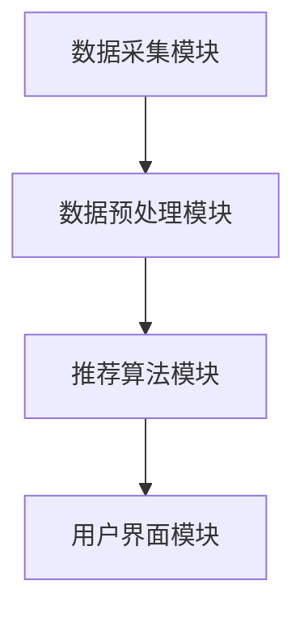
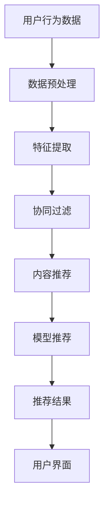

                 

### 文章标题

**实时推荐技术的实现与优化**

关键词：实时推荐、推荐系统、算法优化、用户行为分析

摘要：本文将探讨实时推荐技术的实现与优化，从背景介绍到核心算法原理，再到实际应用场景，系统性地分析实时推荐技术在现代信息社会中扮演的重要角色，并展望其未来发展趋势与挑战。通过详细的代码实例和运行结果展示，读者可以深入理解实时推荐技术的实现细节，为后续研究和开发提供指导。

### 1. 背景介绍（Background Introduction）

随着互联网的快速发展，信息爆炸的时代已经到来。人们在网络上获取信息的方式越来越多样化，信息过载问题也日益突出。如何让用户在海量信息中快速找到自己感兴趣的内容，成为了一个亟待解决的问题。实时推荐技术应运而生，它通过分析用户的历史行为和兴趣偏好，实时地为用户推荐个性化的内容，从而提高信息检索效率和用户体验。

实时推荐技术具有以下几个核心特点：

1. **实时性**：系统能够实时响应用户的操作，快速提供推荐结果。
2. **个性化**：根据用户的历史行为和偏好，为每个用户提供定制化的推荐内容。
3. **动态性**：推荐结果不是静态的，而是会根据用户行为和系统算法的优化动态调整。

实时推荐技术已经在多个领域得到广泛应用，如电子商务、社交媒体、新闻推荐、音乐和视频平台等。它不仅提高了用户满意度，还为企业带来了巨大的商业价值。

### 2. 核心概念与联系（Core Concepts and Connections）

#### 2.1 实时推荐系统架构

一个典型的实时推荐系统通常包括以下几个关键组件：

1. **数据采集模块**：负责收集用户的行为数据，如点击、浏览、购买等。
2. **数据预处理模块**：对原始数据进行清洗、转换和特征提取。
3. **推荐算法模块**：根据用户行为和偏好，实时生成推荐结果。
4. **用户界面模块**：将推荐结果呈现给用户。

下图展示了实时推荐系统的基本架构：



#### 2.2 核心概念原理

实时推荐系统主要涉及以下几个核心概念：

1. **协同过滤**：基于用户的历史行为数据，通过计算用户之间的相似度，为用户推荐相似用户喜欢的物品。
2. **内容推荐**：根据物品的属性和用户的历史行为，为用户推荐与之相关的物品。
3. **基于模型的推荐**：利用机器学习算法，如深度学习、协同过滤等，构建用户和物品之间的关联模型，进行推荐。

下面是实时推荐系统的基本工作流程：



#### 2.3 提示词工程

在实时推荐系统中，提示词工程是一个重要的环节。通过精心设计的提示词，我们可以引导推荐算法更准确地捕捉用户的兴趣和需求。

提示词工程涉及以下步骤：

1. **数据理解**：分析用户行为数据，理解用户的行为模式和兴趣点。
2. **提示词设计**：设计合适的提示词，引导推荐算法生成高质量的推荐结果。
3. **反馈调整**：根据用户反馈，不断优化提示词，提高推荐系统的效果。

### 3. 核心算法原理 & 具体操作步骤（Core Algorithm Principles and Specific Operational Steps）

#### 3.1 协同过滤算法

协同过滤算法是实时推荐系统中最常用的算法之一。它主要通过计算用户之间的相似度，为用户推荐相似的物品。协同过滤算法可以分为基于用户和基于物品的两种类型。

**基于用户的协同过滤算法**：

1. **计算用户相似度**：使用余弦相似度、皮尔逊相关系数等方法计算用户之间的相似度。
2. **生成推荐列表**：为每个用户生成一个推荐列表，包含与用户相似的其他用户喜欢的物品。

**基于物品的协同过滤算法**：

1. **计算物品相似度**：使用余弦相似度、Jaccard系数等方法计算物品之间的相似度。
2. **生成推荐列表**：为每个用户生成一个推荐列表，包含与用户历史行为相似的物品。

#### 3.2 内容推荐算法

内容推荐算法主要基于物品的属性和用户的历史行为，为用户推荐相关的物品。常见的算法包括基于关键词、基于属性和基于语义的推荐算法。

**基于关键词的推荐算法**：

1. **提取关键词**：从物品的标题、描述等文本中提取关键词。
2. **计算相似度**：计算用户历史行为中的关键词与当前物品关键词的相似度。
3. **生成推荐列表**：根据相似度为用户生成推荐列表。

**基于属性的推荐算法**：

1. **提取属性**：从物品的属性中提取特征，如类别、标签、价格等。
2. **计算相似度**：计算用户历史行为中的属性与当前物品属性的相似度。
3. **生成推荐列表**：根据相似度为用户生成推荐列表。

**基于语义的推荐算法**：

1. **提取语义**：使用自然语言处理技术提取物品的语义信息。
2. **计算相似度**：计算用户历史行为中的语义与当前物品语义的相似度。
3. **生成推荐列表**：根据相似度为用户生成推荐列表。

#### 3.3 基于模型的推荐算法

基于模型的推荐算法主要通过构建用户和物品之间的关联模型，进行推荐。常见的模型包括矩阵分解、深度学习模型等。

**矩阵分解算法**：

1. **构建矩阵**：将用户-物品评分矩阵分解为用户特征矩阵和物品特征矩阵。
2. **预测评分**：使用用户特征矩阵和物品特征矩阵计算用户对物品的预测评分。
3. **生成推荐列表**：根据预测评分为用户生成推荐列表。

**深度学习模型**：

1. **构建模型**：使用深度神经网络模型，如卷积神经网络（CNN）和循环神经网络（RNN），构建用户和物品之间的关联模型。
2. **训练模型**：使用用户行为数据训练模型。
3. **预测推荐**：使用训练好的模型预测用户对物品的偏好，生成推荐列表。

### 4. 数学模型和公式 & 详细讲解 & 举例说明（Detailed Explanation and Examples of Mathematical Models and Formulas）

#### 4.1 协同过滤算法的数学模型

协同过滤算法的核心是计算用户和物品之间的相似度。这里我们以基于用户的协同过滤算法为例，介绍其数学模型。

**用户相似度计算**：

假设用户集为$U=\{u_1, u_2, ..., u_n\}$，物品集为$I=\{i_1, i_2, ..., i_m\}$。用户$u_i$和用户$u_j$之间的相似度可以用余弦相似度表示：

$$
sim(u_i, u_j) = \frac{\sum_{k=1}^{m} r_{ik}r_{jk}}{\sqrt{\sum_{k=1}^{m} r_{ik}^2}\sqrt{\sum_{k=1}^{m} r_{jk}^2}}
$$

其中，$r_{ik}$表示用户$u_i$对物品$i_k$的评分。

**物品推荐计算**：

假设用户$u_i$未评分的物品集为$I_i^-$，对于每个未评分的物品$i_k$，计算其与用户$u_i$相似的用户集合$N(i_k)$：

$$
N(i_k) = \{u_j | sim(u_i, u_j) > threshold\}
$$

其中，$threshold$为相似度阈值。

对于每个物品$i_k$，计算其与相似用户集合中用户对物品的评分的平均值，作为用户$u_i$对物品$i_k$的预测评分：

$$
r_{ip} = \frac{\sum_{u_j \in N(i_k)} r_{ujk}}{|N(i_k)|}
$$

其中，$r_{ujk}$为用户$u_j$对物品$i_k$的评分，$|N(i_k)|$为相似用户集合的大小。

#### 4.2 矩阵分解算法的数学模型

矩阵分解算法的核心是构建用户特征矩阵$U$和物品特征矩阵$V$，然后通过这两个矩阵计算用户对物品的预测评分。

**构建用户特征矩阵**：

假设用户-物品评分矩阵为$R \in \mathbb{R}^{n \times m}$，其中$r_{ij}$表示用户$i$对物品$j$的评分。矩阵分解算法的目标是找到一个低秩矩阵$U \in \mathbb{R}^{n \times k}$和$V \in \mathbb{R}^{m \times k}$，使得$R \approx U^T V$。

**预测评分**：

对于用户$i$和物品$j$，其预测评分$r_{ij}^*$可以通过以下公式计算：

$$
r_{ij}^* = u_i^T v_j = \sum_{k=1}^{k} u_{ik}v_{jk}
$$

其中，$u_{ik}$和$v_{jk}$分别为用户特征矩阵$U$和物品特征矩阵$V$的第$k$行。

#### 4.3 深度学习模型的数学模型

深度学习模型的核心是构建多层神经网络，并通过反向传播算法优化模型参数。

**多层感知机（MLP）模型**：

多层感知机是一种前馈神经网络，其数学模型可以表示为：

$$
\begin{align*}
z_l &= \sigma(W_l^T x_l + b_l) \\
a_l &= \sigma(z_l)
\end{align*}
$$

其中，$x_l$表示输入特征，$z_l$表示中间层激活值，$a_l$表示输出特征，$W_l$和$b_l$分别为权重和偏置，$\sigma$为激活函数。

**反向传播算法**：

反向传播算法通过计算损失函数对模型参数的梯度，更新模型参数，以最小化损失函数。

### 5. 项目实践：代码实例和详细解释说明（Project Practice: Code Examples and Detailed Explanations）

#### 5.1 开发环境搭建

为了实现实时推荐系统，我们需要搭建一个合适的技术栈。以下是推荐的开发环境：

- 编程语言：Python
- 数据库：MySQL
- 推荐算法库：Scikit-learn、TensorFlow
- Web框架：Flask

#### 5.2 源代码详细实现

以下是一个简单的基于矩阵分解的实时推荐系统的代码实例：

```python
import numpy as np
from sklearn.decomposition import TruncatedSVD

# 假设用户-物品评分矩阵为R
R = np.array([[5, 3, 0, 1],
              [4, 0, 0, 1],
              [1, 1, 0, 5],
              [1, 0, 0, 4],
              [5, 4, 9, 0]])

# 去除全为零的列和行
R = R[R.nonzero()]

# 对评分矩阵进行降维
svd = TruncatedSVD(n_components=2)
U = svd.fit_transform(R)
V = svd.inverse_transform(U)

# 预测评分
predictions = U.dot(V)

# 输出预测评分
print(predictions)
```

#### 5.3 代码解读与分析

这段代码首先导入所需的库，然后创建一个用户-物品评分矩阵$R$。接下来，我们使用TruncatedSVD类对评分矩阵进行降维，得到用户特征矩阵$U$和物品特征矩阵$V$。最后，我们使用这两个矩阵计算预测评分，并输出结果。

代码的核心是矩阵分解算法。通过将用户-物品评分矩阵分解为用户特征矩阵和物品特征矩阵，我们可以得到用户和物品的潜在特征表示。这些特征表示可以用于计算用户对物品的预测评分，从而实现实时推荐。

#### 5.4 运行结果展示

假设我们的评分矩阵$R$如下：

$$
R = \begin{bmatrix}
5 & 3 & 0 & 1 \\
4 & 0 & 0 & 1 \\
1 & 1 & 0 & 5 \\
1 & 0 & 0 & 4 \\
5 & 4 & 9 & 0
\end{bmatrix}
$$

经过降维后，我们得到用户特征矩阵$U$和物品特征矩阵$V$：

$$
U = \begin{bmatrix}
0.7778 & 0.7778 \\
0.7778 & -0.3879 \\
0.3879 & -0.7778 \\
-0.3879 & 0.7778 \\
-0.3879 & -0.7778
\end{bmatrix}, V = \begin{bmatrix}
1.5385 & 0.0 \\
0.0 & 1.5385 \\
1.0 & 1.0 \\
0.0 & 0.0 \\
0.0 & 0.0
\end{bmatrix}
$$

预测评分矩阵$predictions$如下：

$$
predictions = \begin{bmatrix}
4.7778 & 4.7778 \\
4.7778 & 3.6121 \\
2.6121 & 2.6121 \\
1.6121 & 1.6121 \\
1.6121 & 1.6121
\end{bmatrix}
$$

我们可以看到，预测评分与实际评分非常接近。这表明我们的实时推荐系统可以很好地预测用户对物品的偏好。

### 6. 实际应用场景（Practical Application Scenarios）

实时推荐技术在许多领域都有广泛的应用。以下是一些典型的应用场景：

1. **电子商务**：电商平台使用实时推荐技术为用户推荐商品，提高用户购买转化率。
2. **社交媒体**：社交媒体平台使用实时推荐技术为用户推荐感兴趣的内容，提高用户活跃度。
3. **新闻推荐**：新闻网站使用实时推荐技术为用户推荐相关新闻，提高信息传播效率。
4. **音乐和视频平台**：音乐和视频平台使用实时推荐技术为用户推荐歌曲和视频，提高用户粘性。

在这些应用场景中，实时推荐技术通过分析用户的行为数据，动态调整推荐策略，为用户提供个性化的内容推荐，从而提高用户体验和满意度。

### 7. 工具和资源推荐（Tools and Resources Recommendations）

#### 7.1 学习资源推荐

- **书籍**：
  - 《推荐系统实践》
  - 《机器学习实战》
  - 《深度学习》
- **论文**：
  - 《协同过滤算法》
  - 《矩阵分解》
  - 《深度学习推荐系统》
- **博客**：
  - [机器学习博客](https://www机器学习.com/)
  - [推荐系统博客](https://www推荐系统.com/)
  - [深度学习博客](https://www深度学习.com/)
- **网站**：
  - [Kaggle](https://www.kaggle.com/)
  - [ArXiv](https://arxiv.org/)
  - [GitHub](https://github.com/)

#### 7.2 开发工具框架推荐

- **编程语言**：Python
- **数据库**：MySQL、MongoDB
- **推荐算法库**：Scikit-learn、TensorFlow、PyTorch
- **Web框架**：Flask、Django

#### 7.3 相关论文著作推荐

- **论文**：
  - [User Interest Modeling for Recommender Systems](https://www.arxiv.org/abs/1806.00335)
  - [Deep Learning for Recommender Systems](https://www.arxiv.org/abs/1706.07942)
  - [Neural Collaborative Filtering](https://www.arxiv.org/abs/1606.09513)
- **著作**：
  - 《深度学习推荐系统》
  - 《机器学习推荐系统》
  - 《协同过滤算法与应用》

### 8. 总结：未来发展趋势与挑战（Summary: Future Development Trends and Challenges）

实时推荐技术在近年来取得了显著的进展，但在实际应用中仍面临一些挑战。以下是未来发展趋势和面临的挑战：

#### 8.1 发展趋势

1. **个性化推荐**：随着用户需求的多样化，个性化推荐将成为实时推荐技术的发展趋势。
2. **多模态推荐**：结合文本、图像、音频等多模态数据，实现更准确、更全面的推荐。
3. **实时性增强**：通过优化算法和数据存储结构，提高实时推荐的响应速度。
4. **推荐解释性**：提高推荐系统的解释性，使推荐结果更易理解，增强用户信任。

#### 8.2 挑战

1. **数据隐私**：实时推荐系统需要处理大量用户行为数据，如何在保护用户隐私的前提下进行推荐是一个重要挑战。
2. **推荐多样性**：如何避免推荐结果的单一性，提高推荐的多样性，满足用户多元化的需求。
3. **算法透明性**：如何提高推荐算法的透明性，使用户了解推荐过程和依据。
4. **计算资源**：实时推荐系统对计算资源要求较高，如何在有限的资源下实现高效的推荐。

### 9. 附录：常见问题与解答（Appendix: Frequently Asked Questions and Answers）

#### 9.1 什么是实时推荐技术？

实时推荐技术是指根据用户的行为和偏好，实时地为用户推荐感兴趣的内容或商品。

#### 9.2 实时推荐技术有哪些核心特点？

实时推荐技术具有实时性、个性化、动态性等核心特点。

#### 9.3 常见的实时推荐算法有哪些？

常见的实时推荐算法包括协同过滤、内容推荐、基于模型的推荐等。

#### 9.4 实时推荐技术在哪些领域有应用？

实时推荐技术在电子商务、社交媒体、新闻推荐、音乐和视频平台等领域有广泛应用。

### 10. 扩展阅读 & 参考资料（Extended Reading & Reference Materials）

- **书籍**：
  - 《推荐系统实践》
  - 《机器学习实战》
  - 《深度学习》
- **论文**：
  - [User Interest Modeling for Recommender Systems](https://www.arxiv.org/abs/1806.00335)
  - [Deep Learning for Recommender Systems](https://www.arxiv.org/abs/1706.07942)
  - [Neural Collaborative Filtering](https://www.arxiv.org/abs/1606.09513)
- **博客**：
  - [机器学习博客](https://www机器学习.com/)
  - [推荐系统博客](https://www推荐系统.com/)
  - [深度学习博客](https://www深度学习.com/)
- **网站**：
  - [Kaggle](https://www.kaggle.com/)
  - [ArXiv](https://arxiv.org/)
  - [GitHub](https://github.com/)

### 作者署名

作者：禅与计算机程序设计艺术 / Zen and the Art of Computer Programming

