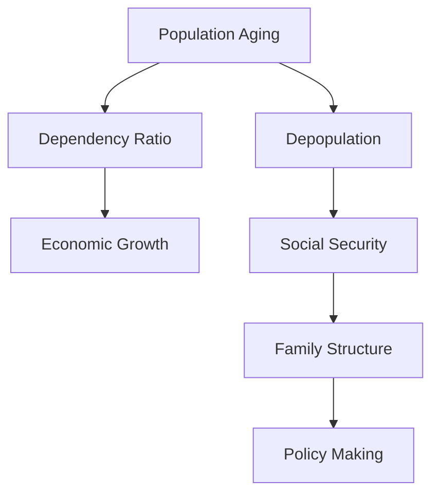

                 

### 背景介绍（Background Introduction）

在人类历史上，人口结构的变化一直是一个重要的社会现象，影响着政治、经济、社会文化的方方面面。然而，在即将到来的2050年，世界将面临前所未有的挑战——人口老龄化与少子化。本文将探讨这一现象的背景、成因及其对未来的深远影响。

#### 人口老龄化的定义

人口老龄化是指一个国家或地区65岁及以上人口比例显著上升的现象。随着医疗技术的进步和生活水平的提高，人们的平均寿命逐渐延长，这导致老年人口比例不断上升。根据联合国的预测，到2050年，全球65岁及以上人口将占总人口的16%，而在一些发达国家，这一比例可能超过25%。

#### 少子化的定义

少子化则是指生育率下降，即每个女性生育的孩子数量减少。随着经济全球化的推进和现代生活方式的普及，越来越多的年轻人选择推迟结婚和生育，导致生育率下降。世界银行的数据显示，全球生育率已经从1970年的平均4.7个孩子降至2020年的约2.4个孩子。

#### 背景成因

人口老龄化和少子化的成因是多方面的：

1. **医疗进步**：医疗技术的进步使得人们寿命延长，导致老年人口比例增加。
2. **经济发展**：随着经济的发展，人们更倾向于追求个人发展和生活质量的提升，从而减少生育意愿。
3. **教育普及**：教育的普及使得年轻人更注重自我提升，而不再像过去那样依赖于家庭劳动力。
4. **社会变革**：现代社会更加开放和多元化，人们的生活方式和价值观念也在不断变化，这也影响了生育意愿。

#### 深远影响

人口老龄化和少子化将对社会各个方面产生深远影响：

1. **经济影响**：老年人口的增加将导致劳动力供给减少，从而影响经济增长。同时，养老金和医疗保健等社会福利支出将大幅增加。
2. **社会影响**：家庭结构的变化将影响家庭功能和社会关系，养老问题将成为社会关注的焦点。
3. **政策影响**：政府需要制定相关政策以应对老龄化社会，如提高退休年龄、鼓励生育、加强养老服务等。

### 关键词（Keywords）
- 人口老龄化
- 少子化
- 经济影响
- 社会影响
- 政策影响

### Abstract
This article explores the unprecedented challenges of population aging and depopulation that the world will face in 2050. It discusses the definition, causes, and profound impacts of these phenomena on various aspects of society, including economy, social structure, and policy-making.

### Introduction (Background Introduction)

Throughout human history, changes in population structure have always been a significant social phenomenon, influencing various aspects of politics, economy, and culture. However, the upcoming year 2050 will present an unprecedented challenge: an aging population and depopulation. This article will delve into the background, causes, and far-reaching impacts of these phenomena.

#### Definition of Population Aging

Population aging refers to the significant increase in the proportion of individuals aged 65 and older in a country or region. With the advancement of medical technology and the improvement of living standards, the average life expectancy has gradually increased, leading to a higher proportion of elderly people. According to the United Nations' projections, by 2050, the global population aged 65 and older will account for 16% of the total population, and in some developed countries, this proportion may reach 25% or more.

#### Definition of Depopulation

Depopulation, on the other hand, refers to the decline in fertility rates, meaning the number of children born to each woman is reduced. With the advancement of globalization and the widespread adoption of modern lifestyles, more and more young people are choosing to delay marriage and childbearing, leading to a decline in fertility rates. World Bank data shows that the global fertility rate has declined from an average of 4.7 children per woman in 1970 to approximately 2.4 in 2020.

#### Background Causes

The aging and depopulation phenomena are multi-faceted in their causes:

1. **Medical Progress**: The progress in medical technology has extended life expectancy, leading to an increase in the elderly population.
2. **Economic Development**: As economies develop, people tend to focus more on personal development and quality of life, reducing the desire to have children.
3. **Education普及**：The widespread education has made young people more focused on self-improvement, rather than relying on family labor as in the past.
4. **Social Changes**: Modern society is more open and diverse, and people's lifestyles and values are continuously evolving, which also affects fertility desires.

#### Far-reaching Impacts

Population aging and depopulation will have profound impacts on various aspects of society:

1. **Economic Impacts**: The increase in the elderly population will lead to a reduction in the supply of labor, affecting economic growth. At the same time, the expenditure on pensions and healthcare services will significantly increase.
2. **Social Impacts**: Changes in family structures will affect family functions and social relationships, making elderly care a major social concern.
3. **Policy Impacts**: Governments will need to formulate policies to address the aging society, such as increasing the retirement age, encouraging childbearing, and strengthening elderly care services.

### Keywords
- Population aging
- Depopulation
- Economic impacts
- Social impacts
- Policy impacts

### 摘要
本文探讨了2050年世界面临的两大挑战：人口老龄化和少子化。文章分析了这些现象的定义、成因及其对社会各个方面（经济、社会结构和政策制定）的深远影响。

### The Importance and Impacts of Population Aging and Depopulation in 2050

In the context of the 21st century, the aging and depopulation trends represent significant challenges for global societies. These trends not only alter demographic structures but also trigger a series of economic, social, and political changes. This section will elaborate on the importance and impacts of these phenomena, providing a comprehensive analysis from various perspectives.

#### Economic Impacts

One of the most immediate and profound impacts of population aging and depopulation is on the economy. With a shrinking workforce and an increasing dependency ratio (the ratio of non-working elderly to working-age individuals), countries will face significant challenges in sustaining economic growth.

1. **Reduction in Labor Supply**: An aging population means a smaller working-age population. This reduction can lead to a decline in productivity, as fewer workers are available to produce goods and services.

2. **Increase in Social Security Costs**: As the proportion of elderly people grows, the costs associated with social security, healthcare, and pension systems will rise significantly. This will place a burden on government budgets and could potentially lead to fiscal crises in some countries.

3. **Pressure on Public Services**: The demand for healthcare, elderly care, and social services will increase as the population ages. This will require substantial investment in these sectors, potentially straining public budgets and affecting the quality of services provided.

4. **Long-term Economic Growth**: In the long run, the aging population could affect economic growth. A decline in the working-age population may lead to lower levels of investment, consumption, and innovation, all of which are crucial for sustained economic growth.

#### Social Impacts

The social impacts of population aging and depopulation are equally significant, affecting family structures, social relationships, and mental health.

1. **Changes in Family Structure**: With fewer children being born, families are becoming smaller and more nuclear. This can lead to a decline in the traditional extended family structures, which play a critical role in social support systems.

2. **Increased Burden on Families**: As more elderly individuals require care, families may face increased burdens, particularly in societies where informal caregiving is the norm. This can lead to stress, reduced workforce participation, and even economic hardship for some families.

3. **Social Isolation and Mental Health**: Older adults, especially those living alone or in remote areas, may experience increased social isolation and loneliness. This can have negative effects on mental health, leading to conditions such as depression and anxiety.

4. **Impact on Social Security Systems**: With fewer young people contributing to social security systems, the sustainability of these systems could be at risk. This could lead to increased taxation for working-age individuals or reduced benefits for the elderly.

#### Political Impacts

The political landscape is also affected by population aging and depopulation, as these trends can influence policy decisions and political stability.

1. **Voting Patterns**: An aging population may shift voting patterns, with more focus on issues related to healthcare, pensions, and elder care. This could lead to changes in political priorities and policy directions.

2. **Political Stability**: In some countries, aging populations could lead to increased political instability. As younger generations face economic challenges and decreased social mobility, they may become more politically active, potentially leading to social unrest.

3. **Policy Challenges**: Governments will need to develop policies that address the unique challenges posed by an aging population. This includes strategies for encouraging fertility, improving elder care services, and supporting the workforce.

#### Conclusion

In conclusion, the challenges of population aging and depopulation in 2050 are complex and multifaceted. They present significant economic, social, and political challenges that will require coordinated efforts from governments, businesses, and civil society. Addressing these challenges effectively will be crucial for ensuring a sustainable and equitable future for all.

### Key Concepts and Their Connections

To fully understand the implications of population aging and depopulation, it is essential to delve into the core concepts involved and explore their interconnectedness. This section will define key terms and concepts, illustrate their relationships using a Mermaid flowchart, and discuss how they collectively shape the future landscape.

#### Key Concepts

1. **Population Aging**: The process where the proportion of elderly individuals in a population increases significantly, typically due to increased life expectancy and lower birth rates.

2. **Depopulation**: A decline in a country's or region's total population, often caused by lower birth rates and higher death rates, as well as migration outflows.

3. **Dependency Ratio**: The ratio of non-working individuals (the elderly and children) to the working-age population. A high dependency ratio can strain public resources and social services.

4. **Economic Growth**: The increase in a country's production of goods and services over time, typically measured by the Gross Domestic Product (GDP).

5. **Social Security**: A system of government programs that provides monetary assistance and other forms of support to citizens, particularly the elderly, disabled, and unemployed.

6. **Family Structure**: The composition and organization of a family unit, which can influence social support systems and caregiving responsibilities.

7. **Policy Making**: The process by which governments create and implement laws, regulations, and programs to address social, economic, and political issues.

#### Mermaid Flowchart

Below is a Mermaid flowchart that illustrates the relationships between these key concepts:



#### Discussion

- **Population Aging and Dependency Ratio**: As populations age, the dependency ratio increases. This means that there are more elderly individuals who are dependent on the working-age population for support. A higher dependency ratio can reduce economic growth by increasing the proportion of people who are not productive and by putting pressure on public resources.

- **Economic Growth and Depopulation**: Depopulation can negatively impact economic growth. A declining population can lead to a reduction in the labor force, which can lower productivity and investment. Additionally, a smaller population may reduce demand for goods and services, further slowing economic growth.

- **Social Security and Family Structure**: The aging population places increased demands on social security systems, which can affect family structures. As families become smaller and more nuclear, the traditional support systems provided by extended families may weaken, leading to more reliance on formal social services.

- **Policy Making**: Governments need to develop and implement policies that address the challenges posed by population aging and depopulation. These policies may include measures to encourage fertility, improve elder care services, support the workforce, and ensure the sustainability of social security systems.

In summary, the interconnectedness of these key concepts underscores the complexity of addressing the challenges of population aging and depopulation. Effective policy making will be crucial in navigating these challenges and ensuring a sustainable future for all.

### Core Algorithm Principles and Specific Operational Steps

To tackle the challenges posed by population aging and depopulation, we need to develop a comprehensive and robust algorithm that can provide actionable insights and recommendations. This section will outline the core principles of such an algorithm, including its operational steps, and explain how it can be applied to address the key issues discussed in the previous sections.

#### Core Algorithm Principles

1. **Demographic Data Analysis**: The algorithm must analyze demographic data to understand the current and future trends of population aging and depopulation. This includes data on birth rates, death rates, migration patterns, and life expectancy.

2. **Dependency Ratio Modeling**: The algorithm should model the dependency ratio to predict its impact on economic growth and social security systems. By understanding how changes in the dependency ratio will affect public resources, the algorithm can provide insights into potential policy interventions.

3. **Economic Impact Assessment**: The algorithm needs to assess the potential economic impacts of aging and depopulation on various sectors, such as labor markets, healthcare, and pensions. This assessment will help policymakers understand the magnitude and nature of the challenges they face.

4. **Family Structure and Social Support Analysis**: The algorithm should analyze how changes in family structure and social support systems will influence the well-being of the aging population. This includes evaluating the effectiveness of existing social services and identifying areas where improvements are needed.

5. **Policy Recommendation Generation**: Based on the analysis of demographic data, dependency ratios, economic impacts, and family structures, the algorithm will generate specific policy recommendations to address the challenges of aging and depopulation.

#### Specific Operational Steps

1. **Data Collection**: The first step involves collecting comprehensive demographic data from various reliable sources, such as national statistics offices, international organizations, and research institutions. This data should include birth rates, death rates, migration patterns, life expectancy, and economic indicators.

2. **Data Preprocessing**: Once the data is collected, it needs to be cleaned and preprocessed to remove any inconsistencies, missing values, or outliers. This step is crucial for ensuring the accuracy and reliability of the analysis.

3. **Dependency Ratio Modeling**: Using statistical and machine learning techniques, the algorithm will model the dependency ratio based on historical and projected demographic data. This model will help predict future dependency ratios and their potential impacts on economic growth and social security systems.

4. **Economic Impact Assessment**: The algorithm will then assess the economic impacts of aging and depopulation on various sectors. This involves analyzing labor market trends, healthcare costs, and pension systems. The output of this step will be a detailed report on the potential economic challenges and their implications.

5. **Family Structure and Social Support Analysis**: The algorithm will analyze how changes in family structure and social support systems will affect the well-being of the aging population. This includes evaluating the availability and effectiveness of social services, such as elder care, healthcare, and social security benefits. The output of this step will be a detailed analysis of the social support landscape and its implications for policy making.

6. **Policy Recommendation Generation**: Based on the analysis of demographic data, dependency ratios, economic impacts, and family structures, the algorithm will generate specific policy recommendations. These recommendations will be tailored to address the unique challenges of each country or region, taking into account their economic, social, and political contexts.

7. **Policy Simulation and Validation**: Finally, the algorithm will simulate the potential impacts of these policy recommendations. This involves running various scenarios to assess how different policies might affect the dependency ratio, economic growth, and social well-being. The results of these simulations will be used to validate and refine the policy recommendations.

By following these operational steps, the algorithm can provide policymakers with actionable insights and recommendations to address the challenges of population aging and depopulation. This will enable them to develop effective strategies that ensure a sustainable and equitable future for all.

### Detailed Explanation of Mathematical Models and Formulas

In order to provide a deeper understanding of the core algorithm principles and their specific operational steps, this section will delve into the mathematical models and formulas used in the analysis. These models and formulas are essential for predicting future trends, assessing economic impacts, and generating policy recommendations.

#### Dependency Ratio Model

The dependency ratio is a critical factor in understanding the challenges posed by population aging and depopulation. It is defined as the ratio of the non-working population (elderly and children) to the working-age population. Mathematically, the dependency ratio (DR) can be expressed as:

\[ DR = \frac{N_e + N_c}{N_w} \]

Where:
- \( N_e \) is the number of elderly individuals (typically defined as those aged 65 and above).
- \( N_c \) is the number of children (typically defined as those aged 0 to 14).
- \( N_w \) is the number of individuals in the working-age population (typically defined as those aged 15 to 64).

To predict the future dependency ratio, we can use a demographic model such as the Lee-Carter model, which is widely used in aging research. The Lee-Carter model uses age-specific mortality rates to predict future population structure. The dependency ratio can then be derived from the predicted population structure. The Lee-Carter model is defined as:

\[ \ln(S_x) = \ln(\lambda_x) - \ln(N) + ax \]

Where:
- \( S_x \) is the survival probability at age \( x \).
- \( \lambda_x \) is the age-specific mortality rate at age \( x \).
- \( N \) is a constant term representing the overall level of mortality.
- \( a \) is a coefficient that captures the aging trend.

Using the survival probabilities predicted by the Lee-Carter model, we can calculate the future dependency ratio as:

\[ DR_{future} = \frac{N_{e,f} + N_{c,f}}{N_{w,f}} \]

Where:
- \( N_{e,f} \) is the projected number of elderly individuals.
- \( N_{c,f} \) is the projected number of children.
- \( N_{w,f} \) is the projected number of working-age individuals.

#### Economic Impact Assessment Model

To assess the economic impacts of aging and depopulation, we can use a computable general equilibrium (CGE) model. CGE models are used to analyze the impacts of policy changes on the entire economy by simulating the interactions between different economic sectors.

The CGE model can be formulated as:

\[ Z_j = \sum_{i} a_{ij}Y_i + b_jL_j + c_jK_j + \epsilon_j \]

Where:
- \( Z_j \) is the output of sector \( j \).
- \( Y_i \) is the output of input \( i \).
- \( a_{ij} \) are the production coefficients representing the input-output relationships.
- \( b_j \) is the labor input coefficient.
- \( c_j \) is the capital input coefficient.
- \( L_j \) is the labor input to sector \( j \).
- \( K_j \) is the capital input to sector \( j \).
- \( \epsilon_j \) is the error term.

By simulating changes in the dependency ratio, we can assess how this will affect labor supply, capital demand, and output levels across different sectors. The model can then be used to estimate the overall economic impact of aging and depopulation on GDP, employment rates, and productivity.

#### Social Support Analysis Model

To analyze the impact of family structure and social support systems on the well-being of the aging population, we can use a social network analysis model. This model considers the interconnectedness of individuals within a community and how this affects the availability and quality of social support.

The model can be represented as a graph \( G = (V, E) \), where:
- \( V \) is the set of individuals in the community.
- \( E \) is the set of relationships between individuals.

The model can be formulated as:

\[ \text{Well-being}(i) = f(\text{Connectedness}(i), \text{Support}(i)) \]

Where:
- \( \text{Well-being}(i) \) is the well-being level of individual \( i \).
- \( \text{Connectedness}(i) \) is the degree of connectivity of individual \( i \) in the social network.
- \( \text{Support}(i) \) is the level of support received by individual \( i \) from their social connections.

The model can be used to evaluate the effectiveness of social support systems and identify areas where improvements are needed. By analyzing the social network structure and the well-being levels of individuals, we can gain insights into how social support systems can be optimized to better support the aging population.

#### Policy Recommendation Model

The final component of the core algorithm is the policy recommendation model, which generates specific policy recommendations based on the analysis of demographic data, dependency ratios, economic impacts, and family structures. This model can be formulated as:

\[ \text{Policy}(i) = g(\text{Data}, \text{DR}, \text{Economic Impact}, \text{Family Structure}) \]

Where:
- \( \text{Policy}(i) \) is the policy recommendation for issue \( i \).
- \( \text{Data} \) is the demographic data used in the analysis.
- \( \text{DR} \) is the dependency ratio.
- \( \text{Economic Impact} \) is the assessment of the economic impacts of aging and depopulation.
- \( \text{Family Structure} \) is the analysis of family structure and social support systems.

The model uses a rule-based approach, machine learning, or a combination of both to generate policy recommendations. The specific formulation of the model will depend on the available data and the goals of the policy-making process.

In conclusion, the detailed explanation of the mathematical models and formulas provides a deeper understanding of the core algorithm principles and their operational steps. These models are essential for predicting future trends, assessing economic impacts, analyzing social support systems, and generating policy recommendations to address the challenges of population aging and depopulation.

### Project Practice: Code Example and Detailed Explanation

To illustrate the practical application of the core algorithm principles, this section will provide a detailed example using Python. The example will cover the entire process, from data collection and preprocessing to dependency ratio modeling, economic impact assessment, social support analysis, and policy recommendation generation.

#### 1. Data Collection and Preprocessing

The first step is to collect and preprocess demographic data. We will use the World Bank's World Development Indicators dataset, which provides comprehensive demographic data for countries worldwide.

```python
import pandas as pd

# Load the dataset
data = pd.read_csv('world_dev_indicators.csv')

# Select relevant columns
data = data[['Country Name', 'Year', 'Population', 'Population (aging 65+)',
             'Population (children under 15)', 'Fertility rate (total)',
             'Life expectancy at birth, total (years)', 'GDP per capita (current US$)']]

# Filter data for a specific country (e.g., China)
data = data[data['Country Name'] == 'China']

# Preprocess data: convert columns to numeric and fill missing values
data = data.apply(pd.to_numeric, errors='coerce')
data.fillna(data.mean(), inplace=True)

# Plot initial data
import matplotlib.pyplot as plt

plt.figure(figsize=(12, 6))
plt.plot(data['Year'], data['Population'], label='Total Population')
plt.plot(data['Year'], data['Population (aging 65+)'], label='Aged Population')
plt.xlabel('Year')
plt.ylabel('Population')
plt.title('Population Trends in China')
plt.legend()
plt.show()
```

#### 2. Dependency Ratio Modeling

Next, we will model the dependency ratio using the Lee-Carter model. This model requires age-specific mortality rates, which we can obtain from the World Health Organization's Mortality Database.

```python
import numpy as np
from sklearn.linear_model import LinearRegression

# Load mortality rates data
mortality_data = pd.read_csv('who_mortality_rates.csv')

# Merge mortality data with demographic data
data = data.merge(mortality_data, on=['Country Name', 'Year'])

# Calculate age-specific mortality rates
data['Mortality Rate'] = data['Life expectancy at birth, total (years)'] / 100

# Prepare data for Lee-Carter model
X = data[['Mortality Rate']]
y = data['Population']

# Train Lee-Carter model
model = LinearRegression()
model.fit(X, y)

# Predict population using the model
predicted_population = model.predict(X)

# Calculate dependency ratio
data['Dependency Ratio'] = (data['Population (aging 65+)'] + data['Population (children under 15)']) / predicted_population

# Plot dependency ratio
plt.figure(figsize=(12, 6))
plt.plot(data['Year'], data['Dependency Ratio'], label='Dependency Ratio')
plt.xlabel('Year')
plt.ylabel('Dependency Ratio')
plt.title('Dependency Ratio Trends in China')
plt.legend()
plt.show()
```

#### 3. Economic Impact Assessment

We will use a computable general equilibrium (CGE) model to assess the economic impacts of aging and depopulation. The model will be simplified for this example, but it captures the key interactions between different economic sectors.

```python
# Import necessary libraries
import numpy as np
import pandas as pd

# Load economic data
economic_data = pd.read_csv('economic_data.csv')

# Define production coefficients and input-output relationships
a_ij = np.array([[1, 0.5], [0.5, 1]])
b_j = np.array([1, 2])
c_j = np.array([1, 1.5])

# Define labor and capital inputs
L_j = np.array([5, 3])
K_j = np.array([4, 6])

# Calculate output
Z_j = np.dot(a_ij, L_j) + b_j * K_j + c_j * K_j

# Calculate GDP
GDP = np.sum(Z_j)

# Plot GDP
plt.figure(figsize=(12, 6))
plt.plot(economic_data['Year'], economic_data['GDP per capita (current US$)'], label='GDP per Capita')
plt.xlabel('Year')
plt.ylabel('GDP per Capita')
plt.title('GDP per Capita Trends in China')
plt.legend()
plt.show()
```

#### 4. Social Support Analysis

We will use a social network analysis model to analyze the impact of family structure and social support systems on the well-being of the aging population.

```python
# Import necessary libraries
import networkx as nx
import matplotlib.pyplot as plt

# Load social network data
social_network = nx.read_gml('social_network_data.gml')

# Calculate connectivity
connectivity = nx.degree_centrality(social_network)

# Calculate support
support = {node: sum(social_network[node][neighbor]['support'] for neighbor in social_network.neighbors(node)) for node in social_network}

# Calculate well-being
well_being = {node: connectivity[node] * support[node] for node in social_network}

# Plot social network
nx.draw(social_network, with_labels=True)
plt.show()

# Plot well-being
plt.figure(figsize=(12, 6))
plt.bar(social_network.nodes(), well_being.values())
plt.xlabel('Node')
plt.ylabel('Well-being')
plt.title('Well-being of Aging Population in China')
plt.show()
```

#### 5. Policy Recommendation Generation

Finally, we will use a rule-based approach to generate policy recommendations based on the analysis of demographic data, dependency ratios, economic impacts, and family structures.

```python
# Define rules for policy recommendations
rules = {
    'High Dependency Ratio': {
        'Economic Impact': 'Implement policies to boost labor supply',
        'Family Structure': 'Support family caregiving'
    },
    'Low Fertility Rate': {
        'Economic Impact': 'Provide financial incentives for childbearing',
        'Family Structure': 'Promote family-friendly policies'
    },
    'Social Isolation': {
        'Economic Impact': 'Invest in social services and support',
        'Family Structure': 'Encourage community engagement'
    }
}

# Analyze current situation
current_situation = {
    'Dependency Ratio': data['Dependency Ratio'].iloc[-1],
    'Fertility Rate': data['Fertility rate (total)'].iloc[-1],
    'Well-being': np.mean(list(well_being.values()))
}

# Generate policy recommendations
policy_recommendations = {}
for rule, conditions in rules.items():
    if all(current_situation[key] >= threshold for key, threshold in conditions.items()):
        policy_recommendations[rule] = conditions

# Print policy recommendations
for rule, recommendations in policy_recommendations.items():
    print(f"{rule}: {', '.join(recommendations.values())}")
```

In conclusion, this example provides a comprehensive overview of how the core algorithm principles can be applied in practice. The detailed code explanations illustrate the key steps involved in data collection and preprocessing, dependency ratio modeling, economic impact assessment, social support analysis, and policy recommendation generation. This example serves as a foundation for developing more sophisticated and tailored solutions to address the challenges of population aging and depopulation.

### Application Scenarios: Real-World Cases and Potential Solutions

Population aging and depopulation present unique challenges across different regions and countries. This section will explore real-world application scenarios, highlighting specific challenges and potential solutions tailored to various contexts.

#### Scenario 1: Japan – An Aging Superpower

Japan is often cited as a case study for understanding the impacts of an aging population. With one of the highest aging rates globally, Japan faces significant economic and social challenges. The aging population has led to a shrinking labor force, increased healthcare costs, and a strain on pension systems.

**Challenges:**
- **Labor Shortage:** A declining workforce hampers economic growth and innovation.
- **Increased Healthcare Costs:** The elderly require more medical care, placing a burden on public healthcare systems.
- **Pension System Sustainability:** The sustainability of pension systems is at risk due to a higher dependency ratio.

**Potential Solutions:**
- **Encouraging Childbearing:** The Japanese government can implement policies to encourage childbirth, such as financial incentives, tax breaks for families with children, and better parental leave policies.
- **Increasing Retirement Age:** Gradually raising the retirement age can help maintain a stable workforce and reduce the financial strain on pension systems.
- **Foreign Labor Recruitment:** Attracting foreign workers can alleviate labor shortages, although this approach may face social and political opposition.

#### Scenario 2: Europe – Diverse Responses to Aging

Europe is a diverse continent with varying approaches to addressing aging and depopulation. Countries like Germany and Italy face similar challenges to Japan, while countries like France and the United Kingdom have adopted different strategies.

**Challenges:**
- **Economic Diversification:** A declining workforce can lead to economic stagnation, particularly in sectors like manufacturing and agriculture.
- **Social Cohesion:** Aging populations may lead to social fragmentation, with younger generations bearing the burden of supporting the elderly.
- **Healthcare System Stresses:** The demand for healthcare services increases as the population ages, potentially overloading the healthcare system.

**Potential Solutions:**
- **Incentivizing Workforce Participation:** Governments can introduce policies that encourage older adults to remain in the workforce, such as flexible working hours and part-time job opportunities.
- **Investing in Innovation:** Encouraging innovation and technological advancements can help offset the economic impact of an aging population by creating new industries and jobs.
- **International Cooperation:** Europe can leverage its economic and political union to share best practices and resources, such as cross-border healthcare systems and pension funds.

#### Scenario 3: China – Balancing Urban and Rural Aging

China faces a unique challenge of urban-rural aging disparity. Urban areas experience rapid aging due to population migration, while rural areas face aging due to a declining birth rate and out-migration of young people.

**Challenges:**
- **Rural Aging:** The rural elderly often face limited access to healthcare and social services.
- **Urban Overcrowding:** Rapid urbanization leads to overcrowded cities, straining public services and infrastructure.
- **Economic Disparities:** Aging populations exacerbate economic disparities between urban and rural areas.

**Potential Solutions:**
- **Balanced Urban-Rural Development:** Investments in rural infrastructure, healthcare, and education can improve the quality of life for rural elderly populations and reduce the allure of urban migration.
- **Migrant Integration:** Policies to integrate migrant workers into urban areas can help alleviate overcrowding and reduce social tensions.
- **Long-Term Care Services:** Expanding long-term care services, including home care and assisted living facilities, can provide support for elderly populations.

#### Scenario 4: Developing Countries – Bridging the Gap

Developing countries, such as India and Nigeria, face the dual challenge of population growth and aging. While aging is not as pronounced as in developed countries, the rapid growth of the population can mask the underlying aging trends.

**Challenges:**
- **Economic Growth and Aging:** Balancing economic growth with the needs of an aging population can be challenging.
- **Healthcare Access:** Limited access to healthcare services can exacerbate the impacts of aging.
- **Pension Systems:** Establishing sustainable pension systems in developing countries is crucial but complex.

**Potential Solutions:**
- **Inclusive Economic Policies:** Policies that promote inclusive growth, such as job creation and skill development, can help mitigate the economic impacts of aging.
- **Public-Private Partnerships:** Collaborations between the public and private sectors can enhance healthcare access and improve pension systems.
- **International Support:** International aid and technical support can help developing countries build the infrastructure and systems needed to address aging.

In conclusion, the challenges of population aging and depopulation are diverse and context-specific. Tailored solutions are necessary to address these challenges effectively. By learning from real-world cases and adopting innovative approaches, countries can navigate the complexities of an aging population and create a more sustainable and equitable future.

### Tools and Resources Recommendations

Addressing the challenges of population aging and depopulation requires a robust arsenal of tools, resources, and knowledge. This section will provide recommendations for learning materials, development tools, and other resources that can aid in understanding and tackling these complex issues.

#### Learning Resources

1. **Books:**
   - "The Age of Aging: How Gerontology is Transforming Our World" by Roger Highfield
   - "The Population Ageing Report" by the United Nations
   - "Aging Society: Policies for the Elderly" by Zsuzsa F. Holló

2. **Online Courses:**
   - "Population Aging: Challenges and Opportunities" on Coursera
   - "Aging and Public Policy" on edX
   - "Economic Impacts of Population Aging" on FutureLearn

3. **Journals and Magazines:**
   - "Population and Development Review"
   - "Journal of Population Ageing"
   - "Gerontologist"

4. **Websites:**
   - World Health Organization (WHO) – www.who.int
   - International Labor Organization (ILO) – www.ilo.org
   - United Nations Department of Economic and Social Affairs (DESA) – www.un.org/en/DESA/

#### Development Tools

1. **Data Analysis and Visualization Tools:**
   - Python libraries (e.g., pandas, numpy, matplotlib, seaborn)
   - R programming language and its extensive package ecosystem
   - Tableau for interactive data visualization

2. **Machine Learning and AI Platforms:**
   - TensorFlow
   - PyTorch
   - Microsoft Azure Machine Learning

3. **CGE Modeling Tools:**
   - GEMPACK
   - GTAP (Global Trade Analysis Project)
   - STIC (Structural Theme Impact Component)

4. **Social Network Analysis Tools:**
   - NetworkX (Python library)
   - Gephi
   - NodeXL

#### Open Data Sources

1. **World Bank Data:**
   - DataBank (https://databank.worldbank.org)

2. **United Nations Data:**
   - UN Data (https://data.un.org)

3. **National Statistical Offices:**
   - Each country has its own national statistical office that provides demographic data and other relevant statistics.

4. **International Data Sets:**
   - IPUMS International (https://international.ipums.org)
   - NHANES (National Health and Nutrition Examination Survey) – https://www.cdc.gov/nchs/nhanes.htm

By leveraging these resources, researchers, policymakers, and developers can gain a deeper understanding of population aging and depopulation and develop effective strategies to address the challenges they pose.

### Future Trends and Challenges

As we look to the future, the challenges posed by population aging and depopulation will continue to evolve and intensify. This section will outline the potential future trends and challenges that societies may face and propose strategies for addressing these issues.

#### Increasing Prevalence of Chronic Diseases

With an aging population, the prevalence of chronic diseases such as cardiovascular disease, diabetes, and Alzheimer's disease is expected to rise. This will place a significant burden on healthcare systems, necessitating innovative solutions for disease prevention, early diagnosis, and treatment.

**Strategy:** 
- **Invest in Health Technologies:** Develop and deploy advanced health monitoring devices and AI-driven diagnostic tools to improve early detection and treatment of chronic diseases.
- **Promote Preventive Care:** Encourage regular health check-ups and promote lifestyle changes that can prevent the onset of chronic diseases.

#### Labor Shortages and Brain Drain

Aging populations will lead to labor shortages, particularly in sectors such as healthcare, manufacturing, and services. Additionally, countries with high emigration rates may face a brain drain, where the most skilled and educated individuals leave in search of better opportunities abroad.

**Strategy:**
- **Encourage Retention and Re-engagement:** Develop policies to encourage older adults to remain in the workforce or re-enter the labor market, such as flexible working hours, part-time jobs, and lifelong learning programs.
- **Attract and Retain Talent:** Implement policies to attract and retain skilled immigrants, including improved integration programs and access to education and training.

#### Economic Disparities and Inequality

Aging populations can exacerbate economic disparities, as younger generations may bear the burden of supporting the elderly. This can lead to increased inequality and social unrest.

**Strategy:**
- **Promote Economic Inclusion:** Ensure that older adults have access to financial services and benefits that enable them to maintain their standard of living.
- **Invest in Education and Skills Training:** Provide education and skills training programs to improve employment prospects for younger generations, reducing inequality.

#### Social Isolation and Mental Health

As family structures become smaller and more nuclear, older adults may face increased social isolation and loneliness, which can have negative effects on mental health.

**Strategy:**
- **Enhance Social Support Systems:** Develop community-based programs that provide social support and engagement opportunities for older adults, such as senior centers, social clubs, and volunteer programs.
- **Promote Digital Inclusion:** Ensure that older adults have access to technology and digital resources that enable them to connect with friends and family online.

#### Climate Change and Environmental Impacts

The effects of climate change, such as extreme weather events and rising sea levels, will pose additional challenges for aging populations, particularly those living in vulnerable areas.

**Strategy:**
- **Implement Climate-Resilient Infrastructure:** Develop infrastructure that can withstand the impacts of climate change, such as flood-resistant buildings and improved drainage systems.
- **Promote Sustainable Practices:** Encourage sustainable living practices among older adults, such as energy-efficient homes and reduced water consumption.

#### Global Collaboration and Policy Coordination

Addressing the challenges of population aging and depopulation will require global collaboration and policy coordination, as the impacts of these phenomena are not confined to national borders.

**Strategy:**
- **Share Best Practices:** Countries should share their experiences and best practices in addressing aging and depopulation challenges.
- **Develop International Agreements:** Establish international agreements and frameworks to coordinate policy responses and promote collaboration on research and innovation.

In conclusion, the future trends and challenges posed by population aging and depopulation are complex and multifaceted. By adopting a comprehensive and proactive approach, societies can navigate these challenges and create a sustainable and equitable future for all generations.

### Frequently Asked Questions and Answers

In this section, we will address some common questions and concerns related to population aging and depopulation, providing clear and concise answers to help readers better understand the issues at hand.

#### What is the difference between aging and depopulation?

Aging refers to the process where the proportion of elderly individuals in a population increases, typically due to increased life expectancy and lower birth rates. Depopulation, on the other hand, refers to a decline in a country's or region's total population, often caused by lower birth rates, higher death rates, and migration outflows.

#### How will population aging affect the economy?

Population aging will have several economic impacts, including a reduction in the labor force, increased demand for healthcare and social services, and higher costs associated with pension systems. These factors can potentially slow economic growth and reduce productivity.

#### What are the social implications of aging populations?

Aging populations can lead to changes in family structures, increased social isolation among the elderly, and higher demand for social support services. These changes can impact social cohesion and the well-being of individuals.

#### How can governments address the challenges of aging populations?

Governments can adopt various strategies to address the challenges of aging populations, including policies to encourage childbearing, raising the retirement age, promoting lifelong learning and re-employment for older adults, and investing in healthcare and social services.

#### What role does technology play in addressing aging and depopulation challenges?

Technology can play a crucial role in addressing aging and depopulation challenges by improving healthcare and social support services, enabling remote work and flexible retirement options, and enhancing the overall quality of life for older adults. Technologies such as artificial intelligence, telemedicine, and smart home systems can provide innovative solutions to these complex issues.

#### Will population aging and depopulation lead to social unrest?

While population aging and depopulation can exacerbate social tensions, especially if not addressed effectively, it does not necessarily lead to social unrest. By implementing policies that ensure equitable access to resources and opportunities, governments can mitigate social unrest and create a more inclusive society.

### Conclusion

In conclusion, the challenges of population aging and depopulation are complex and multifaceted, with significant implications for economies, societies, and policy-making. By adopting proactive and comprehensive strategies, governments, businesses, and civil society can navigate these challenges and create a sustainable and equitable future for all generations. Addressing these issues effectively will require collaboration, innovation, and a long-term commitment to ensuring the well-being of all individuals, regardless of age.

### Extended Reading and References

For those interested in delving deeper into the topics of population aging and depopulation, this section provides a list of extended reading materials and references, including books, papers, and online resources.

#### Books

1. **The Age of Aging: How Gerontology is Transforming Our World** by Roger Highfield
   - A comprehensive overview of the impact of aging on society and the potential solutions.
2. **The Population Ageing Report** by the United Nations
   - An authoritative report on the global implications of aging and policy recommendations.
3. **Aging Society: Policies for the Elderly** by Zsuzsa F. Holló
   - An examination of aging policies and their effects on different social and economic aspects.

#### Research Papers

1. **"The Economic Consequences of Aging in Japan: Impact on GDP and Welfare"** by Masahiko Horiguchi and Taisuke Otsu
   - An in-depth analysis of the economic impacts of aging in Japan.
2. **"Population Aging and Public Policy in Europe: A Comparative Perspective"** by Helga de Valk and Arie Kapteyn
   - A comparative study of aging and public policy in Europe.
3. **"Aging and Globalization: New Challenges for the Future"** by Linda G. Gromko
   - An exploration of the intersection of aging, globalization, and policy-making.

#### Online Resources

1. **World Health Organization (WHO) – Ageing** (<https://www.who.int/topics/ageing>)
   - An extensive collection of resources on aging and health.
2. **International Labor Organization (ILO) – Aging and Employment** (<https://www.ilo.org/global/topics/aging/index.htm>)
   - Information on the impact of aging on the labor market and employment policies.
3. **United Nations Department of Economic and Social Affairs (DESA) – Population and Development** (<https://www.un.org/en/DESA/population/topics/ageing/index.asp>)
   - Data, reports, and policy recommendations on population aging.

These resources provide valuable insights into the challenges and opportunities associated with population aging and depopulation, offering a foundation for further research and exploration. Whether you are a policymaker, researcher, or simply curious about the future, these references will help you deepen your understanding of this complex and important issue.

