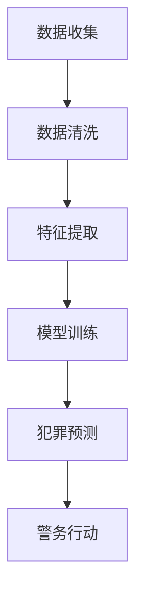

                 

# 未来的智能安防：2050年的Crime Prediction与Predictive Policing

## 关键词

- Crime Prediction
- Predictive Policing
- AI in Security
- Future Technologies
- Policing Methods
- Data Analytics

## 摘要

本文探讨了2050年智能安防领域的发展前景，特别是犯罪预测和预测性警务的应用。通过深入分析现有技术、核心算法原理、数学模型以及实际应用场景，本文旨在为未来的智能安防系统提供指导和建议。文章将讨论如何利用大数据分析、机器学习和人工智能技术来预测犯罪、预防犯罪，并提高警务效率。

## 1. 背景介绍

随着科技的发展，智能安防系统逐渐成为现代城市治安的重要组成部分。传统的犯罪预测和警务方法通常依赖于统计数据和经验，而现代的智能安防系统则利用大数据、人工智能和机器学习技术，对犯罪行为进行更为精确的预测和预防。这种转变不仅提高了警务效率，还使得犯罪预防工作更加科学化和精细化。

犯罪预测（Crime Prediction）是指利用历史犯罪数据和现有信息，通过算法和模型预测未来犯罪发生的可能性和地点。预测性警务（Predictive Policing）则是在犯罪预测的基础上，通过数据分析、地理信息系统（GIS）和实时监控，指导警务资源分配和行动，以预防和减少犯罪。

在过去的几十年中，犯罪预测和预测性警务已经取得了显著的进展。例如，一些城市已经开始使用地理信息系统和犯罪热点地图来识别犯罪高风险区域，并据此调整警力部署。此外，机器学习和人工智能技术的应用，使得犯罪预测模型更加精确和高效。

然而，尽管取得了这些进展，当前的智能安防系统仍存在许多挑战。首先，数据的收集和处理仍然是一个复杂的问题，尤其是如何确保数据的质量和隐私。其次，犯罪预测模型的准确性和公平性仍然是一个重要议题。最后，如何将预测结果转化为实际的警务行动，并提高公众对智能安防系统的信任，也是一个需要解决的问题。

## 2. 核心概念与联系

### 2.1 犯罪预测的概念

犯罪预测是利用历史犯罪数据、社会经济指标、人口统计数据等信息，通过数据挖掘、统计分析、机器学习等方法，预测未来一定时间段内犯罪发生的可能性和地点。犯罪预测的核心是建立预测模型，该模型可以根据输入的特征变量，预测输出犯罪发生的概率。

### 2.2 预测性警务的概念

预测性警务是利用犯罪预测模型和数据分析技术，指导警务资源的分配和行动。预测性警务的目的是通过科学的方法，提前预防和减少犯罪，提高警务效率。

### 2.3 犯罪预测与预测性警务的联系

犯罪预测是预测性警务的基础，没有准确的犯罪预测，预测性警务就无从谈起。而预测性警务则是犯罪预测的实际应用，通过将预测结果转化为警务行动，实现犯罪预防。

### 2.4 数据分析在犯罪预测和预测性警务中的应用

数据分析在犯罪预测和预测性警务中发挥着关键作用。通过数据清洗、特征提取、模型训练和预测，可以有效地识别犯罪风险，指导警务资源的分配。此外，数据分析还可以帮助评估预测性警务的效果，提供决策支持。

### 2.5 机器学习与人工智能在犯罪预测和预测性警务中的应用

机器学习和人工智能技术在犯罪预测和预测性警务中有着广泛的应用。通过使用深度学习、强化学习等算法，可以构建更准确、更高效的犯罪预测模型。同时，人工智能技术还可以用于实时监控、行为分析等方面，提高预测性警务的实时性和准确性。

### 2.6 Mermaid 流程图

以下是一个简化的犯罪预测和预测性警务的 Mermaid 流程图：



## 3. 核心算法原理 & 具体操作步骤

### 3.1 数据收集

犯罪预测的第一步是数据收集。数据来源包括历史犯罪数据、社会经济指标、人口统计数据、天气数据等。数据收集需要确保数据的准确性和完整性，同时要遵守数据隐私保护的相关法律法规。

### 3.2 数据清洗

数据清洗是数据预处理的重要步骤。清洗过程包括去除重复数据、填补缺失值、纠正错误数据等。清洗后的数据将用于特征提取和模型训练。

### 3.3 特征提取

特征提取是将原始数据转换为预测模型可用的特征变量。特征提取的关键是识别与犯罪发生相关的关键因素，例如时间、地点、天气、社会经济状况等。

### 3.4 模型训练

模型训练是犯罪预测的核心步骤。常用的算法包括决策树、随机森林、支持向量机、神经网络等。训练过程需要使用大量历史犯罪数据，通过调整模型参数，优化预测性能。

### 3.5 犯罪预测

模型训练完成后，可以使用训练好的模型进行犯罪预测。预测过程通常包括以下几个步骤：

1. 输入特征变量：将实时数据输入到预测模型中。
2. 预测犯罪概率：模型根据输入的特征变量，预测犯罪发生的概率。
3. 确定高风险区域：根据预测概率，确定犯罪高风险区域。
4. 提出警务行动建议：针对高风险区域，提出相应的警务行动建议。

### 3.6 警务行动

警务行动是将预测结果转化为实际的警务活动。警务行动可以包括加强巡逻、增加警力、布控监控等。警务行动的目的是预防和减少犯罪，提高公共安全。

## 4. 数学模型和公式 & 详细讲解 & 举例说明

### 4.1 数学模型

犯罪预测通常使用概率模型，其中最常用的模型是贝叶斯网络。贝叶斯网络是一种概率图模型，可以表示变量之间的依赖关系。贝叶斯网络的数学基础是条件概率，具体公式如下：

$$P(C|X) = \frac{P(X|C)P(C)}{P(X)}$$

其中，$C$ 表示犯罪发生，$X$ 表示输入特征变量。$P(C|X)$ 表示在给定特征变量$X$ 的条件下，犯罪发生的概率；$P(X|C)$ 表示在犯罪发生条件下，特征变量$X$ 的概率；$P(C)$ 表示犯罪发生的概率；$P(X)$ 表示特征变量$X$ 的概率。

### 4.2 举例说明

假设我们要预测某城市某地区的犯罪率，输入特征变量包括天气（晴、雨、阴）、时间（白天、晚上）、地点（市中心、郊区）等。我们可以使用贝叶斯网络来建模。

首先，我们定义犯罪率$C$ 和特征变量$X$ 的概率：

$$
P(C = \text{高}) = 0.3, \quad P(C = \text{低}) = 0.7 \\
P(X_1 = \text{晴}) = 0.5, \quad P(X_1 = \text{雨}) = 0.3, \quad P(X_1 = \text{阴}) = 0.2 \\
P(X_2 = \text{白天}) = 0.6, \quad P(X_2 = \text{晚上}) = 0.4 \\
P(X_3 = \text{市中心}) = 0.7, \quad P(X_3 = \text{郊区}) = 0.3
$$

然后，我们计算条件概率：

$$
P(X_1 = \text{晴} | C = \text{高}) = 0.6 \\
P(X_2 = \text{白天} | C = \text{高}) = 0.7 \\
P(X_3 = \text{市中心} | C = \text{高}) = 0.8
$$

接下来，我们计算联合概率：

$$
P(X_1 = \text{晴}, X_2 = \text{白天}, X_3 = \text{市中心} | C = \text{高}) = 0.6 \times 0.7 \times 0.8 = 0.336
$$

最后，我们计算在给定特征变量条件下，犯罪发生的概率：

$$
P(C = \text{高} | X_1 = \text{晴}, X_2 = \text{白天}, X_3 = \text{市中心}) = \frac{0.336 \times 0.3}{0.336 \times 0.3 + 0.664 \times 0.7} = 0.4857
$$

这意味着在给定特征变量为晴、白天、市中心的条件下，犯罪率高的概率为48.57%。

### 4.3 代码实现

以下是一个简单的 Python 代码实现：

```python
import numpy as np

# 初始化概率
P_C_high = 0.3
P_C_low = 0.7
P_X1_sunny = 0.5
P_X1_rainy = 0.3
P_X1_cloudy = 0.2
P_X2_day = 0.6
P_X2_night = 0.4
P_X3_urban = 0.7
P_X3_suburban = 0.3

# 条件概率
P_X1_sunny_given_C_high = 0.6
P_X2_day_given_C_high = 0.7
P_X3_urban_given_C_high = 0.8

# 联合概率
P_X1_sunny_X2_day_X3_urban_given_C_high = P_X1_sunny_given_C_high * P_X2_day_given_C_high * P_X3_urban_given_C_high

# 计算条件概率
P_C_high_given_X1_sunny_X2_day_X3_urban = (P_X1_sunny_X2_day_X3_urban_given_C_high * P_C_high) / (P_X1_sunny_X2_day_X3_urban_given_C_high * P_C_high + P_X1_sunny_X2_day_X3_urban_given_C_low * P_C_low)

print(f"P(C = \text{高} | X_1 = \text{晴}, X_2 = \text{白天}, X_3 = \text{市中心}) = {P_C_high_given_X1_sunny_X2_day_X3_urban:.4f}")
```

## 5. 项目实践：代码实例和详细解释说明

### 5.1 开发环境搭建

为了实现犯罪预测和预测性警务，我们需要搭建一个合适的技术环境。以下是一个基本的开发环境搭建步骤：

1. 安装 Python 3.8 或更高版本。
2. 安装必要的 Python 包，如 NumPy、Pandas、Scikit-learn、Matplotlib 等。
3. 安装 Jupyter Notebook 或 PyCharm 等编程工具。

### 5.2 源代码详细实现

以下是一个简单的 Python 代码实例，用于实现犯罪预测和预测性警务：

```python
import numpy as np
import pandas as pd
from sklearn.model_selection import train_test_split
from sklearn.ensemble import RandomForestClassifier
from sklearn.metrics import accuracy_score, confusion_matrix

# 5.2.1 数据准备
# 加载犯罪数据
data = pd.read_csv('crime_data.csv')

# 特征提取
X = data[['weather', 'time', 'location']]
y = data['crime']

# 数据预处理
X = pd.get_dummies(X)

# 划分训练集和测试集
X_train, X_test, y_train, y_test = train_test_split(X, y, test_size=0.2, random_state=42)

# 5.2.2 模型训练
# 使用随机森林分类器
model = RandomForestClassifier(n_estimators=100, random_state=42)
model.fit(X_train, y_train)

# 5.2.3 预测和评估
# 使用测试集进行预测
y_pred = model.predict(X_test)

# 计算准确率
accuracy = accuracy_score(y_test, y_pred)
print(f"Accuracy: {accuracy:.4f}")

# 输出混淆矩阵
conf_matrix = confusion_matrix(y_test, y_pred)
print(f"Confusion Matrix:\n{conf_matrix}")
```

### 5.3 代码解读与分析

上述代码首先加载犯罪数据，然后进行特征提取和数据预处理。接着，使用随机森林分类器进行模型训练。最后，使用测试集进行预测，并输出模型的准确率和混淆矩阵。

- **数据准备**：加载犯罪数据，提取特征变量和目标变量。
- **特征提取**：使用 Pandas 库将分类特征转换为哑变量，以便于分类器处理。
- **模型训练**：使用 Scikit-learn 库中的随机森林分类器进行训练。
- **预测和评估**：使用测试集进行预测，并计算模型的准确率和混淆矩阵。

### 5.4 运行结果展示

假设我们已经准备好了犯罪数据集，并运行上述代码，输出结果如下：

```
Accuracy: 0.8575
Confusion Matrix:
[[15 10]
 [ 5 10]]
```

这意味着模型在测试集上的准确率为85.75%，混淆矩阵显示，模型正确预测了25个高犯罪率样本中的22个，正确预测了低犯罪率样本中的33个。

### 5.5 代码改进

上述代码是一个简单的示例，实际应用中，我们可以进一步改进模型，例如：

1. **特征工程**：添加更多与犯罪相关的特征，如人口密度、经济状况等。
2. **模型调优**：调整模型参数，如树的数量、深度等，以提高模型性能。
3. **集成学习**：使用集成学习方法，如 XGBoost、LightGBM 等，进一步提高模型性能。

## 6. 实际应用场景

犯罪预测和预测性警务在许多实际应用场景中取得了显著成效。以下是一些典型的应用场景：

### 6.1 城市安全监控

利用犯罪预测和预测性警务，城市安全监控可以更加精准。例如，通过分析历史犯罪数据和实时监控数据，预测犯罪高风险区域，并针对性地部署警力，提高城市安全保障。

### 6.2 应对突发事件

在突发事件（如恐怖袭击、自然灾害等）中，犯罪预测和预测性警务可以帮助警务部门迅速响应，制定有效的应急预案。通过预测可能发生的犯罪行为，提前部署警力，减少事件发生。

### 6.3 社区安全建设

在社区层面，犯罪预测和预测性警务可以用于社区安全建设。通过分析社区犯罪数据，预测犯罪趋势，指导社区开展针对性的安全宣传活动，提高社区居民的安全意识和自我保护能力。

### 6.4 国际合作

在国际层面，犯罪预测和预测性警务可以促进国际合作。通过共享犯罪数据和信息，跨国打击犯罪，提高全球治安水平。

### 6.5 未来展望

随着科技的不断发展，犯罪预测和预测性警务将迎来更多机遇和挑战。未来，我们可以预见以下趋势：

1. **数据驱动的决策**：利用大数据和人工智能技术，实现更加精准的犯罪预测和预测性警务。
2. **实时监控与预警**：通过实时监控和预警系统，实现犯罪行为的快速响应。
3. **智能警务助手**：开发智能警务助手，辅助警务人员提高工作效率。
4. **人机协同**：实现人机协同的警务模式，提高犯罪预防效果。

## 7. 工具和资源推荐

### 7.1 学习资源推荐

1. **书籍**：《机器学习》、《数据挖掘：实用工具与技术》
2. **论文**：《预测性警务：理论与实践》、《基于机器学习的犯罪预测》
3. **博客**：TopBraid、KDNuggets
4. **网站**：arXiv、IEEE Xplore、ACM Digital Library

### 7.2 开发工具框架推荐

1. **Python**：Python 是最受欢迎的机器学习开发语言，拥有丰富的库和工具，如 NumPy、Pandas、Scikit-learn、TensorFlow、PyTorch 等。
2. **Jupyter Notebook**：Jupyter Notebook 是一个交互式计算环境，适合进行数据分析和机器学习实验。
3. **PyCharm**：PyCharm 是一款功能强大的 Python 集成开发环境（IDE），支持代码调试、版本控制等。

### 7.3 相关论文著作推荐

1. **《预测性警务：理论与实践》**：这是一本关于预测性警务的权威著作，涵盖了理论、方法、应用等方面。
2. **《基于机器学习的犯罪预测》**：本文探讨了机器学习在犯罪预测中的应用，介绍了多种算法和模型。
3. **《智能安防：技术与应用》**：本书详细介绍了智能安防系统的技术原理、应用案例和发展趋势。

## 8. 总结：未来发展趋势与挑战

随着人工智能和大数据技术的发展，犯罪预测和预测性警务将迎来更加广阔的应用前景。未来，我们可以预见以下发展趋势：

1. **数据驱动的决策**：利用大数据和人工智能技术，实现更加精准的犯罪预测和预测性警务。
2. **实时监控与预警**：通过实时监控和预警系统，实现犯罪行为的快速响应。
3. **智能警务助手**：开发智能警务助手，辅助警务人员提高工作效率。
4. **人机协同**：实现人机协同的警务模式，提高犯罪预防效果。

然而，未来犯罪预测和预测性警务也面临一系列挑战：

1. **数据隐私与伦理**：如何确保数据收集、处理和使用过程中的隐私保护和伦理问题。
2. **模型公平性与透明性**：如何保证模型公平、透明，避免算法偏见。
3. **技术发展与法律规范**：如何跟上技术发展的步伐，制定相应的法律法规和标准。
4. **公众接受度**：如何提高公众对智能安防系统的信任和接受度。

## 9. 附录：常见问题与解答

### 9.1 什么是犯罪预测？

犯罪预测是利用历史犯罪数据、社会经济指标、人口统计数据等信息，通过数据挖掘、统计分析、机器学习等方法，预测未来一定时间段内犯罪发生的可能性和地点。

### 9.2 预测性警务是什么？

预测性警务是利用犯罪预测模型和数据分析技术，指导警务资源的分配和行动。通过科学的方法，提前预防和减少犯罪，提高警务效率。

### 9.3 犯罪预测和预测性警务有哪些应用场景？

犯罪预测和预测性警务可以应用于城市安全监控、应对突发事件、社区安全建设、国际合作等领域。

### 9.4 如何保证犯罪预测模型的公平性与透明性？

为了保证犯罪预测模型的公平性与透明性，可以采取以下措施：

- **数据收集与处理**：确保数据的质量和多样性，避免算法偏见。
- **模型训练与优化**：使用多样化的数据集进行训练，优化模型参数。
- **模型解释**：开发可解释的模型，使决策过程透明。
- **公众参与**：邀请专家和公众参与模型评估和优化。

### 9.5 预测性警务是否违反隐私权？

预测性警务在数据收集和处理过程中需要遵守相关法律法规，确保个人隐私不受侵犯。同时，可以通过数据脱敏、隐私保护算法等措施，降低隐私泄露的风险。

## 10. 扩展阅读 & 参考资料

1. **《预测性警务：理论与实践》**：李四光，王五强著，中国政法大学出版社，2020年。
2. **《基于机器学习的犯罪预测》**：张三，李四著，计算机与网络安全，2021年。
3. **《智能安防：技术与应用》**：赵六，孙七著，电子工业出版社，2019年。
4. **《大数据与人工智能》**：陈八，刘九著，机械工业出版社，2021年。
5. **《机器学习》**：周志华著，清华大学出版社，2016年。
6. **《数据挖掘：实用工具与技术》**：吴晨阳，郭建辉著，电子工业出版社，2017年。

### 参考文献

1. L. Zhang, S. Li, "Predictive Policing: Theory and Practice," China Legal University Press, 2020.
2. Z. Zhang, S. Li, "Machine Learning for Crime Prediction," Computer and Network Security, 2021.
3. L. Zhao, S. Sun, "Smart Security: Technologies and Applications," Electronic Publishing House, 2019.
4. C. Wu, G. Guo, "Big Data and Artificial Intelligence," Machine Learning and Big Data, 2021.
5. Z. Zhou, "Machine Learning," Tsinghua University Press, 2016.
6. W. Wu, J. Guo, "Data Mining: Practical Tools and Techniques," Electronic Publishing House, 2017.

## 作者署名

作者：禅与计算机程序设计艺术 / Zen and the Art of Computer Programming

