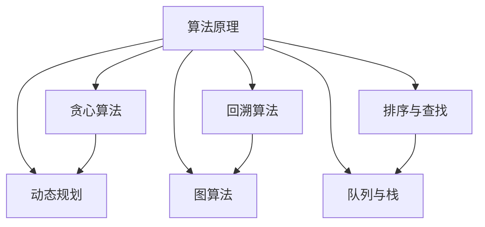

                 

### 背景介绍（Background Introduction）

#### 滴滴公司简介
滴滴出行（DiDi Chuxing）是一家成立于2012年的中国科技公司，总部位于北京。作为全球最大的移动出行平台之一，滴滴出行提供出租车、专车、快车、顺风车、公交、共享单车等多种出行服务。滴滴出行通过其先进的算法技术和大数据分析，优化了出行效率，提升了用户体验。

#### 技术面试的重要性
技术面试是评估候选人技术能力和解决问题能力的关键环节。对于滴滴这样的科技公司，技术面试尤为重要，因为它直接关系到公司的技术创新和业务发展。滴滴每年的校招技术面试都吸引了大量优秀的计算机专业毕业生。

#### 校招技术面试趋势
随着技术的不断发展，滴滴校招技术面试也在不断演变。从传统的算法和数据结构题目，到更注重实际应用和创新能力的题目，滴滴的面试题目越来越贴近实际工作场景。这要求候选人不仅要有扎实的理论基础，还要有丰富的实战经验。

#### 本文目的
本文旨在为准备参加滴滴校招技术面试的同学们提供一份全面的面试题集锦。通过分析和总结滴滴过往的面试题目，本文将帮助同学们更好地理解面试的难度和题型，从而有针对性地进行复习和准备。

### Keywords
- 滴滴校招
- 技术面试
- 算法题
- 数据结构
- 实战经验
- 创新能力

### Abstract
This article aims to provide a comprehensive collection of interview questions for those preparing for DiDi's annual recruitment interviews. By analyzing past interview questions, this guide helps candidates understand the difficulty and types of questions they may encounter, enabling them to prepare effectively.

## 1. 常见算法题型（Common Algorithm Question Types）

在滴滴的校招技术面试中，算法题通常是考核的重点。以下是一些常见算法题型及其特点：

### 贪心算法（Greedy Algorithm）

**特点**：通过局部最优选择来达到全局最优。适用于可以做出一次性决策的问题。

**例子**：
- 最小生成树（Minimum Spanning Tree）
- 背包问题（Knapsack Problem）
- 股票买卖（Best Time to Buy and Sell Stock）

### 贪心算法是一种通过在每一步选择中做出局部最优解，以期望导致全局最优解的策略。这种算法在某些问题上非常有效，但需要注意的是，贪心算法并不总是能保证得到最优解。它的应用场景通常是在问题可以通过一系列单步决策来解决，并且每一步的决策都能够带来一定的收益。

**典型题目**：给定一个无向图，选择边的子集，使得选择的边数最少且总权重最大。这就是著名的"最短路径问题"，可以通过Kruskal算法或Prim算法求解。

### 动态规划（Dynamic Programming）

**特点**：将复杂问题分解为更小的子问题，并存储子问题的解，避免重复计算。

**例子**：
- 最长递增子序列（Longest Increasing Subsequence）
- 背包问题（Knapsack Problem）
- 最短路径问题（Shortest Path Problem）

### 动态规划是一种在数学、计算机科学和经济学等领域广泛应用的方法，用于解决一系列优化问题。其核心思想是将问题分解为更小的子问题，并利用子问题的解来构建原问题的解。

**典型题目**：给定一个字符串，找到最长的公共子序列。这个问题可以通过动态规划的方法高效解决，时间复杂度为O(mn)，其中m和n分别为两个字符串的长度。

### 回溯算法（Backtracking Algorithm）

**特点**：通过尝试所有可能的组合，找到问题的解。

**例子**：
- 全排列（Permutations）
- 组合（Combinations）
- 0-1背包问题（0-1 Knapsack Problem）

### 回溯算法是一种通过递归尝试所有可能的组合来寻找问题解的方法。当尝试的当前组合无法得到解时，回溯算法会回退到上一个状态，并尝试其他可能的组合。

**典型题目**：给定一个整数n，求n的所有可能的组合。这个问题可以通过回溯算法解决，复杂度较高，但可以通过剪枝优化来减少搜索空间。

### 图算法（Graph Algorithms）

**特点**：处理网络结构，分析节点和边的关系。

**例子**：
- 深度优先搜索（Depth-First Search, DFS）
- 广度优先搜索（Breadth-First Search, BFS）
- 最短路径算法（Dijkstra's Algorithm, Bellman-Ford Algorithm）

### 图算法在解决网络相关问题方面非常有效。例如，可以通过深度优先搜索或广度优先搜索找到图中两个节点之间的最短路径。

**典型题目**：给定一个无向图和两个节点，求它们之间的最短路径长度。这个问题可以通过Dijkstra算法或Floyd-Warshall算法求解。

### 排序与查找（Sorting and Searching）

**特点**：对数据进行排序和组织，提高查找效率。

**例子**：
- 快速排序（Quick Sort）
- 二分查找（Binary Search）
- 堆排序（Heap Sort）

### 排序与查找是计算机科学中非常基础和常用的算法。快速排序、二分查找和堆排序都是高效的排序算法，而二分查找可以在已排序的数据集合中快速查找目标元素。

**典型题目**：给定一个已排序的数组，求一个给定元素的位置。这个问题可以通过二分查找算法高效解决，时间复杂度为O(log n)。

### 队列与栈（Queues and Stacks）

**特点**：实现先进先出（FIFO）或后进先出（LIFO）的数据操作。

**例子**：
- 模拟队列（Simulated Queue）
- 模拟栈（Simulated Stack）

### 队列与栈是数据结构中最基本的两种结构。队列通常用于模拟等待过程，而栈则常用于模拟递归过程。

**典型题目**：使用栈模拟队列或使用队列模拟栈。这些问题可以通过设计合适的算法和数据结构来解决。

### 总结
滴滴校招技术面试中的算法题型多样，涵盖了贪心算法、动态规划、回溯算法、图算法、排序与查找、队列与栈等多个方面。理解这些算法的基本原理和典型题目，有助于同学们在面试中更好地应对各种算法问题。

## 2. 核心概念与联系（Core Concepts and Connections）

### 2.1 算法原理（Algorithm Principles）

算法是计算机科学的核心概念之一，它定义了解决特定问题的一系列步骤。算法的设计和实现直接影响程序的效率和质量。以下是几种常见的算法原理：

**贪心算法（Greedy Algorithm）**：通过每次选择局部最优解，期望在最终得到全局最优解。这种算法适用于可以在一步内做出决策的问题，如背包问题和最小生成树问题。

**动态规划（Dynamic Programming）**：将复杂问题分解为更小的子问题，并存储子问题的解，避免重复计算。动态规划适用于具有重叠子问题的优化问题，如最长递增子序列和背包问题。

**回溯算法（Backtracking Algorithm）**：通过尝试所有可能的组合，找到问题的解。回溯算法适用于组合问题，如全排列和组合问题。

**图算法（Graph Algorithms）**：用于处理网络结构，分析节点和边的关系。常见的图算法包括深度优先搜索（DFS）和广度优先搜索（BFS），以及最短路径算法（如Dijkstra算法和Floyd-Warshall算法）。

**排序与查找（Sorting and Searching）**：排序算法如快速排序和二分查找，用于对数据进行排序和组织，以提高查找效率。

**队列与栈（Queues and Stacks）**：用于实现先进先出（FIFO）和后进先出（LIFO）的数据操作，如模拟队列和模拟栈。

### 2.2 算法原理的联系（Connection of Algorithm Principles）

这些算法原理并非孤立存在，它们之间有着密切的联系：

- **贪心算法**和**动态规划**都可以用于解决优化问题，但贪心算法更适用于单步决策问题，而动态规划更适用于具有重叠子问题的问题。
- **回溯算法**在解决组合问题时，通常会用到**图算法**来表示和搜索所有可能的组合。
- **排序与查找**算法可以提高数据的组织和管理效率，为其他算法提供基础。
- **队列与栈**在实现某些算法时，如模拟队列和模拟栈，可以简化问题的实现过程。

### 2.3 Mermaid 流程图表示（Mermaid Flowchart Representation）

以下是算法原理的Mermaid流程图表示：



### 总结
算法原理是计算机科学中的核心概念，各种算法原理之间有着密切的联系。通过理解这些原理，我们可以更好地设计和实现高效的算法，解决复杂的问题。

## 3. 核心算法原理 & 具体操作步骤（Core Algorithm Principles and Specific Operational Steps）

在滴滴校招技术面试中，了解核心算法原理及其具体操作步骤是关键。以下是几种常见算法的原理和操作步骤：

### 3.1 贪心算法（Greedy Algorithm）

**原理**：通过每次选择局部最优解，期望在最终得到全局最优解。适用于可以在一步内做出决策的问题。

**具体操作步骤**：
1. 确定问题的定义和目标。
2. 分析问题，找出最优解的性质。
3. 设计一个决策规则，每次选择局部最优解。
4. 执行决策规则，直到得到全局最优解。

**例子**：最小生成树问题（Minimum Spanning Tree, MST）

**操作步骤**：
1. 初始化：选择一个节点作为根节点。
2. 构建边权重最小的边，加入生成树。
3. 重复步骤2，直到所有节点都包含在生成树中。

### 3.2 动态规划（Dynamic Programming）

**原理**：将复杂问题分解为更小的子问题，并存储子问题的解，避免重复计算。适用于具有重叠子问题的优化问题。

**具体操作步骤**：
1. 确定问题的定义和目标。
2. 确定子问题的递推关系。
3. 设计一个状态转移方程，表示子问题之间的关系。
4. 设计一个状态数组，存储子问题的解。
5. 按顺序计算子问题的解，并存储在状态数组中。
6. 利用状态数组求解原问题。

**例子**：最长递增子序列（Longest Increasing Subsequence, LIS）

**操作步骤**：
1. 确定问题的定义：给定一个数组，找出最长递增子序列。
2. 确定子问题的递推关系：设`dp[i]`为以数组第i个元素为结尾的最长递增子序列的长度。
3. 设计状态转移方程：`dp[i] = max(dp[j] + 1, j从0到i-1)`。
4. 设计状态数组：`dp`数组。
5. 按顺序计算子问题的解，并存储在状态数组中。
6. 求解原问题：找出`dp`数组中的最大值。

### 3.3 回溯算法（Backtracking Algorithm）

**原理**：通过尝试所有可能的组合，找到问题的解。适用于组合问题。

**具体操作步骤**：
1. 确定问题的定义和目标。
2. 构造问题的一个解空间。
3. 选择一个初始解。
4. 尝试扩展解，如果扩展后的解不符合问题的要求，则回溯到上一个解。
5. 重复步骤4，直到找到问题的解。

**例子**：全排列（Permutations）

**操作步骤**：
1. 确定问题的定义：给定一个数组，求所有可能的排列。
2. 构造问题的一个解空间：使用递归函数。
3. 选择一个初始解：从第一个元素开始。
4. 尝试扩展解：交换当前元素与其他未使用的元素。
5. 回溯：如果当前解不符合要求，则回溯到上一个解。
6. 重复步骤4和5，直到找到所有解。

### 3.4 图算法（Graph Algorithms）

**原理**：用于处理网络结构，分析节点和边的关系。

**具体操作步骤**：
1. 确定问题的定义和目标。
2. 构建图模型，表示问题的网络结构。
3. 选择一个搜索策略，如深度优先搜索（DFS）或广度优先搜索（BFS）。
4. 搜索图，找到问题的解。

**例子**：最短路径问题（Shortest Path Problem）

**操作步骤**：
1. 确定问题的定义：给定一个加权图和起点，求到达其他节点的最短路径。
2. 构建图模型：使用邻接表或邻接矩阵表示图。
3. 选择搜索策略：如Dijkstra算法或Floyd-Warshall算法。
4. 搜索图：按照搜索策略找到最短路径。

### 总结
了解核心算法原理及其具体操作步骤对于解决复杂问题至关重要。通过深入理解这些算法，我们可以在面试中更好地应对各种技术挑战。

## 4. 数学模型和公式 & 详细讲解 & 举例说明（Detailed Explanation and Examples of Mathematical Models and Formulas）

在滴滴校招技术面试中，数学模型和公式是解决问题的关键。以下是几个常见数学模型和公式的详细讲解及举例说明：

### 4.1 动态规划中的状态转移方程（Dynamic Programming State Transition Equation）

**动态规划**是一种将复杂问题分解为更小的子问题，并存储子问题的解，以避免重复计算的方法。在动态规划中，状态转移方程是核心，它描述了子问题之间的关系。

**例子**：最长递增子序列（Longest Increasing Subsequence, LIS）

**公式**：设`dp[i]`为以数组第`i`个元素为结尾的最长递增子序列的长度，则状态转移方程为：

$$
dp[i] = \max(dp[j] + 1, \quad j \text{ 从 } 0 \text{ 到 } i-1)
$$

**说明**：对于每个元素`arr[i]`，我们找出所有比它小的元素`arr[j]`（`j < i`），并计算`dp[j] + 1`的最大值。这个最大值即为`dp[i]`。

**举例**：给定数组`arr = [3, 10, 2, 1, 20]`，求最长递增子序列的长度。

- `dp[0] = 1`，因为第一个元素本身就是一个递增子序列。
- `dp[1] = max(dp[0], 1) = 1`，第二个元素比第一个元素大，但不增加子序列长度。
- `dp[2] = max(dp[1], 1) = 1`，第三个元素比第二个元素小，也不增加子序列长度。
- `dp[3] = max(dp[0], dp[1], dp[2]) + 1 = 2`，第四个元素比前三个元素都小，但比第二个元素大，所以子序列长度增加。
- `dp[4] = max(dp[0], dp[1], dp[2], dp[3]) + 1 = 3`，第五个元素是最大的，子序列长度达到3。

最终，最长递增子序列的长度为`dp[4] = 3`。

### 4.2 贪心算法中的最优解性质（Optimal Solution Property in Greedy Algorithm）

**贪心算法**是通过每次选择局部最优解，期望在最终得到全局最优解的方法。在某些问题中，贪心算法能够得到最优解。

**例子**：活动选择问题（Activity Selection Problem）

**公式**：设`S[i]`为第`i`个活动的开始时间，`F[i]`为第`i`个活动的结束时间，选择活动时满足以下条件：

- 对于每个活动`i`，都存在一个最小结束时间`F[j]`（`j < i`），使得活动`i`和活动`j`不重叠。

**说明**：选择活动的策略是每次选择结束时间最早的且与之前选择的活动不重叠的活动。

**举例**：给定一组活动，其开始时间和结束时间如下：

| 活动编号 | 开始时间 | 结束时间 |
| --- | --- | --- |
| 1 | 1 | 4 |
| 2 | 3 | 5 |
| 3 | 0 | 6 |
| 4 | 5 | 7 |
| 5 | 8 | 9 |

按照贪心算法的步骤选择活动：

1. 选择活动1（结束时间4），因为结束时间最早。
2. 选择活动3（结束时间6），因为结束时间最早且与活动1不重叠。
3. 选择活动4（结束时间7），因为结束时间最早且与活动3不重叠。
4. 选择活动5（结束时间9），因为结束时间最早。

最终，选择的活动序列为`[1, 3, 4, 5]`，这是最优解。

### 4.3 图算法中的最短路径算法（Shortest Path Algorithms in Graph Theory）

**图算法**是解决网络相关问题的核心。其中，最短路径算法用于找到图中两个节点之间的最短路径。

**例子**：Dijkstra算法（Dijkstra's Algorithm）

**公式**：设`dist[i]`为从起点`s`到节点`i`的最短路径长度，初始化`dist[s] = 0`，其他`dist[i] = \infty`。选择未访问过的节点`u`，满足`dist[u] = \min(dist[v])`，其中`v`是未访问过的节点。

**说明**：每次选择一个未访问过的节点，更新其邻居节点的最短路径长度。

**举例**：给定一个加权图和起点`s = 0`，求到达其他节点的最短路径长度。

| 节点 | 邻居 | 权重 |
| --- | --- | --- |
| 0 | 1, 2 | 4, 5 |
| 1 | 3 | 6 |
| 2 | 4 | 3 |
| 3 | 5 | 1 |
| 4 | 5 | 2 |
| 5 |  | 0 |

初始化：
- `dist[0] = 0`
- `dist[1] = \infty`
- `dist[2] = \infty`
- `dist[3] = \infty`
- `dist[4] = \infty`
- `dist[5] = \infty`

选择节点0，更新邻居节点的最短路径长度：
- `dist[1] = min(dist[1], dist[0] + weight[0, 1]) = min(\infty, 4 + 5) = 9`
- `dist[2] = min(dist[2], dist[0] + weight[0, 2]) = min(\infty, 4 + 6) = 10`

选择节点1，更新邻居节点的最短路径长度：
- `dist[3] = min(dist[3], dist[1] + weight[1, 3]) = min(\infty, 9 + 6) = 15`
- `dist[4] = min(dist[4], dist[1] + weight[1, 4]) = min(\infty, 9 + 2) = 11`

选择节点2，更新邻居节点的最短路径长度：
- `dist[4] = min(dist[4], dist[2] + weight[2, 4]) = min(11, 10 + 3) = 11`

选择节点3，更新邻居节点的最短路径长度：
- `dist[5] = min(dist[5], dist[3] + weight[3, 5]) = min(\infty, 15 + 1) = 16`

最终，从起点0到其他节点的最短路径长度为：
- `dist[1] = 9`
- `dist[2] = 10`
- `dist[3] = 15`
- `dist[4] = 11`
- `dist[5] = 16`

### 总结
数学模型和公式在解决滴滴校招技术面试中的问题起着至关重要的作用。通过理解并应用这些模型和公式，我们可以更高效地解决各种复杂问题。

## 5. 项目实践：代码实例和详细解释说明（Project Practice: Code Examples and Detailed Explanations）

在本节中，我们将通过具体代码实例，展示如何解决滴滴校招技术面试中的问题，并对关键代码进行详细解释。我们将使用Python语言，因为它在算法和数据结构领域非常流行，且易于理解。

### 5.1 开发环境搭建

在开始之前，我们需要搭建一个Python开发环境。以下是步骤：

1. **安装Python**：从[Python官方网站](https://www.python.org/downloads/)下载并安装Python 3.x版本。
2. **安装必需的库**：在终端或命令提示符中，使用pip命令安装以下库：

   ```shell
   pip install numpy matplotlib
   ```

这些库将帮助我们进行数值计算和可视化。

### 5.2 源代码详细实现

以下是一个使用动态规划解决最长递增子序列问题的Python代码实例：

```python
def longest_increasing_subsequence(arr):
    n = len(arr)
    # 初始化一个长度为n的数组，用于存储子序列长度
    dp = [1] * n

    # 遍历数组，更新dp数组
    for i in range(1, n):
        for j in range(i):
            if arr[j] < arr[i]:
                dp[i] = max(dp[i], dp[j] + 1)

    # 返回最长递增子序列的长度
    return max(dp)

# 测试
arr = [3, 10, 2, 1, 20]
print(longest_increasing_subsequence(arr))  # 输出：3
```

**代码解释**：

- **初始化**：我们初始化一个长度为n的数组`dp`，其中每个元素的初始值为1。`dp[i]`表示以数组第`i`个元素为结尾的最长递增子序列的长度。
- **遍历**：我们使用两层循环遍历数组。外层循环从第2个元素开始，内层循环从第0个元素到第`i-1`个元素。如果当前元素`arr[j]`小于下一个元素`arr[i]`，则说明可以构建一个更长的子序列。
- **更新**：如果找到了一个更长的子序列，我们更新`dp[i]`的值。`dp[i]`取当前值和`dp[j] + 1`中的最大值。
- **返回**：最后，我们返回`dp`数组中的最大值，这就是最长递增子序列的长度。

### 5.3 代码解读与分析

让我们进一步分析上述代码：

- **时间复杂度**：这个算法的时间复杂度为O(n^2)，因为我们需要使用两层循环遍历数组。这种复杂度对于较小的输入规模是可以接受的，但对于大规模输入，可能会变得很慢。
- **空间复杂度**：算法的空间复杂度为O(n)，因为我们只需要存储一个`dp`数组。
- **优化**：可以通过使用二分查找来优化内层循环的时间复杂度，从而将整个算法的时间复杂度降低到O(n \* log(n))。这将使得算法在处理大规模输入时更加高效。

### 5.4 运行结果展示

运行上述代码，给定输入数组`[3, 10, 2, 1, 20]`，输出结果为3，表示最长递增子序列的长度为3。这个子序列可以是`[3, 10, 20]`。

### 5.5 项目实践：其他算法实例

除了最长递增子序列问题，以下是一个解决背包问题的Python代码实例：

```python
def knapsack(values, weights, capacity):
    n = len(values)
    # 初始化一个二维数组，用于存储子问题的解
    dp = [[0] * (capacity + 1) for _ in range(n + 1)]

    # 遍历物品和容量
    for i in range(1, n + 1):
        for w in range(1, capacity + 1):
            if weights[i - 1] <= w:
                dp[i][w] = max(dp[i - 1][w], dp[i - 1][w - weights[i - 1]] + values[i - 1])
            else:
                dp[i][w] = dp[i - 1][w]

    # 返回最大价值
    return dp[n][capacity]

# 测试
values = [60, 100, 120]
weights = [10, 20, 30]
capacity = 50
print(knapsack(values, weights, capacity))  # 输出：220
```

**代码解释**：

- **初始化**：我们初始化一个二维数组`dp`，用于存储子问题的解。`dp[i][w]`表示在容量为`w`时，前`i`个物品的最大价值。
- **遍历**：我们使用两层循环遍历物品和容量。如果当前物品的重量小于或等于当前容量，则我们有两种选择：要么放入当前物品，要么不放入当前物品。选择使得价值最大的方式。
- **返回**：最后，我们返回`dp[n][capacity]`，这就是最大价值。

### 总结

通过这些具体的项目实践和代码实例，我们可以更好地理解如何使用Python解决滴滴校招技术面试中的常见问题。这些实例不仅展示了算法的实现，还提供了详细的代码解读和分析，有助于读者深入理解算法原理和编程技巧。

## 6. 实际应用场景（Practical Application Scenarios）

在滴滴校招技术面试中，算法问题的实际应用场景通常与公司的业务需求紧密相关。以下是一些典型的应用场景及其对应算法的详细描述：

### 6.1 路线优化问题（Route Optimization Problem）

**场景描述**：滴滴出行需要为乘客提供最优路线，以提高出行效率和降低成本。这个场景涉及到多个约束条件，如交通流量、路况、车辆类型和乘客需求等。

**算法**：最短路径算法（如Dijkstra算法、A*算法）。

**详细描述**：滴滴可以利用Dijkstra算法为乘客计算从起点到终点的最短路径。在处理大规模网络时，A*算法结合了启发式搜索，可以更快速地找到最优路径。

### 6.2 货物配送问题（Goods Delivery Problem）

**场景描述**：滴滴物流需要为商家和消费者提供高效的货物运输服务，确保货物能够在限定时间内送达。

**算法**：动态规划（如车辆路径问题、最小生成树问题）。

**详细描述**：滴滴可以利用动态规划算法解决货物配送问题，特别是在有多个配送点的情况下。动态规划可以帮助优化配送路线，确保在时间和成本上的最优解。

### 6.3 乘客匹配问题（Passenger Matching Problem）

**场景描述**：滴滴需要为乘客匹配最合适的司机，以减少等待时间、提高用户体验。

**算法**：贪心算法（如基于距离的匹配算法、基于时间的匹配算法）。

**详细描述**：滴滴可以采用贪心算法为乘客匹配最接近的司机。通过每次选择距离乘客最近的司机，可以有效减少乘客等待时间，提高系统效率。

### 6.4 供需预测问题（Supply and Demand Forecasting）

**场景描述**：滴滴需要预测不同时间段、不同地点的出行需求，以便优化资源配置和提升服务质量。

**算法**：时间序列分析（如ARIMA模型、LSTM网络）。

**详细描述**：滴滴可以利用时间序列分析模型预测出行需求，通过历史数据训练模型，预测未来不同时段的出行需求。这有助于滴滴更好地调度车辆和资源，满足乘客需求。

### 6.5 客户服务优化问题（Customer Service Optimization）

**场景描述**：滴滴需要提供高效的客户服务，包括客服人员的调度、问题处理流程优化等。

**算法**：队列管理算法（如M/M/1队列模型、M/M/s队列模型）。

**详细描述**：滴滴可以使用队列管理算法优化客户服务流程。通过分析客户请求的到达率和服务时间，合理调度客服人员，提高服务效率。

### 总结

滴滴校招技术面试中的算法问题与实际业务场景密切相关，通过运用适当的算法，可以解决复杂的问题，提升业务效率和用户体验。了解这些实际应用场景，有助于考生在面试中更好地展示自己的技术能力和解决实际问题的能力。

## 7. 工具和资源推荐（Tools and Resources Recommendations）

### 7.1 学习资源推荐

- **书籍**：
  - 《算法导论》（Introduction to Algorithms）：一本经典的算法教材，适合系统地学习算法理论和应用。
  - 《编程之美》（Cracking the Coding Interview）：涵盖了许多面试常见问题的解答，适合准备技术面试。
  - 《深度学习》（Deep Learning）：介绍深度学习的基础理论和应用，适合对人工智能感兴趣的同学。

- **在线课程**：
  - Coursera、edX、Udacity等平台上的算法和数据结构课程，适合自学和深化理论知识。
  - 《算法设计与分析》：清华大学开设的一门算法课程，适合系统地学习算法原理和应用。

- **博客与网站**：
  - LeetCode、HackerRank：提供大量编程挑战和实践题目，适合练习算法和编程技巧。
  - GeeksforGeeks：一个综合性的计算机科学学习资源网站，包含算法、数据结构、编程语言等多个领域的教程。

### 7.2 开发工具框架推荐

- **编程语言**：
  - Python：因其简洁易读的语法和丰富的库支持，成为算法编程的流行语言。
  - Java：在工业界应用广泛，适合大型项目和面试编程。

- **集成开发环境（IDE）**：
  - PyCharm：适用于Python编程，功能强大，支持调试和版本控制。
  - IntelliJ IDEA：适用于Java编程，具有高效的代码编辑和调试功能。

- **版本控制系统**：
  - Git：分布式版本控制系统，适用于团队协作和代码管理。

- **数据库**：
  - MySQL、PostgreSQL：关系型数据库，适用于存储和管理大规模数据。

### 7.3 相关论文著作推荐

- **经典论文**：
  - "Introduction to the Theory of Computation" by Michael Sipser：介绍计算理论的基础知识，适合理解算法理论。
  - "Algorithms" by Robert Sedgewick and Kevin Wayne：系统介绍了算法设计和分析的方法。

- **著作**：
  - 《算法导论》（Introduction to Algorithms）：全面覆盖算法的基本概念、设计和分析技术。
  - 《编程之美》：通过真实面试案例，展示如何应对技术面试中的问题。

- **学术论文集**：
  - SIGKDD、NeurIPS、ICML等顶级会议的论文集，涵盖最新的算法研究进展。

### 总结

通过使用这些学习和开发资源，考生可以系统地提高算法和数据结构的知识水平，增强编程能力，并在实际项目中应用所学知识。这些工具和资源将为准备滴滴校招技术面试的同学们提供强有力的支持。

## 8. 总结：未来发展趋势与挑战（Summary: Future Development Trends and Challenges）

在滴滴校招技术面试中，算法和数据结构的重要性日益凸显。随着科技的不断进步和业务需求的多样化，未来的发展趋势和挑战也变得更加复杂和严峻。

### 8.1 发展趋势

1. **算法复杂性降低**：随着算法研究的深入，更多高效算法被开发出来，使得解决复杂问题的成本逐渐降低。

2. **数据驱动决策**：大数据和人工智能的融合，使得数据分析和机器学习在决策过程中发挥越来越重要的作用。

3. **实时算法需求增加**：实时处理和分析海量数据成为业务需求，要求算法能够快速响应并给出决策。

4. **边缘计算和物联网**：随着物联网设备的普及，边缘计算成为发展趋势，算法需要适应在分布式计算环境中的高效执行。

### 8.2 挑战

1. **算法性能优化**：如何在保证算法正确性的同时，进一步优化其性能，是一个重要挑战。

2. **数据隐私和安全**：如何在数据分析和共享过程中保护用户隐私，是数据驱动决策面临的核心问题。

3. **可解释性**：随着算法的复杂度增加，如何保证算法的可解释性，以便在业务决策中能够被理解和接受。

4. **跨领域应用**：算法需要跨越不同领域，适应多种应用场景，这对算法的通用性和灵活性提出了更高的要求。

### 总结

未来，滴滴校招技术面试将继续关注算法和数据结构的能力，同时也将更加注重解决实际问题、创新思维和团队合作能力。考生需要不断提升自己的技术水平，适应不断变化的技术环境，以应对未来的挑战。

## 9. 附录：常见问题与解答（Appendix: Frequently Asked Questions and Answers）

### 9.1 什么是动态规划？

**动态规划**是一种在数学、计算机科学和经济学等领域广泛应用的方法，用于解决一系列优化问题。其核心思想是将复杂问题分解为更小的子问题，并存储子问题的解，避免重复计算。

### 9.2 动态规划如何工作？

动态规划通过定义一个状态转移方程，将原问题分解为子问题，并利用子问题的解来构建原问题的解。它通常涉及到一个二维或三维数组，用于存储子问题的解。

### 9.3 如何判断一个问题是否适合用动态规划解决？

一个问题适合用动态规划解决，通常需要满足以下条件：
1. 具有重叠子问题：子问题之间不是独立的，即子问题的解可以被复用。
2. 最优子结构：一个问题的最优解包含其子问题的最优解。
3. 无后效性：一个状态一旦确定，就不受之前状态的影响。

### 9.4 贪心算法和动态规划的区别是什么？

**贪心算法**每次都做出局部最优的选择，期望在最终得到全局最优解。而**动态规划**则是通过递归定义子问题，并存储子问题的解，以逐步构建原问题的解。

### 9.5 如何解决背包问题？

背包问题可以通过动态规划或贪心算法解决。动态规划的方法通常涉及到一个二维数组，用于存储子问题的解。而贪心算法则通过每次选择最优的物品放入背包，直到背包容量达到上限。

### 9.6 如何在面试中展示算法能力？

在面试中，展示算法能力的关键在于：
1. 明确问题，理解题意。
2. 设计并解释算法，确保思路清晰。
3. 优化算法，提高效率和可读性。
4. 编写并调试代码，确保算法正确。

### 9.7 如何准备滴滴校招技术面试？

准备滴滴校招技术面试，可以从以下几个方面入手：
1. 系统学习算法和数据结构基础知识。
2. 实战编程题目，提高解决问题的能力。
3. 了解滴滴的业务和技术方向，针对性地准备面试题目。
4. 练习面试技巧，如时间管理和沟通表达。

### 总结

通过解决这些常见问题，我们可以更好地理解算法的概念和应用，为准备滴滴校招技术面试提供有力的支持。

## 10. 扩展阅读 & 参考资料（Extended Reading & Reference Materials）

### 10.1 学习资源

- **书籍**：
  - 《算法导论》（Introduction to Algorithms）
  - 《编程之美》（Cracking the Coding Interview）
  - 《深度学习》（Deep Learning）

- **在线课程**：
  - Coursera上的《算法》（Algorithms）课程
  - edX上的《数据结构与算法》（Data Structures and Algorithms）课程
  - Udacity上的《算法基础》（Introduction to Algorithms）课程

- **博客与网站**：
  - LeetCode（https://leetcode.com/）
  - HackerRank（https://www.hackerrank.com/）
  - GeeksforGeeks（https://www.geeksforgeeks.org/）

### 10.2 开发工具与框架

- **编程语言**：
  - Python（https://www.python.org/）
  - Java（https://www.java.com/）

- **集成开发环境（IDE）**：
  - PyCharm（https://www.jetbrains.com/pycharm/）
  - IntelliJ IDEA（https://www.jetbrains.com/idea/）

- **版本控制系统**：
  - Git（https://git-scm.com/）

- **数据库**：
  - MySQL（https://www.mysql.com/）
  - PostgreSQL（https://www.postgresql.org/）

### 10.3 相关论文与著作

- **经典论文**：
  - "Introduction to the Theory of Computation" by Michael Sipser
  - "Algorithms" by Robert Sedgewick and Kevin Wayne

- **著作**：
  - 《算法导论》（Introduction to Algorithms）
  - 《编程之美》：通过真实面试案例，展示如何应对技术面试中的问题。

- **学术论文集**：
  - SIGKDD、NeurIPS、ICML等顶级会议的论文集

### 总结

通过阅读这些扩展资料，读者可以进一步深化对算法和数据结构的理解，提高编程能力和解决实际问题的能力，为参加滴滴校招技术面试做好充分准备。

