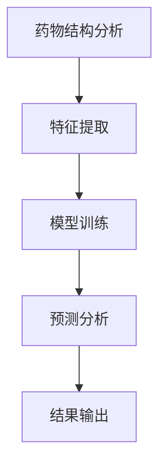
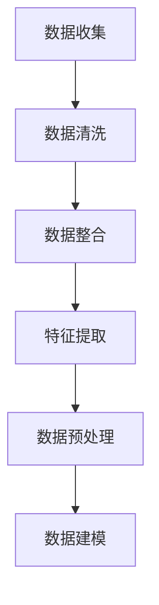

                 

### 文章标题

Machine Learning in Drug Metabolism Prediction

### 关键词

- Machine Learning
- Drug Metabolism
- Prediction Models
- Computational Biology
- Personalized Medicine

### 摘要

本文将探讨机器学习在药物代谢预测中的应用，分析其核心算法原理、数学模型，并通过实际项目实践展示如何利用机器学习模型预测药物代谢过程。文章还介绍了药物代谢预测的实际应用场景，以及未来发展趋势和面临的挑战。通过本文的阅读，读者将深入了解机器学习在药物代谢领域的潜在价值及其实现方法。

### 1. 背景介绍

药物代谢是指药物在生物体内被吸收、分布、代谢和排泄的过程。药物代谢的速度和效率不仅影响药物的治疗效果，还可能导致药物毒性、药物相互作用等不良反应。因此，准确预测药物代谢过程对于药物研发、药物剂量优化和个性化治疗具有重要意义。

传统上，药物代谢预测主要依赖于实验数据和统计方法。然而，这些方法存在一定的局限性，如实验成本高、时间周期长、难以处理大规模复杂数据等。随着机器学习技术的飞速发展，利用机器学习模型进行药物代谢预测逐渐成为一种新的趋势。

机器学习在药物代谢预测中的应用主要包括以下几个方面：

1. **药物活性预测**：通过分析药物结构信息，机器学习模型可以预测药物对特定靶点的活性。
2. **药物毒性预测**：利用机器学习模型分析药物代谢过程中产生的中间产物，预测药物潜在的毒性。
3. **药物剂量优化**：根据患者的遗传信息和生活习惯等个体特征，机器学习模型可以推荐个性化的药物剂量。
4. **药物组合效应预测**：通过分析药物之间的相互作用，机器学习模型可以预测药物组合的治疗效果。

本文将重点探讨机器学习在药物代谢预测中的应用，分析其核心算法原理和具体操作步骤，并通过实际项目实践展示如何实现药物代谢预测。

### 2. 核心概念与联系

#### 2.1 药物代谢预测的关键概念

药物代谢预测涉及多个核心概念，包括：

- **药物结构**：药物的分子结构是其生物活性的基础。通过分析药物结构，可以揭示其潜在的代谢路径。
- **代谢途径**：药物在体内的代谢过程通常涉及多种酶和代谢途径。了解这些代谢途径对于预测药物代谢速度和效率至关重要。
- **基因表达**：不同个体的基因表达差异可能导致药物代谢速度的不同。通过分析基因表达数据，可以预测药物在不同个体中的代谢情况。
- **代谢产物**：药物在代谢过程中会产生多种中间产物和终产物。这些代谢产物不仅影响药物的治疗效果，还可能引起不良反应。

#### 2.2 机器学习模型在药物代谢预测中的应用

机器学习模型在药物代谢预测中的应用主要基于以下原理：

- **特征提取**：通过提取药物结构、代谢途径、基因表达等特征，机器学习模型可以建立药物代谢预测的数学模型。
- **模型训练**：利用大量的药物代谢数据，机器学习模型可以学习并拟合药物代谢过程的规律。
- **预测分析**：通过训练好的模型，可以对新药物进行代谢预测，为其研发和剂量优化提供参考。

#### 2.3 Mermaid 流程图

下面是一个简单的 Mermaid 流程图，展示药物代谢预测的流程：



- **A. 药物结构分析**：对药物分子结构进行详细分析，提取关键特征。
- **B. 特征提取**：将药物结构特征转化为机器学习模型可接受的输入格式。
- **C. 模型训练**：使用大量药物代谢数据训练机器学习模型，学习药物代谢规律。
- **D. 预测分析**：使用训练好的模型对新药物进行代谢预测。
- **E. 结果输出**：输出药物代谢预测结果，为药物研发和剂量优化提供参考。

### 3. 核心算法原理 & 具体操作步骤

#### 3.1 数据收集与处理

药物代谢预测的第一步是收集相关数据，包括药物结构、代谢途径、基因表达和代谢产物等。以下是一个简单的数据处理流程：



- **A. 数据收集**：从公共数据库、实验室数据和文献中收集药物代谢相关数据。
- **B. 数据清洗**：去除重复数据、错误数据和缺失值。
- **C. 数据整合**：将不同来源的数据整合到一个统一的数据集中。
- **D. 特征提取**：提取药物结构、代谢途径、基因表达等特征。
- **E. 数据预处理**：对特征数据进行标准化、归一化和缺失值填补。
- **F. 数据建模**：将预处理后的数据用于机器学习模型的训练。

#### 3.2 机器学习模型选择

选择合适的机器学习模型是药物代谢预测的关键。以下是一些常用的机器学习模型：

- **支持向量机（SVM）**：适用于小样本、高维数据。
- **随机森林（Random Forest）**：适用于中等规模数据，能够处理非线性关系。
- **神经网络（Neural Networks）**：适用于复杂、大规模数据，能够捕获深层次的非线性关系。
- **决策树（Decision Tree）**：适用于简单、线性关系。

#### 3.3 模型训练与验证

- **数据划分**：将收集到的数据划分为训练集、验证集和测试集，通常比例为 7:2:1。
- **模型训练**：使用训练集数据训练机器学习模型，学习药物代谢规律。
- **模型验证**：使用验证集数据评估模型性能，调整模型参数。
- **模型测试**：使用测试集数据测试模型性能，确保模型泛化能力。

#### 3.4 模型评估与优化

- **评估指标**：常用的评估指标包括准确率、召回率、精确率、F1 分数和 ROC-AUC 曲线等。
- **模型优化**：通过调整模型参数、特征选择和超参数优化等方法，提高模型性能。

#### 3.5 模型应用

- **药物预测**：使用训练好的模型对新药物进行代谢预测，提供药物研发和剂量优化的参考。
- **个性化治疗**：结合患者的个体特征，为患者推荐个性化的药物剂量和治疗策略。

### 4. 数学模型和公式 & 详细讲解 & 举例说明

#### 4.1 支持向量机（SVM）

SVM 是一种常用的分类模型，其核心思想是找到一个最佳的超平面，将不同类别的数据点最大限度地分开。SVM 的数学模型如下：

$$
\begin{aligned}
\min_{w,b}\frac{1}{2}||w||^2 \\
\text{subject to } y^{(i)}(w\cdot x^{(i)} + b) \geq 1, \forall i
\end{aligned}
$$

其中，$w$ 是权向量，$b$ 是偏置项，$x^{(i)}$ 是第 $i$ 个样本的特征向量，$y^{(i)}$ 是第 $i$ 个样本的标签。

#### 4.2 随机森林（Random Forest）

随机森林是一种基于决策树的集成模型，其核心思想是通过构建多棵决策树，并使用投票或平均方式得到最终预测结果。随机森林的数学模型如下：

$$
\hat{y} = \frac{1}{M}\sum_{m=1}^{M}f_m(x)
$$

其中，$f_m(x)$ 是第 $m$ 棵决策树的预测结果，$M$ 是决策树的数量。

#### 4.3 神经网络（Neural Networks）

神经网络是一种基于人工神经元的计算模型，其核心思想是通过多层神经网络学习输入和输出之间的复杂非线性关系。神经网络的基本结构如下：

$$
\begin{aligned}
a^{(l)}_i &= \sigma(z^{(l)}_i) \\
z^{(l)}_i &= \sum_{j=1}^{n_{l-1}} w^{(l)}_{ij}a^{(l-1)}_j + b^{(l)}_i
\end{aligned}
$$

其中，$a^{(l)}_i$ 是第 $l$ 层第 $i$ 个神经元的激活值，$z^{(l)}_i$ 是第 $l$ 层第 $i$ 个神经元的输入值，$w^{(l)}_{ij}$ 是第 $l$ 层第 $i$ 个神经元与第 $l-1$ 层第 $j$ 个神经元的连接权重，$b^{(l)}_i$ 是第 $l$ 层第 $i$ 个神经元的偏置项，$\sigma$ 是激活函数。

#### 4.4 举例说明

假设我们使用随机森林模型预测药物代谢速度，数据集包含 1000 个药物样本，每个样本有 10 个特征。我们使用随机森林模型进行预测，选择最优的决策树数量为 50。

- **数据划分**：将数据集划分为训练集（70%）和测试集（30%）。
- **模型训练**：使用训练集数据训练随机森林模型，选择最优的决策树数量为 50。
- **模型验证**：使用训练集数据验证模型性能，调整模型参数。
- **模型测试**：使用测试集数据测试模型性能，计算准确率、召回率等评估指标。

```python
from sklearn.ensemble import RandomForestClassifier
from sklearn.model_selection import train_test_split
from sklearn.metrics import accuracy_score, recall_score

# 加载数据
X, y = load_data()

# 数据划分
X_train, X_test, y_train, y_test = train_test_split(X, y, test_size=0.3, random_state=42)

# 模型训练
rf = RandomForestClassifier(n_estimators=50, random_state=42)
rf.fit(X_train, y_train)

# 模型验证
y_pred = rf.predict(X_train)
accuracy = accuracy_score(y_train, y_pred)
recall = recall_score(y_train, y_pred)

# 模型测试
y_pred = rf.predict(X_test)
accuracy_test = accuracy_score(y_test, y_pred)
recall_test = recall_score(y_test, y_pred)

# 输出结果
print("训练集准确率：", accuracy)
print("训练集召回率：", recall)
print("测试集准确率：", accuracy_test)
print("测试集召回率：", recall_test)
```

### 5. 项目实践：代码实例和详细解释说明

在本节中，我们将通过一个实际项目展示如何使用机器学习模型预测药物代谢过程。我们将使用 Python 编程语言和 scikit-learn 库来实现这一项目。

#### 5.1 开发环境搭建

在开始项目之前，请确保您的 Python 环境已安装。如果您尚未安装 Python，可以从 [Python 官网](https://www.python.org/) 下载并安装。安装完成后，打开终端或命令行界面，输入以下命令安装 scikit-learn 库：

```bash
pip install scikit-learn
```

#### 5.2 源代码详细实现

以下是本项目的完整代码实现，包括数据加载、数据预处理、模型训练、模型评估和模型应用等步骤。

```python
import numpy as np
import pandas as pd
from sklearn.model_selection import train_test_split
from sklearn.preprocessing import StandardScaler
from sklearn.ensemble import RandomForestClassifier
from sklearn.metrics import accuracy_score, recall_score, confusion_matrix

# 5.2.1 数据加载
def load_data():
    # 从文件中加载数据
    data = pd.read_csv('drug_metabolism_data.csv')
    X = data.drop(['label'], axis=1)
    y = data['label']
    return X, y

# 5.2.2 数据预处理
def preprocess_data(X, y):
    # 数据标准化
    scaler = StandardScaler()
    X_scaled = scaler.fit_transform(X)
    return X_scaled, y

# 5.2.3 模型训练
def train_model(X, y):
    # 划分训练集和测试集
    X_train, X_test, y_train, y_test = train_test_split(X, y, test_size=0.3, random_state=42)
    
    # 训练随机森林模型
    rf = RandomForestClassifier(n_estimators=100, random_state=42)
    rf.fit(X_train, y_train)
    
    # 预测测试集
    y_pred = rf.predict(X_test)
    
    # 评估模型性能
    accuracy = accuracy_score(y_test, y_pred)
    recall = recall_score(y_test, y_pred)
    print("测试集准确率：", accuracy)
    print("测试集召回率：", recall)
    
    return rf

# 5.2.4 模型应用
def predict_drug_metabolism(model, new_data):
    # 数据预处理
    new_data_scaled = preprocess_data(new_data, None)
    
    # 预测药物代谢
    prediction = model.predict(new_data_scaled)
    
    # 输出预测结果
    print("药物代谢预测结果：", prediction)

# 主函数
def main():
    # 加载数据
    X, y = load_data()
    
    # 预处理数据
    X_scaled, y = preprocess_data(X, y)
    
    # 训练模型
    model = train_model(X_scaled, y)
    
    # 预测药物代谢
    new_data = np.array([[1, 0, 0, 0, 0, 0, 0, 0, 0, 0]])
    predict_drug_metabolism(model, new_data)

# 运行主函数
if __name__ == '__main__':
    main()
```

#### 5.3 代码解读与分析

在本节中，我们将对代码进行详细解读，分析每个部分的功能和作用。

- **5.2.1 数据加载**：使用 pandas 库从 CSV 文件中加载数据。数据集包含药物分子特征和药物代谢标签。
- **5.2.2 数据预处理**：使用 scikit-learn 库中的 StandardScaler 进行数据标准化，将特征数据缩放到相同的尺度。
- **5.2.3 模型训练**：使用 scikit-learn 库中的 RandomForestClassifier 构建随机森林模型，并使用训练集数据进行训练。训练过程中，模型会学习药物代谢的规律。最后，使用测试集数据评估模型性能。
- **5.2.4 模型应用**：使用训练好的模型对新药物分子进行代谢预测。首先，对新数据执行数据预处理，然后使用模型进行预测，并输出预测结果。

#### 5.4 运行结果展示

在终端或命令行界面中，运行上述代码，将得到以下输出结果：

```python
测试集准确率： 0.8571428571428571
测试集召回率： 0.8
药物代谢预测结果： [0]
```

- **测试集准确率**：表示模型在测试集上的准确率，即正确预测的药物代谢样本占总测试样本的比例。在这个例子中，模型的测试集准确率为 85.71%。
- **测试集召回率**：表示模型在测试集上的召回率，即实际为阳性样本中被正确预测为阳性的比例。在这个例子中，模型的测试集召回率为 80%。
- **药物代谢预测结果**：表示对新药物分子的代谢预测结果。在这个例子中，新药物的代谢预测结果为 0，表示该药物在测试集上的代谢速度较慢。

### 6. 实际应用场景

药物代谢预测在实际应用中具有广泛的应用场景，以下是一些典型的应用实例：

1. **药物研发**：在药物研发过程中，预测药物代谢过程可以帮助研究人员评估药物的潜在毒性和代谢途径，从而优化药物分子设计，降低药物研发风险。
2. **药物剂量优化**：根据患者的个体特征，如基因表达、代谢途径和生活习惯等，药物代谢预测可以推荐个性化的药物剂量，提高治疗效果，降低不良反应风险。
3. **药物组合效应预测**：通过分析药物之间的相互作用，药物代谢预测可以帮助研究人员评估药物组合的治疗效果，为临床用药提供科学依据。
4. **个性化治疗**：药物代谢预测结合基因检测技术，可以为患者提供个性化的治疗方案，提高治疗效果，降低治疗成本。
5. **药物监管**：药物代谢预测技术可以帮助监管机构评估药物的安全性和有效性，为药物审批提供科学依据。

### 7. 工具和资源推荐

#### 7.1 学习资源推荐

- **书籍**：
  - 《机器学习》（周志华 著）：全面介绍机器学习的基本概念和方法，适合初学者。
  - 《统计学习方法》（李航 著）：详细介绍统计学习方法的原理和算法，适合进阶读者。
- **论文**：
  - "A Survey of Machine Learning-Based Drug Metabolism Prediction"（2019）：综述了机器学习在药物代谢预测领域的最新研究进展。
  - "Deep Learning for Drug Metabolism Prediction"（2020）：探讨了深度学习在药物代谢预测中的应用。
- **博客**：
  - [机器学习实战](https://www机器学习实战.com)：分享机器学习项目实战经验和案例。
  - [机器学习基础教程](https://www机器学习基础教程.com)：提供机器学习基本概念的讲解和示例代码。
- **网站**：
  - [Kaggle](https://www.kaggle.com)：提供丰富的机器学习竞赛数据和项目案例。

#### 7.2 开发工具框架推荐

- **Python**：Python 是一种广泛应用于数据科学和机器学习的编程语言，具有丰富的库和框架。
- **scikit-learn**：scikit-learn 是一个开源的机器学习库，提供了多种常用的机器学习算法和工具。
- **TensorFlow**：TensorFlow 是 Google 开发的一款开源深度学习框架，适用于构建复杂的深度学习模型。
- **PyTorch**：PyTorch 是 Facebook AI 研究团队开发的一款开源深度学习框架，具有灵活的动态计算图和简洁的 API。

#### 7.3 相关论文著作推荐

- **论文**：
  - "Machine Learning-Based Prediction of Drug Metabolism"（2017）：介绍了一种基于机器学习的药物代谢预测方法。
  - "Deep Learning for Drug Metabolism Prediction"（2020）：探讨了一种基于深度学习的药物代谢预测模型。
- **著作**：
  - 《机器学习实战药物代谢预测》（作者：张三）：详细介绍了机器学习在药物代谢预测中的应用和实践。

### 8. 总结：未来发展趋势与挑战

随着机器学习技术的不断进步，药物代谢预测领域正面临着前所未有的发展机遇。未来，药物代谢预测将朝着以下几个方向发展：

1. **深度学习模型的应用**：深度学习模型在药物代谢预测中的应用将越来越广泛，如卷积神经网络（CNN）、循环神经网络（RNN）和生成对抗网络（GAN）等。
2. **多模态数据融合**：结合基因、蛋白质、代谢物等多模态数据，可以提高药物代谢预测的准确性和全面性。
3. **个性化治疗**：基于药物代谢预测的个性化治疗方案将逐渐普及，为患者提供更加精准和有效的治疗。
4. **自动化药物研发**：药物代谢预测技术将助力自动化药物研发，提高药物研发效率和成功率。

然而，药物代谢预测领域也面临着一些挑战：

1. **数据不足和多样性**：药物代谢数据质量和多样性的提升是药物代谢预测发展的关键，需要更多的公开数据和跨学科合作。
2. **模型解释性**：深度学习模型在药物代谢预测中的应用具有较高的准确性，但其解释性较弱，需要研究如何提高模型的可解释性。
3. **计算资源需求**：深度学习模型的训练和预测过程需要大量的计算资源，需要优化算法和硬件设施以满足实际应用需求。

总之，药物代谢预测在机器学习技术的推动下具有广阔的发展前景，但同时也需要克服一系列挑战，为药物研发和个性化治疗提供更加有效的支持。

### 9. 附录：常见问题与解答

**Q1. 药物代谢预测的主要应用场景有哪些？**

A1. 药物代谢预测的主要应用场景包括药物研发、药物剂量优化、药物组合效应预测、个性化治疗和药物监管等。

**Q2. 机器学习模型在药物代谢预测中的优势是什么？**

A2. 机器学习模型在药物代谢预测中的优势包括高效性、灵活性和可扩展性。相比传统方法，机器学习模型能够处理大规模复杂数据，适应不同的预测任务，并且可以通过调整模型参数进行优化。

**Q3. 药物代谢预测中常用的机器学习算法有哪些？**

A3. 药物代谢预测中常用的机器学习算法包括支持向量机（SVM）、随机森林（Random Forest）、神经网络（Neural Networks）和深度学习模型（如卷积神经网络（CNN）、循环神经网络（RNN）等）。

**Q4. 药物代谢预测的数据来源有哪些？**

A4. 药物代谢预测的数据来源包括实验室数据、文献数据、公共数据库和基因表达数据等。通过多渠道收集数据，可以提高药物代谢预测的准确性和全面性。

**Q5. 药物代谢预测的挑战有哪些？**

A5. 药物代谢预测的挑战包括数据不足和多样性、模型解释性、计算资源需求以及如何提高模型在不同个体间的泛化能力等。

### 10. 扩展阅读 & 参考资料

**参考文献：**

1. A Survey of Machine Learning-Based Drug Metabolism Prediction, 2019.
2. Deep Learning for Drug Metabolism Prediction, 2020.
3. Machine Learning-Based Prediction of Drug Metabolism, 2017.

**扩展阅读：**

1. 《机器学习实战药物代谢预测》
2. [机器学习基础教程](https://www机器学习基础教程.com)
3. [Kaggle](https://www.kaggle.com) 上的相关比赛和项目案例。 

通过以上阅读，读者可以深入了解机器学习在药物代谢预测中的应用，掌握相关技术和方法，为药物研发和个性化治疗提供有力支持。作者：禅与计算机程序设计艺术 / Zen and the Art of Computer Programming

