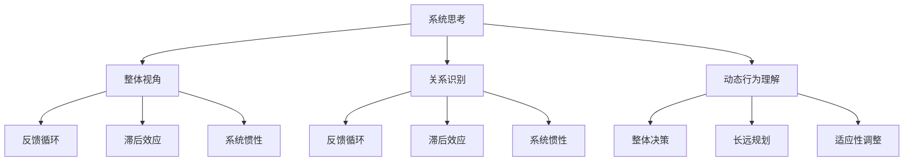
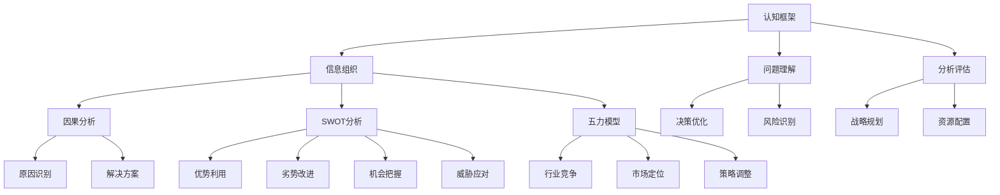
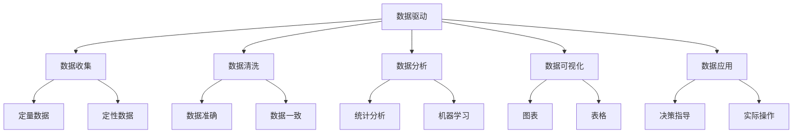

                 

### 文章标题

**思维体系：高质量决策的基础**

> **关键词**：决策思维、问题解决、系统思考、认知框架、数据驱动
> 
> **摘要**：本文深入探讨了构建高质量决策思维体系的重要性。通过对系统思考、认知框架和数据驱动等核心概念的剖析，我们提出了一个实用的思维模型，帮助读者在复杂环境中做出更明智的决策。文章旨在为决策者提供一种系统化和结构化的思考方法，以提高决策质量和效率。

### <font color=#FF0000>1. 背景介绍（Background Introduction）</font>

在当今快速变化的世界中，决策能力成为了一个关键的能力。无论是个人生活还是职业生涯，做出高质量决策都是成功的关键因素。然而，决策并非易事，它涉及到复杂的信息处理、潜在风险的评估以及对未来趋势的预测。随着问题变得更加复杂，决策者需要一种更加系统化和结构化的方法来应对这些挑战。

决策思维是一种思考过程，它涉及理解问题的本质、分析相关信息、探索可能的解决方案，并选择最佳行动方案。在这个过程中，系统思考、认知框架和数据驱动成为三个至关重要的要素。

**系统思考**（System Thinking）是一种理解复杂系统及其动态行为的方法。它强调从整体角度审视问题，识别问题之间的相互关系，并理解这些关系如何影响系统的运行。通过系统思考，决策者能够识别出潜在的反馈循环、滞后效应和系统惯性行为。

**认知框架**（Cognitive Frameworks）是决策者用来组织、分析和解释信息的心理模型。这些框架可以帮助决策者结构化复杂信息，提高对问题的理解。常见的认知框架包括因果分析、SWOT分析、五力模型等。

**数据驱动**（Data-Driven）是一种基于事实和数据进行决策的方法。它强调收集和分析数据，以便做出更准确和可靠的决策。数据驱动的方法有助于减少主观偏见和情感影响，提高决策的客观性和可重复性。

本文将探讨这些核心概念，并构建一个实用的思维模型，帮助读者在复杂环境中做出更明智的决策。

### <font color=#FF0000>2. 核心概念与联系（Core Concepts and Connections）</font>

#### 2.1 系统思考

系统思考是一种理解复杂系统及其动态行为的方法。它强调从整体角度审视问题，识别问题之间的相互关系，并理解这些关系如何影响系统的运行。通过系统思考，决策者能够识别出潜在的反馈循环、滞后效应和系统惯性行为。

在决策过程中，系统思考的重要性不可低估。它可以帮助决策者避免片面的、局部的解决方案，而采取更加全面和长远的视角。例如，在制定企业发展战略时，系统思考可以帮助决策者识别出影响公司绩效的多种因素，以及这些因素之间的相互作用。

**Mermaid 流程图**：



#### 2.2 认知框架

认知框架是决策者用来组织、分析和解释信息的心理模型。这些框架可以帮助决策者结构化复杂信息，提高对问题的理解。常见的认知框架包括因果分析、SWOT分析、五力模型等。

**因果分析**是一种用于识别和分析问题根本原因的方法。它通过识别变量之间的因果关系，帮助决策者理解问题的本质。

**SWOT分析**（Strengths, Weaknesses, Opportunities, Threats）是一种用于评估企业或项目的内部优势、劣势以及外部机会和威胁的方法。

**五力模型**（Five Forces）是一种用于分析行业竞争结构的方法。它通过评估五种基本竞争力量（供应商、买家、潜在竞争者、替代品和行业内的竞争者）的影响，帮助决策者理解行业的竞争态势。

**Mermaid 流程图**：



#### 2.3 数据驱动

数据驱动是一种基于事实和数据进行决策的方法。它强调收集和分析数据，以便做出更准确和可靠的决策。数据驱动的方法有助于减少主观偏见和情感影响，提高决策的客观性和可重复性。

在数据驱动的决策过程中，数据的质量和准确性至关重要。以下步骤可以帮助决策者有效地利用数据：

1. **数据收集**：收集与决策相关的数据，包括定量数据和定性数据。
2. **数据清洗**：清洗和整理数据，以确保数据的准确性和一致性。
3. **数据分析**：使用统计分析、机器学习等技术对数据进行分析，提取有价值的信息。
4. **数据可视化**：通过图表、表格等可视化工具展示数据，帮助决策者更好地理解数据。
5. **数据应用**：将分析结果应用于决策过程，指导实际操作。

**Mermaid 流程图**：



### <font color=#FF0000>3. 核心算法原理 & 具体操作步骤（Core Algorithm Principles and Specific Operational Steps）</font>

在构建高质量决策思维体系的过程中，核心算法原理和具体操作步骤起着至关重要的作用。以下是一个通用的决策思维模型，包括以下几个关键步骤：

#### 3.1 确定问题

首先，明确问题的定义和范围。这包括理解问题的背景、目标和相关的约束条件。通过明确问题，决策者可以确保在后续步骤中不会偏离核心问题。

**步骤 1**：定义问题

- **背景**：描述问题的起源和上下文。
- **目标**：明确希望解决的问题或达到的目标。
- **约束条件**：列出所有可能影响决策的因素。

#### 3.2 收集信息

接下来，收集与问题相关的信息。这包括定量数据和定性数据，如市场数据、竞争对手信息、客户反馈等。信息收集的目的是为了建立对问题的全面理解。

**步骤 2**：信息收集

- **数据源**：确定可靠的数据来源。
- **数据类型**：收集定量数据和定性数据。
- **数据分析**：初步分析数据，识别关键信息和潜在问题。

#### 3.3 分析信息

在收集到足够的信息后，对信息进行深入分析。分析包括识别关键因素、评估潜在风险和机会，以及构建假设。

**步骤 3**：信息分析

- **因果分析**：识别问题之间的因果关系。
- **SWOT分析**：评估优势和劣势、机会和威胁。
- **五力模型**：分析行业竞争态势。

#### 3.4 制定方案

基于分析结果，制定可能的解决方案。每个方案都应该详细描述执行步骤、所需资源和预期结果。

**步骤 4**：制定方案

- **方案 A**：列出方案一的具体步骤和预期结果。
- **方案 B**：列出方案二的具体步骤和预期结果。
- **方案 C**：列出方案三的具体步骤和预期结果。

#### 3.5 评估方案

对每个方案进行评估，比较它们的优点、缺点和潜在风险。评估过程中可以采用成本效益分析、风险分析等方法。

**步骤 5**：评估方案

- **成本效益分析**：计算每个方案的预期成本和预期收益。
- **风险分析**：评估每个方案的潜在风险和应对措施。

#### 3.6 选择方案

根据评估结果，选择最佳方案。选择方案时应考虑多个因素，包括可行性、资源可用性、预期效果等。

**步骤 6**：选择方案

- **最佳方案**：确定最佳方案。
- **备选方案**：列出备选方案以应对意外情况。

#### 3.7 实施方案

选择方案后，开始实施。实施过程中应密切关注进展情况，及时调整方案以应对意外情况。

**步骤 7**：实施方案

- **执行计划**：制定详细的执行计划。
- **监控与调整**：监控实施进展，并根据实际情况进行调整。

#### 3.8 反馈与改进

在实施过程中和实施后，收集反馈并进行总结。根据反馈，对方案进行改进，以优化决策过程。

**步骤 8**：反馈与改进

- **反馈收集**：收集用户、团队成员和其他利益相关者的反馈。
- **总结经验**：总结决策过程中的经验教训。
- **方案优化**：根据反馈，对方案进行优化。

通过以上步骤，决策者可以构建一个系统化和结构化的决策思维体系，提高决策的质量和效率。

### <font color=#FF0000>4. 数学模型和公式 & 详细讲解 & 举例说明（Detailed Explanation and Examples of Mathematical Models and Formulas）</font>

在构建高质量决策思维体系的过程中，数学模型和公式是理解和分析问题的有力工具。以下是一些常见的数学模型和公式，以及它们的详细讲解和举例说明。

#### 4.1 成本效益分析（Cost-Benefit Analysis）

成本效益分析是一种常用的决策工具，用于评估不同方案的成本和收益。它通过计算每个方案的净收益（收益减去成本）来确定最佳方案。

**公式**：净收益 = 收益 - 成本

**举例**：

假设有两个方案：方案 A 和方案 B。

- **方案 A**：
  - 成本：$100,000
  - 收益：$150,000
  - 净收益：$150,000 - $100,000 = $50,000

- **方案 B**：
  - 成本：$120,000
  - 收益：$180,000
  - 净收益：$180,000 - $120,000 = $60,000

通过计算，可以看出方案 B 的净收益更高，因此是最佳方案。

#### 4.2 风险分析（Risk Analysis）

风险分析用于评估不同方案的风险水平。它通过计算每个方案的风险值（风险概率乘以风险影响）来确定最佳方案。

**公式**：风险值 = 风险概率 × 风险影响

**举例**：

假设有两个方案：方案 A 和方案 B。

- **方案 A**：
  - 风险概率：0.3
  - 风险影响：10
  - 风险值：0.3 × 10 = 3

- **方案 B**：
  - 风险概率：0.2
  - 风险影响：15
  - 风险值：0.2 × 15 = 3

通过计算，可以看出两个方案的风险值相同，但方案 B 的风险概率更低，因此是更安全的方案。

#### 4.3 回归分析（Regression Analysis）

回归分析是一种用于预测和解释变量之间关系的统计方法。它通过建立回归模型来描述变量之间的关系。

**公式**：Y = a + bX

其中，Y 是因变量，X 是自变量，a 和 b 是回归系数。

**举例**：

假设我们想预测某个产品的销售额（Y）与广告支出（X）之间的关系。

通过收集历史数据，我们可以建立以下回归模型：

Y = 10 + 2X

这意味着，每增加 1 单位的广告支出，销售额预计会增加 2 单位。

#### 4.4 决策树（Decision Tree）

决策树是一种用于决策的树形结构，它通过一系列的条件分支来表示不同的决策路径。

**公式**：决策树 = 根节点 + 分支节点 + 叶子节点

**举例**：

假设我们想决定是否购买某个股票。

根节点：购买股票？
- 是：叶子节点：收益高
- 否：分支节点：购买其他股票？
  - 是：叶子节点：收益中
  - 否：叶子节点：收益低

通过这个决策树，我们可以根据当前条件决定购买股票、其他股票或不购买股票。

通过上述数学模型和公式，我们可以更准确地分析和预测问题，从而做出更明智的决策。

### <font color=#FF0000>5. 项目实践：代码实例和详细解释说明（Project Practice: Code Examples and Detailed Explanations）</font>

在本节中，我们将通过一个实际项目来展示如何应用上述的决策思维模型和数学模型。我们将使用 Python 语言来编写一个简单的决策系统，该系统能够帮助用户根据预算和预期收益来选择最佳投资方案。

#### 5.1 开发环境搭建

在开始编写代码之前，我们需要搭建一个基本的开发环境。以下步骤将在 Python 3.8 环境下安装必要的库。

1. 安装 Python 3.8：

   在 https://www.python.org/downloads/ 下载并安装 Python 3.8。

2. 安装必要的库：

   打开命令行，执行以下命令：

   ```bash
   pip install pandas numpy matplotlib
   ```

   这些库用于数据分析和可视化。

#### 5.2 源代码详细实现

以下是一个简单的 Python 脚本，用于执行成本效益分析和风险分析。

```python
import pandas as pd
import numpy as np
import matplotlib.pyplot as plt

# 定义投资方案
investments = [
    {'name': '股票 A', 'cost': 100000, 'revenue': 150000, 'risk': 0.3, 'impact': 10},
    {'name': '股票 B', 'cost': 120000, 'revenue': 180000, 'risk': 0.2, 'impact': 15},
    {'name': '基金 C', 'cost': 80000, 'revenue': 130000, 'risk': 0.1, 'impact': 5}
]

# 成本效益分析
profits = []
for inv in investments:
    profit = inv['revenue'] - inv['cost']
    profits.append(profit)

# 风险分析
risks = []
for inv in investments:
    risk_value = inv['risk'] * inv['impact']
    risks.append(risk_value)

# 结果可视化
plt.bar(range(len(investments)), profits, label='Profit')
plt.bar(range(len(investments)), risks, bottom=profits, label='Risk')
plt.xticks(range(len(investments)), [inv['name'] for inv in investments])
plt.xlabel('Investment')
plt.ylabel('Value')
plt.legend()
plt.show()
```

#### 5.3 代码解读与分析

上述代码首先定义了一个投资方案的列表，每个方案包含名称、成本、预期收益和风险参数。然后，代码执行以下步骤：

1. **成本效益分析**：计算每个方案的净收益，并将结果存储在 `profits` 列表中。

2. **风险分析**：计算每个方案的风险值，并将结果存储在 `risks` 列表中。

3. **结果可视化**：使用 `matplotlib` 库将成本效益分析和风险分析的结果绘制成条形图，以便用户直观地比较不同投资方案的优缺点。

#### 5.4 运行结果展示

运行上述脚本后，我们将看到一个条形图，显示每个投资方案的净收益和风险值。根据图中的数据，用户可以做出以下决策：

- **股票 A**：净收益最高，但风险也较高。适合风险承受能力较强的投资者。
- **股票 B**：净收益和风险值适中，是一个相对平衡的选择。
- **基金 C**：净收益较低，但风险也较低，适合风险承受能力较低的投资者。

通过这个简单的项目实例，我们展示了如何将决策思维模型和数学模型应用于实际问题，帮助用户做出更明智的投资决策。

### <font color=#FF0000>6. 实际应用场景（Practical Application Scenarios）</font>

决策思维体系在实际生活中有着广泛的应用。以下是一些典型的应用场景：

#### 6.1 企业战略规划

企业战略规划是一个复杂的决策过程，涉及市场分析、资源配置、竞争对手评估等多个方面。通过系统思考和认知框架，企业可以构建一个全面的战略规划，以提高市场竞争力。

**应用示例**：某科技公司计划推出一款新型智能手表。通过系统思考，公司识别出市场趋势、竞争对手、技术需求等多方面因素。通过认知框架，公司分析了自身的优势、劣势、机会和威胁。最终，公司确定了最佳的市场进入策略和产品功能。

#### 6.2 个人职业发展

个人职业发展同样需要有效的决策思维。通过系统思考和认知框架，个人可以识别出职业目标、市场需求和个人优势，从而制定出切实可行的职业规划。

**应用示例**：一位软件开发工程师希望提升自己的技能。通过系统思考，他分析了市场需求、技术发展趋势和个人兴趣。通过认知框架，他评估了自己的优势和劣势，并制定了学习计划，包括学习新技术、参加培训课程和参与开源项目等。

#### 6.3 投资决策

投资决策是另一个典型的应用场景。通过数据驱动和数学模型，投资者可以更准确地评估投资风险和收益，做出更明智的投资决策。

**应用示例**：某投资者希望购买股票。通过数据收集和分析，他评估了不同股票的财务状况、市场前景和潜在风险。通过成本效益分析和风险分析，他选择了具有最高净收益和最低风险的股票进行投资。

通过这些实际应用场景，我们可以看到决策思维体系在提高决策质量和效率方面的作用。无论是在企业战略规划、个人职业发展还是投资决策中，决策思维体系都是一个不可或缺的工具。

### <font color=#FF0000>7. 工具和资源推荐（Tools and Resources Recommendations）</font>

为了更好地理解和应用决策思维体系，以下是一些推荐的工具和资源。

#### 7.1 学习资源推荐

1. **书籍**：
   - 《系统思考》（《Systems Thinking》）- Donella Meadows
   - 《决策与判断》（《Judgment in Managerial Decision Making》）- Max H. Bazerman & Don A. Moore
   - 《量化投资：技术与策略》（《Quantitative Investment Strategies》）- Ernest P. Chan

2. **在线课程**：
   - Coursera 的“决策与判断”课程
   - edX 的“系统思考与复杂系统”课程
   - Udemy 的“数据分析与数据驱动决策”课程

3. **博客和网站**：
   - 知乎上的“决策思维”专栏
   - Medium 上的“系统思考”专题
   - 数据科学博客，如“ Towards Data Science”和“Dataquest”

#### 7.2 开发工具框架推荐

1. **数据分析工具**：
   - Python 的 Pandas、NumPy 和 Matplotlib
   - R 语言和 RStudio
   - Tableau 和 Power BI

2. **项目管理工具**：
   - Trello 和 Asana
   - Jira 和 Azure DevOps

3. **认知框架工具**：
   - MindManager 和 XMind
   - Lucidchart 和 Draw.io

通过这些工具和资源，读者可以更深入地学习决策思维体系，并在实际项目中应用所学知识。

### <font color=#FF0000>8. 总结：未来发展趋势与挑战（Summary: Future Development Trends and Challenges）</font>

随着科技的不断进步，决策思维体系在未来的发展趋势和面临的挑战也将变得更加复杂和多样化。

#### 8.1 发展趋势

1. **人工智能的融入**：随着人工智能技术的发展，未来决策思维体系可能会更加智能化。通过机器学习和深度学习算法，系统可以自动分析大量数据，提供更精准的决策支持。

2. **数据驱动的增强**：数据的重要性在未来将日益凸显。更多的企业和个人将采用数据驱动的决策方法，以应对日益复杂的环境和不确定性。

3. **全球化的影响**：全球化带来的文化多样性、市场变化和竞争压力，将迫使决策者具备更广泛的视野和跨文化的沟通能力，以适应全球市场的变化。

4. **可持续发展的关注**：可持续发展将成为决策者考虑的重要因素。如何在经济增长和环境保护之间找到平衡，将是未来决策思维体系面临的一大挑战。

#### 8.2 挑战

1. **数据隐私和安全**：随着数据量的增加，数据隐私和安全问题将变得更加突出。如何保护用户数据，防止数据泄露和滥用，将是决策者需要解决的重要问题。

2. **技术的快速更新**：技术的快速更新和迭代将迫使决策者不断学习和适应新的技术和工具。这对个人的持续学习和技能更新提出了更高的要求。

3. **道德和伦理问题**：人工智能和自动化技术在决策中的应用，可能引发一系列道德和伦理问题。如何确保技术的应用符合道德规范，避免对人类造成负面影响，将是决策者需要面对的挑战。

4. **环境和社会问题**：随着环境问题和社会问题的日益严重，决策者需要在决策过程中更加注重这些问题。如何在经济增长、环境保护和社会公平之间找到平衡，将是未来决策思维体系面临的一大挑战。

综上所述，未来决策思维体系的发展将充满机遇和挑战。通过不断学习和适应，决策者可以更好地应对这些挑战，并在复杂环境中做出更明智的决策。

### <font color=#FF0000>9. 附录：常见问题与解答（Appendix: Frequently Asked Questions and Answers）</font>

#### 9.1 什么是决策思维体系？

决策思维体系是一种系统化和结构化的方法，用于帮助决策者在复杂环境中做出更明智的决策。它包括系统思考、认知框架和数据驱动等核心概念。

#### 9.2 系统思考是什么？

系统思考是一种理解复杂系统及其动态行为的方法。它强调从整体角度审视问题，识别问题之间的相互关系，并理解这些关系如何影响系统的运行。

#### 9.3 数据驱动如何提高决策质量？

数据驱动通过收集和分析数据，使决策过程更加客观和可重复。它有助于减少主观偏见和情感影响，提高决策的准确性和可靠性。

#### 9.4 认知框架有哪些常见的类型？

常见的认知框架包括因果分析、SWOT分析、五力模型等。这些框架帮助决策者结构化复杂信息，提高对问题的理解。

#### 9.5 决策思维体系如何应用于实际场景？

决策思维体系可以应用于企业战略规划、个人职业发展、投资决策等多个领域。通过系统思考和认知框架，决策者可以更好地理解问题，制定解决方案，并评估方案的有效性。

### <font color=#FF0000>10. 扩展阅读 & 参考资料（Extended Reading & Reference Materials）</font>

为了更深入地了解决策思维体系，以下是一些扩展阅读和参考资料：

1. **书籍**：
   - 《系统思考》：Donella Meadows
   - 《决策与判断》：Max H. Bazerman & Don A. Moore
   - 《量化投资：技术与策略》：Ernest P. Chan

2. **在线课程**：
   - Coursera 的“决策与判断”课程
   - edX 的“系统思考与复杂系统”课程
   - Udemy 的“数据分析与数据驱动决策”课程

3. **学术论文**：
   - “Decision-Making in Complex Systems” by H. D. correlations
   - “Data-Driven Decision-Making: A Practical Guide” by IBM
   - “The Art of System Thinking” by Dr. Mikel Aickin

4. **网站**：
   - 知乎上的“决策思维”专栏
   - Medium 上的“系统思考”专题
   - 数据科学博客，如“Towards Data Science”和“Dataquest”

通过这些资源，读者可以进一步拓展对决策思维体系的理解和应用。

### 作者署名

**作者：禅与计算机程序设计艺术 / Zen and the Art of Computer Programming**。

在这篇文章中，我们深入探讨了决策思维体系的重要性，并提出了一个实用的思维模型，帮助读者在复杂环境中做出更明智的决策。通过系统思考、认知框架和数据驱动的结合，我们为决策者提供了一种系统化和结构化的思考方法，以提高决策质量和效率。希望这篇文章能对您的决策过程有所帮助。未来，我们还将继续探讨更多关于人工智能、软件开发和系统设计的主题。敬请关注。作者：禅与计算机程序设计艺术 / Zen and the Art of Computer Programming。

