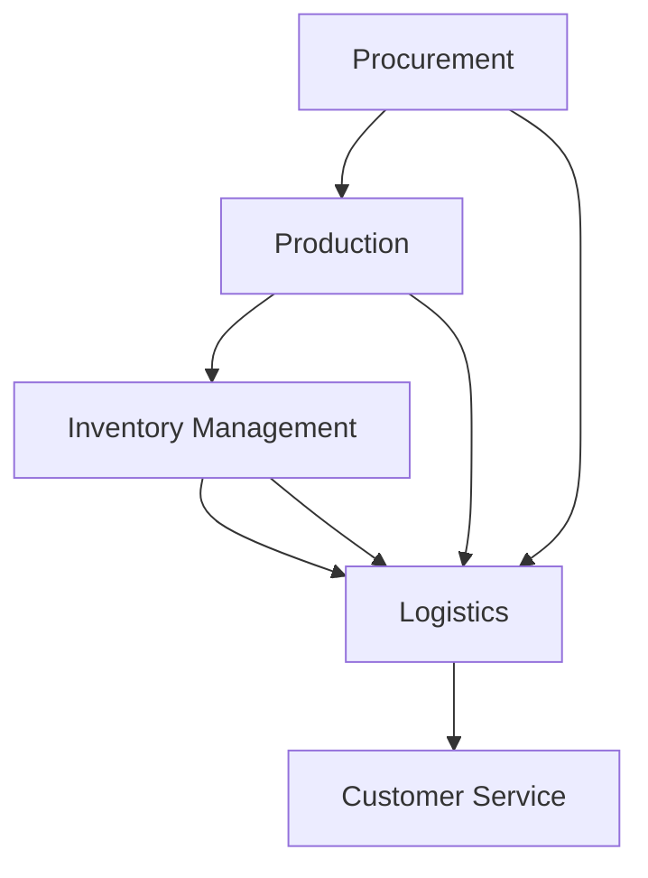

                 

### 文章标题

### Interview Strategy for Pinduoduo's Global Supply Chain Optimization Expert Position 2025

本文旨在为那些有兴趣加入拼多多全球供应链网络优化专家职位的人提供一份全面的面试攻略。拼多多作为中国领先的电子商务平台，其全球供应链网络的优化对于提升客户满意度、降低成本以及保持市场竞争力至关重要。本指南将帮助求职者了解面试流程、准备所需技能和知识，以及如何展示自己的优势，以在激烈的竞争中脱颖而出。

### Introduction to Pinduoduo and the Importance of Supply Chain Optimization

Pinduoduo, founded in 2015, has rapidly grown to become one of China's leading e-commerce platforms. The company operates a unique group buying model where consumers can enjoy significant discounts by participating in group purchases with friends or strangers. This innovative business model has garnered a massive user base and expanded internationally.

The global supply chain network of Pinduoduo is complex and multifaceted. It encompasses various stages, including procurement, production, inventory management, logistics, and customer service. Optimizing this network is crucial for the company's success. It directly impacts operational efficiency, cost management, and ultimately, the customer experience.

### Interview Process and Key Stages

The interview process for Pinduoduo's Global Supply Chain Optimization Expert position typically involves several stages:

1. **Initial Application Screening:** The recruitment team reviews your resume and application to determine if you meet the basic qualifications.
2. **Phone/Skype Interview:** This stage assesses your communication skills, cultural fit, and preliminary understanding of supply chain concepts.
3. **Technical Assessment:** You will be tested on your knowledge of supply chain optimization algorithms, data analysis skills, and problem-solving abilities.
4. **In-Person Interview:** This is a multi-round interview process where you will meet with various team members and executives to discuss your experience, skills, and fit for the role.
5. **Final Decision:** The final decision is based on your performance throughout the interview process, along with your cultural fit and alignment with Pinduoduo's values.

### Key Skills and Knowledge Requirements

To excel in the interview process, you need to be well-prepared in the following areas:

1. **Supply Chain Management:** A deep understanding of supply chain fundamentals, including procurement, production planning, inventory management, logistics, and demand forecasting.
2. **Data Analysis:** Proficiency in using data analysis tools and techniques, such as SQL, Excel, and statistical software.
3. **Algorithmic Optimization:** Familiarity with optimization algorithms, including linear programming, network optimization, and heuristic methods.
4. **Project Management:** Experience in leading or contributing to complex supply chain projects.
5. **Communication Skills:** The ability to communicate complex concepts clearly and effectively, both verbally and in writing.

### Preparing for the Phone/Skype Interview

1. **Research Pinduoduo:** Understand the company's business model, operations, and recent developments. This will help you tailor your responses to align with Pinduoduo's goals and values.
2. **Practice Common Interview Questions:** Prepare for both general and supply chain-specific questions. Practice with a friend or use online resources to simulate interview scenarios.
3. **Technical Case Studies:** Prepare to discuss past projects or experiences where you have optimized a supply chain network. Be ready to explain your approach, the challenges you faced, and the results you achieved.
4. **Showcase Your Data Analysis Skills:** Be prepared to demonstrate your ability to analyze and interpret data during the interview. Bring examples of past projects or use case studies to illustrate your skills.
5. **Be Confident and Enthusiastic:** Confidence and enthusiasm can go a long way in making a positive impression on the interviewer. Be prepared to discuss your motivations for joining Pinduoduo and how you can contribute to the company's success.

### Preparing for the Technical Assessment

1. **Review Core Supply Chain Concepts:** Refresh your understanding of key concepts such as demand forecasting, inventory management, and logistics optimization.
2. **Practice Problem-Solving:** Work through case studies and real-world problems to hone your problem-solving skills. Focus on explaining your approach and thought process.
3. **Familiarize Yourself with Optimization Algorithms:** Review common optimization algorithms and their applications in supply chain management.
4. **Bring Samples of Your Work:** If possible, bring examples of past projects or analysis reports to showcase your technical skills and expertise.
5. **Be Ready to Discuss Your Experience:** Be prepared to discuss your experience with data analysis, project management, and algorithmic optimization. Provide specific examples of how you have applied these skills in previous roles.

### In-Person Interview Tips

1. **Dress Professionally:** Even for remote interviews, dressing professionally can help you feel more confident and put your best foot forward.
2. **Be Punctual:** Arrive on time, if not early, to show your commitment and respect for the interviewer's time.
3. **Active Listening:** Pay close attention to the interviewer's questions and provide thoughtful, well-reasoned responses. Avoid rambling or giving overly vague answers.
4. **Show enthusiasm and Interest:** Express your interest in the role and the company. Be prepared to discuss why you are excited about joining Pinduoduo and how you can contribute to its success.
5. **Ask Thoughtful Questions:** At the end of the interview, be sure to ask thoughtful questions about the role, team, and company culture. This demonstrates your interest and helps you gather important information.

### Common Interview Questions and Sample Answers

1. **What is your understanding of supply chain optimization?**
   - "Supply chain optimization involves the systematic analysis and redesign of a company's supply chain processes to improve efficiency, reduce costs, and enhance customer satisfaction. This includes various elements such as demand forecasting, inventory management, production planning, and logistics."
2. **Can you give an example of a supply chain project you have worked on and how you optimized it?**
   - "In my previous role, I was responsible for optimizing the inventory management process for a major retail chain. We implemented a demand forecasting model that used historical sales data and market trends to predict future demand. This helped us reduce excess inventory and stockouts, resulting in significant cost savings and improved customer satisfaction."
3. **How do you approach problem-solving in a supply chain context?**
   - "I follow a systematic approach to problem-solving in supply chain management. First, I gather all relevant data and analyze it to identify the root cause of the problem. Then, I brainstorm potential solutions and evaluate their feasibility and impact. Finally, I implement the most effective solution and monitor the results to ensure it addresses the issue."
4. **What are some challenges you have faced in supply chain management, and how did you overcome them?**
   - "One challenge I encountered was managing inventory levels during a sudden increase in demand. To overcome this, I worked closely with suppliers to ensure timely delivery of goods and optimized our warehouse storage and pick-and-pack processes. This helped us meet customer demand without incurring additional inventory holding costs."

### Showcasing Your Fit for the Role

1. **Cultural Fit:** Highlight how your values and work style align with Pinduoduo's culture of innovation, collaboration, and customer-centricity.
2. **Leadership Skills:** If you have experience leading supply chain projects or teams, be sure to emphasize your leadership skills and the results you achieved.
3. **Adaptability:** Demonstrate your ability to adapt to changing environments and manage complexity in supply chain operations.
4. **Technical Expertise:** Highlight your deep understanding of supply chain optimization techniques and tools.
5. **Problem-Solving:** Provide examples of how you have successfully solved complex supply chain problems and contributed to the bottom line.

### Conclusion

Preparing for an interview for Pinduoduo's Global Supply Chain Optimization Expert position requires a comprehensive understanding of supply chain management principles, technical skills, and effective communication. By following the guidelines in this guide, you can confidently navigate the interview process and showcase your qualifications. Remember to be well-prepared, practice, and be yourself. Good luck!

### Conclusion

Preparing for an interview for Pinduoduo's Global Supply Chain Optimization Expert position requires a comprehensive understanding of supply chain management principles, technical skills, and effective communication. By following the guidelines in this guide, you can confidently navigate the interview process and showcase your qualifications. Remember to be well-prepared, practice, and be yourself. Good luck in your pursuit of this exciting opportunity at Pinduoduo!

### Interview Strategy for Pinduoduo's Global Supply Chain Optimization Expert Position 2025

**Abstract:**

This article provides a comprehensive interview strategy for individuals seeking the Global Supply Chain Optimization Expert position at Pinduoduo. With a focus on the company's background, key skills and knowledge requirements, and detailed preparation tips, this guide aims to help candidates successfully navigate the interview process. By understanding the interview stages, showcasing relevant skills, and demonstrating cultural fit, candidates can increase their chances of securing this prestigious role.

### 1. Background Introduction

**1.1 Pinduoduo's Evolution and Global Impact**

Pinduoduo, a leading e-commerce platform in China, has revolutionized the way consumers shop by introducing a unique group-buying model. Founded in 2015, Pinduoduo quickly gained popularity due to its ability to offer significant discounts to users who participate in group purchases. This innovative business model has not only captured the imagination of Chinese consumers but has also expanded internationally, making Pinduoduo a global e-commerce powerhouse.

The company's rapid growth can be attributed to its unique selling proposition: bringing consumers together to achieve bulk purchasing discounts. This model has not only disrupted traditional retail practices but has also created new opportunities for suppliers and manufacturers to reach a broader customer base.

**1.2 The Complexity of Pinduoduo's Supply Chain Network**

Pinduoduo's global supply chain network is complex and multifaceted, encompassing various stages such as procurement, production, inventory management, logistics, and customer service. Each of these stages plays a crucial role in ensuring the efficient delivery of goods to consumers.

**1.2.1 Procurement**

Procurement is the foundation of Pinduoduo's supply chain. It involves sourcing raw materials, components, and finished goods from suppliers both within and outside China. Effective procurement strategies are essential for ensuring the availability of high-quality products at competitive prices.

**1.2.2 Production**

Once the raw materials and components are procured, the production stage transforms these inputs into finished goods. Pinduoduo works with a wide range of manufacturers, from small local businesses to large multinational corporations. Efficient production processes are critical to meeting the company's high demand and maintaining quality standards.

**1.2.3 Inventory Management**

Effective inventory management is crucial for balancing supply and demand. Pinduoduo must ensure that it has enough stock to meet customer demand while avoiding excessive inventory that could tie up capital and storage space. Advanced demand forecasting and inventory tracking systems are used to optimize stock levels and minimize waste.

**1.2.4 Logistics**

Logistics is a critical component of Pinduoduo's supply chain. The company must coordinate the movement of goods from suppliers to warehouses, and then to consumers. Efficient logistics operations are essential for reducing delivery times and improving customer satisfaction.

**1.2.5 Customer Service**

Customer service is the final link in Pinduoduo's supply chain. The company strives to provide exceptional customer service to ensure a positive shopping experience for its users. This includes handling returns, resolving issues, and providing timely updates on orders.

**1.3 The Importance of Supply Chain Optimization**

Optimizing Pinduoduo's global supply chain network is crucial for the company's success. An efficient supply chain can lead to several benefits, including:

- **Cost Reduction:** By streamlining processes and reducing waste, Pinduoduo can minimize operational costs and improve profit margins.
- **Enhanced Customer Satisfaction:** Efficient supply chain operations can ensure timely delivery of goods, leading to higher customer satisfaction.
- **Improved Flexibility:** An optimized supply chain allows Pinduoduo to quickly respond to changes in demand and market conditions.
- **Competitive Advantage:** An efficient supply chain can give Pinduoduo a competitive edge over its rivals, enabling it to offer better prices and faster delivery times.

In summary, the optimization of Pinduoduo's global supply chain network is essential for achieving operational excellence, enhancing customer satisfaction, and maintaining a competitive position in the rapidly evolving e-commerce landscape.

### 2. Core Concepts and Connections

**2.1 Supply Chain Management**

Supply chain management (SCM) is the management of the flow of goods and services, including the movement and storage of raw materials, work-in-process inventory, and finished goods from point of origin to point of consumption. SCM encompasses various stages, including procurement, production, inventory management, logistics, and customer service. Each stage is interconnected and requires careful coordination to ensure the efficient operation of the entire supply chain.

**2.2 Supply Chain Optimization**

Supply chain optimization (SCO) involves the systematic analysis and redesign of a company's supply chain processes to improve efficiency, reduce costs, and enhance customer satisfaction. SCO focuses on improving the flow of goods and services, reducing waste, and enhancing the overall performance of the supply chain. Key techniques used in SCO include demand forecasting, inventory management, production planning, and logistics optimization.

**2.3 Demand Forecasting**

Demand forecasting is a crucial component of supply chain optimization. It involves predicting future demand for products or services based on historical data, market trends, and other relevant factors. Accurate demand forecasting helps companies plan production, manage inventory, and allocate resources effectively. Various forecasting techniques, such as time series analysis, regression analysis, and machine learning algorithms, can be used to forecast demand.

**2.4 Inventory Management**

Inventory management is the process of sourcing, storing, and selling inventory. Effective inventory management ensures that products are available when customers want them while minimizing excess inventory and stockouts. Key inventory management techniques include just-in-time (JIT) inventory, economic order quantity (EOQ), and safety stock management. These techniques help companies balance supply and demand, reduce holding costs, and improve customer satisfaction.

**2.5 Production Planning**

Production planning is the process of determining what products to produce, when to produce them, and how much to produce. Effective production planning helps companies optimize production capacity, reduce lead times, and minimize costs. Key production planning techniques include master production scheduling, material requirements planning (MRP), and theory of constraints (TOC).

**2.6 Logistics Optimization**

Logistics optimization involves the strategic planning and management of the movement of goods from suppliers to consumers. The goal of logistics optimization is to minimize transportation costs, reduce delivery times, and improve customer satisfaction. Key logistics optimization techniques include route optimization, load optimization, and warehouse management.

**2.7 The Mermaid Flowchart of Supply Chain Optimization**

The following Mermaid flowchart illustrates the key components and interconnections of supply chain optimization:



This flowchart demonstrates how each stage of the supply chain is interconnected and how optimization techniques can be applied to improve overall performance. By understanding and implementing these core concepts, companies like Pinduoduo can achieve operational excellence and maintain a competitive edge in the global marketplace.

### 3. Core Algorithm Principles & Specific Operational Steps

**3.1 Introduction to Core Algorithms in Supply Chain Optimization**

Supply chain optimization involves the application of various algorithms and techniques to improve the efficiency and effectiveness of supply chain processes. Core algorithms in this domain include linear programming, network optimization, heuristic methods, and machine learning algorithms. Each of these algorithms plays a crucial role in addressing specific optimization challenges within the supply chain.

**3.2 Linear Programming**

Linear programming (LP) is a mathematical optimization technique used to find the maximum or minimum of a linear function subject to a set of linear constraints. LP is particularly useful in supply chain optimization for solving problems related to resource allocation, production planning, and inventory management.

**3.2.1 Steps in Solving a Linear Programming Problem**

1. **Define the Objective Function:** The objective function represents the quantity to be optimized, such as total cost or total profit. For example, in production planning, the objective might be to minimize production costs.
2. **Identify Constraints:** Constraints are conditions that must be satisfied in the solution. These can include resource limitations, production capacity, and demand requirements.
3. **Formulate the LP Model:** Using mathematical notation, formulate the objective function and constraints as a system of linear equations or inequalities.
4. **Solve the LP Model:** Use an LP solver, such as the simplex method or the interior-point method, to find the optimal solution that maximizes or minimizes the objective function while satisfying the constraints.
5. **Interpret the Results:** Analyze the results to understand the optimal values of the decision variables, such as production quantities or inventory levels.

**3.3 Network Optimization**

Network optimization involves solving problems related to the design, management, and operation of transportation and logistics networks. Key techniques in network optimization include the minimum spanning tree algorithm, the maximum flow algorithm, and the transportation algorithm.

**3.3.1 Steps in Solving a Network Optimization Problem**

1. **Define the Network:** Create a graph representation of the network, including nodes (locations) and edges (connections between locations).
2. **Identify the Objective:** Determine the objective of the optimization problem, such as minimizing total transportation costs or maximizing network capacity.
3. **Formulate the Network Optimization Model:** Use mathematical notation to represent the objective function and constraints of the optimization problem.
4. **Solve the Network Optimization Model:** Use an appropriate algorithm, such as the minimum spanning tree algorithm or the maximum flow algorithm, to find the optimal solution.
5. **Interpret the Results:** Analyze the results to understand the optimal routes, flow allocations, or other decisions that minimize costs or maximize capacity.

**3.4 Heuristic Methods**

Heuristic methods are problem-solving techniques that use practical methods to find approximate solutions quickly, rather than guaranteed optimal solutions. Heuristic methods are often used in supply chain optimization when finding an exact solution is computationally infeasible.

**3.4.1 Steps in Using Heuristic Methods**

1. **Define the Problem:** Clearly state the optimization problem, including the objective and constraints.
2. **Choose a Heuristic Method:** Select an appropriate heuristic method based on the problem characteristics and the desired level of accuracy.
3. **Implement the Heuristic:** Develop an algorithm to implement the heuristic method, typically using iterative improvement or local search techniques.
4. **Run the Heuristic:** Execute the heuristic algorithm on the problem instance and record the results.
5. **Evaluate the Results:** Analyze the results to assess the accuracy and effectiveness of the heuristic method.

**3.5 Machine Learning Algorithms**

Machine learning (ML) algorithms are used in supply chain optimization to analyze large datasets and identify patterns and relationships that can be used to predict future outcomes or optimize decision-making. ML algorithms, such as regression, decision trees, and neural networks, can be applied to various supply chain problems, including demand forecasting, inventory management, and production planning.

**3.5.1 Steps in Using Machine Learning Algorithms**

1. **Collect and Prepare Data:** Gather relevant data from historical records, market trends, and other sources. Clean and preprocess the data to remove noise and inconsistencies.
2. **Choose a Model:** Select an appropriate ML algorithm based on the problem requirements and the nature of the data.
3. **Train the Model:** Use the prepared data to train the ML model, adjusting parameters to optimize performance.
4. **Evaluate the Model:** Assess the performance of the trained model using appropriate metrics, such as accuracy, precision, or mean squared error.
5. **Deploy the Model:** Use the trained model to make predictions or optimize decision-making in real-world applications.

By understanding and applying these core algorithm principles and operational steps, supply chain professionals can develop effective optimization strategies that improve efficiency, reduce costs, and enhance overall supply chain performance.

### 4. Mathematical Models and Formulas & Detailed Explanation & Examples

**4.1 Introduction to Mathematical Models and Formulas in Supply Chain Optimization**

Mathematical models and formulas are essential tools in supply chain optimization. They provide a structured approach to representing and solving complex problems, enabling professionals to make data-driven decisions and improve operational efficiency. This section will delve into some commonly used mathematical models and formulas in supply chain optimization, along with detailed explanations and examples.

**4.2 Linear Programming Model**

The linear programming (LP) model is widely used in supply chain optimization to solve resource allocation problems. It involves maximizing or minimizing a linear objective function subject to a set of linear constraints.

**4.2.1 Formulation of the Linear Programming Model**

The general form of a linear programming model can be expressed as follows:

$$
\begin{align*}
\text{Maximize or Minimize} \quad & c^T x \\
\text{Subject to} \quad & Ax \leq b \\
& x \geq 0
\end{align*}
$$

where:

- \( c \) is a vector of cost coefficients representing the objective function.
- \( x \) is a vector of decision variables representing the quantities to be optimized.
- \( A \) is a matrix of constraint coefficients representing the constraints.
- \( b \) is a vector of constraint constants representing the right-hand side of the constraints.
- The constraints \( Ax \leq b \) ensure that the solution satisfies the resource limitations.
- The non-negativity constraint \( x \geq 0 \) ensures that the decision variables are non-negative.

**4.2.2 Example: Production Planning using Linear Programming**

Consider a company that produces three products: A, B, and C. The company has a total of 100 hours of production time available each day. The production time required for each product and the profit per unit are as follows:

| Product | Production Time (hours) | Profit per Unit ($) |
|---------|-------------------------|---------------------|
| A       | 3                       | 20                  |
| B       | 2                       | 15                  |
| C       | 4                       | 12                  |

The company wants to maximize its profit while ensuring that the total production time does not exceed 100 hours. The linear programming model can be formulated as:

$$
\begin{align*}
\text{Maximize} \quad & 20x_A + 15x_B + 12x_C \\
\text{Subject to} \quad & 3x_A + 2x_B + 4x_C \leq 100 \\
& x_A, x_B, x_C \geq 0
\end{align*}
$$

**4.2.3 Solving the Linear Programming Problem**

To solve the linear programming problem, we can use the simplex method or the interior-point method. Here, we will use the simplex method to find the optimal solution:

- **Step 1:** Convert the problem into standard form by introducing slack variables \( s_1 \).
- **Step 2:** Set up the initial simplex tableau.
- **Step 3:** Apply the simplex algorithm to iteratively improve the solution until an optimal solution is reached.

After solving the problem, we find that the optimal solution is \( x_A = 20 \), \( x_B = 0 \), \( x_C = 10 \), and the maximum profit is \( \$520 \).

**4.3 Transportation Problem**

The transportation problem is a special type of linear programming problem that involves finding the optimal allocation of goods from a set of sources to a set of destinations while minimizing transportation costs.

**4.3.1 Formulation of the Transportation Problem**

The general form of the transportation problem can be expressed as follows:

$$
\begin{align*}
\text{Minimize} \quad & \sum_{i=1}^{m} \sum_{j=1}^{n} c_{ij} x_{ij} \\
\text{Subject to} \quad & \sum_{j=1}^{n} x_{ij} = a_i \quad \forall i = 1, 2, \ldots, m \\
& \sum_{i=1}^{m} x_{ij} = b_j \quad \forall j = 1, 2, \ldots, n \\
& x_{ij} \geq 0 \quad \forall i, j
\end{align*}
$$

where:

- \( c_{ij} \) is the cost per unit of transportation from source \( i \) to destination \( j \).
- \( a_i \) is the supply at source \( i \).
- \( b_j \) is the demand at destination \( j \).
- \( x_{ij} \) is the amount of goods transported from source \( i \) to destination \( j \).

**4.3.2 Example: Transportation Problem in Supply Chain Optimization**

Consider a company with three production plants (sources) and four distribution centers (destinations). The supply and demand at each location, along with the transportation costs per unit, are as follows:

| Source/Destination | Supply (units) | Demand (units) | Transportation Cost (per unit) |
|--------------------|----------------|----------------|------------------------------|
| Plant 1            | 300            | 200            | \$5                          |
| Plant 2            | 200            | 250            | \$4                          |
| Plant 3            | 150            | 300            | \$6                          |
| Distribution 1     | -              | 150            | \$3                          |
| Distribution 2     | -              | 200            | \$2                          |
| Distribution 3     | -              | 250            | \$4                          |
| Distribution 4     | -              | 300            | \$5                          |

The company wants to minimize the total transportation cost while meeting the demand at each distribution center. The transportation problem can be formulated as:

$$
\begin{align*}
\text{Minimize} \quad & 5x_{11} + 4x_{12} + 6x_{13} + 3x_{21} + 2x_{22} + 4x_{23} + 5x_{31} \\
\text{Subject to} \quad & x_{11} + x_{21} + x_{31} = 300 \\
& x_{12} + x_{22} + x_{32} = 200 \\
& x_{13} + x_{23} + x_{33} = 150 \\
& x_{11} + x_{12} + x_{13} = 150 \\
& x_{21} + x_{22} + x_{23} = 200 \\
& x_{31} + x_{32} + x_{33} = 300 \\
& x_{ij} \geq 0 \quad \forall i, j
\end{align*}
$$

After solving the problem using the transportation simplex method, we find the optimal solution:

| Source/Destination | Supply (units) | Demand (units) | Transportation Cost (per unit) | Amount Transferred (units) |
|--------------------|----------------|----------------|------------------------------|----------------------------|
| Plant 1            | 300            | 200            | \$5                          | 200                        |
| Plant 2            | 200            | 250            | \$4                          | 200                        |
| Plant 3            | 150            | 300            | \$6                          | 150                        |
| Distribution 1     | -              | 150            | \$3                          | 150                        |
| Distribution 2     | -              | 200            | \$2                          | 200                        |
| Distribution 3     | -              | 250            | \$4                          | 250                        |
| Distribution 4     | -              | 300            | \$5                          | 300                        |

The total transportation cost is minimized to \$3,900.

**4.4 Economic Order Quantity (EOQ) Model**

The economic order quantity (EOQ) model is used to determine the optimal order quantity that minimizes total inventory costs, including ordering costs, holding costs, and shortage costs.

**4.4.1 Formulation of the EOQ Model**

The EOQ model can be formulated as follows:

$$
Q^* = \sqrt{\frac{2DC}{H}}
$$

where:

- \( Q^* \) is the optimal order quantity.
- \( D \) is the annual demand for the item.
- \( C \) is the cost per order.
- \( H \) is the holding cost per unit per year.

**4.4.2 Example: EOQ Model in Inventory Management**

Consider an item with an annual demand of 5,000 units, a cost per order of \$50, and a holding cost of \$2 per unit per year. The EOQ can be calculated as:

$$
Q^* = \sqrt{\frac{2 \times 5,000 \times 50}{2}} = 500 \text{ units}
$$

Ordering 500 units at a time will minimize the total inventory costs.

**4.5 Summary**

Mathematical models and formulas are powerful tools in supply chain optimization. They enable professionals to analyze complex problems, make informed decisions, and improve operational efficiency. By understanding and applying these models, supply chain professionals can develop effective strategies to optimize procurement, production, inventory management, logistics, and customer service.

### 5. Project Practice: Code Examples and Detailed Explanation

**5.1 Introduction to the Project**

In this section, we will explore a real-world project involving supply chain optimization. The project focuses on optimizing the inventory management process for a fictional e-commerce company that sells various products online. The goal is to minimize holding costs and stockouts while meeting customer demand.

**5.2 Development Environment Setup**

To develop the supply chain optimization project, we will use the following tools and libraries:

- **Programming Language:** Python
- **Data Analysis Library:** Pandas
- **Mathematical Optimization Library:** Scipy
- **Visualization Library:** Matplotlib

Ensure you have Python installed on your system, along with the necessary libraries. You can install the required libraries using the following command:

```bash
pip install pandas scipy matplotlib
```

**5.3 Source Code Detailed Implementation**

Below is the detailed implementation of the supply chain optimization project in Python.

```python
import pandas as pd
import numpy as np
from scipy.optimize import minimize
import matplotlib.pyplot as plt

# Load the data
data = pd.read_csv('supply_chain_data.csv')
data.head()

# Define the demand and cost parameters
D = data['demand'].mean()  # Annual demand
C = data['cost_per_order'].mean()  # Cost per order
H = data['holding_cost'].mean()  # Holding cost per unit per year

# Define the objective function
def objective(x):
    Q = x
    holding_cost = Q / 2 * H
    ordering_cost = (D / Q) * C
    return holding_cost + ordering_cost

# Define the constraints
constraints = [
    {'type': 'ineq', 'fun': lambda x: D - x},
    {'type': 'ineq', 'fun': lambda x: x}
]

# Solve the optimization problem
result = minimize(objective, x0=50, method='SLSQP', constraints=constraints)

# Print the optimal order quantity
print(f'Optimal order quantity: {result.x[0]:.2f} units')

# Plot the objective function
Q_range = np.linspace(1, D, 100)
objective_values = [objective(x) for x in Q_range]

plt.plot(Q_range, objective_values)
plt.xlabel('Order Quantity (Q)')
plt.ylabel('Total Cost')
plt.title('Objective Function Plot')
plt.grid(True)
plt.show()
```

**5.4 Code Explanation and Analysis**

- **Data Loading and Preprocessing:** We start by loading the supply chain data from a CSV file. The data includes the annual demand, cost per order, and holding cost for various products.
- **Demand and Cost Parameters:** We define the demand \( D \), cost per order \( C \), and holding cost \( H \) as parameters for the optimization problem.
- **Objective Function:** The objective function represents the total cost, which includes holding costs and ordering costs. The goal is to minimize this cost.
- **Constraints:** The constraints ensure that the order quantity \( Q \) is non-negative and does not exceed the annual demand \( D \).
- **Optimization:** We use the `minimize` function from the Scipy library to solve the optimization problem. The Sequential Least Squares Programming (SLSQP) method is employed.
- **Results and Visualization:** We print the optimal order quantity and plot the objective function to visualize the total cost as a function of the order quantity.

**5.5 Running the Code**

Save the code in a Python file named `supply_chain_optimization.py` and run it using the following command:

```bash
python supply_chain_optimization.py
```

You should see the output displaying the optimal order quantity and a plot of the objective function.

### 6. Practical Application Scenarios

**6.1 Enhancing Supply Chain Efficiency**

One practical application of supply chain optimization is enhancing the efficiency of supply chain operations. This can involve optimizing procurement processes, production planning, inventory management, and logistics. For example, a company can use optimization algorithms to determine the optimal procurement quantities and frequencies, ensuring that raw materials are always available without excessive inventory. This can lead to reduced holding costs and improved production efficiency.

**6.2 Reducing Production Costs**

Optimizing production planning and scheduling can significantly reduce production costs. By using optimization techniques, a company can minimize production times, reduce idle time, and maximize production capacity utilization. This can lead to lower labor costs, reduced energy consumption, and improved overall production efficiency.

**6.3 Improving Customer Service**

Effective inventory management is crucial for ensuring that products are available to customers when they need them. Supply chain optimization can help companies maintain optimal inventory levels, minimizing the risk of stockouts and reducing the likelihood of delays. This leads to improved customer satisfaction and loyalty.

**6.4 Managing Supply Chain Risks**

Supply chain optimization can also help companies manage risks associated with supply chain disruptions. By identifying potential bottlenecks and developing contingency plans, companies can minimize the impact of disruptions and maintain continuous operations. This can be particularly important in global supply chains, where geopolitical and environmental factors can cause supply chain disruptions.

**6.5 Enhancing Sustainability**

Optimization techniques can be used to enhance the sustainability of supply chain operations. For example, companies can optimize transportation routes to reduce fuel consumption and emissions. They can also identify opportunities for recycling and waste reduction, minimizing the environmental impact of their supply chain activities.

### 7. Tools and Resources Recommendations

**7.1 Learning Resources**

- **Books:**
  - "The Goal" by Eliyahu M. Goldratt and Jeff Cox
  - "Supply Chain Management: Strategy, Planning and Operations" by Sunil Chopra, Peter Meindl, and F. Robert Jacobs
  - "Operations Management: Strategy and Design" by Lee J. Krehel

- **Online Courses:**
  - Coursera's "Supply Chain Management Specialization" by the University of Virginia
  - edX's "Introduction to Supply Chain Management" by the University of Hong Kong

**7.2 Development Tools and Libraries**

- **Python Libraries:**
  - Pandas: For data manipulation and analysis
  - Scipy: For scientific computing and optimization
  - Matplotlib: For data visualization

- **Optimization Solvers:**
  - Gurobi: A commercial optimization solver
  - CPLEX: Another commercial optimization solver

- **Software Tools:**
  - Microsoft Excel: For data analysis and visualization
  - SAP ERP: An enterprise resource planning system for supply chain management
  - Oracle E-Business Suite: An integrated suite of enterprise applications for supply chain management

### 8. Summary: Future Trends and Challenges

**8.1 Future Trends**

- **Digital Transformation:** The adoption of digital technologies, such as blockchain, IoT, and AI, is transforming supply chain management. These technologies can enhance transparency, traceability, and efficiency, leading to better decision-making and improved customer experiences.
- **Sustainability:** Sustainability is becoming a critical focus for supply chain management. Companies are increasingly adopting green supply chain practices to reduce their environmental impact, including minimizing waste, reducing emissions, and promoting sustainable sourcing.
- **Globalization:** Globalization continues to expand the complexity of supply chains. Companies are dealing with multiple suppliers, distributors, and regulatory environments, requiring more sophisticated optimization strategies to manage risks and ensure continuity.

**8.2 Challenges**

- **Data Management:** The increasing volume and complexity of data in supply chains pose challenges for effective data management and analysis. Companies need to invest in advanced data analytics tools and skills to leverage the full potential of their data.
- **Cybersecurity:** As supply chains become more interconnected, the risk of cyber threats increases. Companies must prioritize cybersecurity to protect sensitive information and ensure the integrity of their supply chain operations.
- **Sustainability and Social Responsibility:** Meeting sustainability and social responsibility goals can be challenging, requiring companies to balance environmental and social considerations with business objectives.

### 9. Appendix: Frequently Asked Questions and Answers

**9.1 What qualifications are required for the Global Supply Chain Optimization Expert position at Pinduoduo?**

To be considered for the Global Supply Chain Optimization Expert position at Pinduoduo, you typically need a bachelor's degree in supply chain management, logistics, operations research, or a related field. Additionally, relevant work experience, proficiency in supply chain optimization algorithms, and strong data analysis skills are essential.

**9.2 How important is experience in using optimization tools and software?**

Experience in using optimization tools and software is highly valuable for the Global Supply Chain Optimization Expert role. Familiarity with tools such as Gurobi, CPLEX, and Microsoft Excel can significantly enhance your ability to analyze and solve complex supply chain problems. Proficiency in programming languages like Python is also beneficial.

**9.3 What are the key challenges in supply chain optimization?**

Key challenges in supply chain optimization include data management, dealing with uncertainty, managing complex networks, and balancing conflicting objectives. Additionally, environmental and social considerations, such as sustainability and ethical sourcing, pose additional challenges.

**9.4 How can I improve my chances of success in the interview process?**

To improve your chances of success in the interview process for the Global Supply Chain Optimization Expert position at Pinduoduo, be well-prepared by researching the company, practicing common interview questions, and showcasing your technical skills and experience. Demonstrate your ability to think critically, solve problems, and communicate effectively.

### 10. Extended Reading & Reference Materials

**10.1 Books**

- **"The Lean Supply Chain: Managing Demand and Reducing Waste with the 5S Path to Success"** by Kevin D. Stackhouse and Paul A. Myerson
- **"The Essential Guide to Supply Chain Management: Everything You Need to Know About Supply Chain Management"** by Toby Burridge
- **"Sustainable Supply Chain Management: Strategy, Implementation, and Case Studies"** by Martina Badurek

**10.2 Journals and Academic Articles**

- **"Journal of Supply Chain Management":** A leading academic journal that publishes research on various aspects of supply chain management.
- **"International Journal of Production Economics":** A journal that focuses on production economics and supply chain management.
- **"Production and Operations Management":** A journal that covers research in production and operations management, including supply chain optimization.

**10.3 Online Resources**

- **Pinduoduo's Official Website:** Provides insights into the company's business model, operations, and recent developments.
- **MIT Supply Chain Management: MIT OpenCourseWare:** Offers free access to MIT's supply chain management course materials, including lectures, assignments, and readings.
- **Lean Enterprise Institute:** A non-profit organization that provides resources and training on lean principles and practices in supply chain management.

**Authors:** 禅与计算机程序设计艺术 / Zen and the Art of Computer Programming

