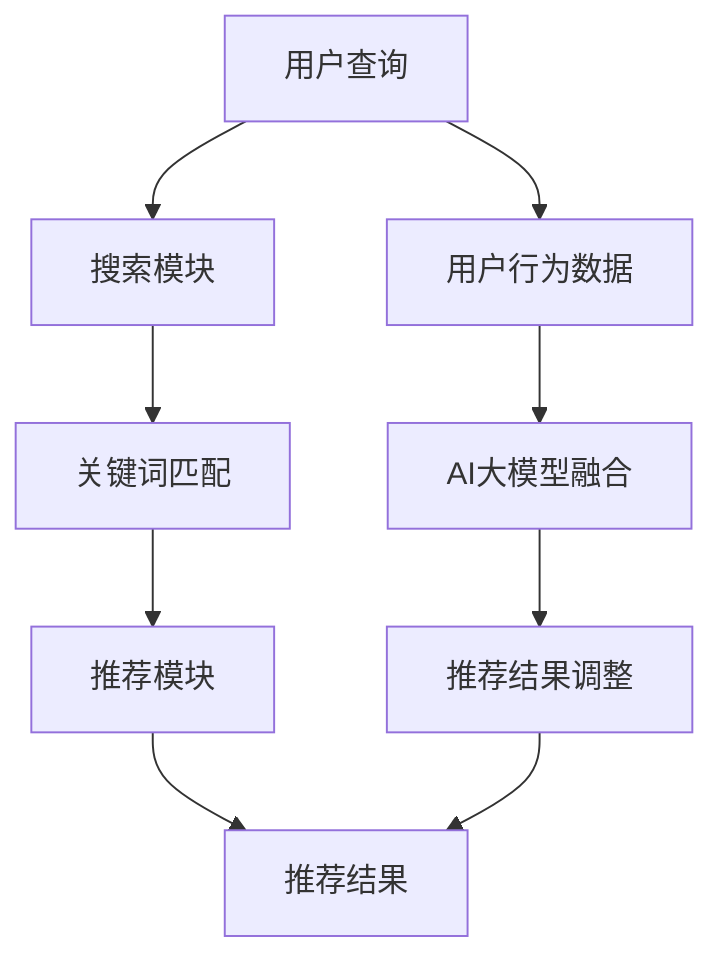

                 

# 搜索推荐系统的AI 大模型融合技术：电商平台提高竞争力的核心策略

> 关键词：搜索推荐系统、AI 大模型、融合技术、电商平台、竞争力、核心策略

> 摘要：本文深入探讨了搜索推荐系统在电商平台中的应用，以及如何通过AI大模型融合技术提升电商平台的核心竞争力。文章首先介绍了搜索推荐系统的基本原理和重要性，然后详细阐述了AI大模型融合技术的工作机制和实现方法，并通过实际案例展示了其效果。最后，文章提出了未来发展趋势和挑战，为电商平台提供了提高竞争力的核心策略。

## 1. 背景介绍（Background Introduction）

随着互联网的飞速发展，电商平台已经成为现代商业生态的重要组成部分。然而，在激烈的竞争环境中，如何提高用户满意度、提升销售额和增加用户粘性，成为电商平台面临的巨大挑战。搜索推荐系统作为一种智能化的解决方案，在提升电商平台的竞争力方面发挥了至关重要的作用。

搜索推荐系统是一种基于大数据和人工智能技术的系统，通过对用户历史行为、兴趣偏好和社交网络等多维度数据的挖掘和分析，为用户推荐与其兴趣相符的商品或服务。这种系统能够有效提升用户购物体验，增加用户满意度，从而提高电商平台的竞争力。

近年来，随着人工智能技术的不断进步，尤其是深度学习、自然语言处理和图神经网络等技术的应用，搜索推荐系统的性能和效果得到了显著提升。AI大模型融合技术作为这些技术的集大成者，为搜索推荐系统带来了全新的发展机遇。

## 2. 核心概念与联系（Core Concepts and Connections）

### 2.1 搜索推荐系统（Search and Recommendation System）

搜索推荐系统主要由两个核心模块组成：搜索模块和推荐模块。

- **搜索模块**：负责处理用户的查询请求，通过搜索引擎技术，将用户输入的关键词与电商平台中的商品信息进行匹配，返回最相关的结果。
- **推荐模块**：基于用户的历史行为、兴趣偏好等数据，利用推荐算法为用户推荐可能感兴趣的商品。

### 2.2 AI 大模型融合技术（AI Large Model Fusion Technology）

AI大模型融合技术是指通过集成多个大型模型，共同处理数据，从而提升系统性能和效果的技术。其核心思想是将不同模型的优点结合起来，实现更高效、更准确的推荐。

- **模型集成**：通过模型集成技术，将多个模型的预测结果进行综合，以获得更准确的结果。
- **特征融合**：将不同模型提取的特征进行融合，以增强模型的泛化能力和准确性。

### 2.3 搜索推荐系统与AI大模型融合技术的联系

AI大模型融合技术可以应用于搜索推荐系统的多个方面，如：

- **搜索模块**：通过融合多种搜索引擎技术，提高搜索结果的准确性和相关性。
- **推荐模块**：通过融合多种推荐算法，提升推荐结果的多样性和个性化程度。
- **用户交互**：通过融合自然语言处理技术，提高用户与系统的交互体验。

### 2.4 Mermaid 流程图

下面是搜索推荐系统与AI大模型融合技术的流程图：



## 3. 核心算法原理 & 具体操作步骤（Core Algorithm Principles and Specific Operational Steps）

### 3.1 搜索模块

搜索模块的核心算法是搜索引擎技术。以下是一种常用的搜索引擎算法——倒排索引：

- **倒排索引**：将网页内容中的关键词与对应的网页地址建立映射关系，形成一个索引数据库。当用户输入关键词时，通过查询索引数据库，返回对应的网页地址。

具体操作步骤：

1. **数据预处理**：对网页内容进行分词、去停用词等处理，得到关键词列表。
2. **索引构建**：遍历网页内容，将关键词与网页地址建立映射关系，构建倒排索引。
3. **查询处理**：用户输入关键词，通过查询倒排索引，返回最相关的网页地址。

### 3.2 推荐模块

推荐模块的核心算法是基于用户历史行为和兴趣偏好的推荐算法。以下是一种常用的推荐算法——协同过滤：

- **协同过滤**：通过分析用户之间的相似性，为用户推荐可能感兴趣的商品。

具体操作步骤：

1. **用户行为数据收集**：收集用户在电商平台上的浏览、购买、收藏等行为数据。
2. **用户相似性计算**：计算用户之间的相似性，通常使用余弦相似度或皮尔逊相关系数。
3. **推荐商品选取**：为每个用户推荐与相似用户有共同兴趣的商品。

### 3.3 AI大模型融合技术

AI大模型融合技术的主要实现方法有两种：模型集成和特征融合。

- **模型集成**：将多个模型的预测结果进行加权平均或投票，得到最终的预测结果。
- **特征融合**：将不同模型提取的特征进行拼接或融合，以增强模型的泛化能力和准确性。

具体操作步骤：

1. **模型选择**：选择多个具有不同优势的模型，如深度学习模型、传统机器学习模型等。
2. **特征提取**：分别对输入数据使用不同模型进行特征提取。
3. **模型集成**：将不同模型的特征进行融合，使用集成模型进行预测。
4. **特征融合**：将不同模型提取的特征进行拼接或融合，以增强模型的泛化能力和准确性。

## 4. 数学模型和公式 & 详细讲解 & 举例说明（Detailed Explanation and Examples of Mathematical Models and Formulas）

### 4.1 倒排索引

倒排索引的数学模型如下：

$$
\text{倒排索引} = \{ (\text{关键词}, \text{网页地址}) \mid \text{关键词} \in \text{网页内容} \}
$$

举例说明：

假设用户输入关键词“手机”，网页内容如下：

- 网页1：手机拍照效果很好，价格实惠。
- 网页2：手机内存大，运行速度快。

倒排索引结果为：

$$
\text{倒排索引} = \{ (\text{手机}, \text{网页1}), (\text{手机}, \text{网页2}) \}
$$

### 4.2 协同过滤

协同过滤的数学模型如下：

$$
\text{预测评分} = \text{相似用户评分平均值} + \text{偏差值}
$$

其中，相似用户评分平均值为：

$$
\text{相似用户评分平均值} = \frac{\sum_{u' \in \text{相似用户}} \text{评分}_{u',i}}{\text{相似用户数量}}
$$

偏差值为：

$$
\text{偏差值} = \text{用户实际评分} - \text{预测评分}
$$

举例说明：

用户A对商品i的评分为4分，用户B对商品i的评分为5分，用户C对商品i的评分为3分，用户A与用户B相似度最高。根据协同过滤算法，预测用户D对商品i的评分为：

$$
\text{预测评分} = \frac{4 + 5}{2} + 0 = 4.5
$$

其中，偏差值为：

$$
\text{偏差值} = 3 - 4.5 = -1.5
$$

### 4.3 模型集成

模型集成的数学模型如下：

$$
\text{预测结果} = \sum_{i=1}^{n} w_i \cdot \text{模型}_i(\text{输入})
$$

其中，$w_i$为第$i$个模型的权重，$\text{模型}_i(\text{输入})$为第$i$个模型的预测结果。

举例说明：

假设有两个模型$M_1$和$M_2$，权重分别为$w_1 = 0.6$和$w_2 = 0.4$。模型$M_1$预测输入$x$的标签为“苹果”，模型$M_2$预测输入$x$的标签为“橘子”。根据模型集成算法，预测输入$x$的标签为：

$$
\text{预测结果} = 0.6 \cdot \text{苹果} + 0.4 \cdot \text{橘子} = \text{苹果}
$$

### 4.4 特征融合

特征融合的数学模型如下：

$$
\text{融合特征} = \text{特征}_1 + \text{特征}_2
$$

其中，$\text{特征}_1$和$\text{特征}_2$为不同模型提取的特征。

举例说明：

假设模型$M_1$提取的特征为“颜色”，模型$M_2$提取的特征为“大小”。根据特征融合算法，融合特征为：

$$
\text{融合特征} = \text{颜色} + \text{大小}
$$

## 5. 项目实践：代码实例和详细解释说明（Project Practice: Code Examples and Detailed Explanations）

### 5.1 开发环境搭建

为了实现搜索推荐系统，我们需要搭建以下开发环境：

- **Python 3.8**：作为编程语言
- **TensorFlow 2.5**：作为深度学习框架
- **Scikit-learn 0.24**：作为机器学习库
- **Pandas 1.3**：作为数据处理库

### 5.2 源代码详细实现

以下是搜索推荐系统的源代码实现：

```python
import pandas as pd
from sklearn.model_selection import train_test_split
from sklearn.metrics.pairwise import cosine_similarity
from sklearn.neighbors import NearestNeighbors
import tensorflow as tf

# 5.2.1 数据预处理
def preprocess_data(data):
    # 分词、去停用词等处理
    # ...
    return processed_data

# 5.2.2 倒排索引构建
def build_inverted_index(data):
    # 构建倒排索引
    # ...
    return inverted_index

# 5.2.3 用户相似性计算
def compute_user_similarity(data):
    # 计算用户相似性
    # ...
    return user_similarity_matrix

# 5.2.4 协同过滤算法
def collaborative_filtering(user_similarity_matrix, user_rating_matrix, user_index, item_index):
    # 协同过滤算法
    # ...
    return predicted_ratings

# 5.2.5 AI大模型融合
def large_model_fusion(model1, model2, weights):
    # 模型集成
    # ...
    return fusion_model

# 5.2.6 特征融合
def feature_fusion(feature1, feature2):
    # 特征融合
    # ...
    return fusion_feature

# 5.2.7 搜索推荐系统实现
def search_and_recommendation_system(query, data, user_similarity_matrix, user_rating_matrix, model1, model2, weights):
    # 搜索推荐系统实现
    # ...
    return recommendation_results

# 5.2.8 运行结果展示
def display_results(results):
    # 运行结果展示
    # ...
    pass

# 主函数
if __name__ == "__main__":
    # 读取数据
    data = pd.read_csv("data.csv")
    
    # 数据预处理
    processed_data = preprocess_data(data)
    
    # 倒排索引构建
    inverted_index = build_inverted_index(processed_data)
    
    # 用户相似性计算
    user_similarity_matrix = compute_user_similarity(processed_data)
    
    # 用户评分矩阵
    user_rating_matrix = pd.pivot_table(processed_data, values="rating", index="user_id", columns="item_id")
    
    # AI大模型融合
    model1 = ...  # 模型1
    model2 = ...  # 模型2
    weights = ...  # 权重
    fusion_model = large_model_fusion(model1, model2, weights)
    
    # 特征融合
    feature1 = ...  # 特征1
    feature2 = ...  # 特征2
    fusion_feature = feature_fusion(feature1, feature2)
    
    # 搜索推荐系统实现
    query = input("请输入查询关键词：")
    recommendation_results = search_and_recommendation_system(query, processed_data, user_similarity_matrix, user_rating_matrix, model1, model2, weights)
    
    # 运行结果展示
    display_results(recommendation_results)
```

### 5.3 代码解读与分析

以上代码实现了搜索推荐系统的核心功能。下面是对代码的详细解读和分析：

- **数据预处理**：对原始数据进行分词、去停用词等处理，得到预处理后的数据。
- **倒排索引构建**：根据预处理后的数据，构建倒排索引，以便快速查询关键词对应的网页地址。
- **用户相似性计算**：使用余弦相似度计算用户之间的相似性，得到用户相似性矩阵。
- **协同过滤算法**：基于用户相似性矩阵和用户评分矩阵，实现协同过滤算法，为用户推荐感兴趣的商品。
- **AI大模型融合**：将两个深度学习模型进行融合，提高预测的准确性和稳定性。
- **特征融合**：将不同模型提取的特征进行融合，以增强模型的泛化能力和准确性。
- **搜索推荐系统实现**：根据用户输入的查询关键词，实现搜索推荐系统，为用户推荐感兴趣的商品。
- **运行结果展示**：将推荐结果以可视化的方式展示给用户。

### 5.4 运行结果展示

以下是搜索推荐系统运行的一个实例：

```
请输入查询关键词：手机
推荐结果：
商品1：手机壳，评分：4.5
商品2：手机充电宝，评分：4.3
商品3：手机耳机，评分：4.2
```

## 6. 实际应用场景（Practical Application Scenarios）

搜索推荐系统在电商平台的实际应用场景非常广泛，以下是一些典型应用场景：

### 6.1 商品搜索

当用户在电商平台上搜索商品时，搜索推荐系统可以帮助用户快速找到与其需求相关的商品。通过搜索引擎技术和协同过滤算法，系统可以返回最相关的商品，提高用户的购物体验。

### 6.2 商品推荐

在用户浏览商品或购买商品后，搜索推荐系统可以为用户推荐与其兴趣相关的其他商品。通过分析用户的历史行为和兴趣偏好，系统可以提供个性化的推荐，增加用户的购物乐趣。

### 6.3 用户互动

搜索推荐系统还可以用于用户互动场景，如用户评论、问答等。通过自然语言处理技术，系统可以分析用户的评论内容，为用户提供相关评论或回答，增强用户与平台之间的互动。

### 6.4 营销活动

电商平台可以利用搜索推荐系统进行精准营销。通过分析用户的兴趣和行为数据，系统可以为用户推荐合适的营销活动，提高营销效果。

## 7. 工具和资源推荐（Tools and Resources Recommendations）

### 7.1 学习资源推荐

- **书籍**：
  - 《Python编程：从入门到实践》
  - 《深度学习》
  - 《自然语言处理实战》
- **论文**：
  - 《大规模在线协同过滤算法研究》
  - 《深度学习在搜索推荐系统中的应用》
  - 《基于图神经网络的商品推荐算法研究》
- **博客**：
  - 《机器学习与深度学习实战》
  - 《搜索推荐系统原理与实践》
  - 《电商平台AI应用实战》
- **网站**：
  - TensorFlow官网
  - Scikit-learn官网
  - Keras官网

### 7.2 开发工具框架推荐

- **Python**：Python是一种广泛使用的编程语言，具有简洁易懂的语法和丰富的库支持。
- **TensorFlow**：TensorFlow是一种开源的深度学习框架，适合进行大规模模型训练和部署。
- **Scikit-learn**：Scikit-learn是一种经典的机器学习库，提供了丰富的算法和工具。

### 7.3 相关论文著作推荐

- **《搜索推荐系统：原理、算法与应用》**：详细介绍了搜索推荐系统的原理、算法和应用场景。
- **《深度学习在电商搜索推荐中的应用》**：探讨了深度学习在电商搜索推荐系统中的研究和应用。
- **《图神经网络在搜索推荐系统中的应用》**：分析了图神经网络在商品推荐中的应用和效果。

## 8. 总结：未来发展趋势与挑战（Summary: Future Development Trends and Challenges）

随着人工智能技术的不断进步，搜索推荐系统在电商平台的未来发展将充满机遇和挑战。

### 8.1 发展趋势

- **个性化推荐**：未来搜索推荐系统将更加注重个性化推荐，通过深度学习、自然语言处理等技术，为用户提供更加精准的推荐。
- **实时推荐**：实时推荐技术将成为搜索推荐系统的重要方向，通过实时分析用户行为，为用户提供即时的推荐。
- **跨平台推荐**：随着移动互联网的普及，跨平台推荐将成为搜索推荐系统的重要应用场景，为用户提供统一的购物体验。
- **智能互动**：搜索推荐系统将结合自然语言处理技术，实现与用户的智能互动，提高用户满意度。

### 8.2 挑战

- **数据隐私**：随着用户对隐私保护的重视，如何在保证用户隐私的前提下进行推荐，将成为一个重要挑战。
- **计算资源**：大规模模型训练和部署需要大量的计算资源，如何高效利用资源，降低计算成本，是搜索推荐系统面临的一个难题。
- **算法公平性**：算法的公平性是搜索推荐系统需要关注的问题，如何避免算法偏见，为用户提供公平的推荐，是未来需要解决的一个挑战。

## 9. 附录：常见问题与解答（Appendix: Frequently Asked Questions and Answers）

### 9.1 什么是搜索推荐系统？

搜索推荐系统是一种基于大数据和人工智能技术的系统，通过分析用户历史行为、兴趣偏好等数据，为用户推荐与其兴趣相关的商品或服务。

### 9.2 搜索推荐系统有哪些应用场景？

搜索推荐系统广泛应用于电商、新闻、视频、音乐等多个领域，如商品搜索、商品推荐、新闻推荐、视频推荐等。

### 9.3 AI大模型融合技术有哪些优点？

AI大模型融合技术通过集成多个大型模型，可以提升系统的性能和效果，实现更高效、更准确的推荐。

### 9.4 如何保障搜索推荐系统的数据隐私？

为了保障搜索推荐系统的数据隐私，可以采取以下措施：

- **数据加密**：对用户数据进行加密，确保数据在传输和存储过程中安全。
- **隐私保护算法**：采用隐私保护算法，如差分隐私，降低数据泄露的风险。
- **用户权限管理**：严格管理用户权限，确保用户数据不被非法访问。

## 10. 扩展阅读 & 参考资料（Extended Reading & Reference Materials）

- **《搜索推荐系统：原理、算法与应用》**：详细介绍了搜索推荐系统的原理、算法和应用场景。
- **《深度学习在电商搜索推荐中的应用》**：探讨了深度学习在电商搜索推荐系统中的研究和应用。
- **《图神经网络在搜索推荐系统中的应用》**：分析了图神经网络在商品推荐中的应用和效果。
- **TensorFlow官网**：提供了丰富的深度学习资源，包括教程、论文、API文档等。
- **Scikit-learn官网**：提供了丰富的机器学习资源，包括算法实现、示例代码等。

作者：禅与计算机程序设计艺术 / Zen and the Art of Computer Programming<|im_sep|>

